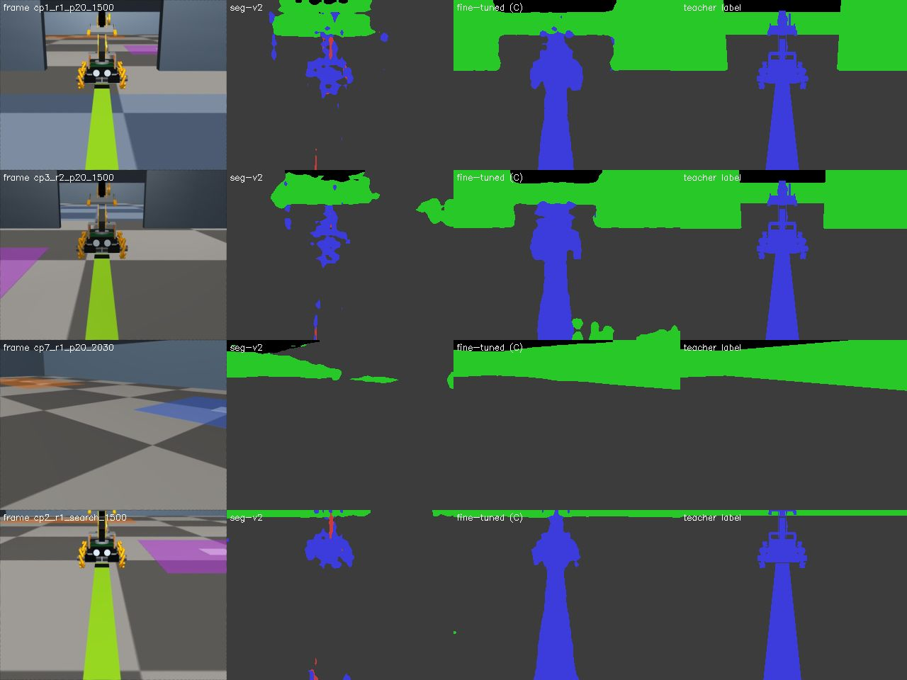

# 밝은 바닥에서 벽 인식(분할) 모델이 무너지는 문제 고치기 (오프라인, 물리 0회)

**쉬운 요약.** 표식 없는 위치 추정(VIS3)의 눈 역할을 하는 "벽/바닥 구분 모델"(`seg-v2`)은 어두운 바닥 하나로만 배웠다. 그래서 실제 방처럼 바닥을 밝게 그리면(`floor_light_v1`) 벽을 못 찾아, 체크포인트 9곳 중 5곳이 5 cm 기준을 못 맞췄다(B1 결과).
이번에 **바닥 색·밝기·조명·벽 색을 무작위로 바꾼 그림 약 7,800장 + 원래 학습 그림 약 3,000장**으로 이 모델을 이어서 학습(미세 조정)했더니, 같은 B1 시험에서 **9곳 모두 위치 p90 ≤ 5 cm, 방향 p90 ≤ 2°를 맞췄다**(모아 본 7곳 위치 p90 6.7 cm → 2.0 cm, 방향 p90 1.47° → 0.40°, 스스로 "불확실" 표시 29 % → 0 %).
한 번도 학습에 쓰지 않은 바닥 색(회색 민무늬, 베이지, 하늘색, 초록 저대비)과 밝은 벽에서도 같은 결과가 나왔다(9/9). 어두운 원래 렌더(`default`)도 나빠지지 않고 오히려 좋아졌다(8/9 → 9/9).
**아직 안 되는 것:** 로봇이 팔을 높이 든 `search` 자세는 여전히 3–5번째 체크포인트에서 로봇 r1이 앞뒤(x)로 7–14 cm 치우친 채 스스로 모른다고 하지 않는다. 해상도를 640×480으로 올리면 이 자세는 좋아지지만(7/9) 기본 자세(`p20`)의 문 옆 체크포인트가 12 cm로 나빠진다. 그래서 **권고는 `p20` 자세 + 480×360 추론 + 이 모델(`C_mix_rgb`)**이다.
**한계:** 실제 방의 바닥·벽 색과 조명은 측정한 적이 없다. 이 결과는 시뮬레이터 정지 화면 렌더 결과이며, "바닥 색이 바뀌어도 벽 인식이 유지된다"는 것만 보인다. 실제 카메라 검증이 아니다.

**물리 0회.** 시뮬레이터 시간은 앞으로 가지 않는다(정지 프레임 렌더 + 추론 + 학습만). `agent_lock` 없음, 모델(LLM) 호출 0. E2E(끝에서 끝까지 실행)가 아니며 학생의 운반 성공 근거가 아니다. 어떤 실행기·번들·게이트도 바꾸지 않는다.
관련: 이슈 #216(VIS3), #218(최종 환경 렌더 프로필), PR #279(B1, 이 실험이 고치려는 측정), PR #277(재측위 설계).

## 입력 경계

- 모델의 **실행 시 입력은 자기 손목 카메라 RGB 한 장뿐**이다. 국소화기 나머지(정적 지도, 고정 보정, 자기 명령 이력, 필터 설정)는 B1과 바이트 그대로다.
- **교사 라벨**(시뮬레이터가 그린 벽/바닥/로봇/물체 분할 정답)은 **학습 표적과 채점**에만 썼다. 바닥 색 바꾸기 증강(`label-guided floor recolour`)도 교사 라벨로 바닥 화소를 고르는 학습용 처리이며, 실행 시에는 없다.
- 참값 좌표는 B1과 같은 두 곳(틀린 시작 믿음 만들기, 채점)에만 쓴다. 학습 그림의 로봇 자세는 임의 추첨이고 참값이 모델 입력이 되지 않는다.

## 1. 원래 모델은 어떻게 만들어졌나 (조사 결과)

| 항목 | 내용 | 출처 |
|---|---|---|
| 모델 | torchvision `lraspp_mobilenet_v3_large`, 5클래스(바닥·벽·자기·물체·배경), ImageNet 사전학습 뼈대, 3.2 M 매개변수 | `experiments/2026-09-26-vision-loc/seg_model.py` |
| 체크포인트 | `seg-v2`, sha256 `348539030fda9621…939fd9` (13,071,401 B) | `model_train_info.json`, `configs/model_artifacts.json` (`vision-loc-seg-lraspp-mbv3-20260926-v2`) |
| 학습 자료 | 태그 없는 교사 주행 렌더 8회(`vl-train-s901..908`)에서 3프레임마다 4,973장, 검증 3회 654장. **렌더 프로필은 `default`(그림자 4개, 반사 바닥, 어두운 푸른 회색 체커 바닥 rgb .20 .22 .24 / .27 .29 .31)** 하나뿐 | `model_train_info.json` |
| 학습 방법 | 4 epoch, batch 16, lr 1e-3(OneCycle), 밝기·잡음 증강(gain .75–1.3, bias ±.25, 좌우 뒤집기), 마지막에 정확한 BN 통계 재계산 | `seg_model.train` |
| 입력/추론 | 펴진(undistort) 320×240 학습, 추론은 480×360 | `selected_config_v3.json` |
| 학습 표적 | 같은 순간 같은 카메라의 MuJoCo 분할 렌더(교사 라벨) | `seg_model.py` 머리말 |

**왜 무너졌나(가설, 측정으로 확인):** 학습에 나온 바닥은 어두운 체커 하나였다. 밝은 체커는 어두운 칸이 벽 색(.23 .28 .33)과 비슷해지고 밝은 칸은 조명 때문에 벽 위쪽 띠와 비슷해져, 모델이 "밝기 → 벽/바닥"으로 외운 규칙이 깨진다. `default` 렌더에서 벽 IoU(겹침 비율) 중앙값 0.884 → `floor_light_v1`에서 0.211(B1). 시각적으로는 montage 참조.

(왼쪽부터 펴진 화면, 기존 `seg-v2` 예측, 미세 조정 모델 `C_mix_rgb` 예측, 교사 라벨. 초록 = 벽, 회색 = 바닥, 파랑 = 물체(로봇·빔), 검정 = 배경/무효. B1 `floor_light_v1` 프레임.)

## 2. 무엇을 시험했나 (측정 전에 순서와 기준을 정했다)

**사전 고정 통과 기준(작업 지시):** B1 프로토콜 그대로 — 체크포인트 9곳 × 로봇 2대, 손목 프레임 8장(`p20` 자세, pan 순서 고정), 시작 오차 S(±5 cm, ±3°)와 Y(y ±5 cm) 그룹당 48회, 넓은 prior, 렌더 `floor_light_v1`. **체크포인트마다(두 로봇 중 나쁜 쪽) 위치 p90 ≤ 5 cm 그리고 방향 p90 ≤ 2°**면 "통과". B1의 티어 A(실패율 ≤ 10 %, 조용한 실패 ≤ 5 % 추가)도 함께 적는다. 필터·지도·보정·시드·시작 오차 추첨은 B1과 같다: B1 `relocalize_grid.py`를 수정 없이 실행했고, 원래 `seg-v2`로 다시 돌려 B1 결과를 재현했다(체크포인트 2 r1: 6.28 cm = B1 6.3 cm, 벽 IoU 중앙값 0.211).

시도 순서(싼 것부터, 지시된 순서):

| 기호 | 방법 | 학습 |
|---|---|---|
| (추론 전용) | 고정 `seg-v2`에 입력 변환만: 전체 밝기 ×0.4, 감마, 흑백, **화면별 대비 늘이기(stretch)** | 없음 |
| A | 원래 학습 그림만 사용, 강한 색·밝기 증강 + **교사 라벨로 바닥 화소만 색 바꾸기** | 미세 조정 |
| B | (b) 색에 덜 민감한 입력: **화면별 채널 표준화(`perimg`)**, **밝기만 쓰고 표준화(`gray_perimg`)** + C와 같은 자료 | 미세 조정 |
| C | (c) **바닥 색 무작위 혼합**: 정지 렌더 24종 무작위 바닥·조명·벽 색 + `floor_light_v1` + `default` + 원래 학습 그림 재생 | 미세 조정 |
| C2 | C + `search` 자세의 복도 정면 벽 그림 3,120장(아래 3.3 이유) | 미세 조정 |
| F, F2 | 반증용: **바닥 하나(`floor_light_v1`)만** 맞춘 모델. F는 그림 300장(자료량이 달라 비교가 어렵다), F2는 8,000장(C와 정지 그림 수를 맞춤) | 미세 조정 |

### 학습 자료와 분리

- 정지 렌더(`render_static_set.py`): B1과 같은 최종 지도(`zone_wide_door_geometry_v2`, 벽 0.40 m, 표식 0), 로봇 모델 v2, 접촉 프로필 `cargo_noslip_v1`, 같은 팔 정적 중력 평형, 같은 어안 JPEG와 교사 분할 렌더. **물리 진행 없음**(세계 시간이 렌더 전후 같음을 코드가 검사). 렌더 자세: 로봇 위치·방향 무작위(벽에서 0.24 m 이상), 짝 로봇 무작위, 빔은 50 % 무작위 위치, 팔은 `p20`±45펄스(35 %), `search`±45펄스(25 %), 원래 교사 주행에서 나온 서보 상태(40 %), pan 무작위.
- **평가와 겹치지 않는 조건:** 학습 렌더는 B1 평가 스테이션(체크포인트 9곳 × 로봇 2대, 위치 0.30 m 이내이면서 방향 30° 이내)을 **제외**하고 뽑았고, 학습·개발·B1 평가는 시드와 무작위 추첨이 서로 다르다. 학습 자세와 B1 프레임은 겹치지 않는다(같은 지도 안이라는 점은 같다).
- **바닥 "모양":** 학습용 무작위 24종은 체커 두 톤의 밝기 0.18–0.80, 채도 0–0.40, 색조 전체, 대비 1.0(민무늬)–2.0, 조명 배율 ×0.22–0.45(원 `floor_light_v1`은 ×0.3), 벽 색 배율 ×0.8–1.7. **시험용으로 남긴 바닥 5종과 벽 1종은 학습에 쓰지 않았다**(평균 색이 시험용과 RGB 거리 0.10 이내인 무작위 종은 뽑지 않음): `ho_plain_grey`(회색 민무늬), `ho_warm_beige`, `ho_cool_lightblue`, `ho_green_lowcontrast`, `ho_near_white`, `ho_light_walls`(밝은 벽 ×2.4 + `floor_light_v1` 바닥).
- 학습 혼합(C): 정지 렌더 7,800장(무작위 24종 × 300 + `floor_light_v1` 300 + `default` 300) + 원래 교사 주행 그림 재생 2,986장(`vl-train-s901..908`, 5프레임마다) = 10,786장, 그중 3 %(323장)를 검증으로 뗐다. 3 epoch, batch 16, lr 3e-4(OneCycle), 1,959 단계, 마지막에 깨끗한 혼합 그림으로 정확한 BN 통계 재계산(원래와 같은 절차). 시작은 `seg-v2` 가중치.
- 개발(dev) 정지 렌더: 시드가 다른 무작위 자세 80장 × 11종(`default`, `floor_light_v1`, 학습 종 3개, 시험용 바닥 5종, 시험용 벽 1종). 후보 비교는 여기서 했다.

## 3. 결과

### 3.1 개발 정지 렌더: 벽 IoU (화소 전체, 640×480 유효 영역, 교사 라벨 대비)

무작위 자세라서 B1의 체크포인트 그림보다 어렵다(벽이 거의 안 보이는 그림도 포함). **표 안의 `ho_*`는 학습에 쓰지 않은 바닥·벽, `tr*`는 C가 학습한 종이지만 새 자세, `F2`의 `tr*`는 학습하지 않은 종.**

| model | default | floor_light_v1 | tr00 | tr07 | tr15 | ho_plain_grey | ho_warm_beige | ho_cool_lightblue | ho_green_lowcontrast | ho_near_white | ho_light_walls |
|---|---:|---:|---:|---:|---:|---:|---:|---:|---:|---:|---:|
| baseline seg-v2 | 0.63 | 0.14 | 0.09 | 0.34 | 0.02 | 0.00 | 0.02 | 0.24 | 0.16 | 0.06 | 0.05 |
| seg-v2 + gain 0.4 (inference) | 0.34 | 0.49 | 0.48 | 0.50 | 0.28 | 0.34 | 0.24 | 0.58 | 0.54 | 0.50 | 0.39 |
| seg-v2 + per-image stretch (inference) | 0.54 | 0.50 | 0.50 | 0.32 | 0.20 | 0.31 | 0.23 | 0.59 | 0.42 | 0.55 | 0.35 |
| A aug-only fine-tune | 0.68 | 0.46 | 0.41 | 0.51 | 0.21 | 0.27 | 0.22 | 0.50 | 0.38 | 0.37 | 0.17 |
| B perimg input | 0.71 | 0.82 | 0.87 | 0.72 | 0.88 | 0.80 | 0.95 | 0.94 | 0.86 | 0.82 | 0.87 |
| B gray input | 0.64 | 0.76 | 0.84 | 0.73 | 0.88 | 0.69 | 0.88 | 0.90 | 0.79 | 0.79 | 0.88 |
| F floor_light only (small) | 0.82 | 0.72 | 0.81 | 0.73 | 0.65 | 0.70 | 0.69 | 0.71 | 0.71 | 0.68 | 0.75 |
| F2 floor_light only (8k) | 0.86 | 0.96 | 0.97 | 0.36 | 0.54 | 0.88 | 0.92 | 0.77 | 0.58 | 0.93 | 0.73 |
| C mixture | 0.83 | 0.97 | 0.97 | 0.94 | 0.94 | 0.83 | 0.96 | 0.94 | 0.94 | 0.96 | 0.85 |
| C2 mixture + far-wall | 0.81 | 0.95 | 0.98 | 0.96 | 0.91 | 0.89 | 0.95 | 0.93 | 0.88 | 0.98 | 0.91 |

- 추론 전용 변환은 `floor_light_v1`에서 0.14 → 0.5 정도로 올리지만 `default`가 0.63 → 0.34–0.54로 나빠지고 새 바닥들은 0.2–0.6에 머문다. 원래 학습 그림만 쓴 미세 조정(A)도 0.46이다: **새 그림(다양한 바닥)이 필요하다.**
- 입력 표준화(B)는 새 바닥에서 0.7–0.95로 크게 좋아지지만 `default`는 0.64–0.71로 C(0.83)보다 낮고, 학습한 바닥에서도 C보다 낮다.
- **C는 모든 바닥에서 0.83–0.97**이다. F2(바닥 하나만, 8,000장)는 `floor_light_v1`에서 C만큼 좋지만(0.96) 다른 바닥에서는 0.36–0.93으로 들쭉날쭉하다(초록 저대비 0.58, 어두운 초록 0.36). **바닥 하나에 맞추면 다른 바닥에서 불안정하다는 반증이 dev 정지 렌더에서 확인되었다.**

### 3.2 B1 프로토콜, `floor_light_v1`, 기본 자세 `p20` (사전 고정 기준)

| model | pass (9 cp) | pass (7 mid) | pooled 7-mid pos p50/p90 (cm) | yaw p90 (deg) | fail | flagged | failing checkpoints |
|---|---:|---:|---|---:|---:|---:|---|
| baseline seg-v2 (B1 cohort) | 4/9 | 3/7 | 2.2 / 6.7 | 1.47 | 0.0% | 29.0% | cp1(7.3 cm), cp2(6.3 cm), cp3(7.4 cm, silent), cp7(8.0 cm), cp8(5.9 cm) |
| seg-v2 + per-image stretch (inference only) | 8/9 | 6/7 | 2.1 / 4.3 | 0.50 | 0.0% | 0.0% | cp3(6.4 cm, silent) |
| A aug-only fine-tune | 7/9 | 5/7 | 1.5 / 4.8 | 0.66 | 0.0% | 0.0% | cp3(5.9 cm, silent), cp6(5.5 cm, silent) |
| B per-image standardised input | 9/9 | 7/7 | 1.1 / 1.9 | 0.37 | 0.0% | 0.0% | - |
| B luminance-only input | 9/9 | 7/7 | 1.1 / 2.0 | 0.40 | 0.0% | 0.0% | - |
| F2 floor_light-only fine-tune (8k) | 9/9 | 7/7 | 1.1 / 2.1 | 0.36 | 0.0% | 0.0% | - |
| C mixture (480x360) | 9/9 | 7/7 | 1.1 / 2.0 | 0.40 | 0.0% | 0.0% | - |
| C mixture (640x480 inference) | 8/9 | 6/7 | 1.3 / 3.1 | 0.50 | 1.8% | 1.0% | cp2(12.3 cm, silent) |
| C2 mixture + far-wall | 9/9 | 7/7 | 1.1 / 1.8 | 0.34 | 0.0% | 0.0% | - |

(통과 = 두 로봇 중 나쁜 쪽 위치 p90 ≤ 5 cm 그리고 방향 p90 ≤ 2°. 표시(flagged) = 필터가 스스로 σ_xy > 6 cm 또는 σ_yaw > 3°라고 보고. "조용한"은 표시 비율이 50 % 미만인 실패. 각 칸 표본 48회 × 2대.)

- B1 체크포인트 프레임 252장의 벽 IoU 중앙값(하위 10 %): 기준선 0.211(0.000), 화면별 stretch 0.878(0.333), A 0.885(0.365), B perimg 0.945(0.851), **C 0.955(0.891)**, C2 0.958(0.885), F2 0.959(0.905), C의 640×480 추론 0.955(0.763). (`default` 렌더에서 기준선은 0.884.)
- 기준선(`seg-v2`)은 4/9(모아 본 7곳 3/7)이었고, **C는 9/9, 위치 p90 2.0 cm, 방향 p90 0.40°, 실패 0 %, 표시 0 %**다. 기준선에서는 표시가 29 %나 되었다(스스로 헷갈림).
- B1의 체크포인트 그림은 쉬운 편이라서, **A를 제외한 미세 조정 모델(B·C·C2·F2)은 모두 9/9**다. 이 프로토콜만으로는 C가 B나 F2보다 낫다고 말할 수 없다. 우열은 dev 정지 렌더(3.1)와 시험용 바닥(3.4)에서 갈린다.
- 추론 전용 화면별 stretch는 8/9로 꽤 되지만 체크포인트 3이 6.4 cm이고 표시되지 않은 채(조용히) 틀린다. `search` 자세에서는 훨씬 나쁘다(아래).
- 어두운 원래 렌더(`default`, p20)에서 C는 **9/9**(기준선 8/9: 체크포인트 0 r1이 5.2 cm), 모아 본 7곳 위치 p90 3.1 cm(기준선 3.7).

### 3.3 `search` 자세와 문 옆 체크포인트 2 로봇 r1

B1에서 `search` 자세는 `default`에서도 체크포인트 2 r1이 위치 p90 19.7 cm, 실패 100 %(모두 표시)였다. 결과:

| model | pass (9 cp) | pass (7 mid) | pooled 7-mid pos p50/p90 (cm) | yaw p90 (deg) | fail | flagged | failing checkpoints |
|---|---:|---:|---|---:|---:|---:|---|
| baseline seg-v2 (B1 cohort) | 1/9 | 1/7 | 5.8 / 14.8 | 3.07 | 28.7% | 98.5% | cp0(14.4 cm), cp1(7.7 cm), cp2(16.2 cm), cp3(14.4 cm), cp4(15.9 cm), cp6(8.2 cm), cp7(12.8 cm), cp8(14.4 cm) |
| seg-v2 + per-image stretch (inference only) | 3/9 | 1/7 | 2.4 / 20.3 | 1.33 | 21.4% | 11.3% | cp2(35.1 cm), cp3(18.8 cm, silent), cp4(7.5 cm), cp5(7.7 cm, silent), cp6(21.4 cm, silent), cp7(3.0 cm, silent) |
| A aug-only fine-tune | 4/9 | 2/7 | 2.2 / 18.9 | 1.38 | 35.7% | 7.9% | cp2(20.6 cm), cp3(18.2 cm, silent), cp4(16.1 cm, silent), cp5(15.3 cm, silent), cp6(20.4 cm, silent) |
| C mixture (480x360) | 5/9 | 3/7 | 1.4 / 10.4 | 0.78 | 12.5% | 4.2% | cp2(8.3 cm), cp3(14.4 cm, silent), cp4(10.8 cm, silent), cp5(7.7 cm, silent) |
| C mixture (640x480 inference) | 7/9 | 5/7 | 1.1 / 4.9 | 0.68 | 0.0% | 0.0% | cp3(5.6 cm, silent), cp4(5.8 cm, silent) |
| C2 mixture + far-wall | 5/9 | 3/7 | 1.4 / 7.8 | 0.98 | 7.7% | 4.9% | cp2(9.0 cm), cp3(12.7 cm, silent), cp4(8.0 cm, silent), cp5(6.6 cm, silent) |

- 기준선 대비: `default` 렌더에서 체크포인트 2 r1은 19.7 cm → **3.8 cm**로 고쳐졌다(C, `search`, 기준 통과. 표시 42 %). `default` `search` 전체는 기준선 5/9 → **7/9**.
- `floor_light_v1`의 `search`에서는 C가 5/9(기준선 1/9)다. 체크포인트 2 r1은 8.3 cm(표시 58 %, 실패 2 %)로 기준선(16.2 cm)보다 나아졌지만 통과 못 한다. **체크포인트 3–5의 r1은 앞뒤(x) 방향으로 7–14 cm 일정하게 치우쳐 있고 스스로 표시하지 않는다**(시작 오차를 바꿔도 같은 값에 수렴, 표준편차 0.5 cm). 원인: `search` 자세 r1이 정면(+x)의 먼 동쪽 벽을 보는데 그 벽은 화면 위쪽의 얇은 띠라서, 벽 아래 모서리가 교사 라벨보다 5 px 아래로 나온다(pan 1500 프레임, 나머지 pan은 대체로 ±1–2 px). 교사 라벨 관측이면 A였으므로(B1) 지도·기하가 아니라 분할의 모서리 정밀도 문제다.
- 정면 벽 그림을 더 넣은 C2는 개선 없음(5/9, 체크포인트 3: 12.7 cm). 자료량 문제가 아니다.
- **추론 해상도 640×480**으로 올리면 `search`는 7/9(체크포인트 2 r1 1.9 cm, 3–4는 5.6–5.8 cm로 근소하게 실패, 실패 0 %)가 되지만 **`p20`의 체크포인트 2가 12.3 cm(실패 25 %, 표시 15 %)로 나빠진다.** 해상도는 한쪽을 고치고 다른 쪽을 깨는 손잡이이므로 이 변경을 채택하지 않는다.
- 결론: **`search` 자세는 아직 재측위에 쓰면 안 된다**(B1 결론 유지). 기본 자세 `p20`은 해결됐다.

### 3.4 시험용(학습 안 한) 바닥·벽에서 B1 프로토콜, `p20`

| model | ho_plain_grey | ho_warm_beige | ho_cool_lightblue | ho_green_lowcontrast | ho_light_walls | tr07 |
|---|---:|---:|---:|---:|---:|---:|
| baseline seg-v2 | 0/9, p90 19.9 cm, flagged 99% | 0/9, p90 11.8 cm, flagged 100% | - | - | - | - |
| C mixture | 9/9, p90 1.9 cm, flagged 0% | 9/9, p90 1.8 cm, flagged 0% | 9/9, p90 1.5 cm, flagged 0% | 9/9, p90 2.1 cm, flagged 0% | 9/9, p90 1.8 cm, flagged 0% | 9/9, p90 2.0 cm, flagged 0% |
| F2 floor_light-only (8k) | 9/9, p90 1.6 cm, flagged 0% | 9/9, p90 1.9 cm, flagged 0% | 8/9, p90 2.5 cm, flagged 0% | 8/9, p90 3.6 cm, flagged 0% | 9/9, p90 2.8 cm, flagged 0% | 5/9, p90 9.2 cm, flagged 36% |

- 회색 민무늬 바닥에서 기준선은 0/9(체크포인트 전부 X, 실패 52 %, 모두 표시)로 완전히 무너진다. **C는 시험용 5종 모두 9/9**(초록 저대비 포함, 밝은 벽 포함).
- F2(바닥 하나만)는 회색·베이지·밝은 벽에서는 C처럼 9/9이지만 하늘색과 초록 저대비에서는 8/9(체크포인트 1곳이 5 cm를 넘고 표시도 안 됨)다. 학습하지 않은 **어두운 초록 민무늬 바닥(`tr07`, C는 이 바닥으로 학습했으므로 C와의 공정한 비교는 아님)**에서는 F2가 5/9, 위치 p90 9.2 cm, 표시 36 %로 무너진다. 즉 "한 가지 바닥에 맞추기"는 밝은 바닥 몇 종에는 통하지만 어두운 바닥으로 벗어나면 깨진다. 밝은 바닥 안에서 차이는 작다(체크포인트 1곳).

## 4. 고른 모델과 이유, 한계

- **고른 모델: `C_mix_rgb`**(sha256 `0e7a696e7100cc19d84149251456afedc1318ff4f7901b06bd9396590c651c9d`, 13,071,657 B). 이유: (1) 지시된 (c) 방식, (2) 사전 기준 9/9와 `default` 무회귀, (3) 학습하지 않은 바닥 5종·밝은 벽에서 모두 9/9, (4) dev 정지 렌더에서 모든 바닥 0.83–0.97로 가장 안정. C2는 p20에서 비슷(9/9, 위치 p90 1.8 cm)하나 `search`에서 이득이 없고 dev에서 일부 바닥이 더 낮아 채택하지 않았다.
- **선택 과정의 정직한 기록:** 후보는 추론 전용 5종(밝기 ×0.4, 감마 2, 감마 3, 흑백, stretch; 그중 B1 전체는 stretch만), A, B 2종, C, C2, F, F2, 해상도 변형으로 총 14개다. C를 고른 근거는 dev 정지 렌더와 시험용 바닥이며, B1 `floor_light_v1` 평가 프레임은 후보 여럿이 이미 만점이라 구별력이 낮다. `search` 자세 대응(C2, 640 해상도)은 B1 `search` 결과를 본 뒤 추가한 시도다(선택 오염 가능). 시험용 바닥에서 본 결과는 후보 선택에 쓰지 않았다(F2 대 C의 비교 서술에만 사용).
- 실제 바닥 색·벽 색은 **측정 전**이다. 이번 결과는 "밝기·색이 달라져도 유지된다"이며 실제 방에서의 성능이 아니다. 실제 방에는 무늬(체커가 아닌 타일 줄, 얼룩), 그림자, 반사, 벽 종이 등 시뮬레이터에 없는 변화가 있다.
- 정지 프레임이며 지도는 문 1개 최종 지도 하나다. 필터를 프레임마다 새로 시작하고, 표본은 독립 실행이 아니다(B1과 같은 한계). 문 2개·복도 최종 지도는 다루지 않았다.
- 640×480 추론이 `p20` 문 옆에서 깨지는 것은 이 모델의 모서리 정밀도가 문 근처에서 여유가 적다는 신호일 수 있다. 실제 방에서 첫 확인이 필요하다.
- 학습·평가 재현: 학습 그림·캐시는 결정론적(시드)이나 **작업자 수가 달라 증강 난수는 완전히 같지 않다**: A, B(perimg), C는 데이터 로더 작업자 3개, B(gray), C2, F, F2는 1개(부하 지시로 줄임). 학습은 MPS(부하가 높은 공유 Mac)에서 돌렸고 MPS의 비결정성 때문에 재실행 시 가중치가 바이트 단위로 같지 않을 수 있다.

## 5. 원본, 재현, 해시

- 소스: 이 PR의 마지막 커밋(코드 파일 `floors.py`, `render_static_set.py`, `render_b1_look.py`, `seg_ft.py`, `train_run.py`, `eval_dev.py`, `b1_eval.py`, `score_b1.py`, `make_tables.py`, `montage.py`). 실행 중 코드는 후보를 더하며 커밋이 여러 번 늘었으나 C의 학습·평가 경로는 바뀌지 않았다(뒤에 추가된 것: 정면 벽 렌더 모드, 추론 해상도 옵션, F2용 캐시).
- 원본(로컬 보관, 원격 백업 아님): `/Users/changmin/projects/ugrp/outputs/seg-lightfloor-20260929/` — `train/`(정지 렌더 7,800장+), `train_fl/`(8,000), `train_farwall/`(3,120), `dev/`(880), `b1renders/`(시험용 바닥 B1 렌더 6종), `model/<후보>/`(체크포인트 + `train_info.json`), `b1/<후보>/<렌더>/`(관측·`runs.jsonl`), `eval/`, `summary/`, `logs/`. 학습용 이미지 캐시(약 10 GiB, 렌더에서 다시 만들 수 있는 파생물)는 정리했다.
- 이 저장소에 두는 작은 결과: `analysis/*.json`(dev IoU, B1 점수), `montage_seg_floor_light_v1.jpg`, `model_artifact_entry_DRAFT.json`.
- 후보 체크포인트 sha256(전체는 `analysis/`의 `train_info` 발췌 참조): `A_aug_only` `2bdf00dc91ba7f7227f194a3839142a239fb0c444f53ced8e507c56c17a5594f`; `B_mix_perimg` `1327aa8ff118026770f0468155c5d8a309f7aef9e0bcaf3bdaf4773ef8950816`; `B_mix_gray` `d594f83f333655553301e1cf9dc587bbafae8d54cf6f4372c6207106855d5a3b`; `C_mix_rgb` `0e7a696e7100cc19d84149251456afedc1318ff4f7901b06bd9396590c651c9d`; `C2_mix_far` `feb3f6b31597532221606d470b0e4f2fa39b9cb77c12990a6c000759a159c6f8`; `F_floorlight_only` `16aeec8706d84a8a23622581740466d019da7d179b3796e8ba0a804fb983a1ec`; `F2_floorlight_8k` `593508d0a94f8812f9501c0e2cc3720a5e480eb790a95792460ba0e0abee6cb7`
- 재현 순서(sim 환경 `.venv-sim-worker-mac`, torch 환경 `.venv-reference-act`): `render_static_set.py`(정지 렌더) → `train_run.py cache` → `train_run.py C_mix_rgb` → `eval_dev.py` → `b1_eval.py C_mix_rgb --ckpt … --render <B1 floor_light_v1 렌더> --looks p20 search` → `score_b1.py runs.jsonl` → `make_tables.py`.
- **모델 배포 준비(올리지 않음):** `model_artifact_entry_DRAFT.json`에 `configs/model_artifacts.json`용 항목 초안(상태 `unavailable_pending_upload`, 배포 URL 없음). `configs/model_artifacts.json`은 바꾸지 않았다. 배포는 병합 뒤 재다운로드·전체 해시·모델 로딩 확인까지 하고서야 완료로 본다.
- 실행 번들 ID: **미사용**. TensorBoard 스냅샷: **만들지 않음**(오프라인 분할 개선 측정이며 학습·평가 실행 결과의 새 코호트 아님; 필요하면 관리자가 결정).
- 부하: 측정 중 Mac 부하 평균이 20–300으로 높았다(다른 작업의 물리 시험). 정확도를 재는 실험이라 결과에는 영향이 없고, 조정 요청에 따라 병렬 작업자를 4개 이하로 줄였다.

## 참고 자료

- 저장소: `experiments/2026-09-26-vision-loc/`(`seg_model.py`, `model_train_info.json`, `selected_config_v3.json`, `calibration_train.json`), PR #279 `experiments/2026-09-29-carry-relocalization-b1/`(렌더·재측위·분석 스크립트, 그대로 재사용), `sim/render_profile.py`(`floor_light_v1`), `docs/model_artifacts.md`.
- 도메인 무작위화 방법 원문(이번에 조사한 것은 아니고 방법의 출처만 적음. 검색 도구가 연결되지 않아 원문을 이 세션에서 다시 열어 보지는 못했다):
  - Tobin 외, "Domain Randomization for Transferring Deep Neural Networks from Simulation to the Real World", IROS 2017 (arXiv:1703.06907): 시뮬레이터 그림의 색·질감·조명을 크게 무작위로 바꾸면 실제 그림에서도 작동.
  - Tremblay 외, "Training Deep Networks with Synthetic Data: Bridging the Reality Gap by Domain Randomization", CVPR-W 2018 (arXiv:1804.06516): 무작위 질감·조명으로 합성 그림만으로 학습한 뒤 실제에 적용.
  - Wu & Johnson, "Rethinking 'Batch' in BatchNorm", 2021 (arXiv:2105.07576): 정확한 BN 통계 재계산(원래 `seg-v2`가 쓴 절차를 그대로 유지).
  - 이 실험의 (c) 방식은 위 도메인 무작위화 방식을 바닥·조명·벽 색 한정으로 옮긴 것이다. 두 번 막히지는 않아서 추가 조사는 하지 않았다.
