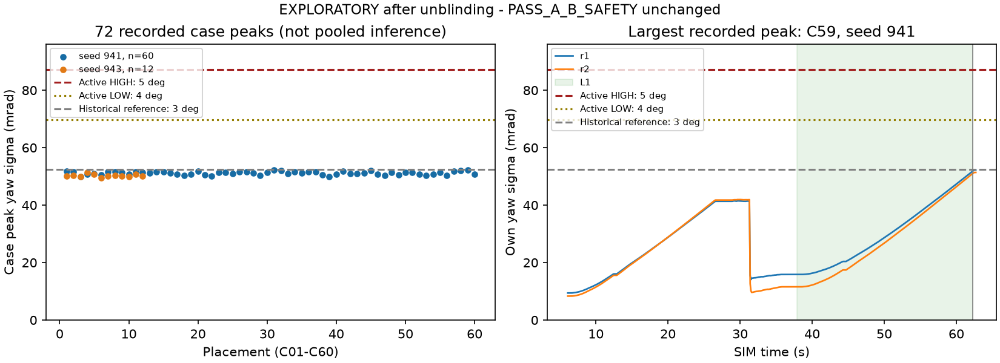

# b-v6h1 yaw σ 게이트 근접 원인 — 개봉 후 탐색 분석

**EXPLORATORY / post-unblinding. 확증 판정 `PASS_A_B_SAFETY`는 변경하지 않는다.**
실행·봉인 자료는 읽기 전용으로 분석했다. 새 물리 실행·카메라 렌더·모델 호출은 0이며 제어기·분류기·CI workflow를 수정하지 않았다. 아래 72건은 이미 개봉한 동일 자료이지 새 확증 표본이 아니다. 주 시드 941의 60건과 민감도 시드 943의 12건을 추론 분모로 합치지 않는다.

## 결론

**이번 실행은 52.4 mrad 실패 직전에서 버틴 것이 아니다. 비교에 쓴 게이트가 달랐다.** 실행 SHA `4c6b439f3f7c9a147c901f8b260a1e214d4eb396`의 `b-v6h1`은 loaded yaw **HIGH=5°(87.266 mrad), LOW=4°(69.813 mrad)**를 적용한다. 3°(52.360 mrad)는 기본 `GATE_LOADED` 값이며 이 후보의 실제 상한이 아니다. 최대 σ=52.190 mrad에도 실제 HIGH까지 **35.076 mrad**, LOW까지 **17.623 mrad**가 남는다.

관측된 상승은 유효한 절대 위치 관측 없이 운반하면서 PF의 yaw 불확실성이 누적된 것이다. 최대값은 72건·두 로봇 모두 **L1 종료 뒤 정지 잔류 운동 구간**에서 나왔다. 미리 정한 L1 끝에서 시험을 멈추고, PF도 정지 후 잡음을 더하지 않아 평평해진다. σ를 52.4 mrad 아래로 잘라내거나 그 근처에서 자동 재관측한 흔적은 없다.

| 질문 | 답 |
|---|---|
| (a) 문턱 직전 재관측·정지로 포화되는 설계인가? | **아니다.** 문턱 반응이 아니라 정해진 leg 종료·시험 종료·정지 시 잡음 중단이다. 중간의 재관측 1회는 L0→L1 재파지 절차이며 L1의 σ 최고점과 무관하다. |
| (b) 듬성듬성 검사해서 초과를 놓쳤나? | **기록된 gate 입력의 누락으로 설명되지 않는다.** 제어 중 자기 보고·gate 갱신은 같은 0.1 s 표본이고 모두 상한 아래다. 다만 PF 내부의 최대 0.05 s 예측 단계 전부는 저장하지 않았으므로, 기록 사이의 아주 짧은 σ 변동을 수학적으로 배제하지는 못한다. |
| (c) 실제 게이트 실패 직전 위험인가? | **이 자료는 그 주장을 뒷받침하지 않는다.** 실제 상한의 59.8% 이하이며 가장 가까운 여유도 35.1 mrad다. 더 긴 운반·관측 상실에서의 안전성이나 완료 가능성은 이번 L1 종료 자료로 판단할 수 없다. |

[기존 README의 near-miss 1번](README.md)의 “3° 게이트 / 0.6 s 지속하면 실패” 설명과 [tabulate.py](tabulate.py)의 `GATE_YAW_RAD=3°` 비교는 **이 후보의 작동 게이트 설명으로는 부정확하다.** 해당 원기록·기존 파생 표는 보존하고 이 탐색 문서에서 정정한다. 기본 게이트 대비 수치 자체는 참고용으로 재현된다. 기존 “중앙 여유 1.1 mrad”는 주 시드 60건 값이고, 72건 전체의 기술통계 중앙 여유는 1.340 mrad다.

## 코드 경로와 세 종류의 기준

아래 실행 코드는 전부 **실행 SHA `4c6b439f`**에서 읽었다. 현재 main의 다른 정책으로 대체하지 않았다. 각 case의 `result.json`에서 정책 `b-v6h1`, `diag_patch=null`, `door_relax=null`, `door_relax_overrides=[]`를 72/72 확인했다. 숫자 게이트 자체는 case 로그에 별도 필드로 저장되지 않아, **정책 식별자 + 고정된 실행 소스의 전달 경로**로 확인한 값이다.

| 경로 | 실제 의미 |
|---|---|
| [`zone_pair_v6_policy.py:148–153`](https://github.com/cmkang131/UGRP-Multi-Robot-Collaboration-Project/blob/4c6b439f3f7c9a147c901f8b260a1e214d4eb396/harness/zone_pair_v6_policy.py#L148-L153) | `b-v6g`에서 `b-v6h1`을 만들며 `loaded_gate_yaw_deg=(5,4)`, `loaded_k_xy=loaded_k_yaw=1`, `probe_all_sweeps` 지정. |
| [`zone_pair_executor.py:234–244`](https://github.com/cmkang131/UGRP-Multi-Robot-Collaboration-Project/blob/4c6b439f3f7c9a147c901f8b260a1e214d4eb396/harness/zone_pair_executor.py#L234-L244), [`zone_pair_guards.py:226–233`](https://github.com/cmkang131/UGRP-Multi-Robot-Collaboration-Project/blob/4c6b439f3f7c9a147c901f8b260a1e214d4eb396/harness/zone_pair_guards.py#L226-L233) | `loaded_gate_profile(policy.loaded_gate_yaw_deg)`를 접근 드라이버와 pair guard/recheck에 전달. 전역 기본값을 바꾸지 않는 인스턴스 설정. |
| [`zone_own_guards.py:63–79`](https://github.com/cmkang131/UGRP-Multi-Robot-Collaboration-Project/blob/4c6b439f3f7c9a147c901f8b260a1e214d4eb396/harness/zone_own_guards.py#L63-L79), [`m1_owncam_delivery.py:54–59`](https://github.com/cmkang131/UGRP-Multi-Robot-Collaboration-Project/blob/4c6b439f3f7c9a147c901f8b260a1e214d4eb396/harness/m1_owncam_delivery.py#L54-L59) | 기본 loaded HIGH는 3°이지만 후보 프로필의 yaw만 5°/4°로 교체한다. loaded xy HIGH=0.07 m, LOW=0.06 m는 유지. |
| [`zone_pair_guards.py:619–671`](https://github.com/cmkang131/UGRP-Multi-Robot-Collaboration-Project/blob/4c6b439f3f7c9a147c901f8b260a1e214d4eb396/harness/zone_pair_guards.py#L619-L671), [`:710–733`](https://github.com/cmkang131/UGRP-Multi-Robot-Collaboration-Project/blob/4c6b439f3f7c9a147c901f8b260a1e214d4eb396/harness/zone_pair_guards.py#L710-L733) | `before_control`와 명령 검사에서 loaded 프로필을 선택하고 `_high(pose)`를 검사. carry 중 높으면 `POSE_UNCERTAIN` 중단. loaded 상태에서 임계점 아래를 유지하도록 재관측하는 제어는 아니다. |
| [`zone_own_guards.py:97–142`](https://github.com/cmkang131/UGRP-Multi-Robot-Collaboration-Project/blob/4c6b439f3f7c9a147c901f8b260a1e214d4eb396/harness/zone_own_guards.py#L97-L142) | `UncertaintyGate`의 상태 진입 dwell은 0.6 s, 회복 dwell은 0.4 s. 하지만 `allows`는 HIGH를 즉시 거부하고 pair guard도 직접 HIGH를 검사하므로 **0.6 s는 이동 허용 유예가 아니다.** |
| [`zone_own_guards.py:163–166,263–280`](https://github.com/cmkang131/UGRP-Multi-Robot-Collaboration-Project/blob/4c6b439f3f7c9a147c901f8b260a1e214d4eb396/harness/zone_own_guards.py#L263-L280), [`zone_pair_geometry.py:19–42`](https://github.com/cmkang131/UGRP-Multi-Robot-Collaboration-Project/blob/4c6b439f3f7c9a147c901f8b260a1e214d4eb396/harness/zone_pair_geometry.py#L19-L42) | **충돌 여유**는 기본 `0.02 + residual + 2σxy + 2σyaw×lever`. 후보의 `probe_all_sweeps`는 관련 sweep의 계수를 1로 바꾼다(loaded base motion뿐 아니라 unloaded arm sweep 포함). `K_SIGMA` 전역값 2는 남으며 다른 기하 검사는 별도다. 이는 PF의 σ를 자르거나 3° 비교 전에 두 배로 만드는 코드가 아니다. σyaw 기하 cap도 0.20 rad로 이번 값보다 크다. |

봉인 SHA는 `5be4330eca9b23d2cbde3657dcbb215ee1923b25`다. [`analysis_gate.json`](https://github.com/cmkang131/UGRP-Multi-Robot-Collaboration-Project/blob/5be4330eca9b23d2cbde3657dcbb215ee1923b25/experiments/2026-09-30-pair-v6h-carry/analysis/analysis_gate.json)은 A(48/60), 안전(관통 5 mm·기울기 15°), B(x/y/yaw ±2σ 포함률≥0.9·평균 z²≤1.3)를 정의하며 **52.4 mrad 최대 σ 실패 기준은 없다.** [`classify_placements.py:381–423`](https://github.com/cmkang131/UGRP-Multi-Robot-Collaboration-Project/blob/5be4330eca9b23d2cbde3657dcbb215ee1923b25/experiments/2026-09-30-pair-v6h-carry/analysis/classify_placements.py#L381-L423)은 기록된 제어기 실패를 보존해 분류하고, [`:433–490`](https://github.com/cmkang131/UGRP-Multi-Robot-Collaboration-Project/blob/5be4330eca9b23d2cbde3657dcbb215ee1923b25/experiments/2026-09-30-pair-v6h-carry/analysis/classify_placements.py#L433-L490)은 leg 끝 PF 표본으로 B를 계산한다. **온라인 σ 게이트, 충돌 여유의 σ 계수, 사후 σ 보정 판정 B는 서로 다른 검사다.**

## 72건의 분포와 최대값 직후 행동

단위 mrad. case 최대는 **두 로봇의 최대값 중 큰 것**이며 전체 기술통계도 별도로 표시했다. p90은 선형 분위수다. 자기 보고의 σ는 소수 5자리 rad로 저장되어 반올림 오차가 최대 ±0.005 mrad다.

| 대상 | n | σ 최대: 최소 / 중앙 / p90 / 최대 | 실제 5°까지 여유: 최소 / 중앙 / 최대 |
|---|---:|---|---|
| 주 seed 941 | 60 | 49.890 / 51.275 / 51.808 / 52.190 | 35.076 / 35.991 / 37.376 |
| 민감도 seed 943 | 12 | 49.580 / 50.160 / 50.776 / 51.300 | 35.966 / 37.106 / 37.686 |
| 전체, 기술통계만 | 72 | 49.580 / 51.020 / 51.729 / 52.190 | 35.076 / 36.246 / 37.686 |

제어가 살아 있는 L1 종료 시점까지의 case 최대는 전체 **49.290–51.890**, 중앙 **50.715 mrad**다. 기존 `sigma_yaw_max`에는 시험 종료 뒤 0.5 s 정지 관측도 포함되어 0.28–0.31 mrad 더 높다(144개 robot trace 기준).

| 최대값 시점·행동 | 관측 |
|---|---|
| stage / leg | **144/144 robot trace가 L1 `wait_lower`**, 이미 carry 종료·hold 발행 뒤 |
| 최대값 최초 시각 | 58.6 s: 12 cases, 60.5 s: 47, 62.5 s: 13; 중앙 60.5 s |
| 종료와의 시차 | 최초 최대는 **stop+0.2 s**, 같은 값이 **stop+0.4 s**에도 기록됨, 종료 완료는 stop+0.5 s |
| 최고점 직후 | 새 명령 0, 새 phase 전이 0. `wait_lower`는 마지막 제어 상태 표시이며 내려놓기 재개를 뜻하지 않음 |
| L1 길이 | `wait_carry` 진입→`wait_lower` 24.4 s, `carry` 진입→`wait_lower` 24.1 s, 전 case 동일 |
| 관측·재관측 | L1 유효 absolute fix **0/144 robot trace**. 최대값 시 마지막 fix 나이 30.9–31.0 s |
| PF 재시작 | 교체·reset 모두 0. 로봇당 `begin_observation` 1회·`pregrasp_look` 진입 1회는 L0→L1 재파지 절차 |

가장 큰 **C59/s941/r1**은 62.2 s(마지막 이동 명령)에 51.690 → 62.3 s(`wait_lower`·hold)에 51.890 → 62.5 s와 62.7 s에 52.190 mrad다. 62.8 s에 기록이 끝난다. 62.5 s 이후 새 명령은 없다. 평가 PF의 전 코호트 최대도 **52.185522 mrad**로 자기 보고 반올림과 맞는다.



그림 선은 저장 표본을 연결한 것으로 내부 예측 경로를 복원한 것이 아니다. 전체 case별 표는 [yaw_sigma_cases.csv](yaw_sigma_cases.csv)(72행), 로봇별 시간·stage·fix 나이·최대값 표는 [yaw_sigma_robots.csv](yaw_sigma_robots.csv)(144행)다. 모든 원시 시계열 경로는 `cases/<case_id의 @와 :를 _로 치환>/robots.json`의 `r1/r2.frames[].report`이며, CSV 행을 원시 `commands.json`, `result.json`, `eval_only/trace.jsonl`과 연결했다.

## 왜 비슷한 값까지 올라가는가

[`owncam_localizer.py:270–327`](https://github.com/cmkang131/UGRP-Multi-Robot-Collaboration-Project/blob/4c6b439f3f7c9a147c901f8b260a1e214d4eb396/harness/owncam_localizer.py#L270-L327)의 예측은 발행 명령에 따른 운동에 입자별 yaw-rate bias·잡음을 누적한다. [`owncam_carry_v6e.py:84–96,132–175`](https://github.com/cmkang131/UGRP-Multi-Robot-Collaboration-Project/blob/4c6b439f3f7c9a147c901f8b260a1e214d4eb396/harness/owncam_carry_v6e.py#L132-L175)의 `pm+edge` general fit bias는 기록된 설정에서 0.002043665 rad/s다. 영상 이용 가능성에 따른 추가 bias 분산은 [`:247–275`](https://github.com/cmkang131/UGRP-Multi-Robot-Collaboration-Project/blob/4c6b439f3f7c9a147c901f8b260a1e214d4eb396/harness/owncam_carry_v6e.py#L247-L275)에서 바뀔 수 있어 σ를 단순히 시간×상수로 확정하지는 않는다.

이번 코호트는 같은 L1 운반 시간, L1 내 새 유효 fix 없음, 같은 추정기 계열을 공유한다. 마지막 1초 σ 증가율은 144개 trace에서 **1.87–2.05 mrad/s**, 중앙 **1.95 mrad/s**였다. 비슷한 운동 시간이 비슷한 최종 σ를 만드는 설명과 일치한다. L1의 0.1 s 인접 증가량은 중앙 0.17, 최대 0.21 mrad였고, 35,136구간 중 46구간은 소폭 감소(최저 −0.02)하여 엄밀한 단조 증가라고 가정하지 않았다.

[`run_pair_stage_probes.py:529–538`](https://github.com/cmkang131/UGRP-Multi-Robot-Collaboration-Project/blob/4c6b439f3f7c9a147c901f8b260a1e214d4eb396/scripts/run_pair_stage_probes.py#L529-L538)은 `chain_stop_leg=1`의 양쪽 첫 `wait_lower`를 보고 종료한다. [`zone_own_team_host.py:561–583`](https://github.com/cmkang131/UGRP-Multi-Robot-Collaboration-Project/blob/4c6b439f3f7c9a147c901f8b260a1e214d4eb396/harness/zone_own_team_host.py#L561-L583)은 hold/cancel 후 0.5 s를 더 진행한다. loaded 모델의 `rest_noise=False`와 잔류 속도 조건 때문에 멈춘 뒤에는 σ의 증가가 중단된다. **시간 창에 의해 끝난 곡선이지 게이트를 향해 수렴한 곡선은 아니다.**

## 표본 사이 초과의 검증 범위

| 계층 | 코드·기록된 간격 | 알 수 있는 것 |
|---|---|---|
| PF 내부 예측 | `STEP_S=0.05`, 필요 시 더 작은 step; 명령·영상·report 호출 시 `predict_to` | 내부 입자 상태/σ를 매 step 저장하지 않음 |
| 자기 영상·PoseReport | 활성 연쇄 78,112개 인접 간격 **전부 0.1 s**; stop 뒤 간격 0.2 s가 288개 | 자기 보고 78,544개, 3°·5° 초과 각각 0 |
| gate 상태 갱신 | [`zone_own_executor.py:219–247`](https://github.com/cmkang131/UGRP-Multi-Robot-Collaboration-Project/blob/4c6b439f3f7c9a147c901f8b260a1e214d4eb396/harness/zone_own_executor.py#L219-L247): `on_frame`에서 반환·저장하는 **동일한 full-precision report**로 갱신 | 저장 시 5자리 반올림 차이만 있음. 최소 3° 참고 여유 0.170도 반올림폭 0.005보다 큼 |
| pair 제어·명령 검사 | control 0.1 s / arm 0.05 s. `before_control`과 `check`는 최근 report를 읽음 | 0.05 s wake가 별도의 새 PF 관측을 뜻하지 않음. 재관측 없는 내부 중간 상태까지 검사한다는 뜻도 아님 |
| 평가 trace | 기하 trace 0.05 s, PF snapshot 기록 **0.25 s**, 31,432개 robot snapshot | PF 표본이 들고 있는 시각은 trace보다 최대 약 0.1503 s 과거. `.25 s`마다 PF를 새로 예측하는 코드가 아님 |
| 봉인 분류기 | leg 끝 PF 표본, 최대 나이 0.3 s; trace 안전 검사 별도 | 연속 σ 상한 검사를 수행하는 분류기가 아님 |

`robots.json`에는 gate가 실제로 받은 보고가 기록된다([저장 경로](https://github.com/cmkang131/UGRP-Multi-Robot-Collaboration-Project/blob/4c6b439f3f7c9a147c901f8b260a1e214d4eb396/harness/zone_own_team_host.py#L297-L308)). 0.25 s 평가 PF 표본만 보아서 놓친 gate 입력이 있었던 상황은 아니다. 이 두 표본열은 같은 추정기에서 나왔으므로 독립 표본으로 세지 않는다.

**저장되지 않은 0.05 s 내부 단계에서 잠깐 올랐다 내려오는 현상은 원시 자료만으로 배제할 수 없다.** 0.6 s 연속 초과라면 정상적으로 계속 기록된 0.1 s 보고들에도 보여야 하지만, 더 짧은 내부 변동은 그 논증에 포함되지 않는다. 관측된 증가량을 전체 경로의 엄격한 상계로 삼거나 중간값을 보간해 “초과 불가능”이라고 결론내리지 않았다. 실제 5°까지의 35.1 mrad 여유와 숨은 순간 초과의 증거 부재를 함께 보고한다.

## 다음 버전 권고 — 구현 없음

이번 분석만으로 yaw 게이트를 더 넓히거나 긴 leg에서도 안전하다고 선언할 근거는 없다. 우선 실행 로그에 **실제 HIGH/LOW, sweep 계수·적용 범위, gate 평가 시각·입력 σ·중단 이유**를 남겨 기본값과 실행값을 혼동하지 않도록 하는 것이 좋다. L1 완료 시점과 종료 후 settle 구간의 최대값도 구분해서 표시한다.

긴 운반을 다음에 시험한다면 새 독립 자료에서 fix 나이, 유효 관측 간격, σ 증가율과 실제 gate까지의 여유를 함께 본다. PF `predict_to` 내부의 σ 최고값/초과 구간을 평가용으로 기록하거나, 매 명령 전 현재 시각의 불확실성을 검증하는 설계를 검토한다. 중간 단계 기록은 추정기의 RNG·명령 궤적을 바꾸지 않는지 별도로 검증해야 한다. 재관측이 필요할 때는 적재 상태의 양 로봇 정지·안전한 내려놓기·재관측 절차를 새 후보에서 검증한다. 이 코호트를 튜닝한 뒤 새 확증으로 다시 세지 않는다.

## 재현·검증·참고 자료

- [분석 스크립트](analyze_yaw_sigma.py): 표준 라이브러리로 JSON만 읽고 표·해시 생성. 그림만 기존 시스템 Python의 Matplotlib 3.11.2를 사용했다. 기존 sim venv에는 Matplotlib이 없어 설치하지 않았다. 스크립트는 제어기/PF를 import하거나 실행하지 않는다.
- 72 case / 144 robot 최대값이 기존 raw `sigma_yaw_max`와 **144/144 일치**. 전 case 정책·override·종료 hold·최대값 phase·명령 없음 검사 통과. 사용한 원본 291개와 고정 소스 blob 15개의 SHA-256은 [yaw_sigma_summary.json](yaw_sigma_summary.json)에 기록했다. 읽은 원본은 분석 전후 해시 일치.
- 고정 소스 AST에서 순수 gate 정의만 분리해 검사: 5°/4°에서 52.19 mrad와 4.5° 허용, 5.01° 즉시 차단, 0.6 s 뒤 상태 전이, 기본 singleton 유지. 기존 관련 회귀 정의는 [`test_zone_pair_v6h.py:70–74,192–230,322–327`](https://github.com/cmkang131/UGRP-Multi-Robot-Collaboration-Project/blob/4c6b439f3f7c9a147c901f8b260a1e214d4eb396/tests/test_zone_pair_v6h.py#L322-L327). 이 작업에서 기존 controller 테스트 전체나 물리 인수 재생을 실행했다는 뜻은 아니다.
- 다른 출력 폴더에 독립 재실행하여 CSV 2개와 summary JSON의 바이트 일치를 확인했다. 그림은 104,380 B(<1 MiB), 통계 그림만 새로 만들었고 카메라 영상 렌더는 하지 않았다.
- raw: `/Users/changmin/projects/ugrp/outputs/v6h1-confirm-4c6b439f-20260930`; 봉인 산출물: `/Users/changmin/projects/ugrp/outputs/v6h1-sealed-analysis-v2-20261001`. 로컬 원본 보관이며 원격 raw 백업은 아니다. [원 결과 PR #349](https://github.com/cmkang131/UGRP-Multi-Robot-Collaboration-Project/pull/349), [실행 후보 PR #292](https://github.com/cmkang131/UGRP-Multi-Robot-Collaboration-Project/pull/292), [원 결과와 봉인 해시](README.md).

```sh
# 저장된 자료만 재집계. 기존 결과를 덮어쓰지 않는 새 출력 경로 사용.
python3 experiments/2026-10-01-v6h1-confirm-results/analyze_yaw_sigma.py \
  --output-dir /tmp/v6h1-yaw-reproduce
# 통계 그림 선택: Matplotlib이 있는 기존 Python 사용.
MPLCONFIGDIR=/tmp/v6h1-yaw-mpl python3 \
  experiments/2026-10-01-v6h1-confirm-results/analyze_yaw_sigma.py \
  --output-dir /tmp/v6h1-yaw-figures --figures
# 새 TensorBoard 파생 뷰는 --tb-derived <새 폴더>로 만들고
# scripts/export_offline_audit.py --source <각 case 폴더> --output <새 snapshot>에 전달.
```

## TensorBoard

새 스냅샷은 `outputs/tensorboard/1001-v6h1-yaw-exploratory`(72 runs), 입력 파생 뷰는 `outputs/v6h1-yaw-exploratory-derived-20261001`이다. case 최대와 **실제 5° 여유**만 새 탐색 지표로 추가했다. 기존 확증 스냅샷 `1001-v6h1-confirm`은 보존했고 성공·시간·명령·호출 지표는 그 원기록에서 본다. 모델 호출이 0이므로 모델 응답 시간은 없다. 새 영상은 만들지 않아 영상 등록 대상도 없다.

EventAccumulator로 72×2 지표를 다시 읽어 CSV와 float32 오차 1e-5 mrad 안에서 일치함을 확인했다. 기존 서버의 `/data/environment`는 공용 `outputs/tensorboard`를 가리키며 `/data/runs`에서 새 72개 로딩, C59/s941 API 값 **52.189999 / 35.076462 mrad**를 확인했다. 기존 서버는 변경하지 않았다.

[탐색 최대값·여유 보기](http://127.0.0.1:6006/?runFilter=%5E1001-v6h1-yaw-exploratory%2F&smoothing=0&pinnedCards=%5B%7B%22plugin%22%3A%22scalars%22%2C%22tag%22%3A%22offline%2Fpeak_mrad%22%7D%2C%7B%22plugin%22%3A%22scalars%22%2C%22tag%22%3A%22offline%2Factual_margin_mrad%22%7D%5D#timeseries).
공용 뷰 설정에는 이 작업의 키 `v6h1_yaw_exploratory_20261001`만 추가한다. HParams 열은 policy/condition/case/seed/peak/actual margin이다. **화면 표시·열 적용은 미검증**: Chrome 창 연결은 `cgWindowNotFound`, 내장 브라우저는 `Browser is not available: iab`로 열리지 않았다. 이벤트·서버 값 확인과 UI 확인을 구분한다.
