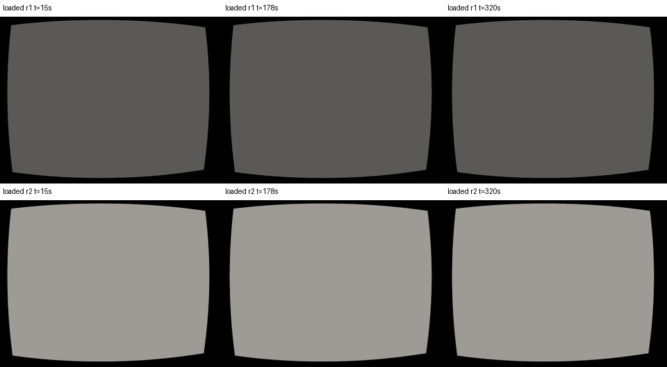
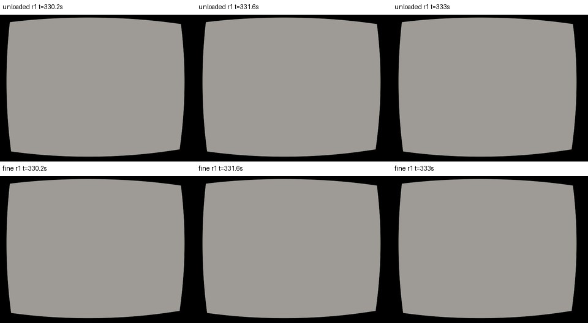
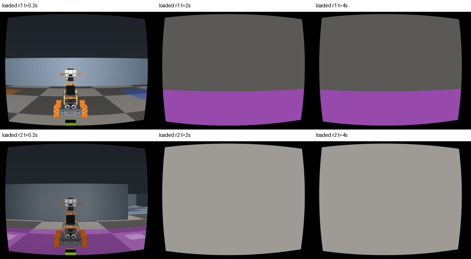
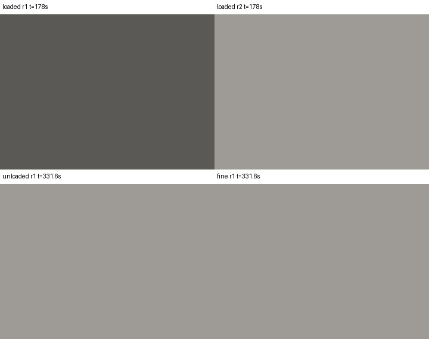
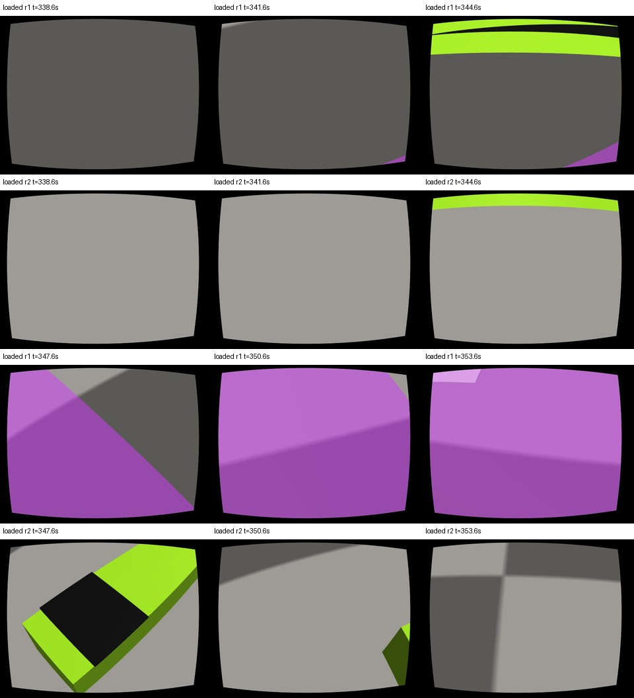

# v88 적재 보정 진단 — 기존 훈련 기록만 사용

2026-10-03. **보정은 계속 PARTIAL이다.** 하중 필터 때문에 운동 창이 사라진 것은 아니다. 전진·옆 이동의 데드밴드 가정, 서로 반대로 회전시키는 수집 명령, 가까운 빔 앞면의 화면 절단, 아직 움직이는 팔을 정착했다고 보는 조건, 팬 회전 중 실제 파지 상실이 서로 다른 막힘이다. 임계값을 완화하거나 실패값을 승인값으로 바꾸지 않았다.

`807,1897,2187,1500`은 서보 3·4·5·6의 **한 자세**다. “파지 표본 없음 5칸 / 잔차 거부 5칸”도 자세 10개가 아니라, 자세 2개의 필수 필드가 각각 5개씩 빠진 것이다. 자세 이름은 아래에서 **들기 자세**(`807,1897,2187,1500`), **바닥 파지 자세**(`1269,2052,2494,1500`)로 쓴다.

## 범위와 재현

| 항목 | 고정한 자료 |
|---|---|
| 진단 기준 소스 | `0bf41800272ec4c4bfa035cfc5609af8850e3e48` (`origin/main`, 시작 때 일치) |
| 조립기 시계 수정 | PR #358의 `d00208bae779f0cec334c592e11a5db954939ebd`; 지정한 `ASSEMBLY_CLOCK_FIX_20261003.md`도 원격 브랜치에서 읽음 |
| 세 수집의 실행 소스 | 모두 `747d2b9f1eb43e21804ccef58fff4db241d1a844` |
| unloaded | `outputs/final-pair-v88-cal-747d2b9f-20261001/calibration-unloaded` |
| fine | `outputs/final-pair-v88-cal-747d2b9f-20261001-r6/calibration-fine` |
| loaded | `outputs/final-pair-v88-cal-747d2b9f-20261001-r8/calibration-loaded` |
| 기존 조립 결과 | `outputs/final-pair-v88-measured-dryrun-20261003-035426/{calibration,fit_report,input_manifest}.json` |
| 이번 전체 로컬 분석 | `/Users/changmin/projects/ugrp/outputs/v88-loaded-diagnosis-20261003` |

위 `outputs/`의 기준 경로는 `/Users/changmin/projects/ugrp`다. 세 원본 수집의 전체 파일 목록·해시를 PR #358 입출력 모듈로 감사하고, 마지막에 **11,175개 입력 파일의 불변성**을 다시 확인했다. 세 감사 모두 PASS, 하중 분류도 기존 결과와 같았다. 원본을 수정하지 않았다. 원본 목록 해시는 [motion.json](motion.json)의 `raw`, 기준·과거 적합·dry-run 해시는 [reference_hashes.json](reference_hashes.json)에 있다.

읽지 않은 범위: `outputs/final-pair-v91-heldout-*` 전체. 이를 포함하는 검색·채점·조정은 하지 않았다. 기존 v6e/v6g의 훈련 적합값과 문서에 이미 실린 비교표만 사용했다. 새 물리 실행, 렌더링, 모델 호출은 없다. 기록된 관절 위치로 한 기구학 계산과 시선 교차 계산은 오프라인 진단이며 학생 입력·실행 보정이 아니다. `.github/workflows`, 동결 기준, 번들, 워크플로, 제어기는 변경하지 않았다.

재현 명령(각 출력은 **새 경로**여야 한다):

```sh
PY=/Users/changmin/projects/ugrp/.venv-sim-worker-mac/bin/python
DIAG=experiments/2026-10-03-v88-loaded-diagnosis
OUT=/Users/changmin/projects/ugrp/outputs/v88-loaded-diagnosis-NEW
PYTHONDONTWRITEBYTECODE=1 OPENBLAS_NUM_THREADS=1 "$PY" "$DIAG/diagnose.py" "$OUT"
PYTHONDONTWRITEBYTECODE=1 "$PY" "$DIAG/inspect_geometry.py" "$OUT/geometry.json"
PYTHONDONTWRITEBYTECODE=1 "$PY" "$DIAG/inspect_rejections.py" "$OUT/rejections.json"
PYTHONDONTWRITEBYTECODE=1 "$PY" "$DIAG/make_examples.py" "$OUT/example-images"
```

`diagnose.py`는 Git 객체에서 시계 수정 모듈 두 개를 메모리로 읽는다. 적합 함수는 현재 소스를 쓰며 관련 운동·r4·검증·추적기·B′ 파일이 `d00208ba`와 같은 바이트임을 확인했다. 최적화 결과를 기록하는 감시 함수만 추가했으며 목적함수·초깃값·범위·거부 검사는 그대로 실행했다. 실패를 무시하고 다음 보정값을 발행하지 않는다.

## A1. 운동 적합: 경계에 닿은 다섯 모수

고정 범위 그대로 재현: 수렴(`ftol`), 함수 평가 12회, 야코비안 계수(rank) **13/13**, 잔차 RMS `0.00376219047948`(m와 rad가 함께 든 목적함수이므로 단일 물리 오차로 해석하지 않음). `active_mask`의 다섯 항목이 아래와 같다. 전체 13개 값·특이값은 [motion.json](motion.json)에 보존했다.

| 모수 | 실제 적합값 | 허용 범위 | 닿은 경계 | 해석 |
|---|---:|---:|---|---|
| 회전 이득 `gain[2][2]` | 0.05000000000000003 | 0.05–4 | 하한 | 반대 회전 명령으로 묶인 두 로봇의 실제 회전이 매우 작음 |
| 회전 진행 시간상수 `tau_axis_s[2]` | 3.999999999999999 s | 0.01–4 s | 상한 | 작은 회전을 예측하려 이득을 낮추고 응답을 늦추는 같은 방향의 압력 |
| 전진 정지 경계 `deadband.c0[0]` | 0.006000000000000001 | 0.006–0.015 | 하한 | `.006`이 정지 수준이라는 가정과 실제 전진이 충돌 |
| 옆 이동 정지 경계 `deadband.c0[1]` | 0.006000000000000001 | 0.006–0.015 | 하한 | 더 낮은 시작점 또는 다른 입력 곡선이 필요하다는 신호; 실제 c0를 식별했다고 할 수 없음 |
| 회전 포화 시작 `deadband.u1[2]` | 0.039999999999999994 | 0.025–0.040 | 상한 | 포화를 늦춰 예측 회전을 줄임. 실제 회전 포화점이 `.04`보다 크다는 증거가 아님 |

### 범위의 출처

- [운동 조립기](../../scripts/final_pair_calibration_motion.py#L118-L139) 118–139행: 이득/시간상수는 로그 공간, c0/u1은 선형 공간. 도입 커밋 `87aa99c33`(#351); `41e145593`가 하중 선별 뒤 부호별 수준 지지와 실제 구간 나눔을 추가했다.
- 이득 `[.05,4]`, 진행 시간상수 `[.01,4]`, 정지 시간상수 `[.005,.5]`는 [r4](../../scripts/fit_consumer_criterion_b.py#L46-L55)와 [동결 B의 mean.fit](../2026-10-01-final-env-v87-calibration-fit/consumer_criterion_B.json)에 명시돼 있다. 장치 사양에서 유도한 물리 한계가 아니라 **등록한 적합 범위**다.
- c0 `[.006,.015]`, u1 `[.025,.040]`의 숫자는 B 본문에 없고, 조립기 코드가 [수집 크기 네 개](../../harness/zone_final_pair_excitation.py#L28-L34)를 정지·램프·램프·포화로 나누도록 정했다. B′의 `loaded_spread.deadband`와 앞 README가 관측된 정지 수준·두 램프 수준·포화 수준 및 내부해를 요구한다. 따라서 숫자만 넓혀 수락하면 이 의미를 바꾼다.
- [v6g 적합](../2026-09-29-pair-v6e-carry/fit_carry_general.py#L47-L61)은 옆 축에 한해서 c0 `0..0.012`(간격 `.0002`), u1 `c0+.004..0.050`(간격 `.001`)을 탐색했다. “모든 축의 c0가 .006 이상”이라는 근거가 아니다.

### 필터가 여기(excitation)를 없앴나: 아니다

검사 단위는 `2 로봇 × 3 축 × 2 부호 × 4 크기 × 6 시간창 = 288`개다. 모든 단위에서 `.006/.015/.025/.04`의 일정 명령만으로 채운 완전한 적합 창이 남았다. 아래 수는 **각 단위의 창 수**이며 필터 전후가 같다. 서로 겹친 창을 독립 반복으로 세지 않는다.

| 시간창(horizon) | 0.2 s | 0.5 s | 1 s | 2 s | 3 s | 3.2 s |
|---|---:|---:|---:|---:|---:|---:|
| 선별 전 / 후 | 197 / 197 | 191 / 191 | 181 / 181 | 161 / 161 | 141 / 141 | 137 / 137 |

운동은 수집 상대 시각 12–330 s다. 그 안의 50 ms 표본은 모두 상승·양쪽 로봇의 양 집게 접촉을 만족한다(12 이상 330 미만 6,360/6,360). 48개 로봇별 계단+정지 구간도 각각 221/221 표본이 남았다. `lifted 6839 / not_lifted 553 / missing_bilateral_grip 9`의 탈락은 처음 들기 전과 **운동이 끝난 뒤 팬 스캔**에 있다. 전체 시간 구간은 [rejections.json](rejections.json)을 참고한다.

다만 명령 수준의 존재와 그 수준이 실제로 정지/램프/포화를 나누는지는 다르다. 각 10초 계단의 마지막 5초를 기록된 위치로 계산하면:

| 명령 크기 | 전진 속도 절댓값(두 로봇·양 부호) | 옆 속도 절댓값 | 의미 |
|---|---:|---:|---|
| .006 | 2.536–2.542 mm/s | 0.077–0.174 mm/s | 특히 전진은 명백히 움직임. c0≥.006인 모형은 이 명령을 0으로 만듦 |
| .015 | 약 14.803 mm/s | 9.108–9.113 mm/s | 유효 응답 있음 |
| .025 | 약 30.505 mm/s | 20.817–20.819 mm/s | 유효 응답 있음 |
| .040 | 약 54.060 mm/s | 38.459–38.460 mm/s | 유효 응답 있음 |

따라서 전진 c0 하한은 이 자료의 “완전 정지 영역”으로는 틀렸다. 옆 이동의 작은 잔류 이동을 새 정지 허용 오차로 임의 분류하지 않았다. 경계 접촉은 입력 곡선의 부적합 가능성도 포함하므로, c0를 낮추는 것만으로 B′를 충족한다고 할 수 없다.

### 회전은 왜 거의 움직이지 않나

[명령 생성](../../harness/zone_final_pair_excitation.py#L54-L64) 61행(`05630ead7`)은 loaded의 r2에 **세 축 모두 −1**을 곱한다. 서로 약 180°를 보고 있는 로봇의 전진/옆 이동은 이 변환이 같은 세계 방향 이동을 만든다. 그러나 회전 부호는 180° 좌표 회전으로 바뀌지 않는다. r1 `turn=+.04`, r2 `turn=-.04`는 공동 회전을 여기하는 명령이 아니다. 실제 명령 JSONL도 이 스케줄과 일치한다. 읽는 쪽 부호만 고치면 원본 명령을 잘못 설명하게 된다.

`.04` 회전 계단의 마지막 5초에서 r1/r2의 속도는 `+0.000558 / −0.000332 rad/s`; 부호를 뒤집은 다음 계단은 `−0.000397 / +0.000617 rad/s`다. 구동 축 이득으로 나누면 약 `0.0083–0.0154`에 불과하다. 파지는 유지된다. 이는 연결된 빔을 두 방향으로 비트는 명령에 대한 응답이지 자유로운 공동 회전의 이득·시간상수 측정이 아니다. rank 13은 이 잘못 선택한 운동 방식과 모형의 물리적 적합성을 보증하지 않는다.

### 이전 loaded 적합과 비교

| 기록 | 전진/옆/회전 대각 이득 | 진행/정지 시간상수 | c0 / u1 | 비교 한계 |
|---|---|---|---|---|
| [v6e carry_dr_fit](../2026-09-29-pair-v6e-carry/carry_dr_fit.json) | 1.4004 / 1.0159 / 0.7411 | 0.8 / 0.05 s | 당시 평균모형에 별도 램프 없음 | 이 파일은 기존 평균을 고정하고 오차 분산을 적합한 기록; 이번 v3 평균의 재측정값이 아님 |
| [v6g carry_general_fit](../2026-09-29-pair-v6e-carry/carry_general_fit.json) | 기존 loaded 평균 사용 | 0.8 s 사용 | **옆 축 .0002 / .0292**; 전진·회전 0/0은 선형 경로 표기 | 옆 이동 steer 구간의 적합. 형상·자세·명령 방식이 v88과 다름 |
| 이번 v88 거부 후보 | 1.354686 / 0.963874 / **0.05(경계)** | 축별 0.965453 / 0.966707 / **4(경계)**; stop 0.092615 s | 전진 .006/.025973, 옆 .006/.027072, 회전 .008809/.04 | 승인값 아님; 이전 값을 대신 넣지 않음 |

**권고 A:** 회전은 **(ii) 새 loaded 수집**이 필요하다. 양 로봇의 각속도 부호를 일치시키는 공동 회전과 필요 접선 이동을 정적 기하·자기 명령으로 미리 정한 스케줄로 검증한다. 단순히 부호 한 줄을 고쳤다고 파지 유지·공동 회전이 검증되는 것은 아니다. 상대 회전 응답을 연구하려면 공동/차동 명령을 구분하는 모형이 먼저 필요하다. 전진·옆 c0는 **(iii) 코디네이터의 동결 기준 결정 → (ii) 새 수집**이다. 기존 네 크기는 보존하고, 예를 들어 `.001/.002/.004/.008/.010` 같은 더 작은 양·음 계단을 추가해 실제 정지 영역을 찾고 축별 모델을 결정한다. 10초 계단, 모든 3.2초 완전 창, 정지 구간, 별도 PRBS 검증을 유지하고 실제 상승·접촉 뒤의 지지를 다시 센다. 과거값 복사, 회전 범위 확대, 기존 PRBS로 튜닝은 하지 않는다. **새 번들 번호**가 필요하다.

## B1. 자기 RGB: 색상 변경보다 가까운 면의 절단과 자세가 문제

### 실제 JPEG에서 본 것

아래 시각은 모두 수집 시작 기준이다. 파일 ID·원본 SHA-256·잘라낸 좌표는 [이미지 목록](images/manifest.json)에 있다. 표시용 전체 영상은 640×480을 절반으로 줄였고, ROI는 `(x=140..499, y=40..299)`를 원래 해상도로 잘랐다. 새 장면을 렌더하거나 이미지 내용을 만들어 넣지 않았다.



| 표본 | 실제 보이는 내용 | ROI 평균 RGB / 채널 표준편차 | 마스크/가장자리 |
|---|---|---|---|
| loaded r1, 들기 자세 15/178/320 s | 어두운 회색 면. 집게·팔·빔의 윤곽 없음. 바깥 검정은 어안 변환의 유효 영역 밖 | 약 (90,89,85), 각 채널 표준편차 0 | 각각 마스크 0, edge 없음 |
| loaded r2, 같은 자세·시각 | 더 밝은 회색 면. 윤곽 없음 | (158,155,150), 각 채널 표준편차 0 | 각각 마스크 0, edge 없음 |
| unloaded/fine r1, 같은 들기 자세 330.2/331.6/333 s | 가까운 바닥 한 칸으로 보이는 균일 회색 | (158,155,150), 각 채널 표준편차 0 | 각각 마스크 0, edge 없음 |
| unloaded/fine r1, 바닥 파지 자세 333.2/334.6/336 s | 같은 종류의 균일 회색 | ROI 표준편차 0 | 각각 마스크 0, edge 없음 |
| loaded 두 로봇, 바닥 파지 명령 직후 0.2 s | 팔 이동 중이므로 상대 로봇, 바닥, 작은 빔 부분이 보임 | 정착 표본 아님 | 작은 색상 픽셀은 있어도 edge 없음 |
| loaded 두 로봇, 바닥 파지 자세 2/4 s | 회색 바닥과 화면 아래 보라색 바닥 표시. 라임색 빔 윤곽 없음 | ROI 표준편차 0 | 마스크 0, edge 없음 |

unloaded/fine의 **r2는 들기/바닥 파지 자세를 방문하지 않았다**. 전 구간 `740,2320,1320,1500`이므로 같은 자세 비교를 만들 수 없다. [별도 r2 기준 영상](images/r2-baseline.jpg)은 그 사실을 확인하는 비교이며 같은 자세 증거로 세지 않았다.





5초 간격 75장씩(`frames[::25]`, 0–370 s)을 따로 검사하면 색상 픽셀이 있는 영상은 r1 **2/75**, r2 **6/75**다. 앞 기록의 r2 5/75와는 추출 인덱스가 공개돼 있지 않아 동수 재현을 주장하지 않는다. 이번 인덱스·시각·해시는 모두 남겼다. 이 표본은 초기 무하중과 낙하 뒤도 포함한다. r1은 345 s의 팬 700에서 `edge_line` 한 번이 성립하지만, 고정 들기 자세의 운동 적합 창을 대신하지 않는다. 기존과 같은 쌍 읽기 경로는 **54개 창 모두 edge 불가**를 재현했다([pair.json](pair.json)). fine 평균은 읽기 경로 점검에만 빌렸으며 loaded/pair 보정으로 발행하지 않았다.

### 빔이 아예 시야 밖인가: 화면에 투영되지만 근거리에서 잘린다

`inspect_geometry.py`는 저장된 `scene.xml`과 `qpos`로 `mj_kinematics`·`mj_camlight` 및 시선 교차만 계산했다. 렌더러·물리 적분·실행기는 만들지 않았다. 실제 어안 보정의 광선으로 ROI 안 234곳을 검사했다.

| 기하 검사 | 결과 |
|---|---|
| 장면 크기 `model.stat.extent` | 11.1124880038 m |
| XML `visual/map znear` | .002, [기존 v2 장면](../../sim/masterpi_scene_v2.xml#L4)에서 상속 |
| 실제 근거리 절단면(near plane) | **.002 × extent = 0.0222249771 m**, 약 22.2 mm |
| loaded 15/178/320 s, r1/r2 각각 234개 시선 | 첫 물체 **전부** `cargo_beam__band_neg/pos`; 팔/집게에 먼저 닿는 시선 0 |
| 그 빔 앞면의 광학축 깊이 | **11.90–15.41 mm**, 모두 절단면보다 가까움 |
| 절단면 이후 남는 빔 앞면 | 검사한 ROI 시선마다 0. 빔 내부에서 만나는 출구 뒷면을 보이는 앞면으로 세지 않음 |
| 같은 자세의 unloaded/fine r1 | 234/234 시선이 바닥에 먼저 닿음 |

근거리 거리는 장면 크기와 곱해진다는 [MuJoCo 공식 명세](https://mujoco.readthedocs.io/en/stable/APIreference/APItypes.html#mjvisual)와 저장된 모델 수치로 계산했다. 결과는 [geometry.json](geometry.json)에 있다. **균일 회색은 빔이 회색 재질로 바뀌었다기보다 가까운 빔 앞면이 잘린 뒤 보이는 바닥이라는 설명과 맞는다.** 수정 후 재렌더 비교를 하지 않았으므로 “수정된 영상에서 회복됐다”는 주장은 하지 않는다.

이 절단 현상 자체는 새 발견된 렌더러 고장이 아니다. [기존 인식 코드](../../harness/zone_own_perception_v3.py#L75-L81)의 `13319fed3` 주석도 더 큰 당시 장면에서 near=29.7 mm 때문에 손에 든 물체 대신 배경이 보였다고 명시한다. 그 29.7 mm를 이번 장면의 실측 22.2 mm로 대신 쓰지 않았다. 기존 설정과 **새 v3 파지 자세를 함께 사용하면서** 관측 가능성을 확인하지 않은 통합 문제가 핵심이다.

더 낮은 절단면만으로도 끝나지 않는다. 절단 전의 234/234 첫 교차가 **검은 파지 띠**다. 현재 아래를 향하는 카메라/들기 자세는 색이 있는 옆면의 아래 경계 대신 바로 앞 검은 띠를 본다. 가림 물체는 팔·집게가 아니라 빔 자신의 표면이고, 추적할 색 띠의 경계가 ROI에 없다는 문제도 함께 있다. 카메라 위치·FOV나 로봇·빔 외관을 바꿔 이를 감추지 않는다.

### 마스크와 재질의 출처, 이전 성공 조건

- [BeamEdgeTracker](../../harness/own_beam_edge.py#L29-L76): PIL HSV(0–255)에서 `25 < H < 90`, `S > 100`, `V > 60`. 중앙 열 140–496(4픽셀 간격), 행 40–299. 연속 40픽셀 이상, 최소 20열, 잔차 RMS 2.5픽셀 이하 등의 추가 조건이 있다. 아무 색 픽셀 한 개가 있다는 것은 가장자리 관측이 아니다.
- 색 범위는 `86cdefc94`(v6e)에서, 연속 띠 검사는 `4fac772db`에서 도입됐다. 당시 cal 영상은 화면 위쪽에 두께 76–89픽셀인 노랑·초록 띠가 있었다. 현재 v3 자세에서 얻은 기준이 아니다.
- 저장 XML의 본체 `cargo_beam__bar`는 **RGBA `.55 .78 .12 1`**로 라임색이며, 끝 파지 띠는 **`.06 .06 .06 1`**다. [화물 카탈로그](../../sim/zone_cargo.py#L120-L165), 도입 `87eaac86`. `floor_light_v1`은 [조명·바닥 텍스처·반사만](../../sim/render_profile.py#L54-L64) 바꾸며 빔 RGBA나 기하를 바꾸지 않는다.
- 실제 loaded 팬 700(344.6 s)에는 화면 위쪽에 밝은 라임색 면과 검은 띠가 보인다. 팬 1770 전이 뒤 r2(347.6 s)에는 빔과 검은 띠가 크게 보이지만 이미 양쪽 파지가 끊긴 구간이다. **색상 마스크가 v3 빔 전체를 놓치도록 바뀐 것은 아니다.** 그 영상을 성공한 들기 자세의 대용으로 쓰면 안 된다.
- 이전 [v6e/v6g 단계 R 기록](../2026-09-29-pair-v6e-carry/README.md#단계-r-결과-통과-모든-판정-기준-충족): 동일 `floor_light_v1`에서 402프레임 중 no_edge/rejected 0, 적용 382; 색상 픽셀 평균 62,243–79,458, 기존 조명 대비 비 1.00–1.01. `carry_general_fit.json`의 slope/yaw 비는 1.00560이다. 따라서 프로필 이름만으로 이번 실패를 설명할 수 없다.
- 과거 training `cb215732-rsmoke`의 실제 `robots.json`을 확인하면 carry 자세는 **611,1711,2200,1500**이다. v3의 **807,1897,2187,1500**과 다르다. 해당 raw 및 `ece01311-fcal`, `4fac772d-yawcal`, `7392cb49-rsmoke2`에서 원래 JPEG는 현재 찾지 못했다. 이전 영상의 새 육안 검증은 미완료이며, 위 성공 수치는 **기존 문서·적합 기록의 수치**로만 인용한다. 보관된 명령/프레임 목록과 현재 원본 JPEG의 존재를 혼동하지 않는다.



**권고 B: (ii) 새 자세·일정의 loaded 수집이 우선이다.** 카메라/FOV·빔 색·질량·접촉·기존 렌더 조건은 유지하고, 팔의 합법적인 운반 자세 중 파지를 유지하면서 **절단면보다 먼 곳에 색 면의 실제 경계가 ROI 안에 보이는 자세**를 먼저 유한 진단한다. 그 자세로 정착 3초+참조 2장+평활 3장 및 8초 이상 쌍 창을 확보해 새 loaded 계단/PRBS를 수집한다. 팬 700의 순간 관측만으로 채택하지 않는다. 기존 회색 JPEG에서 사라진 픽셀을 조립기로 복구할 수는 없다.

별도 **(i) 코드 진단 개선**으로 현재 장면의 실제 near 거리와 예측 가능한 카메라 근접 가림을 수집 사전에 보고할 수 있다. 절단 원인 자체는 기록 qpos로 새 물리 궤적 없이 재렌더 비교할 수 있지만 여기서는 실행하지 않았다. near plane을 실제 거리 기준(예: 3 mm인 비교 프로필)으로 바꾸는 방안은 **(iii) 등록 영상 조건 결정** 뒤에만 검토한다. 기존 인식 코드도 절단 거리를 가정하므로 이를 무관한 버그 수정으로 취급할 수 없다. 새 자세/일정, 또는 결정된 새 렌더 조건은 **새 번들 번호**에 묶고 재렌더 파생본을 원래 v88 JPEG나 확증 자료로 치환하지 않는다. 색상·연속 길이·잔차 임계값 완화는 권고하지 않는다.

## C1. 카메라·팬 거부는 무엇을 뜻하나

### 바닥 파지 자세: 양손 접촉 자체가 전혀 없었던 것은 아니다

양 로봇 모두 이 자세의 프레임은 0.2–4.0 s에 20장, 정지·1초 정착 조건은 12장, **상승까지 만족하는 정착 표본은 0장**이다. 0.2 이상 4.0 미만의 50 ms 표본 76개 중 양쪽 로봇 양 집게 접촉은 36개지만 빔 최하단은 `−0.109..−0.108 mm`, 즉 바닥에 있다. 들기 명령은 4.0 s, 유효 상승은 4.10 s부터인데 다음 영상부터 이미 **다른 들기 자세**다.

따라서 “양손 파지를 못 했다”가 아니라 **바닥 파지 자세를 상승 상태로 측정하지 않는 스케줄과 loaded 필드 요구의 충돌**이다. 해당 자세는 원래 바닥 높이 파지용이므로 같은 자세를 오래 유지해도 상승 1 cm를 얻는다는 보장이 없다.

**권고:** **(iii) 코디네이터 결정.** [required_camera_poses](../../harness/zone_final_pair_vision.py#L39-L45)는 바닥 파지·들기 자세를 둘 다 loaded로 요구한다. 바닥 지지 파지 상태와 떠 있는 하중 상태의 카메라 적용 범위를 먼저 분리해야 한다. 기존 unloaded 값을 loaded로 복사하거나 상승 기준을 없애지 않는다. 동일 자세에서 실제 무지지 상승이 필요한 계약을 유지한다면, 이를 만들 수 있는 별도 수집 방법의 물리적 가능성을 먼저 보이고 **(ii) 새 수집/번들**로 측정해야 한다.

### 들기 자세: 계속 흔들리는 물리가 아니라 초기 팔 정착 과도응답

동결 카메라 기준은 [B′](../2026-10-01-v88-measured-calibration/criterion_B_prime.json)의 명령 후 1초 정착, 자세별 5장 이상, 원점 최대 1 mm, 회전 최대 0.1°다. 들기 자세는 236장(로봇당 118장)이 선택됐지만:

| 항목 | 전체 선택 표본 | 큰 잔차의 위치/분리 근거 |
|---|---:|---|
| 카메라→차체 원점 최대 | 3.54775 mm | r1 상대 5.2 s, 들기 명령 후 1.2 s |
| 카메라→차체 회전 최대 | 2.11256° | 같은 프레임. r2도 5.2 s에 2.11032° |
| 차체→바닥 원점/회전 최대 | 0.06446 mm / 0.03825° | 기준 안. 주된 변화는 차체 흔들림보다 팔 쪽 |
| 8–12 s의 전체 중앙값 대비 최대(각 로봇 21장) | r1 0.15045 mm / 0.09007°; r2 0.14944 mm / 0.08940° | 시간이 지나며 잔차가 줄어듦. 새 수락 판정이 아니라 원인 분리 |
| 333–337 s의 같은 중앙값 대비 최대(각 21장) | r1 0.00540 mm / 0.00271°; r2 0.00227 mm / 0.00099° | 후반 안정 자세는 매우 일관됨 |

5.2→5.4→5.6→5.8 s에서 r1 회전 잔차가 2.113→1.683→1.342→1.070°로 줄어든다. `_still_s`는 **명령이 바뀌지 않은 시간**이며 실제 관절 정착 측정이 아니다. 1초가 실제 loaded 팔 과도응답보다 짧아 초기 표본을 받아들인 것이다. 로봇 두 대를 섞은 것만의 문제도 아니다(각각 적합해도 최대 약 2.11°).

**권고:** **(iii) 정착/측정 구간 정의 결정 후 (ii) 새 고정 일정.** 단순히 전체 hold를 늘려도 현재 조립기는 첫 1초 이후 과도 표본을 계속 포함하므로 해결되지 않는다. 준비·들기 후 충분한 고정 대기를 둔 다음 별도 측정 구간을 시작하도록 계약을 먼저 정하거나, 기록 시작 전에 동일 자세·하중을 충분히 준비하는 새 수집을 설계한다. 이 자료를 보고 5.2–7.8 s만 지워 통과시키거나 `.1°` 기준을 올리지 않는다. 여기의 8초 분할은 진단이며 새 기준의 검증값이 아니다.

### 팬: 양 부호가 명령됐지만 양 부호의 하중 표본이 없다

동일 팔의 연속 정지 방문 안에서 pan=1500 기준, 양 부호 각각 5장 이상이 필요하다. 실제 순서는 `1500→1230→970→700→1770→2030→2300→1500`(334 s부터 3초 간격)이다.

| 팬 | 명령 시각 | 로봇별 정착·하중 유효 프레임 | 물리 기록 |
|---|---:|---:|---|
| 1500(시작) | 334 s | 기준 표본 있음 | 상승 약 63 mm, 양손 유지 |
| 1230 | 337 s | 11 / 11 | 유지 |
| 970 | 340 s | 10 / 10 | 340.10 s 접촉 끊김 1표본 |
| 700 | 343 s | 10 / 10 | 343.10–343.15 s 접촉 끊김 2표본 |
| 1770 | 346 s | **0 / 0** | 700→1770 큰 전이 직후 파지 상실. 346.25 s부터 상승+양손을 계속 만족하지 못함 |
| 2030 / 2300 | 349 / 352 s | **0 / 0** | 바닥으로 내려옴, 양손 접촉 없음 |
| 1500(복귀) | 355 s | **0 / 0** | 다시 들지 않으므로 기준 복귀도 무하중 |

팬+ 표본이 부족한 것은 방문 누락이 아니라 **파지 상실을 일으킨 스캔 순서/크기와 물리 응답**이다. 세 negative pan 자세 중 970·700도 광학 회전 잔차가 각각 0.85982°·0.64494°로 카메라 게이트를 넘는다. 단순히 positive를 먼저 돌리면 모든 문제가 해결된다고 단정할 수 없다.

**권고:** **(ii) 새 loaded 수집/번들.** 작은 양·음 변위를 각각 center→한 방향→center로 나누고, 필요하면 방향마다 새 파지 준비를 한다. 각 방문에 충분한 정착과 5장 이상이 들어가도록 고정 hold를 둔다. 동일 로봇·동일 팔·같은 연속 정지 그룹의 center 참조, 무지지 상승, 네 집게 접촉을 확인한다. 한쪽 파지가 끊긴 뒤 계속 스캔한 프레임을 loaded로 사용하지 않는다. 필요한 팬 범위가 실제로 하중을 유지할 수 없다면 관측 범위/계약을 **(iii)**로 돌려야 한다.

## 조정자에게 넘길 최소 수정 단위

| 막힘 | 분류 | 다음에 할 일 | 기존 자료만으로 보정 완료 가능한가 |
|---|---|---|---|
| 모수명이 없는 `rank 13/13` 오류 | (i) 진단 출력 개선 | 경계 모수명·값·범위·active_mask를 실패 보고에 보존. 이 PR의 별도 분석이 그 값을 제공 | 진단만 가능 |
| 전진/옆 c0 강제 하한 | (iii) → (ii) | 축별 정지/램프 모형 결정, 작은 명령 수준 추가 수집 | 불가 |
| 회전 gain/tau/u1 경계 | (ii), 필요시 (iii) | 공동/차동 회전을 구분한 물리적으로 가능한 명령 설계 | 불가 |
| 빔 앞면 근거리 절단 | (ii); 설정 변경은 (iii) | 기존 near 바깥에 경계가 보이는 자세 확보. (i) 사전 진단에서 실제 near 거리를 보고 | 기존 JPEG 복구 불가; 새 물리 궤적 없이 원인 비교는 가능 |
| 검은 파지 띠만 보는 들기 자세·pair 54창 제외 | (ii) | 같은 카메라/외관으로 색 면의 경계가 보이고 하중 유지되는 팔 자세를 먼저 검증 | 불가 |
| 바닥 파지의 loaded 모델 요구 | (iii) | 지지/상승 상태의 적용 범위를 결정 | 불가 |
| 1초 뒤에도 팔 과도응답 | (iii) → (ii) | 준비와 측정 구간을 사전 분리; 잔차 기준 유지 | 현재 기준으로 불가 |
| 양수 팬 유효 표본 0 | (ii) | 작은 양·음 별도 방문과 center 참조·필요시 재파지 | 불가 |

새 수집의 번호는 여기서 예약하지 않는다. main·열린 PR의 최댓값을 확인해 **새 번들/렌더 조건/일정 해시**를 코디네이터가 발급해야 한다. 수정한 표본 선택이나 모델을 v88 또는 이미 수집한 held-out의 원래 정의로 소급하지 않는다. unloaded B의 별도 누락 10칸도 그대로 남는다.

## 검증과 남은 일

- 세 원본 감사 PASS, 입력 11,175파일 최종 해시 재검사 PASS([verification.json](verification.json)). 경계 다섯 개·288개 지지 단위·54개 pair 창·카메라/팬 시각을 저장된 기록에서 재계산했다.
- 예시 JPEG 7개, 각각 1 MiB 미만, 합계 약 0.24 MiB. 원해상도 ROI와 축소 영상의 위치·해시를 기록했고 실제 이미지를 육안 확인했다. 전체 원본 JPEG를 Git에 복사하지 않았다.
- 기하 검사는 MuJoCo 3.12.0의 모델 컴파일·기구학·시선 교차까지만 했다. near 설정 변경 후 재렌더, 새 자세의 물리 인수, 새로운 수집과 기준 결정은 수행하지 않았다. 실물 성능·보정 승인·완주 성공 주장은 없다.
- 이전 pre-v3 carry 원본 JPEG의 현위치는 미확인이다. 과거 문서의 성공 수치와 남아 있는 프레임 목록을 비교했으며, 새 이미지 검증으로 부풀리지 않았다.
- [TensorBoard 진단 링크](http://127.0.0.1:6006/#timeseries&runFilter=%5E1003-v88-loaded-diag%2F&tagFilter=offline%2F&scalarSmoothing=0): 새 스냅샷 `outputs/tensorboard/1003-v88-loaded-diag`, run 1개. EventAccumulator로 스칼라 11개와 HParams 메타데이터를 다시 읽었고, 기존 서버 API에서도 `active_bounds=5`를 확인했다. 서버 logdir는 공용 루트와 일치한다. 새 영상은 0개다. 과거 cohort와 합산하지 않는다. [검증 JSON](tensorboard_verification.json).
- 공용 `tensorboard-view.json`에는 이 진단 키 하나만 추가했다. Chrome `강`의 기본 프로필을 확인했으나 UI 연결은 `cgWindowNotFound`로 실패했다. **실제 화면·pin·HParams 열 적용은 미확인**이다. 기존 서버는 변경하지 않았다(PID 조회는 샌드박스가 거부). 이번 값은 기존 훈련 raw의 오프라인 진단이며 새로운 로봇 실험 성공률이 아니다.
- 요청대로 Draft PR로 제출한다. 이 작업에서 병합하거나 기본 checkout을 갱신하지 않는다. 기본 checkout은 시작 때 main, clean, origin/main보다 32커밋 뒤였으며 이 샌드박스의 소스 쓰기 허용 범위 밖이다.

## 참고 자료

- [v88 실측 조립 README](../2026-10-01-v88-measured-calibration/README.md), [B′](../2026-10-01-v88-measured-calibration/criterion_B_prime.json), [동결 B](../2026-10-01-final-env-v87-calibration-fit/consumer_criterion_B.json)
- [PR #358 시계 수정 기록](https://github.com/cmkang131/UGRP-Multi-Robot-Collaboration-Project/blob/9b8a89c45b94264ff83708e062df04403344b7a0/experiments/2026-10-01-v88-measured-calibration/ASSEMBLY_CLOCK_FIX_20261003.md), [조립기 PR #351](https://github.com/cmkang131/UGRP-Multi-Robot-Collaboration-Project/pull/351)
- [운동 적합](../../scripts/final_pair_calibration_motion.py), [카메라·쌍 적합](../../scripts/final_pair_calibration_camera.py), [하중 선별](../../scripts/final_pair_calibration_io.py), [고정 스케줄](../../harness/zone_final_pair_calibration.py), [명령 부호](../../harness/zone_final_pair_excitation.py)
- [v6e/v6g 기록](../2026-09-29-pair-v6e-carry/README.md), [v6e 평균·분산](../2026-09-29-pair-v6e-carry/carry_dr_fit.json), [v6g 램프·drift·pair](../2026-09-29-pair-v6e-carry/carry_general_fit.json), [v6g 적합 코드](../2026-09-29-pair-v6e-carry/fit_carry_general.py)
- [가장자리 추적기](../../harness/own_beam_edge.py), [v3 물리/시각 형상](../../sim/masterpi_model_v3.py), [카메라 고정값](../../sim/masterpi_camera_profile.py), [빔 재질](../../sim/zone_cargo.py), [floor_light_v1](../../sim/render_profile.py)
- [MuJoCo near-plane 명세](https://mujoco.readthedocs.io/en/stable/APIreference/APItypes.html#mjvisual), [XML visual/map 설명](https://mujoco.readthedocs.io/en/3.13.0/XMLreference.html#visual-map)
- 관련 회귀의 범위도 확인했다: [조립기 합성 시험](../../tests/test_final_pair_calibration_assembly.py)은 창 지지·범위/접촉 거부를 검사하지만 실제 RGB의 관측 가능성과 물리 회전 여기까지 입증하지 않는다. 이 PR은 제어기/판정 코드 수정이 없으며 합성 전체 suite의 통과를 물리 증거로 제시하지 않는다.
