# 2026-10-05 높이 없는 벽 접촉 검출 오프라인 탐침 (#216)

Refs #216, #366. **물리 실행 0회, 새 렌더링 0회, 모델 호출 0회.** 기록된 자기 손목 카메라 프레임, `mj_forward`(적분 없음)와 `mj_ray`, 그리고 정답 기준용 분할 렌더(기록된 `qpos`로 `mj_forward` 후 한 장)만 썼다. 기록된 에피소드 폴더에는 쓰지 않는다. 채점에 정답(`eval_only/`, `inputs/static_map.json`)을 쓰지만 **검출기 입력에는 절대 넣지 않는다.** 검출기가 보는 것은 자기 undistorted RGB, 자기 발행 servo, 고정 카메라 보정, 자기 적재 상태(자기 그리퍼 명령)뿐이다.

브랜치 `claude/ego-wall-map`. 병합한 origin/main `b07f33aba278fda7434acaed0974c3d38f7b9ef0`, 코드·시험 커밋 `c0449803b38cbe2c4099fce2324ac361f2ecefea` (§0–§15 당시 기준). 설계 근거: [`docs/design/2026-10-05-ego-wall-map-for-llm-memory.md`](../../docs/design/2026-10-05-ego-wall-map-for-llm-memory.md).

**핵심 불변식: 벽 높이는 측정값이지 입력값이 아니다. 0.40 m도 예외가 아니다.**

**읽는 순서.** §0–§9는 첫 세션(원인 규명과 수정)의 기록이고, **§10–§15가 이어서 한 일**(면 단위 측정, 검출기 정밀도, 처짐 보정, 자기 지도 C, 메모리 D, 카메라 v3 상태)이다. **바꾼 것은 모두 옵션이고 기본값은 끈 상태(= #405 이전 동작)다. 옵션 이름·기본값·시험은 바로 아래 표에 있다.** 면 단위 결과는 §0.1 요약을 먼저 본다. **§16은 2026-10-06 출발 좌표계 누적 격자 결과**다. §16은 녹화·로그만 읽었으며 `mj_forward`·`mj_ray`·분할 렌더도 실행하지 않았다.

## 옵션: 바꾼 것마다 켜고 끈다 (기본값 = #405 이전 동작)

이번 작업이 기존 동작을 바꾸는 곳은 전부 명시적인 옵션이고 **기본값은 끈 상태**다. 끄면 #405 이전과 같은 출력이다. 예외는 채점기의 정답 계산뿐이다(평가 전용이라 기본값을 고친 쪽으로 뒀고, 옛 방식은 `--gt-camera model`로 되살린다).

| 옵션 | 이름 (위치) | 기본값 (꺼짐) | 켠 값 | 꺼졌을 때 |
|---|---|---|---|---|
| 적재 판정 | `--load-rule` (`wall_probe.loaded_for`, `set_load_rule`) | `s3` | `gripper` | 옛 규칙 `servo[3] ≥ 900`을 도구마다 읽던 방식 그대로(문자열 키로 읽어 항상 비적재였던 `wall_probe.run`·`coverage`·`overlay`·`diag_rows` 포함) |
| 바닥 조각 길이 | `floor_patch_max_m` (`--detector-params`) | `0` | `0.81` (`height_free_wall.FLOOR_PATCH_DIAGONAL_M`) | 지평선이 프레임 밖이면 모든 벽을 거부(옛 검출기) |
| 달리기 분할 창 | `run_step_window` | `1` | `3` | 인접한 두 행의 차로만 면을 끊음 |
| 면 윗변 여백 | `top_edge_px` | `0` | `4` | 면 상단이 행 0일 때만 "프레임 밖으로 이어짐" |
| 지평선 고정 | `clamp_horizon` | `False` | `True` (탐색용, 버린 변형) | 지평선 그대로 |
| 처짐 보정 | `--sag-comp` (`wall_probe.detector_bias(sag=True)`) | 끔 | 켬 (적재 항은 `--load-rule`과 무관하게 그리퍼 명령으로 가른다, §12.1) | 고정 편향 `SEED_BIAS` |
| C 자기 지도 | `ego_wall_map.EgoWallMap(enabled=…, settle_s=…)`, `segment_score.py --gate none\|settle` | `enabled=False` | `True` (`settle_s` 기본 0.25 s / 2.25 s, `None` = 게이트 없음) | 아무것도 쌓지 않고 아무것도 돌려주지 않음 |
| C 팔 축 오프셋 | `EgoWallMap(arm_axis_offset_m=…)`, `segment_score.py --arm-axis-offset-m` | `0` (기록만: 머리글에 `arm_axis_offset_recorded_m = 0.0482`) | `0.0482` (끝점 x에 더해 섀시 원점 좌표) | 끝점은 팔 축 좌표 그대로 (§13.1, 점수는 §13.5) |
| D 메모리 주입 | `harness.self_wall_memory.SelfWallMemory(self_walls_enabled, self_walls_text, self_walls_text_height)` | 셋 다 `False` | `True` | `Memory`와 같은 `snapshot()` (바이트 단위) |
| D 실행기 연결 | `harness.coela_runtime_self_walls.run_coela_episode(…, self_wall_memory=…, self_walls_source=…)` | `off` | `on_v1` | 고정된 `harness.coela_runtime.run_coela_episode`를 그 인자로 그대로 호출한다 (§14) |
| 출발 좌표 누적 격자 | `SelfWallMemory(self_map=…, self_map_options=…)` | `off` | `odom_grid_v1` (세부 설정 §16) | 기존 D 출력과 바이트 동일; 격자·자기 위치 적분을 만들지 않음 |
| (예외) 채점 정답 | `--gt-camera` | `true` (고친 정답) | `model` = 옛 정답 | 평가 전용 |

옵션을 켠 구성에 붙인 이름은 이 README의 표에서만 쓴다. **A** = 모두 끔 + 옛 채점기(`--gt-camera model`), **A2** = 모두 끔 + 고친 채점기, **B** = A2 + `--load-rule gripper`, **C** = B + `floor_patch_max_m=0.81`, **D** = C + `run_step_window=3`, **E** = D + `top_edge_px=4`, "+sag" = `--sag-comp` 추가.

끈 상태가 이전과 같다는 것은 시험으로 고정했다.
- `test_options_off_identical.py`: 옵션을 하나도 켜지 않고(`--gt-camera model`만) 개발 녹화를 채점하면 이전 세션의 `harness-full/`과 **`segments.jsonl` 바이트 동일, `per_frame.csv`의 옛 열이 셀 단위로 동일, `summary.json`의 옛 키가 동일**하다(그 뒤에 채점기에 더한 열은 평가 전용이다). 합성 장면에서는 기본 검출기와 "모든 옵션을 꺼진 값으로 명시한" 검출기의 출력이 같다. 켠 옵션은 `recorded_params`에 기록되고 꺼진 옵션은 기록되지 않는다(실행 기록이 이전과 같다).
- 별도로, `final/`의 9개 실행(3 녹화 × A·B·C)을 옵션 플래그만으로 다시 돌려 `options/`에 두고 `cmp`했다. `per_frame.csv`, `segments.jsonl`, `columns.npz`가 27개 모두 바이트 동일이었다. `summary.json`은 **기록된 파라미터 사전만** 다르다(`final/` 실행은 그 시점 `PARAMS`의 키를 전부 적었고 지금은 꺼진 옵션을 적지 않는다). 놓친 프레임 분류(`classify_missed --load-rule gripper`)는 `missed_frames.csv`가 같다.
- `test_load_rule.py`(옛 규칙·키 읽는 방식), `test_run_step_window.py`, `test_top_edge.py`, `test_floor_patch_extent.py`(`floor_patch_max_m` 기본 0, 켠 값), `test_sag_comp.py`(`detector_bias`가 꺼지면 상수 편향), `test_ego_wall_map.py`(꺼진 지도는 아무것도 쌓지 않음), `tests/test_self_wall_memory.py`(꺼진 D는 `Memory`와 바이트 동일, 켠 D도 기존 키를 그대로 둠), `tests/test_coela_runtime_self_walls.py`(꺼진 연결은 고정된 런타임과 같은 호출·같은 에피소드, §14).
- 한계: `coverage.py`, `overlay.py`, `diag_rows.py`, `cue_study.py`, `height_invariance.py`, `map2d.py`는 보관된 옛 출력이 없어 바이트 비교를 못 했다. 이 도구들은 옛 키 읽기 방식을 `legacy_str_key`로 보존했고 그 의미를 `test_load_rule.py`가 고정한다.


> **이 녹화는 예전 카메라다.** 새 카메라 v3(PR #401, 위쪽 +10°)로 녹화한 프레임에서는 이 숫자를 **다시 재야 한다.** 영향 세 가지: (1) 고정 고도 편향 `SEED_BIAS`(−1.07° / −2.62°)와 서보 처짐 보정은 이 카메라의 값이다. (2) 카메라가 +10° 위를 보면 지평선 행이 약 +109 px(10° × 10.86 px/°) 아래로 내려와, 이 녹화에서 지평선이 프레임 밖(−29 px)이던 자세는 프레임 안으로 들어온다. 그러면 바닥 조각 길이 검사(§4)는 그 자세에서 쓰이지 않고 정확한 지평선 검사가 쓰인다. 이 추정은 **측정한 것이 아니다.** (3) 놓친 프레임 분류(§3)와 벽이 보이는 프레임 수도 새 자세에서 다시 나와야 한다. **v3 재측정은 아직 못 했다(§15).**

## 0. 결과 한눈에

한 에피소드(`v98-dev-align_to_carry-a3415342-s911-wtA/zone_wide_door_geometry_v3`, r1, 1848프레임 중 2프레임마다 924프레임)를 채점했다. 벽이 보이는 프레임 247개.

- **행 +15.3 px, 거리 −0.46 m 치우침의 원인은 검출기가 아니라 적재 상태 판정이다 (§1).** 옛 규칙 `servo[3] ≥ 900`은 손목 자세 펄스라서 그리퍼가 열린 탐색 자세를 "짐을 든 상태"로 보고 운반용 고도 편향 −2.62°를 적용했다(맞는 값 −1.07°). 보이는 247프레임 중 151프레임이 잘못 적재로 분류됐고 자기 그리퍼 명령으로는 0프레임이다. 카메라를 1.33° 아래로 본 셈(= 14.4 px)이라서 검출기 행은 실제 경계에 있는데(−0.5 px) 옛 정답 행이 경계보다 14.4 px 위에 그려졌다.
- **놓친 101프레임은 전부 같은 원인이다 (§3):** 카메라가 지평선보다 많이 아래를 봐서 지평선 행이 프레임 위(중앙값 -28.8 px)에 있고, 그러면 "위로 균일하게 이어지는 면이 지평선에 닿는가" 검사를 어떤 벽도 통과할 수 없다.
- **고친 것은 둘, 각각 원인 하나씩이다.** (1) 적재 판정을 자기 그리퍼 명령으로(`--load-rule gripper`, 기본은 옛 규칙 `s3`), 채점 정답을 실제 렌더 카메라와 정확한 열 궤적으로(`--gt-camera true`, 옛 방식은 `model`). (2) 지평선이 프레임 밖일 때, 균일한 면이 바닥 무늬 한 조각(체크 한 칸 대각선 0.81 m)보다 길게 이어지면 바닥이 아니라고 본다(`floor_patch_max_m=0.81`, 기본 0 = 끔).

| 항목 | A 원래 | B 채점기+적재규칙 | C +바닥 조각 길이 |
|---|---|---|---|
| 벽이 보이는 프레임 | 247 | 247 | 247 |
| 0검출 프레임 (보이는 프레임 중) | 101 (40.9%) | 101 (40.9%) | 0 (0.0%) |
| 열 recall (보이는 열 중 접촉 보고) | 0.593 | 0.594 | 0.896 |
| 열 recall, 시험 가능 열만 (정답 접촉 행 ≥ 10: 위쪽 band가 프레임에 들어가는 열) | 0.661 | 0.660 | 0.988 |
| 정확한 접촉(행 오차 절댓값 ≤ 3 px) 비율 = precision | 0.014 | 0.685 | 0.642 |
| 정확 열 recall | 0.008 | 0.407 | 0.575 |
| 정확한 접촉이 0인 보이는 프레임 | 189 | 101 | 1 |
| 거짓 검출: 안 보이는 프레임 중 접촉이 있는 프레임 / 접촉 수 | 0/677 프레임, 0 접촉 | 0/677 프레임, 0 접촉 | 1/677 프레임, 1 접촉 |
| 거짓 검출: 면(segment) 수 | 0 | 0 | 0 |
| 행 오차 px, 프레임 중앙값의 중앙값 (p10…p90) | +15.29 (+13.92 … +16.49), n=146 | -0.75 (-0.98 … -0.50), n=146 | -0.63 (-0.96 … -0.17), n=247 |
| 행 오차 px, 열 단위 (p10…p90) | +15.31 (+4.41 … +32.39), n=13905 | -0.74 (-51.25 … +15.42), n=13954 | -0.63 (-3.98 … +16.56), n=21057 |
| 거리 오차 m, 프레임 중앙값의 중앙값 (p10…p90) | -0.461 (-0.730 … -0.287), n=146 | +0.092 (+0.043 … +0.194), n=146 | +0.056 (-0.036 … +0.148), n=247 |
| 거리 오차 m, 열 단위 (p10…p90) | -0.470 (-1.678 … -0.219), n=13905 | +0.088 (-0.293 … +0.445), n=13954 | +0.039 (-0.356 … +0.302), n=21057 |

*A 원래* = 옛 채점(모델 카메라, 옛 적재 규칙, 기존 검출기, `0-legacy-reproduce`와 같은 값). *B* = 채점기와 적재 규칙만 고침, 검출기는 그대로(`floor_patch_max_m=0`). *C* = B + 바닥 조각 길이 검사(`floor_patch_max_m=0.81`).
행 오차 = 검출기 `vb` − 정답 접촉 행(px, 양수 = 검출기가 경계보다 아래). 거리 오차 = 검출기 거리 − 정답 거리(m). "프레임 중앙값" = 프레임마다 중앙값을 낸 뒤 프레임 위에서 중앙값과 p10…p90. 열 단위 p10…p90에는 잘못 잡은 접촉이 섞여 꼬리가 길다(§5.1). 가림 마스크 변형 `mask_on`과 `mask_off`는 개발 에피소드 C 실행에서 값이 같다. 표는 `mask_on`.

**정직하게 읽는 법.**
- 행 치우침 중앙값은 +15.3 px → −0.75 px(B)로 사라졌다. C에서는 -0.63 (-0.96 … -0.17) px.
- 거리 치우침은 −0.46 m → +0.09 m(B)로 줄었고 남은 +0.09 m는 아래 §5.2의 서보 처짐(자세마다 달라서 고정 편향으로 못 지우는 부분)이다.
- 접촉의 36%(7540/21057 열)는 |행오차| > 3 px인 잘못된 접촉이다 (B에서도 31%). 이건 중앙값 치우침과 별개의 문제이고, 이번에 고치지 않았다 (§5.1).

### 0.1 이어서 한 일: 자기 지도 C와 메모리 D (같은 PR, 옵션, 모델 호출 0회, 새 시뮬레이션 0회)

**지도에 들어가는 단위(면)로 처음 쟀다.** 지도에 쌓이는 면 하나를 정답 벽에 놓고 0.15 m 안이면 "정확"이라 할 때 개발 녹화의 정확한 면 비율은 옛 검출기(A) 4%, 바닥 조각 길이(C) 36%, 분할 창(D) 64%, D + 처짐 보정 77%, 게이트까지 건 지도(E + 처짐 + 정착 게이트) **88%**이다 (§10, §11, §12, §13). 확인 녹화에서도 같다.

- **C0는 필요했고 했다 (§11).** 위 §5.1의 "잘못된 접촉 36%"는 면으로 묶인 뒤에도 면의 절반 이상을 틀리게 했다(C의 정확한 면은 36%뿐). 원인은 `run_step_window`를 쓸 때 면 위쪽을 읽는 행이 틀려 있던 것이다. 고치자 벽 밑동 앞 체크 칸 모서리를 잡는 접촉(+10…+20 px)이 17.8% → 0.4%로 사라졌고 열 단위 precision이 0.64 → 0.84로 올랐다.
- **처짐 보정은 옵션으로 넣었다 (§12).** 명령 자세만으로 카메라 고도 오차를 예측한다. 자세 하나 빼기 교차검증에서 남는 고도 오차(절댓값 중앙값)가 상수 편향 0.36° → 0.15°다. 4 m 이상의 정확한 면 비율은 2% → 41%(면 수 195개)다.
- **C: 자기 지도 쌓기를 만들었다 (§13).** 정착 후 관측만, 중복 제거 없음, `t_sim` 유지. 지도 원점은 섀시 원점이고 **팔 축 오프셋 0.0482 m는 기록만 한다**(`arm_axis_offset_m` 기본 0). 더한 쪽과 안 더한 쪽의 점수는 §13.5에 둘 다 있다. 개발 녹화에서 138개 관측이 쌓였고 정답 면의 66%를 찾았다.
- **D: 메모리 주입을 만들고 실행기에 옵션으로 연결했다 (§14).** `SelfWallMemory`는 고정된 `coela_*`를 건드리지 않는 덧붙임 하위 클래스이고, 새 모듈 `harness/coela_runtime_self_walls.py`가 `self_wall_memory=on_v1`일 때만 그것을 쓴다(기본 `off`는 고정된 런타임을 그대로 부른다). `source_manifest.json`에는 새 번들로 등록했다. 벽 기록을 채워 주는 쪽(프레임 → 검출기 → 자기 지도)은 실행기에 없어서 `self_walls_source` 훅으로만 열어 뒀다.
- **카메라 v3 재측정은 아직 못 했다 (§15).**

### 튜닝에 쓴 프레임과 확인용 프레임

| 구분 | 프레임 | 용도 |
|---|---|---|
| 점검·개발 | 위 에피소드 r1 924프레임 (보이는 247프레임) | 원인 분리(§1), 놓친 프레임 분류(§3), 바닥 조각 길이 규칙 설계(§4), 버린 변형 비교 |
| 확인 | `v98-dev-align_to_carry-7194637e-s912`와 `-s913` (r1) | 규칙과 값 0.81 m를 정한 뒤 **처음으로** 돌림. 재조정 없음 |

0.81 m는 정답을 보고 고른 값이 아니다. 장면의 바닥 무늬 칸 크기에서 나온다(§4.2). 그래도 개발 프레임에서 후보 변형(지평선 고정, 달리기 창 3행, 바닥 조각 길이)을 서로 비교했으므로 그 비교는 개발 단계의 것이고, 아래 확인 결과는 **같은 코드와 같은 값**을 다른 시드에 돌린 것이다.

| 항목 | s912 A 원래 | s912 B 채점기+적재규칙 | s912 C +바닥 조각 길이 | s913 A 원래 | s913 B 채점기+적재규칙 | s913 C +바닥 조각 길이 |
|---|---|---|---|---|---|---|
| 벽이 보이는 프레임 | 276 | 276 | 276 | 257 | 257 | 257 |
| 0검출 프레임 (보이는 프레임 중) | 115 (41.7%) | 115 (41.7%) | 0 (0.0%) | 101 (39.3%) | 101 (39.3%) | 0 (0.0%) |
| 열 recall (보이는 열 중 접촉 보고) | 0.582 | 0.584 | 0.892 | 0.609 | 0.609 | 0.899 |
| 열 recall, 시험 가능 열만 (정답 접촉 행 ≥ 10: 위쪽 band가 프레임에 들어가는 열) | 0.650 | 0.651 | 0.986 | 0.677 | 0.674 | 0.988 |
| 정확한 접촉(행 오차 절댓값 ≤ 3 px) 비율 = precision | 0.013 | 0.671 | 0.635 | 0.011 | 0.692 | 0.649 |
| 정확 열 recall | 0.008 | 0.392 | 0.566 | 0.006 | 0.421 | 0.584 |
| 정확한 접촉이 0인 보이는 프레임 | 212 | 115 | 1 | 203 | 101 | 1 |
| 거짓 검출: 안 보이는 프레임 중 접촉이 있는 프레임 / 접촉 수 | 0/485 프레임, 0 접촉 | 0/485 프레임, 0 접촉 | 1/485 프레임, 1 접촉 | 0/485 프레임, 0 접촉 | 0/485 프레임, 0 접촉 | 1/485 프레임, 1 접촉 |
| 거짓 검출: 면(segment) 수 | 0 | 0 | 0 | 0 | 0 | 0 |
| 행 오차 px, 프레임 중앙값의 중앙값 (p10…p90) | +15.29 (+13.52 … +16.71), n=161 | -0.72 (-0.98 … -0.45), n=161 | -0.65 (-0.97 … -0.17), n=276 | +15.29 (+13.93 … +16.50), n=156 | -0.75 (-0.98 … -0.51), n=156 | -0.64 (-0.96 … -0.17), n=257 |
| 행 오차 px, 열 단위 (p10…p90) | +15.31 (+3.92 … +32.69), n=15282 | -0.72 (-52.35 … +16.06), n=15351 | -0.64 (-4.04 … +17.08), n=23450 | +15.32 (+5.57 … +32.46), n=14865 | -0.74 (-50.75 … +15.43), n=14913 | -0.64 (-3.92 … +16.52), n=22026 |
| 거리 오차 m, 프레임 중앙값의 중앙값 (p10…p90) | -0.410 (-0.725 … -0.269), n=161 | +0.085 (+0.025 … +0.194), n=161 | +0.051 (-0.037 … +0.142), n=276 | -0.458 (-0.725 … -0.280), n=156 | +0.088 (+0.047 … +0.194), n=156 | +0.056 (-0.036 … +0.142), n=257 |
| 거리 오차 m, 열 단위 (p10…p90) | -0.452 (-1.690 … -0.218), n=15282 | +0.079 (-0.300 … +0.474), n=15351 | +0.025 (-0.359 … +0.304), n=23450 | -0.464 (-1.662 … -0.222), n=14865 | +0.089 (-0.294 … +0.457), n=14913 | +0.045 (-0.353 … +0.308), n=22026 |

**확인 결과의 한계.** s912, s913은 같은 정책·같은 아레나·같은 카메라로 기록돼 자세 집합(탐색 자세 `s3=740`과 전이 자세)이 거의 같다. 그래서 숫자가 개발 프레임과 거의 같게 나오는 것은 "시드가 달라도 같은 코드가 같은 결과를 낸다"는 확인이지, 다른 카메라·다른 바닥·다른 자세에서도 맞다는 확인이 아니다. 에피소드 r2 로봇은 돌리지 않았다.

## 1. 15 px 치우침의 원인 분리 (할 일 1)

세 후보: (a) 검출기가 경계보다 아래 행을 고른다 (b) 검출기가 쓰는 카메라(자세·높이·CY)가 실제 렌더 카메라와 다르다 (c) 채점 쪽 기하가 틀렸다.

### 1.1 모델 없는 기준: 분할 렌더

경계 행의 기준으로 **카메라 모델·자세·검출기를 전혀 쓰지 않는 값**을 만들었다. 기록된 `qpos`로 `mj_forward`만 하고 같은 `robot_cam`으로 **분할(segmentation) 렌더**를 한 장 떠서, 검출기의 각 열 띠(5 px 폭) 안에서 **벽 픽셀이 맨 아래로 내려오는 행**을 읽는다(`code/diag_bias.py`, `seg_boundary_rows`). 거기에 +0.5를 더한 것이 벽과 바닥 사이 경계다. 거리의 기준은 그 픽셀로 `mj_ray`를 쏜 값이다. 분할 렌더는 undistort된 영상과 같은 핀홀이므로 영상 행과 직접 비교된다.

### 1.2 실제 열 단면으로 본 한 장면

프레임 97(`robots/r1/rgb/00096.jpg`, s1=2000 그리퍼 열림, s3=1072), 열 310. 검출기가 쓰는 5 px 띠의 휘도 L, 색 Cr (`code/column_profile.py`):

```
frame 97 (robots/r1/rgb/00096.jpg), detector column 310, s1=2000 s3=1072
marks: seg=132.50, det=132.00, det_old=132.00, V0=116.86, V1=134.11, V4=133.29
row      L      Cr   marks
 113   75.3   27.0   
 114   75.3   27.0   
 115   75.3   27.0   
 116   75.3   27.0   
 117   75.3   27.0   V0
 118   75.3   27.0   
 119   75.3   27.0   
 120   75.3   27.0   
 121   75.3   27.0   
 122   75.3   27.0   
 123   75.3   27.0   
 124   75.3   27.0   
 125   75.3   27.0   
 126   74.9   29.0   
 127   75.6   29.4   
 128   75.9   30.0   
 129   75.4   28.8   
 130   76.2   24.0   
 131   74.6   18.2   
 132   88.0   11.6   seg det det_old
 133  123.4    6.8   V4
 134  148.3    1.2   V1
 135  154.5   -3.4   
 136  154.7   -6.0   
 137  154.9   -8.0
```

벽면(L 75.3)은 행 125까지 평평하고 행 132–134에서 바닥 칸(L 154)으로 넘어간다. 분할 렌더 경계는 132.5, 검출기 `vb`는 132로 같은 곳이다. 반면 **옛 정답 행 V0은 116.9**로, 영상에서 아무 일도 일어나지 않는 벽면 한가운데다. 즉 15 px는 영상이 아니라 정답 행의 문제다.

### 1.3 전체 열에서의 수치

대상: 벽이 보이는 247프레임, 분할 렌더에 벽이 있는 열 23124개 (`final/main-cause-separation/summary.json`). 행 = 해당 행 − 분할 렌더 경계, 중앙값(p10…p90), px.

**(a) 검출기 행은 기준 경계에 있다.** 검출기 `vb` − 경계 = **-0.5 (-5.5 … +15.5)** (옛 적재 규칙, n=13903), -0.5 (-10.5 … +15.5) (자기 그리퍼 규칙). 경계 ±1 px 안에 드는 열이 61%다. 나머지 열은 경계 말고 다른 곳(검은 체크 칸 모서리, 물체)을 잡은 접촉이고 이건 중앙값 치우침이 아니다(§5.1). **"검출기가 경계보다 일정하게 아래를 고른다"는 가설은 기각.** 같은 `window_px`, `band_px`, `edge_margin_px`, 띠 오프셋이 경계를 정확히 잡는다.

**(b)+(c) 정답 행 구성별 편차 (정답 행 − 경계, px / 정답 거리 − `mj_ray`, m):**

| | 구성 | 행 오차 | 거리 오차 |
|---|---|---|---|
| V0 | 옛 채점 (모델 카메라 + 옛 적재 규칙 `servo[3]≥900`, 가장 가까운 점에서 쏜 선) | -14.38 (-16.71 … -1.62) | +0.0456 (+0.0091 … +0.0552) |
| V1 | V0 + 적재 상태를 자기 그리퍼 명령으로 | +0.89 (-3.13 … +3.22) | +0.0462 (+0.0068 … +0.0548) |
| V2 | V1 + 섀시→팔 축 4.8 cm 앞 오프셋 반영 | +2.63 (-1.25 … +3.84) | -0.0024 (-0.0128 … +0.0078) |
| V3 | V2 + 열의 바닥 궤적과 정확히 교차 | +2.66 (-1.44 … +3.72) | +0.0004 (-0.0002 … +0.0014) |
| V4 | V3 + 실제 렌더 카메라 자세 (현재 채점기) | +0.60 (+0.14 … +0.97) | +0.0000 (-0.0001 … +0.0002) |

- V0 → V1에서 −14.4 px가 +0.9 px로 바뀐다. **적재 규칙 하나가 15 px를 설명한다.**
- V1 → V2는 +1.7 px 더한다. FK의 원점은 **팔 축**이고 맵 변환은 섀시 원점 기준이라 둘 사이가 4.9 cm(`arm_base` body 오프셋 0.0482 m)다. 모델에 이 오프셋이 없다.
- V3(정확한 열 궤적)은 거리 근사 오차를 지운다: 거리 편차 중앙값 -0.0024 m → +0.0004 m, p10…p90이 ±1 cm에서 ±1 mm로.
- V4(실제 렌더 카메라)는 경계에 +0.6 px(0.14…0.97)로 붙는다. 남은 0.6 px는 "마지막 벽 행 + 0.5"와 "연속 접촉 행"의 규약 차이다.
- 정답 거리는 V0도 `mj_ray`와 중앙값 +4.6 cm 차이로 거의 맞는다. 그런데 옛 채점의 거리 오차 −0.46 m는 **정답이 아니라 검출기 거리**의 오차다: 검출기 거리 − `mj_ray` = **-0.42 (p10 -1.62, p90 -0.20) m** (옛 적재 규칙) → +0.09 (p10 -0.29, p90 +0.44) m (고친 규칙).

### 1.4 카메라 쪽: 실제 렌더 카메라와 검출기 카메라 (`final/main-cause-separation/pose_compare.csv`)

| 항목 | 값 (보이는 247프레임 중앙값, p10…p90) |
|---|---|
| 실제 렌더 카메라 고도 | -13.83 (p10 -21.57, p90 -13.80)° |
| 검출기 고도 − 실제 (옛 적재 규칙) | **-1.33 (p10 -1.36, p90 -0.12)°** |
| 검출기 고도 − 실제 (자기 그리퍼 규칙) | **+0.20 (p10 -0.13, p90 +0.23)°** |
| FK만 (편향 없음) − 실제 | +1.27 (p10 +0.94, p90 +1.30)° |
| 카메라 높이 모델 − 실제 | +0.32 mm (높이는 맞다) |
| 카메라 x 실제 − 모델 | +4.86 cm (팔 축 오프셋) |
| 적용된 편향 | 옛 규칙 -2.62° (p90 -1.07°), 고친 규칙 -1.07° |
| 적재로 분류된 프레임 | 옛 규칙 151/247, 자기 그리퍼 규칙 0/247 |

1° = 622.17 px × π/180 = 10.86 px이므로 −1.33°는 14.4 px다. 카메라 높이와 CY는 문제가 아니다(높이 0.3 mm). 편향 항목은 `SEED_BIAS = {'unloaded': -0.01868, 'loaded': -0.04579}` rad이고 `loaded` 값은 M1 상자 운반 보정에서 왔다.

### 1.5 결론

| 후보 | 판정 | 근거 |
|---|---|---|
| (a) 검출기가 경계보다 아래를 고른다 | **중앙값 치우침의 원인은 아니다** | 검출기 행 − 분할 렌더 경계 = -0.5 px. 일부 열이 경계 아래의 체크 모서리를 잡는 것은 별개의 문제(§5.1) |
| (b) 검출기 카메라가 렌더 카메라와 다르다 | **주원인** | 적재 규칙 오분류: 151/247프레임에 편향 −2.62° 적용 (맞는 값 −1.07°), 검출기 고도 오차 -1.33° ≈ 14 px |
| (c) 채점 기하 오류 | **부수** | 팔 축 오프셋 4.8 cm(≈ 1.7 px), 최근접점 선 근사(거리 ±1 cm) |

## 2. 수정 1: 적재 판정과 채점 기하 (할 일 2)

- `code/wall_probe.py` `is_loaded(servo)`와 옵션 `--load-rule {s3,gripper}`(기본 `s3` = 옛 규칙, `gripper` = 아래 고침; 도구마다 `loaded_for`로 읽는다): 자기 그리퍼 명령 펄스(servo 1)가 닫힘(≤ 1600; 운반 프레임은 1500)이면 적재. 채널 키는 정수·문자열 모두 받는다. 옛 코드에는 문자열 키로 `servo.get('3', 0)`을 읽는 버그도 있었다(`wall_probe.run`이 정수 키 dict에서 항상 0을 읽어 가림 마스크가 꺼졌다). `self_top_for`, `run`과, 같은 옛 규칙을 쓰던 `map2d.py`, `coverage.py`, `overlay.py`, `diag_rows.py`, `cue_study.py`, `height_invariance.py`가 전부 이 함수를 쓰게 했다. 자기 명령만 쓰므로 검출기 입력 규칙(정답 금지)을 지킨다. 전체 1848프레임에서 옛 규칙은 669프레임, 자기 그리퍼 규칙은 571프레임을 적재로 본다.
- `code/true_camera.py` + `code/score_harness.py`: 정답 접촉을 **실제 렌더 카메라**(`mj_forward`로 얻은 `cam_xpos`, `cam_xmat`)와 **열의 바닥 궤적 `q0 + t·d`와 벽 사각형의 정확한 교차**로 만든다. 옛 모델 카메라와 최근접점 선 근사는 `--gt-camera model`로 되살릴 수 있다(채점기 정답만 예외로 기본이 고친 쪽이다). 적재 규칙은 기본이 옛 규칙 `s3`이므로 `--gt-camera model` 하나로 돌리면 기존 `harness-full/`과 `segments.jsonl`이 바이트 동일이고 `per_frame.csv`가 셀 단위로 같다(A열, `test_options_off_identical.py`).
- 이 수정은 **채점 기하와 검출기 입력(적재 상태)** 두 곳을 고쳤다. 검출기 알고리즘은 그대로다. 표의 A→B가 그 효과다(`--load-rule gripper`를 켠 결과): 행 치우침 중앙값 +15.29 → -0.75 px, 정확한 접촉(|오차| ≤ 3 px) 비율 0.014 → 0.685.

## 3. 놓친 101프레임의 원인 분류 (할 일 3, 앞부분)

방법 (`code/classify_missed.py`): 놓친 프레임마다, 정답 가시 열 전부에서 검출기의 각 게이트를 **정답 접촉 행**에서 평가한다. 게이트 순서에서 처음 탈락시키는 것이 그 열의 원인이고, 프레임의 원인은 열 다수결이다. 정답은 "게이트를 어느 행에서 재는가"에만 쓰고 어떤 값도 검출기로 들어가지 않는다. 게이트 순서: `sliver`(접촉이 이미지 위에서 10행 이내라 위쪽 band가 안 들어옴), `horizon`(위로 균일한 면이 지평선에 못 닿음), `contrast`, `band_std`, `range`, `self_mask`, `other`.

| 원인 | 놓친 프레임 수 (프레임 원인) | 열 수 (열 원인) | 대표 프레임 (`$EP`는 §7의 개발 에피소드) |
|---|---|---|---|
| **horizon** (지평선 행이 프레임 밖) | **101/101** | 7130 | `$EP/robots/r1/rgb/00000.jpg`, `$EP/robots/r1/rgb/00004.jpg`, `$EP/robots/r1/rgb/00172.jpg` |
| sliver (문간 틈새 열, 접촉 < 10행) | 0 | 2352 (놓친 프레임당 중앙값 26/96열) | 같은 프레임의 일부 열 |
| contrast, band_std, range, self_mask, other | 0 | 0 | — |

- 놓친 프레임의 지평선 행: 중앙값 -28.8, 범위 -62.2 … -4.2 (전부 음수 = 지평선이 프레임 위).
- 자세: `s3=740` 탐색 자세 85프레임, 전이 자세(`s3` 741–984) 16프레임. 전부 그리퍼가 열린(`s1=2000`) 프레임이다.
- 확인 에피소드도 같다: s912 115프레임, s913 101프레임, 둘 다 전부 `horizon`.
- **"벽이 화면에 아주 조금만 보임"**(sliver)은 놓친 프레임의 주원인이 아니다. 열 수준에서는 놓친 프레임당 26/96열이 문간 틈새라서 어차피 시험할 수 없지만(표의 시험 가능 열 recall 참조), 프레임 전체의 검출을 막는 것은 `horizon`이다. 가림·대비 부족은 0.

## 4. 수정 2: 지평선이 프레임 밖일 때의 바닥 조각 길이 (할 일 3, 뒷부분)

### 4.1 원인

검출기는 접촉 후보 위의 균일한 면이 **지평선 행 위까지** 이어지면 수직면으로 본다(`above_is_vertical = run_top ≤ horizon`). 바닥은 지평선 위에 나타날 수 없으므로 표준 논거다. 그런데 카메라가 아래로 `atan(CY/FY)` = 19.4°보다 더 숙이면 지평선 행이 음수이고 `run_top`(≥ 0)이 절대 못 닿는다. 이때 벽은 **이론상 검출 불가**가 된다. 이 녹화는 탐색 자세 `s3=740`에서 지평선이 −29 px이다.

### 4.2 고침

지평선이 프레임 밖(`horizon < 0`)인 열에 한해서, 지평선 대신 **그 균일한 면이 바닥이라면 바닥 평면에서 얼마나 길어야 하는가**를 묻는다. 바닥 무늬는 한 무늬 조각 이상 균일할 수 없다. 후보 행과 면 상단 행을 바닥 평면에 역투영한 거리 차 `t_top − t`가 `floor_patch_max_m` 이상이면 바닥이 아니다. 지평선이 프레임 안인 열은 정확한 지평선 검사를 그대로 쓴다.

옵션 `floor_patch_max_m`의 기본은 0(끔), 켤 때 쓰는 값 `height_free_wall.FLOOR_PATCH_DIAGONAL_M = 0.81 m`는 바닥 체크 한 칸의 **대각선**이다: 바닥 평면 16 m, `texrepeat 14`, 반복 한 번에 2칸이므로 칸 한 변 16/14/2 = 0.571 m, 대각선 0.571·√2 = 0.808 m. 한 열의 궤적이 한 칸을 가로질러 같은 색으로 지나갈 수 있는 최대 길이다. 값은 `scene.xml`의 바닥 재질에서 나오는 **환경 사전값**이며 정답 벽에서 튜닝한 것이 아니다. 바닥이 바뀌면(칸 크기가 달라지면) 다시 정해야 한다. 벽 높이 입력은 여전히 없다(`test_params_carry_no_wall_height` 통과).

### 4.3 결과 (표 A → B → C)

- 놓친 프레임 101 → **0**, 열 recall 0.594 → **0.896**, 시험 가능 열 recall 0.660 → **0.988**, 정확 열 recall 0.407 → 0.575.
- 거짓 검출(벽이 안 보이는 프레임): 677프레임 중 접촉이 있는 프레임 **1**, 접촉 1개, 면(segment) 0개. 그 한 접촉은 프레임 3(`s3=860`)의 열 329, 거리 0.19 m이고 세 에피소드에서 모두 같은 프레임 3에 나온다(시작 자세의 근거리 물체 추정, 미확인). 면으로 묶이지 않았다.
- 확인 에피소드(위 표): 놓친 프레임 0, 열 recall 0.89, 거짓 면 0.
- 정확한 접촉 비율(precision)은 0.685 → 0.642로 **조금 떨어졌다.** 새로 잡히는 열이 같은 종류의 잘못된 접촉(§5.1)을 같은 비율로 포함해서다.

### 4.4 버린 변형 (개발 프레임에서 비교; 출력은 `wall-bias-fix/` 아래)

| 변형 | 놓친 프레임 | 열 recall | precision | 거짓 검출 (안 보이는 프레임) | 판정 |
|---|---|---|---|---|---|
| 지평선을 0 행으로 고정(`clamp_horizon`) | 0 | 0.633 | 0.674 | **335/677 프레임, 1213 접촉**, 면 7 | 버림: 벽이 안 보이는 프레임에 바닥 면을 만든다 (`4-clamp-horizon`) |
| 달리기 분할 창 3행(`run_step_window=3`)만 | 101 | 0.593 | 0.683 | 0 | 버림: 놓친 프레임을 못 고치고 행 치우침 −2.5 px (`scratch/runsplit3`) |
| 바닥 조각 길이 + 창 3행 | 1 | 0.888 | 0.699 | 0 | 보류: precision과 정확 recall은 오르나(0.699 / 0.621) 행 치우침 −2.5 px. **→ §11에서 면을 읽는 행을 고쳐 해소하고 D로 옵션 채택** (`scratch/both`) |
| **바닥 조각 길이 0.81 (채택)** | **0** | **0.896** | 0.642 | 1/677 | 채택 |

"한 가지 원인만 고친다"는 범위 제한 때문에 채택한 것 외의 변형은 쓰지 않았다. 바닥 조각 길이 + 창 3행의 precision과 정확 recall이 더 높은 것은 §5.1의 다음 과제이고, 그때 행 치우침 −2.5 px도 함께 다뤄야 한다.

### 4.5 시험

- `test_floor_patch_extent.py` (신규, 합성 렌더): 지평선 −29 px 자세에서 벽이 정확한 밑동 행(0 … +1.5 px)에 잡히고 면 하나로 묶인다. 같은 장면을 `floor_patch_max_m=0`으로 돌리면 아무것도 안 나온다. 맨 바닥은 면이 0개. 맨 바닥에서 열 몇 개(체크 칸 대각선과 열 궤적이 나란한 경우)가 단독으로 접촉을 내지만 인접 열 연결이 없애며, 이 한계를 시험이 명시한다.
- `test_load_rule.py` (신규): 열린 그리퍼 + 손목을 든 자세는 비적재, 닫힌 그리퍼는 자세와 무관하게 적재, 문자열 키, 명령 없음.
- `test_height_free_wall.py` (기존): 5개 통과 + 알려진 미해결 1개 `xfail` 통과. `test_height_invariance`는 높이 0.05·0.10 m 벽을 지평선 단서가 거부하는 **알려진 미해결**이라서(수정 유무와 무관, 같은 96/96 놓침) `expectedFailure`로 표시하고 이유를 코드에 적었다.
- 실행(이후 추가한 시험 포함): `python -m pytest experiments/2026-10-05-ego-wall-map-probe/` → 49 passed, 1 xfailed (골든 시험 포함, 약 20 s). 이 파일들은 CI가 모으는 `tests/`에 없어서 CI에 들어가지 않는다. D의 시험(`tests/test_self_wall_memory.py`)은 `tests/`에 있어 CI에 들어간다.

## 5. 남은 문제

### 5.1 잘못된 접촉 (정확한 접촉 비율 0.64)

C에서 접촉 21057개 중 정확 13517개. 열 단위 행 오차는 -0.63 (-3.98 … +16.56) px로 꼬리가 길다. 개발 에피소드의 오차 크기별 분포(C): 경계보다 3 px 이상 위 12.5%, 3 px 이상 **아래 23.4%** (그중 +10…+20 px가 17.8%), −20 px보다 위 7.1%.

경계 아래 +10…+20 px 그룹은 **가장 가까운 수용 후보가 벽 밑동 앞의 체크 칸 모서리**일 때 생긴다. 근거(개발 프레임 3프레임마다 한 장, 임시 분석 스크립트라 커밋하지 않음): 이 열들(1,244열)의 진짜 경계 행에서 대비 게이트는 전부 통과(대비 중앙값 30.6)하고 band 표준편차 게이트도 67%가 통과(중앙값 2.54)하며, 검출기는 아래쪽에서부터 스캔해 **처음 수용되는 행**을 고르므로 더 아래의 체크 모서리가 먼저 걸린다. 벽면 휘도와 바닥 칸 휘도의 차가 작아서(본문 A2.2: 중앙값 1.70 레벨, `run_edge_tol`은 10) 면 연속 검사가 둘을 한 면으로 이어 붙이는 것이 이 메커니즘의 설명이다. `run_step_window=3`이 이 그룹을 줄이는 것(§4.4)은 그 설명과 일치하나 **인과를 따로 확인하지는 않았다.** → §11에서 면을 읽는 행을 고쳐 이 그룹이 사라지는 것을 확인했다(인과 확인). 경계 위로 3 px 이상(12.5%)인 접촉은 원인을 조사하지 않았다.

### 5.2 서보 처짐: 카메라 고도 오차가 자세마다 다르다

고정 편향 −1.07°는 한 자세에서만 맞다. 실제 렌더 카메라 − FK 고도 오차는 비적재 샘플 64프레임에서 -1.99° … -0.44°(중앙값 -1.19°)다. 이 오차는 **위치 서보의 중력 처짐**이다(`code/diag_sag.py`): 비례 서보가 정지 중력 토크 τ를 버티면 `q = 목표 + τ/kp`이므로, 어깨·팔꿈치·손목의 kp(7 / 6 / 3.5 N·m/rad)와 목표 자세의 `qfrc_bias`만으로 예측한 처짐 합과 기록된 관절 처짐 합의 차가 중앙값 +0.005°(p10 -0.014, p90 +0.039, 최대 절대 0.81°)이고, 관절 처짐 합과 카메라 고도 오차의 차는 최대 0.037°다. 보이는 프레임에서의 남은 오차는 고도 +0.20°(행 ≈ +2.2 px, 거리 +0.09 m)로 작지만, 자세가 달라지면 ±1° 가까이 간다.
운반 자세(그리퍼가 빔을 쥠)의 처짐은 −6.5° … −7.9°로 측정했고(탐색 스크립트, 재현 스크립트 없음, 미확정) 고정 `loaded` 편향 −2.62°와 크게 다르다. 이 녹화에서 채점된 보이는 프레임에는 운반 자세가 없어 점수에는 영향이 없다.
→ 명령 자세에서 처짐을 계산하는 옵션 `--sag-comp`(기본 끔)을 §12에 넣었다. 이것은 검출기 입력(자기 명령)만 쓰므로 정답 금지 원칙에 맞다.

### 5.3 그 밖에

- **운영 카메라 코드**: `harness/opencv_wall_observation.py`는 자체 카메라 입력과 편향을 쓴다. 실험 범위 밖이라 수정하지 않았다. 같은 적재 규칙·고정 편향 문제가 있는지 따로 확인해야 한다.
- **`map2d.py` 산출물**(`outputs/ego-wall-map-probe/map2d`, "30 시드 ≤3% 오차")은 옛 적재 규칙으로 만들었다. 코드는 고쳤으나 **산출물은 다시 만들지 않았다.**
- **카메라 v3(PR #401)**: 위 상단 주의. 다시 재야 한다(§15).
- **면 연결**: 맨 바닥의 단독 열 접촉은 `link_segments`(≥ 4열 연속)가 지운다. 벽이 안 보이는 프레임에서 면은 0개였다(세 에피소드).
- **미해결 한계**: `test_height_invariance`(높이 < 카메라 높이 벽), 문간 틈새(접촉 < 10행) 열은 구조상 시험 불가.

## 6. 참고 자료와 출처

| 출처 | 쓴 곳 | 확인 수준 |
|---|---|---|
| I. Ulrich and I. Nourbakhsh, *Appearance-Based Obstacle Detection with Monocular Color Vision*, AAAI-00. <https://cdn.aaai.org/AAAI/2000/AAAI00-133.pdf> | 바닥을 기준 외형으로 정의하고 그와 다른 픽셀을 장애물로 분류, 경계 행에서 바닥 평면 거리를 얻는 구조 (본 탐침의 contrast·균일 band 검사의 근거) | 본문 읽음(`pdftotext`) |
| G. C. H. E. de Croon, C. De Wagter, *Learning what is above and what is below: horizon approach to monocular obstacle detection*, arXiv:1806.08007 (2018). <https://arxiv.org/abs/1806.08007> | 지평선 위로 이어지는 표면은 바닥이 아니다 (`above_is_vertical`의 논거) | 제목·초록 확인, 본문은 읽지 않음 |
| I. Horswill, *Collision avoidance by segmentation* (IEEE, 1994) | 바닥 질감이 없다는 가정과 바닥 평면 제약으로 행 → 거리 | 검색 결과만 확인, **본문 미확인** |
| 비례 서보의 정상상태 오차 = 중력 토크 / kp | §5.2 (`diag_sag.py`로 수치 검증) | 제어 교과서 상식, 별도 문헌은 보지 않음 |
| 비례 제어(PD)는 중력을 상쇄하지 않으면 정상상태 오차가 남고, 이를 목표 보정(중력 보상)으로 없앤다는 배경. M. Takegaki, S. Arimoto, *A new feedback method for dynamic control of manipulators*, ASME J. Dyn. Syst. Meas. Control 103 (1981). 개관: <https://www.annualreviews.org/content/journals/10.1146/annurev-control-042920-094829> | §12 처짐 보정의 배경 (모델 자체는 이 문헌이 아니라 이 로봇의 링크 길이·kp로 직접 세웠다) | 서지와 발표처만 검색으로 확인, **본문 읽지 않음** |
| 정착 시간(settling time): 응답이 정상값 둘레의 허용 띠 안에 계속 머무는 최소 시간 | §13.3 정착 시간 측정 (허용 띠 ±0.25°) | 제어 교과서의 표준 정의, 별도 문헌은 보지 않음 |
| 계수 검증: 자세 하나 빼기(leave-one-pose-out) 교차검증 | §12.2 | 표준 통계 방법, 별도 문헌은 보지 않음. 자세 단위로 뺀 이유는 같은 자세의 프레임이 서로 거의 같기 때문이다 |
| MuJoCo `mj_forward`, `mj_ray`, 분할 렌더링, 카메라 `focalpixel` | 기준 렌더와 정답 | 공식 문서는 이번에 다시 읽지 않았다. 코드가 같은 결과(`gt_range_V4 − mj_ray` 중앙값 4e-5 m)를 낸다는 것으로 동작 확인 |

바닥 조각 길이 검사 자체(바닥 무늬 한 조각보다 길게 균일하면 바닥이 아님)는 위 출처에서 그대로 가져온 방법이 아니다. 지평선 논거를 "지평선이 프레임 밖일 때"로 확장한 것이고, 한 조각의 크기는 환경 사전값이다. 이 점을 숨기지 않는다.

## 7. 재현

```bash
PY=/Users/changmin/projects/ugrp/.venv-sim-worker-mac/bin/python
WT=/Users/changmin/projects/ugrp-wt/ego-wall-map
CODE=$WT/experiments/2026-10-05-ego-wall-map-probe/code
EP=/Users/changmin/projects/ugrp/outputs/v98-dev-align_to_carry-a3415342-s911-wtA/zone_wide_door_geometry_v3
OUT=/Users/changmin/projects/ugrp/outputs/ego-wall-map-probe/wall-bias-fix/final
cd $WT   # -I로 돌리므로 스크립트 폴더가 sys.path 앞에 들어가지 않는다 (아래 §7.3)

# A. 옛 채점 재현 (모델 카메라 + 옛 적재 규칙 + 기존 검출기)
$PY -I $CODE/score_harness.py --episode $EP --robot r1 --output $OUT/main-A-legacy --every 2 \
    --gt-camera model --load-rule s3 --detector-params '{"floor_patch_max_m": 0}'
# B. 채점기와 적재 규칙만 고침
$PY -I $CODE/score_harness.py --episode $EP --robot r1 --output $OUT/main-B-scorer-load --every 2 \
    --gt-camera true --load-rule gripper --detector-params '{"floor_patch_max_m": 0}'
# C. + 바닥 조각 길이 (옵션을 켠다: floor_patch_max_m = 0.81)
$PY -I $CODE/score_harness.py --episode $EP --robot r1 --output $OUT/main-C-extent --every 2 \
    --gt-camera true --load-rule gripper --detector-params '{"floor_patch_max_m": 0.81}'
# 전/후 표 (섹션 0과 같은 값)
$PY -I $CODE/before_after_table.py --run "A=$OUT/main-A-legacy" --run "B=$OUT/main-B-scorer-load" \
    --run "C=$OUT/main-C-extent" --json $OUT/main-before_after.json

# 원인 분리 (분할 렌더 기준), 실제 열 단면, 놓친 프레임 분류, 서보 처짐
$PY -I $CODE/diag_bias.py --episode $EP --robot r1 --per-frame $OUT/main-A-legacy/per_frame.csv \
    --output $OUT/main-cause-separation --detector-params '{"floor_patch_max_m": 0}'
$PY -I $CODE/column_profile.py --episode $EP --column-rows $OUT/main-cause-separation/column_rows.csv --frame 97 --col 310 --pad 3
$PY -I $CODE/classify_missed.py --episode $EP --robot r1 --per-frame $OUT/main-B-scorer-load/per_frame.csv \
    --output $OUT/main-B-missed-classification --variant mask_on --params '{"floor_patch_max_m": 0}' --load-rule gripper
$PY -I $CODE/diag_sag.py --episode $EP --output $OUT/main-sag

# 옵션 실행 (모든 구성은 옵션 플래그 하나하나; 꺼진 것은 적지 않는다). 기본값 = 끔
OPT=/Users/changmin/projects/ugrp/outputs/ego-wall-map-probe/wall-bias-fix/options
$PY -I $CODE/score_harness.py --episode $EP --robot r1 --output $OPT/main-A-legacy --every 2 --gt-camera model     # A: 모두 끔, 옛 채점
$PY -I $CODE/score_harness.py --episode $EP --robot r1 --output $OPT/main-A2-scorer --every 2                      # A2: 모두 끔, 고친 채점기
$PY -I $CODE/score_harness.py --episode $EP --robot r1 --output $OPT/main-B-load --every 2 --load-rule gripper     # B
DP='{"floor_patch_max_m": 0.81, "run_step_window": 3, "top_edge_px": 4}'                                           # E (C는 floor_patch_max_m만, D는 앞 둘)
$PY -I $CODE/score_harness.py --episode $EP --robot r1 --output $OPT/main-E-top4-sag --every 2 \
    --load-rule gripper --detector-params "$DP" --sag-comp                                                          # +sag

# 면 단위 채점 (§10, §13): 구성 × 처짐 보정 × 게이트. --gate settle이면 ego_map.jsonl도 쓴다
$PY -I $CODE/segment_score.py --episode $EP --robot r1 --output $OPT/seg-offset0/main-E-sagon-settle --every 2 \
    --gate settle --load-rule gripper --detector-params "$DP" --sag-comp                                  # 팔 축 오프셋은 기록만 (기본)
$PY -I $CODE/segment_score.py --episode $EP --robot r1 --output $OPT/seg/main-E-sagon-settle --every 2 \
    --gate settle --load-rule gripper --detector-params "$DP" --sag-comp --arm-axis-offset-m 0.0482      # 오프셋을 더함 (§13.5)
$PY -I $CODE/segment_score.py --episode $EP --robot r1 --output $OPT/seg-offset0/main-A-sagoff-none --every 2 --gate none   # 모두 끔

# 처짐 계수 맞춤과 정착 시간 (녹화만 바꿔서 v3에도 그대로 돈다, §12, §13.3, §15)
$PY -I $CODE/fit_sag.py --fit-episode $EP --episode <확인 녹화 1> --episode <확인 녹화 2> --robot r1 --output $OPT/sag-fit.json
$PY -I $CODE/settle_curve.py --episode $EP --robot r1 --output $OPT/settle-<녹화>.json

# 확인 에피소드: EP를 .../v98-dev-align_to_carry-7194637e-s912/zone_wide_door_geometry_v3 (s913도) 로 바꿔 같은 A, B, C
# 시험
$PY -m pytest experiments/2026-10-05-ego-wall-map-probe/          # 옵션 시험, 꺼진 상태의 바이트 동일 시험(로컬 녹화 필요)
$PY -m pytest tests/test_self_wall_memory.py tests/test_coela_runtime_self_walls.py tests/test_coela_modules.py tests/test_coela_runtime.py tests/test_rgb_communication_boundary_audit.py
```

### 7.1 산출물 위치

모든 산출물은 `/Users/changmin/projects/ugrp/outputs/ego-wall-map-probe/wall-bias-fix/final/` (약 19 MB, 커밋하지 않음). 이전 세션의 `harness-full`, `harness-full-all`, `wall_analysis`, `design_synthesis.md`는 건드리지 않았다. 옵션 실행은 `options/`(열 단위 `<녹화>-<구성>/`, 면 단위 `seg-offset0/<녹화>-<구성>-sag<off|on>-<gate>/`(기본: 팔 축 오프셋 안 더함) 과 `seg/…`(같은 매트릭스, 0.0482 m를 더함; §13.5), `sag-fit.json`, `settle-*.json`)에 있다(`final/`은 §0–§9의 표, `options/`는 §10 이후의 표와 `final/`의 옵션 재현). 개발 중 중간·버린 실행은 같은 `wall-bias-fix/` 아래 `0-legacy-reproduce`, `1-truegt-gripper*`, `2-cause-separation`, `3-missed-classification`, `4-clamp-horizon`, `scratch/`, `heldout-*`에 있다(최종 표에는 `final/`만 쓴다).

### 7.2 코드

| 파일 | 역할 |
|---|---|
| `code/height_free_wall.py` | 높이 prior 없는 검출기. 옵션 `floor_patch_max_m`(기본 0 = 끔, 켜는 값 `FLOOR_PATCH_DIAGONAL_M` 0.81), `run_step_window`(기본 1), `top_edge_px`(기본 0), `clamp_horizon`(기본 끔, 버린 변형). `recorded_params()`는 꺼진 옵션을 적지 않는다 |
| `code/wall_probe.py` | 실행·채점 드라이버. `is_loaded`(자기 그리퍼 명령), 옵션 `--load-rule {s3,gripper}`(기본 `s3`)·`loaded_for`, `detector_bias(sag=…)` |
| `code/true_camera.py` | **채점·진단 전용.** 실제 렌더 카메라 자세로 열 궤적을 만든다 (`mj_forward`만) |
| `code/score_harness.py` | 가시성 분리 채점. `--gt-camera {true,model}`(기본 true, 평가 전용 예외), `--load-rule {s3,gripper}`(기본 s3), `--sag-comp`(기본 끔), `--detector-params`, `--row-tol-px`. 정확도(precision)·정확 recall·시험 가능 열 recall·`columns.npz` 추가 |
| `code/before_after_table.py` | 실행 결과 여러 개를 전/후 표로 |
| `code/diag_bias.py`, `code/column_profile.py` | 분할 렌더 기준 원인 분리, 실제 열 단면 |
| `code/classify_missed.py` | 놓친 프레임을 게이트 원인별로 분류 |
| `code/diag_sag.py` | 서보 처짐이 중력 처짐인지 검증 |
| `code/segment_score.py`, `segment_table.py` | 면 단위 채점(§10)과 표. `--gate {none,settle}`, `--sag-comp`, `--load-rule`, `--detector-params`. `--gate settle`이면 `ego_map.jsonl`도 쓴다 |
| `code/sag_comp.py`, `fit_sag.py`, `sag_coeffs.json` | 처짐 보정 모델, 오프라인 맞춤·확인, 계수(§12) |
| `code/settle_curve.py` | 명령이 일정한 구간에서 정착 시간을 잰다(§13.3) |
| `code/ego_wall_map.py` | 자기 지도 쌓기 C. `EgoWallMap(enabled=False, settle_s=…, arm_axis_offset_m=0)`(§13; 오프셋은 기록만, 더하려면 0.0482) |
| `harness/self_wall_memory.py` (저장소 `harness/`) | D. `Memory`를 잇는 하위 클래스, 옵션 셋 모두 기본 꺼짐, 선택적 `self_walls_source`(§14). 시험 `tests/test_self_wall_memory.py` |
| `harness/coela_runtime_self_walls.py` (저장소 `harness/`) | D 실행기 연결. `run_coela_episode(…, self_wall_memory="off"\|"on_v1", self_walls_source=…)`; 고정된 `coela_runtime.py`는 고치지 않는다(§14.1). 시험 `tests/test_coela_runtime_self_walls.py` |
| `test_load_rule.py`, `test_run_step_window.py`, `test_top_edge.py`, `test_sag_comp.py`, `test_ego_wall_map.py`, `test_options_off_identical.py` | 옵션 시험과 꺼진 상태 동일 시험 (실험 폴더, CI 밖) |
| `code/self_mask.py`, `coverage.py`, `diag_rows.py`, `overlay.py`, `replay_render.py`, `height_invariance.py`, `cue_study.py`, `fast_detect.py`, `map2d.py` | 이전 세션 도구. 적재 규칙은 `--load-rule`(기본 옛 규칙)로 읽는다 |

### 7.3 모듈 섀도잉 주의

두 스크립트가 `sys.path.insert(0, ROOT/'experiments/2026-09-26-markerless-probe')`를 하는데 그 폴더에 `run_probe.py`가 있다. 다른 `experiments/` 폴더를 sys.path 앞에 두고 `import run_probe`를 하는 코드가 있으면 ImportError 없이 엉뚱한 모듈이 올라온다. 그래서 진입점을 `wall_probe.py`라고 이름 붙였고 모든 명령을 `-I`로 돌린다.

### 7.4 `sha256` (`final/` 안의 파일)

| 파일 | sha256 |
|---|---|
| `final/main-A-legacy/summary.json` | `f9834b86f40d5a91aec3f5a4ad8559f082b41cb1d9c3bdaca3e729e8ece5be86` |
| `final/main-B-scorer-load/summary.json` | `745b8992924fb288cae098febfadfd8437dcc707016ba321dc84ffbe34feaf79` |
| `final/main-C-extent/summary.json` | `59832f7b2e3db8ad032ab965142b69dc80f1a432f6da719ba88f8845e753f517` |
| `final/main-A-legacy/per_frame.csv` | `3742f90d753bbdd79629d9000fd0e44b0b5447b4612fd168a7ff65cb2049bd60` |
| `final/main-B-scorer-load/per_frame.csv` | `4a6f30fc702423b4fcc64937107eb99913edc0baa79d9d1f1bbf6f9f7c5c26ea` |
| `final/main-C-extent/per_frame.csv` | `689a8f36be6cbc6e9c468c1dbe3ce2e582ecb9c8eabfb6bc674709f9643e9173` |
| `final/s912-A-legacy/summary.json` | `16bd40cb89055a607e5944c2e82b5aee13f74c905966e935ed4f0ccdeac2ee33` |
| `final/s912-B-scorer-load/summary.json` | `94d3504002b46d73715b15c59926f126a7e9e2b6ce7c3a38065abcf2bb84d740` |
| `final/s912-C-extent/summary.json` | `370777e37a3b63f92d6fa6a23f04f0be1833fcd2c2ff26514100da23a38c41cf` |
| `final/s913-A-legacy/summary.json` | `1f87f6259849a165d1541d5c49cde6b1f4b149f38f46b16637f37adcdebd3167` |
| `final/s913-B-scorer-load/summary.json` | `956b0e59e960c987cda7cf8a1c4ed75238ac9287656477c42c7f11384e0ca2f4` |
| `final/s913-C-extent/summary.json` | `3ffdc9c15a44cfee55eb7477dfd2fc41bf49f57c8346f8fed7c953774163fc31` |
| `final/main-cause-separation/summary.json` | `f81d6fc2d62df4a2595c2159a5c00f84faee506a636b26c59e8f81ac0fc7fce2` |
| `final/main-cause-separation/column_rows.csv` | `818f50f8decdeace9c5d62ccd53a45fc113c7e34a97791c80eea81b94a76494c` |
| `final/main-cause-separation/pose_compare.csv` | `4e35f71e0dde72a426bb745aea663519c604b2ec6741cd47f05cdcc41ce21069` |
| `final/main-sag/summary.json` | `47b5a21ac519b4428c5dad8546333334dc5f439c19f967e0a9bf004276018790` |
| `final/main-B-missed-classification/summary.json` | `f881917f24aa47fe2754d26f1da798910806fcc3b567fc3abc2c5391ac0967e5` |
| `final/main-B-missed-classification/missed_frames.csv` | `88ae4f1ca91e989f741a43ea58d428c470ca877b9ef869048e2debd867ef7cdf` |
| `final/s912-B-missed-classification/summary.json` | `881123ec5136e5b32f26a4e8a8debc9e48edd3ba67b91545f3dea253a6d8baa5` |
| `final/s913-B-missed-classification/summary.json` | `a6b92d53f17468eb30bd652ed27d0d60ff137264052db36fc01089de79257a5a` |
| `final/main-before_after.json` | `c3e153e76eef901ab250090a6339d827dc213740766aa78e6abd1b681c8395f7` |
| `final/s912-before_after.json` | `498421446b7be3362c173ca0c2dee404bee604f87d73625c9d24bf0a9c5967a0` |
| `final/s913-before_after.json` | `a1c98dfa652306b65d6790d1f286d4fa97cbdb4155c15059306397a5f2d1f736` |
| `final/main-column-profile-f97-c310.txt` | `b0b7c1ad63d6795ef87b366d697863f8d1cba2359f1b969cc6f9a9c1a93cf64b` |

`options/`의 주요 파일:

| 파일 | sha256 |
|---|---|
| `options/sag-fit.json` | `d3f57fa2409eea8f9858303364af6c69bb3a7e3838b401009e7b9fc887f59f46` |
| `options/settle-a3415342-s911-wtA.json` | `4ef27a9ce3795c0164f5f437199ebb72deac5fc86be633614189b04e30a0f3c5` |
| `options/settle-7194637e-s912.json` | `4203a1362f3cfd8b7924bd673940dd080c33a8731bb65df21ad40151cad3470d` |
| `options/settle-7194637e-s913.json` | `461ec8a3e7696c5bcbeb2b9e208df596ce59adf734e5a337935fe8a6dcb2f2be` |
| `options/seg-offset0/main-E-sagon-settle/summary.json` | `23e65ad9dc3bea6bcf7885579f0ec8ee772910e54cd2ea8c2f6c3db1edf7ca91` |
| `options/seg-offset0/main-E-sagon-settle/segments.csv` | `da866f9bcb4f22037a4a85c8f9441f9039f64fa01711e38b9e11e4cd9cf4f497` |
| `options/seg-offset0/main-E-sagon-settle/ego_map.jsonl` | `4e1ad8a3da15f68055b6df11fb12a03dcbdeadc68b2af2dd5057a40f964990e1` |
| `options/seg/main-E-sagon-settle/summary.json` | `6bc3f527e196989ae5a77dbce4df9731103369de8629b97dfec83202a9455421` |
| `options/seg/main-E-sagon-settle/ego_map.jsonl` | `219c0055534a0ccc12479d86ee0ed8869784225b9a1439ac5541d4b233737244` |

<details><summary>`options/`의 열 단위 실행 `summary.json`과 면 단위 실행 `summary.json` 전부</summary>

| 파일 | sha256 |
|---|---|
| `options/main-A-legacy/summary.json` | `5af0e6f3364098ed98371b359c2c8751c4a43f16c5318872d01475fccd39f0fd` |
| `options/main-A-sag/summary.json` | `7d32d63d07c1a5bc3dfee9269e99cb7bee470ec9775b4e7f0b5dcb5df53a9779` |
| `options/main-A2-scorer/summary.json` | `5f188c370228befbe94be729a0f4b26f9a6d6aae14d8e9085848698789b2e2f5` |
| `options/main-B-load/summary.json` | `6ebe455340e2da6f8a7bb97c080eef4a54d9f51025990d119064dc50eacf2205` |
| `options/main-B-missed-classification/summary.json` | `b21cb39f77f6047f232ca210dbd2532d406217190e519b6364d4c93b7f61ccc3` |
| `options/main-C-extent/summary.json` | `005eef3ed98e760cfcac7e0380f863ce2044b5cff046f010e13d58ba5eac0775` |
| `options/main-C-extent-sag/summary.json` | `f69845ac766e4ed9b1ce5524d8235bc3482f1ebd49e48d0fa95783f452315af3` |
| `options/main-D-extent-sag/summary.json` | `f69845ac766e4ed9b1ce5524d8235bc3482f1ebd49e48d0fa95783f452315af3` |
| `options/main-D-step3/summary.json` | `68eced17aaad6a57914cbf050c5f7be67e0dfdd9b11e868f77de3a243f721b7b` |
| `options/main-D-step3-sag/summary.json` | `ce4dbc0a81382488bd021dde6b8d0ec4c937f0401fc602a5ba10fe81ac8869fe` |
| `options/main-E-top4-sag/summary.json` | `043041f8c915319330ab1229a7b82d40635225e5348eb7c50d94fa875a253279` |
| `options/s912-A-legacy/summary.json` | `48e745773059b3dbeb40d1ecdf091bd6393a41d8147e8b59111c3b72b4ae1f1f` |
| `options/s912-A-sag/summary.json` | `72c86c5bfd9d0c086091dc9c6b660ed1b90dc0bda267ad3e21b558cbb1001051` |
| `options/s912-A2-scorer/summary.json` | `27057b11965de8ea1937f953fa22f2985c6784e310dced676068d0482fa72090` |
| `options/s912-B-load/summary.json` | `d27af0969ed5a8f6253fd9e27ef1550b0972a829039d7f38935eae149893c1b3` |
| `options/s912-B-missed-classification/summary.json` | `a673268f0ea2d7d2bf17b8920bc04926f9181a7725567bdbdb0c0f6de9649880` |
| `options/s912-C-extent/summary.json` | `5dca5a780e99a98cbbec443745f0b94287da98306ef5f34e961f088a33a1c592` |
| `options/s912-C-extent-sag/summary.json` | `84ec9d81f6e5a15d1a6e44f4b1ca6b3f5d9ea30697d1e0d282d61a52287ce2db` |
| `options/s912-D-step3/summary.json` | `7c861fb4819f38048bfd0d0a66d9a680f58b95d81be16271215bf7f07a2c25ed` |
| `options/s912-D-step3-sag/summary.json` | `29ecf5c8f66fb2dd6fb096d33b5eff6d8f2db5ffb034fa2adc3ff2bc4c968588` |
| `options/s912-E-top4-sag/summary.json` | `7c8026d862802c0055d3ee5271798251c6f1fc2b039493bc34232404bd62ac0b` |
| `options/s913-A-legacy/summary.json` | `60e7fa8955bac22a0290b317133b1d1c13928a709bf2faf46974fc13fad6bea5` |
| `options/s913-A-sag/summary.json` | `98be4530c4d0a5eee2cf1ab1d4b85b13263e1420a371fbe7c9a9b7cc94ae6ae0` |
| `options/s913-A2-scorer/summary.json` | `b4ab6d250f51bf9d9a7e157593371869ef6e8b8fba6b540f903b220dab3875a4` |
| `options/s913-B-load/summary.json` | `f2b8f664eb9e2bb4cfe8dd4e7f3298cf90c43ae0a5e5d9c074eac08c0c4a6087` |
| `options/s913-B-missed-classification/summary.json` | `f496b7a0b31fedf7622984851abdee3dcc62fc420cd2cac3aa75988c0456e94e` |
| `options/s913-C-extent/summary.json` | `8fb243c10bdb6d3eebdf11f560c4a5400b73dfc9f87494733205b411b2a90d47` |
| `options/s913-C-extent-sag/summary.json` | `dfc8e255a2cb5ffc9ca28a8090db3411e1a0c13d1ca093fc39955f995858f726` |
| `options/s913-D-step3/summary.json` | `634ca545bd41bef258644f72527d3440d72f5e803dc27ff54a509dfb01118fe6` |
| `options/s913-D-step3-sag/summary.json` | `caa6210b5c0e7418224bb7bd68e200e0472fb13b98247882223e683eedf2cbbc` |
| `options/s913-E-top4-sag/summary.json` | `fbf96beb5501d08a5ba7e89c56da86f295d67f79d3645f355d3006a01ee285e7` |
| `options/seg-offset0/main-A-sagoff-none/summary.json` | `546bc45db8b3b9918b1b69abd4c12a093bd9e13b8d5cdaea181d908d8bb49321` |
| `options/seg-offset0/main-A-sagoff-settle/summary.json` | `3df58f4d727349c2369fbe823c6d59e9f10f7621f522d0ae7fdb75f6dc90caef` |
| `options/seg-offset0/main-A-sagon-none/summary.json` | `52cb50e38b166f60e2950b4c089c09ab1cfeb7eb42783cb690c3ca5df9b856f3` |
| `options/seg-offset0/main-A-sagon-settle/summary.json` | `e5c8cd97f7e5e6296b3c2421e5b792e278b669eb8648b68e5b4f4651443d7895` |
| `options/seg-offset0/main-C-sagoff-none/summary.json` | `5a38f6716d8a55b51ef97a9bf08f23a1e4f79a669fa2d9324e13493c863fdd51` |
| `options/seg-offset0/main-C-sagoff-settle/summary.json` | `8fb4dc49bdbf8c7137f6c0ad8225df1dea4ac28a12962ad16051ca3787977219` |
| `options/seg-offset0/main-C-sagon-none/summary.json` | `b2799db611c5c9bfd898f98f6a48f768db2238ee9ffff09d2560097919d1288d` |
| `options/seg-offset0/main-C-sagon-settle/summary.json` | `a6e8bbee0b0d4c7d3ab58beed6a71a3729cedeb4489ab8fd24e06bcc35504511` |
| `options/seg-offset0/main-D-sagoff-none/summary.json` | `223e3735c9e828d85657c93ea760e775b4a04c74cd90f6c5a2bfb6806b9dea90` |
| `options/seg-offset0/main-D-sagoff-settle/summary.json` | `dc878c1422e6839edb8828c4f2c9cb4dc6c9934603577dcc560627597d1ae5af` |
| `options/seg-offset0/main-D-sagon-none/summary.json` | `da7671b871dfb3ba73f78eea78aff6b5d907ee598caf923b286601edc335951d` |
| `options/seg-offset0/main-D-sagon-settle/summary.json` | `6db677fcc8fbfb72c5b0954f10bf1c4c34128225df54638288f2c98d47af326d` |
| `options/seg-offset0/main-E-sagoff-none/summary.json` | `28b252da8be9e3556f581752efb6795ec659489ba308a7d5fe7b0a413fa6008e` |
| `options/seg-offset0/main-E-sagoff-settle/summary.json` | `153073855601cda1037bdaabad0d263810396813f159749c70e32a045a153d5a` |
| `options/seg-offset0/main-E-sagon-none/summary.json` | `5fb1bbf451137a98c5e93e06affc302394ecce0bb35c5e3b20fc5eff268181cb` |
| `options/seg-offset0/main-E-sagon-settle/summary.json` | `23e65ad9dc3bea6bcf7885579f0ec8ee772910e54cd2ea8c2f6c3db1edf7ca91` |
| `options/seg-offset0/s912-A-sagoff-none/summary.json` | `d21b5bac1f701335e4c32b2ff783a27ed0dda5382765cf9c14657e092f552051` |
| `options/seg-offset0/s912-A-sagoff-settle/summary.json` | `4828b2a652c4cfe320ff1caec031c79a217673cdb3d5d41b4b8a4ab19e534dc7` |
| `options/seg-offset0/s912-A-sagon-none/summary.json` | `71be574fa3434395c3d5e192a3b93ba613c974e4aec2e12da8b317e9315215bf` |
| `options/seg-offset0/s912-A-sagon-settle/summary.json` | `8c42c7fccc5b8b41c5af5e1775378cc6375db77572349ab8c48c0cebd8c8028d` |
| `options/seg-offset0/s912-C-sagoff-none/summary.json` | `1983b25747a6b0ab5bf922c26f630ab74d27a68b49d713d2229049032a372b33` |
| `options/seg-offset0/s912-C-sagoff-settle/summary.json` | `0e3abd451dbfd5f995d63f170d2a76d08af84b387d6fb7e3591d11ffd3bdc9e0` |
| `options/seg-offset0/s912-C-sagon-none/summary.json` | `96d725866f28b6f421527d9d9f6a91fef3658f4ca997e3109e72f503c351cd6e` |
| `options/seg-offset0/s912-C-sagon-settle/summary.json` | `a88199f5c041742faee57fb2e2d3e5cd5f41cd8ed3be638d46eab261760c0b5d` |
| `options/seg-offset0/s912-D-sagoff-none/summary.json` | `14338f439f59f97fde8b35bc88eb408910906693cbe3de5e797c4cbd144b5537` |
| `options/seg-offset0/s912-D-sagoff-settle/summary.json` | `88d8e3f0f29a7202c7e2efaceeea95b902a11f260969aac29c815b42f5b2f193` |
| `options/seg-offset0/s912-D-sagon-none/summary.json` | `d016531004032c70687f114fa32de012a546335498536ebd0c663f66d5cc88fc` |
| `options/seg-offset0/s912-D-sagon-settle/summary.json` | `51542179702fb8f822a3972122db96c34b51f6ad3912a8cf2c36fd4ea21e2ec8` |
| `options/seg-offset0/s912-E-sagoff-none/summary.json` | `24d84a81e87cf73683f7ef3ff4749e472593092b798d8c8c5e6561a2f6608387` |
| `options/seg-offset0/s912-E-sagoff-settle/summary.json` | `185d9cf8f9839044fe8825b47feb91f19ddeaf2749d8b67db17410c30e975bfc` |
| `options/seg-offset0/s912-E-sagon-none/summary.json` | `35747402aa830d166d4936324f8a005d8e9da1038c1ab39d7ac1639f648c19ea` |
| `options/seg-offset0/s912-E-sagon-settle/summary.json` | `ed314bdd30b05b5fa9750ec3f004dc2d0f7efe3235cf7382939a70d26acaa2ab` |
| `options/seg-offset0/s913-A-sagoff-none/summary.json` | `8f3d07ebd09a5cea7baa327183a5c46286d90faec9de598170108bf96e011688` |
| `options/seg-offset0/s913-A-sagoff-settle/summary.json` | `73cc21c07838406c062ebb009a8360e1aedf99d4f4081a78cacef7aa887586e5` |
| `options/seg-offset0/s913-A-sagon-none/summary.json` | `b6eec9f1b5233ce1438e20086a8469af222c15a1758682b61597bb7fa05b7c9e` |
| `options/seg-offset0/s913-A-sagon-settle/summary.json` | `19ae865f7d43cec34969e512b2037e308006bdca6007dbe12e34753e8438435e` |
| `options/seg-offset0/s913-C-sagoff-none/summary.json` | `578fb793552ae43185e8022a7e17c976b2ace8ad81f1f3eabf4995d19a199344` |
| `options/seg-offset0/s913-C-sagoff-settle/summary.json` | `3a36034e58f3e4dbf2b7a40adad114f4afb512163d5f45680070d883bc156c0e` |
| `options/seg-offset0/s913-C-sagon-none/summary.json` | `a9554f87b930d4c115cf8394ab0106cdb96f8d4eacce792fa845d0657bd9f9a9` |
| `options/seg-offset0/s913-C-sagon-settle/summary.json` | `8bc6f0ea7234eded392e219bee5a62c252118fdde903ebc27907b58be53d5635` |
| `options/seg-offset0/s913-D-sagoff-none/summary.json` | `f3c7411253051f381db6316587af7920fd2af6a96617663666bb745ab2649e0c` |
| `options/seg-offset0/s913-D-sagoff-settle/summary.json` | `58554728ffdf3b7533cf5958b54abb8b8aed4575d6c680a01eb2c3da7d10ab37` |
| `options/seg-offset0/s913-D-sagon-none/summary.json` | `14cda61a7db8e28eb66390b00dc1a9883ed871e16544cd4158d17a65ff22f801` |
| `options/seg-offset0/s913-D-sagon-settle/summary.json` | `f3909d672eafeba99271024f09ae0f4119bba30e726b7014c63f4c8e73cd58c3` |
| `options/seg-offset0/s913-E-sagoff-none/summary.json` | `2eb06bb0e1c70d232d2eb1b0f6fa0ea72c43475d419c1086f838cb5bfc626488` |
| `options/seg-offset0/s913-E-sagoff-settle/summary.json` | `b7b1426ca1cf6bc12830ac625dd9b84a803ba096b8c681ef47f6de6d24f9f82e` |
| `options/seg-offset0/s913-E-sagon-none/summary.json` | `9a21738ea1c8ac50de72e8151dc6a8c63943faaa7fa8032d4045732430c75dd6` |
| `options/seg-offset0/s913-E-sagon-settle/summary.json` | `d1040d5c17f9f39b51b17003e5f625e39f8dbb890629211256b9cc87e4473ed6` |
| `options/seg/main-A-sagoff-none/summary.json` | `cce4cd32ff3699ebb0906a3e6dbcab7f9bc12ae36f0a0cc84c9625d369fa9954` |
| `options/seg/main-A-sagoff-settle/summary.json` | `8461c35d554a80d680591a8b03d627f82418e3ac15bfb7a73c096124273b01c3` |
| `options/seg/main-A-sagon-none/summary.json` | `c503028ac39f2b3eb2aa034393be11f6cb0d1843de0fee17e38db501223c4b20` |
| `options/seg/main-A-sagon-settle/summary.json` | `2013ac74af36cdd37e7bd3f2de6f54ed8e6a45186ffbeb380dadc8a270657f33` |
| `options/seg/main-C-sagoff-none/summary.json` | `7388c3f8d3ac9b79911b528411048a13f2f58a51a233db113a7ac73a010fd3e9` |
| `options/seg/main-C-sagoff-settle/summary.json` | `8a41e70c272d82d28aa597fc382cb32ed6d9e41a6beab3323e7b18d70c3e3713` |
| `options/seg/main-C-sagon-none/summary.json` | `babd2d483deb8ac23a9341d9bb610d56624fea4dfb6d9e1b6cf8276ff52fc568` |
| `options/seg/main-C-sagon-settle/summary.json` | `213330de4e960e28759d6faabe90979a798288804638c95d0570ab2d97de2295` |
| `options/seg/main-D-sagoff-none/summary.json` | `3786ed644025e24f8c66e33a1b6c294c1d976bdd59562eb213bb4e3c7c468a16` |
| `options/seg/main-D-sagoff-settle/summary.json` | `5827e0fbfa7bc88f6c3d32d135b4cdfbe754a73e4b12b077b4d9fda5b1865f65` |
| `options/seg/main-D-sagon-none/summary.json` | `08f9d71064467e95707d478781497884971f0b86a94f902f827ecda9b7d95737` |
| `options/seg/main-D-sagon-settle/summary.json` | `286c7a00ee708d83fc27e501144dfa6a3da4fb8b3bb893968c2f0fb93235c2f3` |
| `options/seg/main-E-sagoff-none/summary.json` | `e88addec2580207c02fafa614914d88f1bfd60d5cb4a6f6f58590b2a5cdfd06b` |
| `options/seg/main-E-sagoff-settle/summary.json` | `b05c7bf4a398cbe1aa13f9945aac5fe905e1dcffe2ff71faf37224b8542c014c` |
| `options/seg/main-E-sagon-none/summary.json` | `48a6b6608e35d75697a6f37495d870ad2f30c2a12f152bd0941f44fbcc7d9085` |
| `options/seg/main-E-sagon-settle/summary.json` | `6bc3f527e196989ae5a77dbce4df9731103369de8629b97dfec83202a9455421` |
| `options/seg/s912-A-sagoff-none/summary.json` | `8df8d8bed881411612eb0ff2180c4f9a022f7613724d12e1b7ffe5d2ed5c07a4` |
| `options/seg/s912-A-sagoff-settle/summary.json` | `73a53139a6aa803f0dfd21135263664e1ef6c644c5127e9229fb5dac0d714abe` |
| `options/seg/s912-A-sagon-none/summary.json` | `2d0a32214a00589bd427d5faacaffe9468365aa90957ac6eadefe3131f134e98` |
| `options/seg/s912-A-sagon-settle/summary.json` | `2be8da0c7ffbcdf36701123c5c08d39f0e091ebff033d0499087e70b82e0c7f3` |
| `options/seg/s912-C-sagoff-none/summary.json` | `81656232b411077a63561b519dce1e6e73bb9cd0c6a0abddf4f54dc3f2fd40d1` |
| `options/seg/s912-C-sagoff-settle/summary.json` | `51186ef2c79ddbe9d99ef57bd20c030be568973dc85f6339cbdd1bdd013feb08` |
| `options/seg/s912-C-sagon-none/summary.json` | `4c9f8d5872d3d75a54967dbb96e97182c9394aa0f47a2b43a713c337c3ef56d2` |
| `options/seg/s912-C-sagon-settle/summary.json` | `3eb769d89298c631cd5cb3e146fb39bac400f7133d0727d4993dcbdff92c98db` |
| `options/seg/s912-D-sagoff-none/summary.json` | `6699b73fcd2d400987a1603463d29e6b6e0a7b6690a37d6ba59970f559b39bf8` |
| `options/seg/s912-D-sagoff-settle/summary.json` | `6c519d65776eb13cf06ddea44bc161ac7d56076249f0499d34460e05c2eaa033` |
| `options/seg/s912-D-sagon-none/summary.json` | `88388f31c92387325decdd4750b7fed6992dee90cb472e21e4a861dd301c281c` |
| `options/seg/s912-D-sagon-settle/summary.json` | `66992f559da25e7ebad810baec4e7f2f23337cc99cc7d04a6ec989810c90b033` |
| `options/seg/s912-E-sagoff-none/summary.json` | `00af2dbaacce161af6561440f50a35000029700a49bf935b77ca5eda79ddb123` |
| `options/seg/s912-E-sagoff-settle/summary.json` | `11f3eb26ce2eb6d6f514c00cf8c5441376019dda7809e0c95f8a8231e4f3e546` |
| `options/seg/s912-E-sagon-none/summary.json` | `7a373ecb90bba982d1217fed209ab066d26e4e4ad80ea9cae8ed72e55b40bb68` |
| `options/seg/s912-E-sagon-settle/summary.json` | `5bd44f37ba733ffe6b366d0ac9839d5819eef9659afdd5cbc6f282442a24c6ce` |
| `options/seg/s913-A-sagoff-none/summary.json` | `c8217b8514e2d3d5b9791ad425ecaed3c1eb46fa022db94e349fb74cf4c72bc7` |
| `options/seg/s913-A-sagoff-settle/summary.json` | `966dd189b139cb0c9e3b3ca190e1027e6eaa46e138381f727eb1268d7dc58c0f` |
| `options/seg/s913-A-sagon-none/summary.json` | `665795c61a70078f2472a358e8a1a71d3c346859f06f4a67744a71c02d58473c` |
| `options/seg/s913-A-sagon-settle/summary.json` | `6ff06b56c16df2b2c426f2859631299fbd559839ba3ff1d36b40edbef226a4c2` |
| `options/seg/s913-C-sagoff-none/summary.json` | `21dd288897f20bfe80d0b2d53a627a49ca25b83aac7a0edbc519890050f918af` |
| `options/seg/s913-C-sagoff-settle/summary.json` | `4bb3396db6cb88c16406765902112be3890b9832cbdbcd68a5a1cdd65c2a0cbe` |
| `options/seg/s913-C-sagon-none/summary.json` | `2b970d1c5cb666fe0411ebff3cc9d77e540ad5d8f454690d7bbf74c68571b30c` |
| `options/seg/s913-C-sagon-settle/summary.json` | `6d0144860cfdef37f98e8cafbb2875b6eadb670129954d72f77da0c5bcd2d67f` |
| `options/seg/s913-D-sagoff-none/summary.json` | `9dbf050992787efdcb6b4b949e53a786260e79bd4e08b46a4708498deeb1d42a` |
| `options/seg/s913-D-sagoff-settle/summary.json` | `5cb5a4f9090bd5b795830893cace8ac2aea8a91d3baad6a966c91075d6eadbaa` |
| `options/seg/s913-D-sagon-none/summary.json` | `3b51e9e5f9acc6dc621a865f3d807f091b178bdc807af4d0309973040cfad41f` |
| `options/seg/s913-D-sagon-settle/summary.json` | `0d07877e83a39a1f095c147038254b0b242a625ff09ce6997871f629686bfe4e` |
| `options/seg/s913-E-sagoff-none/summary.json` | `59190a709caee36ee1cae534e03b0bba9a50b0615dfe76998a48d1c4a55a2c5e` |
| `options/seg/s913-E-sagoff-settle/summary.json` | `31fd907ec7475bbfc4f296a4f029f956c2a614820bdad5bf5fa27105489002d5` |
| `options/seg/s913-E-sagon-none/summary.json` | `5b27b202f3b3cd119d5d1b40de70e2e1e40367183fe0013b58c0749a2ba48171` |
| `options/seg/s913-E-sagon-settle/summary.json` | `c422900c6bf423c5681f5d400222acba1a262423f621d4d1331b9f5f17db3306` |

</details>

저장 규칙(AGENTS.md "디스크 사용"): `experiments/`에는 파일당 1 MiB, 실험당 5 MiB를 넘는 미디어를 커밋하지 않는다. 이 디렉터리는 코드·시험·README뿐이다. 프레임 원본은 에피소드 `frames.jsonl`의 `sha256` 필드에 있다.

## 8. 검증 범위와 한계

- **탐색용 오프라인 분석이다.** 물리 실행 0회, 사전 등록 없음. 확증 자료가 아니다.
- 숫자는 한 시나리오(`zone_wide_door_geometry_v3`, 벽 높이 0.40 m, r1)의 세 시드(s911 개발, s912·s913 확인)에서 나왔다. 다른 지도·조명·바닥·카메라에는 일반화하지 않는다.
- 확인 에피소드는 같은 자세 집합을 거친다(§0). 카메라 v3에서는 상단 주의대로 다시 재야 한다.
- 부록 A2.2에 인용된 벽 97.4 / 어두운 체크 칸 92.8 / contrast 0.4는 재현되지 않았고, 재측정한 벽−바닥 휘도 차 중앙값은 1.70 레벨이다.
- `mask_on`과 `mask_off`는 개발 에피소드의 C 실행에서 값이 같다(s912, s913은 비교하지 않았다). 표는 `mask_on`.
- 정답 가시성은 벽 사각형 발자국과 로봇 자세에서 나오는 라벨이다. 다른 물체(상자, 빔)는 벽이 아니므로 그 위의 접촉은 잘못된 접촉에 들어간다.
- **판단 기준을 측정 전에 선언하지 않았다.** C0, 정착 시간, 처짐 보정의 채택은 표를 본 뒤의 판단이다(§10.1).
- **s912, s913은 s911과 같은 시나리오·같은 자세 집합이라 독립 확인이 아니다.** 처짐 계수와 정착 시간은 s911에서 맞추고 둘에서 재현을 봤을 뿐이다. 새 자세에서의 일반화는 자세 하나 빼기로만 봤다(§12.2).
- 처짐의 적재 항은 점수로 검증하지 못했다. 보이는 프레임에 운반 자세가 없다(§12.4).
- 4 m 이상의 면은 아직 많이 틀리고(§10.3), 높이 `h`는 탐색 자세에서 틀린다(§11.4). 검출 접촉의 경계 위쪽 오류(약 15%)는 원인을 조사하지 않았다.
- D는 `coela_runtime`에 옵션으로 연결했지만(§14.1) 실행해 본 것은 가짜 환경·가짜 플래너의 계약 시험뿐이고, 벽 기록을 채워 주는 쪽(프레임 → 검출기 → 자기 지도)은 실행기에 없다. 켠 상태의 LLM 응답은 보지 않았다.
- 팔 축 오프셋은 기본이 "기록만"(안 더함)이다. 점수 차이는 0.15 m 기준에서 작지만 0.10 m 기준과 위치 오차 중앙값에서 서로 반대로 움직이고 이유를 조사하지 않았다(§13.5).
- 카메라 v3 재측정은 못 했다(§15). 처짐 계수, `SEED_BIAS`, 정착 시간 기본값은 예전 카메라의 값이다.
- 거짓 검출은 "벽이 안 보이는 프레임에서 접촉이 있는가"만 센다. 벽이 보이는 프레임의 잘못된 접촉은 precision에 들어간다. 둘을 섞지 않는다.

## 9. 부록 안내

위 §0–§8은 첫 세션(원인 규명과 수정)의 기록이고 §10–§15는 이어서 한 일이다(번호는 이어서 붙였고 문서 끝 부록 A 바로 앞에 있다). 아래 부록 A는 이전 세션이 쓴 검출기 설계와 측정 근거이고, 번호만 `A`를 붙였다. 부록 안의 `§A2.5`의 자세별 통계(299개 자세 중 92개에서만 검출)는 **수정 전 측정**이다.

## 10. 0단계: 면 단위 측정

### 10.1 무엇을 쟀나

§0의 숫자는 열 하나하나의 접촉이다. 지도에 쌓이는 것은 **면**(벽 밑동 선분의 두 끝점)이다. 그래서 `code/segment_score.py`는 기록된 녹화를 다시 돌려, 지도에 쌓이는 그대로(로봇 좌표 극좌표의 두 끝점, 팔 축 오프셋은 기본 안 더함: §13.1) 면을 만들고 **진짜 로봇 자세로 맵 좌표에 놓은 뒤** 정답 벽 발자국과 비교한다(정답은 채점에만 쓴다. 검출기 호출 자리는 코드에 표시했다).

- **정확한 면**: 두 끝점 사이 선분 위 9점에서 가장 가까운 벽 발자국 경계까지 거리의 중앙값이 0.15 m 이하(0.10, 0.25 m도 함께 적는다).
- **위치 오차**: 정확한 면에서 그 거리의 중앙값. **방향 오차**: 면이 0.3 m 이상일 때 가장 가까운 맵 축(벽은 축에 나란하다)과의 각도 차.
- **정답 면**: 정답이 보이는 열이 같은 벽에 4열 이상 이어진 구간. 그 열의 50% 이상이 정확한 면의 열 범위 안에 있으면 "찾음".
- **벽 칸 덮임**: 어떤 프레임에서든 진짜 카메라에 보인 벽 경계 칸(0.1 m) 중, 정확한 면이 0.15 m 안으로 지나간 칸의 비율.
- **안 보이는 프레임의 면**: 정답이 벽이 없다고 하는 프레임에서 나온 면 수(거짓 면).

**판단 기준을 측정 전에 정해 두지 않았다.** 표를 보고 C0가 필요하다고 판단했고(§11), 그 판단을 확인 녹화 두 개에서 다시 봤다. 다만 s912·s913은 같은 시나리오·같은 자세 집합이라(§0) 독립된 확인이 아니라 같은 값이 다시 나오는지의 확인이다.

### 10.2 결과 (게이트 없음: 모든 프레임; 처짐 보정 끔/켬 나란히)

**s911 (개발)**

| 구성 | 면 수 | 정확 (0.10 / 0.15 / 0.25 m) | 위치 오차 중앙값 (m) | 방향 오차 중앙값 (°) | 정답 면 찾음 | 벽 칸 덮임 | 안 보이는 프레임의 면 | 쌓일 기록 수 (면이 있는 프레임) |
|---|---|---|---|---|---|---|---|---|
| A, 처짐 보정 끔 | 565 | 1% / 4% / 13% | 0.100 | 9.3 | 2% | 36% | 0 | 146 |
| A, 처짐 보정 켬 | 622 | 43% / 53% / 69% | 0.038 | 10.2 | 20% | 93% | 0 | 146 |
| C, 처짐 보정 끔 | 903 | 25% / 36% / 63% | 0.058 | 9.0 | 24% | 82% | 0 | 247 |
| C, 처짐 보정 켬 | 885 | 35% / 43% / 73% | 0.037 | 10.8 | 24% | 93% | 0 | 247 |
| D, 처짐 보정 끔 | 867 | 60% / 64% / 71% | 0.046 | 2.5 | 56% | 83% | 0 | 246 |
| D, 처짐 보정 켬 | 851 | 74% / 77% / 82% | 0.027 | 2.6 | 63% | 93% | 0 | 246 |
| E, 처짐 보정 끔 | 867 | 60% / 64% / 71% | 0.046 | 2.5 | 56% | 83% | 0 | 246 |
| E, 처짐 보정 켬 | 851 | 74% / 77% / 82% | 0.027 | 2.6 | 63% | 93% | 0 | 246 |

**s912 (확인)**

| 구성 | 면 수 | 정확 (0.10 / 0.15 / 0.25 m) | 위치 오차 중앙값 (m) | 방향 오차 중앙값 (°) | 정답 면 찾음 | 벽 칸 덮임 | 안 보이는 프레임의 면 | 쌓일 기록 수 (면이 있는 프레임) |
|---|---|---|---|---|---|---|---|---|
| A, 처짐 보정 끔 | 630 | 1% / 4% / 11% | 0.100 | 8.8 | 2% | 35% | 0 | 161 |
| A, 처짐 보정 켬 | 679 | 42% / 50% / 69% | 0.039 | 16.4 | 20% | 93% | 0 | 161 |
| C, 처짐 보정 끔 | 1000 | 23% / 35% / 62% | 0.077 | 13.9 | 25% | 81% | 0 | 276 |
| C, 처짐 보정 켬 | 975 | 33% / 41% / 73% | 0.039 | 16.4 | 24% | 93% | 0 | 276 |
| D, 처짐 보정 끔 | 983 | 59% / 63% / 70% | 0.043 | 2.5 | 57% | 81% | 0 | 275 |
| D, 처짐 보정 켬 | 963 | 73% / 76% / 82% | 0.029 | 2.6 | 63% | 92% | 0 | 275 |
| E, 처짐 보정 끔 | 983 | 59% / 63% / 70% | 0.043 | 2.5 | 57% | 81% | 0 | 275 |
| E, 처짐 보정 켬 | 963 | 73% / 76% / 82% | 0.029 | 2.6 | 63% | 92% | 0 | 275 |

**s913 (확인)**

| 구성 | 면 수 | 정확 (0.10 / 0.15 / 0.25 m) | 위치 오차 중앙값 (m) | 방향 오차 중앙값 (°) | 정답 면 찾음 | 벽 칸 덮임 | 안 보이는 프레임의 면 | 쌓일 기록 수 (면이 있는 프레임) |
|---|---|---|---|---|---|---|---|---|
| A, 처짐 보정 끔 | 586 | 2% / 4% / 13% | 0.100 | 9.1 | 1% | 36% | 0 | 156 |
| A, 처짐 보정 켬 | 644 | 44% / 53% / 70% | 0.035 | 15.3 | 19% | 93% | 0 | 156 |
| C, 처짐 보정 끔 | 920 | 25% / 36% / 63% | 0.062 | 10.1 | 25% | 81% | 0 | 257 |
| C, 처짐 보정 켬 | 905 | 35% / 43% / 73% | 0.034 | 14.9 | 23% | 93% | 0 | 257 |
| D, 처짐 보정 끔 | 892 | 60% / 64% / 71% | 0.043 | 2.5 | 56% | 82% | 0 | 256 |
| D, 처짐 보정 켬 | 877 | 75% / 78% / 83% | 0.027 | 2.6 | 64% | 93% | 0 | 256 |
| E, 처짐 보정 끔 | 892 | 60% / 64% / 71% | 0.043 | 2.5 | 56% | 82% | 0 | 256 |
| E, 처짐 보정 켬 | 877 | 75% / 78% / 83% | 0.027 | 2.6 | 64% | 93% | 0 | 256 |

(E는 D와 같은 접촉이고 면 높이만 다르다. 표의 "정확"은 0.10 / 0.15 / 0.25 m 기준 순서.)

읽는 법:
- 개발 녹화에서 A는 면 565개 중 0.15 m 안이 4%다. 바닥 조각 길이(C)가 면 수를 903개로 늘리면서(놓쳤던 프레임이 살아나서) 정확한 면은 36%, 방향 오차는 중앙값 9°다. 면의 끝점이 벽에 놓이지 않고 비스듬히 선다.
- 분할 창(D, §11)이 방향 오차를 중앙값 2.5°로, 위치 오차를 4.6 cm로 줄인다.
- 처짐 보정(§12)은 위치 오차 중앙값을 바꾸지 못하지만(가까운 면은 이미 정확하다) **먼 벽**의 거리를 바로잡아 0.15 m 안의 면 비율을 64% → 77%로 올린다.
- **A에 처짐 보정만 켠 행(5% → 53%)이 큰 것은 처짐 보정이 적재 판정도 그리퍼 명령으로 바꾸기 때문이다**(§12.1). 옛 적재 규칙의 오류(§1)가 면 단위 점수의 큰 부분이라는 뜻이다. 처짐 보정 자체의 효과는 적재 규칙을 같이 고친 C, D 쪽의 끔/켬 비교로 봐야 한다.
- 안 보이는 프레임에서 나온 면은 어떤 구성에서도 0개다.

### 10.3 거리 구간별 정확한 면 (E + 처짐 보정, 0.15 m)

| 녹화 | 0–2 m | 2–3 m | 3–4 m | 4 m 이상 |
|---|---|---|---|---|
| s911 (개발) | 91% (317) | 89% (302) | 54% (37) | 41% (195) |
| s912 (확인) | 90% (373) | 90% (315) | 49% (37) | 40% (238) |
| s913 (확인) | 91% (324) | 90% (315) | 54% (37) | 45% (201) |

(괄호 안은 면 수.) 거리가 멀수록 맞는 면이 줄어든다. 바닥 접촉 행 하나가 거리에 주는 영향은 먼 곳일수록 커진다(거리 d = 카메라 높이 / tan(바닥을 보는 각)이라 먼 곳에서는 한 행이 가리키는 바닥 길이가 길다). 이 표에서 4 m 이상은 41%만 0.15 m 안이다(개발 녹화, 게이트 없음). 이것은 이번에 고치지 않았다(§13의 한계).

## 11. C0: 검출기 정밀도 (`run_step_window`)

### 11.1 원인

§5.1에서 남긴 "벽 밑동 앞 체크 칸 모서리를 먼저 잡는" 접촉(+10…+20 px)이 면 단위 점수를 가장 크게 깎았다. 이전 세션에서 `run_step_window=3`이 이 접촉을 줄이는 것까지는 봤지만 행 치우침 −2.5 px 때문에 못 썼다(§4.4).

`run_step_window = k`는 면을 끊는 규칙을 "인접한 두 행의 차 > `run_edge_tol`"에서 "경계 위아래 k행 평균의 차 > `run_edge_tol`"로 바꾼다. 그러면 **경계에서 k − 1행 안의 행은 이미 면에서 떨어져 나간다.** 그런데 코드는 후보 행 바로 위(`vb − 1`)에서 면의 위쪽을 읽었다. 그래서 진짜 벽 밑동 행은 "위로 이어지지 않음"으로 거부되고, 그보다 k − 1행쯤 위의 행이 채택돼 접촉이 약 2.5 px 위로 올라갔다. 고침: 면을 `vb − k`에서 읽는다(k = 1이면 예전과 같다).

### 11.2 결과

개발 녹화, 열 단위 (`before_after_table.py`, 처짐 보정 끔):

| 항목 | A 옛 채점 | A2 | B | C | D |
|---|---|---|---|---|---|
| 벽이 보이는 프레임 | 247 | 247 | 247 | 247 | 247 |
| 0검출 프레임 (보이는 프레임 중) | 101 (40.9%) | 101 (40.9%) | 101 (40.9%) | 0 (0.0%) | 1 (0.4%) |
| 열 recall (보이는 열 중 접촉 보고) | 0.593 | 0.592 | 0.594 | 0.896 | 0.891 |
| 열 recall, 시험 가능 열만 (정답 접촉 행 ≥ 10: 위쪽 band가 프레임에 들어가는 열) | 0.661 | 0.658 | 0.660 | 0.988 | 0.983 |
| 정확한 접촉(행 오차 절댓값 ≤ 3 px) 비율 = precision | 0.014 | 0.692 | 0.685 | 0.642 | 0.841 |
| 정확 열 recall | 0.008 | 0.410 | 0.407 | 0.575 | 0.749 |
| 정확한 접촉이 0인 보이는 프레임 | 189 | 101 | 101 | 1 | 1 |
| 거짓 검출: 안 보이는 프레임 중 접촉이 있는 프레임 / 접촉 수 | 0/677 프레임, 0 접촉 | 0/677 프레임, 0 접촉 | 0/677 프레임, 0 접촉 | 1/677 프레임, 1 접촉 | 0/677 프레임, 0 접촉 |
| 거짓 검출: 면(segment) 수 | 0 | 0 | 0 | 0 | 0 |
| 행 오차 px, 프레임 중앙값의 중앙값 (p10…p90) | +15.29 (+13.92 … +16.49), n=146 | -0.73 (-0.98 … -0.50), n=146 | -0.75 (-0.98 … -0.50), n=146 | -0.63 (-0.96 … -0.17), n=247 | -0.60 (-1.07 … -0.17), n=246 |
| 행 오차 px, 열 단위 (p10…p90) | +15.31 (+4.41 … +32.39), n=13905 | -0.73 (-7.57 … +15.42), n=13905 | -0.74 (-51.25 … +15.42), n=13954 | -0.63 (-3.98 … +16.56), n=21057 | -0.61 (-10.60 … +0.17), n=20932 |
| 거리 오차 m, 프레임 중앙값의 중앙값 (p10…p90) | -0.461 (-0.730 … -0.287), n=146 | -0.407 (-0.670 … -0.245), n=146 | +0.092 (+0.043 … +0.194), n=146 | +0.056 (-0.036 … +0.148), n=247 | +0.058 (-0.034 … +0.162), n=246 |
| 거리 오차 m, 열 단위 (p10…p90) | -0.470 (-1.678 … -0.219), n=13905 | -0.422 (-1.631 … -0.199), n=13905 | +0.088 (-0.293 … +0.445), n=13954 | +0.039 (-0.356 … +0.302), n=21057 | +0.061 (-0.057 … +0.324), n=20932 |

열 단위 오차 분포 (C → D, 개발 녹화, 검출기 행 − 정답 경계 행): |오차| ≤ 3 px가 64.2% → 84.1%, **경계보다 3 px 이상 아래가 23.4% → 0.8%**(그중 +10…+20 px가 17.8% → 0.4%), 경계보다 3 px 이상 위가 12.5% → 15.1%.

- 행 치우침(프레임 중앙값의 중앙값)은 -0.60 px다. 읽는 행을 고치기 전(`run_step_window=3`만)에는 −2.5 px였다(§4.4).
- **인과가 확인됐다.** §5.1은 "이 설명과 일치하나 인과를 따로 확인하지 않았다"고 썼다. 읽는 행 하나만 고쳤을 때 이 그룹이 사라졌으므로 그 설명(체크 모서리와 벽을 한 면으로 이어 붙임)이 맞다.
- 놓친 프레임 0 → 1, 열 recall 0.896 → 0.891, 안 보이는 프레임 거짓 접촉 1 → 0.
- 남은 잘못된 접촉 16%의 대부분은 경계 **위** 쪽이다(15.1%). 원인은 조사하지 않았다.

확인 녹화 (같은 코드, 같은 값, 재조정 없음):

| 녹화 | 구성 | 놓친 프레임 | 열 recall | precision | 정확 열 recall | 거리 오차 절댓값 중앙값 (m) | 안 보이는 프레임 거짓 접촉 |
|---|---|---|---|---|---|---|---|
| s911 (개발) | A2 | 101/247 | 0.592 | 0.692 | 0.410 | 0.450 | 0 |
| s911 (개발) | C | 0/247 | 0.896 | 0.642 | 0.575 | 0.153 | 1 |
| s911 (개발) | D | 1/247 | 0.891 | 0.841 | 0.749 | 0.078 | 0 |
| s911 (개발) | D+sag | 1/247 | 0.889 | 0.845 | 0.751 | 0.024 | 0 |
| s912 (확인) | A2 | 115/276 | 0.582 | 0.680 | 0.396 | 0.434 | 0 |
| s912 (확인) | C | 0/276 | 0.892 | 0.635 | 0.566 | 0.150 | 1 |
| s912 (확인) | D | 1/276 | 0.887 | 0.840 | 0.746 | 0.077 | 0 |
| s912 (확인) | D+sag | 1/276 | 0.886 | 0.844 | 0.748 | 0.024 | 0 |
| s913 (확인) | A2 | 101/257 | 0.607 | 0.697 | 0.423 | 0.449 | 0 |
| s913 (확인) | C | 0/257 | 0.899 | 0.649 | 0.584 | 0.146 | 1 |
| s913 (확인) | D | 1/257 | 0.894 | 0.844 | 0.755 | 0.079 | 0 |
| s913 (확인) | D+sag | 1/257 | 0.893 | 0.847 | 0.756 | 0.023 | 0 |

### 11.3 시험

`test_run_step_window.py`: 흐린 벽 밑동에서 k = 3의 접촉 행이 밑동 행에서 1.5 px 안이고 k = 1보다 나쁘지 않다. 끈 상태(k = 1)는 `test_options_off_identical.py`가 고정한다.

### 11.4 면 높이 `h`는 아직 믿을 수 없다 (`top_edge_px`)

옵션 `top_edge_px`(기본 0 = 끔)는 면 위쪽이 행 0이 아니라 **위 `top_edge_px`행 안**에서 끊기면 "프레임 밖으로 이어짐"으로 읽는다. 벽이 프레임 위로 계속되는데도 면 위쪽이 행 1–4(프레임 맨 위의 어두운 테두리 쪽)에서 끊기는 경우가 있어서다(테두리가 어두운 원인은 확인하지 않았다). 이때 그 행으로 푼 높이는 벽 높이가 아니라 **하한**이다. 켜면(`top_edge_px=4`) 이 높이는 `h_lb`(하한)로 옮겨지고 `h`는 비운다. 접촉·거리·면은 바뀌지 않는다(`test_top_edge.py`).

그래도 높이는 믿을 수 없다. 개발 녹화의 면 높이(E, 처짐 보정 켬, 정착 게이트 있음):

| 손목 자세 `s3` | 면 수 | 높이를 잰 면 | 높이 중앙값 (p10…p90) m |
|---|---|---|---|
| 740 | 214 | 80 | 0.084 (0.082…0.114) |
| 1072 | 230 | 83 | 0.385 (0.378…0.395) |

`s3=1072`(수평에 가까운 자세)에서는 중앙값이 진짜 벽 높이(0.40 m)에 가깝다. `s3=740`(아래를 보는 탐색 자세)에서는 **0.08–0.11 m로 잘못 나온다**(진짜 0.40 m). 원인을 다 밝히지는 못했다(위 옵션이 설명하는 것은 일부이고, 문 가장자리 열에서 면이 끊기는 것은 따로 설명하지 못했다). 그래서 D의 LLM 문구는 기본으로 높이를 적지 않는다(§14). 기록(`self_walls`)에는 `h`가 있고 없으면 `null`이다.

## 12. 처짐 보정 (옵션 `--sag-comp`, 기본 끔)

### 12.1 모델

검출기 카메라 고도는 **명령한** 펄스의 순기구학에 고정 편향(−1.07° / −2.62°)을 더한 값이고, 실제 렌더 카메라와의 차는 자세마다 다르다(§5.2: −2.0° … −0.4°). 위치 서보의 중력 처짐이므로 명령 자세만으로 예측할 수 있다. `code/sag_comp.py`: 어깨·팔꿈치·손목의 세 피치 관절이 평행하므로 처짐 합은 세 링크 각의 코사인에 선형이다.

```
비적재: 고도 오차 = c0 + A·cos(어깨) + B·cos(팔뚝) + C·cos(공구 피치)
적재 :  위 + m · [ (L2·c1 + L3·c2 + l·c3)/kp1 + (L3·c2 + l·c3)/kp2 + l·c3/kp3 ]   (공구 끝의 점 질량)
```

링크 각은 `harness/visual_arm.py`의 순기구학 각(어깨 θ5, 팔뚝 θ5−θ4, 공구 θ3+θ5−θ4), 링크 길이는 그 파일의 상수, kp는 7 / 6 / 3.5 N·m/rad. 입력은 **명령 펄스와 자기 그리퍼 명령(적재)뿐**이다. 정답·기록된 관절각·시뮬레이터 상태는 쓰지 않는다. 적재 항은 `--load-rule`과 무관하게 그리퍼 명령으로 가른다(맞춤이 그렇게 갈랐으므로). **그래서 `--sag-comp`를 켜면 옛 적재 규칙(`--load-rule s3`)의 오분류도 함께 사라진다.** 처짐 보정 자체의 효과를 보려면 적재 규칙을 고친 구성(C, D)의 끔/켬을 비교한다.

### 12.2 맞춤과 확인 (`code/fit_sag.py`, 오프라인)

- **맞춤**: 개발 녹화(s911)의 **정착한** 프레임(§13.3의 정착 시간 이후) 1209개, 서로 다른 자세 9개(비적재 6, 적재 3). 모든 자세를 한 번씩만 세는 최소제곱. 계수: c0 = +0.196°, A = -0.555°, B = -0.914°, C = -0.800°, m = -1.321°/N. `code/sag_coeffs.json`.
- **확인 녹화(계수 고정)**: s912, s913의 정착 프레임 각각 916 / 913개. 남는 오차 절댓값 중앙값(상수 편향 → 처짐 보정) s912 0.35° → **0.015°** (p90 0.40° → 0.024°), s913 0.35° → **0.014°** (p90 0.40° → 0.024°).
- **자세 하나 빼기 교차검증(개발 녹화)**: s912, s913은 개발 녹화와 **같은 자세 집합**을 지나므로 일반화가 아니라 재현성의 확인이다. 새 자세에서도 맞는지는 자세를 하나씩 빼고 맞춘 뒤 그 자세를 재서 본다: 남는 오차 절댓값 중앙값 0.36° → **0.15°**, p90 3.92° → 0.24°. 운반 자세 세 개는 −3.4…−4.0°(상수 적재 편향이 남기는 오차)에서 ≤ 0.24°로 줄었다.

| 자세 (s3-s4-s5) | 상태 | 상수 편향의 남는 오차 (°) | 처짐 모델의 남는 오차 (°), 그 자세를 뺀 채 맞춘 값 |
|---|---|---|---|
| 508-2432-1320 | 비적재 | +0.35 | +0.16 |
| 740-2320-1320 | 비적재 | +0.12 | -0.07 |
| 770-1982-1876 | 비적재 | -0.36 | -0.00 |
| 807-1897-2187 | 비적재 | -0.45 | +0.04 |
| 891-2036-2054 | 운반(그리퍼 닫힘) | -3.41 | +0.01 |
| 896-2035-1894 | 운반(그리퍼 닫힘) | -3.91 | +0.24 |
| 981-2152-1917 | 운반(그리퍼 닫힘) | -4.04 | -0.21 |
| 1072-2400-1482 | 비적재 | -0.22 | +0.03 |
| 1269-2052-2494 | 비적재 | -0.40 | -0.06 |

### 12.3 켰을 때와 껐을 때 (열 단위, 개발 녹화, 같은 채점)

| 항목 | A2 | A2+sag | C | C+sag | D | D+sag |
|---|---|---|---|---|---|---|
| 벽이 보이는 프레임 | 247 | 247 | 247 | 247 | 247 | 247 |
| 0검출 프레임 (보이는 프레임 중) | 101 (40.9%) | 101 (40.9%) | 0 (0.0%) | 0 (0.0%) | 1 (0.4%) | 1 (0.4%) |
| 열 recall (보이는 열 중 접촉 보고) | 0.592 | 0.591 | 0.896 | 0.895 | 0.891 | 0.889 |
| 열 recall, 시험 가능 열만 (정답 접촉 행 ≥ 10: 위쪽 band가 프레임에 들어가는 열) | 0.658 | 0.657 | 0.988 | 0.987 | 0.983 | 0.981 |
| 정확한 접촉(행 오차 절댓값 ≤ 3 px) 비율 = precision | 0.692 | 0.692 | 0.642 | 0.645 | 0.841 | 0.845 |
| 정확 열 recall | 0.410 | 0.409 | 0.575 | 0.577 | 0.749 | 0.751 |
| 정확한 접촉이 0인 보이는 프레임 | 101 | 101 | 1 | 1 | 1 | 1 |
| 거짓 검출: 안 보이는 프레임 중 접촉이 있는 프레임 / 접촉 수 | 0/677 프레임, 0 접촉 | 0/677 프레임, 0 접촉 | 1/677 프레임, 1 접촉 | 1/677 프레임, 1 접촉 | 0/677 프레임, 0 접촉 | 0/677 프레임, 0 접촉 |
| 거짓 검출: 면(segment) 수 | 0 | 0 | 0 | 0 | 0 | 0 |
| 행 오차 px, 프레임 중앙값의 중앙값 (p10…p90) | -0.73 (-0.98 … -0.50), n=146 | -0.75 (-0.98 … -0.50), n=146 | -0.63 (-0.96 … -0.17), n=247 | -0.63 (-0.97 … -0.17), n=247 | -0.60 (-1.07 … -0.17), n=246 | -0.60 (-1.07 … -0.17), n=246 |
| 행 오차 px, 열 단위 (p10…p90) | -0.73 (-7.57 … +15.42), n=13905 | -0.73 (-11.06 … +15.43), n=13890 | -0.63 (-3.98 … +16.56), n=21057 | -0.63 (-3.83 … +16.56), n=21023 | -0.61 (-10.60 … +0.17), n=20932 | -0.61 (-4.37 … +0.17), n=20894 |
| 거리 오차 m, 프레임 중앙값의 중앙값 (p10…p90) | -0.407 (-0.670 … -0.245), n=146 | +0.023 (+0.000 … +0.044), n=146 | +0.056 (-0.036 … +0.148), n=247 | +0.014 (-0.005 … +0.042), n=247 | +0.058 (-0.034 … +0.162), n=246 | +0.015 (-0.001 … +0.052), n=246 |
| 거리 오차 m, 열 단위 (p10…p90) | -0.422 (-1.631 … -0.199), n=13905 | +0.022 (-0.332 … +0.247), n=13890 | +0.039 (-0.356 … +0.302), n=21057 | +0.015 (-0.343 … +0.183), n=21023 | +0.061 (-0.057 … +0.324), n=20932 | +0.015 (-0.022 … +0.238), n=20894 |

- 행 오차 중앙값은 그대로다(D -0.60 → D+sag -0.60 px). 접촉 행은 영상에서 나오지만 카메라 피치가 지평선 검사에도 들어가므로 일부 접촉이 달라진다(precision 0.841 → 0.845, 열 단위 행 오차 p10 -10.6 → -4.4 px).
- **거리 오차**가 줄어든다(열 단위 중앙값, p10…p90): C +0.039 m (-0.36…+0.30) → C+sag +0.015 m (-0.34…+0.18), D +0.061 m → D+sag +0.015 m.
- 면 단위(§10.2): 정확한 면 비율이 D에서 64% → 77%. 거리 구간별로 보면 **먼 구간은 크게 오르고 가장 가까운 구간(0–2 m)은 조금 나빠진다.** 확인 녹화 둘에서도 같은 방향이다.

처짐 보정 끔 (D):

| 녹화 | 0–2 m | 2–3 m | 3–4 m | 4 m 이상 |
|---|---|---|---|---|
| s911 (개발) | 94% (332) | 81% (278) | 28% (47) | 2% (210) |
| s912 (확인) | 93% (388) | 81% (297) | 29% (42) | 3% (256) |
| s913 (확인) | 94% (339) | 81% (289) | 28% (47) | 2% (217) |

처짐 보정 켬 (D):

| 녹화 | 0–2 m | 2–3 m | 3–4 m | 4 m 이상 |
|---|---|---|---|---|
| s911 (개발) | 91% (317) | 89% (302) | 54% (37) | 41% (195) |
| s912 (확인) | 90% (373) | 90% (315) | 49% (37) | 40% (238) |
| s913 (확인) | 91% (324) | 90% (315) | 54% (37) | 45% (201) |

(괄호 안은 면 수. 0–2 m가 나빠지는 원인은 조사하지 않았다. 면 수가 줄어드는 것과 함께 일어난다.)

### 12.4 한계

- 계수는 **옛 카메라**의 것이다. 카메라 v3에서는 다시 맞춰야 한다(`fit_sag.py`는 녹화만 바꿔서 그대로 돈다).
- 채점된 보이는 프레임에는 운반 자세가 하나도 없다(보이는 247프레임이 전부 비적재). **적재 항은 점수로 검증되지 않았고** 고도 오차 측정(§12.2)으로만 확인됐다. 맞춤에 쓴 적재 자세는 3개, 그 중 자세 하나(`896-2035-1894`)가 샘플의 대부분이다.
- 자세 하나 빼기에서 가장 큰 오차는 운반 자세 `896-2035-1894`(+0.24°)였다. 적재 자세 셋 중 둘(`891-…`, `981-…`)은 샘플이 12개씩뿐이라 적재 항(`m` 하나)은 사실상 한 자세로 정해진다.
- 처짐은 명령이 바뀐 직후 0.25 s(비적재) / 2.25 s(적재) 동안은 맞지 않는다(§13.3). 모델은 정상상태 처짐이다.
- 모델은 평면 사슬이고 세 피치 관절이 평행하다는 가정에 기댄다. 팔 yaw 서보는 고도에 들어가지 않는다고 봤다.

## 13. C: 자기 지도 쌓기 (옵션 `EgoWallMap`, 기본 끔)

### 13.1 형식 (설계 문서 단계 C 그대로)

`code/ego_wall_map.py`. 정착한 관측마다, 면이 하나라도 보이면 한 줄을 덧붙인다. **위치 추정·융합·루프 클로저·중복 제거 없음. 같은 벽을 여러 번 봐도 그대로 쌓고 `t_sim`을 버리지 않는다.**

```
{"t_sim": 1.9, "seg": [[2.0599, 0.3982, 2.3406, 0.2672, null], [2.03, 0.2291, 2.1143, 0.1444, null], [5.0231, 0.1273, 5.5938, 0.046, 0.3906], [5.3782, -0.0546, 5.0208, -0.1236, 0.3871], [2.1446, -0.1409, 2.0382, -0.2457, null], [2.0478, -0.3101, 2.1376, -0.4772, null]], "posture": "other", "load": false, "view_index": 13}
```

`seg`는 `(r1, θ1, r2, θ2, h)`: 관측 시각의 **로봇 좌표**(+x 앞, +y 왼쪽; 기본은 팔 축 원점, `arm_axis_offset_m`을 더하면 섀시 원점)에서 면의 두 끝점까지 거리(m)와 각도(rad, 반시계), 측정한 높이(m, 못 쟀으면 `null`). `posture`는 `high`(`harness.zone_pair_highpose.at_high`가 참)이거나 `other`, `load`는 자기 그리퍼 명령, `view_index`는 프레임 번호다.

**원점은 섀시 원점으로 하고, 팔 축 오프셋은 기록만 한다(기본).** 검출기(순기구학) 좌표의 원점은 팔 축이고 섀시 원점보다 0.0482 m 앞이다(`sim/masterpi_geometry_v3.YAW_AXIS_X_M`). 기본(`arm_axis_offset_m = 0.0`)에서는 끝점에 아무것도 더하지 않아서 `seg`는 **팔 축 좌표**이고, 머리글의 `arm_axis_offset_recorded_m`(= 0.0482)과 설명이 "x에 이 값을 더하면 섀시 원점 좌표"라고 알려 준다. `EgoWallMap(arm_axis_offset_m=0.0482)`(`segment_score.py --arm-axis-offset-m 0.0482`)이면 끝점 x에 더해서 섀시 원점 좌표로 쌓는다. 이 README의 **표는 모두 기본(더하지 않음)**이고, 더한 경우와의 점수 비교는 §13.5에 둘 다 있다. (처음에는 더하는 쪽을 기본으로 했다가 "기록만"이라는 결정에 맞춰 바꿨다.)

머리글: `{"schema": "ego-wall-map/1", "arm_axis_offset_m": 0.0, "arm_axis_offset_recorded_m": 0.0482, "settle_s": {"unloaded": 0.25, "loaded": 2.25}, "settled_frames_seen": 602, "records": 138}` (개발 녹화, E + 처짐 + 게이트, 기본).

### 13.2 게이트: 정착 후 관측만 (설계 위협 T3)

검출기 카메라는 **명령한** 펄스의 순기구학이므로 팔이 명령을 따라가는 동안은 틀리다. 명령 펄스가 마지막으로 바뀐 뒤 `settle_s`가 지난 프레임만 기록한다(`EgoWallMap.update_command`가 매 틱 자기 명령 이력만 본다).

### 13.3 정착 시간은 녹화에서 구했다 (`code/settle_curve.py`)

명령이 일정한 구간마다, 구간 끝 쪽 값을 정상값으로 보고 그 구간에서 카메라 고도 오차와 **방향(heading) 오차**가 정상값에서 ±0.25°(행·열 2.7 px) 안에 계속 머무는 최소 경과 시간을 잰다. 적재 여부(자기 그리퍼 명령)로 가르고 구간 중 최댓값을 올림했다.

| 녹화 | 비적재 구간 수 (정착 시간) | 적재 구간 수 (정착 시간) |
|---|---|---|
| s911 (개발) | 23 (0.25 s) | 4 (2.25 s) |
| s912 (확인) | 25 (0.25 s) | 3 (2.25 s) |
| s913 (확인) | 24 (0.25 s) | 3 (2.0 s) |

기본값: **비적재 0.25 s, 적재 2.25 s**(구간 최댓값을 `--bin-s 0.25`로 올림. 적재 구간 최댓값은 개발 녹화 2.15 s, 확인 녹화 2.1 s와 1.9 s로 더 크지 않다). 방향(팔 yaw 서보)의 정착은 세 녹화 모두 최대 0.1 s라 고도가 지배한다. 개발 녹화에서 정상값 ±0.25°를 벗어난 일시적 변동이 있었던 구간은 11/27개다. 이 값은 **명령이 일정한 구간**에서만 잰 것이고 `--min-run-s 0.5` 미만의 짧은 구간은 뺐다. 적재 구간은 4개뿐이다.

### 13.4 결과 (E + 처짐 보정, 정착 게이트 있음)

**s911 (개발)**

| 구성 | 면 수 | 정확 (0.10 / 0.15 / 0.25 m) | 위치 오차 중앙값 (m) | 방향 오차 중앙값 (°) | 정답 면 찾음 | 벽 칸 덮임 | 안 보이는 프레임의 면 | 쌓일 기록 수 (면이 있는 프레임) |
|---|---|---|---|---|---|---|---|---|
| E, 처짐 보정 끔 | 453 | 73% / 74% / 79% | 0.050 | 2.5 | 34% | 55% | 0 | 138 |
| E, 처짐 보정 켬 | 444 | 86% / 88% / 90% | 0.025 | 2.5 | 38% | 77% | 0 | 138 |

**s912 (확인)**

| 구성 | 면 수 | 정확 (0.10 / 0.15 / 0.25 m) | 위치 오차 중앙값 (m) | 방향 오차 중앙값 (°) | 정답 면 찾음 | 벽 칸 덮임 | 안 보이는 프레임의 면 | 쌓일 기록 수 (면이 있는 프레임) |
|---|---|---|---|---|---|---|---|---|
| E, 처짐 보정 끔 | 496 | 72% / 74% / 79% | 0.050 | 2.5 | 33% | 56% | 0 | 149 |
| E, 처짐 보정 켬 | 485 | 87% / 88% / 91% | 0.025 | 2.5 | 37% | 76% | 0 | 149 |

**s913 (확인)**

| 구성 | 면 수 | 정확 (0.10 / 0.15 / 0.25 m) | 위치 오차 중앙값 (m) | 방향 오차 중앙값 (°) | 정답 면 찾음 | 벽 칸 덮임 | 안 보이는 프레임의 면 | 쌓일 기록 수 (면이 있는 프레임) |
|---|---|---|---|---|---|---|---|---|
| E, 처짐 보정 끔 | 467 | 73% / 74% / 79% | 0.050 | 2.5 | 34% | 55% | 0 | 142 |
| E, 처짐 보정 켬 | 458 | 87% / 88% / 90% | 0.025 | 2.5 | 39% | 77% | 0 | 142 |

<details><summary>게이트를 건 모든 구성 (A, C, D, E × 처짐 보정 끔/켬)</summary>

**s911 (개발)**

| 구성 | 면 수 | 정확 (0.10 / 0.15 / 0.25 m) | 위치 오차 중앙값 (m) | 방향 오차 중앙값 (°) | 정답 면 찾음 | 벽 칸 덮임 | 안 보이는 프레임의 면 | 쌓일 기록 수 (면이 있는 프레임) |
|---|---|---|---|---|---|---|---|---|
| A, 처짐 보정 끔 | 231 | 0% / 4% / 14% | 0.101 | 8.8 | 1% | 12% | 0 | 58 |
| A, 처짐 보정 켬 | 251 | 48% / 59% / 74% | 0.037 | 11.0 | 8% | 79% | 0 | 58 |
| C, 처짐 보정 끔 | 453 | 21% / 31% / 71% | 0.066 | 11.2 | 9% | 60% | 0 | 138 |
| C, 처짐 보정 켬 | 443 | 31% / 40% / 81% | 0.035 | 13.4 | 10% | 83% | 0 | 138 |
| D, 처짐 보정 끔 | 453 | 73% / 74% / 79% | 0.050 | 2.5 | 34% | 55% | 0 | 138 |
| D, 처짐 보정 켬 | 444 | 86% / 88% / 90% | 0.025 | 2.5 | 38% | 77% | 0 | 138 |
| E, 처짐 보정 끔 | 453 | 73% / 74% / 79% | 0.050 | 2.5 | 34% | 55% | 0 | 138 |
| E, 처짐 보정 켬 | 444 | 86% / 88% / 90% | 0.025 | 2.5 | 38% | 77% | 0 | 138 |

**s912 (확인)**

| 구성 | 면 수 | 정확 (0.10 / 0.15 / 0.25 m) | 위치 오차 중앙값 (m) | 방향 오차 중앙값 (°) | 정답 면 찾음 | 벽 칸 덮임 | 안 보이는 프레임의 면 | 쌓일 기록 수 (면이 있는 프레임) |
|---|---|---|---|---|---|---|---|---|
| A, 처짐 보정 끔 | 247 | 0% / 3% / 11% | 0.101 | 8.8 | 1% | 9% | 0 | 62 |
| A, 처짐 보정 켬 | 261 | 48% / 57% / 75% | 0.034 | 18.8 | 8% | 83% | 0 | 62 |
| C, 처짐 보정 끔 | 482 | 20% / 31% / 71% | 0.082 | 13.9 | 9% | 60% | 0 | 149 |
| C, 처짐 보정 켬 | 468 | 31% / 38% / 82% | 0.033 | 20.5 | 10% | 83% | 0 | 149 |
| D, 처짐 보정 끔 | 496 | 72% / 74% / 79% | 0.050 | 2.5 | 33% | 56% | 0 | 149 |
| D, 처짐 보정 켬 | 485 | 87% / 88% / 91% | 0.025 | 2.5 | 37% | 76% | 0 | 149 |
| E, 처짐 보정 끔 | 496 | 72% / 74% / 79% | 0.050 | 2.5 | 33% | 56% | 0 | 149 |
| E, 처짐 보정 켬 | 485 | 87% / 88% / 91% | 0.025 | 2.5 | 37% | 76% | 0 | 149 |

**s913 (확인)**

| 구성 | 면 수 | 정확 (0.10 / 0.15 / 0.25 m) | 위치 오차 중앙값 (m) | 방향 오차 중앙값 (°) | 정답 면 찾음 | 벽 칸 덮임 | 안 보이는 프레임의 면 | 쌓일 기록 수 (면이 있는 프레임) |
|---|---|---|---|---|---|---|---|---|
| A, 처짐 보정 끔 | 235 | 0% / 4% / 14% | 0.100 | 8.8 | 1% | 12% | 0 | 62 |
| A, 처짐 보정 켬 | 257 | 48% / 57% / 73% | 0.034 | 17.1 | 8% | 80% | 0 | 62 |
| C, 처짐 보정 끔 | 458 | 21% / 31% / 71% | 0.066 | 9.8 | 10% | 60% | 0 | 142 |
| C, 처짐 보정 켬 | 449 | 31% / 39% / 81% | 0.033 | 18.1 | 9% | 84% | 0 | 142 |
| D, 처짐 보정 끔 | 467 | 73% / 74% / 79% | 0.050 | 2.5 | 34% | 55% | 0 | 142 |
| D, 처짐 보정 켬 | 458 | 87% / 88% / 90% | 0.025 | 2.5 | 39% | 77% | 0 | 142 |
| E, 처짐 보정 끔 | 467 | 73% / 74% / 79% | 0.050 | 2.5 | 34% | 55% | 0 | 142 |
| E, 처짐 보정 켬 | 458 | 87% / 88% / 90% | 0.025 | 2.5 | 39% | 77% | 0 | 142 |

</details>

위 표는 **게이트를 걸었을 때**의 면 단위 점수다. 게이트 없는 값(§10.2)과 비교하면:

| 녹화 | 정확한 면 (게이트 없음 → 있음, 0.15 m) | 기록 수 | 정답 면 찾음 (정착 프레임의 정답 면 중) | 벽 칸 덮임 (게이트 없음 → 있음) | 안 보이는 프레임의 면 |
|---|---|---|---|---|---|
| s911 (개발) | 77% → **88%** | 138 (프레임 247개 중 정착한 보이는 프레임 138) | 66% | 93% → 77% | 0 |
| s912 (확인) | 76% → **88%** | 149 (프레임 276개 중 정착한 보이는 프레임 149) | 67% | 92% → 76% | 0 |
| s913 (확인) | 78% → **88%** | 142 (프레임 257개 중 정착한 보이는 프레임 142) | 67% | 93% → 77% | 0 |

거리 구간별 정확한 면 (게이트 있음):

| 녹화 | 0–2 m | 2–3 m | 3–4 m | 4 m 이상 |
|---|---|---|---|---|
| s911 (개발) | 98% (177) | 96% (183) | 62% (13) | 51% (71) |
| s912 (확인) | 98% (202) | 96% (185) | 62% (13) | 51% (85) |
| s913 (확인) | 98% (181) | 96% (187) | 62% (13) | 52% (77) |

읽는 법과 한계:
- **정착 게이트는 정확도를 올리고 범위를 깎는다.** 정확한 면이 77% → 88%로 오르는 대신, 정착한 프레임이 602/924이고 그중 벽이 보이는 것이 138/247프레임뿐이다. 벽 칸 덮임은 93% → 77%로 줄어든다. 설계 문서의 T3(움직이는 동안 무효)에 맞는 대가다.
- 정답 면을 모두 찾지는 못한다. 개발 녹화에서 정답 면의 38%만 정확한 면으로 덮였다(정착한 프레임의 정답 면 중 66%).
- **4 m 이상의 면은 아직 틀리는 것이 많다**(§10.3). 이것을 거르는 규칙은 넣지 않았다.
- 높이 `h`는 §11.4.
- 지도는 **관측 시각의 로봇 좌표**다. 로봇이 움직이면 옛 관측은 맞지 않는다. 그 사실을 LLM이 알도록 `t_sim`을 남겼다.
- 점수의 정답 자세는 녹화의 진짜 자세이고 검출기에는 들어가지 않는다.

기록 파일: `options/seg-offset0/<녹화>-E-sagon-settle/ego_map.jsonl`(기본, 약 138줄). 오프셋을 더한 같은 실행은 `options/seg/` 아래에 있다.

### 13.5 팔 축 오프셋: 더한 경우와 안 더한 경우

같은 코드·같은 녹화·같은 구성에서 `arm_axis_offset_m`만 다르다(안 더함 = 기본 `options/seg-offset0/`, 더함 = 0.0482 `options/seg/`). 채점은 둘 다 "기록된 끝점은 섀시 원점 기준"이라고 보고 진짜 섀시 자세로 지도에 옮기므로, 더하지 않은 쪽은 끝점이 로봇 앞쪽으로 최대 0.0482 m 어긋난 채로 점수가 매겨진다. 이 어긋남이 점수에 주는 비용이 아래 차이다.

**s911 (개발)**

| 구성 | 면 수 | 정확 (0.10 / 0.15 / 0.25 m) | 위치 오차 중앙값 (m) | 방향 오차 중앙값 (°) | 정답 면 찾음 | 벽 칸 덮임 | 안 보이는 프레임의 면 | 쌓일 기록 수 (면이 있는 프레임) |
|---|---|---|---|---|---|---|---|---|
| A, 오프셋 안 더함 (기본) | 565 | 1% / 4% / 13% | 0.100 | 9.3 | 2% | 36% | 0 | 146 |
| A, 0.0482 m 더함 | 565 | 2% / 5% / 23% | 0.101 | 9.3 | 2% | 40% | 0 | 146 |
| D, 오프셋 안 더함 (기본) | 867 | 60% / 64% / 71% | 0.046 | 2.5 | 56% | 83% | 0 | 246 |
| D, 0.0482 m 더함 | 867 | 56% / 62% / 70% | 0.019 | 2.5 | 56% | 81% | 0 | 246 |
| D + 처짐 보정, 오프셋 안 더함 (기본) | 851 | 74% / 77% / 82% | 0.027 | 2.6 | 63% | 93% | 0 | 246 |
| D + 처짐 보정, 0.0482 m 더함 | 851 | 69% / 78% / 82% | 0.018 | 2.6 | 64% | 93% | 0 | 246 |
| E + 처짐 보정 + 게이트, 오프셋 안 더함 (기본) | 444 | 86% / 88% / 90% | 0.025 | 2.5 | 38% | 77% | 0 | 138 |
| E + 처짐 보정 + 게이트, 0.0482 m 더함 | 444 | 80% / 89% / 90% | 0.018 | 2.5 | 39% | 77% | 0 | 138 |

**s912 (확인)**

| 구성 | 면 수 | 정확 (0.10 / 0.15 / 0.25 m) | 위치 오차 중앙값 (m) | 방향 오차 중앙값 (°) | 정답 면 찾음 | 벽 칸 덮임 | 안 보이는 프레임의 면 | 쌓일 기록 수 (면이 있는 프레임) |
|---|---|---|---|---|---|---|---|---|
| A, 오프셋 안 더함 (기본) | 630 | 1% / 4% / 11% | 0.100 | 8.8 | 2% | 35% | 0 | 161 |
| A, 0.0482 m 더함 | 630 | 2% / 4% / 20% | 0.101 | 8.8 | 2% | 42% | 0 | 161 |
| D, 오프셋 안 더함 (기본) | 983 | 59% / 63% / 70% | 0.043 | 2.5 | 57% | 81% | 0 | 275 |
| D, 0.0482 m 더함 | 983 | 56% / 62% / 69% | 0.021 | 2.5 | 56% | 79% | 0 | 275 |
| D + 처짐 보정, 오프셋 안 더함 (기본) | 963 | 73% / 76% / 82% | 0.029 | 2.6 | 63% | 92% | 0 | 275 |
| D + 처짐 보정, 0.0482 m 더함 | 963 | 69% / 77% / 82% | 0.019 | 2.6 | 65% | 93% | 0 | 275 |
| E + 처짐 보정 + 게이트, 오프셋 안 더함 (기본) | 485 | 87% / 88% / 91% | 0.025 | 2.5 | 37% | 76% | 0 | 149 |
| E + 처짐 보정 + 게이트, 0.0482 m 더함 | 485 | 81% / 89% / 91% | 0.018 | 2.5 | 38% | 78% | 0 | 149 |

**s913 (확인)**

| 구성 | 면 수 | 정확 (0.10 / 0.15 / 0.25 m) | 위치 오차 중앙값 (m) | 방향 오차 중앙값 (°) | 정답 면 찾음 | 벽 칸 덮임 | 안 보이는 프레임의 면 | 쌓일 기록 수 (면이 있는 프레임) |
|---|---|---|---|---|---|---|---|---|
| A, 오프셋 안 더함 (기본) | 586 | 2% / 4% / 13% | 0.100 | 9.1 | 1% | 36% | 0 | 156 |
| A, 0.0482 m 더함 | 586 | 2% / 5% / 22% | 0.101 | 9.1 | 2% | 36% | 0 | 156 |
| D, 오프셋 안 더함 (기본) | 892 | 60% / 64% / 71% | 0.043 | 2.5 | 56% | 82% | 0 | 256 |
| D, 0.0482 m 더함 | 892 | 56% / 62% / 70% | 0.021 | 2.5 | 55% | 80% | 0 | 256 |
| D + 처짐 보정, 오프셋 안 더함 (기본) | 877 | 75% / 78% / 83% | 0.027 | 2.6 | 64% | 93% | 0 | 256 |
| D + 처짐 보정, 0.0482 m 더함 | 877 | 70% / 78% / 82% | 0.018 | 2.6 | 65% | 93% | 0 | 256 |
| E + 처짐 보정 + 게이트, 오프셋 안 더함 (기본) | 458 | 87% / 88% / 90% | 0.025 | 2.5 | 39% | 77% | 0 | 142 |
| E + 처짐 보정 + 게이트, 0.0482 m 더함 | 458 | 80% / 88% / 90% | 0.018 | 2.6 | 39% | 78% | 0 | 142 |

- **D + 처짐 보정 (게이트 없음)**, 정확한 면 0.10 / 0.15 / 0.25 m (안 더함 → 더함): s911 73.6% → 69.3% / 77.2% → 77.6% / 82.0% → 81.5%, 위치 오차 중앙값 2.7 → 1.8 cm; s912 72.6% → 68.7% / 76.1% → 77.0% / 82.1% → 81.7%, 위치 오차 중앙값 2.9 → 1.9 cm; s913 75.5% → 70.2% / 78.3% → 78.3% / 82.7% → 82.4%, 위치 오차 중앙값 2.7 → 1.8 cm.
- **E + 처짐 보정 + 정착 게이트 (지도에 쌓이는 것)**, 정확한 면 0.10 / 0.15 / 0.25 m (안 더함 → 더함): s911 86.3% → 80.2% / 88.3% → 88.5% / 90.3% → 90.3%, 위치 오차 중앙값 2.5 → 1.8 cm; s912 86.6% → 80.6% / 87.8% → 88.9% / 91.3% → 91.3%, 위치 오차 중앙값 2.5 → 1.8 cm; s913 87.1% → 80.1% / 88.2% → 88.4% / 90.4% → 90.4%, 위치 오차 중앙값 2.5 → 1.8 cm.

읽는 법(D, E 행): 0.15 m와 0.25 m 기준은 거의 같고(차이는 1점 안팎) 방향 오차, 벽 칸 덮임, 정답 면 찾음도 거의 같다. 0.10 m 기준은 **안 더한 쪽이 오히려 높고**(5~6점), 위치 오차 중앙값은 **더한 쪽이 작다**(2.5~2.9 → 1.8 cm). 둘이 함께 나오는 이유는 조사하지 않았다. 가설 하나는, 검출기에 남은 거리 편향(§12.3의 +0.015 m)이 4.8 cm 이동과 면의 방향에 따라 일부 상쇄되거나 더해진다는 것이지만 확인하지 않았다. A(옛 검출기) 행은 면이 애초에 벽에서 멀어서(위치 오차 중앙값 약 0.10 m) 0.25 m 기준에서만 차이가 보인다(13% → 23%). 정리하면 **면 단위 점수(0.15 m)에서 팔 축 오프셋을 더하는 것은 큰 차이를 만들지 않는다.** 그래서 기본을 "기록만"(안 더함)으로 두어도 §10–§13의 결론은 그대로다. 정확한 섀시 원점 좌표가 필요한 소비자는 `arm_axis_offset_recorded_m`을 더하거나 `arm_axis_offset_m=0.0482`로 쌓으면 된다.


## 14. D: 메모리 주입 (옵션, 기본 끔)

`harness/self_wall_memory.py`의 `SelfWallMemory(Memory)`. 설계 문서 단계 D·§3.5대로 `observe()`가 관측 dict의 `self_walls`를 받고 `snapshot()`이 `observations`·`peer_reports`와 나란히 싣는다. 동료의 벽 주장은 `peer_reports`로만 들어가고 `self_walls`를 덮어쓰지 않는다("Peer assertions never overwrite directly measured object facts").

- 옵션(생성자 키워드, 기본 모두 `False`): `self_walls_enabled`(기록을 받고 `snapshot()`에 `self_walls` 추가), `self_walls_text`(LLM 문구 `self_walls_text` 추가, 앞 옵션이 필요), `self_walls_text_height`(문구에 `h` 포함, 앞 옵션이 필요).
- **꺼진 상태는 `Memory`와 바이트 동일**하다(같은 호출열의 `snapshot()`을 JSON으로 비교). 꺼진 상태는 잘못된 `self_walls`도 무시한다.
- 켠 상태: 같은 `(t_sim, view_index)`는 한 번만 받는다(같은 관측으로 `observe`가 다시 불려도 중복되지 않게; 다시 본 벽은 다른 `t_sim`이므로 쌓인다). 잘못된 기록은 `ValueError("INVALID_SELF_WALL_RECORD: …")`. `snapshot()`은 최근 12개를 싣는다.
- 문구(`render_self_walls`): 최신 관측부터, 최대 6개, 서로 2 s 이상 떨어진 것만, 관측당 면 4개까지, 나이(`age`) 포함. 기하만 적고 이름은 붙이지 않는다(설계 §8). 개발 녹화 지도의 한 시점에서 나온 문구:

```
self_walls (own camera; ego frame at each t: distance in metres, angle in degrees, 0 = straight ahead, positive = left; wall base lines): 6 observations | t=17.5 (age 1.0s) [other, not carrying] 2.0m @ 23° → 1.9m @ 13° ; 2.0m @ 12° → 1.9m @ 8° ; 1.9m @ -8° → 2.1m @ -27° | t=15.5 (age 3.0s) [other, not carrying] 2.1m @ 23° → 1.9m @ 8° ; 1.9m @ -8° → 2.0m @ -13° ; 2.0m @ -14° → 2.1m @ -27° | t=13.1 (age 5.4s) [other, not carrying] 2.1m @ 23° → 2.4m @ 16° ; 2.0m @ 14° → 2.0m @ 12° ; 5.2m @ -175° → 5.2m @ -180° ; 2.1m @ -8° → 1.9m @ -11° ; +2 more | t=11.1 (age 7.4s) [other, not carrying] 2.1m @ 23° → 1.9m @ 8° ; 2.0m @ -7° → 2.2m @ -27° | t=8.2 (age 10.3s) [other, not carrying] 1.4m @ 94° → 1.5m @ 88° ; 1.4m @ 85° → 1.8m @ 61° ; 2.1m @ -121° → 2.2m @ -122° ; 1.7m @ 57° → 2.0m @ 45° | t=6.1 (age 12.4s) [other, not carrying] 1.9m @ 47° → 2.0m @ 13° ; 2.0m @ 10° → 1.9m @ 8° ; 5.1m @ 5° → 5.0m @ 2° ; 5.1m @ 179° → 5.3m @ 176°
```

문구는 약 932자다. 높이를 켜면 면마다 ` h=0.40` 꼴이 붙는다(`self_walls_text_height=True`). **기본은 끈 상태다**: 위 §11.4처럼 측정한 높이가 탐색 자세에서 틀려서(0.08–0.11 m) LLM에게 틀린 숫자를 주기 때문이다.

- 시험: `tests/test_self_wall_memory.py` 14개(꺼진 상태 동일, 같은 관측 중복 방지, 새 기록만 싣기, 잘못된 기록, 동료 주장이 못 덮음, 문구 결정성·길이·정렬·높이 옵션). `tests/test_coela_modules.py`, `tests/test_rgb_communication_boundary_audit.py`(해시 고정)은 그대로 통과한다.

### 14.1 실행기 연결 (옵션 `self_wall_memory`, 기본 `off`)

`harness/coela_runtime.py:38`은 `Memory(r)`를 직접 만들고, 그 파일과 `coela_modules.py`는 `tests/fixtures/rgb_communication_audit/source_manifest.json`에 해시로 고정돼 있다. 그래서 **그 파일들은 고치지 않고** 새 모듈 `harness/coela_runtime_self_walls.py`를 더했다.

- `run_coela_episode(environment, planners, *, self_wall_memory="off", self_walls_source=None, **고정된 함수의 인자)`.
- **`off`(기본)**: 고정된 `harness.coela_runtime.run_coela_episode`를 호출자의 인자 그대로 부르고 그 결과를 돌려준다. 같은 함수이므로 출력이 이전과 같다. 시험은 (1) 고정된 함수가 받은 인자에 키워드가 하나도 더해지지 않았고 반환값이 그대로임, (2) 같은 가짜 환경·플래너로 고정된 함수와 `off`의 에피소드가 같은 `actor_input` 맥락과 같은 호출 수를 냄(`wall_s`만 뺌).
- **`on_v1`**: 같은 함수의 **같은 코드 객체**를, `Memory`만 `SelfWallMemory`(`self_walls_enabled`, `self_walls_text` 켬, 높이는 문구에서 뺌)를 만드는 공장으로 바꾼 **모듈 이름공간의 복사본**에서 돌린다. 전역을 패치하지 않으므로(시험이 에피소드 도중 `harness.coela_runtime.Memory`가 그대로임을 확인) 다른 에피소드에 영향이 없다. 이 방식이 고정된 소스 구조에 기대므로, `coela_runtime.py`·`coela_modules.py`가 번들에 적은 해시와 다르면 `on_v1`은 `PINNED_SOURCE_CHANGED`로 요청 전에 거부한다.
- **벽 기록의 출처**: 런타임의 관측은 카메라 정보를 담지 않는다. 그래서 `self_walls_source(robot_id) -> 기록 목록`(없으면 빈 `self_walls`와 `self_walls: no wall observed yet`)을 `observe()`마다 불러 읽는다. `source_from_maps({robot_id: 자기 지도})`는 `.records`를 가진 객체(C의 `EgoWallMap`)용 어댑터다. **프레임 → 검출기 → `EgoWallMap` 기록을 채우는 쪽은 실행기에 없다**(이 PR은 오프라인 재생만 했다). 어느 실행기가 채울지는 정해지지 않았다.
- 켠 상태의 플래너 맥락: `memory`에 `self_walls`(최근 12개, 샘플 지도에서 약 2648자 JSON)와 `self_walls_text`(약 932자)가 **함께** 들어가고 플래너는 맥락 전체를 JSON으로 보낸다. 토큰이 신경 쓰이면 `snapshot_records`를 줄이는 변형이 필요하다(`on_v1`은 기본값 그대로).
- **다른 메모리 경로**: RGB 통신 실행기(`harness/rgb_communication_runtime.py`의 `_ActorState.memory_snapshot()`)는 `Memory`를 쓰지 않고 자기 `snapshot`을 만든다. 건드리지 않았다.
- 호출하는 스크립트(`scripts/evaluate_coela.py`, `scripts/evaluate_coela_arena.py`, `harness/web.py`)는 고치지 않았다. 모두 여전히 고정된 `run_coela_episode`를 부른다. 모델 호출이 드는 실행기라서 실행해 보지 않았고 벽 기록의 출처도 없어서다.

### 14.2 `source_manifest.json`에는 새 번들로 등록

`additional_bundles["coela-self-wall-memory-on-v1"]`: 옵션 이름·값·기본값, 새 두 파일(`harness/coela_runtime_self_walls.py`, `harness/self_wall_memory.py`)의 sha256, 그리고 **그대로 쓰는** 고정 파일(`coela_runtime.py`, `coela_modules.py`)의 sha256. **기존 번들(`audited_git_sha`, `files_sha256` 11개)은 한 글자도 바꾸지 않았다**(diff는 추가만, 시험이 기존 값을 글자 그대로 고정). 다만 파일 전체의 sha256은 번들 추가 때문에 바뀌었다(이전 `c97445bb…`, 과거 감사 기록 `offline-boundary-review.json`이 그 값을 적고 있으나 그 기록 자체는 고치지 않았다; 코드에서 그 파일 해시를 검사하는 곳은 찾지 못했다).

- 시험 `tests/test_coela_runtime_self_walls.py` 15개: 꺼진 연결이 고정된 런타임과 같음, `on_v1`이 맥락에 두 키만 더함, 로봇별 소스가 그 로봇의 플래너에만 닿음, 고정 소스가 바뀌면 거부, 번들의 해시가 현재 파일과 같음, 기존 번들이 그대로임, `SelfWallMemory`의 소스 훅(옵션 없이는 불리지 않음, 잘못된 기록은 크게 실패).

## 15. 카메라 v3 재측정 (아직 못 했다)

사용자 결정: 지금 있는 예전 카메라 녹화로 먼저 개발·채점하고, v3 카메라(PR #401) 녹화가 S2 재검증(`outputs/s2-realism-*`)에서 나오면 **같은 채점**으로 다시 재서 나란히 적는다. **예전 녹화의 결과로 v3 성능을 대신하지 않는다.** 위 모든 숫자는 예전 카메라(`v98-dev-align_to_carry-*`)의 것이다.

지금 못 하는 이유:
- PR #401은 아직 열려 있다(`codex/robot-camera-review`, 2026-10-06 기준 OPEN). `camera-v3.json`의 상태는 `USER_OBSERVATION_TARGET_NOT_REAL_CALIBRATED`, `runtime_admitted: false`이고 카메라 위치(0.053, 0, 0.028 m)와 광축 피치 +10°가 예전과 다르다(내부 보정 K/D는 예전 것을 그대로 쓴다). 검출기의 카메라 모델(`harness/visual_arm.py`의 순기구학, `markerless_probe`의 `K`·`CY`)을 v3와 맞추려면 그 변경이 필요하다. 예전 모델로 v3 영상을 돌리면 의미 없는 숫자가 나온다.
- `outputs/s2-realism-*`에서 v3 카메라 기록(`eval_only/camera-v3.json`)이 있는 실행은 둘이다. `s2-realism-5e1831a8-s1033-P1-2-pick`은 `CONTROL_FAILURE`(`COMMAND_BELOW_START_THRESHOLD`)로 외부에서 중단됐고 로봇이 0.006 m만 움직였다(785 s 기록, `r3`에만 프레임). `s2-realism-0c8eb624-s1037-P1-2-pick`은 `HOST_ERROR`(`ValueError: forward must be between -0.05 and 0.15`)로 12 s에 끝났다(`r3` 215프레임). 둘 다 벽을 보며 탐색한 완주 녹화가 아니고 자세 집합이 예전 녹화와 다르다.

다시 잴 때 할 일(코드는 그대로 돈다):
1. #401이 병합된 브랜치에서 `fit_sag.py`로 처짐 계수와 `settle_curve.py`로 정착 시간을 **v3 녹화에서 새로** 맞춘다(계수와 `SETTLE_S`는 예전 카메라의 값이다).
2. `SEED_BIAS`를 v3 녹화에서 다시 구한다(옵션을 끈 구성이 쓰는 값이다).
3. 같은 명령으로 `score_harness.py`(열 단위)와 `segment_score.py`(면 단위, `--gate none`과 `--gate settle`)를 돌려 §0, §10, §13의 표를 만들고 **예전 카메라 값 옆에 적는다.**
4. 지평선 행이 카메라가 위로 +10° 올라가면 약 +109 px 내려와, 이 녹화에서 지평선이 프레임 밖이던 자세(§4)가 안으로 들어온다. 바닥 조각 길이 옵션의 필요성도 다시 봐야 한다(예상일 뿐 측정이 아니다).

---

## 부록 A. 검출기 설계와 측정 근거 (이전 세션)

### A1. 문제

동결된(frozen) VIS3 검출기는 벽 높이를 입력 상수로 받는다. `experiments/2026-09-26-markerless-probe/markerless_probe.py:78`은 `'wall_height_m': .10`, 현행 `harness/opencv_wall_observation.py:16`은 `.40`이다. 이 값은 하단 후보 row `vb`가 정답 벽 밑동일시 **상단 row `vt`가 어디에 있어야 하는지**를 예측하는 데 쓰인다(`markerless_probe.py:497`) 그리고 그 예측 비율로 수용 여부를 가른다(`:500`, `vb - vt >= min_band_px`). 즉 이 검출기는 **특정 높이의 벽에 대해서만 작동하는 필터**이고, 상수가 틀린 환경에서는 진짜 벽을 조용히 놓친다. 문제는 "이 상수를 0.40으로 맞추라"가 아니라 "상수 자리가 없어야 한다"다. 이 탐침은 그러한 필터 자리에 높이 prior가 전혀 없는 검출기를 만든다.

### A2. 왜 필요했는지 — 측정 근거

#### A2.1 설계 문서의 FOV 126°는 틀렸다

| 항목 | 값 | 근거 |
|---|---|---|
| 렌더 세로 FOV | **42.19°** | `sim/masterpi_camera_profile.py`의 FY = 622.1655, CY = 218.6969로 계산 `2·atan(240/622.1655)` |
| 렌더 가로 FOV | **54.64°** | FX = 619.5195, CX = 287.6891 |
| 대각 FOV | 65.48° | `hypot(640,480)/2` 기준 |
| 저장소가 스스로 선언한 값 | vFOV **42.15°**, hFOV **54.54°** | `sim/masterpi_camera_profile.py:42-49` (`CAMERA_PINHOLE_VFOV_DEG`, `CAMERA_PINHOLE_HFOV_DEG`) |

설계 문서 §4 위협 T5는 처음에 "FOV 126° — 먼 벽 불가시"라고 적었다(이 커밋에서 정정함)(`docs/design/2026-10-05-ego-wall-map-for-llm-memory.md:95`). **이 값은 세 배 이상 크며 틀렸다.** 저장소의 카메라 프로파일 값과 `scene.xml`의 `<camera focalpixel="619.519454051723 622.165488481875" ...>`이 일치한다. 이 탐침의 모든 기하 계산은 42.19° 세로 FOV를 전제로 한다.

#### A2.2 바닥은 체크 텍스처이고 벽은 거의 같은 휘도다

기록된 장면(`.../zone_wide_door_geometry_v3/scene.xml`):

```xml
<texture name="ground" type="2d" builtin="checker" width="256" height="256"
          rgb1=".36 .35 .34" rgb2=".62 .61 .59" />
<material name="groundmat" texture="ground" texrepeat="14 14" reflectance="0" />
<geom name="floor" type="plane" size="8 8 .1" material="groundmat" />
```

| 항목 | 값 | 비고 |
|---|---|---|
| 체크 색 | rgb1 `.36 .35 .34` / rgb2 `.62 .61 .59` | `floor_light_v1` 렌더 프로파일(`sim/render_profile.py:56-64`)이 2026-09-29 사용자 결정으로 바꾼 값 |
| 평면 크기 | `size="8 8"` → 반경 8 m, 스팬 **16 m** | MuJoCo plane의 `size`는 반경 |
| 반복 | `texrepeat="14 14"` | |
| 체크 주기 | 16 m / 14 = **1.14 m** (칸 하나 0.57 m) | |
| 설정 비율 | 0.62 / 0.36 = **1.7222 : 1** | |
| **이 에피소드에서 잰 렌더 휘도 계단** | **1.45 : 1** (모드 95.6 ↔ 139.0) | 바닥 전용 영역(행 300–460, 열 120–520) 히스토그램 2모드. 조명 때문에 설정 비율이 그대로 렌더되지는 않는다 |

벽 재질은 `rgba=".23 .28 .33 1"`(`zone_wall_*` geom), 벽 높이는 `static_map.json`의 `height_m: 0.4`, 프로파일 `walls_v3`(`sim/zone_arena.py:196`).

**정답 벽 밑동일시 row에서 잰 벽면 휘도와 그 아래 바닥 휘도:**

| 측정 | 값 |
|---|---|
| 벽면 − 바닥 휘도 차 (25개 표본 프레임 중앙값) | **1.70 / 255 레벨** |
| 같은 차의 최솟값 | **−0.67** (벽이 바닥보다 어두운 프레임) |
| 검출기 자신의 contrast(`√(ΔL²+ΔC²)`) 중앙값 | **3.04** — 게이트 `min_contrast_below = 6.`보다 낮음 |
| 개별 프레임 최솟값 | 0.22 |

> 이 표는 **wall_probe.py의 창 정의(band: `vb−10..vb−2`, below: `vb+1..vb+4`)로 다시 잰 것**이다. `coverage.ray_rect`로 정답 접촉 row를 구한 뒤, 그 row의 위아래 창 휘도를 비교했다.
>
> 탐침 세션에서 한 프레임에서 인용된 값은 벽면 **97.4** / 어두운 체크 칸 **92.8** / contrast **0.4**였다. **이 숫자들은 저장소 파일 어디에도 남지 않았다.** 위 재측정은 같은 결론(수준 차이가 2 레벨 미만, 일부 프레임에서는 0 근처이거나 음수)을 재현하지만 인용된 세 값 자체를 재현하지는 못한다. 아래 표의 모든 숫자는 이 README를 쓸 때 실제로 실행해 얻은 값이다.

**명료 계단 단서만으로는 벽을 찾을 수 없다.** 벽면 휘도와 어두운 체크 칸의 차이가 2레벨 미만인 반면, 체크 칸 경계는 화면 전체를 가로지르는 수십 레벨 계단을 만든다. 즉 명료 계단 검출은 바닥 무늬를 먼저 찾고 벽을 놓친다.

#### A2.3 시선이 각도에 따라 바닥 색이 움직여 색 임계값도 고치지 못한다

같은 프레임에서 바닥의 B−R (chroma)를 row별로 잰다:

| row 구간 | B−R 중앙값 |
|---|---|
| 150–190 (시선각이 가장 얕음) | **0.61** |
| 220–260 | 28.75 |
| 330 | 23.36 |
| 435 | 23.19 |

벽 재질 `.23 .28 .33`도 B>R 로 파란 쪽이다. 즉 **바닥의 렌더 색이 결코 단색이 아니고** 벽의 색 범위와 겹친다. 단순 색 임계값은 바닥의 시선각 의존성 때문에 벽을 고쳐 내지 못한다.

#### A2.4 지평선 단서가 둘을 가른다

이 절의 측정은 `--frame 6`(servo 3 = 1072, 카메라 높이 0.204 m, 지평선 row **50.3**, 96/96 컬럼이 지평선 이상) 한 프레임에서 받았다.

| 대상 | 표면 run이 끊기는 위쪽 row | 지평선 row 50.3에 대한 판정 |
|---|---|---|
| 정답 벽 밑동일 (96 컬럼, row p10 77 / p50 109 / p90 111) | run_top 중앙값 **2** (row 0 근처) | `above ≤ 50.3` → **통과** |
| 정답이 아닌 강한 수평 계단 row 146·147·171·241 | run_top **144, 170, 173** | 모두 > 50.3 → **실패** |

> 탐침 세션에서 인용된 값은 체크 경계가 row 148과 231에서 끝난다는 것이었다. 이 README의 재측치는 같은 프레임에서 146·147·171·241을 얻었다(다른 프레임일 수 있다). 결론은 같고, 개별 row 값은 다르다.

#### A2.5 이 단서는 매우 좁은 자세에서만 작동한다 (미해결 위험)

지평선 row가 음수면 위쪽 run이 row 0까지 뻗어도 `above ≤ horizon`을 만족하지 못한다 — 벽도 버려진다. 이 에피소드의 **서로 다른 servo 자세 299개**를 전부 훑은 결과:

| 항목 | 값 |
|---|---|
| 검출을 1개라도 낸 자세 | **92 / 299** |
| 아무것도 못 낸 자세 | **207 / 299** — 이들의 지평선 row 범위는 **−749.1 … −3.1** (전부 음수) |
| 검출이 나온 자세 | **294 / 1848 프레임 (15.9%)** |
| 가장 강한 자세 | servo 3 = 1072, 카메라 높이 0.204 m, 지평선 row 50.3, 검출 282개 / 세그먼트 1개 |

즉 **이 탐침은 카메라가 거의 수평을 볼 때만 돈다.** 팔을 내리거나 앞으로 숙이는 84% 프레임에서는 조용히 아무것도 반환하지 않는다. (수정 전 측정이다. 원인과 해소는 본문 §4: 지평선이 프레임 위일 때의 바닥 조각 길이 검사.)

### A3. 방법 (`code/height_free_wall.py`)

#### A3.1 단서 — 모두 높이 무관

| 단서 | 구현 | 파라미터 |
|---|---|---|
| 바닥 접촉 | 후보 row가 바닥 평면으로 역투영됨 (`cm.t_of_row` → `cm.range_bearing`) | `min_range_m=.12`, `max_range_m=6.` |
| 하단 계단 | row를 가로지르는 실제 휘도·색조 스텝 (셰이딩 gradient가 아니라 값 차) | `min_contrast_below=6.` (8비트 레벨), `window_px=3` |
| 면의 균일도 | row 바로 위 band의 표준편차 | `band_px=10`, `max_band_std=3.` |
| 면의 연속성 | 인접 컬럼에 걸친 지속 (아래 §A3.4) | `min_run_columns=4` |
| **지평선 위 연속** | 표면 run이 지평선 row를 넘어 위쪽으로 계속됨 | `run_edge_tol=10.` |

수용식 (`detect()`, 한 줄):

```python
accept = ok & (contrast >= min_contrast_below) & (std <= max_band_std) & above_is_vertical
```

`min_edge_step`은 0으로 꺼 두었다 — 주 게이트는 contrast 검사로 충분하다고 코드 주석에 적혀 있다.

#### A3.2 지평선 논증과 그 식

`ColumnModel.rows(t, h)`는 이미 보정된 카메라 좌표에서 이미지를 행으로 내보낸다.

```
row(t, h) = CY + FY · (alpha_y + t·beta_y + h·gamma_y) / (alpha_z + t·beta_z + h·gamma_z)
```

**바닥 평면(h = 0)은 t → ∞ 로 갈수록 지평선 row로 수렴한다.**

```
v_horizon = CY + FY · beta_y / beta_z          (height_free_wall.horizon_rows)
```

이 값은 순수 카메라 기하다. 벽 높이가 개입하지 않는다. 지평선 ray이 수평인 컬럼은 유한한 지평선이 없어 `−inf`가 된다.

논증: **바닥은 지평선 row보다 위에는 나타날 수 없다.** 따라서 어떤 후보 row 위에서 시작해 **지평선을 넘어 위쪽으로 계속되는 균일한 면**은 바닥이 아니다 — 수직면이고, 그 후보 row가 그 면과 지평면의 접촉이다. `surface_run_top()`이 row들을 한 번 훑어 균일 구간의 윗끝을 구하고, `above_is_vertical = above <= horizon`로 판정한다. 검출기가 요구하는 것은 "이 벽이 카메라가 그 거리에서 볼 수 있는 것보다 높다"라는 것뿐이고, 그 값이 0.10 m인지 1 m인지는 아무 관계가 없다.

#### A3.3 높이는 상단이 보이는 곳에서 역산한다

측정한 상단 row `vt`가 프레임 안에 있으면, 그 row에 도달하는 높이를 이분법으로 푼다 (`solve_height`, 48회, `h_max = 2.0`).

```python
f(h) = CY + FY · (alpha_y + t·beta_y + h·gamma_y) / (alpha_z + t·beta_z + h·gamma_z)
```

`f(h)`는 h에 대해 단조 감소한다 — 점을 올릴수록 지평선을 향해 올라가므로. 그래서 이분법으로 역함수가 된다. `[0, h_max]`에서 도달 불가한 row면 `None`(후보가 바닥 평면 위 접점이 아니거나 상단이 프레임 밖).

**상단이 프레임을 벗어나면 정직한 답은 높이값이 아니다.** run_top이 0이면(면이 이미지 위쪽으로 계속됨) 그 보이는 것과 모순되지 않는 높이가 "h_lb 이상"이라는 것까지밖에 말할 수 없다. 그래서 `h = NaN`, `h_lb = solve_height(..., row_obs=0)`을 함께 낸다. 출력 사전은 `vb`(접촉 row), `vt`(균일면 상단 row, 프레임을 벗어나면 0), `h`, `h_lb`, `c`(아래 바닥 대비 contrast), `s`(band 표준편차), `r`(미터), `b`(라디안) 다섯 쌍을 돌려준다.

#### A3.4 면 연결 (`link_segments`)

벽 면은 인접 컬럼에 걸쳐 지속되는 접촉이다. `min_run_columns`(=4)개 이상 연속하고, 인접 컬럼 사이의 거리 변화가 `max_step_range_m`(=0.45 m)·방위 변화가 `max_step_bearing_rad`(=0.09 rad) 안에 있을 때 한 면으로 묶는다. 모서리만 보이는 기둥, 상자, 화물 같은 짧은 구간과 바닥 표시의 거리 계단은 면이 아니다. 지도도 없고 벽 높이도 쓰지 않는다.

#### A3.5 운반물 가림 (`code/self_mask.py`)

적재된 로봇의 손목 카메라는 드는 물건을 뒤로 보고 지나간다. 짐 아래의 바닥 접촉 row도 바닥 평면에 역투영되고 계단도 있고 위가 균일하므로 그대로 벽으로 통과한다 — 게다가 짐은 정의상 시야에서 **가장 가까운 것**이라 근거리 측정을 통째로 차지한다. `self_top`은 컬럼별로 가림된 최상단 row이고, 검출기는 `self_top − self_margin_px`보다 위의 후보만 남긴다.

`detect()`는 호출자가 `self_top`을 넘기지 않으면 **기본값으로 이 가림을 직접 계산한다**(`self_top_mask()` → `self_mask.self_top_for()`). 호출자가 명시적으로 넘기면 그것을 따른다. 즉 "짐이 있는 실행인데 가림을 까먹고" 벽을 보고하는 경로가 남지 않는다.

beam은 노란초록 테이프 + 검정 가운데 띠의 **두 HSV 밴드를 함께** 쓴다(`vo_eval.beam_mask`에서 그대로 가져왔다). 검정 띠만 쓰면 fisheye 여백 때문에 매 프레임 17.7%가 검정으로 잡히므로, 컬럼 walk는 **undistorted** 프레임에서 돌리고(beam 없는 프레임에서 0.08% 검정), 아래쪽까지 이어진 blob만 가림으로 센다. cyan 상자는 ratio 테스트(G, B가 R보다 크게 상승)이므로 그림자에서도 성립하고, 자기 명령이 loaded일 때만 적용한다.

### A4. 버린 단서 (실패 기록)

죽은 길을 남기는 것은 선택이 아니라 필수다. 아래 두 단서는 시도했고 **버렸다**.

#### A4.1 수평 무늬(horizontal texture) 단서 — 버림

벽면은 수직면이라 수평 방향 무늬가 없고 바닥은 체크 무늬가 수평으로 이어진다. 그래서 "접촉 row 위 band의 수평 방향 미분 크기"가 벽과 바닥을 나눌 것처럼 보였다.

- 탐침 세션에서 잰 값: **벽 밑동일 2.64 vs 체커 163** (같은 축) — 두 값이 겹치지 않으므로 **구분 불가**.
- **이 숫자들은 저장소 파일에 없다.** 이 README를 쓰면서 재측정해 보니(`mean |d/dx|` 휘도를 접촉 row 위 8행에서 평균) 벽 밑동일 중앙값 **0.20**, 체커 경계 위 중앙값 **0.20** — 두 분포가 완전히 겹친다. 세션의 정확한 정의가 무엇이었는지는 남아 있지 않으므로 2.64와 163을 재현하지 않는다.
- 판정 근거는 재측정 쪽으로 잡는다: **같은 축에서 두 클래스가 겹치므로 분리 가능한 임계가 없다.** "수평 무늬"만으로는 벽을 바닥에서 떼어 낼 수 없다.

#### A4.2 색 단서 — 버림

벽 재질 `.23 .28 .33`은 바란 회청색이고 바닥은 렌더링된 중성 회색이다. 그래서 색 임계값이면 될 것처럼 보였다.

- **실패 이유(측정, §A2.3):** 바닥의 렌더 색이 시선각에 따라 움직인다. 같은 프레임에서 바닥 B−R이 row 155 부근 **0.61**에서 row 190 부근 **34.62**까지 변한다. 벽의 색도 B>R 영역 안에 있다. **단순 색 임계값은 벽을 고쳐 내지 못하고 바닥을 자른다.**

#### A4.3 명료 계단 단서만으로는 부족 — 위 §A2.2 참조

버린 것은 아니지만 단독으로는 실패다. 벽면−바닥 휘도 차가 1.70 레벨(중앙값)에 불과해 `min_contrast_below = 6.`을 못 넘고, 대신 체크 경계가 더 강한 계단을 만든다. contrast는 **주 게이트가 아니라 필요조건**이고, 주 게이트는 지평선 단서다.


## 16. 출발 좌표계 누적 격자 (2026-10-06, 오프라인 작업)

사용자 요청: 자기 카메라에서 나온 면을 자기 명령으로 적분한 출발 자세 좌표에 계속 쌓는다.
`SelfWallMemory(robot_id, self_map="odom_grid_v1")`와 `harness/self_odom_grid.py`를 추가했다.
기본 `self_map="off"`는 기존 D 출력과 바이트 동일하며, 기존 C·정적 지도·CoELA 기본 실행기는 수정하지 않는다.
로봇별 `command(row)`와 `observe_wall(record, camera_xy=..., robot_id=...)`를 시간순으로 호출한다.
실시간 프레임/명령 어댑터와 지도 없는 제어·주행은 이번 범위 밖이다.

위치 추정은 [기존 OwnCamLocalizer](../../harness/owncam_localizer.py)의 `command/predict_to`를 [CommandOdometry](../../harness/self_odom_grid.py)에서 그대로 재사용한다. 1개 결정론 입자,
slip=1, 잡음=0, 지도 우도=0, 측정 갱신 없음으로 만들고 출발 위치·방향은 (0,0,0)이다.
PF 생성자에는 실제 지도가 아닌 빈 장애물·무한 경계만 준다.
[M1 개발 보정 파일](../2026-09-26-zone-m1-owncam/calibration_m1_dev.json)의 `motion`·`motion_loaded`만 읽으며 고정 SHA-256은
`126cadaa9265ed2ae2b034f675e67c227193a2e1678f6b0c82dd53b186e6fc72`다.
기존 M1 개발 보정(9/26 loop-v2 계승)으로, 이번 녹화나 확인 녹화에서 다시 맞추지 않는다.
팔이 낮은 fine profile·상대 명령 평균·영상 위치 보정은 사용하지 않는다.
짐 상태는 C와 같은 자기 그리퍼 명령 ≤1600이고 실제 접촉 판정이 아니다.
명령 만료 시각에서 적분 구간을 분할하며 기존 모델의 ≤0.05 s 적분을 유지한다.

| 설정 | 기본 | 의미 |
|---|---|---|
| `self_map` | `off` | `odom_grid_v1`로 명시적으로 켬 |
| `self_map_options.resolution_m` | 0.10 m | 셀 중심 양자화 최대 0.071 m; 기존 0.15 m 평가 허용치보다 작음. 기존 검출 오차보다 지나친 정밀도를 주장하지 않음 |
| `max_range_m` | 4.0 m | 카메라 nadir에서 두 끝점 중 하나라도 초과하면 면 전체 배제; `None`으로 끔 |
| `settle_s` | (0.25, 2.25) s | 비적재/적재 명령 정착 게이트; `None`으로 끔 |
| `text_top_k` / `text_max_tokens` | 6 / 384 | 점유 셀의 Hough+TLS 선분을 길이순 요약; ASCII 바이트 수로 byte-BPE 토큰 수의 보수적 상한을 보장 |
| 위치 불확실성 가중치 | 미구현/off | 표준 고정 inverse sensor model 유지; 로봇간 융합 없음 |

역센서 모델은 prior=0.5, hit=0.7, miss=0.4, clamp=[0.1192,0.971].
`l_t = clamp(l_(t-1) + logit(p_hit/miss) - logit(0.5))`를 적용한다.
면을 반 셀 이하 간격으로 표본화하여 끝점 셀은 점유, 카메라에서 끝점 직전 셀까지는 빈 공간으로 갱신한다.
한 프레임의 셀은 한 번만 갱신하고 점유를 우선한다. 끝점 뒤·관측 없는 방향은 미지로 남긴다.
점유 판정은 l>0. 기존 C의 기록된 팔 축 offset 0.0482 m를 명시적으로 한 번 적용한다.
LLM에는 전체 격자를 복제하지 않고 `self_map_text`만 추가하며, 메모리 객체는 전체 희소 격자를 소유한다.

### 16.1 사전 고정한 방법·출처

- Thrun, Burgard, Fox, *Probabilistic Robotics* (2005), ch.9의 표준 점유 격자.
  원문 수식 확인은 [Thrun 2003, §2 / Table 1](https://robots.stanford.edu/papers/thrun.occ-journal.pdf)의 log-odds 유도와 inverse model 설명으로 했다. 책 본문은 이번에 직접 열지 못했다.
- [OctoMap 공식 구현](https://octomap.github.io/octomap/doc/OccupancyOcTreeBase_8hxx_source.html): 프레임별 free/occupied 집합, occupied 우선, ray traversal, clamping.
  [공식 기본 확률](https://github.com/OctoMap/octomap/blob/devel/octomap/src/AbstractOccupancyOcTree.cpp)을 그대로 채택했다. 위 확률은 우리 카메라의 실측 정확도라는 뜻이 아니다.
- 최근 방법 조사: [Steyer et al. 2024, Dynamic Occupancy Grids for Object Detection](https://arxiv.org/abs/2402.01488) 초록 확인. radar 속도/동적 상태가 전제라 이번 자기 RGB 정적 벽 누적에는 도입하지 않았다.
- Amanatides–Woo (1987) 방식의 2D DDA 셀 순회. 저자 PDF는 접속 시간 초과로 본문 미확인. 끝점 반올림에서 축이 목표 셀을 넘어가지 않게 제한했다.
- 개발 중 첫 시험에서 끝점 경계 DDA 순회가 종료되지 않아 중단했다(1 passed 후 Ctrl-C). 축별 목표 셀 제한과 순·역방향 경계 회귀를 추가했다. 같은 실패의 반복은 없다.

개발 재생은 s911, 확인 재생은 s912·s913으로 고정한다. 세 녹화는 이전 PR에서 이미 본 동일 시나리오라 재현 확인이며 신규 확증 코호트가 아니다.
계수·격자 설정은 결과를 보기 전에 고정했다. 아래 결과는 실행 소스 `d72236215219aba604908a5df5a3e3a9e7841476`에서 생성한 파일을 그대로 보존한 기록이다.


위치 추정 계수의 직접 출처는 위 M1 JSON의 `base`가 지정한
[loop-v2 보정](../2026-09-26-zone-owncam-loop-v2/calibration_loop_v2.json)이다.
M1 파일의 `split_used`는 `dev only (m1dev-s91 dev-a1); GT used offline for the fit only`다.
고정 보정 단계의 정답 사용과 실행 중 정답 입력을 구분한다. 이번에는 전자의 기존 계수만 재사용했다.

| 고정 이동 profile | gain 대각 원소 (forward, left, turn) | 가속 지연 τ | 정지 지연 τ |
|---|---|---|---|
| `motion` | (1.4655, 0.9271, 1.4885) | 0.30 s | 0.30 s (`tau_stop_s` 미지정 시 기존 fallback) |
| `motion_loaded` | (1.4004, 1.0159, 0.7411) | 0.80 s | 0.05 s |

적분은 JSON의 **전체 3×3 gain 행렬(교차축 항 포함)**을 사용한다. 위 표는 식별용 대각 원소다.
`v ← v + (1-exp(-dt/τ))·(gain·u-v)` 후 자기 yaw로 속도를 회전하여 위치를 적분한다.
초기 자세는 녹화 첫 프레임(1.30 s)을 자기 (0,0,0)으로 둔다.
이전 M1 계수는 현재 v3 주행을 다시 보정한 값이 아니며, 이번 재생 오차에는 모델 이전의 한계도 포함된다.

### 16.2 녹화별 결과표

새 시뮬레이션·모델 호출 없이 s911(개발), s912·s913(확인 재생)의 r1/r2를 각각 처리했다.
각 지도는 해당 로봇의 입력만 갖는다. r1은 기존 E+sag+settle의 C 기록을 재사용하고,
r2는 자기 녹화 RGB를 2프레임마다 기존 검출기로 읽었다. 두 로봇 모두 4 m 제한과 정착 게이트를 적용했다.
현재 광학계·다른 환경 일반화 또는 새 확증 코호트의 성능으로 해석하지 않는다.

- **점유 정밀도:** 최종 l>0 셀 중심 중 정답 벽 경계에서 0.15 m 이내인 비율. 분모는 최종 점유 셀 전체다.
- **최종 벽 덮임:** 정답 벽 전체를 0.10 m 단위로 표본화·중복 셀 제거한 **349개** 중 최종 점유 셀과 0.15 m 이내인 비율. 보이는 벽만을 분모로 삼지 않는다.
- **누적 최대 덮임:** 시간별로 한 번이라도 위 조건을 충족한 정답 표본의 합집합 비율. 빈 공간 갱신으로 최종 덮임은 이보다 낮아질 수 있다.
- **종료 위치 오차:** 녹화 끝의 자기 명령 추정 위치와 실제 위치 간 거리.
- **지도 오차:** 최종 점유 셀 중심에서 가장 가까운 정답 벽 경계까지의 거리 RMSE. 위치 오차·검출 오차·격자화가 함께 들어가며, 아래의 끝점 자세 오차와 다른 지표다.

실제 누적 지도는 **출발 자세의 정답 SE(2) 변환 한 번만** 사용해 평가 좌표에 놓는다.
정답에 맞춰 최종 지도를 재정합하거나 매 프레임 실제 지도를 보정하지 않았다.

| 녹화 | 용도 | 로봇 | 누적 갱신 프레임 | 최종 점유 칸 | 정밀도 ≤0.15 m | 최종 덮임 | 누적 최대 덮임 | 종료 위치 오차 (m) | 지도 벽 RMSE (m) |
|---|---|---|---:|---:|---:|---:|---:|---:|---:|
| s911 | 개발 | r1 | 138 | 193 | 47.2% | 28.7% | 35.0% | 1.067 | 0.542 |
| s911 | 개발 | r2 | 172 | 275 | 29.8% | 17.5% | 25.2% | 1.068 | 0.783 |
| s912 | 확인 재생 | r1 | 149 | 172 | 50.6% | 27.5% | 33.8% | 1.078 | 0.521 |
| s912 | 확인 재생 | r2 | 180 | 261 | 32.2% | 16.0% | 23.8% | 1.070 | 0.740 |
| s913 | 확인 재생 | r1 | 142 | 199 | 45.7% | 28.7% | 35.0% | 1.059 | 0.559 |
| s913 | 확인 재생 | r2 | 179 | 286 | 28.0% | 16.0% | 24.1% | 1.054 | 0.852 |

정밀도를 셀 반대각선(약 0.071 m) 기준으로 더 엄격히 계산한 값도 각 `summary.json`의
`final.precision_cell`에 보존했다. 모든 갱신 시점의 정밀도·덮임은
[시간별 원본 표본](results/odom_grid_v1/)의 `s*-r*-series.jsonl`에 있다.

### 16.3 지도 그림 (확인 재생 s912의 두 로봇)

기존 그림을 바이트 그대로 복사했다(각 1 MiB 미만). 회색은 평가용 정답 벽, 빨강은 최종 점유 셀이다.
왼쪽은 자기 명령으로 쌓은 지도이며 출발 정답 변환 한 번만 적용했다.
오른쪽은 **같은 채택 관측을 각 시각의 정답 자세로 투영한 평가 전용 비교 지도**다.
오른쪽은 위치 보정 구현·실행 결과가 아니며, 실제 메모리나 LLM에 전달하지 않는다.
두 그림을 하나의 로봇간 융합 지도로 취급하지 않는다. 비교 지도에도 남는 휘어짐·오검출은 자세 오차만으로 설명되지 않는다.

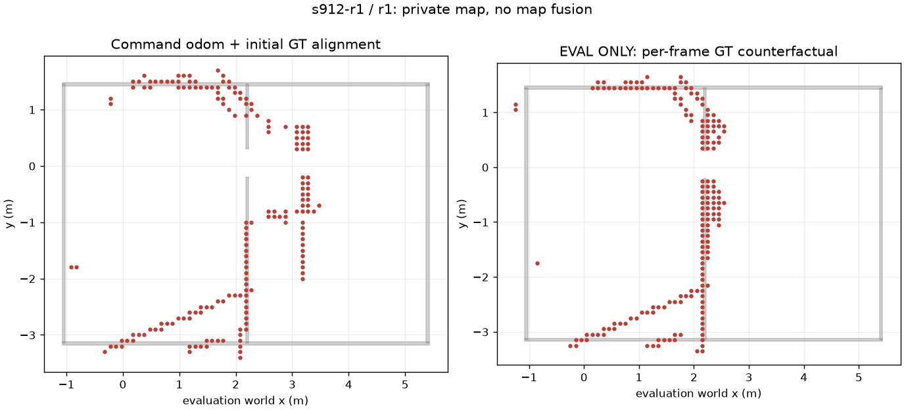

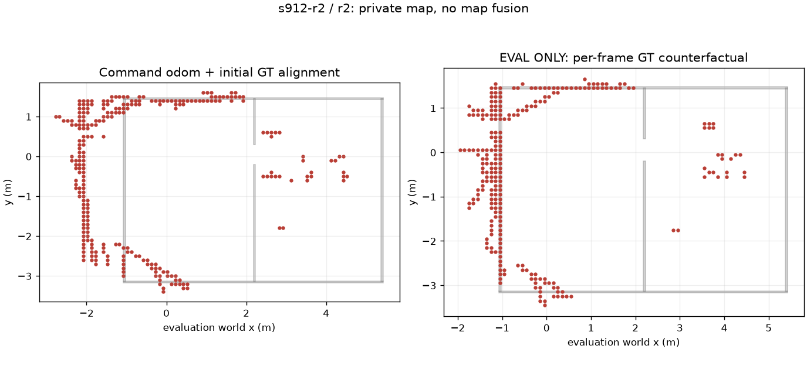

### 16.4 다음 단계: 자기 지도 대비 위치 보정(사용자 결정 2)

**쌓기만 해서는 같은 벽이 제자리에 누적되지 않는다.** 종료 위치 오차는 여섯 기록에서
1.054–1.078 m(약 **1.05–1.08 m**)이고, 종료 yaw 오차는 0.215–0.263°다.
채택한 벽 끝점 각각을 (a) 자기 명령 추정 자세, (b) 관측 시각의 정답 자세로 변환하여 두 위치 차이를 재면,
전체 관측 끝점의 RMS 오차는 **0.350–0.564 m**, **마지막 벽 관측의 끝점 RMS 오차는 1.054–1.081 m**다.
이는 위치 오차가 실제 쌓인 벽 좌표에도 약 1 m의 이중 기록·어긋남을 남겼다는 직접 진단이다.
이 비교에는 같은 검출 끝점을 쓰므로 끝점 차이는 검출값을 바꾼 효과가 아니다.

단, 마지막 벽 관측은 50.7–62.6 s, 녹화 종료는 75.4–93.65 s로 서로 다르다.
마지막 관측 이후 위치 오차가 이미 저장된 셀을 소급 이동시킨다는 뜻은 아니다.
종료 오차만으로 지도 품질을 추정하지 않고, 관측 시각별 끝점 오차와 다음 비교를 함께 제시한다.

| 녹화/로봇 | 전체 관측 끝점 자세 RMS (m) | 마지막 관측 끝점 자세 RMS (m) | 평가용 정답 자세 지도 정밀도 | 명령 지도 정밀도 하락 (%p) | 정답 자세 → 명령 지도 벽 RMSE (m) | RMSE 배수 | 덮임 하락 (%p) |
|---|---:|---:|---:|---:|---|---:|---:|
| s911-r1 | 0.350 | 1.057 | 70.8% | 23.68 | 0.183 → 0.542 | 2.96× | 6.30 |
| s911-r2 | 0.520 | 1.079 | 47.1% | 17.32 | 0.441 → 0.783 | 1.78× | 8.60 |
| s912-r1 | 0.368 | 1.081 | 72.0% | 21.42 | 0.177 → 0.521 | 2.94× | 7.45 |
| s912-r2 | 0.493 | 1.070 | 50.0% | 17.82 | 0.422 → 0.740 | 1.75× | 9.17 |
| s913-r1 | 0.371 | 1.054 | 70.1% | 24.32 | 0.184 → 0.559 | 3.04× | 6.30 |
| s913-r2 | 0.564 | 1.055 | 45.6% | 17.65 | 0.511 → 0.852 | 1.67× | 9.17 |

확인 재생 네 건만 보면 정밀도는 평가용 정답 자세 지도보다 **17.65–24.32%p 낮고**,
벽 RMSE는 **1.67–3.04배**(0.177–0.511 m → 0.521–0.852 m), 덮임은 **6.30–9.17%p 낮다**.
이는 자기 지도와 새 관측을 대조해 누적 위치 오차를 줄이는 다음 단계가 필요하다는 근거다.
정답 자세 비교도 완벽하지 않으므로, 보정만으로 모든 벽 검출 오차가 없어지거나 위 비교 성능을 달성한다고 약속하지 않는다.

**보정 방법은 `outputs/mapfree-design-20261006/DESIGN.md`가 나오면 그 설계를 따른다.**
이번 문서 마감 시 이 worktree의 해당 파일은 없었다. 알고리즘 선택·새 구현·계수 재튜닝은 하지 않았다.
정적 지도 없는 최종 조건, 로봇별 지도 분리, 정보 차이는 LLM 대화로만 보완한다는 경계는 유지한다.

### 16.5 보존·검증·재현 기록

- 재생 소스: `d72236215219aba604908a5df5a3e3a9e7841476`, [재생·채점 코드](code/odom_grid_replay.py).
- 원본 결과: 이 worktree의 `outputs/self-map-odom-grid-v1-complete/{s911,s912,s913}-{r1,r2}/`.
  `grid.json`, `poses.jsonl`, `observations.jsonl`, `summary.json`, `series.jsonl`, `map.png`를 보존했다.
- Git 보존: [파일 목록·경로·SHA-256](results/odom_grid_v1/manifest.json), 여섯 요약·시간별 수치와 그림 두 장.
  각 요약에는 녹화 명령·프레임 색인·C 캐시(r1)·평가 자료·보정 파일의 원본 경로와 해시가 있다.
  raw 영상·실행 원본 전체의 원격 백업은 아니다.
- `22a6894c`의 첫 s911-r1 재생은 채점 후 `matplotlib` 미설치로 그림에서 중단했다.
  그 결과는 `outputs/self-map-odom-grid-v1/s911-r1/`에 남겨 두었고 위 표에는 완료된 여섯 재생만 썼다.
- 이전 TensorBoard 일괄 변환은 `ValueError: not an offline audit view: None`가 반복되어 중단했다.
  **2026-10-06 사용자 요청에 따라 이 마감 작업에서는 TensorBoard 변환을 생략했다.** 성공한 변환·표시로 보고하지 않는다.
- 코드 회귀 시험은 `tests/test_self_odom_grid.py`, `tests/test_self_wall_memory.py`,
  `tests/test_coela_runtime_self_walls.py`의 **40 passed**. off 스냅샷은 변경 전 소스와 바이트 동일이다.
  문서 마감에서 14개 복사 파일의 바이트·해시, 25개 원본 해시, 여섯 요약과 시계열·점유 칸 수의 일치, 그림 두 장·링크·파일 크기와 위 40개 회귀 시험의 통과를 확인했다. 시뮬레이션·모델 호출·추가 재생 없음.
- PR #405는 DRAFT로 유지하고 병합하지 않는다.

## 17. 자기 지도 위치 보정 A — 구현 전 사전 기록 (2026-10-06)

이 절의 성공 기준은 구현·새 재생 전에 별도 커밋한다. 기준 소스는 `5c2afcaba4a88ae608280d03a91404011e59e675`다.
사용자 지정 설계는 기본 체크아웃의 `outputs/mapfree-design-20261006/DESIGN.md` §3(A), §9, §12이며,
읽은 파일의 SHA-256은 `c60948eb734c8489663d402a73ff62ee3469bd0a09bdd40e0821b43291304fab`다.
기존 명령 DR에 **과거 자기 근거리 submap에 대한 correlative scan matching**만 추가한다.
MCL·정적 지도·상대 지도·실시간 정답 입력·전역 loop closure는 구현하지 않는다.

### 17.1 비교·성공 판정 (결과를 보기 전에 고정)

- 입력은 §16의 같은 여섯 녹화·로봇이며 s911은 개발, s912·s913은 확인 재생이다.
  이미 본 녹화이므로 신규 확증 자료라고 부르지 않는다. 로봇마다 독립적으로 off/on을 재생한다.
- **호환성 필수:** `pose_correction="off"` 및 생략 시 기존 메모리 스냅샷·격자·명령 추정 자세가
  변경 전 소스와 직렬화 바이트 단위로 같아야 한다. 외부 로봇 입력 거부·프레임 중복 무효도 필수다.
- **위치 성공:** 확인 네 건 각각 종료 XY 오차가 off보다 **30% 이상 감소하고 0.75 m 이하**,
  전체 프레임 XY 오차의 median·P95가 각각 off 이하이며 경로 XY RMSE가 **20% 이상 감소**해야 한다.
- **지도 성공:** 같은 네 건 각각 최종 점유 정밀도(0.15 m)가 off 이상, 전체 벽 recall(349개 분모)이
  off보다 **2%p 넘게 낮아지지 않고**, 벽 거리 RMSE가 **20% 이상 감소**해야 한다.
- 위 두 성능 조건과 호환성 필수를 모두 만족해야 이 녹화 범위에서 성공으로 판정한다.
  일부 개선·실패도 전부 표에 쓰고, 확인 결과를 본 뒤 기준·계수를 바꾸지 않는다.
- 경로 오차는 프레임별 median/P90/P95/max/RMSE와 종료 오차를 함께 보존한다.
  보정 수락·거부·보류의 횟수/이유, 탐색 경계·겹침·잔차·분리된 두 후보의 점수 차이,
  관측 가능한 축·공분산·submap 출처/개정 번호도 기록한다.
- 정답은 예측 산출물을 저장한 **다음 평가 단계**에만 읽는다. 지도 평가는 출발 정답 SE(2) 한 번만
  적용하며 ICP 재정합하지 않는다. 카메라·팔 보정·검출기는 §16과 동일하다.

### 17.2 구현할 경계·조사 근거

- `pose_correction="own_map_csm_v1"`만 활성화하고 기본은 `off`다. on은 `self_map="odom_grid_v1"`를 요구한다.
- 명령 prior와 하중·횡이동·회전의 불확실성을 누적한다. 현재 프레임 삽입 전 동결한 과거 자기 keyframe
  submap의 거리장에 대해 제한된 SE(2) 격자를 전수 탐색한다. 근거리 가중치·robust loss·prior를 사용한다.
- 4 m **이상**의 면은 on 경로의 정합·빈 공간 갱신에서 제외한다. 기존 off의 경계 비교는 보존한다.
  기존 정착 게이트를 유지한다. 직선 벽 접선축은 Hessian의 영공간으로 남기고 공분산을 줄이지 않는다.
  낮은 겹침·큰 잔차·다봉성·탐색 경계는 거부한다. 거부 시 DR와 불확실성을 유지하고 지도 갱신을 보류한다.
- 짧은 keyframe submap과 보수적인 공분산 하한을 쓴다. 원본 관측·자세·robot/frame ID를 원장에 보존하고,
  과거 자세는 변경하지 않는다. 따라서 소급 보정 없이 과거 셀만 남기는 경로도 만들지 않는다.
  관측이 끊기거나 새 submap을 시작하면 DR 오차를 없앤 것으로 취급하지 않는다.
- 필수 오프라인 반례: 단일 직선 벽, 코너, 대칭/반복 벽의 다봉성, 빈 지도, 범위 경계,
  정착 실패, 중복/자기 프레임 정합 방지, 명령 오차 및 팔 명령 변경. 실제 시뮬레이션은 실행하지 않는다.

[Olson (2009), §III A–F 원문](https://april.eecs.umich.edu/media/media/pdfs/olson2009icra.pdf)을 확인했다.
관측 우도와 이동 prior의 결합, 과거 scan의 거리 기반 lookup table, yaw별 translation 후보 탐색을 따른다.
작은 로컬 창은 원문의 exhaustive 후보 탐색으로 충분하며 다중 해상도 가속·GPU는 도입하지 않는다.
원문도 데이터 대응과 탐색 창 밖의 불확실성을 누락하면 과신할 수 있음을 설명한다.
[Cartographer 공식 구현](https://github.com/cartographer-project/cartographer/blob/master/cartographer/mapping/internal/2d/scan_matching/real_time_correlative_scan_matcher_2d.cc)의
후보 생성·격자 조회·이동 prior 점수 구조를 참고한다. RGB 벽 접점·관측 축 제한·짧은 submap은 설계서 A의 적용 조건이다.
위 기준과 설계는 자기 일관성이 전역 정확도나 공통 카메라 scale bias 제거를 보장한다고 가정하지 않는다.

### 17.3 첫 구현·고정 설정 (재생 전)

[보정 모듈](../../harness/self_map_csm.py)은 기존 `OdomGrid`를 상속하는 on 전용 경로다.
기존 `harness/self_odom_grid.py`와 과거 재생기는 변경하지 않았다. `SelfWallMemory`의 생성자에서
`pose_correction="own_map_csm_v1"`를 선택한다. `pose_correction_options`는 아래 `CSMOptions` 필드의
명시적 대안 설정을 받지만 이번 비교는 모두 같은 기본값으로 고정한다.

| 옵션/설정 | 기본값 | 근거·효과 |
|---|---|---|
| `pose_correction` | `off` | `own_map_csm_v1`는 `self_map=odom_grid_v1` 필요 |
| `field_resolution_m` / 격자 해상도 | 0.05 / 0.10 m | 반 셀 탐색, 저장 격자는 이전과 동일 |
| `translation_window_m` / `yaw_window_deg` | ±0.50 m / ±8° 상한 | 축별 3σ 창(최소 3 step); 경계 최적해 거부 |
| `yaw_step_deg` | 1° | 4 m 끝점에서 약 0.07 m; 저장 격자 폭 이내 |
| `submap_age_s` / `submap_radius_m` / `submap_keyframes` | 15 s / 6 m / 12개 | 과거 자기 keyframe만 동결; 오래되면 DR 불확실성을 유지한 새 anchor |
| `keyframe_interval_s` / `min_points` | 1 s / 6개 | 고주파 반복을 독립 정보로 합산하지 않음; 같은 frame 및 2 cm 양자화 중복 형상 보류 |
| `min_overlap` / `overlap_distance_m` | 60% / 0.20 m | 두 저장 셀 이내의 대응 비율 |
| `max_residual_m` | 0.15 m | 전체 접점의 거리장 잔차 RMS 한도; 평가용 벽을 참조하지 않음 |
| `mode_distance_m` / `mode_gap` | 0.15 m / 0.50 | 관측 축에서 분리된 후보의 센서 비용 차이가 작으면 다봉성 거부; prior로 모호성을 숨기지 않음 |
| `hessian_ratio` | 최대 고유값의 3% (절대 0.5 이상) | yaw를 2 m 거리 변위로 정규화; 미관측 축의 보정 0, 해당 분산 유지 |
| `effective_points` | 최대 12 | 0.10 m 접점 셀 중복 제거 후 센서 비용의 유효 표본 수 제한 |
| 센서 오차 | 보정 하한 0.08 m, 2 px, fy=622.1655 px, 높이 하한 0.15 m | `σ²=.08²+.05²/12+(2r²/(fy·.15))²`; 먼 면의 가중치를 낮춤 |
| 공분산 하한 | XY 0.10 m / yaw 2° | anchor 불확실성+하한보다 작게 축소하지 않음 |
| 적재 불명 이동 바닥값 | 0.02 m/√s | 자기 명령으로 설명되지 않는 끌림을 허용하는 보수적 분산; 상대 명령 입력 없음 |
| 거부 관측의 지도 삽입 | 보류 | 수락·새 submap bootstrap만 점유/빈 공간 갱신, GT 기반 사후 구제 없음 |

센서 오차 식은 바닥 접점의 pinhole 깊이 미분 `δr≈r²·δv/(fy·h)`에 셀·보정 바닥값을 더한 근사다.
fy는 기존 `sim/masterpi_camera_profile.py`의 고정 실측 보정값이다. 2 px·0.15 m 높이 하한·0.08 m 잔차 바닥값은
독립 실측에서 추정한 확률이 아닌 보수적 **설계 설정**이며, 좁은 FOV·sag/scale bias를 해결했다고 보지 않는다.
카메라 FK/offset과 감지는 §16에서 보존한 Cartesian 접점을 그대로 재사용한다.

명령 평균은 §16의 M1 모델 그대로다. 공분산만 동일 M1 `noise_rel`, `noise_abs`, `scale_std`를 재사용하여
50 ms마다 `FΣFᵀ+RQ Rᵀ`를 계산한다. 속도 잡음은 `(std·dt)²`, scale 오차는 1 s 상관시간의 rate 과정으로
`(scale_std·|v|)²dt`를 더한다. 적재 프로필·횡속도·회전이 분산에 반영되며, 적재 상태에는 위 불명 이동 바닥값을 추가한다.
이 공분산은 검증된 posterior 정확도 주장이 아니고 정합 창·prior·과신 억제용이다. 난수나 MCL 측정 갱신은 없다.

센서 비용은 거리장 오차/σ의 Huber loss(전환 1.5σ), prior는 `δᵀΣ⁻¹δ`다. 모든 후보를 조회한다.
관측 Hessian은 과거 면의 법선으로 구성하므로 선분 끝점이 직선 벽 접선 이동의 가짜 근거가 되지 않는다.
현재 프레임은 정합이 끝난 뒤에만 삽입한다. 수락/거부 원장에 과거 frame ID·직전 개정 번호를 쓰며,
`map_ledger.jsonl`의 자기 접점·고정 수락 자세·카메라 원점으로 격자를 재투영할 수 있다. 과거 자세 수정 API는 없다.

[비교 재생기](code/own_map_csm_replay.py)는 §16의 `observations.jsonl`에서 `t/frame_id/camera/segments`만
화이트리스트로 읽는다. 과거 DR pose도 보정기에 주지 않는다. 이미 제거된 정착/거리 관측 수는 이전 요약에 따로 보존한다.
on은 정착·엄격한 4 m 경계를 다시 검사한다. off는 정확한 기존 float 접점으로 쌓아 과거 `poses.jsonl`·셀·LLM 문구를
바이트 비교하고, 단위 시험에서는 기존 소스의 전체 메모리/격자 출력을 비교한다.
예측 격자·자세·원장을 먼저 디스크에 고정한 뒤, 평가 함수가 정답을 읽는다. 재생 전 코드·계수를 커밋한다.

### 17.4 고정 소스 오프라인 결과 — 전체 성공 기준 미달

성공 기준 사전 커밋은 `e44f12c9`, 구현·재생 소스는 `d7545baae1f3c31414567956c2140e72e3364607`이다.
해당 소스·기본 계수로 개발 2건을 먼저 재생한 뒤 **설정을 바꾸지 않고** 확인 4건을 재생했다.
새 시뮬레이션·렌더링·모델 호출은 없다. 기존 s911–s913 녹화 접점을 재생한 결과이고 현재 카메라 v3 실험은 아니다.

**확인 4건 모두 사전 기준 미달이다(0/4).** 종료 오차는 17.8–47.6% 감소했지만 3건은 30%/0.75 m 조건을
충족하지 못했다. 경로 RMSE는 17.0–43.4% 감소하여 s913-r2만 20% 조건에 미달했다.
모든 확인 녹화의 지도 recall이 2%p 허용 하락을 넘었다. s912-r1의 벽 RMSE 감소도 10.3%로 20% 미달이고,
s913-r1의 정밀도는 **45.7286%→45.6522%**로 0.0765%p 떨어졌다(아래 반올림 표에서는 같아 보임).
개발 2건도 지도 조건을 통과하지 못했다. 이 실패를 기준 변경·추가 튜닝으로 덮지 않았다.

P는 최종 점유 셀 중 정답 벽 ≤0.15 m인 비율, R은 전체 벽 표본 349개에 대한 최종 덮임이다.
지도 벽 RMSE와 경로 XY RMSE는 서로 다르다. 모든 숫자는 **off→on**이다.

| 녹화 | 용도 | 종료 XY (m) | 경로 XY RMSE (m) | 지도 P | 지도 R | 지도 벽 RMSE (m) |
|---|---|---:|---:|---:|---:|---:|
| s911-r1 | 개발 | 1.067→0.564 | 0.869→0.482 | 47.2%→45.7% | 28.7%→9.7% | 0.542→0.338 |
| s911-r2 | 개발 | 1.068→0.570 | 0.860→0.443 | 29.8%→52.3% | 17.5%→8.6% | 0.783→0.403 |
| s912-r1 | 확인 | 1.078→0.788 | 0.816→0.642 | 50.6%→51.3% | 27.5%→9.7% | 0.521→0.467 |
| s912-r2 | 확인 | 1.070→0.870 | 0.789→0.620 | 32.2%→51.9% | 16.0%→8.6% | 0.740→0.486 |
| s913-r1 | 확인 | 1.059→0.555 | 0.812→0.460 | 45.7%→45.7% | 28.7%→9.7% | 0.559→0.345 |
| s913-r2 | 확인 | 1.054→0.866 | 0.785→0.651 | 28.0%→34.5% | 16.0%→7.7% | 0.852→0.581 |

경로 분포는 녹화의 모든 프레임 시각을 분모로 한다. 초기 정지·후기 정지 구간도 제외하지 않는다.
프레임별 원본은 `*-path_errors.jsonl`에 있고, 아래 값의 단위는 m다.

| 녹화 | 프레임 수 | median off→on | P90 off→on | P95 off→on | max off→on |
|---|---:|---:|---:|---:|---:|
| s911-r1 | 1848 | 1.022→0.553 | 1.058→0.586 | 1.058→0.637 | 1.067→0.670 |
| s911-r2 | 1848 | 0.968→0.512 | 1.081→0.582 | 1.081→0.583 | 1.085→0.587 |
| s912-r1 | 1521 | 0.877→0.781 | 1.081→0.828 | 1.081→0.870 | 1.085→0.889 |
| s912-r2 | 1521 | 0.836→0.636 | 1.072→0.872 | 1.073→0.873 | 1.077→0.877 |
| s913-r1 | 1483 | 0.874→0.554 | 1.062→0.607 | 1.062→0.648 | 1.066→0.666 |
| s913-r2 | 1483 | 0.817→0.717 | 1.057→0.869 | 1.057→0.869 | 1.061→0.873 |

### 17.5 수락·거부와 지도 손실

횟수의 분모는 이전 정착/거리 게이트를 통과한 자기 접점 프레임이다. 자기 명령 기반 정착 조건을 on에서 재검사했다.
정합을 시도하지 않은 간격/중복 보류와 실제 정합 거부를 구분한다. bootstrap은 보정 성공이 아니며 DR 자세의 새 anchor다.
전체 960개 입력 중 **수락 43, 거부 108, 보류 795, bootstrap 14**다.

| 녹화 | 입력 | 수락 | 거부 | 보류 | bootstrap | 지도 갱신 off→on |
|---|---:|---:|---:|---:|---:|---:|
| s911-r1 | 138 | 9 | 12 | 115 | 2 | 138→11 |
| s911-r2 | 172 | 5 | 22 | 143 | 2 | 172→7 |
| s912-r1 | 149 | 8 | 15 | 124 | 2 | 149→10 |
| s912-r2 | 180 | 6 | 23 | 148 | 3 | 180→9 |
| s913-r1 | 142 | 9 | 13 | 118 | 2 | 142→11 |
| s913-r2 | 179 | 6 | 23 | 147 | 3 | 179→9 |

| 녹화 | 탐색 경계 | 관측 축 없음 | 낮은 겹침 | 큰 잔차 | 다봉성 | 1 s 간격 보류 | 중복 형상 보류 |
|---|---:|---:|---:|---:|---:|---:|---:|
| s911-r1 | 5 | 1 | 0 | 1 | 5 | 115 | 0 |
| s911-r2 | 7 | 1 | 4 | 4 | 6 | 142 | 1 |
| s912-r1 | 6 | 1 | 0 | 1 | 7 | 124 | 0 |
| s912-r2 | 7 | 1 | 6 | 4 | 5 | 148 | 0 |
| s913-r1 | 6 | 1 | 0 | 1 | 5 | 118 | 0 |
| s913-r2 | 12 | 1 | 3 | 2 | 5 | 147 | 0 |

`*-corrections.jsonl`에는 각 사유·후보 비용·센서 비용 차이·겹침·잔차·Hessian 축·공분산·참조 frame ID를 보존했다.
보류까지 합쳐 지도 삽입이 138–180회에서 **7–11회**로 줄었다. 따라서 지도 정밀도/RMSE 변화에는
**보정 효과와 관측 선택 효과가 함께** 있다. 적은 셀만 남겨 RMSE가 낮아진 것을 완성도 향상으로 해석하지 않는다.

이를 분리하기 위해 결과를 본 뒤 추가한 **평가 전용 진단**에서는 on이 삽입한 같은 접점만 골라
저장된 off 자세로 다시 쌓았다. 선택-only 지도와 on의 P/R/RMSE를 비교한 표이며, 새 제어기 실행이나
사전 성공 조건 추가가 아니다. 이 진단도 평가에서만 정답 벽을 읽고 보정기에는 전달하지 않는다.

| 녹화 | 같은 선택의 DR P→on P | 같은 선택의 DR R→on R | 같은 선택의 DR 벽 RMSE→on (m) |
|---|---:|---:|---:|
| s911-r1 | 23.4%→45.7% | 9.2%→9.7% | 0.660→0.338 |
| s911-r2 | 22.3%→52.3% | 7.7%→8.6% | 0.661→0.403 |
| s912-r1 | 25.4%→51.3% | 9.2%→9.7% | 0.682→0.467 |
| s912-r2 | 37.6%→51.9% | 8.6%→8.6% | 0.547→0.486 |
| s913-r1 | 22.8%→45.7% | 9.2%→9.7% | 0.664→0.345 |
| s913-r2 | 28.8%→34.5% | 7.7%→7.7% | 0.679→0.581 |

남은 문제는 좁은 관측에서 겹침/관측 축이 부족하고, 보수적 정합·keyframe 보류 때문에 다른 벽의 증거가 많이
빠지는 것이다. 같은 선택의 진단에서는 보정의 이점이 있지만, 전체 벽 덮임을 보존하지 못한다.
오래된 카메라·처짐/scale bias 및 상대에게 끌리는 자기 명령 밖 운동도 남는다.
따라서 on을 기본값으로 승격하지 않으며 정적 지도 없는 주행 성공·실물 성능·전역 SLAM 성공을 주장하지 않는다.

### 17.6 그림·산출물·검증

회색 벽은 평가 전용 정답, 빨강은 각 로봇 자기 지도의 점유 셀, 파랑은 자기 추정 경로다.
각 지도에 출발 자세 정답 변환을 한 번만 적용했다. 두 로봇의 지도를 합치지 않았다.
두 PNG는 각각 114,046 B / 188,973 B로 1 MiB 이하이다.

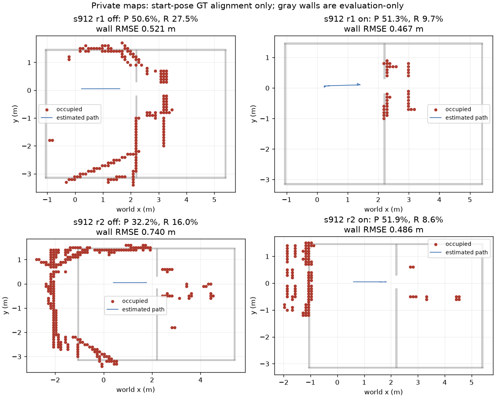

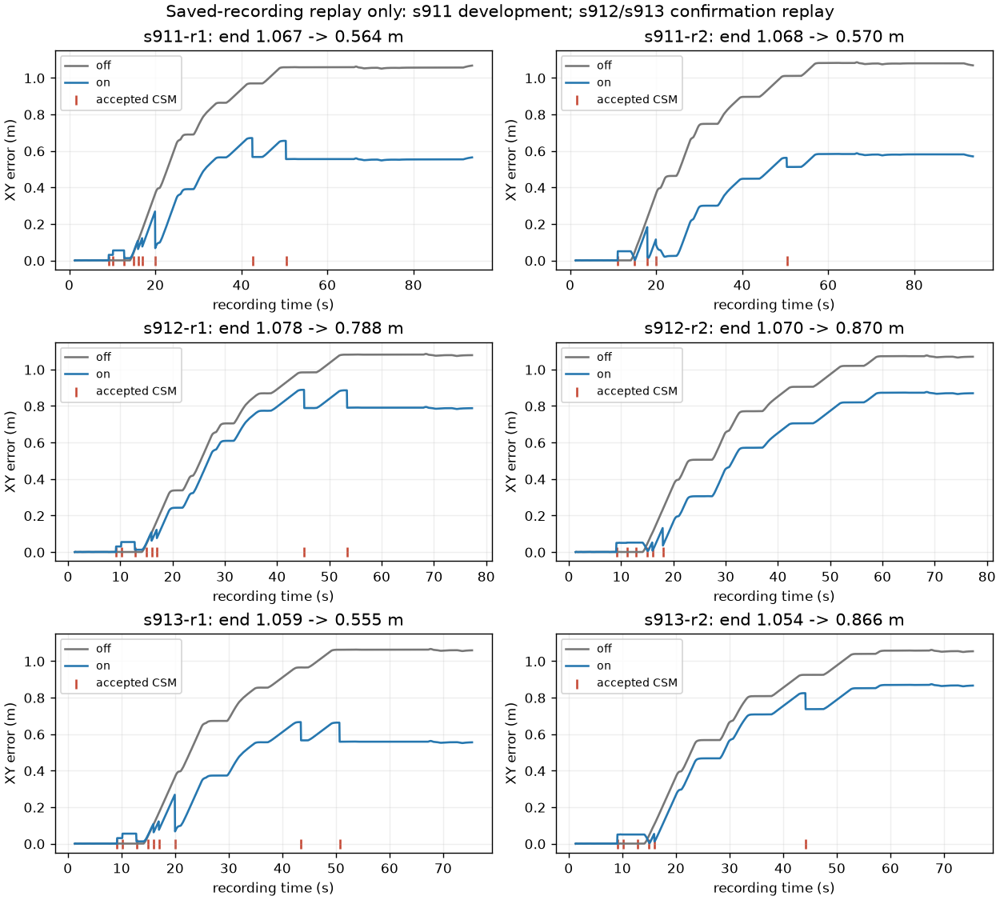

- [보존 목록·해시](results/own_map_csm_v1/manifest.json): 요약 12개, 경로/지도 시계열,
  수락·거부 원장, 자기 관측 재투영 원장, 각 판정·off 골든 결과와 그림. 총 약 2.94 MiB.
  원본 녹화의 전체 원격 백업은 아니며, 입력 경로·해시는 각 요약에 있다.
- 전체 로컬 산출물은 이 worktree의 `outputs/self-map-csm-v1-development/`와
  `outputs/self-map-csm-v1-confirmation/`; 격자·자세·공분산·LLM 문구도 포함한다.
  입력은 §16 `outputs/self-map-odom-grid-v1-complete/`의 접점 캐시와 같은 원본 녹화의 자기 명령/프레임 색인이다.
- 실행 전 `tests/test_self_map_csm.py`, `tests/test_self_odom_grid.py`,
  `tests/test_coela_runtime_self_walls.py` **38 passed**. 결과 기록 뒤 같은 세 파일도 **38 passed (4.45 s)**를 확인했다.
  기존 40개 시험도 사전 기준 커밋 직전에 통과했다. 새 보정 시험은 CI 목록에 등록했다.
- 마감 검증에서 Git 산출물 71개·전체 로컬 파일 124개의 크기/해시, 여섯 원장의 재투영 셀 일치,
  참조 관측의 시간 선행·자기 프레임 제외, 모든 저장 공분산의 양의 준정부호를 확인했다. 그림 두 장도 열어 확인했다.
- 여섯 재생 모두 기존 off 자세 파일·셀·LLM 문구의 바이트 비교와 프레임 수 비교를 통과했다.
  전체 메모리/격자 스냅샷의 기본 off·명시적 off 골든은 변경 전 메모리 소스로 검사했다.
  기존 해시 고정 번들은 보존하고 `self-map-own-csm-v1` 번들만 추가했다.
- TensorBoard 변환은 앞선 사용자 지시대로 생략했다. PR #405는 DRAFT 유지, 병합하지 않는다.

재현(각 출력 경로는 새 경로를 사용):

```sh
/Users/changmin/projects/ugrp/.venv-sim-worker-mac/bin/python experiments/2026-10-05-ego-wall-map-probe/code/own_map_csm_replay.py --split development --output outputs/self-map-csm-v1-development-NEW
/Users/changmin/projects/ugrp/.venv-sim-worker-mac/bin/python experiments/2026-10-05-ego-wall-map-probe/code/own_map_csm_replay.py --split confirmation_replay --output outputs/self-map-csm-v1-confirmation-NEW
```

그림·선택 진단 생성기는 [csm_result_report.py](code/csm_result_report.py)다. 새로 선택된 계수는 없고,
별도 보고 소스 해시·Python/NumPy/SciPy/Matplotlib 환경은 산출물에 남겼다.
이번 구현의 직선/코너/대칭 반례와 녹화는 오프라인 검증이며 실제 시뮬레이션을 실행하지 않았다.

## 18. CSM v2: 정합 일정과 지도 삽입 분리 — 구현 전 사전 기록

2026-10-06 사용자 후속 요청. **v2에 §17.1의 같은 기준을 그대로 적용한다.** 구현 전에 이 절을 별도 커밋한다.
종료 XY 오차 30% 이상 감소 및 0.75 m 이하, 경로 median/P95 악화 없음 및 RMSE 20% 이상 감소,
지도 P 악화 없음·전체 벽 349개 recall 하락 2%p 이내·벽 RMSE 20% 이상 감소를 확인 네 건 각각 요구한다.
모든 조건과 off 바이트 호환성을 통과해야 성공이며, 성공 기준·분모·허용 거리·개발/확인 구분을 바꾸지 않는다.

먼저 저장된 v1의 자세·판정은 고정하고 보류 관측만 추가 삽입하는 평가용 반사실 재생으로 원인을 확인한다.
기존 v1 map, v1+보류, v1+모든 프레임(거부 포함, 진단용), off를 비교한다. 이것은 v2의 성능 결과가 아니며
그 결과를 보정기 입력에 넣지 않는다. 모든 예측 지도를 저장한 뒤 평가 벽으로 채점한다.
그다음 `pose_correction=own_map_csm_v2`를 별도 옵션으로 구현한다. v1 코드/결과와 기본 off를 보존한다.
개발 s911 두 건 → 설정 고정 확인 → s912/s913 네 건 순서로 실행하며 확인 결과 뒤 튜닝하지 않는다.
기존 녹화의 재현 확인이고 신규 확증 자료가 아니다. 시뮬레이션·모델 호출·TensorBoard 변환은 하지 않는다.

### 18.1 문헌·공개 코드에서 확인한 범위

- [Cartographer LocalTrajectoryBuilder2D](https://github.com/cartographer-project/cartographer/blob/877157a0d91788a7700221d87232d412cb3c1ef4/cartographer/mapping/internal/2d/local_trajectory_builder_2d.cc#L57-L91):
  online correlative 정합은 선택 사항이며 그 뒤 Ceres 정합이 별도로 있다. local range data를 현재 추정 자세로
  변환한 다음 `InsertIntoSubmap`을 부른다(L214–229). 삽입에는 **별도 motion filter**가 있다(L255–265).
  따라서 모든 원시 scan을 무조건 삽입하거나 모든 정합을 생략한 DR를 항상 넣는다고 일반화할 수 없다.
- [HectorSlamProcessor::update](https://github.com/tu-darmstadt-ros-pkg/hector_slam/blob/5abd5e1fcc8dd4efdd20d3d8be8e1a77bc23d484/hector_mapping/include/hector_slam_lib/slam_main/HectorSlamProcessor.h#L64-L85):
  `map_without_matching`이면 `poseHintWorld`를 쓰고, 그렇지 않으면 `matchData` 결과를 쓴다.
  이동/회전 기준 또는 `map_without_matching` 조건에서 그 자세로 `updateByScan`을 호출한다.
  정합 수행 여부와 지도 삽입의 분리가 직접 확인되지만, 여기에도 무조건 모든 scan 삽입이라는 규칙은 없다.
- [Olson 2009 §III B–C](https://april.eecs.umich.edu/media/media/pdfs/olson2009icra.pdf):
  과거 scan을 참조 모델로 사용하고 여러 scan으로 더 상세한 모델을 만들 수 있다고 설명한다.
  논문의 주 대상은 정합이며 모든 scan의 submap 삽입/거부 정책을 정한 문헌은 아니다.

따르는 원리는 **현재 최선 추정 자세로 관측을 투영하고, 정합 실행 여부와 삽입 여부를 별도로 결정**하는 것이다.
우리의 1 s 정합 보류를 지도 증거 폐기로 연결하지 않는 v2 규칙은 이 구조를 자기 RGB 접점에 적용한 것이다.
명백한 불일치 거부·근거리/정착·로봇 분리·중복 프레임 방어는 설계 A의 제한으로 유지한다.

### 18.2 원인 확인: v1 자세·정합 판정을 고정한 삽입 재생

진단 소스 `76d51e00`, [코드](code/csm_insertion_diagnosis.py). 저장된 자기 추정 자세·프레임 판정만으로
모든 지도를 먼저 만들고, 이후 출발 정답 변환과 정답 벽으로 채점했다. 기존 off/v1 셀 재구성도 일치했다.
**보류 관측을 빼는 것이 recall 손실의 직접 원인이라는 해석이 맞다.** 보류만 되넣으면 off 수준으로 회복한다.
단, 이 결과는 자세를 고정한 원인 진단이고 v2를 실행한 성능 주장이 아니다.

| 녹화 | 갱신 v1→보류 추가→off | recall v1 | 보류 추가 | 거부까지 추가(진단만) | off |
|---|---|---:|---:|---:|---:|
| s911-r1 | 11→126→138 | 9.74% | 29.23% | 29.23% | 28.65% |
| s911-r2 | 7→150→172 | 8.60% | 17.48% | 17.19% | 17.48% |
| s912-r1 | 10→134→149 | 9.74% | 27.22% | 27.22% | 27.51% |
| s912-r2 | 9→157→180 | 8.60% | 16.05% | 15.76% | 16.05% |
| s913-r1 | 11→129→142 | 9.74% | 28.65% | 28.65% | 28.65% |
| s913-r2 | 9→156→179 | 7.74% | 15.76% | 15.76% | 16.05% |

확인 4건에서 v1 대비 **+7.45–18.91%p**, off 대비 차이는 **0 또는 −0.2865%p(벽 표본 1개)**다.
같은 비거부 프레임만 off 자세로 쌓으면 여섯 건 모두 원래 off recall과 같았다.
즉, 정합 거부 108개를 계속 제외해도 이 기록의 recall 손실은 거의 없다. 거부까지 넣는 진단은 일부에서
오히려 한 셀의 덮임을 낮췄다. 정밀도·벽 RMSE와 전체 수치는 별도 진단 요약에 보존한다.

### 18.3 v2 삽입 정책과 고정 범위 (개발 재생 전)

`SelfWallMemory(..., self_map="odom_grid_v1", pose_correction="own_map_csm_v2")`만 활성화한다.
기본 off와 `own_map_csm_v1`는 그대로다. v1 정합 모듈·재생기·계수·성공 판정 함수는 수정하지 않는다.
[v2 모듈](../../harness/self_map_csm_v2.py)은 지도 삽입만 분리한다.

| 프레임 판정 | v2의 누적 지도 처리 | 자세/공분산/정합 참조 |
|---|---|---|
| 정합 수락·bootstrap | 기존처럼 삽입 | 기존 v1과 동일 |
| 1 s 정합 간격 보류 | 현재 최선 자세로 삽입 | DR+최근 보정 누적; 별도 보정·공분산 축소 없음 |
| 서로 다른 frame의 중복 형상 보류 | 새 scan으로 삽입 | 정합·추가 위치 확신 없음 |
| 근거리 면은 있지만 정합 표본 6개 미만 | 정합 보류로 구분하고 삽입 | 자기 명령 추정 그대로 |
| 실제 정합 거부(경계·관측 축 없음·낮은 겹침·큰 잔차·다봉성) | 그 프레임 제외 | v1의 DR/불확실성 유지 |
| 미정착·4 m 이상/유효 면 없음 | 제외 | 기존 입력 게이트 유지 |
| 같은 `(t, frame_id)` 재전달 | 완전 무효 | 셀·원장·공분산 불변 |

거부는 해당 scan에만 적용한다. 다음 scan이 정합 간격 때문에 보류되면 현재 추정으로 넣는다.
거부 상태를 다음 scan까지 자동 전파하는 별도 게이트는 이번 옵션에 없다. 이 한계도 결과 해석에 포함한다.
지도 삽입은 원래 log-odds hit/miss와 프레임 내부 셀 중복 제거를 그대로 따른다. 추가 가중치 조정은 없다.

**메모리 누적 격자와 정합 참조 keyframe의 선정은 별도다.** 보류 scan은 누적 격자/재투영 원장에 넣되,
v1의 12개/15 s 정합 참조 keyframe에 추가하지 않는다. 이번에는 확인된 삽입 손실만 바꾸어 보정 궤적 자체가
변하지 않았는지 v1 저장 자세와 바이트 비교한다. 이는 Cartographer 전체 submap 알고리즘 복제가 아니라
정합-삽입 분리 구조와 Olson의 과거 scan 참조를 기존 설계 A에 적용한 제한된 변경이다.
새 scan을 정합 참조에도 넣는 변경·과거 scan의 소급 보정·새 튜닝은 이번 v2에 섞지 않는다.
삽입 원장에는 현재 추정 자세, frame/robot ID, `matching_keyframe` 여부와 삽입 사유를 남긴다.

### 18.4 v2 오프라인 결과 — 개발 2/2, 확인 1/4 통과

사전 기록 `5538499b`, 진단 `76d51e00`, 구현/재생 소스 **`0b002a41d6d3d5e6da06ef9841a64460825d6ac8`**.
개발 두 건 뒤 `confirmation-freeze.json`으로 같은 소스·옵션 해시를 고정했고, 확인 네 건도 변경 없이 실행했다.
판정 함수는 v1의 `acceptance()`를 직접 재사용했다. 결과를 보고 계수·기준을 조정하지 않았다.

**보류 프레임 삽입 문제는 해결됐고, 전체 성공은 확인 1/4(s913-r1)다.**
확인 4건 모두 지도 정밀도가 off 이상이고 recall 하락은 2%p 이내다. 그러나 종료 위치 조건은 3건에서 미달,
s913-r2 경로 RMSE 감소율도 17.0%로 20% 미달이다. s912-r2/s913-r2 벽 RMSE 감소율은 각각 14.1%/12.6%로
20% 미달이다. 위치 보정 궤적은 v1과 같으므로 남은 위치 문제를 해결한 변경으로 보고하지 않는다.

표는 **off→v2**, P/R 분모·벽 허용 거리·RMSE 정의는 §17과 같다. 모든 프레임의 경로 오차 분포도 보존했다.

| 녹화 | 종료 XY (m) | 경로 XY RMSE (m) | 지도 P | 지도 R | 지도 벽 RMSE (m) | 전체 기준 |
|---|---:|---:|---:|---:|---:|---|
| s911-r1 | 1.067→0.564 | 0.869→0.482 | 47.2%→55.0% | 28.7%→29.2% | 0.542→0.304 | 통과 |
| s911-r2 | 1.068→0.570 | 0.860→0.443 | 29.8%→31.6% | 17.5%→17.5% | 0.783→0.543 | 통과 |
| s912-r1 | 1.078→0.788 | 0.816→0.642 | 50.6%→55.5% | 27.5%→27.2% | 0.521→0.376 | 미달 |
| s912-r2 | 1.070→0.870 | 0.789→0.620 | 32.2%→33.7% | 16.0%→16.0% | 0.740→0.635 | 미달 |
| s913-r1 | 1.059→0.555 | 0.812→0.460 | 45.7%→53.8% | 28.7%→28.7% | 0.559→0.294 | 통과 |
| s913-r2 | 1.054→0.866 | 0.785→0.651 | 28.0%→30.7% | 16.0%→15.8% | 0.852→0.744 | 미달 |

| 녹화 | 경로 median off→v2 (m) | P95 off→v2 (m) | 지도 갱신 v1→v2 | 수락 / 거부 / 보류삽입 / bootstrap |
|---|---:|---:|---:|---|
| s911-r1 | 1.022→0.553 | 1.058→0.637 | 11→126 | 9 / 12 / 115 / 2 |
| s911-r2 | 0.968→0.512 | 1.081→0.583 | 7→150 | 5 / 22 / 143 / 2 |
| s912-r1 | 0.877→0.781 | 1.081→0.870 | 10→134 | 8 / 15 / 124 / 2 |
| s912-r2 | 0.836→0.636 | 1.073→0.873 | 9→157 | 6 / 23 / 148 / 3 |
| s913-r1 | 0.874→0.554 | 1.062→0.648 | 11→129 | 9 / 13 / 118 / 2 |
| s913-r2 | 0.817→0.717 | 1.057→0.869 | 9→156 | 6 / 23 / 147 / 3 |

보류 **795개 모두** 현재 추정 자세로 지도에 들어갔다. 전체 삽입은 v1 **57→v2 852개**,
실제 정합 거부 108개는 제외됐다. 수락 43·거부 108·보류 795·bootstrap 14의 판정 횟수와 거부 이유는 v1과 동일하다.
거부 사유별 수는 §17.5 표와 같으며 v2 `*-corrections.jsonl`에도 각 프레임의 사유와 삽입 정책을 기록했다.
여섯 v2 지도 셀 전체가 §18.2의 **고정 v1 자세+보류 삽입** 진단과 정확히 같았다.
여섯 v2 자세 파일도 저장된 v1과 바이트 동일하다. 따라서 이번 변화는 지도 삽입 정책의 효과다.

좁은 자기 영상에서 누적 DR 오차를 충분히 줄이지 못하는 문제와 카메라/벽 접점 오차가 남았다.
참조 keyframe 확대·보정 모델 변경은 하지 않았다. 같은 조건의 실패를 추가 재생/튜닝으로 덮지 않고,
고정한 여섯 건의 결과 기록에서 마무리한다. 기본 off, v1 보존, PR #405 DRAFT와 미병합을 유지한다.

### 18.5 보존·검증·재현

- [원인 진단 결과/출처](results/csm_v2_insertion_diagnosis/manifest.json),
  [v2 결과/원본 경로/해시](results/own_map_csm_v2/manifest.json),
  [개발 뒤 설정 고정·v1 자세 골든·진단 일치](results/own_map_csm_v2/v2-validation-manifest.json).
- 전체 로컬 파일은 이 worktree의 `outputs/self-map-csm-v2-insertion-diagnosis/`,
  `outputs/self-map-csm-v2-development/`, `outputs/self-map-csm-v2-confirmation/`에 새로 보존했다.
  기존 v1/raw를 덮어쓰거나 삭제하지 않았다. 전체 녹화의 원격 백업을 뜻하지 않는다.
- 구현 전 기준 커밋: 기존 관련 38개 시험 통과. 진단 소스: 진단 선택/중복 회귀 1개 통과.
  구현/마감 관련 3파일은 `test_self_map_csm_v2.py`, `test_self_map_csm.py`,
  `test_coela_runtime_self_walls.py`다. 구현 커밋 직전 **36 passed**, 마감에서도 **36 passed (4.64 s)**; 기본/명시적 off와 v1의 소스 골든,
  거부/보류 분리, 현재 추정 자세 삽입, 공분산/정합 참조 불변, 원장 재투영을 검사했다.
- 마감 검증: 보존 파일 80개·전체 로컬 파일 131개 해시/크기, 개발/확인 소스·설정 고정,
  여섯 원장 재투영·과거 keyframe 참조·공분산 PSD, 진단 원본 해시와 그림 두 장을 확인했다.
- 실제 여섯 재생의 off 자세·셀·LLM 문구 골든 통과. v1 모듈·DR/grid·v1 재생기 소스는 `20d26d7e`와
  바이트 동일이다. 이전 메모리 소스와 번들 해시도 동결 보존하고 v2 번들/CI 시험만 추가했다.
- 모든 지도/자세/원장을 저장한 뒤 평가 벽·정답을 읽었다. 정답·상대 지도 입력, 시뮬레이션·모델 호출 없음.
  TensorBoard 변환은 앞선 사용자 지시대로 생략했다.

그림은 v2 결과다. 경로 오차 곡선은 v1과 동일하며 지도에 남은 증거만 증가했다. 회색 벽은 평가 전용,
출발 정답 변환 한 번만 사용하고 로봇 지도를 합치지 않았다. PNG는 각각 1 MiB 미만이다.

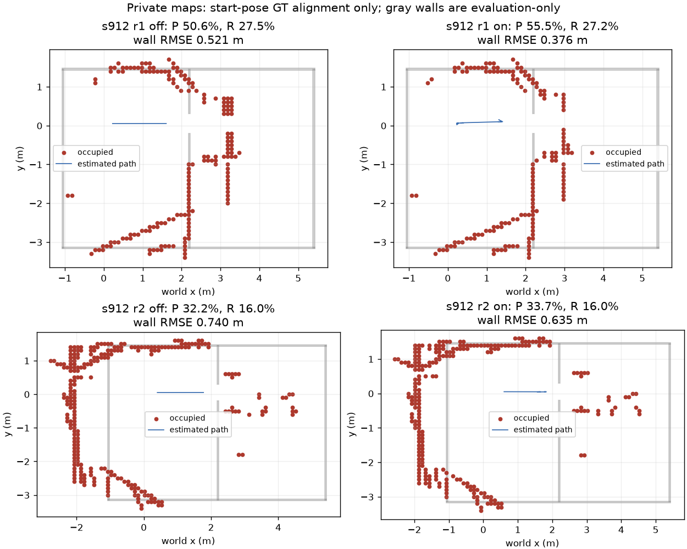


```sh
/Users/changmin/projects/ugrp/.venv-sim-worker-mac/bin/python experiments/2026-10-05-ego-wall-map-probe/code/csm_insertion_diagnosis.py --output outputs/self-map-csm-v2-diagnosis-NEW
/Users/changmin/projects/ugrp/.venv-sim-worker-mac/bin/python experiments/2026-10-05-ego-wall-map-probe/code/own_map_csm_v2_replay.py --split development --output outputs/self-map-csm-v2-development-NEW
/Users/changmin/projects/ugrp/.venv-sim-worker-mac/bin/python experiments/2026-10-05-ego-wall-map-probe/code/own_map_csm_v2_replay.py --split confirmation_replay --output outputs/self-map-csm-v2-confirmation-NEW
```

비교 생성기는 기존 `csm_result_report.py`를 `--development`/`--confirmation`에 v2 경로를 지정해 그대로 재사용했다.

## 19. 자세 확률 모델 — 구현 전 사전 등록 (2026-10-06)

**§17.1의 성공 기준을 그대로 적용한다.** 종료 ≤0.75 m 및 off 대비 ≥30% 감소,
경로 median/P95 악화 없음·RMSE ≥20% 감소, 지도 precision 악화 없음·recall 감소 ≤2%p·
벽 거리 RMSE ≥20% 감소, off 바이트 동일을 모두 만족해야 해당 건 성공이다.
개발 s911/r1,r2 2건 → 설정 고정 → 확인 s912/s913 × r1/r2 4건 순서이며,
이미 사용한 녹화의 재현 비교다. 조건·로봇을 합산하지 않고 v1/v2/prob/RBPF30/RBPF100을 나란히 기록한다.
결과를 보고 계수·기준을 바꾸지 않는다. 기본 off, 기존 v1/v2 소스와 정적 지도 경로는 보존한다.

### 19.1 근거와 적용 범위

- [Olson 2009 §III-F, Eq.3](https://april.eecs.umich.edu/media/media/pdfs/olson2009icra.pdf):
  정합 후보의 정규화된 posterior로 평균·공분산을 계산한다. 후보창 밖 모드는 누락될 수 있다.
  prob는 v2의 수락/거부와 삽입 정책을 이어받고, 수락한 정합의 후보 모멘트 공분산을 사용한다.
  벽 접선의 미관측 분산, submap anchor 분산과 기존 공분산 하한을 보존한다.
  삽입은 끝점 위치 분산 `J Σ Jᵀ`에 따라 hit/miss log-odds를 같은 비율로 줄인다.
  `w = σ_sensor²/(σ_sensor² + mean(trace(JΣJᵀ)/2))`는 분산 합에 따른 정보량 비율을 쓰는
  **우리의 보수적 근사**이며, Olson 원문에 있는 지도 삽입 공식이라고 주장하지 않는다.
- [Grisetti·Stachniss·Burgard 2007, IEEE TRO 23(1), Eq.9/15–20, Algorithm 1](https://people.eecs.berkeley.edu/~pabbeel/cs287-fa13/optreadings/GrisettiStachnissBurgard_gMapping_T-RO2006.pdf):
  입자별 과거 지도에서 scan matching → mode 주변에서 관측 우도×명령 이동 prior 평가 →
  Gaussian 제안분포 모멘트 → 샘플 → 중요도 갱신 → 해당 입자의 지도 삽입을 따른다.
  Gaussian 근사에서 정확한 중요도 비율 `likelihood × motion / proposal`(Eq.6)을 계산한다.
  이는 Eq.19의 정규화 적분을 그대로 근사 가중치로 쓰는 대신 실제 제안밀도의 근사 오차를 보정한다.
  실패 시 motion proposal로 돌아가며, `N_eff=1/Σw² < N/2`일 때만 systematic resampling한다.
- [OpenSLAM 공개 구현](https://github.com/ros-perception/openslam_gmapping/blob/master/include/gmapping/gridfastslam/gridslamprocessor.hxx):
  입자별 map 정합, normalize의 N_eff, resample/비resample 양쪽 registerScan을 확인했다.
  이 코드의 optimize+likelihood 경로는 논문의 Gaussian proposal 전체와 같지 않으므로,
  이번 개선 제안분포 구현 근거는 위 **논문 수식**이다.
- 좁은 FOV·벽 접점은 laser 전방위 scan보다 접선 위치가 약하게 관측된다. prob는 단일 지도와
  Gaussian 공분산으로 저렴하지만 여러 위치 가설을 표현하지 못한다. RBPF는 입자마다 지도·경로를
  유지하므로 다중 가설이 가능하나 정합과 지도 메모리가 대략 입자 수에 비례하고 잘못된 벽 대응은
  입자 고갈을 유발한다. 약 1500–1850 프레임 중 근거리·정착 통과 scan만 이용한다.

### 19.2 고정 옵션·잡음 출처·실행 계획

| 설정 | 사전 고정값/규칙 |
|---|---|
| `pose_correction` | 기본 `off`; 추가 `own_map_csm_prob_v1`, `own_map_rbpf_v1` |
| RBPF `particles` | **30, 100 각각**; 두 값 모두 실행, 결과로 하나를 선택하지 않음 |
| `seed` | 20261006 (각 녹화·조건에서 새 RNG) |
| 저장 격자 | 0.10 m; 입자별 독립 log-odds 지도, 복제 후 쓰기 공유 금지 |
| prob 정합 | §17 CSM 창·게이트·주기 그대로, 후보 posterior 모멘트 + 영공간/anchor 하한 |
| RBPF 정합 | 최대 ±0.5 m/±8°, coarse 0.1 m/2° → mode 주변 0.05 m/1°(각 축 ±3 step) |
| RBPF 관측 | §17 거리 σ·Huber·유효 접점 최대12·겹침60%/0.2 m·잔차0.15 m; 최소6접점 |
| 주기/보류 | 1 s보다 이른 scan은 현재 추정으로 삽입, 독립 정합 정보로 재사용하지 않음 |
| 거부/빈 지도 | 정합 실패는 motion proposal, 그 scan 삽입 제외; 빈 지도 bootstrap 삽입 |
| 재표본화 | N_eff < N/2, systematic, 지도·이력은 부모별 복사; weights 균등 재설정 |
| 출력 | 현재 최대 가중치 입자의 자세와 그 입자 지도(평균 자세와 다른 입자 지도 혼합 금지) |
| 자원 | 조건별 별도 프로세스·순차 실행; prediction wall 초, peak RSS MiB, 호스트 부하 기록 |

DR **평균**은 §16 M1 명령 적분을 유지해 v1/v2 비교에서 평균 모델 변경을 섞지 않는다.
**과정 잡음**은 v7 명령 기반 특성을 근거로 새로 둔다. 출처는 PR #402의
`e7b229b6d9809ddf18f345dd179d60d499fce3dd:sim/masterpi_drive_friction_v7.py`:
시동 0.325(사용자 관측 0.30–0.35 중간), 운동 마찰 비율 0.1/1.2=1/12,
명령 부호 이력의 hysteresis이며 외부 stall·하중별 시동 임계값은 미확인이다.
시동 오차 Uniform(−0.025,+0.025), 미확인 마찰 손실 Uniform(−1/12,+1/12)를
독립 명령율 오차로 두어 `σ_u=sqrt((0.025²+(1/12)²)/3)`으로 고정한다.
각 축 rate 표준편차는 `abs(gain) @ [σ_u,σ_u,σ_u]`에 이동 중(명령 또는 잔류 속도)만 적용하고,
1초 상관 시간의 확산 근사 `Q_body=diag(σ_rate²) dt`를 SE(2) Jacobian으로 전파한다.
명령 적재 중에는 §17의 미설명 이동 0.02 m/√s를 유지한다. 이 값은 v7 실측 분산이 아닌
**v7 구조에서 정한 보수적 사전 모델**이다. 정답 pose·관절·접촉으로 잡음을 맞추지 않는다.
녹화는 v7 이전 v3 계열이므로 이번 결과는 v7 주행 성능 검증이 아니다.

코드·시험 통과 후 소스를 먼저 커밋하고 재생한다. 예상 자원은 단일 CPU 프로세스,
18개 on 재생(3조건×6건), 각 30분 상한, 저장 예산 1 GiB이며 초과/실패도 기록한다.
GT는 예측 산출물 저장 뒤 평가에서만 읽는다. 시뮬레이션·모델 호출·TensorBoard 변환은 하지 않는다.

### 19.3 구현 세부 고정 (재생 전)

`harness/self_map_prob.py`와 `harness/self_map_rbpf.py`에 분리 구현했다.
prob는 수락한 v2 MAP 자세를 유지하면서 후보 모멘트로 공분산을 바꾸고, 삽입 때만 log-odds 증분을 가중한다.
RBPF는 coarse/fine 정합의 관측×이동 prior로 Gaussian을 만들고 실제 proposal 밀도로 중요도를 보정한다.
수치 jitter는 1e-10뿐이다. prior가 좁을 때 fine step을 축별 prior σ 이하로 줄이고 prior 중심도 평가한다.
이는 제한된 로컬 Gaussian 근사이며 창 밖 다봉성·공통 검출 편향을 해결했다고 보지 않는다.
보류 scan은 입자마다 motion prior를 샘플하고 해당 경로에 조건부로 지도에 삽입하되,
상관된 고주파 관측을 중복 정보로 세지 않도록 그 프레임의 sensor weight는 갱신하지 않는다.
실제 정합 거부는 motion fallback 표본의 우도로 가중하고 삽입하지 않는다.
정합/삽입에 GT가 들어가는 인자는 없으며, RBPF의 보고 자세와 지도는 동일한 현재 최대 가중치 입자다.
입자 선택이 바뀌면 온라인 경로는 불연속일 수 있다. 최종 지도 원장은 선택 입자의 조상 관측만 보존한다.

재생기 첫 실행(`0c3a7142`, `outputs/self-map-prob-rbpf-v1`)은 **개발 실행 실패**로 보존한다.
prob 개발 두 건의 예측은 끝났지만, 평가기의 `zip(observations, states)` 계약에 서로 다른 길이를
넣어 지도 시계열이 어긋났다. RBPF30 첫 건은 예측 뒤 NumPy int64 셀 인덱스 JSON 저장에서 종료했다.
[Python JSON 기본형 규약](https://docs.python.org/3/library/json.html#json.JSONEncoder)에 맞춰 int/float로
변환하고, 과거 `odom_grid_replay.evaluate`의 1:1 계약에 시간 키로 맞춘 oracle 입력과
전체 온라인 지도 시계열을 분리했다. 마지막 거부 프레임에서 입자가 바뀌어도 최종 지도를 채점한다.
각 원인은 첫 발생이며 회귀 시험을 추가했다. **추정기·분산·정합·입자 수는 변경하지 않았다.**
이 실행의 지도 점수·성공 판정은 무효이며 새 출력 디렉터리에서 개발부터 전체를 다시 실행한다.

### 19.4 재현·구성 예시

```python
from harness.self_wall_memory import SelfWallMemory
memory = SelfWallMemory(
    'r1', self_map='odom_grid_v1', pose_correction='own_map_rbpf_v1',
    pose_correction_options={'particles': 100, 'seed': 20261006})
# memory.command(자기_발행_명령)
# memory.observe_wall(자기_벽_관측, camera_xy=자기_카메라_원점, robot_id='r1')
# memory.snapshot()['self_map_text']
```

prob는 `pose_correction='own_map_csm_prob_v1'`로 선택한다. 기본 off와 v1/v2는 그대로다.
`pose_correction!='off'`는 `self_map='odom_grid_v1'`를 요구한다. 로봇별 별도 인스턴스를 만들며
입자 지도는 같은 로봇 안의 가설이다. 다른 로봇의 지도·위치·대화 내용을 지도 정합에 넣지 않는다.
prob 삽입 식의 `σ_sensor`는 0.08 m 보정 하한이며, 큰 자세 공분산에 대해 hit/miss가 모두 약해진다.
최종 점유 판정은 기존과 동일한 log-odds >0이다. 확률이 낮아졌다는 이유로 평가 문턱을 바꾸지 않는다.

```sh
PY=/Users/changmin/projects/ugrp/.venv-sim-worker-mac/bin/python
$PY experiments/2026-10-05-ego-wall-map-probe/code/run_prob_cohort.py \
  --split development --output outputs/self-map-prob-rbpf-v1-NEW
$PY experiments/2026-10-05-ego-wall-map-probe/code/run_prob_cohort.py \
  --split confirmation --output outputs/self-map-prob-rbpf-v1-NEW
```

두 명령 사이에 개발 완료 seal을 확인하며 source SHA·파일 해시가 다르면 확인 실행을 거부한다.
각 조건·녹화는 새 프로세스로 실행하고 공용 timing lock을 잡는다. wall 값은 import/입력 읽기·파일 저장·
GT 채점을 제외한 prediction 함수 구간이다. peak RSS는 import/입력 메모리를 포함한 prediction 종료까지다.
원본 명령·프레임·관측 해시를 검증하고, 정답 없이 예측한 격자·자세·보정 원장·입자별 지도를 저장한 뒤 평가한다.
입력 경로/해시는 과거 summary의 provenance에서 읽지만 그 안의 과거 자세·GT 평가값은 추정기에 전달하지 않는다.

확인한 원문 PDF·공개 코드·v7 소스는 `outputs/self-map-prob-references/`에 보존하며
원문 URL·고정 commit·SHA-256은 결과 디렉터리의 `references.json`에 기록한다.
OpenSLAM 확인 commit은 `5105476edb125bd3e05df3583b5817c486238dec`다.

### 19.5 고정 소스 결과 — 일부 기준 미달

사전 기준 `86b78790` → 구현 `0c3a7142` → 저장/채점 수정 및 **최종 재생 소스 `fe70e641`**.
개발 두 건씩 완료 후 `development_fixed.json`으로 같은 SHA·옵션을 고정하고 확인 네 건씩 실행했다.
추정 모델은 첫 구현 이후 바꾸지 않았다. 실패한 첫 실행의 prob 두 건·RBPF30 첫 건과 수정 후 실행의
격자·자세·보정 로그 9파일은 모두 바이트 동일했다. 아래는 수정된 평가기로 재실행한 결과만 사용한다.

단위: 각 칸은 **종료 XY m / 경로 XY RMSE m / precision % / recall % / 벽 RMSE m**.

| 녹화 | off | v1 | v2 | prob | RBPF30 | RBPF100 |
|---|---|---|---|---|---|---|
| s911-r1 | 1.067 / 0.869 / 47.2 / 28.7 / 0.542 | 0.564 / 0.482 / 45.7 / 9.7 / 0.338 | 0.564 / 0.482 / 55.0 / 29.2 / 0.304 | 0.871 / 0.752 / 47.4 / 35.0 / 0.406 | 0.494 / 0.402 / 32.5 / 18.9 / 0.275 | 0.143 / 0.432 / 59.4 / 27.5 / 0.225 |
| s911-r2 | 1.068 / 0.860 / 29.8 / 17.5 / 0.783 | 0.570 / 0.443 / 52.3 / 8.6 / 0.403 | 0.570 / 0.443 / 31.6 / 17.5 / 0.543 | 0.626 / 0.481 / 39.6 / 24.1 / 0.494 | 0.395 / 0.357 / 37.7 / 20.3 / 0.450 | 0.056 / 0.189 / 43.6 / 24.9 / 0.435 |
| s912-r1 | 1.078 / 0.816 / 50.6 / 27.5 / 0.521 | 0.788 / 0.642 / 51.3 / 9.7 / 0.467 | 0.788 / 0.642 / 55.5 / 27.2 / 0.376 | 0.147 / 0.182 / 60.3 / 34.7 / 0.211 | 0.468 / 0.480 / 47.0 / 24.6 / 0.271 | 0.331 / 0.364 / 47.2 / 27.8 / 0.250 |
| s912-r2 | 1.070 / 0.789 / 32.2 / 16.0 / 0.740 | 0.870 / 0.620 / 51.9 / 8.6 / 0.486 | 0.870 / 0.620 / 33.7 / 16.0 / 0.635 | 0.239 / 0.154 / 56.7 / 23.8 / 0.361 | 0.416 / 0.433 / 24.8 / 14.9 / 0.518 | 0.411 / 0.314 / 29.4 / 14.3 / 0.567 |
| s913-r1 | 1.059 / 0.812 / 45.7 / 28.7 / 0.559 | 0.555 / 0.460 / 45.7 / 9.7 / 0.345 | 0.555 / 0.460 / 53.8 / 28.7 / 0.294 | 0.816 / 0.701 / 45.0 / 34.7 / 0.394 | 0.146 / 0.333 / 50.7 / 25.8 / 0.267 | 0.287 / 0.296 / 45.9 / 28.7 / 0.244 |
| s913-r2 | 1.054 / 0.785 / 28.0 / 16.0 / 0.852 | 0.866 / 0.651 / 34.5 / 7.7 / 0.581 | 0.866 / 0.651 / 30.7 / 15.8 / 0.744 | 0.763 / 0.565 / 37.8 / 23.8 / 0.588 | 0.428 / 0.370 / 32.7 / 16.9 / 0.640 | 0.098 / 0.305 / 30.5 / 18.3 / 0.626 |

| 조건 | 개발 전체 기준 통과 | 확인 전체 기준 통과 | 확인 7개 개별 기준 통과 수(각 건) |
|---|---|---|---|
| v1 | 0/2 | 0/4 | s912-r1: 4/7, s912-r2: 5/7, s913-r1: 5/7, s913-r2: 4/7 |
| v2 | 2/2 | 1/4 | s912-r1: 6/7, s912-r2: 5/7, s913-r1: 7/7, s913-r2: 4/7 |
| prob | 1/2 | 2/4 | s912-r1: 7/7, s912-r2: 7/7, s913-r1: 4/7, s913-r2: 6/7 |
| rbpf30 | 1/2 | 1/4 | s912-r1: 5/7, s912-r2: 6/7, s913-r1: 6/7, s913-r2: 7/7 |
| rbpf100 | 2/2 | 2/4 | s912-r1: 6/7, s912-r2: 6/7, s913-r1: 7/7, s913-r2: 7/7 |

시간은 prediction 구간, 메모리는 해당 프로세스의 prediction 종료까지 peak RSS다.

| 녹화 | prob 초 / MiB | RBPF30 초 / MiB | RBPF100 초 / MiB |
|---|---|---|---|
| s911-r1 | 0.60 / 118.2 | 12.32 / 105.8 | 39.83 / 137.8 |
| s911-r2 | 1.22 / 159.6 | 28.87 / 113.1 | 96.03 / 138.1 |
| s912-r1 | 0.65 / 105.8 | 12.92 / 104.1 | 41.66 / 128.6 |
| s912-r2 | 1.36 / 149.8 | 29.52 / 104.0 | 94.79 / 139.8 |
| s913-r1 | 0.63 / 124.6 | 13.13 / 98.6 | 43.51 / 119.4 |
| s913-r2 | 1.32 / 141.0 | 28.51 / 104.7 | 96.60 / 135.0 |

| 조건·녹화 | 선택 입자/단일지도 수락·거부·보류·bootstrap | 최종 삽입 scan | 재표본화 / 최소 N_eff | 종료 sqrt(trace(Σxy)/2) m |
|---|---|---|---|---|
| prob s911-r1 | 6/15/115/2 | 123 | — | 0.390 |
| prob s911-r2 | 6/21/143/2 | 151 | — | 0.382 |
| prob s912-r1 | 9/15/124/1 | 134 | — | 0.158 |
| prob s912-r2 | 8/22/148/2 | 158 | — | 0.333 |
| prob s913-r1 | 6/16/118/2 | 126 | — | 0.358 |
| prob s913-r2 | 7/22/147/3 | 157 | — | 0.475 |
| rbpf30 s911-r1 | 20/2/115/1 | 137 | 7 / 1.5 | 0.215 |
| rbpf30 s911-r2 | 23/6/142/1 | 162 | 14 / 1.1 | 0.154 |
| rbpf30 s912-r1 | 22/2/124/1 | 147 | 8 / 2.3 | 0.105 |
| rbpf30 s912-r2 | 27/4/148/1 | 174 | 10 / 1.0 | 0.094 |
| rbpf30 s913-r1 | 22/1/118/1 | 141 | 8 / 2.3 | 0.107 |
| rbpf30 s913-r2 | 26/5/147/1 | 172 | 12 / 2.2 | 0.094 |
| rbpf100 s911-r1 | 21/1/115/1 | 136 | 9 / 3.0 | 0.194 |
| rbpf100 s911-r2 | 22/7/142/1 | 164 | 13 / 1.8 | 0.156 |
| rbpf100 s912-r1 | 22/2/124/1 | 147 | 9 / 1.6 | 0.095 |
| rbpf100 s912-r2 | 26/5/148/1 | 171 | 13 / 1.3 | 0.128 |
| rbpf100 s913-r1 | 22/1/118/1 | 141 | 10 / 2.4 | 0.107 |
| rbpf100 s913-r2 | 27/4/147/1 | 174 | 13 / 3.7 | 0.128 |

**판정:** prob는 s912 두 건만 통과했다. s913-r1은 종료·경로 RMSE·정밀도, s913-r2는 종료 기준에 미달했다.
RBPF30은 s913-r2만 통과했다. s912-r1은 정밀도·recall, s912-r2는 정밀도, s913-r1은 recall에 미달했다.
RBPF100은 s913 두 건만 통과했고 s912 두 건은 정밀도가 off보다 낮았다.
따라서 확인 네 건 전체 성공은 **어느 새 조건도 달성하지 못했다.** 기본 off를 유지한다.
각 건의 median/P90/P95/max/RMSE는 보존된 `summary.json` 및 `path_errors.jsonl`에 모두 있다.
호환성은 표의 7개 성능 항목 밖의 필수 조건이며 새 조건 18건 모두 통과했다.

보정 횟수 표는 RBPF의 온라인 선택 입자 판정이다. 최종 지도 scan 수는 마지막 선택 입자의 **조상 이력**이므로
그 표의 수락+보류+bootstrap 합과 다를 수 있다. 입자 전체의 이유별 횟수는 `particle_reasons`,
프레임별 이유/부모 인덱스/가중치 유효수는 `decisions.jsonl`, 전체 입자별 상세는 로컬 `corrections.jsonl`에 있다.
시간·메모리는 조건별로만 비교하며 과거 v1/v2와 새 측정을 합산하지 않는다.

### 19.6 비용·확률 해석과 남은 문제

- 이번 확인에서 prob는 **0.63–1.36 s / 105.8–149.8 MiB**, RBPF30은 **12.92–29.52 s / 98.6–104.7 MiB**,
  RBPF100은 **41.66–96.60 s / 119.4–139.8 MiB**였다. 입자100은30보다 같은 녹화에서 약3.2–3.4배 오래 걸렸다.
  peak RSS에는 Python/import·기록 메모리도 있고 prob의 전수 탐색 임시 배열도 커서, 메모리가 단순히 N배가 되지는 않는다.
  좁은 FOV·적은 접점에서는 단일 공분산 방식이 계산비가 낮고, RBPF100도 지도 정밀도 개선을 보장하지 않았다.
- RBPF30 확인 종료 오차 **0.146–0.468 m**, RBPF100 **0.098–0.411 m**로 모두 위치 기준을 충족했다.
  하지만 s912-r2 precision은 off **32.2%** 대비30입자 **24.8%**,100입자 **29.4%**다.
  입자별 궤적 가설이 생겨도 벽 접점의 공통 거리/방향 편향과 빈 공간 증거의 오류가 없어지는 것은 아니다.
  원인 분리는 이번에 추가 튜닝하지 않았으므로 이 설명은 남은 위험에 대한 해석이다.
- RBPF100 확인의 최소 N_eff는 **1.3–3.7/100**, 재표본화는 **9–13회**였다.
  s912-r2 종료 공분산 요약 `sqrt(trace(Σxy)/2)`는 **0.128 m**인데 실제 위치 오차는 **0.411 m**다.
  공분산·입자 수를 정확도 보증으로 읽으면 안 된다. 좁은 FOV의 약한 접선 관측, 제한된 Gaussian 제안창,
  재표본화로 인한 가설 소실, 공통 카메라/운동 모델 오차가 남는다. 신뢰구간 calibration은 별도 검증이 필요하다.
- 동일한 RNG seed 하나, 기존 v3 계열 녹화만 썼다. v7 잡음은 명령 구조에서 정한 사전값이며 v7 실주행이나
  실측 잡음 적합을 검증하지 않았다. 새 녹화·다른 FOV·다른 seed의 일반화, 전역 loop closure, 실시간 연동은 미검증이다.
  상대 로봇 지도 합치기·MCL·정답 pose 보정은 추가하지 않았다.

### 19.7 그림·검증·보존

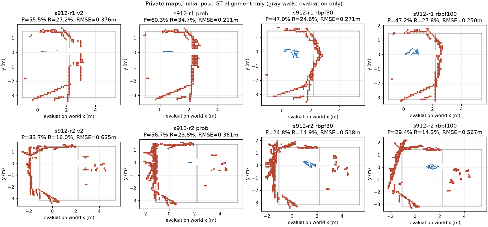
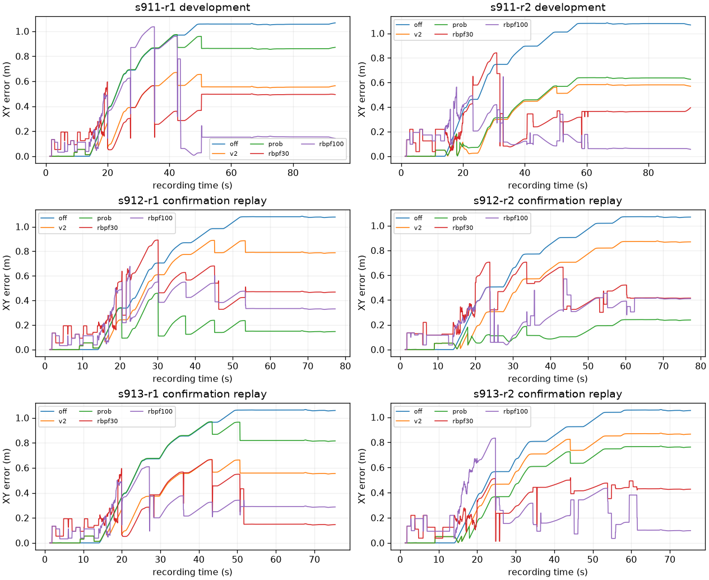

그림의 회색 벽은 평가용이며 지도 입력이 아니다. 출발 정답 변환만 적용했고 ICP는 하지 않았다.
지도와 경로는 각 로봇별이며 파란 RBPF 경로의 점프는 온라인 선택 입자가 바뀐 결과다.
그림 두 장은 각각 1 MiB 미만이며 실제 열어 축·범례·표 값과 일치함을 확인했다.

- 관련 시험: `test_self_map_prob.py`, `test_self_map_csm_v2.py`, `test_coela_runtime_self_walls.py` **40 passed**.
  off/기존 v1/v2 바이트 골든, posterior 모멘트·미관측 축, 공분산 가중 삽입, 개선 proposal의 중요도 비율,
  motion fallback, N_eff 선택적 재표본화·독립 지도, 자기 입력/중복/4 m 경계, 평가 시간 정렬·JSON 저장을 확인했다.
- `verify_prob_artifacts.py`: **18/18건** off 자세·셀·문구 바이트 동일, 예측 해시, 원장→최종 셀 전체 재구성 동일,
  모든 프레임 공분산 PSD, 최종 저장 격자 직접 채점과 보고값 동일. RBPF 최종 선택 입자 지도/원장도 일치했다.
- v1/v2 matcher, DR/grid, 두 과거 재생기는 `c4562781`과 소스 바이트 동일하다.
- [보존 manifest](results/own_map_prob_rbpf_v1/manifest.json)에 Git 요약·분포·결정 원장·그림과 전체 로컬 산출물 해시를 남겼다.
  원문 출처는 [references.json](results/own_map_prob_rbpf_v1/references.json), 실패 첫 실행도 별도 manifest/실행 로그로 보존했다.
  전체 입자 지도·전체 보정/공분산/자세 로그는 `outputs/self-map-prob-rbpf-v1-complete/`에 약239 MiB이며 원격 백업은 아니다.
- 실제 시뮬레이션·렌더링·모델 호출 없이 오프라인 재생했다. TensorBoard 변환은 사용자 요청대로 생략했다.
  PR #405는 DRAFT 유지하며 병합하지 않는다.

## 20. 평가 전용 GT 자세 상한·가시성·거짓 점유 분해 (2026-10-06)

사용자 요청에 따른 **진단만** 추가한다. 추정기·검출기·기본 off·§17 성공 기준은 바꾸지 않는다.
s911-r1/r2, s912-r1/r2, s913-r1/r2의 기존 산출물을 읽는다. 이미 본 자료의 사후 원인 진단이며
새 확증 코호트가 아니다. 시뮬레이션·물리 적분·렌더링·모델 호출·timing 측정을 하지 않는다.

### 20.1 결과를 보기 전에 정한 비교·분해 규칙

- **GT pose oracle:** 각 조건의 실제 최종 지도 원장을 그대로 사용하고 삽입 자세만 저장 GT XY/yaw로
  치환한다. 검출·수락/거부·가중치·free ray·0.1 m 해상도·log-odds는 고정한다. RBPF100은 온라인
  선택 자세가 아니라 **최종 선택 입자의 조상 원장**을 사용한다. 격자는 출발 GT 기준 자기 좌표에
  쌓고 출발 변환 한 번으로 채점한다. 공통 비교 oracle은 off가 받아들인 모든 검출을 사용한다.
  이는 자세 오차를 제거한 반사실 비교이지, 검출 오류까지 제거한 수학적 최대 성능은 아니다.
  §16–19의 부가 oracle은 world에 직접 양자화했으므로 격자 위상이 달랐다. 새 진단은 원래 자기
  격자 위상을 유지한다. **기존 실제 지도 지표는 바꾸지 않고 셀 전체 재구성 및 지표 일치를 검사한다.**
- 기존 분모 **349는 벽 349개가 아니라 6개 벽 직사각형의 경계 표본 349개**다. 기존 0.15 m
  허용거리 recall/precision/RMSE를 그대로 둔다. 추가 가시 recall은 전체 녹화의 저장 카메라 GT에서
  한 번이라도 RGB 시야에 들어오고 다른 물체에 가리지 않은 경계 표본만 분모로 삼는다.
  벽 몸체 가시는 같은 XY의 z=0.005..0.395 m를 1 cm 간격으로 검사한다. 접점 가시(z=0.005 m),
  접점 가시+4 m 이내, 실제 off 삽입 프레임의 접점 가시도 별도 기록한다. 가시 분모는 검출 결과와
  무관하다. 1 cm 수직 표본의 기하학적 가시이며 픽셀 단위 사람 annotation은 아니다.
- 저장 `camera_labels.jsonl`의 실제 optical origin/rotation 및 chassis transform을 사용한다.
  원본 frame ID·시각·RGB hash를 대조한다. 저장 qpos의 rigid transform만 `mj_kinematics`로 계산하고
  `mj_multiRay`로 첫 표면을 구한다. `mj_step`, `mj_forward`, Renderer는 호출하지 않는다.
  당시 렌더의 hidden geom groups 4/5를 제외하고 로봇·운반물 가림을 포함한다. 목표까지 광선 거리와
  첫 hit가 1 mm 이내일 때만 가시로 하여 동일 벽 뒤쪽 면을 잘못 세지 않는다. K-pinhole FOV와
  원본 fisheye 픽셀 유효 범위를 모두 확인한다.
- **거짓 셀 분해:** 최종 셀 중심이 벽에서 0.15 m 밖이면 거짓 셀이다. 삽입 hit의 양의 log-odds
  기여를 추적한다. miss는 남은 기여를 비례 축소하고, 포화 이후 증분은 0이며, 음수가 되면 기여를
  지운다. 최종 거짓 셀 하나의 남은 기여를 합 1로 정규화한다. 셀당 동일 비중, hit당 중복 집계 없음.
  같은 프레임/셀에 여러 선분 표본이 들어오면 균등 배분한다. 다음 순서로 배타적인 기여를 배정한다.
  1. (d) 연속 검출점은 허용거리 안인데 셀 중심만 밖이면 **칸 경계 효과**.
  2. (b) 연속 검출점이 밖이고 같은 검출을 GT 자세로 옮기면 안이면 **자세 오차**.
  3. 남은 점은 저장 검출의 카메라 모델로 접점 픽셀을 역산한다. 검출에 쓰인 above-contact 띠의
     u±2 및 v−10/−6/−2 총 9개 광선에서 실제 첫 표면이 벽인 비율을 (a) **거리/투영 오차**,
     바닥·물체·로봇인 비율을 (c) **비벽 오검출**에 배정한다. 접점 자체의 첫 바닥 픽셀을 오검출로
     오인하지 않는다. 혼합 띠 기여량 및 표면별 hit 수를 남긴다. 미확인 광선은 조용히 분류하지 않고 실패한다.
  이 분해는 순서가 명시된 **운영적 증거 분해**다. (a)는 접점 row·카메라 높이/기울기·선분 보간을
  포함한 측정 투영 오류이며, 순수 radial noise만 뜻하지 않는다. (b)는 GT 치환으로 충분히 해결되는
  오차만 센다. 자세와 검출이 동시에 틀린 상호작용은 (a)/(c)에 남는다. 숫자를 유일한 인과 비율로
  해석하지 않는다. GT 자세 지도 전체 재생 결과가 자세 효과에 대한 주된 근거다.

평가 구현: [map_error_oracle.py](code/map_error_oracle.py).
광선은 위치 기하 계산만으로 사용할 수 있다는 [MuJoCo 공식 API](https://mujoco.readthedocs.io/en/stable/APIreference/APIfunctions.html#ray-casting)를 확인했다.
`mj_kinematics`는 rigid transform, `mj_multiRay`는 nearest surface intersection을 수행한다.
동역학·렌더링 API를 차단한 시험과 단일/일괄 광선 일치 시험을 둔다.

**실행 전제 오류 1회 및 명시적 보완:** 첫 진단(`ac768041`,
`outputs/self-map-oracle-diagnostic-v1.log`)은 s911-r1 frame 133에서 판별 띠가 영상 밖이라는
검사로 종료했다. 자세·검출 원본은 변경하지 않았다. 실제 검출기는 화면 경계를 clip한다
(`height_free_wall.py:120,133`); 평가도 유효 광선만 사용하고 남지 않으면 **판별 불가**로 남긴다.
추가 점검에서 해당 점은 optical depth **−2.088 m**로 카메라 뒤의 바닥 평면 교점이었다.
투영은 음의 깊이에서도 같은 픽셀을 줄 수 있으므로 이것은 가시 벽 접점이 될 수 없다
([OpenCV 투영식](https://docs.opencv.org/4.x/d9/d0c/group__calib3d.html),
[MuJoCo ray의 x≥0 조건](https://mujoco.readthedocs.io/en/stable/APIreference/APIfunctions.html#ray-casting)).
GT 치환 후에도 틀린 점 중 이런 경우는 (a) 거리/투영 오류로 배정하고 그 근거를 별도 기록한다.
(a)의 `wall_fraction=1`은 이 경우 실제 벽 pixel 비율이 아니라 **배정 가중치**다.
미확인 ray도 판별 불가에 남기며 네 범주에 숨기지 않는다. 결과는 새 디렉터리로 전부 다시 계산한다.

**가시 분모 감사 보완:** 첫 완주(`c5c8c26b`, `outputs/self-map-oracle-diagnostic-v1-complete/`)에서
대표점 자체를 검사한 결과 r1 81–82, r2 31이었다. 원래 `wall_samples`는 같은 0.1 m bin의 점을
덮어쓰므로 두께 0.05 m인 북쪽·서쪽 벽에서 **보이는 앞면 대신 보이지 않는 뒷면 대표점**이 남는다.
이는 실제 관측 범위와 표본 대표 방식의 혼동이다. 최종 추가 지표의 가시는 **원래 349개 bin 각각에
속한 원래 벽 경계 표본 중 어느 표면이라도** 보였는지로 계산한다. 정확히 같은 bin만 묶고 이웃 칸
팽창·0.15 m 가시 판정 완화는 하지 않는다. 기존 채점 대표점·전체 recall은 그대로다. 위 첫 완주
자료는 보존하고, 앞/뒤 면 회귀 시험을 추가한 소스로 6건 전체를 다시 계산한다. 실제 지도·GT 지도·
오류 분해는 앞선 완주와 같아야 한다. 이후 표의 가시 recall은 이 bin 기준이며 대표점 자체 기준과
구분한다. 카메라 GT는 별도 rigid transform으로 전 프레임 **9,704개**를 대조해 1e−9 이내 일치했다.

### 20.2 여섯 녹화의 원래 지도와 공통 GT 자세 지도

각 칸은 **precision % / 전체 recall % / 가시 recall % / 벽 RMSE m**. GT는 off의 관측 원장과 같은 관측·가중치다.

| 녹화 | off | v2 | prob | RBPF100 | GT 자세 (off 관측) |
|---|---|---|---|---|---|
| s911-r1 | 47.2 / 28.7 / 65.0 / 0.542 | 55.0 / 29.2 / 68.0 / 0.304 | 47.4 / 35.0 / 77.7 / 0.406 | 59.4 / 27.5 / 61.2 / 0.225 | 66.7 / 33.8 / 77.7 / 0.185 |
| s911-r2 | 29.8 / 17.5 / 55.7 / 0.783 | 31.6 / 17.5 / 55.7 / 0.543 | 39.6 / 24.1 / 77.4 / 0.494 | 43.6 / 24.9 / 69.8 / 0.435 | 51.4 / 25.5 / 82.1 / 0.455 |
| s912-r1 | 50.6 / 27.5 / 64.4 / 0.521 | 55.5 / 27.2 / 63.5 / 0.376 | 60.3 / 34.7 / 76.9 / 0.211 | 47.2 / 27.8 / 61.5 / 0.250 | 70.9 / 33.8 / 76.9 / 0.180 |
| s912-r2 | 32.2 / 16.0 / 50.9 / 0.740 | 33.7 / 16.0 / 50.9 / 0.635 | 56.7 / 23.8 / 76.4 / 0.361 | 29.4 / 14.3 / 45.3 / 0.567 | 57.7 / 24.9 / 80.2 / 0.430 |
| s913-r1 | 45.7 / 28.7 / 65.0 / 0.559 | 53.8 / 28.7 / 67.0 / 0.294 | 45.0 / 34.7 / 77.7 / 0.394 | 45.9 / 28.7 / 65.0 / 0.244 | 67.8 / 33.8 / 77.7 / 0.187 |
| s913-r2 | 28.0 / 16.0 / 50.9 / 0.852 | 30.7 / 15.8 / 50.0 / 0.744 | 37.8 / 23.8 / 76.4 / 0.588 | 30.5 / 18.3 / 58.5 / 0.626 | 50.7 / 24.6 / 79.2 / 0.509 |

관측 선택·가중치까지 고정한 **조건별 GT 자세** 결과(같은 단위):

| 녹화 | off 관측 | v2 관측 | prob 관측 | RBPF100 최종 입자 관측 |
|---|---|---|---|---|
| s911-r1 | 66.7 / 33.8 / 77.7 / 0.185 | 66.7 / 33.8 / 77.7 / 0.185 | 69.9 / 33.8 / 77.7 / 0.178 | 66.7 / 33.8 / 77.7 / 0.185 |
| s911-r2 | 51.4 / 25.5 / 82.1 / 0.455 | 52.9 / 25.5 / 82.1 / 0.443 | 53.1 / 24.4 / 78.3 / 0.460 | 54.1 / 25.5 / 82.1 / 0.440 |
| s912-r1 | 70.9 / 33.8 / 76.9 / 0.180 | 70.9 / 33.8 / 76.9 / 0.180 | 70.7 / 33.8 / 76.9 / 0.180 | 70.9 / 33.8 / 76.9 / 0.180 |
| s912-r2 | 57.7 / 24.9 / 80.2 / 0.430 | 57.8 / 24.9 / 80.2 / 0.432 | 60.4 / 24.9 / 80.2 / 0.335 | 57.7 / 24.9 / 80.2 / 0.430 |
| s913-r1 | 67.8 / 33.8 / 77.7 / 0.187 | 67.8 / 33.8 / 77.7 / 0.187 | 71.3 / 33.8 / 77.7 / 0.179 | 67.8 / 33.8 / 77.7 / 0.187 |
| s913-r2 | 50.7 / 24.6 / 79.2 / 0.509 | 52.2 / 24.6 / 79.2 / 0.506 | 54.6 / 23.8 / 76.4 / 0.500 | 50.9 / 24.6 / 79.2 / 0.509 |

### 20.3 가시 분모 감사

| 녹화 | 전체 표본 | 몸체 가시 | 접점 가시 | 접점 가시 ∩ 4 m | off 삽입 프레임의 접점 가시 | RBPF100 가시 recall 분자/분모 | GT(off) 가시 recall 분자/분모 |
|---|---|---|---|---|---|---|---|
| s911-r1 | 349 | 103 | 103 | 88 | 103 | 63/103 | 80/103 |
| s911-r2 | 349 | 106 | 103 | 101 | 89 | 74/106 | 87/106 |
| s912-r1 | 349 | 104 | 104 | 88 | 103 | 64/104 | 80/104 |
| s912-r2 | 349 | 106 | 104 | 102 | 90 | 48/106 | 85/106 |
| s913-r1 | 349 | 103 | 103 | 88 | 103 | 67/103 | 80/103 |
| s913-r2 | 349 | 106 | 104 | 102 | 90 | 62/106 | 84/106 |

### 20.4 거짓 점유 셀의 운영적 원인 분해

각 행은 **해당 조건·녹화의 최종 거짓 셀**을 분모로 한다. 단위 %. 혼합 띠는 (a)/(c)에 분할했으며 별도 열은 그 불확실한 기여량이다.

| 녹화 | 조건 | 거짓 셀 | (a) 거리/투영 | (b) 자세 | (c) 비벽 | (d) 칸 경계 | 판별 불가 | 혼합 띠 기여 | 카메라 뒤 교점 기여(a의 일부) |
|---|---|---|---|---|---|---|---|---|---|
| s911-r1 | off | 102 | 21.0 | 56.6 | 21.9 | 0.5 | 0.0 | 27.9 | 1.0 |
| s911-r1 | v2 | 76 | 24.3 | 46.7 | 25.1 | 3.9 | 0.0 | 30.3 | 1.3 |
| s911-r1 | prob | 122 | 23.5 | 51.2 | 18.7 | 6.6 | 0.0 | 23.4 | 0.8 |
| s911-r1 | rbpf100 | 78 | 19.1 | 49.5 | 25.0 | 6.5 | 0.0 | 29.4 | 0.0 |
| s911-r2 | off | 193 | 45.9 | 44.6 | 9.5 | 0.0 | 0.0 | 7.8 | 21.8 |
| s911-r2 | v2 | 184 | 45.8 | 42.0 | 12.1 | 0.0 | 0.0 | 9.2 | 23.9 |
| s911-r2 | prob | 204 | 50.5 | 39.6 | 9.9 | 0.0 | 0.0 | 8.7 | 21.6 |
| s911-r2 | rbpf100 | 199 | 48.6 | 33.1 | 18.3 | 0.0 | 0.0 | 8.3 | 19.6 |
| s912-r1 | off | 85 | 20.5 | 60.4 | 18.5 | 0.6 | 0.0 | 20.6 | 2.9 |
| s912-r1 | v2 | 69 | 26.2 | 49.2 | 22.8 | 1.8 | 0.0 | 25.4 | 3.6 |
| s912-r1 | prob | 75 | 31.5 | 33.7 | 21.0 | 13.8 | 0.0 | 23.3 | 1.3 |
| s912-r1 | rbpf100 | 86 | 28.6 | 41.6 | 18.3 | 11.5 | 0.0 | 20.3 | 0.8 |
| s912-r2 | off | 177 | 32.5 | 58.8 | 8.8 | 0.0 | 0.0 | 9.4 | 16.4 |
| s912-r2 | v2 | 167 | 33.4 | 58.7 | 7.9 | 0.0 | 0.0 | 10.2 | 16.8 |
| s912-r2 | prob | 125 | 66.6 | 18.9 | 14.5 | 0.0 | 0.0 | 11.0 | 16.0 |
| s912-r2 | rbpf100 | 185 | 35.6 | 50.9 | 13.2 | 0.3 | 0.0 | 6.5 | 17.8 |
| s913-r1 | off | 108 | 17.5 | 61.6 | 20.4 | 0.5 | 0.0 | 24.2 | 0.9 |
| s913-r1 | v2 | 78 | 21.2 | 52.9 | 22.1 | 3.8 | 0.0 | 25.6 | 1.3 |
| s913-r1 | prob | 133 | 19.3 | 57.3 | 16.6 | 6.8 | 0.0 | 19.5 | 0.8 |
| s913-r1 | rbpf100 | 98 | 28.3 | 39.4 | 20.6 | 11.7 | 0.0 | 23.8 | 0.7 |
| s913-r2 | off | 206 | 45.9 | 46.0 | 8.1 | 0.0 | 0.0 | 8.4 | 21.8 |
| s913-r2 | v2 | 192 | 45.3 | 44.8 | 9.9 | 0.0 | 0.0 | 9.7 | 20.8 |
| s913-r2 | prob | 230 | 41.6 | 49.7 | 8.7 | 0.0 | 0.0 | 7.9 | 17.4 |
| s913-r2 | rbpf100 | 221 | 50.0 | 41.0 | 8.9 | 0.0 | 0.0 | 7.0 | 22.6 |

### 20.5 해석과 다음 수정 후보 하나 (구현하지 않음)

**결론: 자세 오차와 검출/관측 범위가 모두 남는다.** 종료 위치만으로 지도 오차를 설명할 수 없다.
RBPF100의 같은 조상 관측을 GT 자세로 쌓으면 precision이 각 건 **7.3–28.3 %p** 올라가지만,
여전히 **50.9–70.9%**, 전체 recall **24.6–33.8%**, 벽 RMSE **0.180–0.509 m**다.
자세 제거 후 RMSE 감소율은 s911-r1 **17.5%**, s911-r2 **−1.0%**, s912-r1 **28.1%**,
s912-r2 **24.2%**, s913-r1 **23.3%**, s913-r2 **18.7%**다. 특히 s911-r2는 **0.435→0.440 m**여서
자세가 정확해져도 측정 투영·비벽 증거·free-ray 간섭이 남음을 보여 준다. 비선형 격자 갱신이므로
이 감소율을 전체 오차의 유일한 인과 비율로 읽을 수는 없다.

- **관측 범위:** 실제 가시 bin은 **103–106/349 (29.5–30.4%)**다. 이 분모로 바꾸면 RBPF100 recall은
  **45.3–69.8%**, 공통 GT oracle은 **76.9–82.1%**다. 따라서 낮은 전체 recall에는 미관측 구역도
  크게 작용하지만, 가시 구역에서도 **17.9–23.1%**를 GT 지도조차 놓친다. r2는 가시 접점 103–104개
  중 off가 실제 삽입한 프레임에서 보인 접점이 89–90개에 그친다. range·정착·검출 존재 여부를 통과한
  프레임의 범위 손실도 있다. 이 차이를 전부 자세 탓으로 볼 수 없다.
- **분모 주의:** 가시 recall의 분자는 `덮인 표본 ∩ 가시 bin`이며 전체 recall 분자를 그대로 나누지
  않는다. 기존 0.15 m 채점 허용거리는 벽 두께 0.05 m보다 크고, 우연히 맞은 오검출도 전체 지도에서
  true로 세므로 `가시 bin 수/349`는 기존 전체 recall의 엄밀한 상한이 아니다. 몸체 가시는 1 cm 높이
  표본에 기반한 기하학적 근사이며 antialias·JPEG·재질까지 사람 눈으로 라벨링한 결과는 아니다.
- **정밀도 분해:** RBPF100 거짓 셀에서 (a) 거리/투영 **19.1–50.0%**, (b) 자세 **33.1–50.9%**,
  (c) 비벽 **8.9–25.0%**, (d) 칸 경계 **0–11.7%**, 판별 불가 **0%**다. 범위의 양 끝은 서로 다른
  녹화이므로 더해서 쓰지 않는다. 혼합 표면 띠 기여가 **6.5–29.4%**이므로 (a)/(c)의 소수점까지
  확정적인 수작업 semantic 정답 비율로 주장하지 않는다. 각 거짓 셀의 분할·좌표·log-odds는 Git에,
  각 evidence pixel의 표면 hit 수·optical depth는 로컬 원장에 보존한다.

**다음 후보는 한 가지: 바닥 교점의 양의 깊이(cheirality) 검사.** `height_free_wall.detect`의 현재
`ok`는 유한한 t와 XY 거리 크기를 검사하지만 optical depth의 부호를 검사하지 않는다. 화면 위쪽의
바닥 평면 교점이 카메라 뒤인데도 양의 거리 크기로 바뀌어 벽으로 남을 수 있다. 실제 s911-r1
frame 133의 접점 픽셀은 약 **(427, 3)**, optical depth는 **−2.088 m**였다. RBPF100 r2의 최종 거짓
셀에 남은 이 증거는 s911 **39/199=19.6%**, s912 **33/185=17.8%**, s913 **50/221=22.6%**다.
r1에서는 **0–0.8%**여서 모든 문제를 해결할 후보는 아니다.

표준적으로 ray는 카메라에서 앞으로 나가야 한다. 다음 작업에서 자기 카메라 모델의 바닥 교점에
`lambda=(z_floor−origin_z)/ray_z > 0` (동등하게 optical Z>0)을 요구하는 후보만 비교할 것을 제안한다.
[OpenCV 공식 문서의 positive-depth/cheirality 조건](https://docs.opencv.org/4.x/d9/d0c/group__calib3d.html)은
물리적으로 보이는 점이 카메라 앞에 있어야 한다고 설명한다. 이번 후보는 이 조건을 바닥 교점에 적용하자는
제안이며 OpenCV가 이 검출기의 성능을 보장한다는 뜻은 아니다. 자기 명령 기반 카메라 모델만 사용하면 되고
정답 자세·정적 지도는 필요 없다. **검출기나 mapper에는 아직 구현하지 않았다.** free-ray가 함께 바뀌므로
위 셀 비율을 그대로 precision 향상 예상치로 삼지 않으며, 향상과 recall 손실은 다음 별도 비교에서 검증해야 한다.

### 20.6 검증·산출물·재현

최종 진단 소스 **`fde6f505`**, 완료 기록일 **2026-10-07**. 조건별 결과는 합산하지 않았다.
대표점 가시 판정에서 bin 가시 판정으로 바꾼 뒤에도 **24개 원래 지도 지표, 24개 GT 지도 셀 파일,
24개 거짓 셀 분해 파일이 그대로**임을 검사했다. 기본 off 및 기존 v1/v2/prob/RBPF 추정 소스는 변경하지 않았다.

```sh
PY=/Users/changmin/projects/ugrp/.venv-sim-worker-mac/bin/python
$PY experiments/2026-10-05-ego-wall-map-probe/code/map_error_oracle.py \
  --output outputs/self-map-oracle-diagnostic-v2-NEW
PYTHONPATH=outputs/self-map-plot-deps $PY experiments/2026-10-05-ego-wall-map-probe/code/map_oracle_report.py \
  --source outputs/self-map-oracle-diagnostic-v2-complete \
  --output outputs/self-map-oracle-report-NEW
```

보고 스크립트는 대표점 기준 진단 파일도 비교 검증용으로 읽는다. 원본 녹화/자세/검출/격자 파일과
현재 진단의 SHA-256은 [manifest](results/map_error_oracle_v2/manifest.json) 및 각 case `summary.json`에 있다.
기존 실패·대표점 기준 진단도 삭제하지 않고 manifest에 포함했다. 전체 per-pixel 증거·GT 격자·가시 시계열은
`outputs/self-map-oracle-diagnostic-v2-complete/`에 로컬 보관하며 원격 백업으로 표현하지 않는다.

- `test_map_error_oracle.py` + `test_self_map_prob.py`: **25 passed**. 광선 가림/FOV/벽 뒷면,
  대표점 bin의 앞/뒤 면, 출발 좌표 변환, 부호가 잘못된 바닥 교점, 원장 재구성·질량 보존,
  기존 off/v1/v2 바이트 골든 및 확률 모듈 회귀를 확인했다. 새 평가 시험은 CI 목록에도 등록했다.
- [독립 산출물 검사](results/map_error_oracle_v2/verification.json): 원본 입력 해시, **24개 지도**의
  원장→셀→기존 지표 일치, **24개 GT 지도** 재채점, 거짓 셀 수·기여 합 보존, 카메라 GT
  **9,704개**와 저장 qpos의 rigid camera transform 일치를 확인했다. pose/camera GT는 평가 코드에서만 읽는다.
- MuJoCo **3.12.0**의 `mj_kinematics`/광선 API만 사용했다. 물리 적분·동역학·렌더링 호출은 0이며
  시험은 관련 API를 차단한다. 모델 호출·시뮬레이션·timing 측정·잠금·TensorBoard 변환은 하지 않았다.
- 아래 그림은 각각 1 MiB 미만이며 실제 열어 수치·범례·범위를 확인했다. 가시 칸은 원래 대표점 위치에
  녹색으로 표시한다. 회색 벽·GT는 평가용이며 제어·추정기에 전달하지 않았다. PR #405는 DRAFT 유지.

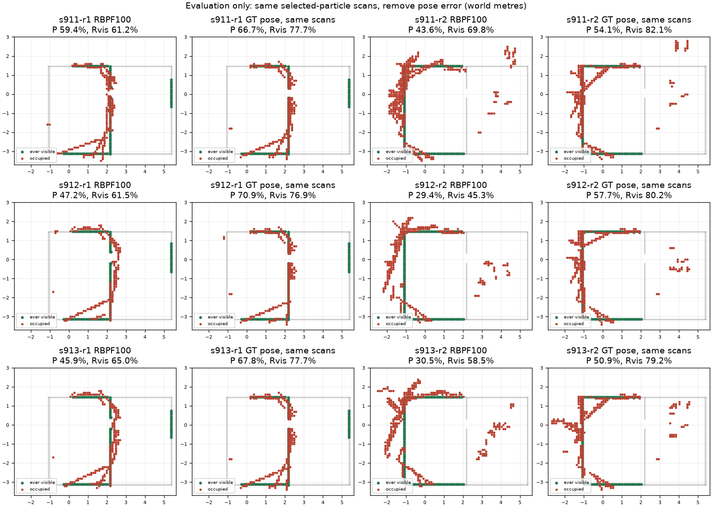
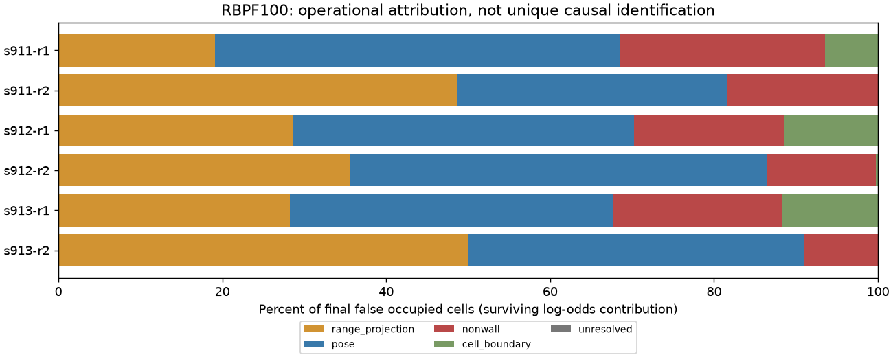

## 21. 양의 깊이 투영 검사 positive_depth_v1 (2026-10-07)

### 21.1 구현 전 고정한 범위·성공 기준

새 옵션은 `wall_projection_guard=off|positive_depth_v1`, **기본 off**다. 검출기 원본을 재선택하거나
튜닝하지 않고, **검출된 자기 선분이 누적 지도에 들어오는 입력 경계**에서 적용한다. 자기 명령 기반
카메라 origin/optical rotation으로 바닥 점의 `z_camera > 0` 및 카메라에서 앞으로 나가는 pinhole
광선의 바닥 교점 `t > 0`을 모두 확인한다. 지평선·0 깊이·비유한 값은 거부한다. 선분 두 끝점 중
하나라도 실패하면 그 선분 전체의 occupied hit와 free ray를 함께 제외하며 새 끝점을 만들어 붙이지 않는다.
카메라 calibration은 기존 명령 FK+sag 및 chassis offset을 그대로 쓴다. GT·상대 로봇·정적 지도는
검사에 쓰지 않는다. 원본 C 검출 파일은 보존하며, 이 옵션은 누적 지도와 거기서 만든 LLM 문구에 적용한다.

**비교는 자세를 고정한다.** 같은 6건 s911-r1/r2(개발), s912-r1/r2·s913-r1/r2(확인 재생)에 대해
기존 off(DR) / RBPF100 / **RBPF100+guard(저장된 최종 선택 입자의 자세·삽입 원장 고정)** /
**GT 자세+guard(같은 guarded 원장, 평가 전용)**를 나란히 기록한다. RBPF를 새 검출로 다시 정합하거나
입자를 다시 선택하지 않는다. 이것은 투영 필터의 지도 영향 진단이며 온라인 재정합 성능 검증이 아니다.
기존 종료·경로 위치 오차는 RBPF100 열에 그대로 남기며 GT 지도 성능과 합산하지 않는다.
개발 2건 후 설정 변경 없이 확인 4건을 재생한다. 이미 본 녹화이므로 새 확증 자료라고 부르지 않는다.

| 사전 고정 기준 | 분모·비교 | 통과 조건 |
|---|---|---|
| 카메라 뒤 교점 제거 | guard가 수락한 모든 선분 끝점 및 최종 거짓 셀의 뒤 교점 증거 | 각 건 0개; 특히 r2 3건 모두 0 |
| 정밀도 비열화 | 각 건 RBPF100+guard vs 기존 RBPF100, §20의 0.15 m precision | 감소 없음(수치 오차 허용 1e−12) |
| 가시 recall 보존 | §20.3에 고정된 349 bin 중 가시 bin, 각 건 RBPF100+guard vs RBPF100 | 감소 ≤2 %p |
| off 호환성 | 기본/명시적 off 및 6건 원장→기존 격자·LLM 문구 | 바이트 동일 |
| 자세 분리 | 기존 RBPF100 저장 자세·최종 입자 원장 pose | 변경 0, GT는 평가에서만 사용 |

전체 성공은 위 필수 조건을 **6/6건** 만족할 때만 선언한다. r2 통과 수 및 개발/확인 통과 수를 따로
표시한다. precision·전체/가시 recall·벽 RMSE·거부 선분/프레임·남은 원인 분해를 모두 기록하며 실패를
튜닝으로 덮지 않는다. ENOSPC/입력 누락은 HOST_ERROR로 기록하고 원본을 삭제하지 않는다.
시뮬레이션·렌더링·모델 호출·timing 측정은 하지 않는다. 같은 원인으로 두 번 막히면 중단하고 보고한다.

표준 근거: [OpenCV의 positive-depth/cheirality 조건](https://docs.opencv.org/4.x/d9/d0c/group__calib3d.html),
[PBRT 4판의 ray 구간 (0, tMax) 및 평면 교점](https://www.pbr-book.org/4ed/Shapes/Basic_Shape_Interface).
기존 `ColumnModel.t_of_row`의 t는 **바닥 trace상의 좌표**라서 음수 자체가 오류는 아니다.
검사는 이 trace 좌표의 부호가 아니라 **카메라 원점에서 출발한 optical ray의 매개변수**와 optical Z를 쓴다.

### 21.2 옵션·연결 위치와 실행 방법

| 인터페이스 | 옵션/기본값 | 적용 위치 |
|---|---|---|
| `SelfWallMemory(..., wall_projection_guard=...)` | `off` / `positive_depth_v1`, 기본 off | `observe_wall`에서 C record를 검증한 뒤 정합/지도 입력에 전달하기 전 |
| `observe_wall(..., camera_origin=..., camera_rotation=...)` | guard on일 때 필수 | 현재 chassis frame의 자기 명령 기반 3D origin, optical→chassis rotation; `camera_xy`와 동일 원점 검사 |
| `harness.wall_projection_guard.filter_segments` | 동일 옵션, 기본 off | Cartesian cache/원장 재생에서 같은 검사 사용; off는 원본 객체를 그대로 반환하고 카메라 인수를 읽지 않음 |
| `projection_guard_replay.py --wall-projection-guard` | 동일 옵션, 기본 off | §21.1의 저장 RBPF100 자세 고정 비교; on은 명시적으로 지정 |

검출기 `height_free_wall.detect` 자체와 원본 C 기록은 변경하지 않는다. 지도 입력 직전에 거르므로
guard on에서도 광학적으로 불가능한 원본 검출이 진단 파일에 남을 수 있으나 누적 점유·free ray에는
들어가지 않는다. low-level `grid.insert`는 이미 지도 좌표로 변환된 자료를 받으므로 카메라 검사를
할 수 없다. 직접 쓰는 재생기는 **변환 전** 위 공용 Cartesian 필터를 호출한다. 로봇 통합은
`SelfWallMemory.observe_wall` 경로를 사용한다. 모든 선분이 거부된 관측은 지도 갱신 없이 자기 DR
시각과 중복 처리 키만 진행한다. 진단 로그는 `projection_guard_events`이며 LLM 문구에 넣지 않는다.

이번 비교는 pose를 고정한 map insertion 실험이다. 이후 새 RGB에서 이 옵션을 켜 정합까지 다시 실행하면
관측 변경으로 RBPF pose도 달라질 수 있다. 그 온라인 피드백은 이번 결과로 검증했다고 주장하지 않는다.

```sh
PY=/Users/changmin/projects/ugrp/.venv-sim-worker-mac/bin/python
$PY experiments/2026-10-05-ego-wall-map-probe/code/projection_guard_replay.py \
  --wall-projection-guard positive_depth_v1 --output outputs/wall-projection-guard-v1-NEW
```

### 21.3 고정 자세 재생 결과

각 칸: **precision % / 전체 recall % / 가시 recall % / 벽 RMSE m**. off는 기존 DR 지도다. GT는 guard를 통과한 **동일 RBPF100 원장**의 자세만 평가용 GT로 치환했다.

| 녹화 | off | RBPF100 | RBPF100+guard (자세 고정) | GT 자세+guard (평가) |
|---|---|---|---|---|
| s911-r1 | 47.2 / 28.7 / 65.0 / 0.542 | 59.4 / 27.5 / 61.2 / 0.225 | 58.9 / 26.9 / 61.2 / 0.226 | 66.8 / 33.8 / 77.7 / 0.185 |
| s911-r2 | 29.8 / 17.5 / 55.7 / 0.783 | 43.6 / 24.9 / 69.8 / 0.435 | 48.4 / 23.8 / 69.8 / 0.307 | 61.6 / 25.5 / 82.1 / 0.236 |
| s912-r1 | 50.6 / 27.5 / 64.4 / 0.521 | 47.2 / 27.8 / 61.5 / 0.250 | 46.5 / 26.9 / 61.5 / 0.253 | 70.8 / 33.8 / 76.9 / 0.180 |
| s912-r2 | 32.2 / 16.0 / 50.9 / 0.740 | 29.4 / 14.3 / 45.3 / 0.567 | 33.6 / 14.3 / 45.3 / 0.463 | 64.0 / 24.9 / 80.2 / 0.229 |
| s913-r1 | 45.7 / 28.7 / 65.0 / 0.559 | 45.9 / 28.7 / 65.0 / 0.244 | 46.1 / 28.7 / 65.0 / 0.244 | 68.0 / 33.8 / 77.7 / 0.187 |
| s913-r2 | 28.0 / 16.0 / 50.9 / 0.852 | 30.5 / 18.3 / 58.5 / 0.626 | 36.2 / 18.3 / 58.5 / 0.489 | 57.7 / 24.6 / 79.2 / 0.422 |

| 녹화 | 입력→수락 선분 | 입력→삽입 프레임 | 뒤 교점 거짓 셀 기여 전→후 | Δprecision %p | Δ가시 recall %p | 전체 기준 |
|---|---|---|---|---|---|---|
| s911-r1 | 369→365 | 136→136 | 0.000→0 | -0.428 | +0.000 | 실패: precision 하락 |
| s911-r2 | 527→485 | 164→164 | 39.000→0 | +4.761 | +0.000 | 통과 |
| s912-r1 | 395→388 | 147→147 | 0.667→0 | -0.698 | +0.000 | 실패: precision 하락 |
| s912-r2 | 664→600 | 171→171 | 33.000→0 | +4.235 | +0.000 | 통과 |
| s913-r1 | 379→375 | 141→141 | 0.667→0 | +0.255 | +0.000 | 통과 |
| s913-r2 | 592→512 | 174→174 | 50.000→0 | +5.691 | +0.000 | 통과 |

**전체 4/6, 개발 1/2, 확인 재생 3/4, r2 3/3 통과.** 가시 recall 감소와 수락된 비양수 깊이/광선 교점은 6건 모두 0이다. 전체 성공 기준(6/6)은 미달했으며 기본 off를 유지한다.

| 녹화 | 제거된 참 셀 | 제거된 거짓 셀 | 새 점유 셀 |
|---|---|---|---|
| s911-r1 | 2 | 0 | 0 |
| s911-r2 | 4 | 39 | 0 |
| s912-r1 | 3 | 1 | 0 |
| s912-r2 | 0 | 33 | 0 |
| s913-r1 | 0 | 1 | 0 |
| s913-r2 | 0 | 50 | 0 |

### 21.4 위치 오차와 남은 지도 오류 (합산하지 않음)

위치 값은 기존 RBPF100 값을 그대로 보존한다. guard가 개선한 위치 성능으로 주장하지 않는다.

| 녹화 | 종료 XY m | 경로 median m | 경로 P95 m | 경로 RMSE m |
|---|---|---|---|---|
| s911-r1 | 0.143 | 0.155 | 0.960 | 0.432 |
| s911-r2 | 0.056 | 0.113 | 0.417 | 0.189 |
| s912-r1 | 0.331 | 0.334 | 0.540 | 0.364 |
| s912-r2 | 0.411 | 0.316 | 0.454 | 0.314 |
| s913-r1 | 0.287 | 0.291 | 0.496 | 0.296 |
| s913-r2 | 0.098 | 0.176 | 0.668 | 0.305 |

guard 후 최종 거짓 셀의 운영적 증거 분해(§20 규칙 유지), 단위 %:

| 녹화 | 거짓 셀 | 거리/투영 | 자세 | 비벽 | 칸 경계 | 판별 불가 |
|---|---|---|---|---|---|---|
| s911-r1 | 78 | 19.1 | 49.5 | 25.0 | 6.5 | 0.0 |
| s911-r2 | 160 | 36.1 | 41.1 | 22.8 | 0.0 | 0.0 |
| s912-r1 | 85 | 28.2 | 41.7 | 18.5 | 11.6 | 0.0 |
| s912-r2 | 152 | 21.6 | 62.0 | 16.1 | 0.3 | 0.0 |
| s913-r1 | 97 | 27.9 | 39.4 | 20.9 | 11.8 | 0.0 |
| s913-r2 | 171 | 35.4 | 53.0 | 11.6 | 0.0 | 0.0 |

### 21.5 판정과 다음 수정 후보 하나 (구현하지 않음)

**투영 버그 차단은 6/6, 사전 전체 기준은 4/6 통과**다. r2의 뒤 교점 거짓 셀 기여는 각각
**39→0, 33→0, 50→0**, precision은 **+4.761/+4.235/+5.691 %p**, 벽 RMSE는
**0.435→0.307 / 0.567→0.463 / 0.626→0.489 m**다. 수락한 모든 끝점에서 자기 명령 카메라
모델의 optical Z와 카메라 광선의 바닥 교점 t가 양수였다. 가시 recall은 여섯 건 모두 **0 %p 변화**다.
검출기 재선택·RBPF 재정합·정답 pose 보정 없이 투영 조건만 적용한 결과다.

s911-r1과 s912-r1은 precision이 각각 **−0.428/−0.698 %p**로 고정 기준에 실패했다.
s911-r1은 기존 참 셀 114→112, 거짓 셀 78→78이며 s912-r1은 참 셀 77→74, 거짓 셀 86→85다.
카메라 뒤라는 이유로 거부된 검출도 기존 자세 변환 뒤 우연히 정답 벽의 0.15 m 범위에 들어가면
참으로 채점됐기 때문이다. 그 셀 제거를 성능 성공으로 재분류하지 않는다. 새 점유 셀은 모든 건에서 0개다.
끝 위치가 좋아졌다고 주장하거나 GT oracle 개선을 RBPF 개선에 합산하지 않으며, 기준을 완화하거나
다른 threshold로 재실행하지 않았다. 기본 off와 PR DRAFT를 유지한다.

**다음 후보는 자기 지도만 사용하는 pose graph / sparse pose adjustment 하나**다.
guard 뒤 거짓 셀의 자세 기여 **39.4–62.0%**가 6건 모두 가장 크며 거리/투영은 **19.1–36.1%**다.
특히 s912-r2는 같은 guarded 관측에서 현재 pose 지도 RMSE **0.463 m**, GT pose 지도 **0.229 m**여서
과거 삽입 자세를 함께 조정할 여지가 있다. 종료 pose만 바꾸면 이미 잘못 삽입한 옛 벽은 움직이지 않는다.

[Hess et al., ICRA 2016 §V](https://research.google.com/pubs/archive/45466.pdf)는 저장 scan–submap 상대
제약으로 scan/submap pose들을 공동 최적화한다. [공식 알고리즘 설명](https://google-cartographer-ros.readthedocs.io/en/latest/algo_walkthrough.html#global-slam)은
재관측 제약과 기존 odometry 제약을 묶는 과정을 설명한다. 확인한 [공개 2D 최적화 코드](https://github.com/cartographer-project/cartographer/blob/877157a0d91788a7700221d87232d412cb3c1ef4/cartographer/mapping/internal/optimization/optimization_problem_2d.cc#L253)는
첫 submap을 고정하고, inter-submap 제약에 Huber loss를 적용한다(L269–278).

제안 범위는 로봇별 독립 그래프에서 출발 자세를 고정하고 자기 명령 DR 상대 제약과 자기 scan–submap
재관측 제약으로 과거 자세를 함께 보정하는 것이다. 현재 단일 격자 형식에서는 보정된 원장으로 지도 재삽입이
필요하다는 점이 저장 형식에 따른 추가 작업이다. 정적 지도·GT·다른 로봇 지도는 쓰지 않는다.
좁은 FOV·벽 접점만으로는 평행 벽/반복 벽 정합이 모호해 거짓 loop closure가 생길 수 있으므로,
신뢰할 재관측 제약이 실제로 있는지를 먼저 별도 진단해야 한다. 표준법 출처가 현재 데이터의 개선을
보장하지는 않는다. **이번 작업에서는 이 후보를 구현하거나 실행하지 않았다.**

원문 PDF와 고정 공개 코드의 URL·commit·SHA-256은 [references.json](results/wall_projection_guard_v1/references.json)에
기록했다. 원문 파일은 `outputs/wall-projection-guard-references/`에 보존한다.

### 21.6 검증·보존

사전 기준 **`9a04fb94`** → 구현·전체 재생 소스 **`321c8c58`**. 개발 2건 후
`development_fixed.json`으로 소스/옵션을 고정했고 같은 소스로 확인 4건을 완료했다.
선택 입자 원장의 136–174개 삽입 프레임을 사용했으며 guard가 프레임 전체를 제거한 경우는 없었다.
4 m·정착·원래 RBPF 수락/거부 결과는 과거 원장 그대로 유지했다.

- `test_wall_projection_guard.py`, `test_self_map_prob.py`, `test_self_wall_memory.py`: **47 passed**.
  z/t 양수, 0/비유한 값, 카메라 뒤/회전 카메라/광학 평면을 가로지르는 선분, hit+miss 동시 제외,
  모든 선분 거부 시 DR 시각 진행, 자기 로봇/중복/카메라 좌표계, 사전 기준 경계값을 확인했다.
  frozen 이전 소스와 기본/명시적 off의 snapshot·grid bytes를 DR/v1/v2/prob/RBPF 모두 비교했다.
- 6건 모두 기존 DR의 **pose·격자·LLM 문구 bytes 동일**, guard off RBPF 원장 재생의 **격자·LLM bytes 동일**,
  RBPF pose 파일 및 유지한 모든 원장 pose 동일. runtime 추정기와 검출기의 기본 동작은 바뀌지 않았다.
- [산출물 검증](results/wall_projection_guard_v1/verification.json): 입력·예측 파일 해시, **24개 지도**
  직접 재채점, guarded 원장→셀 일치, 양수 끝점, 뒤 교점 거짓 셀 0, 원인 분해 합/기준 판정 일치.
  위치 평가는 복사한 기존 RBPF 값이며 GT 지도와 분리했다. 저장 격자는 재구성용 OdomGrid 컨테이너다.
  현재 로봇 pose의 근거는 그 컨테이너 기본 odometry 필드가 아니라 별도 **`rbpf100-fixed-poses.jsonl`**이다.
- [manifest](results/wall_projection_guard_v1/manifest.json)에 로컬 전체 원장·격자·카메라 표면 증거와
  Git 요약·거부 로그·그림의 경로/크기/SHA-256을 남겼다. 원본을 삭제·덮어쓰지 않았으며 로컬 자료는
  원격 백업으로 표현하지 않는다. 그림은 1 MiB 미만이며 실제 열어 표·범례·범위를 확인했다.
- 시뮬레이션·동역학·렌더링·모델 호출 없이 오프라인으로 실행했다. 원인 분해 평가만 저장 qpos의
  기하학/광선 함수를 재사용한다. timing 측정과 잠금은 하지 않았다. TensorBoard 변환은 기존 사용자 요청대로 생략했다.

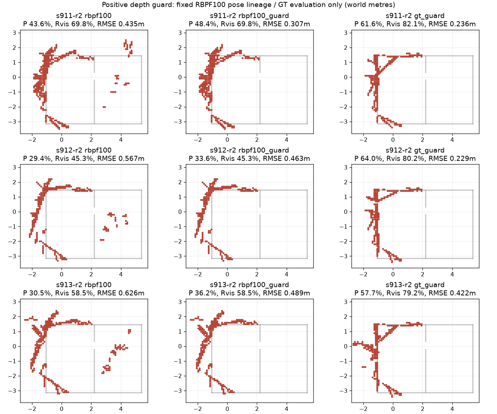

## 22. 자기 submap 자세 그래프 — 구현 전 사전 등록 (2026-10-07)

### 22.1 범위·성공 기준 (구현 전에 커밋)

`pose_graph=off|own_submap_v1`, **기본 off**. 자기 로봇의 저장된 local SLAM 원장에만 적용하는
오프라인 global SLAM 후처리다. `self_map=odom_grid_v1`, `wall_projection_guard=positive_depth_v1` 및
`pose_correction=own_map_rbpf_v1|own_map_csm_prob_v1` 조합을 지원한다. RBPF는 선택 입자의
자기 지도 원장 하나를 사용하며 입자/로봇 사이 지도를 합치지 않는다. prob는 기존 삽입 가중치를 보존한다.
local 추정기·검출·guard 판정은 바꾸지 않는다. 과거 scan/submap 자세를 함께 최적화하고 같은 선분·광선을
보정 자세로 다시 삽입한다. 실시간 제어 피드백은 이번 범위가 아니다.

**§17.1의 수치·분모·성공 기준을 그대로 재사용한다.** graph vs off(DR): 종료 XY ≤0.75 m이면서
≥30% 감소, 전체 프레임 경로 median/P95 악화 없음·RMSE ≥20% 감소, 최종 지도 precision 악화 없음,
전체 recall(349 bin) 감소 ≤2%p, 벽 RMSE ≥20% 감소. §21의 positive-depth 기준도 적용한다:
수락된 비양수 z/t 끝점과 뒤 교점 기여 0, **graph vs RBPF100+guard** precision 감소 없음(허용 1e−12),
가시 recall 감소 ≤2%p. graph의 목적상 자세는 바뀌지만, 원본 RBPF 자세·guard 판정·관측은 불변이며
GT는 산출물 저장 뒤 평가에서만 읽는다. 기본/명시적 graph off의 snapshot·격자·자세·LLM bytes 동일은 필수다.

비교 열은 **off / RBPF100+guard / RBPF100+guard+graph / GT+guard**이며 합산하지 않는다.
같은 s911-r1/r2 개발 2건 → 소스·설정 해시 고정 → s912/s913-r1/r2 확인 4건 순서다.
이미 본 녹화의 재생이며 신규 확증 실험이 아니다. 개발/확인/r2 통과 수와 각 실패 조건을 따로 기록하고,
전체 성공은 6/6 필수 조건 만족일 때만 선언한다. 결과를 본 뒤 튜닝하지 않는다. 그래프 제약이 없으면
보정 없음으로 기록하며 이를 루프 폐쇄 성공으로 세지 않는다. 입력 누락/ENOSPC는 HOST_ERROR로 보존한다.
같은 원인으로 두 번 막히면 멈춰 문헌/공개 코드 확인 후 보고한다. 시뮬레이션·렌더링·모델 호출 금지.

**s911–s913은 v7 구동·카메라 v3 이전 녹화다. 현행 구동·카메라에서 재검증 필요.**
이전 위치·지도 개선 수치를 현행 장치 성능으로 승계하지 않는다.

### 22.2 표준법·고정 구현 계획

[Hess et al., ICRA 2016 §IV–V](https://research.google.com/pubs/archive/45466.pdf)의 probability submap,
scan–submap 상대 자세 제약, sparse pose adjustment와 Huber loss를 따른다.
[Cartographer 고정 코드](https://github.com/cartographer-project/cartographer/blob/877157a0d91788a7700221d87232d412cb3c1ef4/cartographer/mapping/internal/optimization/optimization_problem_2d.cc#L253)의
첫 submap 고정과 inter-submap 제약만 Huber로 처리하는 구조를 재사용한다. Ceres 대신 기존
**SciPy 1.17.1 `least_squares(method=trf, tr_solver=lsmr, jac_sparsity=...)`**로 동일 SE(2) 상대 자세
목적함수를 푼다([공식 문서](https://docs.scipy.org/doc/scipy/reference/generated/scipy.optimize.least_squares.html)).
NumPy 2.5.2/SciPy 1.17.1은 기존 venv와 requirements-test에 이미 있어 새 설치·업데이트하지 않는다.

- 0.1 m log-odds submap, 최대 20 삽입 scan, 10 scan마다 새 submap(겹치는 두 활성 submap).
  완성 submap은 불변이다. 첫 submap 좌표는 자기 출발 자세 원점, 이후는 생성 scan의 local pose.
  local scan–submap 상대 자세는 기존 RBPF/prob 추정값, 공분산 하한은 기존 0.10 m/2°다.
- query 자신이 들어간 submap은 제외한다. 관측 상관/좁은 FOV 때문에 submap 시각 구간과 5 s 이상
  떨어진 재관측만 루프 후보로 한다. 현재 local 추정에서 submap 관측 범위와 6 m 이내인 후보만 검색한다.
- Hess Algorithm 1의 정확한 격자 전수 검색(±1 m, ±15°, 0.1 m/1°)을 사용한다. 작은 오프라인 문제여서
  branch-and-bound 가속은 생략한다. 평균 점유 확률 ≥0.55, 겹침 ≥0.60(0.20 m), 벽 잔차 RMS ≤0.15 m,
  창 경계 아님, 0.20 m/5° 이상 떨어진 다른 mode와 점수 차 ≥0.02를 모두 요구한다.
  유효 점은 기존처럼 0.1 m마다 최대 한 번, 최소 6개이며 정보량은 최대 12점으로 제한한다.
- 단일/평행 벽은 접선 위치를 결정할 수 없어 기존 점–벽 법선 Hessian 고유값 비율 ≥0.03 조건을 추가한다.
  이 관측성·mode 검사와 5 s 분리는 좁은 FOV 벽 접점에 필요한 보수적 제약이며 원 논문의 기본값이라고
  주장하지 않는다. 탐색/수락 수치 역시 재생 전 고정한 설계값이며 GT로 맞추지 않는다.
- 수락 상대 자세는 확률 격자에서 연속 least-squares로 정제하고 재검사한다. Huber 전환점은 whitened
  SE(2) residual norm 1.5, 최대 200 함수 평가, 첫 submap 고정. 수치 최적화 실패/비유한 결과는 적용하지 않는다.
- 지도 재삽입은 원래 시간순·hit/miss·가중치·guard 선분을 그대로 쓴다. 전체 경로의 비삽입 프레임은
  가장 최근 삽입 scan의 global/local SE(2) 보정으로 옮긴다(첫 scan 이전은 identity). scan 사이 추가
  위치 관측을 만들지 않는다. 루프 수락이 0이면 원래 원장·경로·격자를 그대로 보존한다.

기록: 모든 후보의 수락/거부 이유·점수/차이·겹침·잔차·관측성·상대 자세·공분산,
submap 회원 frame ID/격자·제약·최적화 전후 목적값·보정 원장·경로·지도/LLM와 입력 해시를 보존한다.
단일 벽·반복 벽 거부, 알려진 코너 재방문, 강건 목적함수, 자신/외부 로봇 제약 금지,
prob 가중치 보존·off 골든을 작은 오프라인 시험으로 먼저 확인한다. timing 비교는 하지 않는다.

### 22.3 구현 인터페이스·재현

| 인터페이스 | 기본값·조합 | 동작 |
|---|---|---|
| `SelfWallMemory(..., pose_graph=...)` | `off`; `own_submap_v1`는 §22.1의 guard+RBPF/prob 조합 필수 | local 추정기는 그대로 두고 global 후처리를 선택 |
| `finalize_pose_graph(poses=None)` | 명시적으로 호출 | 자기 최종 원장으로 submap/제약 생성·SPA·재삽입. 생략 시 원장 시각의 경로만 반환 |
| `poses` 입력 | 전체 경로 평가용 선택 입력, 각 행에 자기 `robot_id` 필수 | scan 이후 local→global 변환을 보존된 전체 프레임 자세에 적용 |
| `pose_graph_result` / `_graph_view` | finalization 전 `None` | 보정 원장·경로·진단 / 재삽입 지도. snapshot의 LLM 문구는 완료된 graph 지도를 사용 |
| 새 명령·관측 | 기존 local 추정 계속 | 완료된 graph view를 무효화; 오래된 graph 지도를 현재 메모리로 표시하지 않음 |
| `pose_graph_options` | `GraphOptions`의 §22.2 고정 기본값 | 이번 재생은 별도 튜닝 없이 기본값만 사용 |

`harness/self_pose_graph.py`는 GT·지도 파일·시뮬레이터를 import하지 않는다. 입력은 guard·4 m·정착 게이트를
통과한 원장이며 source robot/frame/time·중복을 확인한다. 직접 low-level 함수를 쓰는 재생기는 기존 guard
판정과 자기 카메라 geometry를 먼저 다시 확인한다. graph off는 입력을 검사하지 않고 원래 객체를 반환한다.
기존 `self_map` 필드는 local frontend를 보존하며 graph 최종 지도는 `_graph_view`에 분리한다.

RBPF의 저장 온라인 자세는 매 시각 최대 가중치 입자이며, 최종 지도 원장은 마지막 선택 입자의 계보다.
둘을 같은 궤적이라고 가정하지 않는다. 지도는 후자를 최적화하고, 전체 경로 표는 가장 최근 계보 scan의
local→global 변환을 전자의 저장 pose에 적용한다. 원장 scan과 온라인 pose가 다른 시각에서 그 차이는
유지된다. 종료·경로 지표와 지도 지표를 합산하지 않으며, 최적화한 map-node 자세도 원장에 따로 보존한다.

공식 [submap 구현](https://github.com/cartographer-project/cartographer/blob/877157a0d91788a7700221d87232d412cb3c1ef4/cartographer/mapping/2d/submap_2d.cc#L161)의
N scan마다 생성·2N에서 완료 패턴(N=10)을 확인했다. 전역 배치가 끝날 때 아직 활성인 마지막 submap도
마지막 관측까지 확정한다. Hess의 확률 격자 정제에서 bicubic 대신 bilinear 보간을 써 점유 확률 범위를
유지한다. solver·보간·frontend 교체 외에는 scan/submap 상대 SE(2) 목적함수 구조를 유지한다.

```sh
/Users/changmin/projects/ugrp/.venv-sim-worker-mac/bin/python \
  experiments/2026-10-05-ego-wall-map-probe/code/own_submap_replay.py \
  --pose-graph own_submap_v1 --output outputs/own-submap-v1-NEW
```

### 22.4 고정 소스 6건 재생 결과

각 지도 칸은 **precision % / 전체 recall % / 가시 recall % / 벽 RMSE m**. GT+guard는 평가 전용이며 보정 성능에 합산하지 않는다.

| 녹화 | off | RBPF100+guard | RBPF100+guard+graph | GT+guard |
|---|---|---|---|---|
| s911-r1 | 47.2 / 28.7 / 65.0 / 0.542 | 58.9 / 26.9 / 61.2 / 0.226 | 55.9 / 22.6 / 53.4 / 0.225 | 66.8 / 33.8 / 77.7 / 0.185 |
| s911-r2 | 29.8 / 17.5 / 55.7 / 0.783 | 48.4 / 23.8 / 69.8 / 0.307 | 55.7 / 21.8 / 65.1 / 0.273 | 61.6 / 25.5 / 82.1 / 0.236 |
| s912-r1 | 50.6 / 27.5 / 64.4 / 0.521 | 46.5 / 26.9 / 61.5 / 0.253 | 65.2 / 34.4 / 75.0 / 0.210 | 70.8 / 33.8 / 76.9 / 0.180 |
| s912-r2 | 32.2 / 16.0 / 50.9 / 0.740 | 33.6 / 14.3 / 45.3 / 0.463 | 36.2 / 15.2 / 48.1 / 0.347 | 64.0 / 24.9 / 80.2 / 0.229 |
| s913-r1 | 45.7 / 28.7 / 65.0 / 0.559 | 46.1 / 28.7 / 65.0 / 0.244 | 63.0 / 34.4 / 75.7 / 0.209 | 68.0 / 33.8 / 77.7 / 0.187 |
| s913-r2 | 28.0 / 16.0 / 50.9 / 0.852 | 36.2 / 18.3 / 58.5 / 0.489 | 41.1 / 20.1 / 64.2 / 0.410 | 57.7 / 24.6 / 79.2 / 0.422 |

위치 칸은 **종료 / median / P95 / 경로 RMSE m**. 전체 프레임 분포(P90/max 포함)는 JSON/원본 경로 오차 파일에 보존한다.

| 녹화 | off | RBPF100+guard | +graph | 전체 기준 |
|---|---|---|---|---|
| s911-r1 | 1.067 / 1.022 / 1.058 / 0.869 | 0.143 / 0.155 / 0.960 / 0.432 | 0.157 / 0.160 / 0.991 / 0.454 | 실패 |
| s911-r2 | 1.068 / 0.968 / 1.081 / 0.860 | 0.056 / 0.113 / 0.417 / 0.189 | 0.457 / 0.434 / 0.463 / 0.381 | 실패 |
| s912-r1 | 1.078 / 0.877 / 1.081 / 0.816 | 0.331 / 0.334 / 0.540 / 0.364 | 0.109 / 0.117 / 0.377 / 0.217 | 통과 |
| s912-r2 | 1.070 / 0.836 / 1.073 / 0.789 | 0.411 / 0.316 / 0.454 / 0.314 | 0.209 / 0.209 / 0.344 / 0.211 | 통과 |
| s913-r1 | 1.059 / 0.874 / 1.062 / 0.812 | 0.287 / 0.291 / 0.496 / 0.296 | 0.242 / 0.199 / 0.404 / 0.216 | 통과 |
| s913-r2 | 1.054 / 0.817 / 1.057 / 0.785 | 0.098 / 0.176 / 0.668 / 0.305 | 0.237 / 0.172 / 0.590 / 0.262 | 통과 |

### 22.5 루프 후보와 최적화

전체 scan–submap 쌍을 분모로 사전 제외와 실제 정합 거부를 구분한다. 루프 수락은 GT로 확인한 참 루프 수가 아니다.

| 녹화 | submap / scan | 회원/시간/거리 제외 | 정합 시도 | 수락 / 정합 거부 | 목적값 전→후 | 최대 XY 보정 m |
|---|---|---|---|---|---|---|
| s911-r1 | 14 / 136 | 262/635/0 | 1007 | 121 / 886 | 393.15→149.02 | 0.238 |
| s911-r2 | 17 / 164 | 318/689/0 | 1781 | 58 / 1723 | 252.85→138.26 | 0.413 |
| s912-r1 | 15 / 147 | 284/678/0 | 1243 | 198 / 1045 | 794.77→122.43 | 0.392 |
| s912-r2 | 18 / 171 | 332/688/0 | 2058 | 28 / 2030 | 100.85→50.36 | 0.492 |
| s913-r1 | 15 / 141 | 272/644/0 | 1199 | 164 / 1035 | 579.94→208.85 | 0.387 |
| s913-r2 | 18 / 174 | 338/682/0 | 2112 | 32 / 2080 | 96.10→60.19 | 0.299 |

| 녹화 | ambiguous_modes | high_residual | low_overlap | low_probability | refinement_failed | search_boundary | unobservable |
|---|---|---|---|---|---|---|---|
| s911-r1 | 409 | 4 | 8 | 25 | 13 | 222 | 205 |
| s911-r2 | 900 | 19 | 21 | 44 | 8 | 486 | 245 |
| s912-r1 | 497 | 0 | 0 | 40 | 22 | 287 | 199 |
| s912-r2 | 866 | 25 | 7 | 149 | 24 | 613 | 346 |
| s913-r1 | 437 | 0 | 0 | 24 | 26 | 370 | 178 |
| s913-r2 | 817 | 42 | 3 | 97 | 11 | 727 | 383 |

| 녹화 | 미달한 고정 기준 |
|---|---|
| s911-r1 | map_recall_within_2pp, guard_precision_nondecrease, guard_visible_recall_within_2pp |
| s911-r2 | guard_visible_recall_within_2pp |
| s912-r1 | 없음 |
| s912-r2 | 없음 |
| s913-r1 | 없음 |
| s913-r2 | 없음 |

### 22.6 판정·남은 문제

**전체 4/6, 개발 0/2, 확인 재생 4/4, r2 2/3 통과**다. 사전 전체 성공(6/6)에는 미달했다.
개발 결과를 본 뒤 설정·관측 선택·기준을 바꾸지 않았다. 확인 통과는 §17의 DR off 기준과 §21의
지도 비열화 조건을 만족한다는 뜻이며, 모든 위치 지표가 RBPF100보다 좋아졌다는 뜻은 아니다.

- 확인 네 건의 precision(RBPF100+guard→graph)은 **46.5→65.2 / 33.6→36.2 / 46.1→63.0 /
  36.2→41.1%**, 가시 recall은 **61.5→75.0 / 45.3→48.1 / 65.0→75.7 / 58.5→64.2%**다.
  벽 RMSE는 **0.253→0.210 / 0.463→0.347 / 0.244→0.209 / 0.489→0.410 m**다.
- 개발 s911-r1은 precision **−3.033%p**, 가시 recall **−7.767%p**, 전체 recall **22.6%**로 실패했다.
  s911-r2도 가시 recall **−4.717%p**로 실패했다. 두 건의 경로 RMSE도 각각 **0.432→0.454 m**,
  **0.189→0.381 m**로 RBPF보다 악화됐다. 이 실패를 보정 효과에 합산하거나 제외하지 않았다.
- RBPF 대비 종료 위치가 악화된 건은 s911-r1 **0.143→0.157 m**, s911-r2 **0.056→0.457 m**,
  s913-r2 **0.098→0.237 m**다. 특히 s913-r2는 고정 기준을 통과했지만 종료 위치가 나빠졌다.
  위치·지도 개선을 묶어 단일 성능 수치로 보고하지 않는다.
- 루프 수락은 **121/58/198/28/164/32**, 실제 정합 거부는 **886/1723/1045/2030/1035/2080**이며
  제외된 자기 회원·시간 인접 쌍과 분리했다. 6건 모두 SPA가 수렴했고 목적값은 줄었지만, 이는 자기
  일관성의 개선일 뿐 GT 정확도의 보장이 아니다. 동일 벽의 반복 관측과 겹친 submap 제약은 상관돼 있다.
  강건 커널·다봉성·관측성 검사를 통과한 잘못된 정합 가능성은 남으며 수락 수를 참 루프 수로 부르지 않는다.
- 그래프는 상대 제약으로 자세를 조정하므로 첫 submap의 공통 오차, 카메라 거리/투영 편향, 비벽 검출,
  실제로 보지 못한 벽을 해결하지 못한다. 예를 들어 s912-r2 graph precision **36.2%** 대 GT+guard
  **64.0%**, 가시 recall **48.1%** 대 **80.2%**의 차이가 남는다. GT oracle도 완벽한 지도가 아니다.

비양수 깊이/광선 끝점은 **6건 모두 0**이다. 재삽입 전후 모든 scan의 body-frame 선분·카메라·가중치가
동일하므로 graph가 새로운 카메라 뒤 교점을 추가하지 않는다. 이 불변성으로 뒤 교점 증거 0을 확인했으며,
이번에는 §20의 전체 픽셀/비벽 원인 분해를 새로 실행하지 않았다. 정답 pose는 지도·경로 채점에만 사용했다.

**현행 구동·카메라에서 재검증 필요.** 이번 s911–s913은 v7 구동·카메라 v3 이전 자료이며, 온라인
RBPF 재실행·실시간 global 보정·prob 전체 6건·현행 하드웨어/카메라 성능은 검증하지 않았다.
prob 조합은 API·작은 가중 삽입/원장 시험 범위다. 기본 off 및 PR #405 DRAFT를 유지한다.

### 22.7 검증·출처·보존

사전 기준 **`dc9efe84`** → 구현·6건 전체 재생 **`278fee8b`**. 개발 2건 후
[고정 기록](results/own_submap_v1/development_fixed.json)으로 SHA·모듈 해시·모든 옵션을 봉인했고,
확인 4건도 같은 소스로 완료했다. 코호트 중 소스 변경·튜닝·추가 라이브러리 설치는 없었다.

- 관련 시험 3파일(`test_self_pose_graph.py`, `test_wall_projection_guard.py`, `test_self_map_prob.py`):
  **53 passed**. frozen 이전 소스와 5개 local 추정기 × guard on/off에서 graph 기본/명시적 off bytes 일치,
  코너 재방문·직선/반복 벽 거부·SE(2) 상대 변환·block Huber·원점 고정·과거 scan 및 전체 경로 보정,
  자기 회원/외부 로봇/중복 제외·prob 가중치·frontend 불변·기준 경계를 확인했다.
- [산출물 검증](results/own_submap_v1/verification.json): 6건 입력/예측 해시, 같은 guarded 관측·가중치,
  원장→격자 정확 일치, **24개 최종 지도 재채점**, 전체 경로 변환 일치, 수락 루프의 회원 제외/양정 공분산/
  고정 gate, 최초 submap 고정, 목적값 감소, 사전 판정 일치를 확인했다.
- 6건 모두 graph off 원장·pose·격자·LLM 및 DR off pose·격자·LLM bytes가 기존 파일과 같다.
  원래 RBPF100·guard 산출물을 변경하지 않았다. `*-grid.json`은 지도 재구성 컨테이너라 기본 odometry
  필드는 경로 근거가 아니며, 위치 근거는 `graph-poses.jsonl`과 `graph-ledger.jsonl`에 분리했다.
- [옵션/환경](results/own_submap_v1/environment.json): 기존 venv NumPy 2.5.2, SciPy 1.17.1을 전후 확인했다.
  g2o/GTSAM/Ceres를 설치하거나 venv를 수정하지 않았다. Huber를 성분별이 아닌 whitened 3D residual
  block의 norm에 적용하고, sparse Jacobian 구조를 LSMR에 전달한다.
- [문헌·공개 코드 해시](results/own_submap_v1/references.json): Hess 원문, Cartographer 고정 commit의
  `submap_2d.cc`, `optimization_problem_2d.cc`,
  [상대 자세 residual 원문](https://github.com/cartographer-project/cartographer/blob/877157a0d91788a7700221d87232d412cb3c1ef4/cartographer/mapping/internal/optimization/cost_functions/spa_cost_function_2d.cc#L74).
  C++ 구현을 복사하지 않고 논문 목적함수를 Python으로 구현했다. SciPy 공식 solver 문서는 §22.2 참조.
- [manifest](results/own_submap_v1/manifest.json)에 Git 요약·정합 로그·submap 회원/제약·그림과 전체 로컬
  원장·격자·경로·최적화 자료의 크기/SHA-256을 보존했다. 전체 자료는 이 worktree의
  `outputs/own-submap-v1-complete/`이며 raw 원격 백업이라고 보고하지 않는다. 원본 삭제·덮어쓰기 없음.
- 시뮬레이션·MuJoCo 기하학·렌더링·모델 호출 없이 JSON/NumPy/SciPy 오프라인 계산만 했다.
  timing 비교·잠금은 없고 TensorBoard 변환은 앞선 사용자 요청대로 생략했다. 그림 2장은 각각 1 MiB
  미만이며 실제 열어 범위·표기·범례를 확인했다.

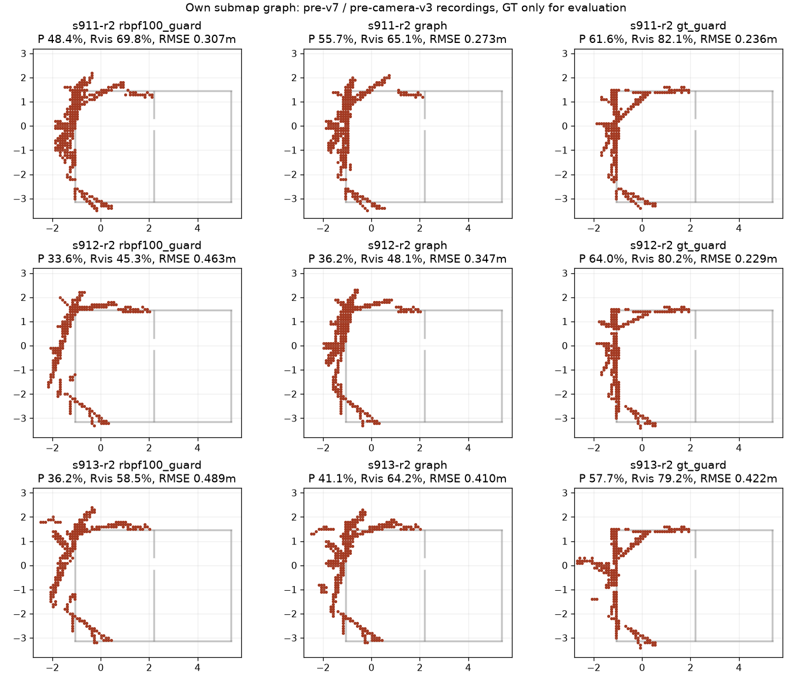

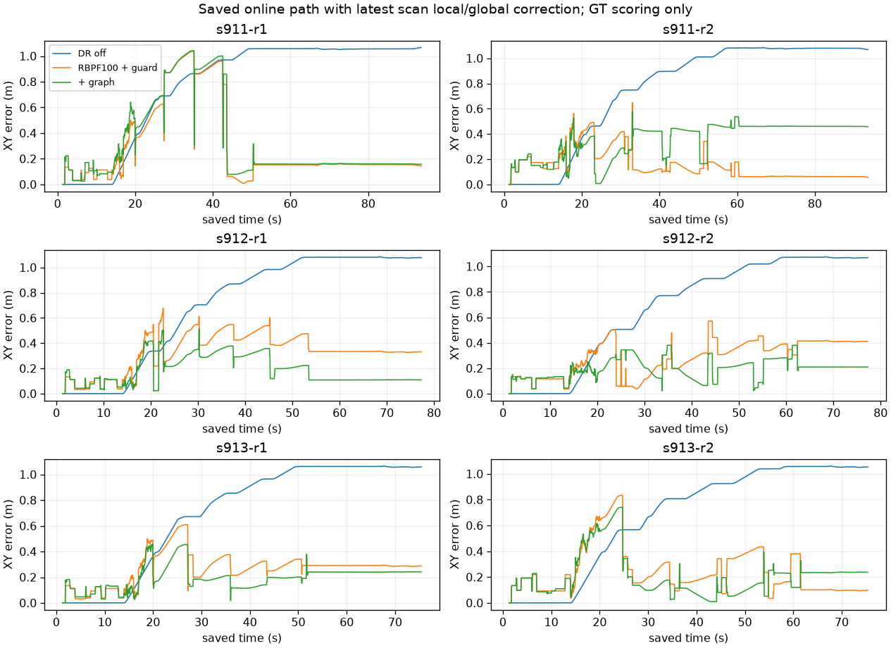

마감 추가 검증에서 18개(off/RBPF/graph × 6) 전체 경로를 저장 GT로 다시 채점해 종료·분포·프레임별
오차 파일의 일치를 확인했다. 첫 부가 검증 명령은 시스템 `python3`를 잘못 선택해 SciPy import에서
중단됐고, CONTRIBUTING의 기존 `.venv-sim-worker-mac/bin/python`으로 바로잡아 통과했다(동일 원인 1회).
실험 소스·설정·결과는 바꾸지 않았고 환경에 패키지를 설치하지 않았다. 최종 산출물 106개 로컬 파일과
32개 Git 요약/로그/그림의 manifest 해시, 문헌 파일 해시도 일치했다.

## 23. v7·카메라 v3 재검증 / inverse_sensor_v1 사전 등록 (2026-10-07)

이 절은 구현·새 결과 확인 **전** 등록이다. PR #409 탐색 평가기는 oracle 정적 지도 22/32로
사전 gate 30/32 미달하여 중단했고, 그 결과를 자기 지도 성능과 합산하지 않는다.
PR #405의 §17.1·§19 성공 기준과 §21 positive-depth / §22 graph 비교 기준을 **그대로 재사용**한다.
즉 각 확인 녹화에서 종료 오차 ≤0.75 m 및 DR 대비 ≥30% 감소, 경로 중앙/P95 비증가 및 RMSE ≥20%
감소, 지도 precision 비감소·전체 recall 하락 ≤2%p·벽 RMSE ≥20% 감소, 양의 깊이 위반 0,
RBPF+guard 대비 precision 비감소·가시 recall 하락 ≤2%p, 모든 off 골든 바이트 일치를 요구한다.
새 장면의 전체 벽 표본 수는 동일 0.1 m 표면 샘플링으로 다시 계산한다(구 장면 349와 섞지 않음).
새 confidence 조건도 같은 기준이며, 가중치만 넣었다는 이유로 통과로 판정하지 않는다.

### 23.1 고정 범위·분할·보정 출처

- 현재 브랜치 `claude/ego-wall-map`, 시작 `f3eeb6bf`. 다른 worktree는 수정하지 않는다.
- PR #406 `codex/s2-realism`의 고정 snapshot **dc1ed79bb561ec83d26085256ee6a3e1642adc41**에서
  `configs/calibration/s2_camera_v3_extrinsic_v1.json`만 출처·해시와 함께 복사한다(0991248b 이후).
  무하중 **21개 명령 자세**, 독립 holdout RMS 최대 **0.304978 px**. 입력은 명령 servo3–6의 정확 일치만,
  보간하지 않는다. `optical_to_actual_chassis`와 고정 `chassis_to_floor`를 한 번 합성하며 옛 arm offset을
  재가산하지 않는다. **loaded 표는 비어 있고 전체 표는 PARTIAL_NO_LOADED_CALIBRATION**이므로
  무하중 명령(servo1>1600)만 허용한다. 하중/미등록 자세는 관측 삽입을 보류하고 자기 명령 DR은 계속한다.
  이 제한을 숨긴 운반 카메라 보정/실물 검증 성공 주장은 하지 않는다. 실제 측정 자세·camera-pose GT는 평가 전용이다.
- `wall_camera_calibration=v3_unloaded_extrinsic_v1` / `wall_confidence=inverse_sensor_v1` 모두 기본 `off`.
  기존 v1/v2/prob/RBPF, positive-depth, graph off 경로와 출력은 보존한다. confidence v1의 온라인 조합은
  RBPF(30/100)로 한정하고 각 입자 지도에 삽입한다. DR·GT는 동일 관측의 평가용 가중 재구성만 별도 표기한다.
- 현행 자료는 s1042/s1043 개발 2건 → 설정·소스 고정 → s1044–s1047 확인 재생 4건, 각각 r3 자기 RGB·명령.
  이미 다른 연구에서 본 녹화라 새 통계적 확증으로 부르지 않는다. RGB 매 2프레임, 기존 정착·4 m·양의 깊이
  gate 유지. 구 녹화 s911–s913 r1/r2는 §22 고정 pose 원장 기반 **삽입 진단**으로 분리하며 새 RBPF 추정으로
  부르지 않는다. 개발/확인 구분은 기존대로 s911 2건 / 나머지 4건. 구 자료에 v3 보정은 적용하지 않는다.
- 현행 각 건은 DR(off), RBPF100+guard+graph(옛 카메라), +v3 보정, +v3 보정+confidence 및 평가 전용 GT+guard를
  나란히 기록한다. v3 조건의 DR/GT 기준선은 **같은 유효 무하중 관측 집합**도 별도로 채점해 관측 탈락과
  자세 개선을 분리한다. 종료·경로 오차는 전체 명령 이력, 지도 품질은 삽입된 관측 전체로 평가한다.
  GT 파일을 열기 전에 예측 격자·경로·원장·해시를 저장한다. 위치 정렬은 첫 GT SE(2)만, ICP 없음.

### 23.2 신뢰도 모델·진단 (결과에 맞춘 재튜닝 금지)

[Thrun 등, Probabilistic Robotics 9장 Table 9.2 정정 원문](https://robots.stanford.edu/probabilistic-robotics/corrections1/pg288.pdf)의
hit/free/unknown 역센서 모델과 [Elfes 1989](https://doi.org/10.1109/2.30720),
[Elfes의 위치·센서 불확실성 설명](https://arxiv.org/abs/1304.1098)을 따른다. 기존 grid는 이미 광선 내부를
free(-log odds), 끝점을 occupied(+log odds)로 갱신한다. 새 옵션은 각 증분에 같은 관측 가중치 w∈[0,1]을
곱한다. 같은 프레임/셀에서는 가장 큰 증거 한 번만 사용하고 끝점 hit가 free보다 우선한다.
입자별 원장에 가중치를 보존하여 재표본화·graph submap·최종 재구성에서도 같은 증거를 사용한다.

w는 표준 모델의 **새 센서용 보수적 evidence tempering 계수**, 논문에 실린 특정 숫자 또는 검출 정답 확률은 아니다.
다음 고정 요소를 곱하고 GT로 계수를 학습하지 않는다.
1. 거리: σ_pixel=1 px(접점 양자화·검출 위치 불확실성), σ_r=(r²+h²)σ_pixel/(h f_y),
   w_range=δ²/(δ²+σ_r²), δ=격자 0.1 m. r=h cot(각)의 Jacobian에서 유도한다.
   [Szulc & Iwanowski 2026의 homography 오차 분석](https://arxiv.org/abs/2604.10805)도 거리 제곱 증가를 설명한다.
2. 입사각: 벽 선분 법선과 카메라→선분 중심 방향의 내적 제곱(cos²). 길이 0이면 가중치 0.
3. 영상: 대비 c²/(c²+s²+6²), 선명도 g²/(g²+s²+6²). c는 기존 detector band contrast,
   s는 band 표준편차, g는 접점 위/아래 1 px 밝기 차. 6은 기존 검출기의 최소 contrast이다.
4. 자세: 현재 own RBPF cloud 공분산 Σ를 SE(2) endpoint Jacobian J로 전파하여
   w_pose=δ²/(δ²+trace(JΣJᵀ)/2). 정합 전 예측 cloud를 사용한다. GT oracle에서는 Σ=0을 명시한다.
5. 정착: 기존 팔 정착 gate 통과가 필수. 몸체는 자기 이동 명령이 유효한 동안 0.5,
   명령 만료/stop 뒤 0.25 s까지 0.5→1 선형 증가. 실제 속도·접촉·관절을 읽지 않는다.

먼저 구 자료 GT pose 원장으로 검출별 range/incidence/RGB/settling 가중치와 GT 벽 0.15 m 일치율을
저장한다. 비스듬한 가짜 벽 표본(가장 가까운 GT 벽 방향과 >10° 차이)의 신뢰도 분포를 별도로 비교한다.
결과를 보고 계수를 바꾸지 않는다. 5개 고정 구간 [0,.2),…,[.8,1]의 precision·표본 수 곡선(빈 구간 NA)을
구/현행 별도로 그린다. 전체 신뢰도와 pose 요소 제외 점수를 구분한다. 위에서 본 지도는 실제 벽 회색,
자기 지도 점유 사후확률에 따른 색 진하기, 추정/GT 로봇 경로를 함께 표시한다.

### 23.3 전용 녹화 조건·자원·검증

현행 유효 관측이 **20개 삽입 프레임 이상이고, 자기 명령 DR 경로의 XY 범위 ≥1 m 또는 yaw 범위 ≥90°**인
녹화가 하나도 없으면 운반 자료만으로 부족하다고 기록한다. 이 경우에만 별도 벽 관측 녹화 1–2개를 추가
사전 등록하고, 표준 실행 경로·agent_lock·ugrp_session으로 한 번에 하나 실행한다. freeze 옵션과 모델 호출은
사용하지 않는다. 실행 기하·카메라/구동 버전·번호·소스·예산을 별도 봉인하기 전 물리를 실행하지 않는다.
같은 원인으로 두 번 막히면 중단하고 원인·남은 범위를 보고한다. ENOSPC는 HOST_ERROR이며 원본 삭제 금지.

검증은 변경 모듈 시험 1–3파일, off 골든, 카메라 frame 합성·loaded/미등록 거부, confidence 단조성·free carving,
입자 지도 독립성·가중 원장 재구성 일치, prediction/GT 분리와 산출물 해시를 포함한다. 모든 커밋은 시험 통과 뒤,
Codex 공동 작성 trailer를 붙인다. 기존 venv 재사용, 새 라이브러리 설치 없음. PR #405 DRAFT 유지·병합 없음.
TensorBoard는 앞선 사용자 요청대로 생략하고 raw/그림/표를 로컬과 Git 허용 크기 내에 보존한다.

### 23.4 진단·실행 기록 (개발 중, 기준 변경 없음)

사전 등록 `83db69a2` → 보정/특징 추출 `ba5bd8d8` → RBPF 가중 삽입 `ca5bcdce`.
- 선행 s911-r2 GT-pose 진단: 비스듬한 거짓 검출 47개, 신뢰도 중앙 0.09665(평균 0.30078),
  대부분 맞는 검출 437개 중앙 0.34104. 그러나 r1 세 녹화의 같은 거짓 검출 중앙값은 0.65610–0.66232로
  올바른 검출보다 높다. **비스듬한 가짜 벽이 항상 낮은 신뢰도라는 가설은 성립하지 않는다.** 계수 재튜닝 없음.
- 기존 6건 원장 검출 총 2,725개 모두 RGB detector 특징과 연결됨(미연결 0). 단위는 독립 벽 수가 아니라
  반복 관측 검출/0.05 m 선분 표본이며 reliability curve의 분모에 표시한다. GT pose에서도 생기는 검출 오류를
  위치 추정 오차로 분류하지 않는다.
- s1042 v3 extraction: 전체 2,722프레임 중 736프레임 근거리 벽 관측. 검사 tick 1,361개 중
  정착 보류 346, 유효 무하중 보정 863, 하중 보정 없음 152. 자기 명령 DR XY 범위 (2.239,3.972)m로
  §23.3의 사전 등록한 수량/이동 범위 조건은 충족했다. 아래 GT 진단처럼 이것이 정확한 벽 관측을 보장하지는 않는다.
- 현행 trajectory는 `robot_xyz_m`/yaw만 저장하며 실제 카메라 자세·관절은 없다. 정확한 가시 벽 recall은
  **NA/검증 미달**로 남긴다. 고정 보정표+GT XY로 만든 추정 가시성을 실제 가시 GT로 바꾸지 않는다.
- 개발 도구 오류: NumPy 2.5의 2D `cross` 제거를 [공식 문서](https://numpy.org/devdocs/reference/generated/numpy.cross.html)
  확인 뒤 같은 2D determinant로 수정(1회); 무검출 프레임은 기존 guard API의 `(0,2,2)` shape로 전달(1회).
  extraction 종료 뒤 NumPy bool의 JSON 변환 오류(1회)는 [Python JSON 형식](https://docs.python.org/3/library/json.html)에
  맞는 bool로 수정했다. s1042의 완성된 contacts/events/poses 파일은 보존하고 길이·timestamp·해시 확인 후
  빠진 요약만 봉인했다. 검출·모델 계수·성공 기준은 변경하지 않았고 같은 오류 재시도 실패는 없었다.

### 23.5 구 녹화: 고정 자세 삽입 비교 (현행 검증과 합산 금지)

아래는 **precision % / 전체 벽 recall % / 벽 RMSE m**. §22의 graph 자세를 고정한 삽입 비교다.
기존 online RBPF cloud의 직전 시각 공분산을 사용하므로 최종 입자 계보의 정확한 사전분포 재생이라고
주장하지 않는다. 새 RBPF·루프 폐쇄 추정을 수행한 것은 현행 표뿐이다. GT 행에서는 pose 공분산=0.

| 녹화 | 기존 graph | +confidence, 동일 자세 | GT+guard | GT+guard+confidence |
|---|---|---|---|---|
|s911-r1 개발|55.9 / 22.6 / 0.225|56.7 / 22.9 / 0.213|66.8 / 33.8 / 0.185|67.6 / 33.8 / 0.187|
|s911-r2 개발|55.7 / 21.8 / 0.273|60.7 / 22.1 / 0.269|61.6 / 25.5 / 0.236|61.2 / 25.5 / 0.236|
|s912-r1 확인 재생|65.2 / 34.4 / 0.210|65.8 / 34.4 / 0.212|70.8 / 33.8 / 0.180|71.3 / 33.8 / 0.182|
|s912-r2 확인 재생|36.2 / 15.2 / 0.347|40.2 / 20.3 / 0.343|64.0 / 24.9 / 0.229|63.6 / 24.9 / 0.231|
|s913-r1 확인 재생|63.0 / 34.4 / 0.209|62.3 / 34.4 / 0.214|68.0 / 33.8 / 0.187|69.2 / 33.8 / 0.188|
|s913-r2 확인 재생|41.1 / 20.1 / 0.410|45.5 / 20.3 / 0.389|57.7 / 24.6 / 0.422|60.7 / 24.6 / 0.367|

s913-r1 precision은 0.7%p 낮아졌고, GT 삽입도 s911-r2/s912-r2에서 낮아졌다. confidence의 보편적인
오류 제거/precision 비감소 가설을 지지하지 않는다. 위치 오차는 고정했으므로 개선했다고 보고하지 않는다.

### 23.6 옵션·구현 경계

| 옵션 | 기본 | 적용 위치와 조합 |
|---|---|---|
|`wall_camera_calibration=off`|off|기존 FK+sag·arm-axis offset 경로 그대로|
|`wall_camera_calibration=v3_unloaded_extrinsic_v1`|off|`wall_camera_calibration.camera_transform` + detector `ColumnModel(camera_transform=...)`; replay `--camera`로 선택. 같은 origin/rotation으로 positive-depth 검사 및 자기 지도 camera ray를 구성. 하중·미등록 명령은 삽입 보류|
|`wall_confidence=inverse_sensor_v1`|off|`SelfWallMemory`→각 RBPF 입자 grid. `observe_wall(wall_features=...)` 또는 Cartesian `observe_contacts_confident(features=...)`; 기본 off에서는 특징을 읽지 않음|
|`pose_correction=own_map_rbpf_v1` + particles=100|off|기존 명령 DR 평균(M1 calibration) + v7 구조적 잡음 + 각 입자 자기 지도. 현행 v7 자료에 평균 gain을 새로 맞추지 않음|
|`wall_projection_guard=positive_depth_v1`|off|검출 접점을 카메라 고유 좌표로 투영하여 z>0·ray t>0 통과한 면만 정합/삽입|
|`pose_graph=own_submap_v1`|off|기존 offline graph. `insertion_weights`를 submap·최종 재구성에 동일하게 전달. frontend로 GT/global pose를 되먹이지 않음|

신뢰도=0은 해당 선분 hit/free 모두 기여 0. 같은 프레임/셀 중 strongest evidence만 유지하고 hit가 free보다
우선한다. 다음 프레임의 free ray는 기존 occupied log-odds를 감소시킨다. pose confidence를 별도 적용하는
기존 prob와의 중복 계수는 이번 v1에서 지원하지 않고 명시적으로 거부한다. 기존 옵션은 변경하지 않았다.

그림의 색은 검출 하나의 정답 확률이 아니라 **신뢰도로 완화한 누적 점유 사후확률**이다.
채점의 점유 기준은 기존 `log_odds > 0` 그대로다. 매우 옅은 양의 셀도 점유로 세므로 가짜 줄의 색이
옅어졌다는 이유로 precision이 좋아졌다고 보고하지 않는다. 미세한 양의 증거만 남고 반대 free 증거가
없으면 그 칸은 여전히 점유다. 성능을 높여 보이기 위한 점유 임계값 변경은 하지 않았다.

RBPF의 정합/importance sampling은 기존 거리장 우도를 유지한다. 새 계수는 각 입자의 **지도 삽입**과
그 지도에서 만든 graph submap 확률장에 적용된다. 거리장의 binary 점유 판정도 기존 그대로여서 지도
가중치가 자세 추정에 주는 영향은 간접적이다. 측정 우도 자체를 RGB confidence로 재학습하지 않았다.

### 23.7 개발 2건 종료·확인 설정 고정

s1042/s1043의 모든 예측을 봉인한 뒤 GT 채점을 했다. 종료 오차(옛 카메라 graph / v3 graph /
v3+confidence graph)는 각각 **1.214 / 2.303 / 3.317 m**, **0.820 / 1.746 / 2.579 m**다.
v3 GT-pose 지도조차 precision/recall이 s1042 **16.6%/4.9%**, s1043 **0%/0%**다.
계수를 바꾸지 않고 이 실패 그대로 확인 s1044–s1047로 진행한다. §17·§19 기준은 유지한다.

독립 수학 점검에서 direct pinhole floor 교점과 새 ColumnModel의 차이는 최대 **1.83e-14 m**,
평가용 static map의 여섯 벽 XY/반경은 녹화 scene.xml과 일치했다. s1043의 1,332개 접점 끝점에서
같은 방위 첫 GT 벽까지 거리와의 차이(평가 전용)는 중앙 **+0.686 m**, P10/P90 **+0.539/+0.914 m**다.
이것은 픽셀 의미 정답이 아니며 잘못 잡은 접점과 보정 전달 오차를 구분하지 못한다.

#406의 0.305 px는 **수평 정지 지그**에서 얻은 재투영 오차다. 표 자체의 한계는 free chassis의
높이·기울기·과도 운동을 온라인 보정하지 않는다는 것이다. 무하중 21자세를 잘 복사했다는 사실이
자유 주행 중 바닥 거리 정확도를 보장하지 않는다. 현재 녹화에는 실제 카메라/차체 roll·pitch GT가
없어 이 원인을 확정할 수 없다. 관측 수는 충분하고 투영/검출 편향이 발견된 상태이므로, 사전 등록한
§23.3 조건대로 추가 물리 녹화는 실행하지 않는다. 새 벽 순회 녹화에 앞서 자유 차체에서 보정 전달을
검증할 필요가 남는다. 보정표를 GT에 맞춰 재조정하거나 실시간 GT로 대체하지 않았다.

확인 전에 기본-off가 OpenCV를 새로 import하지 않도록 옵션 검증의 eager import만 제거했다.
수치 경로/계수는 개발 소스 c3dc8779와 동일하다. frozen 기존 RBPF의 원장·격자·의사결정·난수 상태
bytes와 기본/명시적 off를 포함한 관련 **49개 시험 통과** 후 고정한다. 개발 큐 드라이버 정리는
해당 예측 자식의 완료 뒤 수행했고, 과학 계산 중단·미완료 결과 재사용은 없다.

개발 예측 봉인 뒤 별도 `eval_only/supervisor.jsonl`도 점검했다. 유효 벽 관측 시 차체 tilt 중앙/P90/최대는
s1042 **0.057/0.127/0.277°**, s1043 **0.059/0.120/0.264°**다. 기울기 크기는 저장돼 있지만 방향·실제 팔
관절·카메라 transform은 없다. 따라서 +0.686 m 편향을 차체 기울기 때문이라고 확정하지 않는다.
명령 정착 gate 0.25 s와 보정표의 8 s 정지 지그, 실제 팔/카메라 자세 차이 및 잘못된 접점은 남은 가설이다.
이 평가 로그를 confidence나 estimator 입력에 전달하지 않았다.
[개발 진단과 출처](results/v3_confidence_v1/development-camera-diagnostic.json)를 별도로 보존했다.

녹화의 접촉 구성도 분리했다: s1042는 idle freeze off, s1043–s1047은 기존 S2 DEV의
`idle_robot_contacts=freeze_v1` 기록이다. 원본을 재생한 것이며 이번 작업에서 freeze를 켜거나 새 물리를
실행한 것은 아니다. 일반 무동결 주행/실물 성능으로 확장하지 않는다.
[원본 번들·접촉 옵션 해시](results/v3_confidence_v1/recording-contact-profiles.json)를 보존했다.

확인 재생의 수치 모듈은 `d312e4c1`로 고정했고, 추가한 표/그림/평가 진단만 결과를 읽는다.
[고정 시점](results/v3_confidence_v1/development-fixed.json)과
[import된 실행 소스 해시](results/v3_confidence_v1/runtime-source-hashes.json)를 보존했다.
기존 M1 이동 평균과 v7 구조적 잡음 모델도 고정했다. **현행 v7에서 새로 식별한 이동 평균이 아니다.**
따라서 현행 결과 악화는 검출/투영뿐 아니라 명령 DR 평균의 전달 문제도 포함할 수 있다.

### 23.8 현행 v7·카메라 v3 재생 결과

아래 precision과 recall은 %, 벽 RMSE는 m이다. precision 허용 거리 0.15 m, 전체 벽 표본 **349개**,
점유 기준 log-odds>0를 유지했다. `old camera`는 v3 RGB에 기존 FK+sag 투영을 적용한 비교 조건이며
**구 녹화라는 뜻이 아니다**. 모든 RBPF 행은 100입자+positive-depth+자기 pose graph다.
개발 2건과 확인 재생 4건, 구 녹화와 현행 녹화는 합산하지 않는다.

| 녹화 | DR/off | RBPF old camera | +v3 | +v3+confidence | GT+v3+guard |
|---|---|---|---|---|---|
|s1042 개발|27.2 / 20.9 / 1.112|9.4 / 6.6 / 0.597|23.5 / 17.5 / 0.799|19.5 / 23.5 / 1.100|16.6 / 4.9 / 0.593|
|s1043 개발|6.2 / 4.6 / 0.930|0.0 / 0.0 / 0.836|8.8 / 2.9 / 1.059|8.5 / 3.2 / 0.769|0.0 / 0.0 / 0.770|
|s1044 확인|13.3 / 6.6 / 0.888|17.4 / 7.4 / 0.783|13.1 / 5.2 / 0.884|8.9 / 6.0 / 1.028|0.5 / 0.6 / 0.725|
|s1045 확인|13.6 / 11.2 / 0.785|32.5 / 22.1 / 0.519|12.2 / 6.6 / 0.929|8.4 / 8.3 / 1.809|12.0 / 10.9 / 0.654|
|s1046 확인|2.1 / 2.3 / 0.896|0.5 / 0.0 / 0.796|11.3 / 4.6 / 0.948|3.8 / 1.4 / 1.102|10.4 / 8.0 / 0.708|
|s1047 확인|2.0 / 1.7 / 0.896|5.5 / 4.3 / 0.763|10.8 / 3.4 / 0.969|13.4 / 10.0 / 0.575|6.9 / 4.0 / 0.740|

관측 탈락 효과를 분리한 v3의 **동일 유효 관측** DR/GT 기준선:

| 녹화 | v3 DR (P/R/RMSE) | v3 GT+confidence (P/R/RMSE) |
|---|---|---|
|s1042|14.4 / 12.0 / 1.253|17.8 / 7.2 / 0.593|
|s1043|4.2 / 2.3 / 0.715|0.0 / 0.0 / 0.769|
|s1044|6.8 / 1.4 / 0.634|0.6 / 0.6 / 0.732|
|s1045|15.5 / 13.5 / 1.440|15.3 / 13.8 / 0.646|
|s1046|6.8 / 4.3 / 0.616|10.1 / 8.0 / 0.712|
|s1047|0.0 / 0.0 / 0.689|6.8 / 4.0 / 0.741|

전체 경로의 종료/중앙/P95/RMSE 위치 오차(m). 종료 위치와 지도 품질은 합산하지 않는다.
v3+confidence는 지도 가중치가 정합에 간접 영향을 준 새 RBPF 실행이다. 구 자료의 고정 자세 삽입 비교와 다르다.

| 녹화 | 조건 | 종료 | 경로 중앙 | P95 | 경로 RMSE |
|---|---|---|---|---|---|
|s1042|DR/off|2.891|1.843|2.891|1.997|
|s1042|RBPF+guard+graph, old camera|1.214|1.094|3.086|1.367|
|s1042|+v3|2.303|1.481|2.303|1.616|
|s1042|+v3+confidence|3.317|2.468|3.317|2.414|
|s1043|DR/off|2.525|1.618|2.525|1.828|
|s1043|RBPF+guard+graph, old camera|0.820|0.674|0.820|0.658|
|s1043|+v3|1.746|1.371|1.746|1.370|
|s1043|+v3+confidence|2.579|1.938|2.579|1.938|
|s1044|DR/off|2.688|1.105|2.689|1.713|
|s1044|RBPF+guard+graph, old camera|0.509|0.509|1.154|0.611|
|s1044|+v3|2.032|1.202|2.094|1.434|
|s1044|+v3+confidence|3.093|1.349|3.093|1.993|
|s1045|DR/off|3.247|3.776|4.224|3.670|
|s1045|RBPF+guard+graph, old camera|0.622|1.412|2.074|1.462|
|s1045|+v3|1.259|1.208|1.328|1.205|
|s1045|+v3+confidence|2.139|3.019|3.231|2.934|
|s1046|DR/off|3.310|2.133|3.520|2.371|
|s1046|RBPF+guard+graph, old camera|1.608|1.029|1.893|1.123|
|s1046|+v3|2.613|1.993|4.412|2.609|
|s1046|+v3+confidence|1.789|2.474|3.321|2.590|
|s1047|DR/off|0.724|1.670|2.654|1.780|
|s1047|RBPF+guard+graph, old camera|3.192|0.971|2.338|1.312|
|s1047|+v3|2.060|1.802|2.438|1.814|
|s1047|+v3+confidence|1.070|1.547|2.369|1.632|

§17·§19 원래 7개 기준을 모두 만족한 녹화 수(항목별 값은 각 JSON에 보존):

| 조건 | 개발 통과 | 확인 재생 통과 |
|---|---|---|
|RBPF+guard+graph, old camera|0/2|1/4|
|+v3|0/2|0/4|
|+v3+confidence|0/2|0/4|

실제 camera-pose GT가 없어서 **가시 recall 기준은 전 건 NA/검증 미달**이다. 따라서 이를 포함한
전체 성공으로 판정할 수 없다. 비양수 깊이/광선 끝점은 전 조건 0이며 off 골든은 시험으로 확인했다.
하중·미등록·정착 관측은 삽입에서 제외했지만, 전체 벽 349개와 전체 경로 시간의 평가 분모는 유지했다.

판정: **v3 보정과 v3+confidence는 개발 0/2, 확인 0/4**로 기준 미달이다. 기존 카메라 조건도
확인 1/4에 그쳤다. 신뢰도 적용 후 루프 수락은 6건 모두 0이었고, v3 무가중 대비 종료 오차는
s1042–s1045에서 악화, s1046–s1047에서 감소했다. 확인 precision은 s1047만 증가했다.
GT+v3에서도 precision 0–16.6%, 전체 recall 0–10.9%로 남아 자세 보정만으로 해결할 수 없다.

남은 우선 검증 대상은 **접점 픽셀과 자유 주행 중 명령 자세의 카메라→바닥 변환 분리**다.
수평 지그 재투영 RMS를 실제 바닥 거리 정확도로 대체하지 않는다. 실제 camera/base/arm GT는
별도 평가 로그에만 저장하여 투영·검출을 구분해야 하며 estimator에는 넣지 않는다. 이번에는 보정표·
검출기·graph gate를 추가 조정하지 않았다. 구/현행 지도와 calibration curve의 높은 신뢰도 거짓 벽은
현재 가중치가 잘 보정된 정답 확률이 아님을 보여 준다.

### 23.9 삽입·정합·관측 제한

| 녹화 | 전체 RGB | 검사 tick | 무하중 보정 | 하중 미지원 | 정착 보류 | 유효 벽 프레임 |
|---|---|---|---|---|---|---|
|s1042|2722|1361|863|152|346|736|
|s1043|2173|1087|586|146|355|416|
|s1044|2129|1065|736|76|253|548|
|s1045|13794|6897|558|5947|392|414|
|s1046|6500|3250|351|2501|398|197|
|s1047|5101|2551|375|1772|404|207|

루프 표의 각 칸은 **수락 / 실제 정합 거부**다. 회원 scan·시간 인접 제외는 실제 거부에 합산하지 않고
각 prediction JSON에 이유별 횟수를 보존했다. 수락은 참 루프를 GT로 입증한 수가 아니다.

| 녹화 | old camera | +v3 | +v3+confidence |
|---|---|---|---|
|s1042|581 / 51327|31 / 45973|0 / 45942|
|s1043|412 / 19051|14 / 13190|0 / 13204|
|s1044|772 / 32900|26 / 24297|0 / 24323|
|s1045|346 / 15737|42 / 12851|0 / 12854|
|s1046|37 / 4048|2 / 2082|0 / 2084|
|s1047|80 / 4491|0 / 2376|0 / 2365|

RBPF frontend 수락·보류·거부는 loop closure와 다른 사건이다. `frontend_counts`와 각 scan/입자의
`frontend-decisions.jsonl`에 이유·자세·삽입 여부를 보존했다. 전체 graph 후보의 진단도 로컬에 보존했다.
confidence를 적용하면 옅은 지도 셀이 기존 graph의 확률 gate에 걸릴 수 있다. 기존 gate를 완화해
성공률을 맞추지 않았고, 가중 삽입이 위치 개선을 자동으로 보장한다고 해석하지 않는다.

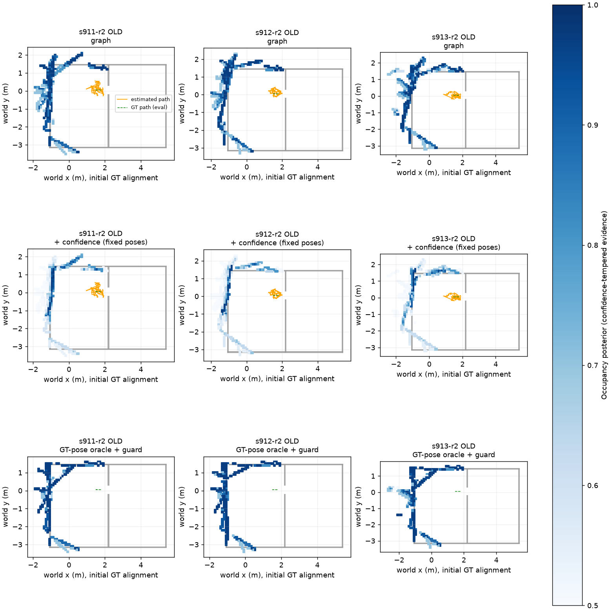

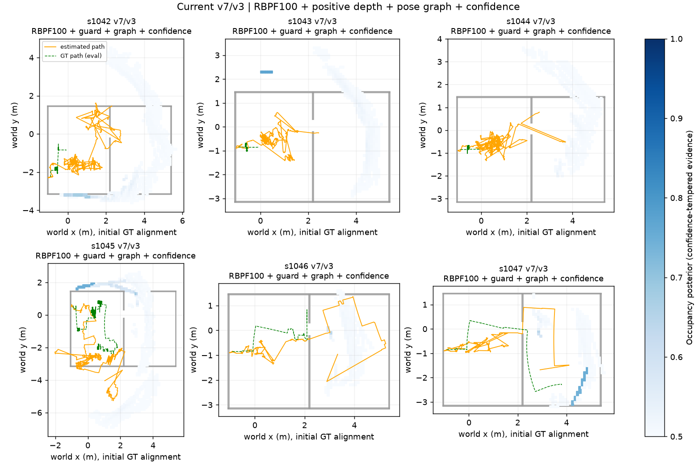

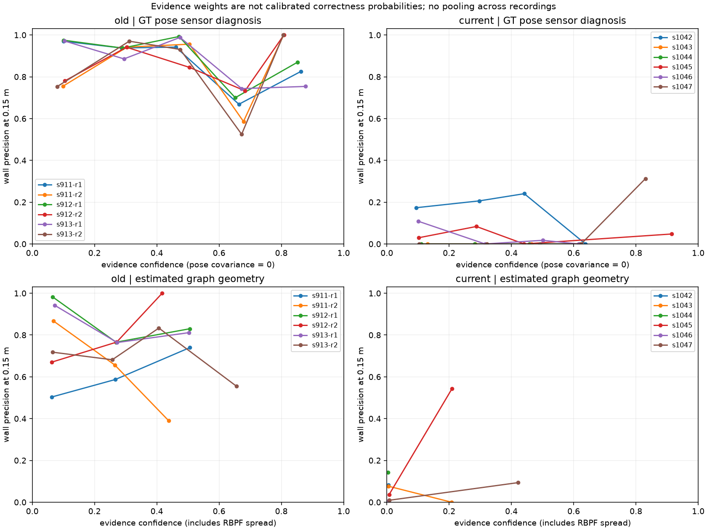

곡선은 5개 사전 고정 신뢰도 구간의 0.05 m 선분 표본 precision이다. 반복 프레임을 독립 벽으로
세지 않으며 각 bin의 검출/표본 수는 [calibration-curves.json](results/v3_confidence_v1/calibration-curves.json)에 있다.
빈 bin은 NA다. evidence weight가 정답 확률로 보정됐다는 증거가 아니며 곡선으로 계수를 다시 맞추지 않았다.

### 23.10 검증·보존·재현

- 관련 3파일 **49 passed**: 기본/명시적 off 및 frozen RBPF 원장·격자·판정·RNG bytes,
  무하중 표 합성·미등록/하중 거부, 가중치 단조성, free carving, 입자 지도 독립성,
  가중 원장→graph 격자 일치. `test_wall_confidence.py`를 CI에 등록하고 8개 shard 중 1회 포함을 확인했다.
- 같은 입력/수치 소스로 개발 2 → 고정 `d312e4c1` → 확인 4를 완료했다. 보고서 생성·source receipt·CI 등록은
  추정 수치에 영향을 주지 않는다. 큐만 중지/정리하고 독립 비교 조건을 병렬화했으며 과학 계산 자식은 끝까지 실행했다.
- [검증 기록](results/v3_confidence_v1/verification.json)은 입력·예측 해시, 무하중 exact lookup,
  전 끝점 양의 깊이/4 m gate, 원장→최종 grid 정확 일치 및 가중치 factor product를 확인한다.
  [manifest](results/v3_confidence_v1/manifest.json)는 로컬 원장·입자 판정·격자·경로·GT 채점·그림의 위치/해시를 보존한다.
- 전체 raw는 이 worktree의 `outputs/self-map-v3-confidence-v1/`에 보존한다. Git 요약·그림과 구분하며
  raw 원격 백업이라고 주장하지 않는다. 사용자가 남긴 미추적 Python 4파일의 해시도 처음과 동일하다.
- [환경](results/v3_confidence_v1/environment.json): 기존 Python/NumPy/SciPy/OpenCV와 기존 그림 의존성을
  사용했다. 새 venv·패키지 설치 없음. 이번 작업에서 물리·MuJoCo 기하학·렌더·모델 호출은 모두 0회다.
  TensorBoard는 사용자 요청대로 생략했다. PR #405는 DRAFT, 기본 off 유지, 병합하지 않는다.

재현은 기존 입력을 등록된 절대 경로에 두고 아래 단계를 따른다(예: s1044). 기존 출력이 있으면 중단하여
증거를 덮어쓰지 않는다. 결과 자료를 옮기거나 지우는 대신 새 작업용 출력 위치를 별도로 정해야 한다.

```sh
/Users/changmin/projects/ugrp/.venv-sim-worker-mac/bin/python experiments/2026-10-05-ego-wall-map-probe/code/v3_confidence_replay.py extract --case s1044 --camera off
/Users/changmin/projects/ugrp/.venv-sim-worker-mac/bin/python experiments/2026-10-05-ego-wall-map-probe/code/v3_confidence_replay.py extract --case s1044 --camera v3_unloaded_extrinsic_v1
/Users/changmin/projects/ugrp/.venv-sim-worker-mac/bin/python experiments/2026-10-05-ego-wall-map-probe/code/v3_confidence_replay.py predict --case s1044 --camera off
/Users/changmin/projects/ugrp/.venv-sim-worker-mac/bin/python experiments/2026-10-05-ego-wall-map-probe/code/v3_confidence_replay.py predict --case s1044 --camera v3_unloaded_extrinsic_v1
/Users/changmin/projects/ugrp/.venv-sim-worker-mac/bin/python experiments/2026-10-05-ego-wall-map-probe/code/v3_confidence_replay.py predict --case s1044 --camera v3_unloaded_extrinsic_v1 --confidence
/Users/changmin/projects/ugrp/.venv-sim-worker-mac/bin/python experiments/2026-10-05-ego-wall-map-probe/code/v3_confidence_report.py score s1044
```

개발 보조 명령의 시스템 Python/SciPy 누락과 넓은 glob의 `-managed` 폴더 혼입은 각각 1회 발생 후
등록 venv/정확한 입력 경로로 확인했다. 추정기·계수·원본을 수정하지 않았고 같은 원인 두 번 실패는 없었다.
기존 결과를 덮거나 확인 자료에 맞춘 튜닝은 하지 않았다.
