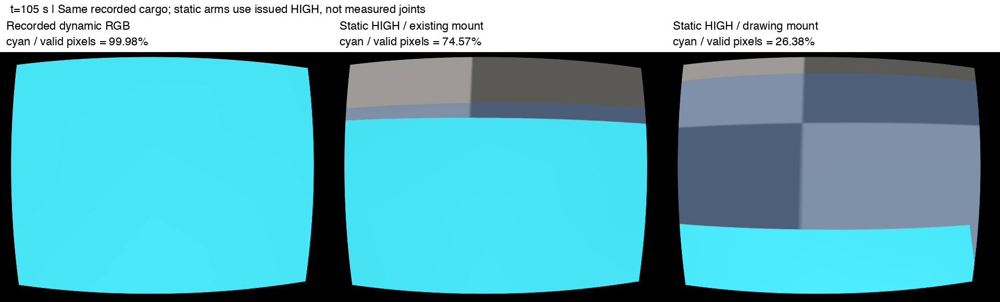
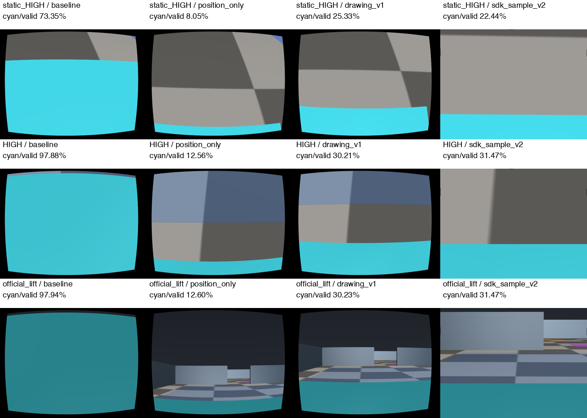
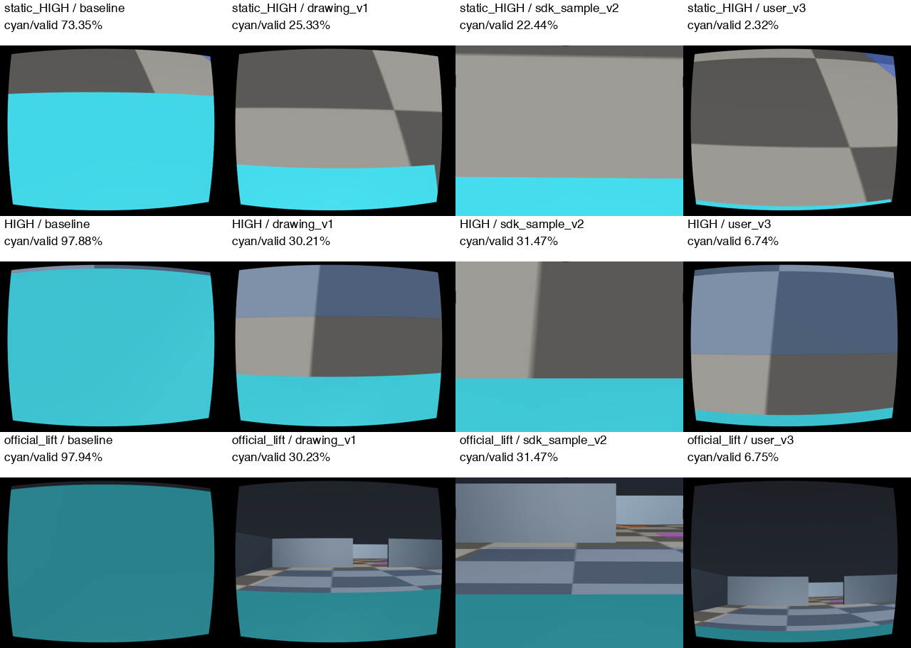
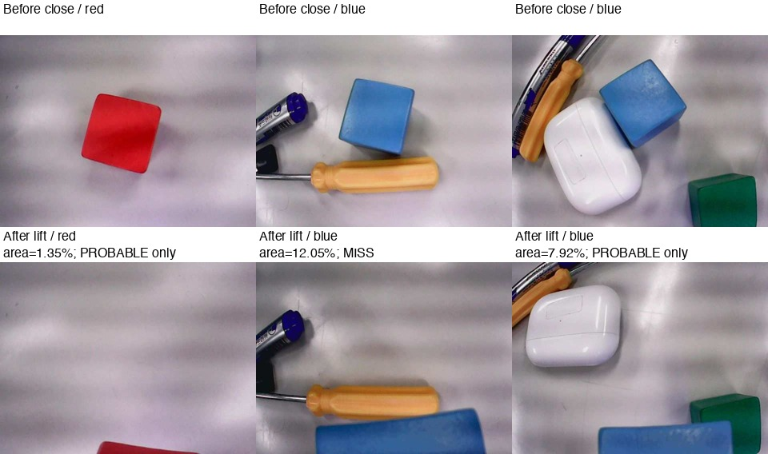

# S2(v106) 손목 카메라 검토

상태: **실물 보관 영상 복구·면적 측정 완료. 사용자 관찰 기반 v3 후보 추가; draft 유지·병합 금지.**
기준 main `b07f33aba278fda7434acaed0974c3d38f7b9ef0`.
모델 호출·실물 명령·동적 임무 재실행 없음. 기존 v106과 기본 프로필은 바꾸지 않는다.
원본은 `/Users/changmin/projects/ugrp/outputs/camera-review-20261006/`에만 보존한다.

**최신 결론(16:40 지시 반영):** 실물 영상이 ZIP에 남아 있었다. 집기 뒤 빨간 블록은 화면의 약1.35%, 파란 블록은 약7.92%였다(외부 파지 성공 확인은 없음). 가림이 많으면 파지 확인이 쉬워져 SIM이 낙관적일 수 있으므로 **가림이 많으면 보수적이라는 가정을 폐기**한다. v3는 사용자 관찰 기반 목표 후보이며 실측 카메라 보정으로 승격하지 않는다. 이전 절의 “자료 없음”은 v1/v2 당시 탐색 범위의 기록이고 아래 v3 결과로 대체된다.

**v1 당시 판정:** “cyan을 들면 실물에서도 앞이 가려진다”는 전제를 확인하지 못했다.
기존 시뮬레이션의 가림은 실제 저장 영상으로 확인되지만, 현재 장착값은 순정 도면과 다르고
우리 개체에서 검증되지 않았다. 별도 도면 후보에서는 가림이 줄었으나 일부 cyan은 계속 보인다.
실물에서 블록이 안 보였다는 관찰을 부정할 근거도, 내려놓기를 바로 없앨 근거도 없다.
현재 v106의 내려놓기는 **기존 SIM 프로필을 위한 우회 동작**으로만 해석한다.



## 조사로 먼저 고정한 비교

| 항목 | 현재 v106 | 새 진단 프로필 |
|---|---|---|
| ID | `ugrp1-icspring-fisheye-centered-mount-provisional-20260831` | `masterpi-camera-drawing-mount-review-v1` |
| 붙어 있는 곳 | `r3__gripper`, 손목 끝 집게 몸체 | 같음 |
| 손목 기준 렌즈 x/y/z | 67 / 0 / 13.6 mm | 도면 약 53.0 / 0 / 28.2 mm |
| 광축 | 공구축보다 **위로** 약 7.46° | 도면 명목 평행(0°) |
| 신뢰 범위 | 구조 추정, 한 자세의 옛 영상 적합; held-out 미완료 | 렌즈 전면의 도면 판독; 광학 중심·실물 장착각 미확인 |
| K·왜곡·해상도 | 아래 수치 | 그대로 유지; 순정 렌즈 전체를 재현했다고 하지 않음 |

새 위치는 기존 공개 사양 조사에 기록된 픽셀로 계산한다. `x=(407.5-283)*343/806` mm,
`z=(831.5-765)*185/437` mm. 약 ±2 mm는 도면 판독 오차이며 제조 공차가 아니다.
y=0은 기존 중앙 배치를 유지한 가정이다. 정확한 좌우 위치는 도면에서 가려져 있다.
각도는 공식 옆 도면의 평행 배치를 따른 명목값이다. 가림을 줄이려고 수치를 탐색하지 않는다.
기존 주석의 down-pitch와 달리 MuJoCo의 `-Z` 광축을 계산하면 국소 +z 방향 약 7.46°이다.

## 코드와 실물 기록

- `sim/masterpi_scene_v2.xml`: `robot → arm_base → shoulder_link → elbow_link → wrist_link → gripper → robot_cam`.
  `sim/masterpi_model_v3.py`와 `masterpi_robot_models.py`는 이 카메라를 그대로 유지한다.
- `sim/masterpi_camera_profile.py`: 640×480, fx=619.519454, fy=622.165488,
  cx=287.689106, cy=218.696866. fisheye D=(-0.01998195,-0.17075936,-0.25683182,0.96509334).
  K 기준 각도는 약 가로 54.5°, 세로 42.1°이며 raw fisheye 전체를 단일 FOV로 표현할 수 없다.
  MuJoCo `cam_fovy`는 센서 중심 기준 약 42.188°; 주점 비대칭 K의 상하 각도 합과 다르다.
- `sim/multi_masterpi_production.py`는 매 렌더 전에 기존 mount를 다시 설정하고 fisheye remap을 적용한다.
  따라서 XML만 새 후보로 바꿔 기존 실행기에 넣는 것은 유효한 이관이 아니다.
  이번 프로필은 독립된 **진단 XML 변환**에만 사용하며 기존 실행기에 연결하지 않는다.
- `sim/navigation_camera_profile.py`의 차체 고정 `nav_cam`은 별도 simulator-only 카메라다.
  S2는 `sim/solo_cyan_v106.py → CameraRobotPort.capture()`의 `robot_cam`을 사용한다.
- `harness/zone_pair_highpose.py`: HIGH={3:896,4:2035,5:1894,6:1500}, 집게 닫기 1500.
  명령 FK는 집게 중심 (203.21,0,149.86) mm, 공구축 -40.05°다. 명령은 실제 관절 측정이 아니다.
  `harness/zone_final_pair_vision.grasp_postures()`의 hover는 {3:807,4:1897,5:2187,6:1500},
  마지막 바닥 파지는 {3:1269,4:2052,5:2494,6:1500}; 그 사이 7단계 하강을 유지한다.
- 공식 MasterPi 조립 사진과 도면은 카메라가 집게 위에서 팔과 함께 움직이는 구조를 보여 준다.
  `codex/masterpi-public-specs` 원격 브랜치는 현재 목록에 없지만 그 조사 기록은
  [기존 README](../2026-09-28-masterpi-public-specs/README.md)에 보존돼 있다.
- `calibration/masterpi/hand_eye_trials.jsonl`의 24개 관측은 측정값이 비어 있고,
  `static_measurements.json`에도 실측 출처가 없다. [#385](https://github.com/kcm0127-dotcom/ugrp/pull/385)는
  Windows의 JPEG 수신·팔 dry-run 기록이며 운반 자세/카메라 외부 보정 증거가 아니다.
  그 Windows 원본 사진을 이 Mac에서 확인한 것으로 보고하지 않는다.
- 순정 HBVCAM-V2101의 공식 170°는 H/V/대각 축이 불명이다. 170°를 MuJoCo fovy로 넣지 않는다.
  공개 SDK의 일반 5계수 보정값도 현재 4계수 fisheye와 호환되지 않는다.

## 방법·실행 계획 (결과 전에 고정)

고전적인 eye-in-hand 식은 `A X = X B`이며, 표준 OpenCV는 Tsai–Lenz/Park–Martin 등으로
여러 자세의 카메라-손목 변환을 구한다. 공식 MuJoCo의 부모 몸체 기준 위치와 -Z 광축,
OpenCV의 K/왜곡 모델을 각각 확인한다. 최근 Wise 등의 RWHEC 연구도 관측의 식별 가능성을
따로 다룬다. 좋은 영상 한 장 또는 보정 목적함수의 최적값은 실물 일치를 증명하지 않는다.
이번에는 새 물리 자료가 없으므로 보정 알고리즘으로 임의 수치를 적합하지 않는다.

1. 기존 `s2-graduation-fae1fc4a-s1026-P2-2-place`의 controller `carry` 상태이면서 HIGH 명령인
   **모든 저장 프레임**을 읽어 기존 cyan HSV 마스크로 면적을 잰다. 원본 JPEG 해시 전부 확인.
   전체 640×480과 remap의 유효 픽셀을 각각 분모로 사용한다. cyan 이외가 모두 벽은 아니다.
2. 기존 표준 `Scene`이 저장한 `scene.xml`을 재사용한다. t=105/180/270초에서 기록된
   로봇 위치·yaw와 화물 자세를 사후 진단으로 넣고 팔은 동일한 HIGH 명령 자세로 고정한다.
   실제 관절·base roll/pitch가 저장되지 않아 원본의 정확한 물리 재생은 아니다.
3. 현재 mount와 도면 후보만 비교한다. K/D/렌더 크기·near clip·물체·접촉·조명 동일,
   카메라의 massless visual만 함께 옮긴다. `mj_forward`와 정지 RGB 6장, `mj_step=0`.
   `agent_lock.py status == null`일 때만 자기 PID로 acquire하고 `finally`에서 자기 잠금만 release.
4. 새 소스는 관련 시험 통과 후 먼저 commit/push한다. raw와 결과에는 실행 SHA·입력 해시를 남긴다.

## 참고 자료 (2026-10-06 확인)

- [Hiwonder MasterPi 공식 제품](https://www.hiwonder.com/products/masterpi),
  [공식 치수도](https://cdn.shopify.com/s/files/1/0084/2799/5187/files/masterpi_01173667-020d-4baa-8ec8-6ff4a45b6220.jpg?v=1716200111):
  제품 페이지 열람·도면 새 다운로드·직접 시각 확인. 이미지 원본은 로컬에만 보존.
- [Hiwonder 조립·부품 문서](https://docs.hiwonder.com/projects/MasterPi/en/latest/docs/1.getting_ready.html): 본문 확인.
  조립 팔 개별 이미지의 web fetch는 실패했으나 공식 URL을 직접 다운로드해 시각 확인했다.
  [집게 위 카메라 사진](https://docs.hiwonder.com/projects/MasterPi/en/latest/_static/media/1.getting_ready/1.1/image1.png).
- [MuJoCo camera 공식 문서](https://mujoco.readthedocs.io/en/stable/XMLreference.html#body-camera):
  부모 좌표계·-Z 광축·principalpixel·focalpixel·resolution 규칙 확인.
- [OpenCV calib3d](https://docs.opencv.org/4.13.0/d9/d0c/group__calib3d.html):
  `calibrateHandEye`와 Tsai–Lenz/Park–Martin 표준 구현 확인.
- [Wise 외, IJRR 2026 / arXiv v2](https://arxiv.org/abs/2507.23045v2),
  [저자 공개 코드](https://github.com/utiasSTARS/certifiable-rwhe-calibration):
  초록·README·입력 형식 확인; 식별 가능성과 전역 최적성 구분. 코드 실행/우리 로봇 적용은 미실행.
- [Hiwonder Camera.py 고정 SHA](https://github.com/Hiwonder/MasterPi/blob/11b0cb04ada14be7c391e6c865ac705f903a95e7/Camera.py):
  이번 웹 본문 접근은 두 경로 모두 cache miss라 **재확인 미완료**, 추가 재시도 중단.
  SDK 수치 비교는 기존 공개 사양 기록에 한정하며 새 실물 증거로 취급하지 않는다.

## 재검증 범위

실물 렌즈 모델·장착 위치·각도를 먼저 측정하고, HIGH/hover/파지·여러 pan에서 보정용과
독립 확인용 영상을 모아야 한다. 새 mount를 채택하려면 위치 추정의 카메라 원점/광선,
벽-바닥선 추출·PF, cyan 접근/바닥 투영·파지 확인·blind-close 기준을 모두 다시 확인한다.
화물이 화면 밖이면 RGB 화물 추적/미끄러짐 감지는 약해질 수 있다. 안 보임을 낙하로 판정하면 안 된다.
기존 v92/v98 카메라 보정과 v106 결과를 새 프로필의 성공으로 승계하지 않는다.
내려놓기 제거 여부는 새 프로필에서 벽 관측·위치 오차·파지 유지·문 통과·최종 놓기를 확인한 뒤
**새 실행 번들**에서 결정한다. 이번에는 제어기·기존 번들·정지 정책을 바꾸지 않는다.

## 실행 기록

- `965f2f31`: 관련 10시험 통과 후 commit/push. 저장 프레임 1,320장 해시 확인 성공.
  전체 화면 cyan 중간값 82.3525%, 유효 렌즈 픽셀 기준 99.9849%.
- 첫 정지 렌더는 `shoulder_pitch`라는 잘못된 진단 관절 이름 때문에 이미지 생성 전에 실패했다.
  기존 모델은 `shoulder`/`elbow`를 쓴다. `render-v1/`의 부분 XML·잠금 반환 기록을 보존했다.
  기존 NamespacedMasterPi의 이름표를 따르고, 실제 v3 XML과 대조하는 시험을 추가했다.
  값·자세·카메라 후보는 바꾸지 않았다. 동일 원인 재발 시 추가 실행하지 않는다.
- `ff6a3aaa` (`render-summary.json`에 전체 SHA): 관련 **11시험 통과**, commit/push 후
  정지 렌더 6장 완료. 렌더 작업 약0.88초, 잠금 점유 약1.86초, 반환 뒤 `status=null`.
  각 쌍의 qpos SHA-256가 같아 자세·물체 차이 없이 mount만 비교했음을 확인했다.
  `mj_step=0`, 모델 호출0, 제어 명령0. 동적 운반·실물 성공률은 측정하지 않았다.
- 결과 포장 첫 시도는 기존 venv의 matplotlib 부재로 중단했다. 환경을 늘리지 않고
  기존 Pillow로 원본 RGB를 그대로 나란히 배치했다. 부분 `comparison.json`도 보존했다.
  이는 렌더 실패 재발이나 카메라 수치 변경이 아니다.

## 측정 결과와 해석

| 자료 / SIM 시각 | 프레임 수 | cyan / 전체 영상 | cyan / 유효 렌즈 픽셀 |
|---|---:|---:|---:|
| 실제 저장 HIGH carry 전체, 중간값 | 1,320 | 82.3525% | 99.9849% |
| 정지 재구성 기존 mount, 105초 | 1 | 61.3363% | 74.5668% |
| 정지 재구성 도면 mount, 105초 | 1 | 21.7503% | 26.3753% |
| 정지 재구성 기존 mount, 180초 | 1 | 60.9219% | 74.0634% |
| 정지 재구성 도면 mount, 180초 | 1 | 21.3734% | 25.9159% |
| 정지 재구성 기존 mount, 270초 | 1 | 60.3317% | 73.3490% |
| 정지 재구성 도면 mount, 270초 | 1 | 20.8903% | 25.3303% |

유효 픽셀은 remap 좌표가 입력 영상 안에 완전히 들어오는 251,679개다(전체307,200).
테두리 보간 픽셀은 전체 면적에는 들어가지만 유효 분모에서는 제외한다.
전체 저장 구간의 유효 가림 범위는99.9825–99.9885%다. 각 원본 JPEG 해시·시각·면적은
`frames-audit/frames.jsonl`에 있다. 사전 등록된 새 확증 코호트가 아니라 과거 DEV 영상의 사후 분석이다.

**정지 기존 mount도 원본99.98%를 재현하지 못했다.** 측정 관절·차체 roll/pitch·손가락 접촉 자세가
없어 HIGH 명령값을 사용한 한계이며 정확한 원인은 아직 분리하지 못했다. 따라서 원본99.98%와
후보25–26%를 직접 비교해 실물 개선율이라고 말하면 안 된다. 비교 가능한 두 정지 조건의
평균은73.9931%와25.8738%다. 완주·wall 관측 성공·위치 추정 정확도 결과가 아니다.

카메라와 물체가 집게에 대해 고정돼 있다면 팔을 들어도 둘 사이 상대 배치는 유지된다.
시야 안팎은 운반 높이 자체보다 **렌즈 높이·방향·파지 깊이·블록 크기**로 결정된다.
도면 후보는 렌즈를 손목 기준14.02 mm 뒤·14.55 mm 위로 옮기며, 이 HIGH 자세에서는
바닥 높이가약172.9→193.1 mm, 광축은아래32.59→40.05°가 된다. 블록 위쪽이 화면 아래로
내려가 배경이 더 보이지만 가까운 바닥을 더 보게 돼 먼 벽 관측까지 좋아진다고 할 수 없다.
공식 구성품은3×3 cm 블록이며 SIM cyan은34×40×32 mm이다. 실제 사용 물체 치수는 미확인이고
이번 비교에서는 물체를 바꾸지 않았다. 이 차이도 실물 영상과 대조해야 한다.

## 재현과 보존

```sh
# 공통 세션으로 실행하며 render 모드는 내부에서 공용 잠금을 확인/획득/반환한다.
python3 scripts/ugrp_session.py run camera-review-render-NEW -- \
  /Users/changmin/projects/ugrp/.venv-sim-worker-mac/bin/python scripts/review_masterpi_camera.py render \
  --source /Users/changmin/projects/ugrp/outputs/s2-graduation-fae1fc4a-s1026-P2-2-place \
  --output /Users/changmin/projects/ugrp/outputs/camera-review-NEW
```

`analyze` 모드는 원본 이미지 읽기만 한다. `export_review.py`는 기록을
기존 native TensorBoard 변환기에 넘기고 event를 다시 읽어 수치를 검증한다.
완료된 snapshot은 덧쓰지 않는다. 같은 호스트에서 재포장할 때 새 출력 경로를 정해야 한다.
공유 보기 root는 `/Users/changmin/projects/ugrp/outputs/tensorboard`, 새 snapshot은
`1006-camera-review-v1`이다. saved-1320 / static-old / static-drawing / render-error를
서로 다른 조건으로 표시한다. raw MP4는 이번 정지 진단에 없고 동영상 등록도 없다.
정지 RGB·입력 XML·실패 흔적·공식 이미지·해시·세션 로그는 로컬 보관이며 원격 백업이 아니다.

## TensorBoard와 최종 확인

- [저장된 비교 대시보드 링크](http://127.0.0.1:6006/?pinnedCards=%5B%7B%22plugin%22%3A%22scalars%22%2C%22tag%22%3A%22offline%2Fvalid_fraction%22%7D%2C%7B%22plugin%22%3A%22scalars%22%2C%22tag%22%3A%22offline%2Ffull_fraction%22%7D%2C%7B%22plugin%22%3A%22scalars%22%2C%22tag%22%3A%22offline%2Fframes%22%7D%2C%7B%22plugin%22%3A%22scalars%22%2C%22tag%22%3A%22result%2Fcommands%22%7D%2C%7B%22plugin%22%3A%22scalars%22%2C%22tag%22%3A%22result%2Fmodel_calls%22%7D%5D&smoothing=0&runFilter=%5E1006-camera-review-v1%2F#timeseries). 새 이벤트 readback 및 기존 서버 scalar API 전체 수치 일치.
- 기존 `tensorboard-s2-grad` 서버 PID52016, 공용 logdir 확인; 서버 시작/재시작/종료 없음.
- Chrome 강에서 링크를 열었으나 최초 로드와 1회 새로고침 모두 빈 화면이었다. 2회 같은 표시 문제로 UI 확인 중단.
- 새 카드 표시·pin 적용·HParams 열 재적용은 **미확인**. `tensorboard-view.json`에는 자기 키만 추가했다.
- `delivery-verification.json`, `tensorboard-readback.json`, `raw-manifest.json`에 검증 경계와 로컬 원본 해시 보존.
- 새 번들 ID·workflow 번호 없음. 기존 표준 Scene 산출물을 읽는 진단이며 실행 가능한 연구 프로필로 등록하지 않았다.


## 2026-10-06 사용자 실물 관찰에 따른 v2 추가 검토

사용자는 **순정 MasterPi 카메라였고, 들고 있을 때 물건은 거의 안 보였다**고 확인했다.
이는 실물 관찰 근거다. 당시 원본 영상·서보값·물건 치수는 없으므로 수치 가림률이나 특정 자세의 측정값으로 바꾸지 않는다.
기존 파일의 `icspring` 이름을 다른 카메라를 사용했다는 증거로 취급하지 않는다.

실행 전 고정한 새 후보 `masterpi-camera-official-sdk-sample-review-v2`는 v1 도면 mount와
공식 SDK `11b0cb04ada14be7c391e6c865ac705f903a95e7`의 Camera.py/NPZ가 만드는 **출력 영상**을 조합한다.
Camera.py 원문은 이번에 공식 GitHub raw로 확보해 확인했다(이전 웹 cache miss 기록은 당시 이력).
Brown-5 + getOptimalNewCameraMatrix(alpha=0) + initUndistortRectifyMap이다. ROI slice는 없으며,
시뮬레이터는 이 보정된 출력 광선을 직접 렌더한다. 기존 fisheye D4를 섞지 않는다.
공개 NPZ는 개체·보정 품질이 미확인이라 **사용자 실물 보정 프로필이 아니라 공식 샘플 진단 후보**다.
공식 170°는 축/투영식이 없어 fovy로 사용할 수 없다. 출력 K에서 약29.23°×21.49°가 계산되지만
170° 렌즈와의 관계·공개 샘플의 적합성은 미확인이다. 원하는 가림률을 얻기 위한 파라미터 탐색은 하지 않는다.

실행 계획: 기존 standard Scene XML의 동일 HIGH 정지 3개 및 동일 상대 화물 자세를 유지한 공식 lift 3개를
baseline / 위치만 / v1 / v2로 비교한다. 그 뒤 고정 fixture에서 **집게 닫기·들기 1회**만 실시한다.
기존 접촉·물체 34×40×32 mm·질량·마찰·관절·기본값·번들은 유지한다. 강체 파지 가정은 정지 진단에만 쓰고
동적 실행에서는 weld/화물 추종/상태 보정 없이 정상 접촉으로 진행한다. HIGH 대기는 진단용1초로 단축하므로
S2 carry 인수로 인정하지 않는다. 차체 구동0, 모델0, 실물 명령0, S2 실행0. wall 예산45초, 잠금1분 이내 목표.

공식 color_sorting.py의 lift 요청은 `(0,6,18) cm, pitch=0°, 1500 ms`다.
공식 IK 수학 부분만 격리 계산한 nominal PWM (3,4,5,6)=(695,2413,782,1500)에
공식 Deviation.yaml (54,53,89,64)을 더하면 **(749,2466,871,1564)**다.
HIGH=(896,2035,1894,1500), 공구각−40.05°와 같지 않다.
공식 init 요청 `(0,8,10), -90°`는 범위 탐색 결과−58°이며, nominal=(508,2414,1238,1500)이다.
예제는 open=2000, close=1500을 쓰지만 **lift→open→close** 순서이며 바닥 접근·들고 주행하는 표준 절차를
제시한 것으로 읽으면 안 된다. “MasterPi 유일한 기본 운반 자세”는 확인 못 했다.
SDK tool=100 mm, v3 pad centre=86.85 mm, shoulder 기준도 달라 SDK 목표 높이18cm를 SIM 실제 높이로 치환하지 않는다.

### v2에서 추가 확인한 자료

- [공식 카메라 사양 그림](https://cdn.shopify.com/s/files/1/0084/2799/5187/files/7e29db14e5705c63b085c49c4e34136d.jpg?v=1716199523): 직접 판독, HBVCAM-V2101 V11/640×480/170°(축 미지정), 초점거리 범위30cm–무한대.
- [공식 Camera.py](https://github.com/Hiwonder/MasterPi/blob/11b0cb04ada14be7c391e6c865ac705f903a95e7/Camera.py), [MasterPi.py](https://github.com/Hiwonder/MasterPi/blob/11b0cb04ada14be7c391e6c865ac705f903a95e7/MasterPi.py): 원문 전체 확인. 처리된 cam.frame이 MJPEG로 전달됨.
- [공식 color_sorting.py](https://github.com/Hiwonder/MasterPi/blob/11b0cb04ada14be7c391e6c865ac705f903a95e7/functions/color_sorting.py), [공식 IK](https://github.com/Hiwonder/MasterPi/blob/11b0cb04ada14be7c391e6c865ac705f903a95e7/masterpi_sdk/kinematics_sdk/kinematics/arm_move_ik.py), [역기구학](https://github.com/Hiwonder/MasterPi/blob/11b0cb04ada14be7c391e6c865ac705f903a95e7/masterpi_sdk/kinematics_sdk/kinematics/inversekinematics.py): 수학·서보 매핑·sequence 확인, 보드 호출 없음.
- 표준 방법: OpenCV Brown 보정/출력 K 및 hand-eye의 좌표 변환을 그대로 사용. 위 OpenCV·MuJoCo 문서와 Wise2026 논문/공개 코드를 다시 확인했다. 새로운 최적화나 파라미터 fit은 하지 않았다.
- raw 출처/해시/계산: `/Users/changmin/projects/ugrp/outputs/camera-review-20261006/references-v2/{manifest,derived}.json`.

### v2 결과: 실물 관찰과의 차이가 남았다

실행 SHA **ac54bb5496f8d675c2527dc5489d1a4a9cd6ee13**, MuJoCo3.12.0, OpenCV5.0.0.
19.20 SIM초 / 15.68 wall초, 76,800 step, 고정 팔 단계6개, 동적 시각102개와 정지6개를
각4조건으로 렌더했다(**432 PNG 전부 해시 확인**, 동시각 qpos 해시4개 일치).
잠금은 자기 PID72461로 얻고 정상 반환했다. 종료 후 status=null, 자기 session 종료 확인.
실물 실행·S2 재실행·차체 구동·모델 호출·weld는 모두0. 다른 프로세스/PR/worktree 변경 없음.

아래는 **cyan / 유효 영상 픽셀**이다. old 렌즈의 검은 테두리는 제외했으며,
v2는 공식 remap 유효 범위(전체의99.9733%)로 별도 계산했다. 다른 분모를 섞지 않는다.
전체 영상 기준 비율도 [comparison-v2.json](comparison-v2.json)에 함께 저장했다.

| 조건 | 이전 mount/K | 위치만 도면 | v1: 위치+방향 도면 | v2: 도면+SDK 출력 |
|---|---:|---:|---:|---:|
| 정지 HIGH 3장 평균 | 73.993% | 8.577% | 25.874% | 23.489% |
| 동적 HIGH 단계 12장 평균 | 97.889% | 12.564% | 30.203% | **31.467%** |
| 동적 공식 lift 단계 16장 평균 | 97.933% | 12.603% | 30.226% | **31.467%** |

v2 정지3장의 범위22.436–24.428%; 동적 HIGH/lift28장 모두31.4667%였다.
동적 단계에는 이동 중과 유지 시각이 포함된다(5Hz와 단계 끝 표본; 중복 시각 없음).
기존 S2 실제 저장 운반1320장의 중간값99.9849%와 새 고정 팔 fixture는 **서로 다른 실행**이다.
그 기록의 수치를 새 후보 성능으로 바꾸지 않는다. 새 실행에는 주행이 없어서 하중 이동 성공도 아니다.
화물 중심은 바닥 약15.89mm → HIGH140.57mm → 공식 lift212.21mm로 올라갔고,
끝의 손목 좌표는(92.164,0.00036,0.189)mm로 유지됐다. 정상 접촉으로 한 번 든 진단 결과이며
파지 안정성·보존 시간·새 조건 성공률의 검증은 아니다.



### 25–26%가 남은 기하적 이유

1. **렌즈 위치:** 기존(67,0,13.6)mm에서 도면(52.982,0,28.152)mm로 옮기면
   14.018mm 뒤/14.552mm 위로 간다. 방향+K 고정 시73.99→8.58%이므로 가장 큰 차이는 장착 위치다.
   이는 순차 요인 비교이며 위치·방향·K 효과를 독립적인 합계로 일반화하지 않는다.
2. **방향:** 기존 광축은 공구축 위7.459°이고 도면의 명목 축은0°다.
   도면 방향으로 바꾸면 시선이 상대적으로 내려가 블록 윗면이 더 들어온다(8.58→25.87%).
   “가장 잘 안 보이는” 기존 위쪽 각도를 채택하지 않았다. 실제 mount 각도는 여전히 미측정이다.
3. **물체와 거리:** t270 정지 재구성에서 화물 중심은 손목 기준(96.692,0.004,−2.385)mm,
   도면 렌즈에서는 약43.710mm 전방/30.537mm 아래다. 크기34×40×32mm의 모서리들은
   광축 아래 **11.475–60.429°**에 걸친다. 중심이 화면 밖이어도 윗모서리가 화면 아래쪽에 남는다.
   동적 HIGH에서는 더 깊게 잡혀 중심x92.166mm, 최상단 모서리9.765°가 된다.
4. **FOV/주점:** old의 K-pinhole은54.54×42.15°, 원영상은 별도 fisheye remap이다.
   v2 K'는 fx1227.187/fy1252.122/cx323.714/**cy113.402**이고 출력29.23×21.49°다.
   중앙 주점이 아니므로 아래쪽 시야는 atan((480−113.402)/1252.122)=**16.32°**까지다.
   9.765° 모서리가 투영되는 y≈329px부터 화면 끝까지 블록이 남는 것이 동적31.47%와 맞는다.
   단순히 “FOV가 좁으니 물건이 사라진다”는 결론도 틀렸다. 공식170°의 축·투영식·해당 NPZ의
   기기 연결 정보가 없으므로 실제 순정 영상의 광선을 확정하지 못했다.
5. **HIGH와 공식 자세:** 같은 상대 물체를 강체로 옮긴 정지 비교는 v1 평균25.874→25.889%,
   v2 23.489→23.497%로 거의 같다(조명/색 분할의 차이).
   눈-손/물체 변환식 `T_camera_object = inverse(T_gripper_camera) * T_gripper_object`에서
   팔의 세계 변환은 상쇄된다. 팔을 높이거나 수평으로 펴는 것만으로 가림이 없어지지 않는다.
   다만 세계 광축은 HIGH−40.05°와 공식0°가 달라 **벽·바닥이 보이는 범위는 크게 달라진다**.
   실제 동적 후보의 마지막 각도는 HIGH−42.65°, 공식−1.38°로 명령값과도 차이가 있다.
6. **집게 크기:** v3는 도면 끝94.0mm/패드14.3mm/패드 중심86.85mm/열린 폭46.7mm를 사용한다.
   SDK의100mm는 닫힌 끝을 가리키는 가상 IK 길이여서 패드 위치와 혼용할 수 없다.
   [공식 구성품](https://docs.hiwonder.com/projects/MasterPi/en/latest/docs/1.getting_ready.html#packing-list)은
   3×3cm 블록으로 적혀 있다. S2의34×40×32mm와 다르지만 사용자 물건의 크기/3번째 치수는
   미확인이므로30mm 정육면체로 바꾸지 않았다. 큰/비스듬한 윗면과 잡힌 깊이가 남는 가림에 관여한다.

**결론:** 공식 근거만 반영한 후보는 실물의 “거의 안 보임”을 재현하지 못했다.
31.47%를 성공으로 판정하지 않는다. 실제 출력 raw/보정 여부와 K/D, 렌즈 중심·각도,
실제 블록 크기와 잡힌 깊이/관절 자세가 남은 차이의 확인 대상이다. 렌즈의 공식 초점 범위는
30cm–무한대인데 들린 물체는 수cm 거리다. 현재 렌더는 실제 근거리 흐림을 모사하지 않으며,
근거 없는 blur/가림 마스크로 물체를 지우지 않았다.

### v106 내려놓기 OFF 옵션 후보와 재검증

설계 후보(미구현): 새 번들의 `carry_relook=off_candidate`, 기존 값은 `setdown_relook_v1`.
새 프로필/보정 해시가 맞을 때만 후보를 선택하고, 체크포인트의 중간 내려놓기/재파지만 건너뛴다.
목적지의 최종 놓기는 유지한다. 현재 분기는 `harness/zone_solo_cyan_v106.py:453`에서
가림률과 무관하게 체크포인트마다 호출된다. 현재 기본값·제어기·v106 번들은 바꾸지 않았다.
`runtime_admitted=false`인 이번 v2는 운영용 선택/활성화가 불가능하며 별도 새 번들이 필요하다.

- **카메라/위치:** 실제 순정 raw와 처리된640×480 화면을 함께 보존하고 K/D, 주점, mount를
  여러 자세에서 보정; 독립 자세/정적 지도의 벽·코너로 검증. old fisheye ray/PF 보정 재사용 금지.
  `_sync_real_camera_mount()`가 old를 덮어쓰는 production 경로도 새 버전 adapter에서 분리해야 한다.
- **파지:** 변경된 픽셀→로봇 투영으로 접근·정렬·집기부터 다시 검증. 공식 PWM 편차·yaw 원점·
  SDK tool/물리 패드 차이 확인. 물체가 안 보임을 낙하로 간주하는 hold/loss 검사를 재검토한다.
- **하중 이동:** HIGH 및 수평 lift 각각의 벽 관측, 지연, 위치 오차, 파지 유지/미끄러짐,
  가감속·회전·문 여유·최종 놓기를 OFF/기존 ON 조건과 새 증거로 비교한다.
  먼저 짧은 하중 구간에서 검증하고 S2 전체는 별도 요청/계획에서 시행한다. 이번에는 실행하지 않았다.
- **판정:** 전면이 조금 더 보인다는 것과 신선한 위치 추정 성공은 별개다. 이번 결과만으로
  내려놓기가 필요 없어졌다고 결론내릴 수 없다. 사용자 실물 관찰은 기존 보편적 가림 전제를 반박하지만
  새 프로필 채택과 OFF 정책의 임무 성공까지 증명하지 않는다.

### v2 보존·검증

바뀐 프로필/진단의 시험 `tests/test_masterpi_camera_review_v2.py` **5 passed** 뒤 commit/push,
그 SHA로 실행했다. 시뮬레이션 재시도0. 원본/이전v1/다른 번들은 보존했다.
raw는 `/Users/changmin/projects/ugrp/outputs/camera-review-20261006/render-v2/` 로컬이며 원격 백업이 아니다.
[계산/요약/원본 해시](comparison-v2.json), [공식 소스 해시](official-sdk-manifest.json),
[공식 수치 계산](official-sdk-derived.json)을 Git에 보존한다.

TensorBoard 신규 `1006-camera-review-v2` 11개 run은 같은 한 번의 실행에서 나눈 진단 뷰이며
독립11회 실험이 아니다. 이벤트 재읽기·기존 서버 scalar API 전부 일치.
비교 영상은432장 중 동적102시각을4열로 묶은5fps 파생 영상으로, SIM 시각 자막이 기준이다.
102프레임 재디코드, 미디어 등록과 HTTP200 확인. 모델 응답시간은 호출이 없으므로 미측정.
`lift-sequence` commands=6은 고정 팔 단계 수이며 76,800개 내부 목표 갱신과 구분했다.
[TensorBoard](http://127.0.0.1:6006/?runFilter=%5E1006-camera-review-v2%2F#timeseries),
[비교 영상](http://127.0.0.1:6007/video/5061cfca0c0d4067d5b9).

CI `ac54bb54` shard4는 MuJoCo 없는 offline 환경에서 시험 파일의 top-level 모델 import로 수집 실패했다.
[pytest 공식 optional dependency 방법](https://docs.pytest.org/en/stable/how-to/skipping.html#skipping-on-a-missing-import-dependency)과 기존 모델 시험을 따라 모델 XML 시험3개만 함수 안에서 importorskip한다. 광학/좌표/마스크 시험은 계속 실행한다. 물리값·프로필·시뮬레이션 코드는 바꾸지 않았다. 실패 로그를 raw에 보존했다.

최종 관련 시험2파일: MuJoCo 있는 환경 **16 passed**, 없는 환경을 재현하면 **13 passed / 3 skipped**.
새 Chrome 강 탭에서5개 고정 카드와 run 목록 표시까지 확인했다. run 선택 중 native UI가
noWindowsAvailable을 반환했고 재조회에서 다른 작업의 활성 탭이 확인돼 추가 UI 조작을 중단했다.
화면의 숫자 선택/HParams 열 재적용은 미완료다. 서버/다른 탭 설정은 변경하지 않았다.


## 2026-10-06 16:40 후속: 실물 보관 자료와 v3

### 실물 검색과 복구

먼저 `git log --all -- <camera/calibrat/masterpi/real 패턴>`, 삭제된 미디어 이력,
606개 ref와 reachable Git 객체 목록을 확인했다. 저장소의 현 Git 뿌리는
`2df573259de679e651bc1085e34f7da6ea713716`(2026-09-07)이다.
`codex/masterpi-public-specs`는 **로컬 브랜치가 남아 있으며** SHA는
`f7dca81c9cb0f2ca2b58de94793aea6cf6658cbf`(2026-09-29)다. 공식 참고값과 측정 공백을 재확인했다.
`calibration/masterpi`의 이력은 이 root에서 시작하며 hand-eye24/task32는 측정 출처가 null이다.
삭제된 `harness/static/offline/robot.jpg`를 Git blob에서 읽어 확인했지만 SIM 영상이었다.
`outputs/masterpi_v2_carry.jpg`도 SIM이다. `.ugrp-git-migration-backup-20260831T083348Z`는
Git 백업이 아니라 저장소가 아니라는 안내문뿐이었다.

`/Users/changmin/projects`에서 무시 파일을 포함해 경로를 수집했고, 다른 프로젝트의 미디어 경로,
UGRP outputs/docs/calibration/notebooks/experiments와 retired outputs를 확인했다.
`outputs/real_traces/README-EXPERIMENT-ARCHIVE.md`가 가리키는 외부 원본 폴더는 없었으나,
**`/Users/changmin/projects/ugrp/outputs/experiment-archives-20260907/real_traces-20260907.zip`**은 있었다.
ZIP SHA256=`22fba4801d67464203c5607259e0aae31bac99730e9e9d3233f130ca0ffd949c`.
2026-09-07 보존 manifest와 **5,789개 파일 모두** SHA256 일치, JPEG4,735장이다.
집기3회의 JPEG44개를 원본 ZIP 변경 없이 새 raw 하위 폴더에 복사했다. recorder에 연결된 것은43개이며
debug 중복을 뺀 집기 뒤 관측은9+2+8=19장이다. 전체4,735장을 성공 운반 프레임으로 세지 않는다.
다른 임의 이름의 모든 미디어를 육안 확인한 것은 아니며, unreachable Git 객체나 원격 전용 자료는 범위 밖이다.

[#385](https://github.com/cmkang131/UGRP-Multi-Robot-Collaboration-Project/pull/385)의
Windows JPEG 관측 성공 기록은 재확인했다. `C:/Users/kevin/Documents/ChatGPT/UGRP/work/multi-robot-collaboration/outputs/real-link-20261005-observe-01/result.json`
(SHA256 `8414ebaa5e4424f9a18aa80e9518fafa935c3b5aa678cf7a794bc3c18c043512`)은 이 Mac에 없고,
팔은 dry-run이라 운반 영상 근거가 아니다. 새 실물 연결·모터·모델 호출은 없다.

[경로·해시·수정일 목록](evidence-search-v3.json), [실물 수치와 촬영 시각](real-archive-audit.json),
재현 코드 [audit_real_archive.py](audit_real_archive.py)에 남겼다. 촬영 시각은 recorder UTC,
파일 mtime/ZIP 날짜는 보존 시각으로 구분한다. 모든 raw는 `outputs/camera-review-20261006/search-v3/`에 있다.

| 실물 trace / UTC 날짜 | 집기 뒤 프레임 | 화면 아래 블록색 성분 / 전체640×480 | 당시 판정 |
|---|---:|---:|---|
| `20260831T055210Z-pick-b99f23a8` / 8월31일05:52:27–28 | 9 | 1.3457–1.3652%, 평균1.3549% | PROBABLE_HELD, 확정 아님 |
| `20260902T145421Z-pick-b5f9a960` / 9월2일14:54:38 | 8 | 7.8910–7.9447%, 평균7.9195% | PROBABLE_HELD, 확정 아님 |
| `20260902T144743Z-pick-255314b9` / 9월2일14:48:00 | 2 | 12.0452–12.0475%, 평균12.0464% | 검출기 MISS 판정; 제외하지 않고 별도 기록 |

HSV의 빨강H≤10 또는≥170, 파랑H100–130, S≥80/V≥40을 고정하고 아래2행에 닿는 가장 큰 연결 성분을 센다.
초기 파랑H90–130 분석은 인접 초록 모서리를 포함했다. 초록 내부H중간값83/파랑108을 확인해
표준 파랑 범위100–130으로 분리했고 초기 결과/코드도 raw에 남겼다. 수치는 bounding box 면적이 아니다.
배경 펜 등의 같은 색까지 포함하는 전체 색면적도 JSON에 별도 기록했다. 다른 색·조명·물건 크기라
SIM cyan과 정확한 픽셀 일치를 주장하지 않는다. 낮은 노출은 파지 성공 증거도 낙하 증거도 아니다.

### 식별 가능한 것과 v3 선택 근거

실물 프레임은 640×480이며 카메라가 팔과 함께 움직이고 블록이 아래 끝으로 내려가는 현상을 보여 준다.
하지만 외부에서 잰 관절·물체좌표/치수, 렌즈 보드 사진·일련번호, 체커보드 원본이 없어
장착6자유도·K/D·파지 깊이를 동시에 유일하게 맞출 수 없다. 실물 영상이 없다고 보고하지 않는다.
가장 가까운 측정 이력인 기존 ugrp1 K/D를 유지하되 원본 보정 및 해당 영상과의 연결은 미확인으로 둔다.
170° 공식 숫자는 축·투영식 불명이므로 FOV를 억지로 바꾸지 않는다. v2의 타 개체 가능성이 있는
공개 Brown5 NPZ보다 기존 개체 K/D를 우선한 **가정**이며 새 실물 교차 보정은 아니다.

`masterpi-camera-user-observation-target-review-v3`는 **사용자 실물 관찰 기반 목표**다.
렌즈 전면 위치는 공식 도면 (52.982,0,28.152)mm 그대로이고 팔/집게/블록/접촉/하중도 그대로다.
광축만 공구축 위10°로 둔다. **이10°는 공식 도면의 측정각도나 ±2mm 판독 범위에서 도출한 각도가 아니다.**
실물의 작은 아래쪽 노출과 사용자10% 이하 목표를 표현하는 미확정 방향 후보다.
표준 투영식으로 기존 v2 동적 HIGH의 실제 화물 모서리를 한 번 투영했을 때 전체5.62%/유효6.77%로
예측돼 실행 전에 후보를 고정했다([계산 기록](v3-projection-before-run.json)). 목표에 맞추는 선택임을
숨기지 않으며, 이 개발 자료를 독립 검증 자료로 재사용하지 않는다. 단일 짧은 실행 뒤 값을 재조정하지 않는다.

같은 집게에 고정된 카메라와 블록의 상대변환에서는 팔 자세가 상쇄된다. v1의 남은25–26%와
동적30.2%는 렌즈에서 가까운 블록 윗모서리가 광축 아래9.77°까지 들어오기 때문이다.
+10° 후보에서는 같은 모서리가19.77° 아래로 가서 대부분 아래 경계 밖으로 나간다.
HIGH 명령은 −40.05°이고 공식 lift는0°라 배경은 다르지만, 화물이 미끄러지지 않으면 상대 가시율은 비슷하다.
실물 기록의 검사 자세 (3,4,5)=(600,2200,1900), 뒤 운반 명령servo5=1500 또는1400도
현재 HIGH 및 공식 lift와 다르다. 검사 뒤 운반 자세에서 저장한 연속 영상은 해당 pick span에 없다.

### 실행 전 고정한 확인과 후속 옵션

v2와 같은 정상 접촉 집기·들기1회(19.2SIM초), HIGH와 공식lift 포함. baseline/v1/v2/v3를
동일 실제 qpos에서 렌더해 비교한다. 독립 주행·S2·모델·실물 호출0, weld OFF.
관련 새 시험4개 통과 뒤 소스 commit/push, 공용 잠금이 null이면1회 실행한다.
등록된 연구 실행 프로필이 아닌 archived standard Scene 진단이고 기존 번들/workflow 번호는 쓰지 않는다.

옵션 후보 `solo_cyan_setdown_relook=off_candidate`는 **미구현·기본OFF 전환 아님**이다.
v106 중간 내려놓기→재관측→다시 집기를 생략하는 새 번들 후보이며 최종 목적지 놓기는 유지한다.
화물이 작게 보이는 경우 아래 재검증 뒤에만 채택 여부를 판단한다.

1. production renderer의 기존 mount 재설정을 새 명시적 프로필 선택으로 연결하고 XML·K/D·ray hash 일치 확인.
2. 새 광선으로 벽/바닥 경계·PF·위치/방향 오차 및 빈손/하중 관측 지속성 확인.
3. 바닥 블록 접근·파지 픽셀 위치, 안 보이는 화물의 실제 파지/낙하 구분과 잘못된 성공 확인 평가.
4. 실제 하중을 든 전진·회전·가감속·문 통과에서 미끄러짐·기울기·최종 놓기 확인.
5. 실물 checkerboard + 여러 독립 손목 자세의 hand-eye/holdout, 실제 블록 치수와 파지 깊이 측정.

관련 표준 조사: 위 OpenCV Tsai–Lenz/Park–Martin·MuJoCo 카메라 문서와 Wise 2026 논문/공개 코드를
다시 확인했다. 알려진3D 점과 여러 자세 없는 영상 면적만으로 보정 완료를 주장하지 않는 것이 적용 범위다.
공식 Hiwonder 도면·순정170° 표·SDK lift 근거는 위 참고 자료와 `official-sdk-manifest.json`에 보존했다.


### v3 실행 결과와 전달

실행 SHA `7495b8d952410aa8bb5965752929e207f04e9c06`, 관련 시험 **4/4 통과** 후 push했다.
`cam-review-v3-lift` 세션에서 공용 잠금 owner=codex/PID79772를 사용했다.
19.2SIM초/76,800 step, wall16.06초, 잠금 반환 후 null·세션 종료 확인.
정지6쌍 + 동적102쌍 = 108시점×4카메라=432PNG를 저장하고 해시를 검증했다.
동일 시점4카메라의 qpos가 같고, 이전 v2의 baseline/v1/v2 **324장 모두 qpos와 RGB 해시가 그대로**다.
즉 접촉·팔 움직임은 바뀌지 않았으며 새 v3 시야만 비교한 것이다.

| 같은 HIGH 집기·들기 실행 | 프레임 | 블록/전체 영상 평균 | 블록/유효 렌즈 픽셀 평균 |
|---|---:|---:|---:|
| 기존 mount | 12 | 80.4713% | 97.8891% |
| v1 도면 mount | 12 | 24.8991% | 30.2031% |
| v2 도면+공식 SDK 샘플 | 12 | 31.4583% | 31.4667% |
| **v3 사용자 관찰 목표** | 12 | **5.6337%** | **6.7359%** |
| v3 공식 lift | 16 | 5.6375% | 6.7519% |

v3 HIGH 전체 범위5.6318–5.6361%, 공식lift5.6279–5.6556%다.
정지 HIGH3장의 평균은2.4314%(범위2.0101–2.8174%)로 실제 접촉 자세와 다르다.
화물 중심 높이는 HIGH 끝140.57mm, 공식lift 끝212.21mm이며 정상 접촉으로 들렸다.
**주행하지 않았으므로 운반 중 하중 이동·낙하·위치 추정·S2 성공은 미검증**이다.
실물의1.35%/7.92%와 낮은 노출이라는 목표는 일치하지만 색·치수·파지 깊이·실물각도 차이를
해결하거나 실제 카메라를 보정했다는 뜻은 아니다. v3는 로봇/벽 정보와 파지 확인 사이의
유불리를 다시 평가하기 위한 후보이고, 가림이 적거나 많다는 이유만으로 보수적이라 부르지 않는다.




[결과·해시](comparison-v3.json), [전달 검증](delivery-verification-v3.json),
[TensorBoard readback](tensorboard-v3-readback.json)을 보존했다.
새 native snapshot `1006-camera-review-v3`의14개 파생 뷰는14번 실행을 뜻하지 않는다.
새 SIM1회와 옛 실물3기록의 서로 다른 지표를 구분해 보여 준다. event 및 기존 서버 API39수치 일치,
5fps 비교 영상102프레임 디코딩·등록·HTTP200 전체 SHA256 일치를 확인했다.
기존 다른 작업의 서버 PID52016/logdir는 그대로다. 성공·모델 응답시간 값은 새로 만들지 않았다.
Chrome 강에서 v3 링크를 열었으나 본문이 비었고1회 새로고침도 같아 UI 시도를 중단했다.
따라서 v3 수치/pin/HParams 열의 **브라우저 표시 확인은 미완료**다(파일·event·API는 검증).
공유 `tensorboard-view.json`에는 자기 v3 키만 추가했다. 결과는 로컬 저장이며 raw 원격 백업은 아니다.

[v3 TensorBoard 저장 링크](http://127.0.0.1:6006/?pinnedCards=%5B%7B%22plugin%22%3A%22scalars%22%2C%22tag%22%3A%22offline%2Fvalid_fraction%22%7D%2C%7B%22plugin%22%3A%22scalars%22%2C%22tag%22%3A%22offline%2Ffull_fraction%22%7D%2C%7B%22plugin%22%3A%22scalars%22%2C%22tag%22%3A%22result%2Fwall_s%22%7D%2C%7B%22plugin%22%3A%22scalars%22%2C%22tag%22%3A%22result%2Fcommands%22%7D%2C%7B%22plugin%22%3A%22scalars%22%2C%22tag%22%3A%22result%2Fmodel_calls%22%7D%5D&smoothing=0&runFilter=%5E1006-camera-review-v3%2F#timeseries).

재현: `scripts/ugrp_session.py run <새 이름> -- /Users/changmin/projects/ugrp/.venv-sim-worker-mac/bin/python scripts/review_masterpi_camera_v3.py --source /Users/changmin/projects/ugrp/outputs/s2-graduation-fae1fc4a-s1026-P2-2-place --output /Users/changmin/projects/ugrp/outputs/<새 경로>` (내부 잠금 확인·획득·반환).

### #403 후속: 중간 내려놓기 OFF 오프라인 구현

2026-10-06 사용자 후속 지시로 위의 **미구현 후보**를
`harness/zone_solo_cyan_camera_v3.py`의 별도 `Runtime` 확장으로 구현했다.
이전 v3 프로필의 `implemented: false` 기록은 당시 산출물로 보존한다.
기존 v106 실행기·물리·카메라·번들·보정 파일의 바이트는 바꾸지 않았다.
새 실행 번들/워크플로 번호도 발급하지 않았다. **시뮬레이션·렌더·모델·실물 실행0**이다.

```python
from harness.zone_solo_cyan_camera_v3 import Runtime
from sim.masterpi_camera_review_v3 import PROFILE_ID
# 기존 v106 Runtime과 같은 static/calibration/sha 입력. 오프라인 구성 예시.
runtime = Runtime(static, calibration_path, calibration_sha,
                  setdown_relook='off', camera_profile=PROFILE_ID)
```

선택값은 `on`/`off`, 기본은 `on`이다. 카메라를 생략한 기본 확장은 기존 v106과
동작·기록이 같다. `off`에는 v3 프로필을 명시해야 하며 다른 이름/누락은 거부한다.
`on`과 v3를 함께 선택할 수도 있다. OFF는 각 경유점에서 내려놓기→재관측→다시 집기만
생략하고 경로를 한 번 진행한다. 마지막 목적지의 하강·집게 열기·완료 흐름은 유지한다.
생략한 경유점과 마지막 실제 영상 보정 시각을 기록하며, 생략을 재관측 성공으로 세지 않는다.

다음 명령은 **계획 JSON 출력만** 한다. `--execute`나 백엔드 연결은 없으며,
기존 `scripts/run_solo_cyan.py`에 새 플래그를 붙여 실행하는 경로가 아니다.
기존 실행기를 수정하면 과거 v106 번들의 소스 해시가 달라지므로 확장을 분리했다.

```sh
python -m harness.zone_solo_cyan_camera_v3 \
  --setdown-relook off \
  --camera-profile masterpi-camera-user-observation-target-review-v3
```

기존 PF의 **자기 발행 명령 예측 + 자기 RGB의 벽 경계 갱신**을 사용한다.
벽 정보가 없으면 예측만 하며 `last_fix_t`를 새로 만들지 않는다. 영상 지연·명령 만료·
오래된/잘못된 영상 거부와 DEV 불확실성 기록은 유지한다. 실제 관절·접촉·물체 좌표는
새 제어 입력에 추가하지 않았다. 기존 v106 구동 계수는 오프라인 연결 확인용으로 남아 있고
#404의 새 구동에 맞는 계수라는 뜻이 아니다.

v3용 광선은 정적 보정표에서 기존 집게→카메라 변환을 빼고 v3 변환을 합성한다:
`T_chassis_camera_v3 = T_chassis_camera_old × inverse(T_gripper_camera_old) × T_gripper_camera_v3`.
MuJoCo의 right/up/back을 OpenCV의 right/down/forward로 변환한다.
K/D·보정 팔 자세·하중별 차체→바닥 변환은 유지하며, 파생 보정의 입력/결과 SHA를 기록한다.
PF와 물체 검출기가 인스턴스별 같은 파생 표를 사용하고 다른 실행의 전역 값은 바꾸지 않는다.
이는 **강체 변환 합성, 새 실측 보정 아님**이다. production renderer의 mount 연결도 아직
없으므로 `runtime_admitted=false`, 번들 ID 없음, #404 대기를 명시한다.

#### 파지와 저장 영상 점검

- 집기 전에는 cyan 후보 검출·정렬과 열린 집게의 hover 영상2장이 필요하다.
  OFF도 이 조건을 우회하지 않는다. 화면 지지 정보가 없으면 기존 `CYAN_HOVER_UNCONFIRMED`다.
- 닫기 이후 `receipt`/`beam_grasp_confirmed`는 **자기 닫기 명령 기록**이다.
  운반 중 cyan 면적이나 블록 재검출을 조건으로 쓰지 않는다. 따라서 v3 5.63%나
  cyan 0%도 운반 상태 자체를 막지 않음은 시험했지만, 실제 파지·낙하 확인 능력은 없다.
- 기존 들기 자료는 바닥 close에서 시작하므로 집기 전 접근·열린 hover 영상이 없다.
  v3에서 최초 집기 영상 확인이 통과하는지는 **미검증**이다. 성공이라고 추정하지 않는다.

`audit_relook_off.py`로 기존 HIGH PNG 24장(기존/v3 각12장)을 해시 확인 후 JPEG95로
읽어 기존 영상 게이트와 OpenCV 벽 검출에 넣었다. 새 렌더나 물리 실행은 하지 않았다.
실제 provider와 같은 96열 위치를 사용한 [감사 결과](relook-off-audit.json):

| 저장 영상 조건 | 게이트 valid | 벽 경계가 있는 영상 | 벽 경계 열 평균/96 | 기존 기록의 블록 면적 |
|---|---:|---:|---:|---:|
| 기존 카메라 | 12/12 | 0/12 | 0 | 80.47% |
| v3 | 12/12 | 11/12 | 85.42 | 5.63% |

한 v3 프레임은 벽 경계0열이다. 이 수치는 벽 **관측 후보**이지 PF 보정 수용·위치 정확도·
실제 운반 성공이 아니다. 가림의 많고 적음만으로 보수적/낙관적이라고 판단하지 않는다.
초기 감사의 임의 열 위치는 실제 provider의 `column_positions(96,2)`로 바로잡아
`relook-off-audit-v2.json`에 저장했고 원본·초기 감사는 삭제하지 않았다.

변경 모듈 시험 `tests/test_solo_cyan_v106_camera_v3.py` **10/10 통과**:
기본 v106 기록 일치, 잘못된 선택 거부, 경유점 생략/최종 놓기, 보정 시각 미조작,
cyan 없는 운반/오래된 영상 거부, 집기 전 영상 조건 유지, 강체 광선 합성,
실제 PF의 명령 예측/지연/무관측 처리 및 오프라인 CLI 실행 차단을 확인했다.
첫 시험에서 unloaded 표에 HIGH를 요구한 테스트 준비 오류1건을 고쳐 search 자세로 검증했다.
시험을 위해 물리·보정값·검출 임계값을 맞추지 않았다.

native TensorBoard 새 스냅샷 `1006-camera-v3-relook-off-v2`에 두 조건의 오프라인 수치를
분리했고 event·실행 중 서버 API의 수치8개가 원자료와 일치했다.
[검증·저장 대시보드 링크](relook-off-tensorboard.json),
[v106 소스305개 불변·시험 기록](relook-off-verification.json)을 보존했다.
원자료는 `/Users/changmin/projects/ugrp/outputs/camera-review-20261006/`에 있다.
첫 export는 파생 뷰 schema 누락으로 실패했고 이를 보완한 새 폴더에 변환했다.
브라우저 확인은 사용자 허용에 따라 생략하며 기존 서버를 변경하지 않는다.

#### #404 확정 후 한 번에 할 재검증

1. 새 구동/새 카메라/선택 옵션의 새 번들과 source closure 등록, 실제 renderer mount·K/D·광선 해시 일치.
2. 새 구동의 자기 명령 이동 모델을 측정·출처와 연결; 빈손/하중 벽 관측, 가려진 구간의 누적 오차,
   보정 수용·지연·부분 관측의 방향 불확실성 확인. 기존 v106 계수를 새 구동에 승계하지 않기.
3. 접근·정렬·열린 hover2장·blind descent·닫기·HIGH를 새 카메라로 확인.
   안 보이는 화물의 명령 상태와 실제 파지/낙하 사후 판정을 구분하기.
4. 동일 새 번들로 S2 1회: 하중 이동·회전·문 통과·미끄러짐/기울기·목표 위치 오차·최종 놓기 확인.
   중간 재관측 OFF 기록과 마지막 실제 보정 시각을 함께 감사하기.

#### #403 참고 자료와 적용 범위

- 고전 Bayes filter의 예측/관측 갱신 분리를 기존 PF에 그대로 적용한다.
  [robot_localization 공식 문서/공개 코드](https://github.com/cra-ros-pkg/robot_localization/blob/rolling-devel/doc/state_estimation_nodes.rst)의
  `sensor_timeout` 예측 전용 처리 및 [Nav2 AMCL 공식 문서](https://docs.nav2.org/rolling/configuration_and_development/configuration_guide/others/configuring_amcl/)
  의 운동/관측 분리를 확인했다. ROS 패키지를 이식하거나 센서/엔코더를 추가하지 않았다.
- 최신 보정 관련 [Wise 외 IJRR2026/arXiv v2](https://arxiv.org/abs/2507.23045v2),
  [저자 공개 코드](https://github.com/utiasSTARS/certifiable-rwhe-calibration)의 초록/README를 재확인했다.
  본 수정은 강체 변환만 합성하며 해당 최적화 알고리즘 실행·실물 식별 검증은 하지 않았다.
- 공식 Hiwonder 사양·도면·SDK 및 MuJoCo/OpenCV 광축 자료는 앞 절의 링크와 manifest를 유지한다.
  새 장착각/카메라 사양/물리 계수를 추가 추정하지 않았다. 과거 원본 렌즈 보정과
  해당 개체의 연결, 최초 집기/새 구동 성능은 계속 **미확인**이다.
