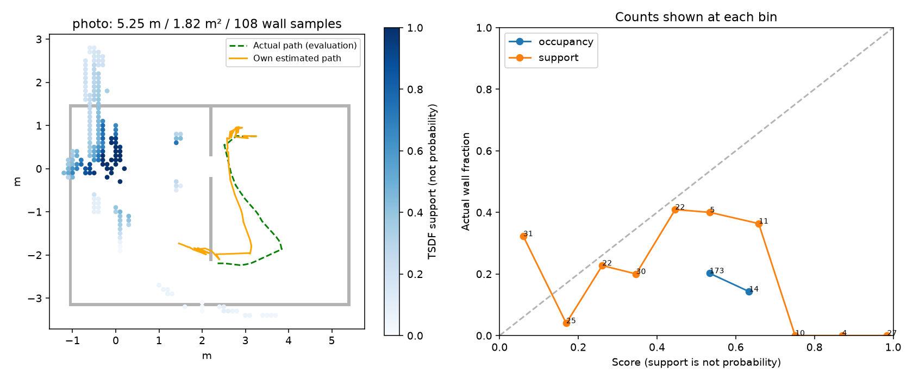
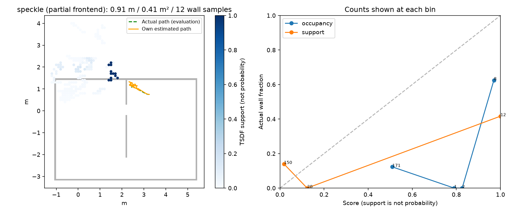

# egomap22 — 자기 RGB 폐루프 frontier / active SLAM (관문 0/2)

2026-10-07 사용자 결정: egomap21 고정 경로 0/2 이후 경로를 미리 작성하지 않는다.
PR #405 DRAFT. PR #409 CI 수리는 별도 worktree/커밋 `ed2fa0e9`이며 탐색 결과와 합산하지 않는다.
이 문서는 구현 및 신규 물리 실행 전에 커밋한다. 구 경로 자료는 개발 근거이며 확증 자료가 아니다.

## 고정 구성·입력

- `active_mapping=frontier_rbpf_v1`, `active_loop=information_gain_v1` (각 기본 off).
- PR #409 `ed2fa0e9`의 public_ros_v8 / NavFn / explore_lite / collision monitor를 원본 그대로 복사하고 SHA를 보존한다.
- r3 자기 RGB, K/D, 자기 서보/이동 명령만 입력. 출발 자세는 자기 (0,0,0).
  정적 지도·목적지 위치·시뮬 관절/pose·접촉은 정책 입력 금지. 평가는 별도 파일에만 기록한다.
- RBPF100 + positive_depth + own_submap + switchable_v1 + inverse_sensor_v1 + tsdf_weight_v1 + s2_pulse_v122.
  기존 detector/FK/모션 계수/graph/신뢰도 문턱은 바꾸지 않는다. TSDF support는 정답 벽 확률이 아니다.
- 전역 graph는 10 SIM s마다 정지 중 갱신. map→odom 변환을 따로 두며 DR/입자를 정답으로 보정하지 않는다.
- 좁은 FOV: 자기 RGB의 기존 벽 접점/바닥 색 마스크를 투영하고 v8 Bresenham free ray + footprint clearing.
  끝없는 미관측 공간을 free로 만들지 않는다. B는 고정 floor_color_v3 규칙을 새 명령 FK에 연결한다.
- 연속 NavFn 추종 속도는 v122의 유효한 단축 펄스로 양자화한다. 매 펄스 후 새 RGB로 다시 판단한다.
  모션 재적합 금지. 관측 대기에는 0 명령. dev_light 보수적 경고는 기록, 실제 벽 접촉/기울기/실행 오류는 종료.

## 표준 방법과 필요한 변경

[Stachniss/Grisetti/Burgard RSS2005](https://www.roboticsproceedings.org/rss01/p09.pdf)의
RBPF 지도·궤적 entropy 감소와 이동 비용을 비교한다. 후보는 frontier 경로와 과거 위치 재방문 경로다.
가중치로 입자 하나를 뽑아 자기 지도에서 가상 관측을 만들고 RBPF 복사본에 넣는다.
미관측 ray의 기대 map entropy 감소는 새 칸 수로 근사한다. 자세 entropy는 방문 장소별 평균이다.
효용은 정보 이득 − α × 경로 비용이다. 실제 로봇/지도는 가상 관측으로 갱신하지 않는다.
필요 변경: lidar 대신 카메라 FOV 54.5°/4 m, 후보 frontier 최대 2 + 재방문 최대 2,
가상 관측 간격 0.5 m, 결정 주기 10 s, α=0.35 고정. 불확실성 σXY≥0.15 m 또는 σyaw≥5°일 때 재방문 후보를 추가한다.
원 논문에 없는 계산 예산/카메라 제한값이며 이번 결과로 재튜닝하지 않는다.

## 옵션 (기본은 기존 동작)

| 옵션 | on | off |
|---|---|---|
| active_mapping | frontier_rbpf_v1 | 기존 실행 경로 |
| active_loop | information_gain_v1 | v8 frontier 선택 그대로 |
| wall_texture | photo_v1 / speckle_v1 | 기존 장면 문자열 그대로 |
| camera_pose | look_ahead_v1 | 기존 SEARCH/보정 유지 |

photo_v1은 ambientCG [PaintedPlaster017](https://ambientcg.com/view?id=PaintedPlaster017)
Surface Photogrammetry 컬러 사진, [CC0](https://docs.ambientcg.com/license/). 절차 생성 재질과 구분한다.
speckle_v1은 DIC 비반복·등방·대비 원칙의 고정 seed 다중 크기 점무늬다.
실물 벽은 아직 없으며 인쇄 가능 재질을 사용자가 선택하도록 허용했다. 실물 재현 확인 주장이 아니다.
look_ahead_v1은 마운트/FOV 변경 없이 손목 명령만 바꿔 명령 FK pitch −7.5°를 목표로 한다.
real_v1 강성에서 실제 pitch 오차는 평가 전용으로 재측정한다. S2 파일/보정표는 수정하지 않는다.

## 실행 순서·예산 (결과 전 고정)

1. 이 사전 등록을 관련 골든 시험 통과 후 커밋.
2. 원본 이식/own-only/기본 off bytes/entropy 선택/좌표·펄스 어댑터 오프라인 시험.
3. 소스 커밋·push 후 agent_lock null일 때만 정적 자세 8 SIM s 1회: SEARCH→look_ahead.
4. 정착 마지막 1 s의 look_ahead 절대 pitch 오차 중앙 ≤0.3°, p95 ≤0.5°이면 DEV 2건.
   실패하면 물리를 추가하지 않고 기록. `photo` seed22001 / `speckle` seed22002,
   각 180 SIM s, r3 시작 (3.25,0.75,π)는 setup 전용. 둘 다 look_ahead + active_loop on.
   경로·벽/문 목적점은 지정하지 않는다. 재질/seed가 달라 우열 비교나 통계 확증으로 합산하지 않는다.
5. 각 실행은 ugrp_session + 표준 workflow, 락 하나, freeze/모델 호출 없음.
   로컬 예상 wall 예산 최대 30분/건(초과 시 HOST_BUDGET으로 기록); raw 예상 500 MiB/건 이하.
   ENOSPC는 HOST_ERROR. 다른 프로세스 종료/우선순위 변경 금지.

## 판정·분모 (사전 고정)

- 회귀 관문: 기본 off JSON/XML bytes 동일, GT/peer 입력 거부, 원본 v8 파일 해시 일치.
- 물리 DEV 통합 관문: 180 s 예산 종료 또는 자기 B 확인 후 도착, 벽 접촉 0,
  잘못된 문 통과 시도 0, 실제 주행 거리 ≥3 m, 실제 footprint union 면적 ≥0.75 m²,
  평가상 관측 가능 벽 표본 ≥50개(벽 표본 0.1 m 간격).
- 지도: 기존 전체 벽 P/R/덮임/RMSE + 실제 지나간 경로에서 카메라에 가시였던 벽 recall,
  해당 범위 map precision 및 분자/분모, 가시 벽 길이·전체 비율을 별도로 보고.
  영역 P≥0.70, R≥0.50, 벽 RMSE≤0.15 m, 경로 RMSE≤0.25 m를 모두 충족해야 통합 통과.
  기존 §17·§19 기준은 변경하지 않고 별도 보존한다. 새 DEV 기준으로 과거 통과를 재명명하지 않는다.
- B 첫 확인·GT 실제 도착은 구분. B 미도달도 기록하되 180 s 탐색 완주와 같지 않다.
  접촉은 GT 평가 전용, 잘못된 문은 선택 경로가 GT 벽/너비에 막힌 횟수(연속 같은 시도 1건).
- ECE는 기존 occupancy의 진단값만, TSDF는 support-score calibration gap 명시.
  작은 표본은 판정 미달: P만 높아도 통과하지 않는다. 결과 후 문턱 수정/재실행 튜닝 없음.

## 상태

아래 사전 등록은 실행 전에 고정했다. 구현·오프라인·DEV 결과는 마지막 절에 별도로 기록한다.
TensorBoard 변환은 사용자 앞선 생략 지시 유지.
raw: `/Users/changmin/projects/ugrp/outputs/active-wall-map-v1/`.

## 구현 전/오프라인 검증 기록

사전 등록 `85bc483d`(기존 pulse/강성 8시험 통과). 새3파일 21시험 통과: off bytes,
94파일 원본 일치, FK 축, 유효 펄스/정지, 정보예측 복사본 격리, own-only, NavFn frontier 연결.
첫 시험의 Python proxy deepcopy 재귀와 DoorMemory 인자 누락2개는 오프라인에서 수정했다.
RGB 기존 SEARCH 영상1장을4시점 반복한 API smoke는 graph2회·information2회를 실행했다.
이 smoke는 프레임 합성 시점/비실행 명령이라 새로운 탐색/지도 품질 근거가 아니다(`offline-acceptance.json`).

[출처와 명시적 어댑터 차이](REFERENCES.md), [인쇄 자료 전체 해시](prints.json).
두 재질24면씩과 미터 단위 배치표는 raw `prints/`에 보관(사진1.60MB, speckle3.88MB).
일반 로컬 실행 환경을 재사용하며 새 라이브러리/venv 없음. C++ 바이너리는 소스 해시로 로컬 빌드.

## 정적 카메라 관문

물리 소스 `f346fa4e`, 8 SIM s/41프레임. SEARCH pitch 오차 중앙0.11887°, P95 0.11888°(5표본),
look_ahead 중앙0.12562°, P95 0.12563°(6표본): 사전0.3°/0.5° **통과**.
`results/static.json`; 실제 값은 평가에만 썼으며 FK/모션/문턱 fitting0.
최초 CLI에 짧은 SHA를 전달해 source admission이 거부됐다(물리/잠금 시작 전).
원본 기록을 보존하고 전체 SHA로 재입장했다. 정적 실행1회, 모델/freeze0, 자기 lock 해제 확인.
이후 탐색2건은 같은 코드/옵션을 유지한다.

## DEV 결과 — 튜닝·추가 물리 없이 종료

두 취득 소스 `bd0a30c554fbc59165995e162f7e23eb5c6dc7e4`, 구현 `f346fa4e`,
사전 등록 `85bc483d`. agent_lock null 확인 후 static→photo→speckle 순서로 한 번씩 실행했다.
모델/freeze/원격 계산0. 명령·영상마다 frontier 재계획을 했으며 GT waypoint는 제공하지 않았다.
**통합 관문 0/2, B 실제 도착 0/2.** 재질·seed·종료 조건이 달라 조건 우열이나 합산 성능을 주장하지 않는다.

|조건 / 평가 view|취득 종료|RGB / 지도 삽입 프레임|실제 거리 m|footprint union m²|가시 벽 표본 / 전체|가시 길이 근사 m|
|---|---|---:|---:|---:|---:|---:|
|photo / 최종 graph|93.6 SIM s, 벽 접촉|469 / 103|5.248|1.823|108 / 329 (32.8%)|10.8|
|speckle / **부분 frontend**|150 SIM s에서 HOST_BUDGET|751 / 683|0.912|0.408|12 / 329 (3.6%)|1.2|

|조건|관측 범위 P|관측 범위 R|전체 지도 P|전체 R/덮임|벽 RMSE m|경로 RMSE / 종료 XY m|
|---|---:|---:|---:|---:|---:|---:|
|photo graph|1/34 = 2.94%|10/108 = 9.26%|37/187 = 19.79%|24/329 = 7.29%|.6786|.5533 / .9715 (459자세)|
|speckle **부분 frontend**|평가 셀0, **측정 불가**|0/12 = 0%|26/182 = 14.29%|17/329 = 5.17%|.9130|.1440 / .1300 (740자세)|

가시 범위는 **실제 지나간 경로의 실제 카메라 FOV·4m·벽 가림**으로만 평가했다.
물체/자기 차체 가림은 포함하지 않아 잠재 가시 범위이며, 전체 관측 가능성을 보증하지 않는다.
P의 영역 판정은 지도 셀 중심에 같은 가시 검사를 하므로 벽 경계 바깥/뒤로 밀린 셀은 제외될 수 있다.
따라서 전체 지도 P/R도 항상 같이 표시했다. 지표 정의·.15m 문턱은 결과 뒤 바꾸지 않았다.
speckle의 작은 주행 범위/12표본/0개 영역 지도 셀은 **작은 경로 오차로 성공을 주장할 수 없는 실패**다.

|조건|자기 B 첫 확인 (시작 후)|GT B 도착|벽 접촉|잘못된 문 시도 / 명시 문 선택 노출|점유 ECE 진단|TSDF support 간극(비확률)|
|---|---:|---|---:|---|---:|---:|
|photo|14.0 s|없음|1|0 / 0 (통과 성능 미검증)|.3430|.3145|
|speckle 부분|없음|없음|0|0 / 0 (통과 성능 미검증)|.3920|.1525|

photo에서 자기 B 확인이 나타났어도 GT 도착은 없었다. 추정 목적지를 향한 경로 상태가
383프레임(`public_static`)이며 이 이름은 **자기 관측 B 후보를 v8 goal API에 전달한 상태**이지
정답 B/정적 지도 사용을 뜻하지 않는다. 문 후보는 photo 1,544개 행/421프레임,
speckle 1개 행/1프레임이지만 clearance_feasible은 둘 다0이다. 0회 오통과를 안전한 문 통과 증거로 삼지 않는다.

### 능동 재정합·실패 분해

|조건|정보이득 결정|재방문 조건 발동 / 도착|3σ 초과 자세|최대 σXY m|완료 graph의 수락 loop|
|---|---:|---:|---:|---:|---:|
|photo|9 (frontier9)|0 / 0|406/459|.1247|0|
|speckle 부분|14 (frontier2, 후보없음12)|0 / 0|599/740|.1147|0 (마지막 완료 checkpoint)|

위치 불확실성이 실제 오차보다 작게 추정되어 사전 .15m/5° 재방문 조건이 발동하지 않았다.
따라서 **RSS2005 재방문 선택 기능은 구현했으나 이번 DEV에서 실제 loop closing 효과는 검증되지 않았다.**
문턱·공분산·모션을 결과에 맞춰 변경하지 않았다. switchable 제약도 신규 수락 loop가 없어 효과 비교가 아니다.
speckle의 마지막 완료 graph는 t=141.3(시작 후140s), 완료 checkpoint13개,
unobservable23,240 / ambiguous_modes9,294 / low_probability1,792 등으로 거부했다
([checkpoint](results/speckle-last-checkpoint.json)). 반복 정지 관측은 독립 표본이 아니다.

|접점 사후 진단 (평가 전용)|GT 차체+명령 FK P / RMSE|실제 카메라로 같은 ray 투영 P / RMSE|표본|실행 중 pitch 절대 오차 중앙 / P95|
|---|---:|---:|---:|---:|
|photo|3.67% / 1.014m|4.54% / 1.049m|2,998점|.1269° / .1278°|
|speckle|47.97% / .362m|45.15% / .352m|8,893점|.1256° / .1269°|

0.05m 이하 간격으로 같은 검출 선분을 표본화해 GT 벽 .15m 이내인지 평가했다.
실제 카메라를 대입해도 photo 오차가 남아 **새 재질+look_ahead 조건의 접점 관측을 검증해야 한다**.
이 진단은 검출·연결·평면 투영 중 정확한 실패 단계를 독립 라벨로 특정한 것은 아니다.
look_ahead의 pitch는 정적 관문뿐 아니라 취득 중에도 작았으므로 pitch만 다시 튜닝하지 않는다.
GT는 이 사후 진단에서만 사용했고 입력/문턱/제어를 바꾸지 않았다.

### 시간 예산 종료와 원시 보존

speckle은22초에 첫 frontier 소진 상태를 기록했고, `exploration_finished`는 총580프레임이었다.
정지 중에도 scan/graph 후보를 계속 쌓아 batch scan-to-submap 재계산이 커졌다.
실행 루프 밖으로 돌아와야 하는 wall 예산 검사가 t=151.3의 graph 안에서 지연됐다.
wall1818.7s에 **자기 driver PID7646만 SIGINT**: backend 종료 후 frontend/grid/ledger/poses/
decisions/navigation/이전 graph13개를 저장했다. finally가 최종 graph를 다시 계산해 두 번째 SIGINT로 종료했다.
workflow `process_failed`, session 종료·잠금 null을 확인했다. 다른 프로세스는 건드리지 않았다.
**새 물리 재실행·시간 예산 연장·최종 graph 성공 간주 없음.** 이 구현은 실시간 실행 적합성을 확보하지 못했다.

`code/preserve_partial.py`는 저장된 own frontend를 해시 봉인하고 TSDF 지원량만 복원한다.
정합·graph optimizer·GT를 실행하지 않으며 `speckle-partial/`에 별도 저장한다.
마지막 중단 프레임 pose1개는 GT 샘플 기록 전이어서 경로 채점에서 제외(740/741).
이 부분 frontend 지도를 최종 graph와 같은 결과로 취급하지 않는다. 기존 raw 파일을 덮어쓰지 않았다.

두 그림의 회색은 GT 벽, 파랑 진하기는 TSDF 지원량(벽 확률 아님), 초록은 실제 경로,
주황은 자기 추정 경로다. 작은/옅은 거짓 셀도 지표에서 제외하지 않았다.
egomap21 정방향 on P/R28.10/26.14%, 경로RMSE.1974m; 역방향21.93/66.87%,1.1184m는
[기존 고정 경로 실패](../2026-10-07-robust-wall-map/README.md)로만 남긴다. 재질/시야/경로/범위가 달라 증감 비교를 하지 않는다.

### 검증·CI·재현

- PR409 별도 worktree: `ed2fa0e9`, 관련32시험 및 [CI 전체 통과](https://github.com/cmkang131/UGRP-Multi-Robot-Collaboration-Project/actions/runs/37619696940).
  역사적 self-wall manifest 시험만 보존 fixture를 보도록 고쳤고 런타임/등록 hash는 그대로다.
- PR405 새 구현21시험 통과 후 취득. 결과 정리 중 새/기존5개 workflow의 읽기 전용 계획 시험
  인자 누락을 추가했고 workflow/active-map/texture **27시험 통과**. 실행 소스는 변경하지 않았다.
- PR405 [전체 CI는 실패](https://github.com/cmkang131/UGRP-Multi-Robot-Collaboration-Project/actions/runs/37621976384).
  위 계획 fixture 누락 외에 VIS3/옛 번들 hash·공용 import 충돌 등이 남아 있다.
  VIS3 markerless hash는 이번 작업 전부터 동일한7b6223f…이고 `ba5bd8d8`에서 등록015df71…과 갈라졌다.
  오래된 등록을 새 코드 hash로 덮어 통과시키지 않았다. **전체 CI 녹색/병합 가능 주장 없음**
  ([분리 감사](results/ci-audit.json)); PR405/409는 모두 DRAFT다.
- 기본 off 동작/기존29개 동결 파일과 PR409 원본94개 파일을 검증했다. 사용자 미추적4파일 보존.
  `code/score.py photo`, `code/score.py speckle --partial`, `code/diagnose.py <case> [--partial]`로
  봉인 후 평가만 재현한다. `preserve_partial.py`는 이미 만든 경로를 덮어쓰지 않도록 재실행을 거부한다.
- raw [manifest](results/raw-manifest.json): 1,411파일/323,349,777bytes, 로컬 `outputs/active-wall-map-v1/`.
  코드·작은 결과·그림만 Git으로 보존하며 raw를 원격 백업했다고 표현하지 않는다. Drive/TensorBoard 변환 없음.

다음 수정은 제안만 남긴다: 새 시야의 접점 라벨 검사, RBPF 불확실성 과소추정 감사,
정지 중 중복 scan과 batch graph 계산 예산의 표준 keyframe/incremental 처리 검토.
이번 결과로 detector/임계값/모션을 다시 맞추거나 물리를 추가하지 않았다.
