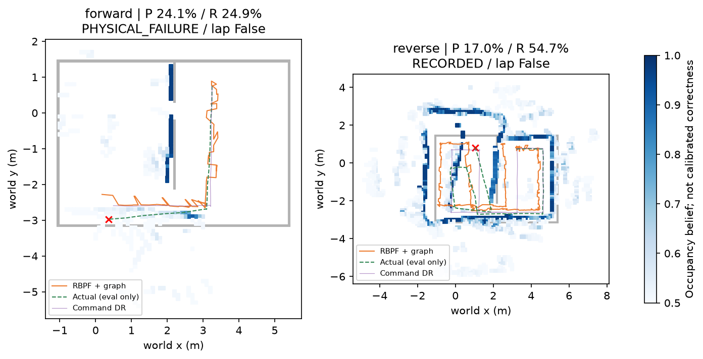
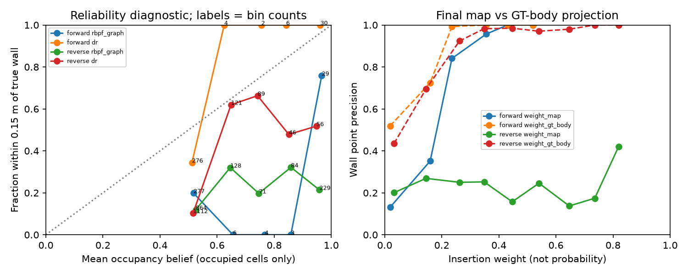

# egomap20 — 고정 바닥 투영으로 경기장 순회 지도 (사전 등록)

2026-10-07 사용자 요청, 시작 `cf9ed086`. egomap19 통과한 바닥 투영 경로를 고정한다.
`servo_stiffness=real_v1`, `wall_texture=tape_v1`, 원 v3 무하중 보정표,
`motion_model=s2_pulse_v122`, `odom_grid_v1`, `own_map_rbpf_v1`100,
`positive_depth_v1`, `own_submap_v1`, `inverse_sensor_v1`. 모두 기존 기본 off 보존.
시차는 주석 recall0으로 보류. detector/보정/강성/모션/정합/공분산/격자 문턱 재튜닝0.

## 취득 계획 — 결과 열람 전에 고정

- 두 녹화 각180 SIM초(+reset≤5초), seed20101/20102, 같은 v7 mesh/camera v3/SEARCH 자세.
  spawn=[3.25,.75,pi]. 고정 장면은 egomap19와 같다. 정적 지도는 **취득 경로 설계용 도면**으로만
  참조하고 제어기/자기 지도에 넣지 않는다. raw 제어 입력은 자기 RGB·발행 명령뿐, 실제 pose/관절/접촉
  등 GT는 평가/물리 실패 abort에만. 다른 로봇 지도·freeze·모델 호출0.
- 명령 경로는 자기 출발 좌표로 아래 순회1개와 그 역순. 설명용 도면 좌표 waypoint:
  시작(3.25,.75) → (3.25,−2.60) → (−.30,−2.60) → (−.30,.65) → (1.30,.65)
  → (1.30,−2.60) → (4.60,−2.60) → (4.60,.75) → 시작.
  중앙 북쪽 벽이 외곽과 붙어 있어 한 외곽 사각형은 통과 불가다. 폭1m 남쪽 통로로 두 구역을
  각각 순회하고 같은 통로를 두 번 지난다. 좁은 .5m 문은 이 취득 경로에 쓰지 않는다.
- 이동 구간은 해당 벽을 바라보며 옆이동: 중앙/서쪽/동쪽 세로 구간은 그 벽 방향,
  위쪽 수평은 북쪽, 아래쪽 수평은 남쪽. 끝점에서 다음 구간 방향을 향해 회전.
  시작 후2초 정착. 고정 v122의 지원 pulse만으로 경로를 사전 계산하고 명령표/hash를
  실행 전에 commit/push한다. 실행 중 좌표를 읽어 궤적을 보정하지 않는다.
  명령 기반 종점 허용오차≤.10m, 이동 중 heading 허용오차≤3°를 사용한다.
  모델상 전체 경로가180초 내 안 끝나면 **취득 전** 일정 한계로 기록하고 실행하지 않는다.
  실제 한 바퀴 완주 여부는 GT로 사후 waypoint 접근≤.35m/순서 및 경로 그림을 평가한다.
  물리 접촉/기울기/실행 실패는 기존 abort 그대로, 보수적 불확실성은 기록만. 실패한 물리를
  재시작하거나 설정을 맞춰 재튜닝하지 않는다. 두 번째도 같은 원인이면 중단한다.
- PR409 `a43afb7550795411f95412d200247b3cba8530ec`의 public_ros_v8을 읽기 전용 검토.
  actor.receive는 floor_xy/wall_xy와 B patch, command는 연속 twist→명령을 요구한다.
  이번 v122는 제한된 고정 pulse만 지원하므로 그대로 꽂으면 미지원 명령이다. 새 관측/제어
  어댑터 검증을 생략해 public_ros_v8 실행으로 부르지 않고 **사전 명령 취득**으로 구분한다.
  PR409 파일은 수정/병합하지 않는다. 자율 frontier 성공 주장은 하지 않는다.

## 평가와 조건부 F 내보내기

- RGB10Hz 저장, 기존5Hz 자기 접점·4m/정착/양의깊이 조건. 예측을 먼저 저장·해시 봉인하고
  GT/정답벽을 나중에 읽는다. 지도 GT 정렬은 출발 SE(2) 한 번, ICP/프레임별 보정0.
- 각 녹화 별도: 점유 P(.15m), 전체 벽 표본 recall=덮임(기존 .1m 벽 표본), 벽 RMSE,
  경로 median/P90/P95/RMSE/종료XY/yaw, scan 갱신·루프 수락/거부 이유, 시간별 덮임.
  실제 가시 벽 분모 recall은 기존 가시성 도구가 새 녹화에 적용될 때 추가한다.
- 신뢰도 곡선은 (a) 최종 점유 sigmoid(log-odds) 10등간 bin vs 실제 벽 .15m 정답 비율,
  (b) 삽입 weight 10등간 bin vs 해당 관측의 벽점 정답 비율을 분리한다.
  Brier/ECE는 점유 셀의 조건부 진단만, weight는 확률로 부르지 않는다. 빈 bin은 NA.
  그래프에 GT회색/지도신뢰도음영/추정·실제 경로, 녹화별 지표·분모를 함께 표시한다.
- 기존 강성 off s1042–s1047의 egomap9 RBPF100+v3+confidence+graph 결과 및 egomap19 짧은
  지도와 같은 표에 넣되 **장면/길이/명령/모션 모델/정착 표본이 다르므로 인과 비교/합산 금지**.
  강성 off 물리를 새로 돌리지 않는다. 새 녹화의 동일 관측 v122 DR 지도를 평가 기준선으로
  추가해 §17/§19 상대 기준도 그대로 보고한다(종료≤.75m/30% 개선, 경로RMSE20% 개선,
  median/P95 비증가, 지도P 비감소/R 하락≤2%p/벽RMSE20% 개선). 기존 성공을 승계하지 않는다.
- 사용자 조건 '결과가 좋으면'은 **각 완주 녹화에서 P≥.90, 전체R≥.70, 벽RMSE≤.15m,
  경로RMSE≤.25m 및 위 상대 기준**으로 미리 정한다. 모두 충족할 때만
  `wall_export=segments_confidence_v1`(기본off) 자기 벽 선분+신뢰도+출처+좌표계 함수 추가.
  DESIGN §8/§9 F에 따른 자기 LLM 입력용이며 상대에게 배열 전송/지도 merge/모델 호출0.
  미달이면 F 함수는 구현하지 않고 실패 원인을 기록한다. 결과 후 문턱 변경0.

## 실행·검증·보존

물리2건,≤370 SIM초·raw≤350MiB·wall 예산20분, 오프라인 재생 wall예산30분/건
(속도 비교 아님). agent_lock status null→ownPID acquire, ugrp_session+sim_cli 관리
workflow, nice0/NO_BG_NICE, 한 번에 하나, freeze0. ENOSPC=HOST_ERROR, 원본 보존.
초기 free42.65GiB, project52.48/58GiB. raw는
`/Users/changmin/projects/ugrp/outputs/arena-wall-map-v1/`. 실험 Git 미디어≤1MiB/파일,
총≤5MiB. 새 의존성/venv0. 변경 시험1–3파일/off 골든 통과 후 commit/push.
PR405 DRAFT·병합/force/reset0, #406/#409/다른 worktree 수정0. 기존 미추적4파일 보존.
TensorBoard 생략 지시 유지, Drive 사용0. raw 로컬 보존과 Git 원격 보존을 구분한다.

## 출처·재사용

- [egomap19](../2026-10-07-servo-stiffness/README.md), [공식 제조사/MuJoCo/v122 출처](../2026-10-07-servo-stiffness/REFERENCES.md).
- [PR409 v8 actor](https://github.com/cmkang131/UGRP-Multi-Robot-Collaboration-Project/blob/a43afb7550795411f95412d200247b3cba8530ec/harness/public_navigation_monitor.py),
  [자기 관측 인터페이스](https://github.com/cmkang131/UGRP-Multi-Robot-Collaboration-Project/blob/a43afb7550795411f95412d200247b3cba8530ec/harness/public_navigation/actor.py).
  이 코드와 명령 어휘를 실제 대조했으며 새 복사/라이선스 의존성은 없다.
- [Coulter 1992 원문 안내](https://publications.ri.cmu.edu/implementation-of-the-pure-pursuit-path-tracking-algorithm):
  실제 추종은 pose feedback이 필요하다. 이번 고정 명령 취득을 pure-pursuit/publicROS의
  실제 관측 폐루프 실행으로 부르지 않는다. 경로는 calibrated SE(2) pulse rollout으로 작성한다.

### 취득 전 명령 봉인

관련3파일10시험 통과. 정방향261 pulse/143.8초, 역방향282 pulse/149.2초에 명령 기반
8개 waypoint 도달, 각180초 종료까지 정지 관측한다. [정방향](forward-plan.json)·[역방향](reverse-plan.json).
도면 대비 명령 예측 경로 중심의 벽 최소거리 .463/.475m, 취득 설계용 보수적 원반반경
.32m를 뺀 여유 .143/.155m([기하 점검](results/planned-clearance.json)). 실제 충돌/완주의 보증은 아니다.
워크플로 `arena-wall-map`1.0.0, 번들 `egomap20-arena-tour-v1`; 기존 egomap19는 변경하지 않는다.

### 취득 종료·예측 전 기록

취득 소스 `7d109118`, 정방향은35.9초 경과(360RGB)에 WALL_CONTACT로 물리 중단,
역방향은180초(1801RGB) 정상 종료. 명령/옵션 변경·재시작0. 실제 순회 여부는 아직
GT 채점하지 않았으며, 두 자료를 같은 동결 추정기로 먼저 봉인한 후 평가한다.
관련 재생/집계 시험2파일7개 통과. 추정은 egomap19 `map_short.predict`를 그대로 호출하며,
새 어댑터는 episode/output 경로만 바꾸고 같은 RGB 접점의 v122 DR 기준선을 별도로 저장한다.
신뢰도 bin 정의는 [scikit-learn reliability diagram 공식 설명](https://scikit-learn.org/stable/modules/calibration.html)
(평균 예측값 대 실제 양성 비율)을 따른다. fitting/설치0, Brier를 순수 보정 오차로 해석하지 않는다.

## 최종 결과 — 전체 지도/완주 관문 실패, 추가 취득·튜닝 없음

사전 등록 `f319ebfe` → 명령/물리 소스 `7d109118` → 재생/평가 `2655763c`.
두 예측과 DR 기준선을 봉인한 뒤에만 GT를 읽었다. 정방향35.9초(360RGB,6.217m)는
남쪽 벽 `zone_wall_south`와 오른쪽 손가락 `r3__right_finger` 접촉으로 중단했다.
역방향180초(1801RGB,19.745m)는 물리 접촉 없이 종료했지만, 순서대로8개 waypoint에
접근하는 사전 기준은4개까지만 만족하고 출발점과2.209m 떨어져 끝났다. **완주0/2**다.
역방향의 'RECORDED'는 시간 종료이며 한 바퀴 성공을 뜻하지 않는다.

### 강성 off 과거 결과와 같은 표 (조건이 달라 인과 비교/합산 금지)

P는 점유 셀에서 실제 벽까지 .15m 이내 비율, R=전체 벽 표본 덮임이다.
역방향 RBPF+graph R54.7%는180/329개 표본, P17.0%는234/1376개 셀이다.
옛 s1042–1047은 M1·운반·다른 관측시간/장면이고 이번은 v122·무늬·순회다.
특히 옛 장면은 중앙 아래 벽이 y=−3.15까지 닫혀 있고 새 장면은 y=−2.125까지여서
남쪽1m 통로가 열려 있다. 그래서 같은 .1m 표본 함수의 분모도 **349 대329**다.
[원 장면 기하·해시](results/geometry-comparison.json)를 기록했고 기존 숫자를 재작성하지 않았다.

|녹화·강성|추정|P %|전체 R/덮임 % (분모)|벽 RMSE m|자세 RMSE m|종료 XY m|
|---|---|---:|---:|---:|---:|---:|
|s1042 · off / old transport|M1 + RBPF100 + graph + confidence|19.5|23.5 (349)|1.100|2.414|3.317|
|s1043 · off / old transport|M1 + RBPF100 + graph + confidence|8.5|3.2 (349)|0.769|1.938|2.579|
|s1044 · off / old transport|M1 + RBPF100 + graph + confidence|8.9|6.0 (349)|1.028|1.993|3.093|
|s1045 · off / old transport|M1 + RBPF100 + graph + confidence|8.4|8.3 (349)|1.809|2.934|2.139|
|s1046 · off / old transport|M1 + RBPF100 + graph + confidence|3.8|1.4 (349)|1.102|2.590|1.789|
|s1047 · off / old transport|M1 + RBPF100 + graph + confidence|13.4|10.0 (349)|0.575|1.632|1.070|
|egomap19 30s · real_v1 / short route|v122 + RBPF100 + graph + confidence|62.5|8.2 (329)|0.482|0.131|0.137|
|egomap20 forward · real_v1 / tour|dr|43.1|32.8 (329)|0.859|0.181|0.402|
|egomap20 forward · real_v1 / tour|rbpf_graph|24.1|24.9 (329)|0.765|0.246|0.718|
|egomap20 reverse · real_v1 / tour|dr|21.1|72.3 (329)|1.295|1.199|2.213|
|egomap20 reverse · real_v1 / tour|rbpf_graph|17.0|54.7 (329)|1.323|0.949|1.450|

§17/§19 상대 기준은 새 녹화의 동일 RGB/접점 v122 DR 기준선과 비교했다.
정방향0/7, 역방향2/7(경로P95·RMSE만) 통과, 전체 성공0/2.
역방향은 DR 대비 경로 RMSE1.199→.949m로20.9% 낮지만 지도 P21.1→17.0%,
R72.3→54.7%, 벽RMSE1.295→1.323m로 악화됐다. 종료오차1.450m도 한도 .75m 초과다.
새 비교는 추정기/신뢰도 가중을 고정한 DEV이며 본 연구의 새 확증 성능이 아니다.
[전체 수치·분포·시간별 덮임](results/comparison.json),
[정방향 판정](results/forward.json), [역방향 판정](results/reverse.json).

### 남은 오류의 수치 근거 (사후 평가만, 제어/재적합 금지)

- 정방향 접촉 때 실제 중심 (0.364,−2.973), 명령 DR (0.496,−2.593).
  명령 도면상 안전 여유가 있어도 횡오차가 누적돼 실제 손가락이 남쪽 벽에 닿았다.
- 양의 회전 `.35/.10s`의 v122 예측5.369°에 비해 실제 중앙은 정방향5.959°(n19),
  역방향4.631°(n75). 음의 회전 예측−5.935° vs 역방향 중앙−5.817°(n69).
  각 명령 시작부터 .2s까지의 GT 차분이다. 방향·순서·연속 구동·새 plant가 함께 다르므로
  강성만의 인과 효과로 단정하지 않는다. 단순 옆이동 관문을 반복 회전에 일반화할 수 없었다.
- graph 루프 수락 정방향1/역방향17. 수락 제약의 GT 상대 변환 대비 XY 오차는
  .924m / .426–1.572m다. 거짓 정합에 취약한 증거이며 GT를 거부기에 넣지는 않았다.
  역방향 graph 전→후 P22.1→17.0%, R67.5→54.7%, 벽RMSE1.268→1.323m;
  반면 경로RMSE1.161→.949m였다. 위치 평균 개선과 지도 정확도 개선이 일치하지 않았다.
- loop 후보76,648쌍에서 동일 submap/시간 인접 제외5,714. 수락17, 나머지70,917은
  낮은 점유우도55,807·탐색경계5,566·점 부족3,492·다봉성3,413·관측축 부족1,919·
  큰 잔차401·후보반경 밖209·낮은 겹침88·refinement 실패22다.
  [모든 사유·pulse 응답·graph 전후·접촉](results/posthoc-diagnostics.json).

### 지도와 신뢰도 보정 진단

출발 GT 정렬만 사용. 빨간 X는 실제 종료점이며 회색 벽 밖의 거짓 셀도 숨기지 않았다.
이 그림은 완성된 경기장 지도가 아니라 **실패한 장거리 지도 시도**다.

역방향 최종 점유 셀의 ECE .4702/Brier .3738(정방향 .3259/.2733).
특히 .9–1.0 bin229셀은 평균 믿음 .9585지만 실제 벽 비율 **49/229=21.4%**다.
log-odds가 높다고 정확한 벽일 확률로 보장되지 않는다. 보정 함수를 fitting하지 않았다.

관측 weight별 평가에서 같은 선분 표본을 GT 차체에 놓으면 정방향70.98%·역방향78.78%,
최종 추정 자세에 놓으면42.67%·22.17%가 벽 .15m 이내다(표본3,370/22,851).
이는 **점 표본의 비율**이며 oracle 지도 precision이 아니다. 선분 안/시간 간 표본은 상관돼
독립 시행으로 세지 않는다. 역방향 weight .8–.9 bin의81점은 GT 투영100%·추정 지도42.0%다.
거리/투영 오류도 남지만 자세/정합으로 정확한 점까지 잘못 배치하는 문제가 확인된다.
[정방향 bin](results/forward-calibration.json)·[역방향 bin](results/reverse-calibration.json).

기존 가시성 평가는 프레임 전체 qpos가 필요하고 새 녹화는 이를 저장하지 않았으므로
동적 물체/타 로봇까지 포함한 실제 가시 분모 R은 추가하지 않는다. 전체 R은 위 표 그대로다.

### F 내보내기와 종료

'좋은 결과' 조건과 완주 기준 미달이므로 `wall_export=segments_confidence_v1` 함수를
**추가하지 않았다**. LLM 호출·로봇 간 지도/배열 전송0, 기존 자기 메모리 문구는 보존한다.
이번 등록한2건으로 종료한다. 회전 응답·폐루프 경로 추종·거짓 loop 억제의 추가 검증이
필요하지만 이번에는 경로/모션/정합/신뢰도 재튜닝이나 물리 재실행을 하지 않는다.

### 최종 검증·보존

관련3파일 **11시험 통과**. 새 명령표의 모든 pulse가 v122 지원 어휘이고 정답 반환값이
명령을 바꿀 수 없음을 검사했다. 기존 off XML/scene/메모리·DR bytes 검사는 그대로 통과.
신뢰도 bin/빈 bin/비유한 입력과 동결 경로 재생성도 검사했다. 전체 CI/실물 성공 주장은 아니다.

raw **2,251파일/123,673,168bytes**를 [해시 manifest](results/raw-manifest.json)에 기록했다.
[실행/관리 원장](results/execution.json)은 물리 실패도 포함하며 source/input 변경0,
동결29파일/기존 사용자 미추적4파일 동일. 모든 자기 session stopped·잠금 null·일회성 job 제거.
모델0·freeze0·새 의존성0·#406/#409/다른 worktree 수정0. raw는 로컬 보존으로 원격 백업이 아니다.
Git에는 소스·명령표·작은 결과·그림만 보존한다. PR405 DRAFT 유지, 병합하지 않는다.
