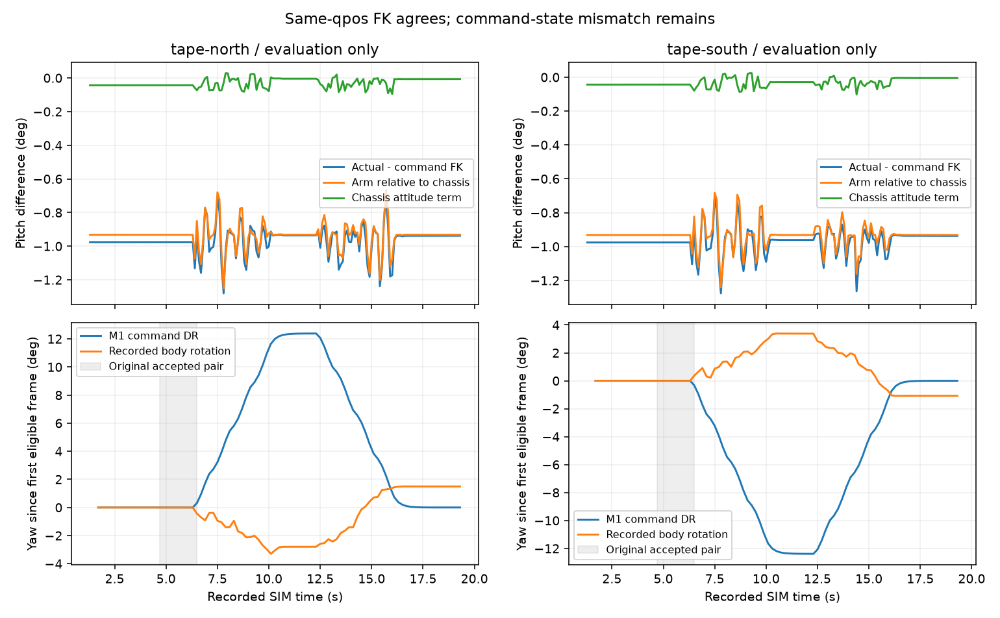

# egomap18 결과 — FK·좌표계는 일치, 명령각/운동모델의 상태 오차

**확인한 범위에서 FK 축·오프셋·카메라 frame·yaw 부호 버그는 발견되지 않았다.**
동일 qpos945조건의 최대 위치 차이는2.39e-16m, 회전행렬 차이는1.28e-15이다.
북/남 녹화의 약.95° pitch 불일치는 대부분 명령각과 실제 팔 자세 사이의 차이다.
정지 frame35에서 평가용 역산 관절의 중력 모멘트가 유한 kp position servo의 편차 토크와
1.46e-6N·m 이내로 상쇄된다. **시뮬/보정 파이프라인의 명령 목표→실제 상태 모델 문제**이며,
실물 마운트 실측 부족을 원인으로 돌리지 않는다.

수정할 규약 버그가 확인되지 않아 새 FK/부호 반전 옵션, 보정 계수 fit, print_v1,
바닥/시차 알고리즘 재튜닝은 추가하지 않았다. 기존 투영0/6·egomap17 회복0/2 판정을 유지한다.
관문을 통과한 새 후보가 없으므로 탐색 녹화·RBPF100+pose_graph 지도 재생·지도 그림 생성0이다.
아래 그림은 저장 프레임 진단이며 누적 지도 성능 그림이 아니다.

## 같은 qpos에서 링크별 대조

원 egomap16 북 녹화 `scene.xml`의 전체 모델을 읽고 `mj_kinematics` 뒤 `mj_camlight`만 호출했다.
21명령 자세×(기본+4관절±.05rad)×5차체 RPY=945조건, 범위 밖 제외0, dynamics/렌더0.
고정 transform·joint axis/anchor/reference는 원 scene과 전부 같다. 로봇 yaw를 변환에 더한 경우도 포함했다.

|링크|parent / 회전축|최대 위치 차이(m)|최대 회전행렬 차이|
|---|---|---:|---:|
|robot|world / free pose|0|4.44e-16|
|arm_base|robot / +Z|6.21e-17|6.66e-16|
|shoulder_link|arm_base / −Y|7.85e-17|7.77e-16|
|elbow_link|shoulder_link / −Y|1.27e-16|9.99e-16|
|wrist_link|elbow_link / −Y|1.88e-16|8.88e-16|
|gripper|wrist_link / fixed|1.88e-16|8.88e-16|
|camera, CV optical|gripper / fixed mount|2.39e-16|1.28e-15|

PWM→target 차이0rad. 원 driver는 `sim/masterpi_dynamics_v2.py:1134–1150`,
비교 FK는 `harness/servo_camera_fk.py:50–63`이다. servo6 중심1500은 driver 기본값과 같다.
`servo_fk_v1:79–92`의 parent transform→joint rotation→camera mount→optical 변환 순서가
MuJoCo와 일치했다. same-qpos 합격은 **실제 명령 추종/투영 관문 합격이 아니다**.
[링크별 수치](results/same-qpos.json), 전체945조건은 raw `retry-assets-restored/same-qpos.json`.

## 축·부호·변환 순서

|대조 경로|원 코드|결과|
|---|---|---|
|차체 +yaw 반시계|`masterpi_dynamics_v2.py:758` quaternion RPY vs body xmat의 atan2(R10,R00)|최대2.78e-17rad 차이|
|image u우/v아래, OpenCV +z앞|`servo_camera_fk.py:90–92`; MuJoCo camera는−z앞|오른쪽에 diag(1,−1,−1), 축 부호 일치|
|body→world→camera|`wall_parallax.py:21–45`의 Rz, `[R.T,-R.T*C]`, Rz.T 역변환|native camera 위치5.65e-17m·회전5.55e-16 이내|
|동일 고정점 DLT|바닥/높이.08m의18점, 서로 다른 두 실제 모델 카메라|최대3.51e-15m|
|바닥 ColumnModel|`markerless_probe.py:197–233`의 q0+t*d vs pinhole ray/바닥 교점|96열 단위시험1e-12m 이내|
|intrinsics|모델의 centered principalpixel→image 좌표 vs 기존 K|최대2.22e-5px(float32 저장 반올림)|

마지막 행의 작은 float 차이를0이라고 보고하지 않는다. ray/DLT 정확성 시험과 원 모델 K의
float32 표현 차이를 구분한다. 색·깊이·FOV·영상처리나 principal point를 변경하지 않았다.
실제 영상은 새 렌더하지 않았다. [상세](results/projection-conventions.json),
[공식 규약/서보 출처](REFERENCES.md).

## 녹화36,076프레임: 명령각은 실제 qpos가 아니다

s1045–1047·s1050–1051·북/남은 RGB 시각과 평가 카메라/차체 시각이 전부 exact join됐다.
frame의 `commanded_servo`와 port의 `servo_pulses`도 모두 같다(차이0); 둘 다 명령 기록이다.
**이 녹화에는 실제 arm qpos가 없다.** s1042–1044는 실제 카메라 로그도 없으므로 NA다.
S2의 gripper→camera 고정 mount 및 cached/from-body camera 일치는 최대1e-15 수준이다.
고정 마운트가 다른 위치에 붙거나 runtime이 다른 quaternion으로 덮는 현상은 없다.

|녹화|정합 frame|전체 actual−명령 FK pitch 중앙(°)|open 명령 / closed 명령(°)|전체 높이 차이(mm)|
|---|---:|---:|---:|---:|
|s1045|13,794|−2.672|−1.004 / −2.676|−6.011|
|s1046|6,500|−2.635|−.998 / −2.644|−6.010|
|s1047|5,101|−2.650|−.988 / −2.665|−6.057|
|s1050|5,117|−1.828|−.992 / −1.850|−3.131|
|s1051|5,202|−1.825|−.983 / −1.846|−3.131|
|tape-north|181|−.945|open만|−1.949|
|tape-south|181|−.961|open만|−1.954|

open/closed는 **집게 명령 구분**이며 정답 하중 판정이 아니다. 과거 egomap11의 무하중 보정표
대비−.87°와 여기의 명령 FK 대비 값을 합산하지 않는다. egomap11의 등록된 주석 분모도 그대로 보존한다.
전체/각 PWM별 원장은 raw에 있고 [압축 요약·원본 해시](results/recorded-frames.json)를 Git에 남겼다.

### 북/남에서 차체와 팔 분리, 중력 정적 편차 검산

북/남은 full body rotation도 있어 카메라를 실제 body 좌표로 옮겼다. 모델 mount를 고정하고
카메라 pose로 구한 **평가용 역기구학 각도**로 각 관절의 편차를 분리했다. 측정 encoder나 기록 qpos로
표기하지 않는다. 그 각도를 같은 모델의 qpos에 넣은362프레임 카메라 대조 최대는1.36e-15m/
2.89e-15행렬값이다. 실제 중간 링크 자세가 저장된 것은 아니므로 그 링크의 동적 실측 검증은 아니다.

|조건|팔 body-relative pitch 잔차 중앙(°)|차체 기울기 항 중앙(°)|어깨/팔꿈치/손목 역산 편차 중앙(°)|
|---|---:|---:|---|
|north|−.932104|−.033883|−.156859 / −.455583 / −.319648|
|south|−.932114|−.038510|−.156883 / −.455587 / −.319658|

각 항의 중앙값 합이 전체 중앙과 같을 필요는 없다. 차체 항은 프레임별 optical elevation 차이로
정의했으며 일반 Euler 각의 가산 근사를 쓰지 않았다. S2에는 full body rotation이 없어 같은 분리는 NA다.

정지 frame35(4.7s, 이동 전)의 model 질량·CoM·kp로만 토크를 계산했다. 새 물리 적분은0이다.

|north 관절|kp(N·m/rad)|command−역산 실제각(°)|servo 토크(N·m)|중력 토크(N·m)|합 잔차(N·m)|
|---|---:|---:|---:|---:|---:|
|어깨|7|.156911|.0191703|−.0191710|−6.89e-7|
|팔꿈치|6|.455614|.0477118|−.0477110|8.24e-7|
|손목|3.5|.319621|.0195245|−.0195247|−2.09e-7|

south 최대 잔차1.46e-6N·m. `position` actuator는 qpos를 강제로 target에 붙이는 기구학 구속이
아니며 중력을 버티는 토크에 정적 각도 오차가 필요하다. 따라서 **동일 실제 각도+CAD FK는 정확하나,
명령 target+CAD FK가 실제 camera를 준다는 가정은 성립하지 않는다**. 이 수치는 현재 시뮬의
팔 편차를 설명하며 실물 서보 강성/실물 처짐 측정으로 승계하지 않는다. 움직임 중 토크·가속은 미기록이다.
[사전 기록](GRAVITY_CHECK.md), [전프레임 요약](results/gravity-check.json).

## egomap17의 반대 yaw는 M1 횡축 결합 예측

두 녹화 모두 비영 turn 명령은0개다. M1 unloaded yaw rate는
`−.0045*forward + .1279*left + 1.4885*turn`, τ=.3s로 적분된다.
따라서 left=±.65의 목표 yaw rate는±.083135rad/s(±4.7633°/s)이다.
이 계수는 `calibration_m1_dev.json`, 적용은 `owncam_localizer.py:274–300,320–323`에서 확인했다.
body pose는 Rz(+yaw)이며 로그 atan2와 북/남 전체362프레임에서 일치한다.

|egomap17의 원 수락 쌍(frame35→53)|명령 DR Δyaw(°)|실제 Δyaw(°)|차이(°)|
|---|---:|---:|---:|
|north|+.313672|−.423316|+.736987|
|south|−.313672|+.363849|−.677521|

좌표계 규약을 반대로 쓴 증거가 아니라 **옛 M1의 횡이동 유발 yaw 예측이 현행 v7에 맞지 않는 증거**다.
정방향 turn의 계수/실제 물리 반응은 이 횡이동 녹화만으로 검증하지 않았다. 전체 yaw를−1배 하거나
횡축 결합을0으로 만드는 변경은 이번 근거만으로 채택하지 않는다. v122 교체/계수 재적합0.
[발행 명령별 기여·수락 쌍](results/yaw-summary.json).

## 기존 실패 관문·옵션은 보존

|s1042–1047 기존 주석 투영 중앙(m)|s1042|s1043|s1044|s1045|s1046|s1047|
|---|---:|---:|---:|---:|---:|---:|
|원 보정표|.5249|.4845|.5146|.4565|.6199|.6648|
|servo_fk_v1|.5954|.5651|.5967|.5307|.7182|.7400|
|실제 camera 평가 상한|NA|NA|NA|.0152|.0258|.0200|

이는 [egomap11의 저장 결과](../2026-10-07-camera-pose-projection/README.md) 재인용이며 새 재생이 아니다.
egomap17 북/남 GT XY만 변경한 전체 P12.5/0%, R0/0%, 중앙.3595/.4326m·회복0/2도 보존한다.
실제 camera 상한을 로봇 사용 가능 후보의 성공으로 세지 않는다.

|옵션|이번 변경|
|---|---|
|camera_pose=off / servo_fk_v1 / s2_projection_v1|기본/기존 구현 bytes 유지, 새 FK 값 없음|
|wall_detector=off / floor_boundary_v1 / parallax_v1|기존 상태/실패 판정 유지|
|wall_texture=off / tape_v1|기본 off 및 기존 print 배치 보존; print_v1 추가 없음|
|sensors.ultrasonic_front=off / on_v1|기존 모델/배선 확인만, 활성화/제어 사용0|

사용자 설명처럼 모델 camera는 wrist→gripper에 붙어 앞을 본다. 다만 camera v3의 tool-relative+10°는
2026-10-06 가시성 목표 후보이며 표준 실물 마운트 실측 각도라는 기존 주장은 없다.
실물 경기장 벽이 없다는 새 결정을 명시하며 tape_v1의 실물 사진 일치를 주장하지 않는다.

## 초음파 확인·제안만

현재 모델에는 차체 고정 `r3__v3_ultrasonic_site`, 송수신부2개 외형·collision geom이 이미 있다.
site는 body `[.088,0,.0292]m`, nominal floor 높이.0617m, +x전방이다.
`sim/ultrasonic_range.py`의 ray/echo 모델과 `scripts/run_zone_study_sensors.py`의 on_v1 자기 판독 배선도 있다.
이번 북/남 번들에는 sensors opt-in이 없어 판독을 쓰지 않았다. 센서나 SDK를 새로 구현하지 않았다.

제조사 [제품 사양](https://www.hiwonder.com/products/glowing-ultrasonic-sensor)은2–400cm·측정각15°·40kHz·5V·I2C0x77이다.
15°가 반각/전체각인지는 표에 없다. 현재 모델은 **반각15°를 가정**하므로 이를 확정 datasheet 값으로
부르지 않는다. 사용자 사진 설명만으로 장착 센서의 정확한 SKU까지 확정하지 않는다.

다음 후보는 기존 자기 `{t,range_m,valid,status}`를 전방 범위 검산에만 선택 연결하는 것이다.
센서는 벽뿐 아니라 자기 팔·짐·다른 물체의 첫 에코도 받으므로 “GT 앞 벽 거리”를 제공해서는 안 된다.
팔이 옆을 봐도 센서는 차체 앞을 보며, 무반사/사각/빔각 불확실성을 먼저 검증해야 한다.
**제안만, 제어 연결·센서 활성화·#406 파일 수정0.**

## 남은 문제·검증 범위

다음 수정 대상은 frame 부호가 아니라 (1) 같은 시뮬의 서보 유한 강성/정착 상태와 명령 camera 보정의
일치, (2) M1 대신 현행 v7 명령 응답 모델의 적합성이다. 명령 기반 정적 평형 예측이나 실제로 제공되는
encoder 입력이 후보지만 이번에는 구현하지 않았다. GT 역산 각도는 평가에만 남겼다.

관련3파일 **20시험 통과**. 새 규약 시험을 CI 목록에 넣었으며 MuJoCo 없는 CI에서는 native XML
API 시험1개만 명시 skip한다. 로컬은 그 시험도 통과했다. off bytes/원 FK·parallax 동결17파일 보존.
MuJoCo model compile/kinematics/camlight만 사용, 물리 step·렌더·모델 호출0, 새 의존성/venv 변경0.
PNG는 기존 plot 전용 경로로 생성·직접 검수. [HOST_ERROR와 재개 기록](EXECUTION.md).
raw25파일65,652,747bytes 로컬 보존(원격 백업 아님), [SHA manifest](results/raw-manifest.json).
다른 worktree·PR406·사용자 미추적4파일 보존, PR405 DRAFT·병합/force/reset0.
