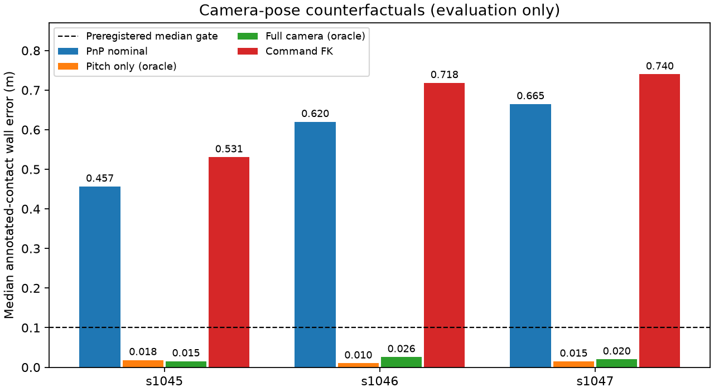

# egomap11 — 카메라 자세·바닥 투영 분해 (PR #405)

## 구현·계산 전 사전 등록

시작 `5ba7dd29`, `claude/ego-wall-map`. egomap10의 기존 검출기 pixel P94–99%, 수동 접점 투영
중앙0.457–0.665m와 `floor_boundary_v1` FAIL을 보존한다. 검출기 튜닝 없음. PR #406은 읽기 전용이다.
새 단계는 카메라 transform 진단 및 필요할 경우 default-off `camera_pose=servo_fk_v1` 하나다.

### 자료·좌표·입력 경계

- 기존 s1042/1043 개발, s1044–1047 확인 재생. 이미 본 자료이며 새 독립 확증으로 부르지 않는다.
- 기존 egomap10의 봉인된36 RGB/벽 접점 polyline·96열·ignore·무하중 정착 eligibility를 그대로 쓴다.
  추가 주석/좋은 프레임 선택/거리로 나쁜 점 제외 없음. 원 baseline에서 양의 깊이·4m를 만족한
  주석 열을 고정 분모로 하고, 새 투영의 무효/4m 초과도 별도 비율로 기록한다.
- s1045–1047 `eval_only/camera-pose.jsonl`의 실제 optical 원점/회전은 평가기에만 읽는다.
  s1042–1044에는 같은 파일·qpos가 없다. 실제 per-frame 자세 비교는 NA로 남기며 재구성값을 GT로 부르지 않는다.
  기존 문서의 '실제 camera pose 없음'은 이번 파일 인벤토리로 s1045–1047에 한해 정정한다.
- world→chassis yaw floor frame을 명시한다. 높이는 floor z, 전후/좌우는 chassis xy 원점,
  optical yaw/pitch/roll은 각각 전방 yaw·elevation·optical 축 회전이다. base roll/pitch/arm joints가
  기록되지 않은 경우 실제 camera 합성 오차를 그 두 기구 원인으로 임의 분할하지 않는다.
- 실제 카메라 로그와 RGB는 시각으로 exact join한다. cached/from-body transform 차이도 확인한다.
  GT 차체·실제 카메라·벽 지도는 scoring/단일항 counterfactual에만 쓰며 명령 FK·지도에 전달하지 않는다.
- 런타임에 허용된 servo 입력은 **자기 발행 PWM 이력**이다. frames의 actuator_state.servo_pulses는
  측정 encoder가 아닌 명령이다. 측정 관절을 있다고 가정하거나 simulation qpos를 입력하지 않는다.

### 분해·후보 규칙

1. 등록된 v3 무하중 표와 실제 카메라를 모든 exact-join 프레임에서 비교한다. eligibility 안/밖·명령 자세별로
   xyz(mm)·yaw/pitch/roll(deg) 차이 중앙/P05/P95와 표본 수를 기록한다. HIGH는 별도 표로 보존한다.
2. 봉인 수동 접점을 같은 GT 차체에 투영한다. nominal과 실제 카메라 전체 치환, 단일항 x/y/z/
   yaw/pitch/roll 치환, 실제에서 한 항만 nominal로 되돌린 결과를 계산한다. 비선형 효과이므로 기여율을
   임의 합산하지 않는다. nominal→실제 point displacement와 GT 벽 오차를 모두 기록한다.
3. 팔 자세 의존 기하 경로를 확인하면 ROS robot_state_publisher의 fixed transforms × joint rotation
   곱을 매 frame 계산하는 `servo_fk_v1`을 독립 옵션으로 구현한다. 기존 로봇의 고정 link/joint/mount/PWM
   정의만 재사용한다. GT 잔차를 fit하거나 새 sag/bias·mount·FOV를 튜닝하지 않는다. 명령 FK는 실제
   관절/바닥 자세 측정과 다르며, 이 한계를 숨기지 않는다. off bytes와 원 v3 table은 보존한다.

### 고정 투영 관문

s1042–1047 **각 녹화**에서 고정 주석 분모≥50개, 새 양의 깊이·4m 유효율≥95%,
GT 차체 자세의 벽 접점 투영 오차 **중앙≤0.10m, P90≤0.25m**, baseline 중앙 비악화,
behind-camera 출력0, off bytes 동일, GT 입력0을 모두 요구한다. 0.10m는 기존 지도 한 칸,
0.25m는 원벽과 혼동할 수 있는 오차 꼬리를 제한하는 개발 관문이며 검증된 실물 허용치가 아니다.
개발2→설정/소스 고정→확인4, 결과 뒤 임계값·방법 변경 없음. 항목별/녹화별 판정, 합산 금지.
실제 camera oracle는 평가 상한이며 후보 관문 통과로 세지 않는다.

모든6건 통과 시에만 기존 RBPF100 + positive_depth + pose_graph + wall_confidence를 재생하고
회색 GT벽/지도 confidence 음영/경로 그림을 갱신한다. §17·§19 기준은 그대로 유지한다.
미달/자료 부족이면 지도 재생·그림 갱신을 하지 않고 결과를 기록한다. 같은 원인 반복 시 추가 수정 중단.

오프라인만 예정: 새 물리·렌더·모델 호출0, freeze 옵션 사용0. 새 물리가 필요하면 별도 유한 사전 등록 후
agent_lock/ugrp_session/한 번에 하나를 따른다. 현재 남은 로그로 진단하며 자동 장기 물리 재생은 하지 않는다.
시험 통과 후에만 commit/push, Codex trailer, DRAFT 유지·병합/강제 push/reset 없음.
raw `/Users/changmin/projects/ugrp/outputs/camera-pose-projection-v1/`, 원본 보존, ENOSPC=HOST_ERROR.
PR #406 재사용 가능성만 기록하며 그 파일/브랜치는 수정하지 않는다. TensorBoard/Drive는 이전 결정대로 생략.

## 구현·조합

[REFERENCES](REFERENCES.md)의 표준 TF chain을 `harness/servo_camera_fk.py`에 구현했다.
명령 변화에 따른 카메라 geometry를 매 frame 다시 계산한다. 이 옵션은 **명령 FK 후보**이며 측정 자세 보정이 아니다.
실제 pitch 불일치는 확인했지만 관절·차체 원인 분리는 불가하므로, 명령 FK가 그것을 해결하는지는 관문으로 판단한다.

| 옵션/API | 기본 및 적용 |
|---|---|
| `camera_pose=off` | 기본. 기존 `geometry(servo, mode)`의 행렬·offset·기존 검출 scan/면/JSON bytes 불변 |
| `camera_pose=servo_fk_v1` | `geometry(servo,'off',camera_pose=...)` → 새 v3 fixed chain과 자기 PWM으로 `ColumnModel` 생성 |
| `wall_camera_calibration=v3_unloaded_extrinsic_v1` + FK | 두 모델 동시 선택은 오류. PnP 표와 명령 FK를 더하거나 보정 계수로 섞지 않음 |
| closed/unknown load, 범위 밖 명령 | 미지원으로 보류. 이번 관문은 기존 무하중/정착 프레임만 비교 |
| 기존 검출기·메모리 조합 | 검출은 기존 `wall_detector=off`. 통과 때 생성한 ColumnModel의 segments/camera transform을 기존 SelfWallMemory RBPF100+guard+graph+confidence에 전달 |

`code/audit.py`는 실제 camera 로그를 읽는 **평가 전용**, `code/evaluate_fk.py`는 자기 transform 예측을
저장·hash한 뒤에만 GT 차체/벽/주석으로 채점한다. runtime FK는 sim/평가/모델 모듈을 import하지 않는다.
공유 `visual_arm.py`, PR #406 파일, 실패 검출기, PnP table은 수정하지 않았다. 새 venv/의존성 설치0.

### 개발2 → 무튜닝 동결

구현 `00ea2387`, 관련16시험 통과. s1042/1043을 먼저 재생했다. 명령 FK는 기존 PnP 표보다
투영 오차가 커서 개발0/2 FAIL이다. 이득·pitch·mount·관문을 수정하지 않고 [freeze.json](freeze.json)에
동일 소스/기준을 고정한다. 확인4는 같은 후보의 실패 범위를 기록하는 단일 재생이며 새 독립 확증이 아니다.
지도 재생은6건 전체 관문 통과 때만 허용한다.

## 결과: pitch 불일치 확인, 명령 FK 관문 실패

사전 등록 `a556b9cc` → 평가기 `4bbaa79b` → 후보 `00ea2387` → 개발2 실패·무튜닝 동결
`2021c328` → 확인4를 완료했다. 아래 오차는 **고정 수동 접점의 GT 벽 경계까지 거리**이며,
검출기 전체 precision이나 새 누적 지도의 품질을 뜻하지 않는다. 개발0/2, 확인0/4 FAIL이다.

| 녹화 | 고정 점 수 | 기존 중앙/P90 m | 명령 FK 중앙/P90 m | FK 4m 유효율 | 실제 카메라 중앙/P90 m (평가용) | FK 관문 |
|---|---:|---:|---:|---:|---:|---|
| s1042 개발 | 461 | 0.5249/0.6920 | 0.5954/0.7982 | 99.13% | NA (미기록) | FAIL |
| s1043 개발 | 387 | 0.4845/0.6758 | 0.5651/0.7847 | 96.64% | NA (미기록) | FAIL |
| s1044 확인 | 389 | 0.5146/0.7165 | 0.5967/0.8205 | 96.92% | NA (미기록) | FAIL |
| s1045 확인 | 380 | 0.4565/0.5615 | 0.5307/0.6485 | 95.79% | 0.0152/0.0566 | FAIL |
| s1046 확인 | 277 | 0.6199/0.7416 | 0.7182/0.8197 | 98.56% | 0.0258/0.0682 | FAIL |
| s1047 확인 | 276 | 0.6648/0.7395 | 0.7400/0.8212 | 98.19% | 0.0200/0.0550 | FAIL |

6건 모두 고정 분모 전체에서 양의 깊이를 만족하며 유효율≥95%도 통과했다. 그러나 중앙≤0.10m,
P90≤0.25m 및 baseline 비악화를 모두 실패했다. 4m를 넘은 후보 점도 오차 분모에서 빼지 않았다.
개발 뒤 수치 소스8파일·관문은 [freeze.json](freeze.json)과 동일하며 확인 결과에 맞춘 수정은 없다.

### 어느 카메라 항이 오차를 만드는가

기존 s1045–1047에 실제 카메라 기록이 각각13,794/6,500/5,101개 있었다. 이번 비교는 RGB 시각과
일치하는 기록을 사용한다. cached와 from-body 변환 차이는 최대8.9e-16m/4.13e-16rad 미만으로,
카메라 cache 갱신 지연이라는 증거는 없다. 기존 egomap9/10의 실제 camera pose 부재 설명은 이3건에
한해 정정한다. s1042–1044 부재는 그대로이며, 과거 가시 recall의 NA를 이번 진단으로 소급 대체하지 않는다.

| 녹화 | 무하중 유효 프레임 | 전후 mm | 좌우 mm | 높이 mm | yaw ° | pitch ° | roll ° |
|---|---:|---:|---:|---:|---:|---:|---:|
| s1045 | 558 | +0.779 | +0.213 | −1.736 | −0.012 | −0.859 | −0.004 |
| s1046 | 351 | +0.784 | +0.241 | −1.830 | −0.014 | −0.878 | −0.008 |
| s1047 | 375 | +0.775 | +0.236 | −1.823 | −0.013 | −0.872 | −0.007 |

각 값은 **실제−무하중 보정표**의 paired-frame 차이 중앙이다. 기록된 실제 카메라에서 자기 차체의
평면 이동·yaw만 제거했으므로 높이/회전에는 차체 기울기와 팔 변형의 효과가 함께 남아 있다.

| 녹화 | 기존 m | 전후만 치환 | 좌우만 치환 | 높이만 치환 | yaw만 치환 | pitch만 치환 | roll만 치환 | 실제 전체 |
|---|---:|---:|---:|---:|---:|---:|---:|---:|
| s1045 | 0.4565 | 0.4573 | 0.4565 | 0.4364 | 0.4564 | **0.0184** | 0.4563 | 0.0152 |
| s1046 | 0.6199 | 0.6207 | 0.6199 | 0.5931 | 0.6199 | **0.0099** | 0.6201 | 0.0258 |
| s1047 | 0.6648 | 0.6658 | 0.6648 | 0.6347 | 0.6653 | **0.0146** | 0.6677 | 0.0200 |

이는 한 항만 실제값으로 바꾼 **평가용** 중앙 벽 오차다. 반대로 실제 자세에서 pitch만 nominal로
되돌리면0.4359/0.5937/0.6388m로 악화된다. 약0.86–0.88° pitch 차이가 이번0.46–0.67m 투영 오차의
주요 항임을 양방향 치환이 지지한다. 높이 치환만으로 줄어드는 정도는0.020–0.030m다.
비선형 항들의 수치를 기여율로 합산하지 않는다. [전체 분해](results/decomposition.json)에
자세별/eligibility별 P05/P90/P95, 반대 치환과 실제 투영 대비 point displacement를 보존했다.



### S2 HIGH와의 관계·남은 식별 한계

PR #406 `dc65cf6f`의 S2 README HIGH 진단은 이전 rigid-composition 예상−36.59168° vs 실제약−32.7°,
160s 높이0.179896m vs0.187288m다. 이 예전 보정의 pitch 차이는 약+3.9°다.
이번에 쓴 **무하중 PnP 표**의 HIGH는−29.9024°/0.193148m이며 아래 실제 HIGH 기록과 비교된다.
표는 servo3–6의 HIGH 명령으로 묶었으며 운반 구간을 포함하지만 각 프레임의 실제 하중을 확정하지 않는다.
하중 미지원 프레임은 위 관문 분모에 넣지 않았다.

| 녹화 | HIGH 기록 수 | 실제 pitch ° | 실제 높이 m | 실제−현재 무하중 표 pitch ° |
|---|---:|---:|---:|---:|
| s1045 | 11,853 | −32.7280 | 0.187174 | −2.8256 |
| s1046 | 4,968 | −32.6989 | 0.187164 | −2.7965 |
| s1047 | 3,517 | −32.7170 | 0.187118 | −2.8145 |

따라서 두 사례 모두 **보정 모델과 실제 카메라 자세 불일치**지만 비교 모델·하중·오차 방향이 다르다.
같은 보정값을 적용할 근거가 없으며, 실제 관절각·차체 roll/pitch가 이 로그에 없어 팔 처짐과 차체
기울기 중 어느 기구 원인인지 확정할 수 없다. 명령 FK는 프레임마다 target을 반영하지만 실제 상태를
측정하지 않아 이번 오차를 해결하지 못했다. GT pitch 잔차를 추정기에 넣거나 보정값으로 fit하지 않았다.

PR #406에는 동일한 자기 명령→고정 TF 인터페이스를 재사용할 수 있지만, **실패한 FK를 위치 추정의
검증된 대체 보정으로 적용할 수는 없다**. 실제 허용 센서의 관절/차체 자세나 별도 보정 자료가 필요하다.
이번 작업에서 #406 파일은 수정하지 않았다. `floor_boundary_v1` 실패 결과와 기존 계수도 그대로다.

## 검증·중단·보존

- 관련3파일 **16 passed**: 고정 기하/독립 평면 FK, 명령별 변화·pan, 잘못된 입력/하중 보류,
  GT import 경계, Euler/좌표 round trip, 투영 관문과 기존 default/explicit-off bytes.
  frozen geometry bytes 및 비어 있지 않은 scan/segment/adapter 골든을 포함한다.
- [검증 기록](results/verification.json):6건 예측 hash·동결 수치 소스·원 주석 분모/bytes 일치.
  새 시험2파일은 기존 CI 목록에 등록했다. 전체 CI나 물리 성능 통과를 주장하지 않는다.
- **관문 미달로 RBPF100+pose_graph+wall_confidence 재생0회, 위에서 본 누적 지도 갱신0장.**
  §23의 지도 그림은 과거 결과로 보존한다. 여기의 막대그림은 평가용 투영 진단이다.
- 새 물리·렌더·모델 호출·timing 측정0회, lock 사용0회, 의존성/venv 설치0회.
  원본/사용자 미추적4파일 보존, PR #405 DRAFT·기본 off 유지. 추가 튜닝은 중단한다.
- raw42파일39,164,591 bytes는 primary checkout `outputs/camera-pose-projection-v1/`에 로컬 보존했다.
  [manifest](results/raw-manifest.json)는 경로·크기·SHA256이며 Git에 올린 요약/그림과 구분한다.
  원격 raw 백업으로 주장하지 않는다. 출처 원문/라이선스 해시는 [REFERENCES](REFERENCES.md)에 연결했다.

재현 순서는 아래와 같다. `audit.py`와 `evaluate_fk.py`는 기존 raw 출력 폴더가 있으면 중단하여
원본을 덮어쓰지 않는다. 다른 보존 출력 루트로 재현할 때 수치 소스 변경 여부를 별도 기록해야 한다.

```sh
/Users/changmin/projects/ugrp/.venv-sim-worker-mac/bin/python experiments/2026-10-07-camera-pose-projection/code/audit.py
/Users/changmin/projects/ugrp/.venv-sim-worker-mac/bin/python experiments/2026-10-07-camera-pose-projection/code/evaluate_fk.py --split development
/Users/changmin/projects/ugrp/.venv-sim-worker-mac/bin/python experiments/2026-10-07-camera-pose-projection/code/evaluate_fk.py --split confirmation --freeze experiments/2026-10-07-camera-pose-projection/freeze.json
PYTHONPATH=outputs/self-map-plot-deps /Users/changmin/projects/ugrp/.venv-sim-worker-mac/bin/python experiments/2026-10-07-camera-pose-projection/code/report.py
```
