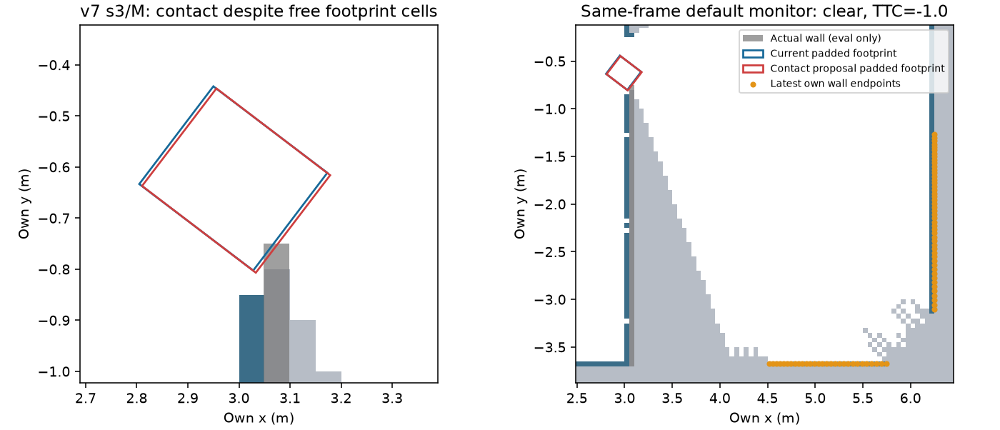
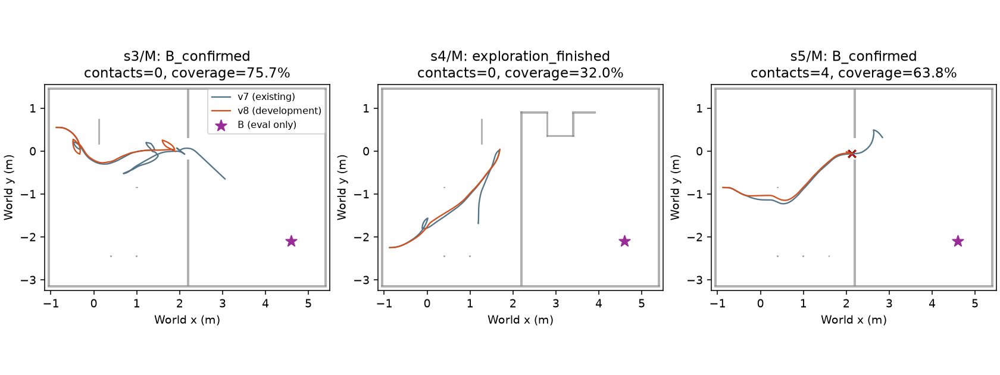

# explore11 결과 — 개발 관문 실패, 추가 실행 중단

**public_ros_v8 개발32쌍은3/5 통과로 실패. 새 확인32쌍 등록/개봉 및 현실 잡음 실행0.**
원본 설정 복원 뒤에도 좁은 카메라 시야·부분 지도에서 안전/탐색 문제가 남았다.
실패 후 코드/설정/관문은 바꾸지 않았다. v7 확인 결과는 그대로 보존하고 이번에는 개발용으로만 사용했다.

## 사전 등록과 실제 실행

- 사전 등록/원본 대조 `8831d402`; 평가기 clock 수정 별도 `efe4dc5b`;
  구현/설정 동결 `998d8da65f1b8ae4aded7b6aec77a8355c85d0b7`.
- M/N×s1–s8×7701/7702,32쌍×static/own=64episode 한 번. 원래 oracle 환경 draw split 유지,
  결과 evidence split만 development. 각 두 seed는 같은 oracle 궤적이므로 독립 표본32로 해석하지 않는다.
- 새 라이브러리/venv 없음. native C++는 기존 NavFn/frontier와 Nav2 kinematics 원문을 그대로 컴파일.
- MuJoCo·렌더·모델 호출0. matplotlib 그림은 저장 로그의 시각화다.
  `ugrp_session explore11-development` 종료 확인. wall시간 성능 측정 없음, 배타 물리 잠금 사용 없음.
- 원본 raw: `/Users/changmin/projects/ugrp/outputs/mapfree-monitor-v8/development`,
 142,561,395 bytes. [원본 SHA256 목록](results/raw-manifest.json), [동결 설정](freeze.json).
  로컬 raw이며 원격 백업 완료로 표현하지 않는다.

## 변경 전후 (기준/분모 그대로, 합산 없음)

|조건|참 B /32|거짓 B|직접 관측 coverage 중앙|B 거리 중앙(m)|B 시간 중앙(s)|충돌|잘못된 문/문 시도|거짓 후보 통로|
|---|---:|---:|---:|---:|---:|---:|---:|---:|
|v7 정적 (기존 확인)|32|0|63.21%|3.638|95|0|0/44|12|
|v7 frontier (이번 개발 근거)|26|0|70.11%|3.737|140|2|0/42|14|
|v8 정적 (개발)|32|0|63.21%|3.638|95|0|0/44|6|
|v8 frontier (개발)|24|0|71.80%|3.858|137|16|0/34|10|

B 거리·시간은 **그 조건의 성공 건만** 중앙값, coverage는 전체32건.
공통 성공24쌍의 거리/시간 비율 중앙은 **1.1997 / 1.6935** (v7 공통26쌍1.0673/1.4225).
성공집합이 다르므로137s를 전체 과제의 시간 개선으로 해석하지 않는다.
정적 false passage12→6에는 정수 clock으로 엄격한 `>3s` debounce 경계가 달라진 효과도 있다.
기준 문턱과 scorer 식은 바꾸지 않았으며 이 감소를 monitor 효과로 주장하지 않는다.

|기존5개 관문|v7|v8|
|---|---|---|
|32쌍 완전성·입력 경계·off/소스 동일|통과|통과|
|참 B≥26/32, 거짓0|통과|**실패(24/32)**|
|공통 성공 거리/시간 비율≤2|통과|통과|
|coverage 중앙≥40%|통과|통과|
|충돌·잘못된 문·거짓 후보 통로0, 문 시도≥1|실패|**실패(16/0/10,시도34)**|
|통과 수|4/5|**3/5**|

[건별32쌍 표](results/table.md), [64개 결과](results/episodes.csv), [관문 JSON](results/gate.json).

## v7 실패를 원인별로 확인

1. **충돌2 — s3/M seed7701·7702,257.3s,wall_divider_1.** 직전 발행 중심선9표본과
   제안 footprint38칸은 모두 raw free. 실제 벽 중심표본 칸1개도 free였다. 따라서
   `allow_unknown`가 unknown을 허용해 벽에 부딪힌 사건으로 분류할 수 없다.
   카메라 점77개는 로봇에서 최소3.323m 떨어져 있어 부딪힌 근거리 벽이 입력에 없다.
   같은 저장 프레임에 Nav2 기본 monitor를 적용해도 TTC=-1(위험점 없음)이다.
   이 지점까지 **이미 점유된 칸을 현재 footprint로 지운 기록은0**이라, 이를 기존 벽 메모리를
   지운 탓으로 단정하지 않는다. 카메라 근거리 미관측+격자/body support의 free 표시에 남은 문제다.
2. **거짓 후보 통로14 — s4/N4,s5/M4,s8/M6.** 실제 발행 .1s 경로의9표본은 모두 free,
   rectangle sweep 실제 접촉0. s4/N의 후보 중심4개는 raw254(벽), 나머지10개는0;
   접근 명령이 후보 중심까지 통과한 것이 아니다. s4/s5의8개 후보는 `free_connection_unknown`,
   s8의6개는 `clearance_feasible`. 기존 scorer는 .3m 근접+authored passage 불일치로 센다.
   이14회를 미관측 벽 통과14회로 해석하지 않으며 **기존 지표는 그대로 남긴다**.
3. **frontier 소진4 — s4/M2,N2.** M의 마지막1개는11cell(.55m)로 배포 min_frontier_size .75m
   미달. N의23개 중 크기로 통과하는 것은29cell짜리1개뿐이며 기존에는 전부 blacklist 범위 안이었다.
   B 최근접 카메라 거리2.923/2.822m, FOV 투영 최대1425/1133표본이지만 가림 뒤0.
   원본 min .75m는 남은 후보를 더 만들어 주는 설정이 아니다. potential3/gain1/.33Hz를 그대로
   적용했고 B를 보게 하려고 크기나 gain을 재조정하지 않았다.
4. **B 시간 경계2 — s3/M.** 같은 저장 경로/patch의 시각만 정수 tick으로 바꾼 메모리 감사에서
   track19→4, 최대view2→12, 미확인→**260s 확인**으로 바뀐다. B geometry/pose/문턱은 같다.
   로깅 때 제거한 내부점은 이 감사의 미사용 cell-union 계산에만 hull로 대신했으며,
   confirmation에 쓰이는 중심/hull/자세/view는 동일하다. 이는 시간 원인 분리이지 새 주행 성적이 아니다.
   실제 v8 주행은 경로도 달라 두 건 모두179s에 B 확인. 예산900s는 유지했다.
   s1050/1051 저장 시간260.10/264.35s 및 S2 v106 CAP_S900 근거는 사전 등록에 기록했다.

[v7 전체 사건 기록](results/v7-event-diagnosis.json), [저장 프레임 monitor 감사](results/v7-contact-monitor-audit.json),
[시간만 바꾼 감사](results/clock-only-audit.json).

## v8의 남은 실패 (추가 튜닝 없음)

- **B 미확인8건:** s1/N,s4/M,s4/N,s5/N 각2. 모두 B 가시/검출0이며 유효 frontier 소진/blacklist로
  끝났다. 시간 예산 초과0, B 오검출0. frontier source값만으로 제한된 카메라 시야의 B 관측을 보장하지 못했다.
- **접촉16건:** s5/M8(wall_divider_1),s7/N8(frame_1). 이 중**14건은2s 관측 대기**,2건은행동 구간이다.
  stop 이후 명령 모션 모델의 잔류 이동에서도 contact가 생긴다. 기존 어댑터는2s 대기 동안
  controller/bumper 콜백을 돌리지 않고, 접촉 평가는 계속 센다. 이 한계를 성공에서 제외하지 않았다.
- **64episode monitor24,140회 모두 clear**, approach/invalid_source0. 카메라 입력에 없는 근거리 벽을
  footprint TTC 검사가 만들어 낼 수 없다. 원본6점 문턱을 완화하거나 GT벽을 넣지 않았다.
  따라서 B 일부 회복/거짓 후보 감소를 monitor의 안전 개선 효과라고 주장하지 않는다.
- **거짓 후보10건:** s1/M4,s3/N2,s4/N2,s5/M2. Nav2 monitor는 실제 관측 장애물의 속도 필터이며
  Hough gap 후보가 의미상 진짜 문인지 검증하는 모듈이 아니다. 기존 안전 문턱 미달 그대로다.

[실패 유형/개별 접촉 시각](results/failure-types.json), [monitor 호출 수](results/monitor-counts.json).

## 검증·중단

관련 시험 `test_navigation_monitor`, `test_navigation_clock`, `test_navigation_unknown` **11개 통과**.
기본 off lazy bytes 동일, v7 고정121파일 SHA256 동일, v8 실행/종료140파일 고정 일치,
64개 raw result와 집계 일치 확인. [검증 기록](results/verification.json).
새 확인용 cohort/freeze는 만들지 않았고 현실 잡음도 실행하지 않았다. 이번 개발 결과를 기존 확인 결과에
합치지 않는다. PR #409 DRAFT 유지, 병합 없음. 남은 근거리 관측/정지 잔류/도달 불가 후보 원인을
기록하고 트랙을 멈춘다. TensorBoard 변환은 기존 사용자 생략 지시를 유지한다.
