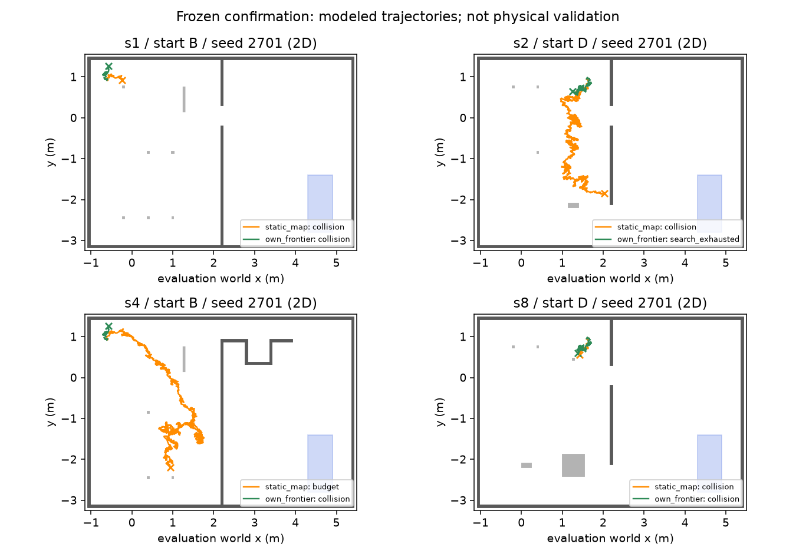

# 자기 지도 B·C·E: 2D 오프라인 탐색 (2026-10-07)

후속 환경 진단·수정은 아래 §8 이후에 별도 기록한다. §1–7의 실패/확인 자료는 보존한다.

## 1. 범위와 동결

설계 `/Users/changmin/projects/ugrp/outputs/mapfree-design-20261006/DESIGN.md` §4/5/7/9를 따른다.
B 색 검출 v3는 부모 `91e60811`에서 동결했다. precision 100%, recall 79.41% **기준 미달**,
녹화 거짓 확인 0이다. 시간 누적이 미달을 보완한다는 것은 아직 가설이다. 자기 지도 구 녹화 튜닝도 중단한다.
이 작업은 MuJoCo/렌더/물리/모델 호출 없이 **NumPy 2D 센서·운동 모사**만 한다. 임무·실물 성공과 구분한다.
`claude/mapfree-goal-floor` 위 `claude/mapfree-explore`; 부모 #408과 새 PR 모두 DRAFT, 병합하지 않는다.

## 2. 구현 전 사전 등록 (이 절의 커밋 뒤 구현)

### 코호트와 변경 금지

- 현행 `configs/zone_study_scenarios_v4/s1..s8*.json`의 8개 배치. 벽 지도는 3종을 공유한다.
  해당 map JSON의 벽/문, setup의 물체 footprint를 환경만 읽는다. s2의 45 s 통로 막힘과 s5의
  30 s 물체 이동도 환경에서만 적용한다. 다중 로봇 hold/파지/낙하 사건은 이번 빈손 단독 탐색 범위 밖이다.
- 고정 시작 `(x,y,yaw)`: A=(-.65,-2.8,0), B=(-.65,.95,0), C=(1.65,-2.8,π/2), D=(1.65,.95,π).
  기하 충돌인 시작은 HOST_SETUP_ERROR로 남기며 다른 시작으로 바꾸거나 분모에서 빼지 않는다.
- 개발: s1–s8 × A/C × seed1701 =16쌍. 확인: s1–s8 × B/D × seed2701/2702 =32쌍.
  각 쌍은 **static_map / own_frontier** 두 조건. 개발 결과 후 설정·소스 해시를 커밋하여 고정한 뒤 확인을 연다.
  확인 후 재튜닝 금지. 이미 본 녹화는 센서 모형의 개발 근거이며 새 실제 녹화 확증으로 부르지 않는다.
- 에피소드 예산: modeled time 600 s, 300 관측/행동, 이동 40 m 중 먼저 도달. 충돌 시 종료;
  evaluator가 충돌/정답 B 신호로 경로를 고쳐 주지 않는다. 첫 확인 후 종료. 실패도 분모에 남긴다.
- 새 옵션은 각각 `exploration=own_frontier_v1`, `door_detection=own_gap_v1`,
  `partial_planning=own_astar_v1`, 기본 `off`. 전부 off는 기존 출력 객체/직렬화 바이트 동일.
  B v3/기존 지도 보정 코드·설정은 수정하지 않는다. D* Lite와 LLM·지도 공유는 이번에 넣지 않는다.

### 센서·위치 모델의 출처와 한계

- 카메라 v3 명령 FK와 실제 K/D (`harness/floor_goal.py`/`sim/masterpi_camera_profile.py`) 재사용.
  640×480, SEARCH 명령 자세; 유효 양의 깊이 바닥 광선, 4 m 컷, 첫 장애물 가림.
  초기 제자리 관측은 중첩 시야로 회전하며 시간/회전 명령 비용을 포함한다. 실제 RGB 렌더는 하지 않는다.
- 벽은 기존 `wall-bias-fix/options/{main,s912,s913}-D-step3-sag/columns.npz`의
  mask_on 검출 누락·행 정오·**부호 있는 거리 잔차**를 재표본한다. 가시 접점 분모/범위/필터와
  원본 sha256을 추출 파일에 남긴다. precision을 독립 FP 확률로 잘못 쓰거나 두 번 잡음을 넣지 않는다.
  개발 센서 자료는 main(s911), 확인 센서 자료는 s912/s913을 분리 사용한다. 모두 **구 카메라/구 구동**이다.
- B는 동결 v3 새 정적 자료의 TP/FN·투영 잔차와 v3 녹화 음성 FP를 쓴다. 개발/확인 원자료를 분리한다.
  면적≥256 px의 조건부 recall이며 범위/가림으로 보이지 않는 B를 확률만으로 출현시키지 않는다.
  확인 precision100%를 임의 환경의 FP확률0으로 치환하지 않는다. 녹화 14/527 거짓 component를 별도 모사한다.
  시간 확인은 ≥3회/≥2 s/병진≥.05 m/최초 중심≤.20 m/겹침≥.35/gap≤3 s의 동결 규칙을 따른다.
- 운동은 `V7CommandOdometry`의 명령 평균/과정 공분산을 재사용한다. 평균 M1 보정, 잡음은
  `e7b229b6:sim/masterpi_drive_friction_v7.py`의 구조 사전값이다. **실측 v7 분산이 아니다.**
  환경만 해당 잡음을 실제 이동에 표본하며 actor는 자기 명령으로 적분한다. GT pose 보정은 없다.
- 실제 RGB 바닥 free 검출기의 오류 통계는 아직 없다. 모사 센서는 가려지지 않은 바닥의 광선만
  별도 `floor_visible` 관측으로 내보내며 벽 미검출을 free로 만들지 않는다. 거리 오차는 벽의 측정 잔차로
  근사한다. 낮은 물체/바닥 segmentation의 일반화는 **미검증 모델 가정**으로 표시한다.
  자기 몸 밑 초기 footprint의 기하 support만 예외로 둔다(관측 free/coverage에는 합산하지 않음).

### 기준선·지표·성공 기준 (확인 전에 변경하지 않음)

기준선에는 기존 정적 지도·B 좌표만 허용한다. 양 조건의 운동/센서 모형, 명령 DR, footprint/예산은 같다.
static map에는 초기 지도 정렬을 알고 있다는 별도 정보 이점이 있다. 숨은 사건/실시간 GT pose는 제공하지 않는다.
기존 RGB/top-camera 현행 제어기를 실행한 결과가 아니라 **같은 2D 실행기의 정적 지도 정보 기준선**이다.

| 기준 | 사전 통과 조건 |
|---|---|
| 입력/회귀 경계 | off 골든 바이트 동일; actor GT/타 로봇 지도/MuJoCo/모델 접근 0 |
| B 확인 | 확인 32건 중 참 B 첫 확인 ≥80%, 거짓 확인 0 |
| 효율 | 두 조건 모두 참 확인한 쌍의 거리·modeled time 비율 중앙 각각 ≤2.0; 공통 성공 0이면 실패 |
| 탐색량 | 참 확인 또는 종료 시 직접 본 reachable free 면적 커버리지 중앙 ≥40% |
| 문·이동 안전 | 잘못된 문 통과 시도 0, 충돌 0; 실제 문 통과 시도 ≥1건(무시도 통과 금지) |

거리=환경 이동 궤적 XY 길이(m), 시간=명령·회전·정착 포함 modeled s, 미발견은 null + 검열 이유/예산을 기록한다.
coverage는 시작에서 도달 가능한 GT free 셀 중 **센서가 실제 보았던 셀**의 비율; actor의 허위 free와 별개다.
잘못된 문 시도는 발행 경로가 GT 통로 단면을 가로지르며 요청 footprint가 당시 GT 장애물과 겹친 사건이다.
가짜 gap 후보에서의 crossing도 별도 FP passage 시도로 센다. 문 후보/수락/거절 사유와 시도 수를 함께 남긴다.
각 배치/시작/seed를 표로 남기고 배치별 동일 가중 요약만 부가한다. 성공 사례만의 수치로 실패를 숨기지 않는다.
HOST_ERROR/ENOSPC는 실패로 보존한다. 시간 측정은 modeled time이며 CPU 속도 benchmark가 아니므로 잠금을 쓰지 않는다.

## 3. 표준 방법·출처와 적용 범위

- [Yamauchi 1997](https://www.robotfrontier.com/papers/cira97.pdf): free/unknown 경계의 연결 frontier.
  검색 초록 확인, 원문 재접속은 실패했다. [explore_lite 공개 코드](https://raw.githubusercontent.com/hrnr/m-explore/master/explore/src/frontier_search.cpp)
  `searchFrom`, `isNewFrontierCell`, `frontierCost`를 확인했다. 도달성·군집·거리/효용 원리를 독립 구현한다.
- [FUEL 2021 공개 코드](https://raw.githubusercontent.com/HKUST-Aerial-Robotics/FUEL/main/fuel_planner/active_perception/src/frontier_finder.cpp):
  frontier 군집, 관측점의 FOV/가림 검사를 참고한다. 2D 좁은 시야의 visible-unknown 면적/이동 비용을 쓴다.
  FUEL 전체 계층 최적화나 entropy 기대값을 재현했다고 하지 않는다. 다중 로봇 map merge는 없다.
- [Area Graph 2019](https://arxiv.org/abs/1910.01019): metric free에서 영역/통로 위상 요약의 근거.
  초록 확인; 공개 코드 재조회는 실패하여 구현 세부 인용은 하지 않는다. 이번 C는 벽 gap·다시 본 양 jamb·
  free 연결·격자 오차를 뺀 폭 하한의 최소 단계이며 논문의 전체 Voronoi/room segmentation 이식은 아니다.
- [Smac 논문 v2(2025)](https://arxiv.org/abs/2401.13078v2),
  [Nav2 footprint 검사 코드](https://api.nav2.org/nav2-humble/html/collision__checker_8cpp_source.html):
  unknown 차단·footprint 전체 충돌 검사와 cost-aware A* 근거. A*는 기존 `harness/map_goto.py`와 같은
  격자 탐색 원리로 구현하며 narrow corridor에서 대각선 corner cut 금지. 운반 footprint는 기존
  `pair_passage_plan.PAIR_ENVELOPE`(±.625×±.20 m) 전체를 사용하고 회전은 circumscribed sweep으로 보수 검사한다.

새 패키지/venv 설치 없음. 결과는 로컬/실험 기록에 남긴다. 이전 사용자 결정대로 TensorBoard 변환은 생략한다.

### 구현 중, DEV 전 명시한 센서 자세 보완

K-pinhole 시야는 **수평54.535°/수직42.149°**다. SEARCH의 바닥 최근거리는 섀시 기준 .377 m여서
자기 몸 밖에 미관측 고리가 생긴다. 이를 free로 메우지 않는다. 기존 B v3 격자의 **close_floor** 명령
(1:2000,3:807,4:1897,5:2187,6:1500; 최근거리 .245 m)을 매 관측의 근거리 확인에 추가한다.
두 자세 각각 정착 .5 s와 관측 .5 s, 합2 s를 비용에 넣는다. 가림/광선은 각 자세별로 계산한다.
현재 camera/FOV/높이/팔 링크를 변경하지 않으며 새 물리 동작 검증은 아니다. 성공 기준/분할은 그대로다.

## 4. 실제 구현 명세 (DEV 이전)

`harness/own_map_navigation.py`는 새 독립 인터페이스이며 기존 물리 실행기에 자동 연결하지 않는다.
`ObservedGrid.observe`는 자기 pose·관측 floor 점·wall 점만 받는다. wall hit가 ray free를 생성하지 않는다.
B/C/E 기본 off는 원래 출력 객체를 그대로 반환한다. on은 GT/static fallback 없이 관측/경로 요청을 반환한다.
자기 body support는 최초에만 추가하며, 임의 이동 뒤 footprint를 지워 길을 만드는 동작은 없다.

A*는 unknown/occupied를 전체 footprint+margin으로 팽창하고 대각선 corner cut을 거부한다. 빈손은
.12×.10 m half rectangle의 circumscribed sweep, pair는 .625×.20 m를 쓴다. pair 회전 sweep은 좁은
문에 보수적일 수 있고 이번 코호트는 **빈손 1대**다. 관측 grid revision마다 재계획한다. pair 탐색 명령은
`shared_carry_action_required`로 거부한다. frontier는 최소 군집 크기 삭제 없이 reachable 관측점+heading,
가시 unknown 면적−.35×거리−.75×최근 방문 수(12개)를 점수로 한다. 임의 세계 bounds를 제공하지 않는다.

문은 [OpenCV HoughLinesP](https://docs.opencv.org/4.13.0/d9/db0/tutorial_hough_lines.html)의 선분 끝점을 사용한다.
collinear 10°/.15 m, gap .25–1.5 m, 폭 하한=측정 gap−2셀; 양 jamb의 ≥.05 m/≥5° 다른 자기 관측,
내부 floor ribbon 연결, 운반 footprint 폭을 각각 검사한다. 좁은 FOV 끝·미검출 gap은 free 확인 없이 통과
가능으로 승격하지 않는다. `visually_confirmed_passage`는 아직 실제 통과 확인 adapter가 없어 false다.
OpenCV5의 반환 배열 Nx4와 OpenCV4 Nx1x4 차이로 첫 단위시험 1회 실패; 공식 endpoint 형식을 확인하고
둘 다 받는 reshape로 수정했다. 새 의존성 설치 없음.

센서 추출 표는 ≤4 m 양의 거리/가시 열≥8/프레임당96열 재표본 조건이다. 개발 P=.89113/R=.98739,
확인 P=.89208/R=.98786; 거리 잔차 중앙 +.01368/+.01421 m, P95 +.28632/+.28806 m.
이 값이 옛 전체범위 열 P≈.845/R≈.889와 다른 **분모/거리 제한**을 `sensor-model.json`에 명시했다.
측정된 정오·누락·잔차는 한 행에 함께 재표본하여 precision 오류를 다시 중복 주입하지 않는다.
바닥 자유 관측에는 그 프레임 거리 잔차 중앙을 공통 radial bias로 쓴다(바닥 오차 실측 아님).
B는 동결 frame recall .75439/.79412와 실제 투영 오차 표본을 쓰고, FP는 기존 v3 녹화 14개 body hull을
14/527 확률로 재표본한다. temporal 확인은 `FloorGoalMemoryV3`를 그대로 호출한다.
정적 B 마스크의 convex hull pixel 면적은 가림이 복잡할 때 낙관적일 수 있다. 시간 iid 재표본도 실제
오류 지속 시간을 보장하지 않는다. 이 센서 가정이 없는 물리/실물 성능으로 확대 해석하지 않는다.

### 작은 DEV 인수 재생의 구현 오류 기록

첫 `87b069eb` smoke의 static 결과는 11 s 충돌이고, 마지막 grid JSON 저장에서 NumPy int64 형식 오류로
중단했다(`outputs/mapfree-explore-smoke-v1`, 부분 결과 보존). Python JSON 기본형 계약에 맞춰 grid cell을
native int로 반환한다. 새 저장 회귀검사를 추가했다. 별도로 static raster는 입력 좌표를 floor 양자화할 때
생길 수 있는 빈 칸을 없애도록 **자기 셀 중심에서 기하를 rasterize**한다.

static 최초 경로 회귀검사에서 0.5 m 문이 여전히 막혔다. 이는 cell 경계 여유를 포함한 **모든 방향 회전 원**이
통로에 들어가지 않는 보수성이다. 위 §4의 명세를 구체화하여 translation A*는 현재 yaw의 전체 사각 footprint,
제자리 회전 명령만 circumscribed sweep으로 검사한다(Nav2 oriented footprint 원리). 새 반례 시험을 통과했다.
초기 body support 안의 제자리 관측 가정 외에는 unknown 회전 sweep도 이동 명령으로 내보내지 않는다.
실험 기준·센서 잡음·B threshold 변경은 없다. 문 시도 채점은 실제 중심이 문을 넘은 경우만이 아니라
발행한 짧은 경로가 문 경계의 차체 폭 안으로 진입하려는 경우도 세므로 충돌 직전 시도를 놓치지 않는다.

### 첫 개발 16쌍 보존 및 실행 adapter 보완

`88bd34e2`의 `outputs/mapfree-explore-development-v1`에서 static 참 확인2/16·충돌13,
자기 탐색 참 확인0/16·충돌9·관측 후 소진7이었다. 자기 탐색은 translation frontier를 한 번도 만들지 못했다.
좁은 바닥 시야/unknown footprint 연결과 DR 불확실성이 남으며, 이 결과를 성공으로 바꾸어 보고하지 않는다.
코드 감사에서 A*의 두 번째 후속 칸까지 한 번에 명령하던 adapter가 꺾인 경로를 shortcut할 수 있음을 확인했다.
**바로 다음 한 칸**만 명령하도록 고치고 elbow 반례를 추가했다. B 확인 평가도 마지막 패치만이 아니라
동일 track의 참 관측≥2/과반을 요구하도록 명확히 했다(제어기에 GT를 전달하지 않음).
이는 DEV 이전 등록한 corner-cut 금지/참 확인 정의의 구현 보완이다. 설정/성공 기준은 바꾸지 않고
최종 소스로 개발 16쌍 전체를 다시 돌린 뒤 동결한다. 첫 개발 수치는 새 결과와 합산하지 않는다.

## 5. 개발 종료·설정 고정 (확인 개봉 전)

최종 구현 `fa3e038a`의 개발 16쌍(`outputs/mapfree-explore-development-v2`)에서 참 B 확인은
static 0/16, own 0/16이다. static 충돌16, own 충돌9/관측 후 소진7이었다. 첫 개발의 static 성공2건을
새 최종 성능으로 합산하지 않는다. 단위 기능과 전체 조건 성공을 구분하며, 문/탐색 준비 완료가 아니다.
모듈 옵션·센서 분포·footprint·점수·예산·성공 기준을 추가 튜닝하지 않고 [freeze.json](freeze.json)의
소스/입력 해시로 동결한다. 확인은 새 시작 B/D와 seed2701/2702의 32쌍만 실행한다.
기존 확인 녹화의 벽 통계/B 정적 확인값은 센서 모형 입력이며 이 2D 에피소드의 성능 평가와 분리한다.

## 6. 확인 결과: 기준 미달 그대로 기록

동결 커밋 `b5827069` 이후 새 시작점/seed 확인 32쌍을 실행했다. 실행 핵심 소스/설정은
개발 최종 `fa3e038a`와 해시 동일하다. 확인 후 탐색/센서/지도/B/운동 설정 수정·재튜닝 **0회**다.
[전체 96조건 표](results/tables.md), [원수치](results/results.json), [요약/판정](results/summary.json),
[원본 해시](results/artifacts.json), [확인 track 진단](results/diagnosis.json)을 함께 둔다.

| split | 2D 조건 | 참/거짓 B 확인 | 첫 확인 거리/시간 | 커버리지 중앙 | 충돌 | 잘못된 문 시도/전체 시도 | 종료 이동/시간 중앙 |
|---|---|---:|---|---:|---:|---:|---:|
| 개발16 | static_map | 0 / 0 | N/A | 36.96% | 16 | 0 / 4 | 8.12 m / 32 s |
| 개발16 | own_frontier | 0 / 0 | N/A | 27.21% | 9 | 0 / 0 | 2.80 m / 11 s |
| 확인32 | static_map | 0 / 0 | N/A | 15.84% | 31 | 0 / 0 | 7.05 m / 27 s |
| 확인32 | own_frontier | 0 / 0 | N/A | 15.11% | 13 | 0 / 0 | 5.18 m / 71 s |

거리·시간의 마지막 열은 **실패/소진까지** 값이다. B 발견 효율로 해석하지 않는다. 거리에는 50 ms 격자에서
생성한 과정 잡음 이동이 포함되고 시간은 wall/실제 SIM 실행 시간이 아닌 modeled s다. 공통 성공쌍0이라
B까지 거리·시간 비율은 N/A, 효율 기준은 실패다. 확인 static은 충돌31/40 m 예산1, own은 충돌13/소진19다.
운반·다중 로봇 임무를 실행하지 않았다. static의 실패는 현행 물리 기준선 성공률을 뒤집는 결과가 아니다.

| 사전 기준 | 확인값 | 판정 |
|---|---|---|
| off/입력 경계 | off 골든·own/peer·무엔진 시험 통과, 봉인 해시 동일 | 통과 |
| B ≥80%, 거짓0 | 0/32, 거짓0 | 실패 |
| 공통 성공쌍 거리·시간비 중앙≤2 | 공통 성공0; N/A | 실패 |
| 커버리지 중앙≥40% | 15.11% | 실패 |
| 잘못된 문/충돌0, 문 시도≥1 | 0/13, 시도0 | 실패 |

**1/5, 전체 성공 아님.** 문을 시도하지 않아 생긴 0을 안전 성능으로 승격하지 않는다. 문 후보 진단은
확인에서 `jamb_reobserve`624 / `free_connection_unknown`513 frame-candidate 사건이며 독립 표본 수가 아니다.
`clearance_feasible`/가짜 passage 진입도0으로, 문 모듈의 긍정 동작은 합성 반례 단위시험 범위에 머문다.



### 왜 B 시간 누적만으로 이번 실패를 해결하지 못했는가

자기 탐색 확인에서 B가 모사 시야에 들어온 프레임191, 검출162(센서 추출의 .7941 재표본 변동 포함)였으나
**병진 명령0**이다. 참 B track30개 중26개는 ≥3회를 모았고 최다9회였다. 그 track 안의 자기 명령 기반
병진 baseline 최댓값은 **0.00000422 m**, 동결 v3 확인 조건 .05 m에 못 미친다. 같은 장소의 반복 영상은
새 시점이 아니므로 억지로 확인으로 올리지 않는다. 바닥 관측과 최초 자기 footprint의 연결이 unknown으로
남아, 자기 탐색은 확인에서 `observation_required`470회, 회전 sweep unknown342회를 기록했다.
후자의 no-op도 시간 예산에 들어간다. 이 실패는 v3 HSV recall을 다시 튜닝할 근거가 아니다.

확인 종료 위치 오차 중앙은 static .458 m / own .351 m다. 이번은 **명령 DR만으로** B/C/E를 검사했으며
#405의 RBPF/pose graph를 다시 튜닝하거나 이번 2D 모형에 연결하지 않았다. margin .02 m도 고정 기하
여유이고 posterior의 확률적 안전 보장을 뜻하지 않는다. 따라서 **초기 near-floor free 연결 관측 계약과
기존 자기 위치 보정의 연결**, 현행 v7 구동·카메라 v3의 벽/free 오류 실측 검증이 남는다. 이번에 새 물리
자료를 만들거나 GT pose로 연결을 보완하지 않았다. 결과의 실패 수치를 숨기는 후속 변경은 하지 않았다.

## 7. 옵션·입출력·재현·보존

| 옵션 | 기본 | on 동작 |
|---|---|---|
| `exploration` | `off` | `own_frontier_v1`: 자기 reachable frontier와 관측 heading; `own_astar_v1` 필요 |
| `door_detection` | `off` | `own_gap_v1`: 자기 wall gap, jamb 재관측, 관측 free ribbon, footprint 폭 하한 |
| `partial_planning` | `off` | `own_astar_v1`: 관측 free만 A*, grid revision마다 재계획, static fallback 없음 |
| 부모 `goal_detection` | `off` 유지 | `floor_color_v3` 동결 옵션/누적기 그대로; 2D에서는 검출 단계만 측정 분포로 대체 |

API는 `NavigationOptions` → `OwnMapNavigator.update(legacy_output, grid=own_grid, pose=own_pose,
 goal=own_goal_snapshot, footprint=...)`다. 전부 off이면 grid/pose를 요구하거나 읽지 않고 `legacy_output`을
그대로 반환한다. door만 on이면 경로를 발행하지 않는다. on 출력은 자기 odom path·heading·관측 요청·
문 판정이며 실시간 물리 executor/LLM에 자동 연결하지 않았다. 운반 탐색은 공통 행동 합의 요청으로 거부한다.

```sh
PY=/Users/changmin/projects/ugrp/.venv-sim-worker-mac/bin/python
$PY -m pytest tests/test_own_map_navigation.py tests/test_floor_goal_v3.py -q
$PY experiments/2026-10-07-mapfree-explore/code/run_grid.py --split development --output outputs/NEW-explore-development
$PY experiments/2026-10-07-mapfree-explore/code/run_grid.py --split confirmation --freeze experiments/2026-10-07-mapfree-explore/freeze.json --output outputs/NEW-explore-confirmation
$PY experiments/2026-10-07-mapfree-explore/code/report.py --development outputs/NEW-explore-development --confirmation outputs/NEW-explore-confirmation --output outputs/NEW-explore-report
```

`grid_world.py`만 hidden geometry를 소유한다. actor observation에는 body floor/wall 점과 자체 frame ID만,
B 추적에는 모사 검출 patch만 들어간다. GT 궤적·B 참/거짓은 `eval_only.jsonl`에 별도 기록한다.
map JSON의 시간 사건 중 s2 막힘/s5 이동만 환경에서 적용하고, 다른 로봇/협동/화물 동역학은 모사하지 않는다.
scene geometry는 등록 map 해시와 대조한다. 화물은 catalog landing footprint의 2D 직사각형 근사이며,
낮은 물체도 완전 가림으로 처리한다. 카메라 벽 광선은 K-pinhole 수평 span 뒤 실제 fisheye 투영 유효성을
검사하는 보수적 표본 근사다. 어떤 센서 실패율도 실물 수치로 바꾸어 부르지 않는다.

전체 raw·첫 smoke/첫 개발 실패도 이 worktree `outputs/mapfree-explore-*`에 약53 MB 보존하며
**GitHub raw 백업 아님**이다. 작은 통계 표본424,661 B와 그림94,801 B는 experiments에 커밋한다.
배치/시작/seed 결과는 분리 표에 있으며 s1–s8의 벽 배치가 8개 독립 기하인 것처럼 합산하지 않는다.
보고 그림 첫 생성은 모듈 검색 경로 누락으로 실패했으며 수치 산출은 완료됐다. report 전용 경로만 보완해
새 `results-v2`에 그림을 만들고 확인했다. 봉인 추론/센서/실행 소스는 바꾸지 않았다.

로컬 관련 시험 **21 passed**, `git diff --check` 통과. B v3 봉인10파일·사용자 기존 미추적4파일 바이트 불변.
MuJoCo/렌더/모델 호출0, 새 venv/패키지 설치0, CPU timing benchmark/잠금0이다. CI에는 새 시험 파일을
정확히 한 번 추가한다. PR #409는 #408 위 DRAFT이며 병합하지 않는다. TensorBoard는 앞선 사용자 결정대로 생략.

## 8. 수정 전 환경 진단 등록 (2026-10-07)

`585f2745`의 평가기/actor는 아직 수정하지 않았다. 기존 확인 32쌍은 이제 **본 자료**다.
`code/diagnose_environment.py`로 원래 로그의 최초 경로, B 가시/검출/누적, 병진 명령,
종료 충돌의 사각 차체 실제 겹침/외접원만 겹침/명령 DR와 GT 차이를 분리한다.
같은 32쌍에 과정·투영 잡음0, 가시 검출률1/오검출0을 적용한 오라클 관측 재생을 먼저 한다.
카메라 FOV·가림·4 m·B 256 px 조건과 동결 B v3의 시간/병진 확인은 유지한다.
오라클도 자기 명령 DR만 입력받으며, 정답 위치로 제어기를 보정하지 않는다.
이 진단은 새 확인 성능이 아니다. 수정 전/후 자료를 덮어쓰거나 합산하지 않는다.

[ROS explore_lite](https://raw.githubusercontent.com/hrnr/m-explore/master/explore/src/frontier_search.cpp)의
`searchFrom`은 costmap의 가장 가까운 FREE_SPACE에서 free BFS를 시작하고,
NO_INFORMATION이 4-neighbor free와 접하는 셀을 frontier로 삼는다. **자체적으로 free 원을 만들지 않는다.**
[ROS obstacle_layer](https://raw.githubusercontent.com/ros-planning/navigation/noetic-devel/costmap_2d/plugins/obstacle_layer.cpp)의
`updateCosts`는 변환한 현재 footprint polygon만 FREE_SPACE로 지운다.
[costmap_2d](https://raw.githubusercontent.com/ros-planning/navigation/noetic-devel/costmap_2d/src/costmap_2d.cpp)의
`setConvexPolygonCost`/`convexFillCells`는 경계선과 내부를 rasterize한다.
unknown을 추적하는 설정의 기본 셀은 NO_INFORMATION이다. 따라서 임의 반경 주변/카메라 사각지대를
free로 채우는 것으로 일반화하지 않는다. Yamauchi 원문 재조회는 실패했으며 footprint 초기화의 직접
근거는 위 공개 구현이다. v1의 free provenance와 B 검출 기준은 완화하지 않는다.

### 8.1 수정 전 진단 결과 (`8f383be1`)

| 기존 확인32 (이제 개발/진단) | 최초 static 경로 | B 가시/검출 프레임 | 참 확인 | 충돌 | 사각 차체 접촉 / 외접원만 접촉 |
|---|---:|---:|---:|---:|---:|
| 측정 오차 static | 32/32 | 0/0 | 0/32 | 31 | 3 / 28 |
| 측정 오차 frontier v1 | 해당 없음 | 191/162 | 0/32 | 13 | 2 / 11 |
| 오라클 static | 32/32 | 86/86 | 20/32 | 12 | 2 / 10 |
| 오라클 frontier v1 | 해당 없음 | 0/0 | 0/32 | 0 | 0 / 0 |

원본 `outputs/mapfree-explore-environment-diagnostic-v1`과
[잡음 진단](environment-results/before-noisy-diagnosis.json)/[오라클 진단](environment-results/before-oracle-diagnosis.json)을 보존한다.
경로 자체는 존재한다. 잡음 static은 B를 시야에 넣기 전에 종료돼 검출기를 평가할 기회가 없었다.
오라클 static의 20건은 동결 v3 누적 조건까지 통과했으므로 확인이 구조적으로 불가능한 환경은 아니다.
frontier의 초기 clearance/회전이 막혀, noisy는 병진0·참 track baseline 최대4.22 µm,
오라클은 병진0·가시B0이다. 원인을 HSV recall로 돌리지 않는다.

충돌 판정은 원래 **외접원(.1562 m)**, translation 계획은 **사각(.12×.10 m half)**로 불일치했다.
외접원만 닿은 28건을 실제 사각 접촉으로 보고한 것은 평가 오류다. 이는 종료 시점의 분류이며,
그대로 더 주행해도 안전하다는 뜻은 아니다. 사각 실제 접촉은 noisy static의 beam_1 2건/cyan_1 1건,
오라클 static의 45 s에 추가된 fallen_pallet_1 2건이었다. noisy static의 명령 DR 자세를 같은 기하로
검사하면 접촉1건(실제3건)이다. v7 구조 잡음은 계속 별도 한계로 남긴다.
벽 JSON의 실제 두께를 유지하며 raster cell 경계와 footprint margin을 GT 벽 두께에 더하지 않는다.
50 ms 백색 과정 잡음은 거리 합계를 부풀리고 제자리 회전 중에도 XY 오차를 만든다. 실측 잡음이
없으므로 이번에 분산을 낮춰 성능을 맞추지 않는다. 오라클 비교가 그 영향의 대조군이다.

Yamauchi 원문은 이후 [CMU 보관본](https://biorobotics.ri.cmu.edu/papers/sbp_papers/integrated1/yamauchi_frontiers.pdf)으로
접근했다. 알려진 free/unknown 경계와 perfect sensor/control 가정의 탐색 논증이며,
임의의 초기 free 원이나 카메라 사각지대를 free로 메우라는 근거는 확인하지 못했다.

## 9. 환경 교정·v2·새 확인 사전 등록 (구현 전)

**§2의 다섯 성공 기준을 수치·분모·미성공 처리 모두 그대로 재사용한다.**
최신 사용자 요청에 따라 아래 새32쌍을 확인으로 사용한다. 기존32쌍은 재확증하지 않는다.

- 환경 `rect_footprint_v2`: 평가 충돌만 현재 yaw의 사각 SAT와 bounds 검사로 교정한다.
  기존 환경 `circle_v1`은 소스 그대로 보존한다. 센서 오차, v7 공분산, 벽 두께, 예산, B 누적은 불변.
  환경 수정은 별도 커밋. 기존32쌍에 기존 actor를 그대로 넣은 전/후 비교를 noisy/oracle 각각 기록한다.
- 알고리즘은 `exploration=own_frontier_v2`/`partial_planning=own_astar_v2`로만 추가한다.
  ROS의 현재 padded footprint(.02 m 기존 여유) polygon clearing, 정확한 polygon-cell 범위 검사,
  탐색점의 실제 관측 heading/발행 명령 경로 검사를 적용한다. outside unknown은 차단한다.
  자기 몸 support는 관측 coverage/벽 free evidence와 구분한다. v1 및 기본 off 보존.
  명령 adapter v2는 같은 M1 gain의 **전체 역행렬**로 목표 병진/회전을 보상하고,
  회전은 실제 각도 구간의 footprint를 검사한다. 탐색 기준/센서/B threshold 튜닝은 하지 않는다.
- 개발: 기존 A/C×1701의16쌍, noisy/oracle 두 조건. 기존 B/D32쌍은 환경 교정 ablation 전용.
- 새 확인: s1–s8 × E=(-.55,-1.65,π/4), F=(1.35,-.65,-π/2) × seed3701/3702 =32쌍.
  기존과 다른 시작+seed를 결과를 보기 전에 지정한다. 지도8배치는 재사용임을 명시한다.
  기하 setup 오류도 실패로 남기며 시작을 바꾸지 않는다. noisy가 주 판정, oracle은 별도 진단 표다.
- 개발 뒤 소스/옵션을 해시로 고정하고 새 확인32쌍을 한 번만 실행한다. 실패여도 확인 뒤 튜닝하지 않는다.
  두 조건 모두 성공한 쌍0이면 효율 실패, 문 시도0이면 안전 실패 규칙도 유지한다.

### 9.1 환경만 교정한 ablation (`a6600b8b`, 알고리즘 v1 그대로)

| 기존32쌍 | static B/충돌/coverage | frontier B/충돌/coverage |
|---|---|---|
| noisy, circle v1 | 0/31/15.84% | 0/13/15.11% |
| noisy, rectangle v2 | 0/31/17.11% | 0/13/15.11% |
| oracle, circle v1 | 20/12/40.32% | 0/0/22.51% |
| oracle, rectangle v2 | 20/12/40.32% | 0/0/22.51% |

원본 `outputs/mapfree-explore-env-v2-{noisy,oracle}`. 종료 전에 외접원만 닿았던 사례도 계속
주행하면 실제 사각 접촉으로 끝날 수 있어 **31→31**이다. 교정은 판정의 정확성이며 성공 향상이 아니다.
예: oracle s1/B는 기존 11 s 외접원 접촉 뒤, 교정 환경에서는 12 s green_1 실제 접촉으로 끝났다.
작은 물체가 근거리 camera 사각에 들어간 뒤에는 새 접점이 없었다. static free의 -4 prior는
1회 wall hit를 여러 차례 쌓기 전 occupied로 바꾸지 않는 별도 문제도 있다.

### 9.2 v2 알고리즘 경계 (개발 실행 전)

`own_map_navigation_v2.py`는 ROS obstacle layer와 같이 관측 hit를 즉시 계획 비용층에 표시하고,
그 셀의 **더 나중 floor 관측**으로만 해제한다. 원래 log-odds/카메라 provenance는 그대로 둔다.
몸 footprint의 .02 m padding을 polygon 경계+내부로 rasterize하며 body support는 따로 추적한다.
바깥 unknown은 free로 바꾸지 않는다. v1의 dilation은 모든 축에 셀 반대각(.071 m)을 더했는데,
v2는 실제 polygon이 차지한 칸을 사용해 회전/셀 중심 이동으로 인한 과도한 시작 차단을 줄인다.
명령은 다음 A* 한 칸 또는 관측 heading까지, 실제 현재 subcell 위치에서 .025 m/5° 간격의
swept polygon으로 검사한다. M1 전체 inverse gain으로 순수 병진/회전 요구를 변환하며 GT 피드백은 없다.
이것은 새 알고리즘 옵션의 변화이고 환경 교정 커밋에 섞지 않았다. `own_gap_v1`/B v3/잡음은 불변이다.

v1 변경 전 생성한 golden `tests/fixtures/floor_goal/navigation_v1.json`(SHA256
`4bba3882bb5fc7a024a63251ebbfa1fc0ca4681f707634ebc4338bb26e619c68`)과 기본 off golden을 모두 검사한다.
초기 1 camera frame의 floor와 body 연결, unknown 통과 금지, static prior보다 최신 hit 우선,
회전의 평균 병진0, circle-only/실제 사각 충돌을 각각 반례로 고정했다.

## 10. v2 개발 종료·고정 (새 확인 개봉 전)

실행 SHA `23ff6378`. 개발16쌍 noisy: static B0/16·충돌12·coverage47.89%,
frontier B1/16·충돌14·coverage20.42%. oracle: static B11/16·충돌4·coverage21.62%,
frontier B4/16·충돌1·coverage18.94%; 공통4쌍의 거리비2.919/시간비2.776이다.
모두 실패를 포함하며 noisy/oracle을 합산하지 않는다. 초기 병진0은 해소됐지만 좁은 FOV에서
heading/관측점 선택이 반복되는 한계가 있다. 예: oracle s1/A는 21.61 m를 이동하고도 coverage9.80%,
s1/C는 swept footprint 거부149회로 끝났다. 이는 같은 장소에서 관측만 했던 v1과 다른 실패다.
소스/수치를 보고 임계값을 바꾸지 않는다. [freeze-v2.json](freeze-v2.json)에 소스·개발 결과 해시를
고정했다. 이제 §9의 새 E/F×3701/3702 확인32쌍 noisy/oracle을 각각 한 번 평가한다.
B v3 봉인10파일은 해시 동일하다. 변경 모듈 시험22개 통과, v1/off golden 바이트 동일이다.
