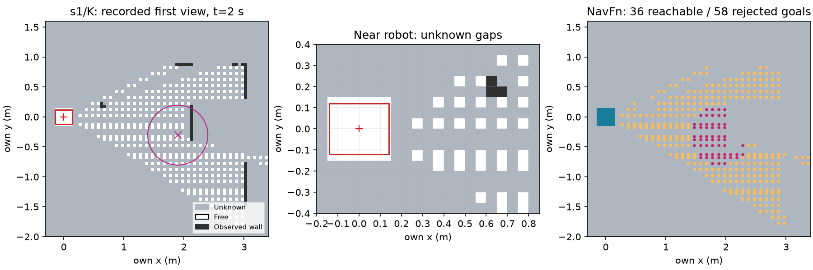

# explore8 결과 — frontier 오라클 실패, 현실 잡음 미실행

사전 등록 `e37ed7cb` → 새 K/L32쌍·평가 소스 봉인 `5fe223f0`을 push한 뒤 각 조건1회 실행했다.
선행 I/J32 결과와 합산하지 않는다. public_ros_v5의93개 소스·설정은 그대로이며 새 등록/평가4파일을
합친97개 hash가 실행 전후/최종 검증에서 일치한다. [사전 기준](README.md) bytes도 보존한다.
이번 GT 자세는 사용자 지정 평가 오라클에만 주입하며 자기 지도에는 자기 관측만 쓴다.

| 새 K/L32 조건 | 참 B | 거짓 B | coverage 중앙 | B 확인 거리 중앙 | B 확인 modeled 시간 중앙 | 충돌 / 잘못된 문 | 거짓 passage / 문 시도 |
|---|---:|---:|---:|---:|---:|---:|---:|
| 정적 지도 + GT 자세 | 32/32 | 0 | 59.47% | 3.685 m | 96.5 s | 0 / 0 | 4 / 38 |
| 자기 frontier + GT 자세 | 0/32 | 0 | 17.25% | — | — | 0 / 0 | 0 / 0 |

frontier의 모든 실행은 **첫 관측1회, 이동0 m, 종료2 modeled s**다. 이를 B 도착 시간0/2초로
표현하지 않는다. 양쪽 성공 쌍이0이므로 거리·시간비는 미정이며 효율 기준 실패다.
정적의 거짓 passage4회(s4/K 각 seed2)는 원 지표 그대로 기록한다. 정적 B32/32가 모든 안전
기준 통과를 뜻하지 않는다. frontier 안전은 문 시도0이므로 통과 처리하지 않는다.

| 원 다섯 기준 | 결과 |
|---|---|
| 입력·off 회귀·source/settings 동결 | 통과 (GT pose만 명시 예외) |
| 참 B ≥26/32, 거짓0 | 실패: 0/32, 거짓0 |
| 공통 성공의 거리·시간비 중앙 ≤2 | 실패: 공통 성공0 |
| coverage 중앙 ≥40% | 실패: 17.25% |
| 충돌/잘못된 문/거짓 passage0, 문 시도≥1 | 실패: 실제 문 시도0 |

**1/5 통과. 현실 잡음 조건0회, S2 s1050–s1051 noise fitting/선택0, 재튜닝0.**
B v3 recall79.41%는 다음 현실 조건용으로 동결돼 있지만 이번 완전 검출 오라클에는 적용하지 않는다.
이번 실패를 B v3 recall/자세 잡음 탓으로 돌릴 수 없다. 이 결과 뒤 새 설정이나 수정 후보를 실행하지 않았다.

## 실패 분해: 관측 표본과 자기 격자 해상도의 연결 단절

[32건 원장](results/diagnosis.json), [맵·시작별 표](results/diagnosis-table.md),
[64회 전체 표](results/episodes.csv). 아래는 저장된 첫 관측만 복원한 분석이며 에피소드 재실행이 아니다.

1. **자기 지도 구성:** 바닥 입력 표본은 기존 평가기의0.10 m 격자지만 v5 지도는0.05 m다.
   `ObservedGrid.observe`는 표본 하나를 한 칸에만 넣는다. 샘플 사이 미관측 칸을 채우지 않아
   free 표본이 연결되지 않는다. 현재 footprint를 free로 만드는 원 처리도 적용되어 있으나,
   모든32건에서 출발점 연결 성분은 **36칸**, 전체 통행 가능 성분은 **281–437개**다.
   첫 바닥 표본의 전방 x는0.2982 m로, 발밑 support와 근거리 관측 사이 틈도 남는다.
   이는 카메라 관측→격자 어댑터와 시작 연결의 한계이며 원 NavFn 알고리즘 자체의 실패를 뜻하지 않는다.
2. **frontier:** 원 explore_lite는 unknown/free 경계의8-neighbor 군집을 만든다. 흩어진 free 사이의
   unknown 경계가 이어져 각 실행에서 큰 frontier1개로 합쳐진다. 카메라 어댑터는 그 중심0.5 m
   이내의 free 후보를 고른다. 32건 **총2,044후보 모두 출발 연결 성분 밖**이고 원 NavFn이
   모두 빈 경로를 반환했다. connector 검사 거부0, 유효 경로0이다.
3. **종료:** `ABORTED_unreachable`32회 → blacklist → `exploration_finished_no_frontier`32회다.
   다른 frontier가 없으므로 첫 관측 뒤 종료한다. progress timeout/회복 소진/물체 재충돌은 이번
   직접 원인이 아니다. 원장이 모두 command0·B 가시 프레임0이라 FOV를 새로 돌리거나 B 누적을
   시작할 기회도 없었다. B 검출기 확인 실패와 경로 출발 실패를 분리한다.
4. **오라클/복원 확인:** 64회 총1,120 관측의 actor pose가 평가 GT start-relative pose와
   수치상 정확히 같았다. frontier32개 지도 log-odds를 저장본과 완전히 동일하게 복원했다.
   자세 오차나 평가 중 설정 변경으로 이 단절을 설명할 수 없다. 실패 유형들은 한 연쇄이므로 합산하지 않는다.



대표 s1/K: 출발 연결36칸, 전체295성분, 중심 주변58후보 모두 NavFn 경로 없음.
그림의 빨간 외곽은 padded footprint, 자홍 원은 원0.5 m 목표 탐색 범위다. 오른쪽 청록은 출발
연결 성분, 노랑은 다른 통행 가능 칸, 자홍점은 거부된 후보다. 실제 세계가 이처럼 구멍 난 바닥이라는
뜻이 아니라 **저장된 자기 costmap의 unknown 처리**를 보여 준다. 임의 free 확장/틈 보간은 하지 않았다.

## 확인한 원본·어댑터 위치

| 단계 | 고정 소스와 근거 |
|---|---|
| 관측 표본0.10 m | `experiments/2026-10-07-mapfree-explore/code/grid_world.py:120–123`; oracle도 동일 floor 표본의 FOV/occlusion을 사용 |
| 지도0.05 m / 단일 칸 삽입 | `harness/public_navigation_resolution.py:15,70–73`, `harness/own_map_navigation.py:112–122` |
| footprint만 free / 미관측 유지 | `harness/public_navigation/costmap.py:78–93`, `harness/public_navigation_persistent.py:293–308` |
| frontier 군집 | [m-explore 원본 L125–188](https://github.com/hrnr/m-explore/blob/26d4183a4fe119a0f83685ce3e06370c0c4d21d9/explore/src/frontier_search.cpp#L125): frontier8-neighbor 연결, unknown의4-neighbor free 검사. 로컬 vendored 원문 재확인 |
| 카메라 목표 선택/종료 | `harness/public_navigation_persistent.py:170–203`: 관측 free 중심0.5 m 후보, 실패 blacklist, 소진 종료. 이는 카메라 제약의 어댑터이며 원 ROS 전체 실행과 구별 |
| NavFn unknown | `third_party/mapfree_navigation/navigation/navfn/src/navfn.cpp:228–256`; allow_unknown=false인 기존 bridge/원 cost 변환. 실제2,044회 빈 경로 반환 확인 |

기존 revision·라이선스·원문 URL은 [공개 구현 REFERENCES](../2026-10-07-mapfree-public-navigation/REFERENCES.md),
[v3 줄 대조](../2026-10-07-mapfree-navigation-persistence/REFERENCES.md)에 보존돼 있다. 이번에
NavFn/explore_lite/관측/회복/unknown 처리 소스는 고치지 않았다. **공개 코드 이식 + 정적 지도 관문
통과만으로 제한된 카메라 관측의 탐색 가능성이 보장되지는 않는다.** 이 지점에서 요청대로 멈춘다.

## 검증·보존

- 관련 시험9개 통과: 새 평가/GT bridge4 + 기존 v5/off/기하5. off byte 경로·기존 원본 소스 비교 포함.
- 원64 result.json과 집계 일치, 사전32쌍×2조건 분모 일치, 고정97파일 일치, 기존 정적32 관문
  원본도 확인했다. [검증 영수증](results/verification.json), [관문](results/gate.json).
- raw579파일58,667,905 bytes는 `/Users/changmin/projects/ugrp/outputs/mapfree-frontier-oracle-v1/`에
  보존한다. [파일별 SHA-256](results/raw-manifest.json). GitHub에는 소스·요약·그림·해시를 남기며
  raw 원격 백업 완료로 표현하지 않는다. 관리 session `explore8-frontier-oracle` 정상 종료.
- 디스크 보고 free46.21 GiB. MuJoCo/물리/렌더/모델0, 패키지 설치0, 타 worktree 수정0,
  사용자 미추적4파일 보존. modeled time만 보고하며 timing 측정/잠금 없음.
- TensorBoard는 앞선 사용자 면제, Drive는 프로젝트 예외대로 생략. #409 DRAFT 유지·병합 없음.

보고 재생성(읽기 전용 자료 분석, 탐색/시뮬레이터 실행 없음):

```sh
PYTHONPATH=outputs/self-map-plot-deps /Users/changmin/projects/ugrp/.venv-sim-worker-mac/bin/python experiments/2026-10-07-mapfree-frontier-oracle/code/report.py --raw /Users/changmin/projects/ugrp/outputs/mapfree-frontier-oracle-v1
```
