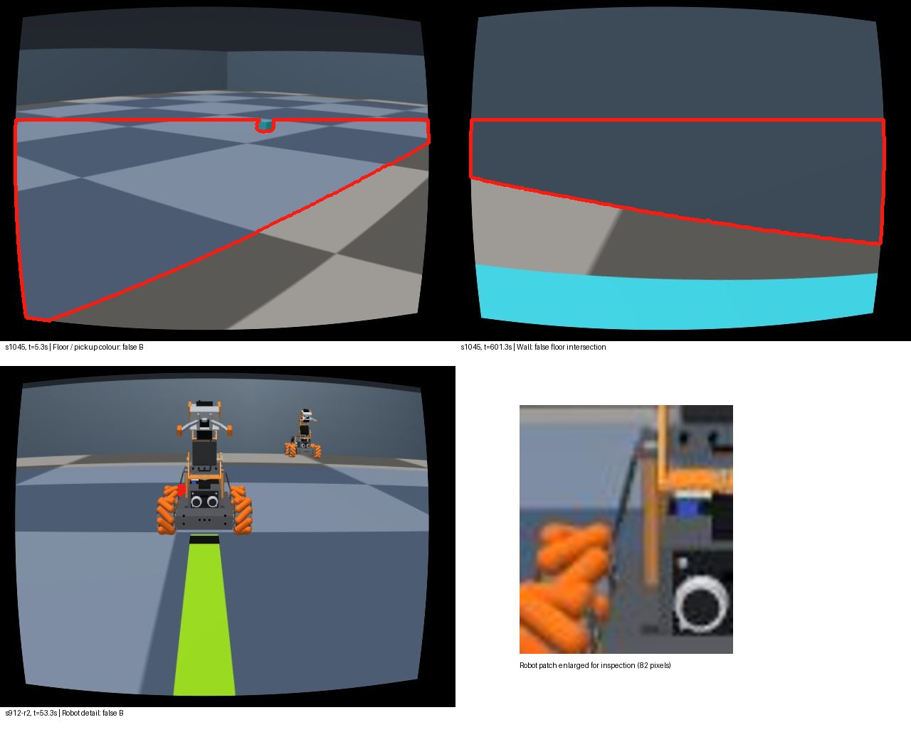
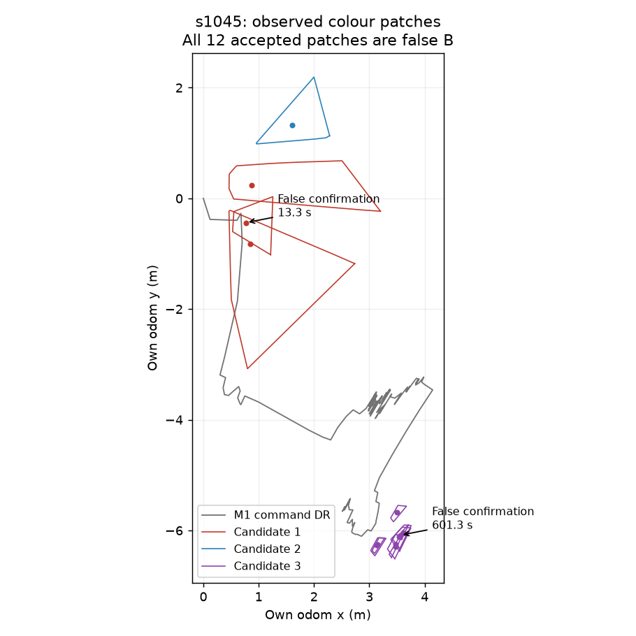

# D — 자기 RGB의 바닥 색 목적지 B (2026-10-07, 오프라인)

## 1. 작업 경계·선행 지도 동결

사용자 요청에 따라 PR #405 지도 알고리즘은 `f3eeb6bf`에서 동결한다. s911–s913 구 녹화 기반 지도 튜닝을
중단하며 현행 v7·카메라 v3 녹화가 준비되면 별도 재검증한다. 이번 작업은 설계서
`/Users/changmin/projects/ugrp/outputs/mapfree-design-20261006/DESIGN.md` §6(D), §9의 바닥 색 모듈이다.
다른 worktree·기존 지도 알고리즘·시뮬레이션·카메라·환경 색을 수정하지 않는다.

PR #405의 추적 파일이 깨끗하고 HEAD=원격=`f3eeb6bf`임을 확인한 뒤, `origin/main=b07f33ab`에서
`claude/mapfree-goal-floor`를 만들었다. 자기 명령 DR/좌표·메모리 경계를 재사용하려고 #405를 병합했다
(`1d3f16cd`, 관련 시험 51 passed). 기존 미추적 4개 파일은 해시를 기록하고 보존했다.
새 PR은 #405 위에 쌓는 DRAFT이며 둘 다 병합하지 않는다.

## 2. 구현 전 성공 기준·자료 분리

**이 절을 구현 전에 커밋한다.** 검출은 자기 RGB와 명시적 목적 색, 고정 K/D·mount 및 자기 팔/이동 명령,
자기 출발점 기준 추정 pose만 사용한다. 정적 지도·평가 pose·다른 로봇 관측/지도·깊이·segmentation·ray
정답을 검출기에 넣지 않는다. 예측 산출물을 저장한 뒤 별도 평가가 정답을 읽는다.

현재 기록의 B는 공개 팔레트상 blue다. pickup도 비슷한 파랑이므로 색만으로 의미를 구분할 수 있다고
가정하지 않는다. 새로운 고유 색으로 환경을 바꾸거나 GT 위치로 둘을 구분하지 않고 오검출로 집계한다.
완전히 다른 hue인 cyan·A/C도 음성 대조로 남긴다. 전체 목적지 윤곽은 알려주지 않으며 관측된 patch의
중심·범위만 누적한다. 확신도는 색/투영/반복 관측의 휴리스틱 점수이고 보정된 확률이라고 부르지 않는다.

| 기준 | 사전 문턱·분모 |
|---|---|
| off 호환 | 기본/명시적 `goal_detection=off`의 기존 memory·정적 B 반환 bytes 동일 |
| 입력·기하 | 외부 로봇/중복·역순/비유한 입력 거부; optical z>0·floor t>0; 비정착/먼 점 제외; GT 제어 입력 0 |
| B 검출 | 평가 가능한 표본에서 component precision ≥0.90 및 B 가시 프레임 recall ≥0.80, 녹화별 별도 판정 |
| 중심 투영 | 참 B component의 보이는 patch 중심에 대한 카메라 투영 오차 median ≤0.20 m, P95 ≤0.40 m |
| 누적 위치 | 출발 GT 변환 1회만 적용한 자기 odom 후보 중심 오차도 별도 보고; 투영 오차와 합산 금지 |
| 최초 확인 | 충분한 서로 다른 자기 관측 3개·≥2 s·시점 이동 ≥0.05 m 또는 5° 이후 확인; 거짓 B 확인 0 |
| 자료 부족 | B 가시 양성/참 검출/독립 camera GT가 없으면 recall/중심 오차 N/A, 통과로 대입하지 않음 |

현재 녹화 **s1042/1043/1044 pick** 및 **s1045 S2 full(place)**를 각각 평가하며 구 녹화
**s911/s912/s913 × r1/r2**는 별도 표로 둔다. 검출·누적은 첫 프레임부터 **2.0 s 간격으로 선택**하고
마지막 프레임도 포함한다. 이는 저장 RGB의 표본 재생이며 전체 20 Hz 처리 성능이 아니다.
최초 확인 시각도 이 표본열 기준이다. 분모·선택 프레임·누락을 manifest에 남긴다.

개발은 s1042, s911-r1/r2이며 설정을 먼저 고정한 뒤 나머지 자료를 확인 재생한다. 이미 보유한 자료이므로
신규 확증 실험이라 부르지 않는다. 같은 자료를 반복 튜닝하지 않는다. 양성 부족·오검출·보정 실패를
성공처럼 보고하지 않는다. v3 pick 3건은 실제 camera pose 기록이 없어 RGB 독립 수동 가시성 라벨을 쓰고
정확한 투영 중심 정답은 N/A로 남긴다. s1045의 별도 camera-pose 기록 및 구 녹화의 camera labels는
평가에서만 사용한다. 가림이 명확하지 않은 픽셀/프레임은 미판정으로 따로 집계한다.

## 3. 표준법·고정 초기 옵션

[OpenCV HSV/inRange 공식 예제](https://docs.opencv.org/4.13.0/da/d97/tutorial_threshold_inRange.html),
[평면 homography 설명](https://docs.opencv.org/4.13.0/d9/dab/tutorial_homography.html),
[fisheye undistortPoints](https://docs.opencv.org/4.13.0/db/d58/group__calib3d__fisheye.html)를 확인했다.
색 분할 뒤 연결 영역·morphological opening, 보정 광선의 바닥 교차, 자기 좌표 변환을 따른다.
raw 어안 영상에 직접 homography를 적용하지 않는다. SAM/모델 호출·새 라이브러리는 쓰지 않는다.

- 입력은 uint8 RGB, 내부 OpenCV H=0..179, S/V=0..255. 기본 목적 색 blue H=100..130, S≥35,V≥30;
  wrap hue도 지원한다. 3×3 opening, 최소 64 px. 수치는 팔레트 기반 개발값이며 문헌의 보편 문턱은 아니다.
- 바닥 ROI는 하단 65% 및 명령 카메라의 하향 광선. optical/평면 분모 양수 조건, 하향 성분 <−0.05,
  카메라 거리 ≤4 m를 만족해야 한다. 영역 둘레 중 저채도(S≤55,V≥30) 바닥 연결 ≥35%를 요구한다.
  이것이 같은 색 물체/벽의 완벽한 제거를 보장하지 않으며 오검출 종류를 평가한다.
- `harness.visual_arm.camera_extrinsics`와 `markerless_box._pixel_ground_point`의 FK/광선 처리 재사용.
  v3는 #401의 공개 고정 mount (52.982,0,28.152) mm·tool-relative +10°를 기존 FK에 합성한다.
  보정된 실제 mount라고 주장하지 않는다. 입력 RGB의 legacy/v3 profile은 명시적으로 구분한다.
- 자기 map pose는 #405 `CommandOdometry`의 M1 명령 모델(정답/측정 관절 없음)을 재사용한다.
  v7에 새로 맞춘 모델이 아니므로 v3 자료의 지도 좌표 오차는 별도 한계다. 위치 보정/지도 튜닝은 하지 않는다.
- 관측 patch convex hull·중심·AABB·품질/시각/frame ID를 자기 namespace에 저장한다. 관측된 0.1 m cell의
  합집합만 누적하고, GT B 크기·윤곽을 채워 넣지 않는다. 후보는 기존 bbox와 ≤0.30 m 근접한 관측끼리 묶는다.
  3회/2 s/시점 변화 조건을 채우면 `locally_confirmed_region`, 그 전은 `visually_seen`; 처음은 `unknown`.
  다른 로봇 말에 의한 `heard_candidate`는 별도 확장 경계이며 이번 구현에 peer 입력은 없다.

`goal_detection=floor_color_v1`은 opt-in, 기본 off는 기존 정적 지도 B 경로를 보존한다. on에서 unknown이면
정적 B로 fallback하지 않는다. 도착·배달 성공 판정이나 이동 명령은 만들지 않는다. simulation·render·model 0,
원본 보존, timing 측정 없이 진행한다. 같은 원인으로 두 번 막히면 멈추고 보고한다.

## 4. 구현 경계·평가 규약 고정 (재생 전)

- 구현 `harness/floor_goal.py`, 메모리 어댑터 `SelfWallMemory.observe_goal_rgb`/`goal_target`.
  `goal_detection=floor_color_v1`은 `self_map=odom_grid_v1`를 요구한다. 이번 재생은 보정 off의 기존 M1 DR만
  쓴다. 팔의 자기 명령·정착 게이트를 사용하고 실행기/이동 제어에는 연결하지 않은 오프라인 API다.
  off의 `goal_target(static_B)`는 동일 객체/바이트를 반환하고 snapshot에는 새 키도 생기지 않는다.
  on은 `self_goal`에 자기 namespace, 관측 patch 중심/범위/신뢰도/시각과 누적 후보를 넣는다.
- `tests/fixtures/floor_goal/pre_goal_snapshot.json`은 변경 전 `6bb14930`에서 생성한 기본/odom-grid snapshot이다.
  기본 off와 명시 off의 바이트 동일성, 정적 B bytes 동일성, 색·hue wrap·어안 왕복 투영·양의 깊이·정착·
  자기 관측/중복/역순·다중 시점 누적을 시험한다. venv는 기존 `.venv-sim-worker-mac`이며 설치 변경 0.
- 평가의 양성 프레임은 실제 가시 B가 **64 px 이상**인 표본이다. 참 component는 accepted pixel의 ≥50%가
  독립 B 가시 mask에 겹치는 경우다. frame recall 분모는 양성 프레임 전체(검출 ROI/정착/거리로 줄이지 않음),
  precision 분모는 모든 accepted component다. 픽셀 precision/recall과 혼동하지 않는다.
- 실제 camera pose가 있는 자료는 저장된 pose·K/D로 각 pixel 광선을 B 바닥 높이 0.0011 m와 교차시키고,
  저장 scene의 정적 벽 box가 앞을 가리면 제외한다. 이 **가시성 상한**에도 B가 없으면 다른 물체의 가림을
  추가해도 B가 생길 수 없으므로 음성 판정 가능하다. 상한에 B가 남으면 RGB에서 물체/로봇 가림을 별도 검수하며,
  검수가 없으면 그 프레임은 미판정이다. MuJoCo 로드/forward/render/ray 호출은 하지 않는다.
- 오류원은 GT camera가 있는 경우 component 광선의 첫 정적 벽/바닥 영역으로 나누고, 물체 가림 가능성은
  따로 검수한다. 실제 camera가 없는 pick 3건은 RGB 음성 라벨만 사용하여 위치 기반 오류원·거리 오차를
  만들지 않는다. `manual_visibility.json`은 단일 시각 검수자/축소 contact sheet 판독이라는 한계를 가진다.
- 중심 오차는 참 component의 **동일 관측 pixel**을 GT camera로 바닥 투영한 평균과 비교한다.
  현재 GT base pose로 변환한 카메라 오차와 출발 GT SE(2) 한 번만 적용한 own-odom 오차를 따로 낸다.
  GT 전체 B 중심까지 거리를 관측 patch의 투영 오차로 대체하지 않는다.
- `cases.json`의 개발 3건을 재생하고 소스/옵션 해시를 고정한 뒤 확인 7건을 재생한다. 개발 실패가 있어도
  이번 고정 후보를 자료에 맞춰 재튜닝하지 않는다. source/예측/mask/input RGB 해시를 저장하고 평가를 분리한다.

## 5. 고정 후보 결과 (성공 아님)

예측 소스 **`7e6c887d`**, 사전 등록 **`6bb14930`**. 개발 s1042·s911-r1/r2 →
[`freeze.json`](freeze.json)의 코드/옵션 해시 봉인 → 확인 7건. 개발/확인 모두 같은 설정이며 튜닝 0회다.
원본 전체 **779개 2 s 표본**을 재생했다. 이는 10개 녹화의 개발 진단이고 신규 확증 코호트가 아니다.

**B가 실제 보인 양성 표본이 없다.** s1045 346개 + legacy 252개는 저장된 실제 camera pose를 이용한
640×480 전체 광선/정적 벽 가림 검사에서 B 가시 픽셀 상한이 **매 프레임 0 px**다. 동적 물체의 가림은
이를 늘릴 수 없다. s1042–1044 181개는 RGB 접촉표 수동 판독 음성이며 실제 camera pose가 없어 같은
기하 보증은 없다. 축소 판독/단일 검수자 한계 때문에 작은 양성의 누락 가능성은 별도 남긴다.

### 현행 카메라 v3 녹화 (구 녹화와 합산하지 않음)

| 녹화·역할 | 표본 / B 가시 | TP / FP component | precision | B-frame recall | patch 투영 median / P95 (m) | own-odom 오차 (m) | 최초 참 확인 / 최초 거짓 확인 (s) |
|---|---:|---:|---:|---:|---:|---:|---|
| s1042 pick·개발 | 70 / 0¹ | 0 / 3 | 0% | N/A | N/A | N/A | 없음 / 없음 |
| s1043 pick·확인 | 56 / 0¹ | 0 / 1 | 0% | N/A | N/A | N/A | 없음 / 없음 |
| s1044 pick·확인 | 55 / 0¹ | 0 / 1 | 0% | N/A | N/A | N/A | 없음 / 없음 |
| s1045 S2 full(place)·확인 | 346 / 0² | 0 / 12 | 0% | N/A | N/A | N/A | 없음 / **13.3** |

¹ RGB 수동 음성. ² 실제 camera trace·정적 벽 가시성 상한 0. 시간은 녹화의 sim timestamp이며 재생 wall 시간이 아니다.
s1045는 세 후보 중 **2개가 거짓 확인**됐다(13.3 s와 601.3 s). 같은 바닥·벽을 3회 이상 다른 시점에서
보는 것만으로 목적지 의미를 검증할 수 없었다. s1045가 full `place` 단계까지 진행한 사실은 B 바닥이
자기 카메라에 들어왔거나 목적지 도착을 검증했다는 뜻이 아니다.

### 구 카메라·구 구동 녹화 (지도 튜닝 자료로 재사용하지 않음)

| 녹화·역할 | 표본 / B 가시 | TP / FP component | precision | recall | 투영 median / P95 (m) | own-odom 오차 (m) | 최초 참/거짓 확인 |
|---|---:|---:|---:|---:|---:|---:|---|
| s911-r1·개발 | 48 / 0 | 0 / 2 | 0% | N/A | N/A | N/A | 없음 / 없음 |
| s911-r2·개발 | 48 / 0 | 0 / 0 | N/A | N/A | N/A | N/A | 없음 / 없음 |
| s912-r1·확인 | 39 / 0 | 0 / 2 | 0% | N/A | N/A | N/A | 없음 / 없음 |
| s912-r2·확인 | 39 / 0 | 0 / 2 | 0% | N/A | N/A | N/A | 없음 / 없음 |
| s913-r1·확인 | 39 / 0 | 0 / 2 | 0% | N/A | N/A | N/A | 없음 / 없음 |
| s913-r2·확인 | 39 / 0 | 0 / 0 | N/A | N/A | N/A | N/A | 없음 / 없음 |

빈 분모는 0/100%로 채우지 않았다. **precision 문턱은 평가 가능한 8건 모두 실패, 2건 N/A**.
recall·투영 정확도는 전부 판정 불가이며 전체 성공으로 판정한 녹화는 없다. 거짓 확인 0 기준은 9건에서
만족하고 s1045에서 실패했다. 양성 GT mask가 필요한 자료에 대해 현재 evaluator는 추측으로 TP/오차를
만들지 않고 `unscored`를 낸다. 이 코호트에서는 그런 미판정 프레임도 0개다.

### 비슷한 색 오검출

accepted component 25개를 모두 RGB 윤곽으로 검수했고 작은 로봇 패치 2개는 원본 해상도에서 확대 확인했다.
[`false_components.json`](false_components.json)의 분류는 component의 지배적인 보이는 표면이다.
광선/정적 지도만으로 물체를 바닥으로 오분류하지 않도록 시각 검수와 정적 ray 분류를 별도로 저장했다.

| 코호트 | 바닥 체크무늬/pickup 계열 | 벽/벽 경계 | 로봇 | 별도 cargo | 합계 |
|---|---:|---:|---:|---:|---:|
| camera v3 4건 | 10 (58.8%) | 7 (41.2%) | 0 | 0 | 17 |
| legacy 6건 | 3 (37.5%) | 3 (37.5%) | 2 (25.0%) | 0 | 8 |

일반 바닥과 pickup의 파란 tint를 RGB만으로 확실히 구분하지 못해 묶어 표기했다. A/C 별도 구역을
검출했다고 단정하지 않는다. cargo 오검출 0은 이 표본의 accepted component 기준이지 물체 배제 성능
인증이 아니다. 중립색 둘레 연결과 반복 관측은 같은 색 바닥·벽·로봇 세부를 제거하기에 불충분했다.





그림의 hull은 관측 범위를 보여 주는 외곽선이다. 메모리에는 그 내부 전체를 채우지 않고 관측 pixel이
실제로 투영된 0.1 m cell만 쌓았다. RGB는 원본 녹화의 평가용 복사 그림이며 원본을 수정하지 않았다.

## 6. 옵션·사용 경계·남은 검증

| 옵션/API | 기본값 | on 또는 동작 |
|---|---|---|
| `goal_detection` | `off` | `floor_color_v1`: 자기 색 patch와 후보 누적 |
| `self_map` | `off` | goal on은 `odom_grid_v1` 필요; 이 재생은 기존 M1 DR |
| `goal_detection_options` | §3 `FloorGoalOptions` | HSV/ROI/광선·연결/격자·association 문턱 명시; 이번 확인 중 변경 0 |
| `camera_profile` | 호출 시 명시 필수 | `legacy` / `camera_v3`; RGB 녹화 보정과 일치해야 함 |
| `observe_goal_rgb` | goal off면 아무 동작 없음 | RGB·self ID·frame ID·시각·commanded servo만 받음 |
| `goal_target(static_B)` | 기존 static_B 동일 객체 반환 | on에서는 자기 후보 또는 `unknown`, static fallback 없음 |
| `snapshot()['self_goal']` | off면 키 없음 | own-odom 중심/관측 범위/신뢰도/관측 수·시각·상태 |

메모리의 상태 흐름은 `unknown → visually_seen → locally_confirmed_region`이다. `heard_candidate`는
설계의 향후 대화 입력 경계로 남겼으며 이번 모듈에는 peer 지도/관측 주입 API가 없다. `locally_confirmed_region`
역시 **검출 규칙상 반복 확인**이지 GT 목적지 인증이나 도착 성공 판정이 아니다. 실시간 executor·LLM 요청·
이동 제어에는 연결하지 않은 오프라인 구현이다. 지도의 기존 pose correction과 함께 생성할 수 있지만 이번
증거는 보정 off뿐이며, 나중의 pose-graph 수정으로 과거 B patch를 재배치하는 기능은 포함하지 않는다.

검출기와 `SelfWallMemory`에만 새 option/API를 추가했다. 기존 정적 목적지 경로는 바꾸지 않았다.
단위 시험의 정상 투영·양의 깊이 통과는 실제 B 투영 정확도를 대신하지 않는다. **현재 조건에서는 배포/제어
사용 준비가 되지 않았다.** 다음에 필요한 증거는 실제 B가 보이는 자기 RGB와 독립 camera pose, 유사색
음성 라벨이다. 구 자료에 HSV 문턱을 더 맞추지 않았다. 자기 지도 #405는 별도로 동결 상태를 유지한다.

### 출처·환경

- 색 분할/연결 영역: [OpenCV `inRange` 표준 예제](https://docs.opencv.org/4.13.0/da/d97/tutorial_threshold_inRange.html).
  표준 hue wrap과 S/V floor를 사용한다. 여기서 정한 수치 문턱은 문헌 보편값이 아니다.
- 투영: [OpenCV 평면 투영](https://docs.opencv.org/4.13.0/d9/dab/tutorial_homography.html),
  [fisheye 보정](https://docs.opencv.org/4.13.0/db/d58/group__calib3d__fisheye.html).
  `harness/markerless_box.py:_pixel_ground_point`와 같은 보정 광선·전방 평면 교차 원리다.
- FK: `harness/visual_arm.py:camera_extrinsics`, K/D: `sim/masterpi_camera_profile.py`.
  camera v3의 고정 mount는 #401의 `sim/masterpi_camera_review_v3.py` 및 각 녹화 `bundle.json.camera_v3`와
  일치한다. 사용자 관찰 목표/기존 K/D이며 독립적으로 검증된 실물 hand-eye 보정이라고 주장하지 않는다.
- DR: #405 `CommandOdometry`, `experiments/2026-09-26-zone-m1-owncam/calibration_m1_dev.json`,
  SHA-256 `126cadaa9265ed2ae2b034f675e67c227193a2e1678f6b0c82dd53b186e6fc72`.
  v7 재보정/지도 튜닝을 하지 않았으며 위치 오차 보정 성공을 이 작업으로 주장하지 않는다.
- [환경](environment.json): 기존 venv 사용, 새 설치 0. 그림만 기존 `outputs/self-map-plot-deps`를 재사용.
  시뮬레이션·렌더러·모델 호출 0, timing 비교/잠금 0. TensorBoard 변환은 이 대화의 생략 요청을 유지했다.
  초기 접촉표 도구가 시스템 Python의 PIL 부재로 한 번 실패해 기존 venv로 실행했다. 의존성을 설치하지 않았다.

## 7. 재현·산출물·시험

```sh
PY=/Users/changmin/projects/ugrp/.venv-sim-worker-mac/bin/python
$PY -m pytest tests/test_floor_goal.py tests/test_floor_goal_evaluation.py tests/test_self_wall_memory.py -q
$PY experiments/2026-10-07-mapfree-goal-floor/code/replay.py --cases experiments/2026-10-07-mapfree-goal-floor/cases.json --split development --output outputs/NEW-floor-goal-replay
$PY experiments/2026-10-07-mapfree-goal-floor/code/replay.py --cases experiments/2026-10-07-mapfree-goal-floor/cases.json --split confirmation --output outputs/NEW-floor-goal-replay
$PY experiments/2026-10-07-mapfree-goal-floor/code/evaluate.py --predictions outputs/NEW-floor-goal-replay --manual-visibility experiments/2026-10-07-mapfree-goal-floor/manual_visibility.json --false-labels experiments/2026-10-07-mapfree-goal-floor/false_components.json
```

- 로컬 관련 **28 passed**: off bytes 골든, 어안/광선, 옵션/입력 경계, 누적 확인, 가시성 상한의 벽 가림 검사.
  `scripts/run_ci_tests.py`에 새 2개 시험을 등록했다. 전체 로컬 suite/물리 시험은 실행하지 않았다.
- [결과 원장](results.json), [입력 코호트](cases.json), [고정 코드·옵션](freeze.json),
  [수동 가시성 라벨](manual_visibility.json), [오검출 라벨](false_components.json)을 커밋한다.
- 상세 예측/mask/누적 snapshot·평가는 이 worktree의 `outputs/mapfree-goal-floor-v1/`에 있고,
  [artifact hash 목록](artifacts.json)이 경로·크기·SHA-256을 연결한다. raw는 로컬 보관이며 원격 백업으로
  표현하지 않는다. 각 `manifest.json`은 사용한 모든 RGB·명령·프레임 인덱스 해시를 보존한다.
  평가가 예측 파일을 변경하지 않았고 10건 모두 source/options/prediction hash가 봉인과 일치함을 확인했다.
- 기존 미추적 4개 파일의 해시 불변, #405의 HEAD `f3eeb6bf`·DRAFT 유지. 새 DRAFT PR은 #405 위에 쌓는다.
  양쪽 PR 모두 병합하지 않는다.

## 8. floor_color_v2 사전 등록 (구현·렌더 전, 2026-10-07)

사용자가 정적 렌더 시험을 명시적으로 허용했다. §1–7은 v1 당시의 무렌더 기록으로 보존한다.
v1/off/자기 지도 알고리즘은 그대로 두고 `goal_detection=floor_color_v2`를 추가한다. 물리 적분·시뮬레이션
주행·모델 호출 없이 `mj_kinematics`/`mj_camlight`와 RGB/평가 segmentation 렌더만 한다. 정답 마스크·
세계 pose·장면 재질은 평가/개발 임계값 선정에만 쓰고, 추론과 자기 기억에는 RGB/고정 보정/자기 명령만 준다.

**이 절과 [격자 설정](v2-registration.json)을 구현 전에 커밋한다.** 기존 거짓 component 25개의 실제
HSV 분포·표면 종류와 scene XML 재질/조명/alpha를 먼저 분석한다. 원본 재질 RGB 거리와 렌더된 RGB의
HSV는 다르며, alpha 혼합/조명을 특정 단일 원인으로 단정하지 않는다.

| 성공 기준 | 사전 고정 분모·문턱 |
|---|---|
| 프레임 precision | TP/(TP+FP) ≥0.95; 검출한 프레임 전체, 잘못된 구역 검출도 FP |
| 프레임 recall | TP/(TP+FN) ≥0.90; **실제 보이는 B 마스크 ≥256 px**인 프레임 전체 |
| TP 공간 일치 | accepted component pixels의 ≥50%가 B 마스크와 겹침; 양성 프레임에서 엉뚱한 패치만 검출하면 FP와 FN 모두 기록 |
| 작은 B | 1–255 px 프레임은 주 판정에서 별도 미판정; 0 px 음성과 섞지 않음 |
| 중심 투영 | TP component의 동일 관측 B pixel을 GT 카메라로 투영한 중심 대비, 명령 FK 기반 중심 오차 median ≤0.10 m; P95도 보고 |
| 거짓 확인 | 독립 음성 3-view 묶음/기존 음성 녹화에서 거짓 confirmed region 0; 확인된 참 region 수도 함께 보고 |
| 호환·경계 | default/explicit off golden bytes 동일, v1 snapshot/검출 bytes 동일; GT·peer 추론 입력 0 |
| 판정 불가 | 양성/TP/음성 확인 기회가 없으면 N/A, 통과로 대입하지 않음 |

정적 집합은 s1045의 저장 `scene.xml`(SHA는 JSON에 고정), 현행 camera v3 mount·실제 K/D·640×480,
base 높이 0.0325 m와 녹화에 실제 쓰인 SEARCH/HIGH servo 명령을 그대로 쓴다. 팔 pitch/카메라 FOV를
B가 잘 보이도록 바꾸지 않는다. B/A/C/pickup 4개 중심 앞 거리 0.45/1.0/2.4 m × 좌우 ±0.25 m ×
팔 2자세 × 가림 2조건(original / 기존 r1을 대상 앞 0.15 m에 정적으로 배치) = 96개 묶음이다.
각 묶음은 자기 `turn=0.06(SEARCH)/0.25(HIGH), duration=1 s` 명령을 두 번 발행하는 3-view이며 **총 288장**이다.
이 명령의 기존 M1 DR yaw 변화를 렌더 배치에 적용해 물리 없는 정적 시점열을 만든다. 검출기에 renderer
세계 pose를 반환하지 않는다. 의도적으로 잡음 없는 정적 배치이므로 위치 추정/주행 성능 증거가 아니다.

좌측 lateral −0.25 m의 48묶음/144장은 개발, +0.25 m의 48묶음/144장은 확인이다. 동일 묶음의 3장은
절대 양쪽에 나누지 않는다. 같은 장면의 가까운 격자이므로 독립 실물/새 장면 일반화 검증이라고 부르지 않는다.
목표 물체/벽에 의해 가려지거나 FOV 밖인 조건도 사후 제거하지 않는다. 일부 팔 자세에서 B가 안 보여도
전체 격자를 유지한다. 정적 교차/팔 하중·변형은 물리로 검증하지 않는다.

v2는 표준 HSV + morphology + 연결 성분의 면적/solidity/바닥 연결 + 반복 관측 확인을 사용한다.
개발 B interior pixel의 hue/S 분포만으로 기준 색을 추정하고, JSON의 유한한 32개 임계값 조합을 개발에서만
비교한다. **precision 우선, 그 다음 recall**, 동률이면 작은 변경을 선택한다. 설정/소스/개발 결과를 봉인·
커밋한 다음 확인 영상·마스크를 평가한다. 확인 성능에 맞춰 다시 튜닝하지 않는다. v1 비교도 같은 집합에서
따로 보고한다. 기존 녹화는 유사색 회귀 진단이며 새로운 확인 집합과 합산하지 않는다.

렌더 직전에 `agent_lock.py status == null` 및 시뮬레이션 프로세스 부재를 확인하고,
`--owner codex --purpose "B render testset"`으로 짧게 acquire한다. 드라이버가 `finally`로 release한다.
시간 상한 8분·raw 250 MiB, ENOSPC/렌더 실패는 HOST_ERROR이며 원본을 보존한다. 다른 작업 잠금/프로세스는
건드리지 않고 같은 원인 두 번 실패하면 중단한다. 표준 snapshot의 geom groups 4/5 숨김, raw fisheye remap,
RGB JPEG 품질 95를 고정한다. segmentation은 평가 디렉터리에만 저장하며 투명 바닥 마커의 가시 mask 정의도
렌더 코드/README에 공개한다. 렌더는 기존 녹화와 별도 시험셋이고 물리/실물 검증이 아니다.

출처: [OpenCV HSV](https://docs.opencv.org/4.13.0/da/d97/tutorial_threshold_inRange.html),
[morphology](https://docs.opencv.org/4.13.0/d9/d61/tutorial_py_morphological_ops.html),
[연결 성분·면적·convex hull](https://docs.opencv.org/4.13.0/d3/dc0/group__imgproc__shape.html),
[MuJoCo 기구학/카메라 갱신](https://mujoco.readthedocs.io/en/stable/APIreference/APIfunctions.html),
[공개 Renderer segmentation 구현](https://github.com/google-deepmind/mujoco/blob/main/python/mujoco/renderer.py).
반복 관측 확인은 현재 v1의 3회/2 s/5° 자기 명령 baseline을 재사용하며 문헌 보편값이라고 주장하지 않는다.

사전 배치 점검 정정: `6a5e4110`의 turn=10은 degree처럼 적은 명령 단위 오류였다. 기존 M1의 정규화 명령으로
고쳐 SEARCH/HIGH의 첫 회전이 약 5°가 되도록 했다. 영상/렌더/개발 결과를 보기 전 순수 명령 모델로 확인했으며
격자 수·분할·성공 기준은 변경하지 않았다. 임계값 곱집합은 32개이며 초기 본문의 64는 계산 오기였다.

## 9. v1 거짓 검출의 HSV·재질 원인

[v2-false-hsv.json](v2-false-hsv.json)은 기존 25개 accepted component의 정확한 mask pixel을 집계한다.
영역 이름은 RGB 판독을 먼저 확인하고, 실제 camera GT가 있는 바닥 component에만 평가용 광선/영역
다수결을 추가했다. **v3는 pickup 6·벽 7·구역 불명 바닥 4개**, legacy는 pickup 3·벽 경계 3·로봇 2개다.
s1042/43/44의 바닥 4개는 camera GT 부재로 pickup이라고 확정하지 않는다. A/C·별도 cargo 오검출은 0개다.

| 코호트·지배 표면 | component 수 | HSV P05 | HSV 중앙 | HSV P95 |
|---|---:|---|---|---|
| v3 바닥/pickup | 10 | 106 / 51 / 112 | **108 / 82 / 116** | 108 / 86 / 165 |
| v3 벽 | 7 | 104 / 74 / 85 | **104 / 78 / 88** | 105 / 81 / 101 |
| legacy 바닥/pickup | 3 | 107 / 57 / 114 | **108 / 77 / 117** | 108 / 86 / 164 |
| legacy 벽 경계 | 3 | 101 / 40 / 77 | **103 / 61 / 81.5** | 106 / 93 / 87 |
| legacy 로봇 세부 | 2 | 103 / 39 / 90 | **108 / 58 / 119** | 118.4 / 90.7 / 166.4 |

H는 OpenCV 0–179, S/V는 0–255이며 pixel 수 가중 분위수다. 모두 v1의 H100–130/S≥35/V≥30 안이다.
V>230인 거짓 pixel은 **0개**, V<60은 각 component의 최대 **0.257%**였다. 따라서 이번 거짓 검출을
하이라이트 과노출로 설명할 근거는 없다. 장면 조명은 모두 R=G=B인 diffuse/ambient/specular이며
`castshadow=false`다. 조명의 인과 기여를 분리한 relighting 실험은 하지 않았으므로 광량 변화/면 법선/
alpha 합성의 각각의 기여율은 미확인으로 남긴다.

### scene XML·material 색 거리

[v2-palettes.json](v2-palettes.json)에 사용된 모든 scene의 색·alpha·조명과 SHA를 보존했다. 다음은 s1045의
대표값이며 다른 scene의 원자료도 별도 항목이다. ΔH는 **도 단위의 순환 거리**, RGB L2는 0–1 RGB 거리,
ΔE76은 OpenCV float RGB→Lab 후 유클리드 거리다. 모두 **원본 B RGB=(.20,.40,.95)**에 대한 거리이며
조명/alpha 합성 후 픽셀 거리가 아니다. RGB→Lab을 위해 입력을 sRGB로 해석했으며 렌더러의 광도 보정치가 아니다.

| XML 항목 | alpha | 원본 HSV (uint8) | ΔH (°) | ΔE76 |
|---|---:|---|---:|---:|
| B 바닥 | .30 | 112 / 201 / 242 | 0.0 | 0.0 |
| pickup 바닥 | .14 | 108 / 211 / 178 | 8.8 | 31.8 |
| blumat | 1.0 | 115 / 244 / 224 | 6.0 | 32.3 |
| C 바닥 | .30 | 143 / 195 / 217 | 62.2 | 41.9 |
| 벽 | 1.0 | 106 / 76 / 84 | 14.0 | 76.8 |
| 로봇 v3 hub grey | 1.0 | 109 / 18 / 115 | 4.0 | 79.2 |
| 로봇 aluminum | 1.0 | 104 / 21 / 133 | 14.0 | 79.6 |
| 로봇 hub | 1.0 | 106 / 34 / 82 | 14.0 | 80.6 |
| ground checker 어두운색 | 1.0 | 12 / 14 / 92 | 166.0 | 84.1 |
| cyan cargo | 1.0 | 93 / 182 / 178 | 38.0 | 85.6 |
| ground checker 밝은색 | 1.0 | 23 / 13 / 158 | 176.0 | 86.4 |
| A 바닥 | .30 | 12 / 228 / 242 | 160.7 | 141.8 |

`blumat`의 scene 사용자는 `blue_block_geom`이며 **geom alpha=0/group=5로 비활성**이다. 색이 가깝다고
관측 오검출의 원인으로 잘못 지정하지 않았다. 실제 로봇 오검출은 기존 이미지의 82/152 px 경계 세부다.
중립 ground 위 단순 alpha 합성 proxy에서 B는 H≈112.2–112.5, S≈74–103으로 내려간다.
pickup은 H≈106.5–108.3, S≈23–42다. 이 계산은 단일 층·무조명 근사이며 실제 JPEG의 S≈77–82와 같다고
가정하지 않는다. **재질의 원본 S=201만 보고 S 문턱을 높이면 합성된 참 B를 놓칠 수 있다.**

v2는 이를 검증하기 위해 B 양성 개발 마스크로만 hue/S를 추정하고, 면적/solidity/연결 성분으로 작은 로봇
세부나 불규칙 조각을 검사한다. 문턱 수치를 기존 음성 녹화에 맞춰 미리 확정하지 않았다.

## 10. 개발 선정·확인 전 봉인

정적 렌더 소스 `64fd5fae`, 총 288장/10.3 MiB, `data.time=0`, physics step/forward dynamics 0.
처음에는 S2 실행 잠금이 있어 렌더를 시작하지 않았다. 이후 null을 다시 확인해 짧게 잠금을 획득했고,
288장 생성 뒤 release 및 null을 확인했다. 원본 scene/hash·카메라 보정·288개 RGB/GT 해시는
`outputs/mapfree-goal-floor-v2/static-render/render_receipt.json`에 있다. RGB/GT segmentation 가시 정렬을
개발 contact sheet로 검수했다. B 마스크는 반투명 B paint의 전면 geometry와 흰색 B slot의 가시 footprint다.
RGB alpha·조명은 변경하지 않고 ID 렌더에만 mask를 사용한다. 로봇/벽의 가림을 포함한다.

개발 144장: **B≥256 px 양성 30, B=0 음성 114, 작은 B 0**. 양성 픽셀의 hue 중앙=112,
S P05=87에서 사전 32개 조합을 비교했다. [v2-selection.json](v2-selection.json)에 모든 조합을 남긴다.
최고 frame precision 우선으로 선택한 고정 설정은 **H109–115, S≥77, V≥30, 면적≥128 px, solidity≥0.3**다.
하향 광선 전체 ROI, 중립색 둘레 S≤128/연결≥35%, 최대 4 m, 기존 0.1 m 누적/3-view 확인은 고정이다.

| 개발 v2 | TP / FP / FN | precision | recall | 중심 오차 median / P95 (m) | 참 / 거짓 누적 확인 |
|---|---:|---:|---:|---:|---:|
| 144장, 48묶음 | 29 / 12 / 1 | **70.73% (실패)** | 96.67% | 0.00370 / 0.01125 | 9 / 0 |

정밀도 기준을 못 넘었다. 후보를 추가하거나 문턱/기준을 바꾸지 않고 **같은 설정으로 확인 절반을 평가**한다.
이 절과 설정을 커밋한 뒤에 확인 RGB/마스크를 처음 연다. 색 분할의 실패를 누적 확인 0 오검출로 숨기지 않는다.
투영 오차는 조립된 명령 자세의 정적 FK 조건이며 실물 mount·하중·구동 오차의 검증이 아니다.

옵션: `SelfWallMemory(..., self_map='odom_grid_v1', goal_detection='floor_color_v2',
goal_detection_options=selection['selected']['options'])`. **v2에는 이 봉인 옵션을 명시적으로 전달**한다.
개발 옵션 없이 v2를 요청하면 `GOAL_V2_NEEDS_FROZEN_DEV_OPTIONS`로 거부한다. 기본 `off`와 v1은 동일하며,
그 골든 bytes를 새 시험에 고정했다. 기본 정적 목적지 경로/제어기는 바꾸지 않았다.
