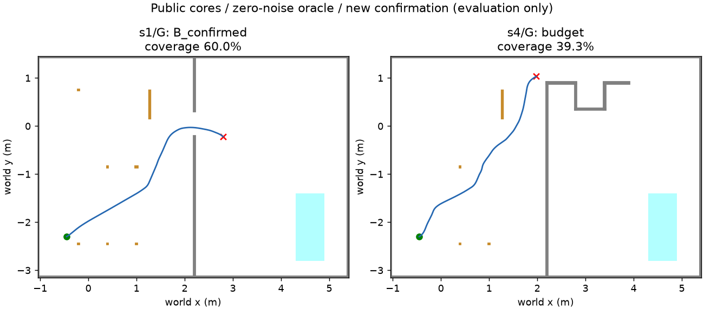

# 공개 navigation 코어 이식: 2D 평가기 교체 (2026-10-07)

## 1. 구현 전 사전 등록

앞선 [v2 §11](../2026-10-07-mapfree-explore/README.md#11-새-확인-결과최종-판정-재튜닝-없음)은
oracle static B8/32, frontier0/32였다. 같은 평가 구조를 더 땜질하지 않는다.
기존 v1/v2 코드·결과를 보존하고 **별도 `navigation=public_ros_v1` (기본 off)** 경로를 만든다.
MuJoCo·렌더·모델 호출·다른 worktree 수정·패키지 설치·기존 raw 삭제 없이 수행한다.
PR #409 DRAFT를 유지하며 병합하지 않는다. 이전 사용자 결정대로 TensorBoard 변환은 생략한다.

### 공개 코어와 어댑터 경계

- ROS navigation NavFn `f44bb1fc2810399165115cc98b530fe4b9397c18`: C++ NavFn 원본을 직접 컴파일·호출.
- explore_lite/m-explore `26d4183a4fe119a0f83685ce3e06370c0c4d21d9`: frontier_search.cpp 원본을 직접 컴파일·호출.
  ROS 메시지/Costmap2D의 필요한 인터페이스만 standalone shim으로 제공한다.
  explore.cpp의 진행 감시·ABORTED/timeout 블랙리스트(5 cell 축별 허용치)는 Python 상태 어댑터로 이식한다.
- PythonRobotics `cdd0cc888802b584c2d654ca85e3c5460973487d`: pure_pursuit.py의 목표점 탐색/조향 함수를 직접 호출한다.
  자동차 dynamics는 사용하지 않고 조향을 body yaw rate로 변환해 기존 M1 역모델로 명령한다.
- ROS 비용 지도: floor worldToMap / 셀 중심 mapToWorld, inscribed radius와 지수 inflation,
  실제 사각 footprint 검사를 분리한다. nav2 RPP의 큰 heading 오차 시 제자리 회전 및 충돌 예측 구조를 따른다.
  새로운 end-to-end ROS 배포 검증이라고 주장하지 않는다. 재사용 원본/포트/UGRP 어댑터를 출처표에서 구분한다.
- unknown은 관측 또는 현재 몸 footprint 이외에 free로 채우지 않는다. 같은 목표는 도달·경로 실패·
  진행 timeout까지 유지한다. 경로 시작은 실제 연속 DR 위치를 사용하고 격자 중심 연결도 충돌 검사한다.

### 변경하지 않는 센서·임무 조건

기존 카메라 v3 SEARCH/CLOSE FOV·4 m·가림, 센서 오류 표본, v7 구조 사전 잡음, M1 명령 평균,
B v3 시간 누적(3회/2 s/병진 .05 m), 600 modeled s/300 관측/40 m 예산을 그대로 쓴다.
정답은 환경/평가에만 있다. static 기준선은 기존 authored map/B + 초기 정렬만 받는다.
새 경로 추종의 제어 주기는 .1 s, 관측 주기는 기존 2 s 정착+1 s 행동이다.
경로 추종 속도 .12 m/s, lookahead .20 m, 위치 허용 .05 m, 회전 목표 속도 .5 rad/s,
heading 회전 임계 π/4, footprint .24×.20 m + padding .02 m, inflation radius .5 m / scaling10,
progress timeout30 modeled s, frontier potential1/gain1/minimum.1 m를 사전 고정한다.
기하/소프트웨어 반례 시험 이외에 확인 결과를 보고 이 값을 조정하지 않는다.

### 코호트와 단계 관문

- 이미 본 64쌍: s1–s8 × B/D ×2701/2702와 E/F×3701/3702. 새 확인에 재사용하지 않는다.
- 개발은 기존 s1–s8×A/C×1701의 **static oracle만** 사용한다. 이미 본 자료임을 표시한다.
- **새 확인:** s1–s8 × G/H × seed4701/4702 =32쌍.
  G=(-.45,-2.30,π/6), H=(1.20,.65,-π/3), 위치 m/yaw rad.
  서로 다른 시작/seed지만 동일 3종 벽 배치이고 oracle에서 두 seed는 같은 결과다.
  시작 충돌/HOST_ERROR도 분모에 남기고 대체하지 않는다.
- 개발 후 소스·설정을 커밋/해시 고정하고 확인을 한 번 개봉한다.
- **(a) 새 확인 oracle + static_map 참 B≥30/32, 거짓 B0**가 평가기 정상의 추가 선행 관문이다.
  **실패하면 (b)(c)를 실행하지 않고 종료·기록한다.** 실패를 숨기기 위한 재튜닝/확인 재실행 금지.
- (a) 통과 시에만 (b) 같은 새 확인의 oracle + frontier. 이후 (c) 현실 잡음의 static/frontier.
  실행기가 소스/코호트와 (a)의 raw 결과를 검사하여 우회 실행을 거부한다.
  oracle frontier의 실패도 그대로 기록한다. (c)에는 (b) 완료 기록이 필요하다.
- CPU wall 속도 비교가 아니므로 잠금을 사용하지 않는다. modeled 시간과 실제 실행 성능을 혼동하지 않는다.

### 기존 성공 기준: 변경 없음

[기존 §2](../2026-10-07-mapfree-explore/README.md#2-구현-전-사전-등록-이-절의-커밋-뒤-구현)의 5개를 그대로 적용한다.

| 기준 | 통과 조건 |
|---|---|
| 입력/회귀 | off golden 바이트 동일, GT/타 로봇 지도/MuJoCo/모델의 제어 유입0 |
| B | 참 B≥80%, 거짓0 |
| 효율 | 양쪽 참 확인 쌍의 거리·시간 비 중앙 각각≤2, 공통 성공0이면 실패 |
| 탐색량 | 직접 본 reachable free coverage 중앙≥40% |
| 안전 | 잘못된 문 시도0, 충돌0, 실제 발행 문 시도≥1 |

(a)의 ≥30/32는 위 성공 기준을 바꾼 것이 아니라 평가기의 선행 자격 검사다.
환경 종료·충돌 라벨은 actor에게 주지 않는다. 문 시도는 경로 계획이 아니라 실제 발행 명령으로 평가한다.
검증 실패·HOST_ERROR/ENOSPC를 원인과 함께 보존한다. 결과는 로컬 raw + Git의 소규모 결과/해시로 남긴다.

## 2. 조사 및 라이선스 (원본 다운로드와 구현 후 상세 해시 추가)

[NavFn BSD-3-Clause](https://github.com/ros-planning/navigation/blob/f44bb1fc2810399165115cc98b530fe4b9397c18/navfn/src/navfn.cpp),
[m-explore BSD-3-Clause](https://github.com/hrnr/m-explore/blob/26d4183a4fe119a0f83685ce3e06370c0c4d21d9/LICENSE),
[PythonRobotics MIT](https://github.com/AtsushiSakai/PythonRobotics/blob/cdd0cc888802b584c2d654ca85e3c5460973487d/LICENSE).
배포에 필요한 copyright/permission/disclaimer 원문을 소스와 함께 보존한다.
[explore.cpp](https://github.com/hrnr/m-explore/blob/26d4183a4fe119a0f83685ce3e06370c0c4d21d9/explore/src/explore.cpp)의
frontier 목표 지속/진행 timeout/ABORTED blacklist를 확인했다. arbitrary free 원판 초기화는 하지 않는다.
[Nav2 RPP](https://github.com/ros-navigation/navigation2/blob/235fc5ce55bdf94d9be360fdbca39d89dc0e4f74/nav2_regulated_pure_pursuit_controller/src/regulated_pure_pursuit_controller.cpp)는
경로 추종 heading·충돌 처리 참고이며 전체 Nav2 서버를 실행하는 것은 아니다.

## 3. 구현/출처 검증 (확인 이전)

원본20개 파일·라이선스·해시는 [SOURCES.json](../../third_party/mapfree_navigation/SOURCES.json),
실행 원본과 포트/어댑터 경계는 [third-party 설명](../../third_party/mapfree_navigation/README.md)에 있다.
원본 NavFn/frontier C++는 바이트 그대로 컴파일하며 PythonRobotics pursuit 함수를 직접 호출한다.
ROS 전체 배포를 이식한 것은 아니다. 비용 지도·진행 감시·명령 adapter는 원문에 대응하는 별도 코드다.
Python/venv 변경 없음, 기존 C++17 compiler와 numpy/scipy/OpenCV 및 기존 plot dependency를 사용한다.
B v3 봉인10파일과 기존 평가기의 센서/잡음/충돌 구현도 그대로다.

단위시험 첫 회에서 (1) 작은 4 m U자 우회+inflation의 NavFn convenience iteration budget 소진,
(2) 두 방향 모두 들어가는 시험 통로를 한 방향 불통으로 잘못 기대한 fixture가 드러났다.
NavFn 원본/ROS wrapper를 확인하고 원본 public propagation 함수를 전체 격자 칸 수 예산으로 호출한다.
탐색 코어·cost는 바꾸지 않는다. 사각 시험은 벽까지 .13 m 여유(half .12/.14 m)인 실제 반례로 바로잡았다.
확인 데이터를 열기 전이며 두 원인과 수정 모두 시험에 남겼다. 나머지 공개 코드/센서 임계값은 바꾸지 않았다.

## 4. 개발 종료·설정 고정 (새 확인 전)

실행 소스 `1482a5ce`에서 기존 A/C×1701 개발16건을 static oracle로만 실행했다.
참 B13/16, 거짓0, 충돌1(s5/C), budget2(s4/A·C)다. s4의 projected footprint 거부는
각1431/1514 control tick이었다. 개발 실패를 포함해 기록하며 **재튜닝 없이 설정을 고정**한다.
[freeze.json](freeze.json)은 실행 소스/모든 재사용 원본·센서·B v3의 해시, 고정 설정,
새 시작점, 개발 결과 해시를 묶는다. 변경 모듈 시험28개 통과(공개 코어10 + 기존v1/v2 18),
v1/off golden 동일. 지금부터 새 G/H×4701/4702 확인32건의 (a)만 한 번 실행한다.

## 5. 확인 결과: 선행 관문 실패, (b)(c) 미실행

사전 등록 `3a8dfbe1` → 공개 코어 이식 `1482a5ce` → 개발 종료/고정 `8416b6b1` →
G/H×4701/4702 새 확인32건의 **(a) oracle static만 한 번** 실행했다. 재튜닝/확인 재실행0.
기존64쌍과 중복0. 아래 세 행은 서로 다른 코호트이므로 합산하거나 같은 조건의 향상으로 해석하지 않는다.

| 코호트 / 실행 | 참/거짓 B | coverage 중앙 | 주행 충돌 | 시작 HOST_SETUP_ERROR | budget | 잘못된 문/발행 시도 | 참 B 거리/시간 중앙 |
|---|---:|---:|---:|---:|---:|---:|---|
| 이전 E/F32 / oracle static v2 (보존 결과) | 8/0 | 25.34% | 8 | 0 | 16 | 0/12 | 6.061 m / 263 s |
| 이미 본 A/C16 개발 / public oracle static | 13/0 | 47.22% | 1 | 0 | 2 | 0/26 | 2.760 m / 71 s |
| 새 G/H32 확인 / public oracle static | **22/0** | **30.01%** | **2** | **4** | **4** | **0/24** | **2.760 m / 71 s** |

**(a) 22/32=68.75% <30/32: 실패.** 시작 충돌4건을 제외하지 않는다. 확인 종료 pose 오차 최대
5.78e-15 m이며 B 가시498/검출498 프레임이다. 이 oracle 결과를 센서 recall 개선으로 해석하지 않는다.
개발 종료 pose 오차 최대 .027 m는 s5/C의 충돌 latch 뒤 남은 정착 시간에 command DR만 진행한 기록이며,
추가 자세 잡음이나 GT 보정이 아니다. 원 평가기 구현을 고치지 않고 보존했다.

(b) oracle frontier 및 (c) 현실 잡음 static/frontier는 **실행하지 않았다**. 실측 결과를 넣은 gate 함수도
`ORACLE_STATIC_GATE_FAILED_STOP_B_C`로 거부하는 것을 확인했다. 기존 성공 기준5개는 변경하지 않았으며
새 탐색 비교는 선행 관문 차단으로 **미평가**다. 공개 frontier 단위시험 통과를 임무 성능으로 보고하지 않는다.

### 실패10건 분해 (seed2개는 oracle에서 동일 결과)

| 설정 | 건수 | 관측된 사실 |
|---|---:|---|
| s1/H, s4/H | 4 | 등록 시작 footprint가 `beam_1`과 겹침. t=0 HOST_SETUP_ERROR, 대체/제외 안 함 |
| s4/G | 2 | 초기 경로 존재, 200프레임 경로 존재. 각600 s budget, 충돌 예측 거부1640 tick, B 가시0. 끝 (1.981,1.035,.493), 실제 접촉0 |
| s5/G | 2 | 초기 경로 존재, 뒤169프레임 no_path. 각600 s budget, 충돌 예측 거부1687 tick. B170/170검출이나 3회 이상 track의 병진 최대8.28e-14 m로 .05 m 조건 미달 |
| s8/H | 2 | t=2.7 s `can_1` 실제 사각 접촉, B 가시0. 숨은 물체 위치를 actor에 주지 않음 |

공개 글로벌 경로/사각 로컬 충돌 검사/좁은 시야 입력의 통합은 아직 평가기 자격을 통과하지 못했다.
위치/검출 잡음0에서도 경로 정지와 관측 전 물체 접촉이 남는다. 이번에는 설정·센서·시작점을
다시 고치지 않고 중단한다. 이전 구 녹화 벽 통계와 실측이 아닌 v7 과정 잡음의 한계도 그대로다.
**현행 v7·카메라 v3 실녹화 재검증 필요**, 2D 성공도 물리/실물 성공이 아니다.



[48건 전체 표](results/tables.md) · [분리 요약/선행 판정](results/summary.json) ·
[확인 funnel](results/confirmation-funnel.json) · [실패별 정답 접촉/끝 자세(평가 전용)](results/failure-details.json).

## 6. 옵션·재현·보존

| 옵션/경로 | 기본/동작 |
|---|---|
| `navigation=off` | 기본. `navigation_output`은 기존 객체/bytes 그대로 반환. 기존 v1/v2 runner와 API 불변 |
| `navigation=public_ros_v1` | 명시적으로 새 2D runner에서 선택; native NavFn + native frontier + pursuit/own-command adapter |
| `--stage a` | oracle static, 확인 true≥30/32·false0 선행 관문 |
| `--stage b --gate-a …` | 동일 소스/코호트의 통과한 a raw 필요; 이번 결과로는 실행 거부 |
| `--stage c --gate-a … --gate-b …` | a 통과 및 b 완료 raw 필요; 이번 미실행 |
| `--cohort development/confirmation` | 기존 A/C16 / 새 G/H32. 확인은 `--freeze` 필수 |
| B / 문 / 운동 / 센서 | B `floor_color_v3`, 문 `own_gap_v1`, 기존 M1/v7 구조 사전·실측 검출 표본 보존 |

```sh
/Users/changmin/projects/ugrp/.venv-sim-worker-mac/bin/python experiments/2026-10-07-mapfree-public-navigation/code/run_public.py \
  --navigation public_ros_v1 --stage a --cohort confirmation \
  --freeze experiments/2026-10-07-mapfree-public-navigation/freeze.json \
  --output outputs/mapfree-public-navigation-confirmation-a-NEW
```

위는 재현 설명이며 이번 확인을 다시 실행하지 않았다. 원본 위치는
`outputs/mapfree-public-navigation-{development-v1,confirmation-a-v1}`이다. 원본341파일(68,341,798 bytes)을
[artifacts.json](results/artifacts.json)의 경로/크기/SHA256과 재대조했다. 로컬 보존이며 원격 raw 백업이 아니다.
실행 소스/원본 공개 코드/B v3 봉인/사용자 미추적4파일 불변을 [verification.json](results/verification.json)에 기록했다.
그림은 1 MiB 미만, 실험 전체 5 MiB 미만. 기존 결과와 원시 자료 삭제/덮어쓰기0.

새 venv/로컬 설치0. upstream pursuit의 import에는 matplotlib가 필요하여 기존 로컬 plot dependency
3.11.2를 재사용했고, 깨끗한 GitHub CI에서도 같은 원본을 import하도록 `requirements-test.txt`에
`matplotlib==3.11.2`를 선언했다. 패키지 의존성만 추가했으며 확인 후 runtime 소스/설정 변경0이다.


## 7. 평가 어댑터 v2 사전 등록 (구현 전, 2026-10-07)

이 절 커밋 후에만 구현한다. §1 성공 기준 5개와 oracle static **참 B≥30/32·거짓0** 관문을
그대로 쓴다. v1/기존 결과는 보존하고 새 `navigation=public_ros_v2`를 명시적으로 선택한다(기본 off).
MuJoCo·모델 호출·패키지 설치·다른 worktree 수정 없이 순수 2D만 실행한다.

### 수정 전 진단과 공개 원본 대조

실패 10개 ID와 원 수치는 [failure-details.json](results/failure-details.json)에 있다.
s1/H·s4/H 각2건은 beam_1 초기 겹침이다. S2 표준 `FinalV3Scene._resolve` →
`zone_model_conventions.apply_spawn_layout` → `zone_start_dock.spawn_layout`은 **authored dock 행,
동쪽 yaw0, v3 arm mount .0482 m만큼 뒤로 이동한 chassis x, seeded row assignment**를 쓴다.
임의 H=(1.20,.65,-π/3)는 이 규칙을 따르지 않았다. 새 생성기는 도크 행 후보 모두에 동일한
사각 footprint+padding/비용 지도 유효성 검사를 적용하고, 경로/B 성공 여부는 검사하지 않는다.

s4/G 2건: 각 경로200회 존재, 충돌 예측1640 tick/진행 timeout15회, B가시0.
s5/G 2건: 각 no_path169회/충돌 예측1687 tick, B170회 검출, track 병진≤8.28e-14 m.
현재 어댑터는 실패 뒤 정지만 하며 Nav2 recovery를 이식하지 않았다.
[Nav2 BT 원본](https://github.com/ros-navigation/navigation2/blob/235fc5ce55bdf94d9be360fdbca39d89dc0e4f74/nav2_bt_navigator/behavior_trees/navigate_to_pose_w_replanning_and_recovery.xml)은
planner/controller contextual clear 1회, 전체 retry6, round-robin clear → spin1.57 rad → wait5 s →
backup .30 m/.15 m/s다. NavFn은 경로 계획기여서 자체 recovery가 없다.
[RPP 충돌 검사](https://github.com/ros-navigation/navigation2/blob/235fc5ce55bdf94d9be360fdbca39d89dc0e4f74/nav2_regulated_pure_pursuit_controller/src/collision_checker.cpp)는
carrot까지 예측하며 [RPP 추종](https://github.com/ros-navigation/navigation2/blob/235fc5ce55bdf94d9be360fdbca39d89dc0e4f74/nav2_regulated_pure_pursuit_controller/src/regulated_pure_pursuit_controller.cpp)은
곡률에 따라 감속한다. v2는 이 구조를 독립적인 2D 상태 어댑터로 포트한다. ROS 전체를 실행했다는 뜻은 아니다.
clear는 관측 obstacle layer만 초기화하며 authored static/unknown을 free로 지우지 않고 현재 관측을 재적용한다.
기존 explore_lite blacklist와 B v3 시간 누적 기준은 유지한다. static에도 기존 patch 재관측 요청을 적용한다.

s8/H 2건은 t2.7 s can_1 접촉이다. 광선은 이미 벽뿐 아니라 모든 물체를 대상으로 한다.
can_1 중심은 body(.2107,-.0350) m, SEARCH pixel(405.6,863.6), CLOSE(452.3,618.6)으로
둘 다 영상 밖이다. 정적 지도 그 칸은 free0이었다. 숨은 물체 GT를 costmap에 넣지 않는다.
새 어댑터는 관측 장애물/정적 층을 분리하고 실제 발행 속도로 footprint 충돌을 검사한다.
범위는 원 사전 등록과 같은 **빈손 탐색**, .24×.20 m+padding .02 m이며 운반 footprint가 아니다.
운반 성공/블록을 든 충돌 안전으로 확대 해석하지 않는다. 맹점 자체를 완전 검출로 숨기지 않는다.

S2 DEV의 `harness/zone_solo_cyan_v106.py:CAP_S`는900 s이며 #406 v114 계약도 이 값을 상속한다.
시나리오 S2 정식 예산은1800 s지만 운반·통신을 포함하므로 차용하지 않는다. 기존600 s는 DEV보다 짧다.
새 예산은 **900 modeled s /300관측 /40 m**로 고정한다(관측2 s+이동1 s와 일치).
늘린 예산이 정지 반복을 해결한다고 가정하지 않는다. 이전 결과의600 s는 그대로 남긴다.

### 새 코호트·고정·중단

- 이미 본 B/D2701–2702, E/F3701–3702, G/H4701–4702의 **96쌍**은 새 확인에 재사용하지 않는다.
- 새 확인: s1–s8 × I/J ×5701/5702 =32쌍. 각 시나리오의 표준 도크3행을 seed5700+scenario로
  섞은 뒤, 위 기하 유효성 검사를 통과한 첫2행을 I/J로 고정한다. 부족하면 HOST_SETUP_ERROR로 중단하며
  임의 좌표/성공 경로로 대체하지 않는다. 정확한 좌표·거부 이유·source hash를 실행 전 manifest로 커밋한다.
  oracle에서는 seed2개가 동일하며 8개 배치는3종 벽 지도를 공유한다. 독립32장 지도라고 하지 않는다.
- 개발은 이미 본 A/C16 및 실패10의 원 좌표 재생뿐이다. 겹침4건은 진단 재생에서도 그대로 남긴다.
  이는 수정 전후 비교이며 확인 분모/성공에 합산하지 않는다. 소스·설정은 개발 후 고정한다.
- 새 (a)를 한 번 실행하고 실패하면 재튜닝/재시도 없이 (b)(c) 차단·보고한다.
  통과한 경우만 (b) oracle frontier, 그 완료 뒤 (c) 현실 잡음 static/frontier를 실행한다.
- 동일 원인으로 다시 막히면 원본/진단 근거와 함께 중단한다. ENOSPC는 HOST_ERROR로 보존한다.

새 회복·검사·관측 주기는 자기 명령 DR/자기 관측만 사용한다. GT 접촉·B 진실은 평가 전용이며
제어 복구에는 전달하지 않는다. 검출/잡음/B v3 봉인과 기존 off 골든 바이트는 변경하지 않는다.


### 확인 개봉 전 생성기 HOST_SETUP_ERROR와 규칙 보완

§7의 첫 도크 검사는 s1에서 후보0으로 `HOST_SETUP_ERROR`를 냈다. 확인 실행/경로 결과는 아직0건이다.
실제 S2도 x=-.8982이며 west wall 내부 경계=-1.025, 차체 뒤=-1.0182로 **실제 사각 여유 .0068 m**다.
padding .02 m를 포함하면 .0132 m 겹친다. body 자체가 충돌한다는 뜻은 아니다.
S2 원본 좌표를 임의로 안전하다고 처리하거나 padding을 줄이지 않는다.

유효 상태 생성 규칙을 실행 전에 보완한다: 각 도크의 yaw0과 y를 유지하며 **원점부터 동쪽으로
0,.1,.2,.3,.4,.5 m 순서**의 격자 후보를 검사한다. 실제 사각+padding/정적 inflation/원본 static 벽을
footprint clearing 후 복원한 전체 footprint 검사를 모두 통과하는 첫 칸만 쓴다. 모든 도크/시나리오에
같은 규칙이며 경로·B·성공 결과로 선택하지 않는다. .5 m까지 실패하면 HOST_SETUP_ERROR로 종료한다.
이는 **도크 인근의 평가 시작점**이며 실제 S2 reset 위치와 같다고 주장하지 않는다. 도크→평가 시작 이동은
탐색 거리/시간에 포함되지 않으므로 원 좌표와 shift를 manifest에 적는다. 이미 본 쌍 제외 규칙/32쌍/성공
기준/관문은 그대로다. 첫 생성 실패는 빈 manifest와 진단으로 보존하며 원래 후보를 숨기지 않는다.
