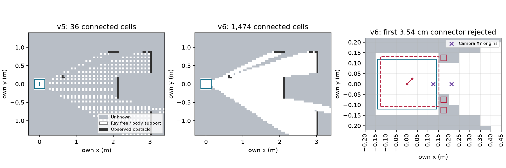

# explore9 결과 — ray 연결 복구, 첫 footprint 연결 검사에서 개발 중단

사전 등록 `30a3f555` → 평가기/어댑터 수정 별도 커밋 `14bba50a` push → 기존 K/L32의 첫 관측만
개발 진단1회. 최초 B/C/E 성공 기준은 변경하지 않았다. 임계값 재튜닝0, 전체 임무 재실행0.
이전 frontier0/32 결과는 개발용이며 새 확인 결과와 합산하지 않는다.

## 수정 전후: 기존32개 첫 관측 (각 맵/시작의 seed2는 같은 오라클 관측)

| 항목 | public_ros_v5 (`8d4c2eaa`) | public_ros_v6 |
|---|---:|---:|
| 출발4-connected 통행 가능 성분 | 36칸 | **1,351–2,130칸** |
| 전체 통행 가능 성분 수 | 281–437 | **1–5** |
| frontier 주변 후보 수 합계 | 2,044 | 31,058 |
| NavFn 경로 있는 후보 | 0 | **29,960** |
| NavFn 경로 없음 | 2,044 | 98 |
| 연속 자세→첫 경로점 footprint 검사 거부 | 0 | **29,960** |
| 최종 유효 후보 경로 | 0 | **0** |
| 개발 관문: 연결>36칸 및 유효 경로≥1인 사례 | 0/32 | **0/32** |

연결 크기 조건 자체는32/32 통과했다. 하지만 두 조건의 AND인 사전 개발 관문은 실패했으므로
**새 M/N32 manifest 생성/확인 실행0, 현실 잡음0**이다. 새쌍 생성 규칙과 실행기는 소스에 남지만
개봉하지 않았다. B 확인·coverage·거리/시간·충돌 등 새 임무 지표는 **미측정**이지0점/0회가 아니다.
기존 K/L B0/32와 새 결과인 것처럼 나란히 성공률을 만들지 않는다.

[32건 전체 원장](results/development.json), [맵·시작별 표](results/table.md),
[합계](results/summary.json), [연결 거부 셀/원 navigation event](results/connectors.json).
후보 수는 frontier별 같은 cell 중복·seed 중복을 포함하므로 독립 확률 분모가 아니다.

## 적용한 표준 처리와 남은 원인

v5 `PersistentActor.receive`는 ray를 순회하면서 `if cell in free`인 끝점 표본만 지웠다.
v6는 [Nav2 ObstacleLayer](https://github.com/ros-navigation/navigation2/blob/235fc5ce55bdf94d9be360fdbca39d89dc0e4f74/nav2_costmap_2d/plugins/obstacle_layer.cpp#L705)의
센서 원점→측정 끝점 Bresenham 순회로 모든 통과 칸을 free로 만든 뒤 이번 장애물 끝점을 mark한다.
바닥점은 clearing-only다. 과거 hit도 통과 광선으로 지우고 현재 hit는 마지막에 복원하며,
관측 광선이 없는 곳·시야 밖 hit는 유지한다. 원 static authored layer는 보존한다.

두 팔 자세의 원점은 명령 자세+기존 보정에서 각각 x=0.125244/0.212133m, y=0m다.
실제 카메라 GT 자세를 전달하지 않는다. 센서의 관측 endpoint/가시성/patch/난수는 그대로이며
기존32관측과 endpoint가 정확히 같음을 확인했다. 광선 사이 면을 덮는 보간·미관측 영역 확장은 없다.
직접 본 바닥 coverage 계산도 그대로다. [원문 줄 대조·라이선스·범위](REFERENCES.md).

대표 s1/K의 현재 pose `(0,0,0)`와 padded footprint(0.28×0.24m)는 통과한다.
NavFn 첫 경로점은 `(0.025,0.025)`이므로 연결 길이는 **0.035355m**다.
그 절반 `(0.0125,0.0125)`에서 앞쪽 footprint 외곽은 격자 중심 x=0.175m,
y=-0.125/-0.075/+0.125m의 **unknown(255)** 3칸과 겹쳐 거부된다. 이 셀들은 lethal wall(254)이 아니다.
32사례 모두 현재 footprint 통과, 첫 연결3.54cm 거부이며 대표 연결의 거부 셀 raw 값은 모두255다.
픽셀을 벽으로 오인하거나 NavFn이 도달 불가 반대편을 택해서가 아니라, **관측 cone의 근거리 폭과
현재 footprint만 free인 지원 영역 사이에서 짧은 대각 연결이 미관측 칸을 건드리는 것**이다.

`stack.py:36–50`의 연속 자세→첫 grid path point 검사와 `OutlineCostmap.pose_clear`의
unknown 금지 정책은 v5 그대로다. 실제 NavFn 경로가 생겨도 이 검사를 통과하지 못한다.
정적 지도에는 해당 주변 free 정보가 있지만 자기 지도에는 없다는 차이를 남긴다.
남은98회 NavFn 실패는 출발 성분 밖 작은 영역에 대한 후보이고 직접 거부의 대부분은 위 연결 검사다.
저장 관측만 재구성한 원 navigator의 초기 판정도32건 모두 `navigation_stopped`이며
blacklist→남은 frontier 없음 종료다. 움직임·회복·B 검출 누적을 이번에 실행한 것은 아니다.
사용자 요청대로 연결/unknown 정책·footprint·해상도·탐색 설정을 추가 변경하지 않고 멈춘다.

## 옵션·검증·원본

| 옵션 | 기본·처리 |
|---|---|
| `navigation=off` | 기본. v6 진입 함수는 legacy 객체/bytes 그대로 반환, navigator 입력을 평가하지 않음 |
| `public_ros_v1`…`public_ros_v5` | 기존 소스/옵션 모두 보존, 93개 v5 frozen hash 확인 |
| `public_ros_v6` | 새 `RaytraceActor`/오프라인 실행기. 자기 명령 camera origin을 점마다 요구, clear 전체 ray→hit marking. v5 탐색·회복·0.05m 격자 그대로 |

- 관련 시험 **17개 통과**: 0.025/0.05/0.10m ray 연속성, clear-before-mark, 시야 밖/정적 hit 보존,
  own transform·중복/peer/잘못된 원점 거부, off bytes, 기존 v5/off 회귀, 센서 난수/endpoint 불변,
  원 다섯 기준과 분모 검증. 새 패키지/venv 설치0.
- [검증](results/verification.json): 실행 당시 runtime hash 전부 일치,32개 기존관측 byte-equivalent 값,
 32개 진단 재구성 일치. 분석/그림 생성은 저장 첫 관측 재구성이며 임무 재실행·튜닝이 아니다.
- [개발 입력 파일/해시](results/development-inputs.json), [신규 raw manifest](results/raw-manifest.json).
  raw는 기본 checkout `outputs/mapfree-raytrace-v6/development/`, Git은 코드·표·그림·해시만 보존.
  기존 raw는 덮어쓰지 않았고 원격 raw 백업 완료가 아니다. 그림80,802bytes(<1MiB).
- 시작 시험에서 branch 전환 뒤 sparse 제외된 기존 `sensor-errors.npz`를 발견해 정확한 tracked
  fixture만 sparse 추가했고 재시험9개 통과 뒤 등록 커밋했다. 구현 시험의0.10m 원점 cell 기대값은
  같은 칸에 camera/body가 들어가는 fixture 조건을 정정했다. 평가 결과를 보고 알고리즘은 수정하지 않았다.
- 관리 session `explore9-raytrace-dev` 정상 종료. 가용 디스크 약46GiB. MuJoCo·렌더·모델 호출0,
  속도 비교/잠금 없음. 사용자 미추적4파일·다른 worktree 보존, #409 DRAFT·병합 없음.
  TensorBoard는 앞선 사용자 면제, Drive는 프로젝트 예외 유지.
