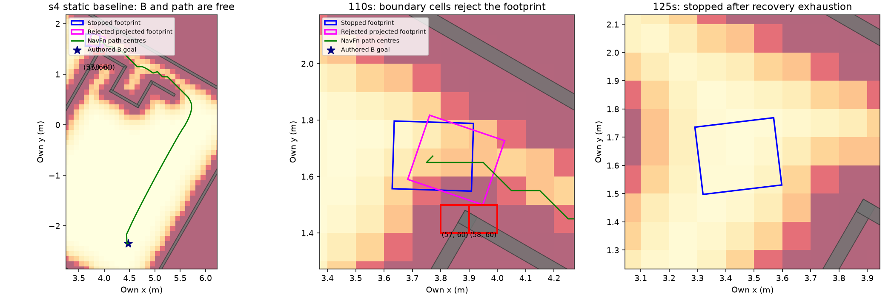

# explore7 — s4 격자 벽 거부, 마지막 개발 반복

## 수정·계산 전 사전 등록 (2026-10-07)

시작 `69054a84`, PR #409 `claude/mapfree-explore`. v4 개발 유효 참 B4/6·거짓0·s4 두 seed의
125s 회복 소진을 보존한다. 이번이 이 트랙의 마지막 개발 반복이며 새 결과 뒤 재튜닝하지 않는다.
MuJoCo/물리/렌더/모델 호출0. s4/G×4701/4702 oracle 동일 궤적은 독립 증거로 합산하지 않는다.

1. 저장 v4 own grid/명령/경로에서 첫 거부와 최종 정지 지점을 복원한다. B 목표 셀·경로 중심 셀·
   Nav2 외곽 footprint의 lethal 셀을 분리한다. 실제 벽과 셀 polygon 교집합/중심 거리, `.05m`
   정적 raster 여유 및0.1m 격자의 차이를 수치·그림으로 기록한다. 실제 벽은 평가 그림·진단에만.
2. pinned explore_lite ABORTED/timeout→blacklist→다음 frontier/소진 종료와 RoundRobin 종료를
   줄 단위 대조한다. 이미 같으면 반복/무한 재시도나 정적 B를 frontier로 바꾸지 않는다.
3. 차이가 있으면 원본의 누락 동작만 default-off `public_ros_v5`에 적용한다. 해상도 원인이면
   Nav2의 라이브러리 기본0.1m와 bringup 예시0.05m를 구분하고, **원 bringup0.05m 한 값만** 사용한다.
   static raster의 cell-half padding은 해상도의 절반으로 일관되게 정한다. 몸체/문/물체 형상·padding·
   soft inflation·회복·카메라·잡음·B 확인·예산·기준은 유지한다. 여러 해상도 탐색/결과 뒤 튜닝 없음.
   기존 v1–v4 bytes와 default off를 보존한다. runtime에는 평가 기하/물체 GT를 넣지 않는다.
4. 후보가 생기면 관련 시험 통과→소스 커밋·push→기존 개발10을 **한 번**만 실행한다.
   개발 관문은 원 `run_persistent.development_pass` 그대로: 시작 겹침4 HOST_SETUP_ERROR,
   유효6건 참 B6·거짓0·무한 정지/회복 소진 없음, 원 접촉/replan 집계 유지.
   s4만 성공해도 나머지 기준을 임의로 빼지 않는다.
5. 개발 전체 관문을 통과할 때만 소스·설정을 봉인하고 기존 미개봉 I/J×5701/5702 32쌍의
   oracle static을1회 실행한다(참 B≥30/32·거짓0 및 기존5기준 불변). 원 cohort hash/생성 규칙 불변.
   개발 또는 새32 관문 실패 시 중단·원인 기록. 추가 개발/재시도·frontier/noisy 임의 개봉 없음.

raw `/Users/changmin/projects/ugrp/outputs/mapfree-s4-final-v1/`, 기존 자료 보존·ENOSPC=HOST_ERROR.
CPU 속도 비교가 아니므로 timing lock 없음. 기존 venv/plot deps 재사용, 설치0. 사용자 미추적4파일 보존.
시험 통과를 확인한 뒤 commit/push·Codex trailer, PR #409 DRAFT·병합/강제 push/reset/다른 worktree 수정0.
TensorBoard 변환/Drive는 앞선 사용자 결정대로 생략한다.

## v4 진단 및 마지막 후보 동결 전 결정

[정지 셀 원장](results/diagnosis.json), [원본 줄 대조](REFERENCES.md).
첫 거부110s에서 B는 raw/cost0이고 경로 중심89개 모두 lethal/inscribed/unknown0이다.
frontier는 null이며 이번 실패는 static_map 모드다. +0.70s의 요청 footprint 외곽이
lethal `(57,60)`, `(58,60)`에 걸린다. 셀 중심의 실제 벽 여유는 각각15.802/5.737mm이며
각 cell polygon 일부가 wall_divider_1/wall_corridor_1과 실제로 겹친다. **벽 경계의 보수적
격자화**이지 목표 셀의 벽/벽 너머 frontier/완전히 허구인 장애물이 아니다. footprint의 실제 벽
교집합 면적은 현재·거부 자세 모두0이며, 이전 연속 여유 하한0.02836m를 유지한다.
원장의 `actual_geometry_overlap_fraction`은 인접 벽별 면적의 합(벽 중첩 중복 가능)이며 union 비율이 아니다.

원본 explore_lite와 frontier ABORTED→다음 목표 동작이 이미 같고, static B에는 다른 frontier가 없다.
따라서 RoundRobin 종료를 바꾸지 않는다. **`navigation=public_ros_v5`, 기본 off**는 원 Nav2
bringup의0.05m 한 해상도만 적용한다. 고정 지도 raster 여유는 기존 cell-half 원리대로0.025m;
shape·footprint padding0.02·inflation0.50/10·회복·센서·B·v7·예산·기준은 불변이다.
기존 v1–v4 경로 bytes 보존. 단위시험24개 통과 후 커밋·push하고 개발10을 한 번 실행한다.
첫 시험의 round-trip 부동소수점2.8e−17을 정확0으로 기대한 fixture만 절대허용1e−12로 수정했으며
관문/실험 계수는 변경하지 않았다. 개발 결과를 본 뒤 해상도·회복을 추가 조정하지 않는다.

## 개발 통과·새32 실행 전 동결

고정 구현 `86cdf6d1`을 push한 뒤 개발10을1회 실행했다. 시작 겹침4는 HOST_SETUP_ERROR,
유효6은 모두 참 B·거짓0·navigation_action_aborted0이었다. s4 두 건은179s/접촉0,
s5 두 건은107s/접촉0, s8 두 건은71s/접촉 각1 및 contact_replan 각1이다.
원 `verify_development`가 저장10개 원본과 source hash를 읽고 통과했다. s8 접촉2회는
그대로 남으며 본 탐색 기준의 충돌0 성공으로 해석하지 않는다.

[freeze.json](freeze.json)에 수치 소스·설정·원 I/J32 manifest·개발 source/results hash를 고정했다.
해상도/관문 재튜닝 없이 같은 후보로 미개봉 I/J×5701/5702 oracle static32를1회 실행한다.
이번 요청 범위는 그 정적 기준선 확인까지이며 후속 frontier/noisy를 자동 실행하지 않는다.
