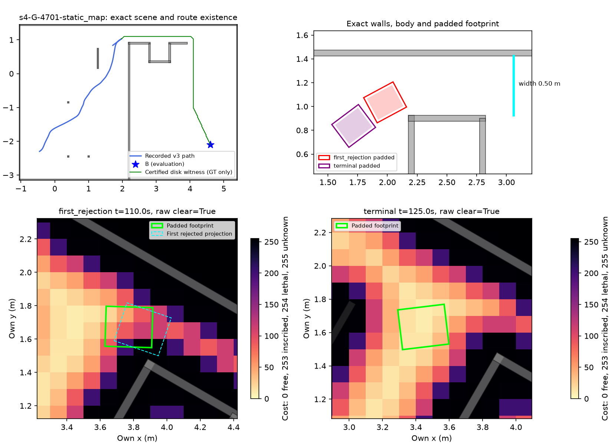
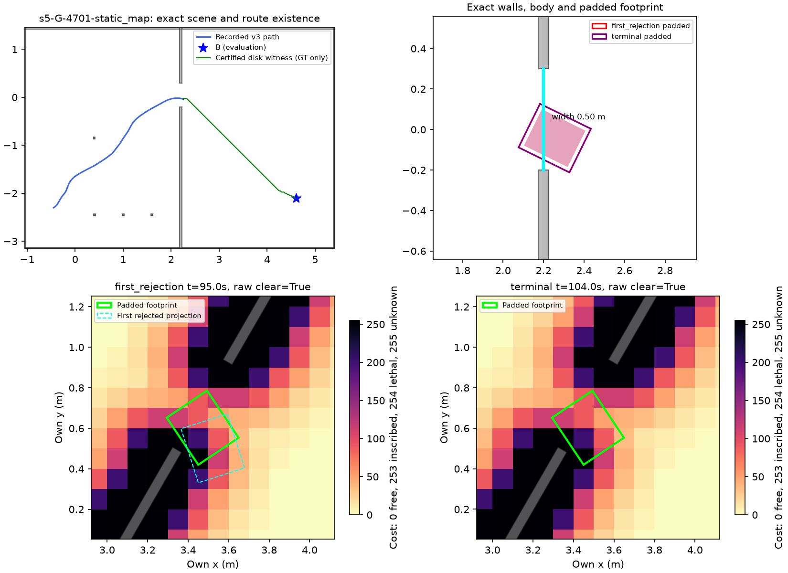

# explore6 — s4·s5 정지 기하와 회복 종료 진단

## 계산·수정 전 등록 (2026-10-07)

시작 `b494873c`, PR #409 `claude/mapfree-explore`. 이전 public_ros_v3의 유효6건 중 참 B2,
거짓0·s4/s5 회복 소진4건을 보존한다. 사용자 요청대로 s4/G·s5/G×4701/4702만 집중한다.
같은 oracle 궤적의 두 seed는 별개 독립 증거로 합산하지 않는다. MuJoCo·모델·렌더 호출0.

1. 저장 own observation/명령 DR를 재생해 첫 follow 충돌 예측 지점과 최종 정지의 grid/raw/inflated
   costmap을 복원한다. 최종 own_grid bytes와 대조한다. 실제 벽·물체는 평가용 그림/SAT/경로 존재
   진단에만 사용하며 actor에 전달하지 않는다. 원 녹화·실행을 덮거나 새 B 확인 성능이라고 부르지 않는다.
2. passage 폭, footprint의 축방향/회전 최대 폭, padding 및 soft inflation을 분리한다.
   사각 SAT와 보수적인 외접원 장애물 거리/A* 경로를 평가용으로만 사용한다. 경로의 연속 선분을
   조밀하게 검사하고 clearance 하한도 보존한다. 경로 미발견을 물리적 불가능의 증명이라고 하지 않는다.
3. 실제 MasterPi 공식 치수·기존 평가 치수·Nav2 코드 기본값/bringup 예시를 대조한다.
   inflation radius 전체를 lethal robot radius로 더하지 않는다. 기하 불가능이 드러나면 원본 근거로
   새 default-off 옵션을 만들고, 이전 v1–v3는 유지한다. 성공에 맞춘 폭 축소·문 확대는 금지한다.
4. 기하 통과 가능한 실패는 pinned RoundRobin의 마지막 child 분기 및 explore_lite ABORTED→
   blacklist→다음 frontier와 줄 단위 비교한다. 정적 B를 임의 frontier로 바꾸지 않는다.
   원본과 이미 같고 동일 실패가 남으면 추가 튜닝/재실행 없이 원인만 기록하고 중단한다.

개발 관문은 이전 정의 그대로: 시작 겹침4건은 HOST_SETUP_ERROR, 유효6건 참 B6·거짓0·회복 소진0,
접촉 회복 처리. 이전 s8의 접촉 집계 제한도 완화하지 않는다. 수정 후보가 생기면 시험/커밋 뒤 개발10을
한 번 재생하며, 전부 통과할 때만 기존 미개봉 I/J×5701/5702 32쌍을 oracle static 한 번 실행한다.
≥30/32·거짓0 및 기존5기준 불변. 개발 실패면 새32/후속 frontier/현실 잡음은 개봉하지 않는다.

raw `/Users/changmin/projects/ugrp/outputs/mapfree-stop-geometry-v1/`, 작은 요약·그림은 이 실험에.
CPU timing 비교가 아니므로 lock 불필요. 기존 venv/plot deps 사용, 새 설치0. TensorBoard/Drive 생략은
앞선 사용자 결정을 따른다. 시험 통과 후 커밋, Codex trailer, 강제 push/reset/삭제/다른 worktree 수정0.
PR #409 DRAFT 유지·병합 금지. PR #405 카메라 투영 실패 결과는 건드리지 않는다.

### 절차 오류 기록

최초 기존 시험은 sparse checkout에 빠진 `sensor-errors.npz` 때문에11통과/1실패였다. 그 비동기
시험 결과를 확인하기 전에 사전 등록 문서 `a9f3218e`를 커밋한 순서 오류가 있었다. 시험 후 커밋
규칙을 지킨 것으로 소급 표시하지 않는다. tracked 원본 blob을 복원했고 SHA256
`2a28ff187d04dfe1573d87555071f36b6c633f8597f0e1578b8a824da9cf183b` 일치, 기존12시험 재통과했다.
수치/후보 변경 없이 새 진단3시험까지15통과를 확인했다. 이후 코드는 시험 통과를 읽은 뒤 커밋한다.

첫 진단 실행은 live odometry의 read-only `pose` property에 저장 DR를 할당해 AttributeError로
첫 snapshot 이전 중단됐다. 평가 재생 전용 record로 바꾸고 실제 관측 입력을 통과시키는 회귀 시험을
추가했다. 제어기/센서/기하/관문 수정은 아니며 최초 `audit/`와 오류 기록은 보존, 재생은 `audit-v2/`다.

## 원본 차이 한 건: v4 구현 전 고정

`d0c77eaa` 복원과 `95441095` 기하 증명에서 첫 follow1초 구간의 사각 연속 여유 하한은
s4 0.02836m/s5 0.03129m였지만 raster 비용 지도는 각각0.70s/0.95s부터 거부했다.
원 Nav2 외곽 LineIterator를 대조하면 s4의7개 거부 표본은 그대로, s5의2개는0개다.
폭0.50m > padded 최대 회전 폭0.36878m이며 s4는 padding을 포함한 B 경로도 확인했다.
몸체/문 치수 불가능이 아니므로 치수·padding·inflation 반경을 변경하지 않는다.

**`navigation=public_ros_v4`, 기본 off**: filled polygon 대신 Nav2 FootprintCollisionChecker의
외곽 LineIterator와 최대 비용 판정만 이식한다. static/own obstacle memory, 예측 horizon/주기,
RoundRobin/explore_lite, 센서/B/v7, footprint240×200mm+padding20mm, inflation0.5m/10은 불변.
카메라 미관측 셀/맵 밖은 기존 입력 경계대로 통과시키지 않는 차이를 명시한다. 원본 전체 ROS 실행은 아니다.
v1–v3 byte 보존, 작은 regression 통과 후 구현 commit/push → 기존 개발10을 한 번만 재생.
원6/6 개발 기준을 그대로 사용하고 s4 또는 s5가 다시 막히면 추가 변경 없이 멈춘다.
새 I/J32는 개발 관문 실패 시 실행 금지. 작은 확인을 성공률에 합산하거나 s8의 접촉 gate를 완화하지 않는다.

구현 후 관련3파일27시험 통과. 첫 v4 시험의 두 fixture 오류(내부 픽셀을 외곽이라고 기대,
임의 noise 배열에서 차이가 반드시 생긴다고 기대)는 실제 s5 거부 셀의 작은 수치 반례와 외곽
corner fixture로 고쳤다. estimator/임계값 변경 없음. v1–v3 원본 bytes와 off 객체 bytes 동일.
이전 CI 목록에서 빠진 recovery/persistent 시험 및 새 진단 시험을 등록했다.

## 정지 기하 결과: 문 자체는 통과 가능

`d0c77eaa`의4건 own grid 복원이 저장 최종 grid와 정확히 일치했다. 모든 그림은 평가 전용이며
정답 벽/물체를 actor의 costmap에 추가하지 않았다. 두 seed의 원 oracle 궤적은 동일하다.

| 항목 | s4/G (두 seed 동일) | s5/G (두 seed 동일) |
|---|---:|---:|
| 첫 거부/최종 정지 modeled s | 110.0 / 125.0 | 95.0 / 104.0 |
| 첫 거부 world x/y/yaw | 1.9805/1.0345/0.4933 | 2.2552/−0.0423/−0.4572 |
| 통로 폭 m | 0.500 | 0.500 |
| bare / padding 포함 정렬 폭 m | 0.200 / 0.240 | 0.200 / 0.240 |
| 그 자세의 padding 포함 투영 폭 m | 0.3440 | 0.3389 |
| padding 포함 **모든 회전의 최대 폭** m | 0.3688 | 0.3688 |
| 통로−최대 회전 폭 m | **+0.1312** | **+0.1312** |
| 정지 사각 vs 실제 기하 접촉 | bare/padded 모두0 | bare/padded 모두0 |
| 첫1초 요청 궤적의 padded 연속 여유 하한 m | +0.02836 | +0.03129 |
| 첫 raster 거부 셀 | 정적 벽2셀 | 정적 벽1셀 |
| 같은1초 거부 표본: filled → 원 Nav2 edge | 7 → 7 | **2 → 0** |

벽·물체를 모두 포함한 평가용 B 경로가 있다. s4는 **padding 포함 외접원** 경로5.616m,
연속 여유 하한0.02823m(최종 정지에서는5.937m/0.02823m)다. s5는 **bare 몸체 외접원**
경로3.228m/여유0.00340m다. s5의 padded 외접원은 시작점에서23.8mm 겹쳐 그 충분조건으로 전체
경로를 인증하지 못했지만, 실제 padded 사각과 이미 요청된1초 궤적은 각각 비접촉/양의 여유다.
이를 padded 사각의 경로 불가능 증명으로 바꾸지 않는다. 평가용 기하 경로를 제어에 전달하지 않았다.

분류는 **통로 폭 부족이 아니라 격자화한 벽 근처의 경로 추종·회복 종료 문제**다. 정적 지도 입력이
벽을 .05m 넓혀0.1m 칸으로 만드는 부분, 회전 footprint의 셀 경계가 실제 연속 사각보다 보수적이다.
첫 거부를 실제 물체 접촉 또는 좁은 문이라고 부르지 않는다. 원본 외곽 검사를 적용해도 s4의 거부는
남으므로 guard를 끄거나 문/몸체를 유리하게 바꾸는 수정을 하지 않는다.





위 그림의 왼쪽 위 초록 경로는 GT를 이용한 **bare 외접원 기하 증명**이며 실행 궤적이 아니다.
아래 costmap은 자기 좌표, 위 실제 기하는 world 좌표다. 회색은 실제 벽/물체, 파란색은 기록된 v3 경로,
빨강/보라 사각은 첫/최종 정지의 padded footprint다. s4 그림은 v4에서도 경로/grid bytes가 동일하다.
s5 그림은 수정 전 문제 지점이며 v4의 B 확인 결과는 아래 별도 표다.

## 치수·원본 설정·옵션 대조

| 항목 | 기존 v3 / 새 v4 | 원본 근거와 판정 |
|---|---|---|
| MasterPi 제품 envelope | 평가 bare240×200mm | Hiwonder185×162mm, `masterpi_geometry_v3.py`와 일치. 펼친 팔/짐은 별도이며 이번에 축소하지 않음 |
| footprint padding | 0.02m 유지 | pinned Nav2 기본0.01m; 문을 통과할 여유가 있어 성공에 맞춰 변경하지 않음 |
| inflation radius/scaling | 0.50m /10 유지 | 라이브러리 기본0.55m/10, bringup 예시0.70m/3. 외부 비용은 soft이며 폭에서1m를 뺄 수 없음 |
| 격자 | 0.10m 유지 | pinned Costmap2DROS 기본0.10m, bringup 예시0.05m. 이번 해상도 튜닝0 |
| `navigation=off` | 기본, byte 그대로 | 기존 v1–v3 경로 불변 |
| `navigation=public_ros_v4` | 명시 opt-in | Nav2 외곽 LineIterator/최대 비용만 적용, unknown/맵 밖은 카메라 제약으로 거부 |
| 회복·B·센서·v7·원 코호트 | 불변 | 새 후보의 변경은 `harness/public_navigation_outline.py`와 평가 runner factory에 한정 |

[REFERENCES](REFERENCES.md)에 원문·라이선스·줄 단위 대응을 남겼다. 표준 ROS 전체를 구동하거나
물리 MasterPi를 검증한 결과가 아니다. geometry 폭 차이와 runtime 선택은 서로 다른 검증이다.

## v4 개발 결과: s5 회복, s4 반복으로 중단

옵션 사전 등록 `93d0e7f3` →27시험 → 구현 `dcb8078e` 커밋·push 후 기존 개발10을 한 번 재생했다.
소스·설정 고정, 센서/footprint/회복/기준 재튜닝0. [개별10건 표](results/tables.md).

| 기존 실패 묶음 | v3 → v4 참 B | v4 종료/확인 modeled s | v4 거리 m | v4 coverage | v4 접촉 |
|---|---:|---:|---:|---:|---:|
| s1/H·s4/H 총4 | 0 → 0 | 0, HOST_SETUP_ERROR | 0 | 0% | 0 |
| s4/G 두 seed | 0 → 0 | 125, 회복 소진 | 4.6500 | 39.49% | 0 |
| s5/G 두 seed | **0 → 2** | **101, 참 B 확인** | 3.7866 | 74.38% | **0** |
| s8/H 두 seed | 2 → 2 | 74, 참 B 확인 | 1.4324 | 46.55% | 각2, 총4 |

**전체 개발 참 B2/10→4/10, 유효6 중2→4, 거짓0. 개발 관문 실패.** s4의 actor/명령/경로/grid/
회복 event5파일×2seed가 v3와 바이트 동일하다. s4의 원 Nav2 외곽 검사에서도 첫 거부가 그대로이고,
spin 거부·wait·backup 성공122.4s 후 pinned RoundRobin 마지막-child 분기가 action을 종료한다.
원본 cpp와 동일한 종료를 무한 반복으로 바꾸지 않았다. explore_lite의 ABORTED blacklist/즉시 다음
frontier는 이미 frontier 모드에 구현돼 있으며 정적 B baseline에는 다른 frontier 목표가 없다.

s5는 격자 내부 채움과 원본 외곽 검사 차이를 수정한 뒤 기존 시간 누적 조건으로 B를 확인했다.
기준을 낮추지 않았으며 위치 오차도6.7e-16m 수준인 oracle 조건이다. noisy/실물 성능으로 승계하지 않는다.
s8의 접촉4회와 contact-replan1회/기하 접촉2회 집계 차이는 그대로다. v4 s8에는 B 확인 직전
action aborted event도 있으며 B 확인 우선인 기존 episode 종료 순서로 상태가 B_confirmed다.
원문 event를 보존하고 회복 소진이 전혀 없다고 주장하지 않는다. 어느 집계로도 현재 개발 관문은 실패다.

**s4의 같은 원인이 재발했으므로 추가 수정·튜닝·개발 재실행을 중단했다.** 새 I/J32 개봉0,
≥30/32 oracle static·frontier oracle·현실 잡음 모두 미평가. 실패 raw를 입력한 실제 verifier가
`DEVELOPMENT_GATE_FAILED_STOP_CONFIRMATION`으로 차단함을 확인했다. 과거 다른32쌍의 성공과 합산하지 않는다.

## 보존·검증·재현

- 관련3파일 **27 passed**, default off 및 legacy v1–v3 bytes 불변, 원 Nav2 외곽과 회전 사각 대조,
  unknown/out-of-map 경계, 분리축/연속 clearance 증명, own grid4건 재구성 및 s4 raw10파일 bytes 일치.
- [검증](results/verification.json): 실행 수치 소스와 이전 v3 raw 해시를 직접 재대조했다. 사전 등록
  문서의 최초 시험 순서 오류는 위에 공개했다. 마지막 후보/결과 커밋은 관련 시험 통과 후 진행한다.
- [summary](results/summary.json), [기하 원장](results/stop-geometry.json),
  [사각 구간 증명](results/oriented-certificates.json), [전후 비교](results/comparison.json).
- raw116파일8,477,835bytes는 primary `outputs/mapfree-stop-geometry-v1/`에 보존한다.
  [manifest](results/artifacts.json) 경로·SHA256 확인. 작은 그림2장/요약만 Git에, 로컬 raw를 원격 백업이라 부르지 않는다.
- 기존4개 미추적 파일 hash 불변. MuJoCo·렌더·모델 호출0, 새 의존성/venv0, timing 측정/잠금0.
  `ugrp_session explore6-outline` 종료 확인. PR #409 DRAFT 유지, 병합/강제 push/reset/다른 worktree 수정0.

```sh
PYTHONPATH=outputs/self-map-plot-deps /Users/changmin/projects/ugrp/.venv-sim-worker-mac/bin/python -m pytest tests/test_navigation_stop_geometry.py tests/test_navigation_persistent.py tests/test_navigation_recovery.py -q
PYTHONPATH=outputs/self-map-plot-deps /Users/changmin/projects/ugrp/.venv-sim-worker-mac/bin/python experiments/2026-10-07-mapfree-stop-geometry/code/run_outline.py --navigation public_ros_v4 --cohort diagnostic --output /Users/changmin/projects/ugrp/outputs/mapfree-stop-geometry-v1/development-v4-NEW
```

위 재현 명령은 설명이며 두 번째 개발 실행을 하지 않았다. 원 실행/진단 디렉터리가 있으면 중단한다.


## 후속 마지막 개발 반복 (explore7)

[원인 특정·그림·v5·새32 결과](../2026-10-07-mapfree-s4-final/README.md).
s4 B/경로 중심89개는 free였고, 거부는 실제 벽 일부를 포함한0.1m 경계2셀과 footprint의 교차였다.
frontier/정적 B 종료는 원본과 같아 유지하고, Nav2 bringup0.05m를 기본-off `public_ros_v5`로 적용했다.
개발 유효 B4/6→6/6·거짓0·abort0, 이후 미개봉 I/J32 oracle static **32/32·거짓0·충돌0**.
이전 v4 결과/코드는 보존했다. 이 트랙의 마지막 개발 반복이며 frontier/현실 잡음 성능은 미검증이다.
