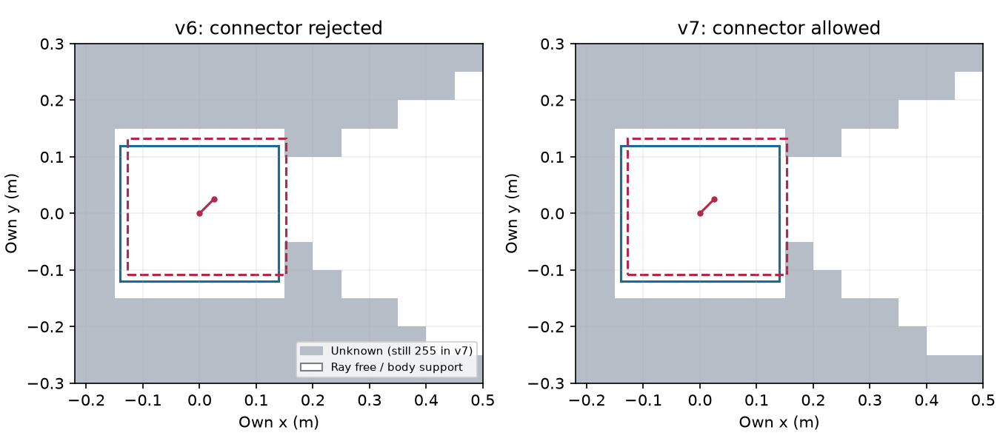
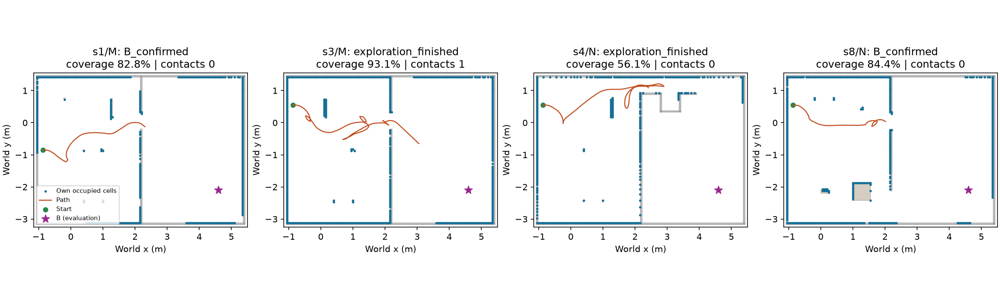

# explore10 결과 — 표준 unknown 정책으로 개발 관문 복구

사전 등록 `236cf3f4` → 구현/18시험 `5b2c766e` → K/L32 개발 진단 →
새 M/N32·소스/설정 봉인 `66a5fe94`를 각각 시험 통과 후 commit·push했다.
MuJoCo·렌더·모델 호출 없이 순수2D의 새 확인을 1회 수행했다. 기존 다섯 기준을 변경하지 않았다.
원문과 줄 대조·라이선스는 [REFERENCES](REFERENCES.md), 구현 전 계획은 [README](README.md).

## 동일 관측 개발 진단

|항목|동결 v6|새 v7|
|---|---:|---:|
|출발 연결 성분|1,351–2,130칸|1,351–2,130칸|
|동일 frontier 주변 후보 합계|31,058|31,058|
|NavFn 경로 없음|98|20|
|첫 연속 자세→격자 중심 footprint 연결 거부|30,960|0|
|최종 유효 후보 경로|0|31,038|
|연결>36칸 AND 유효 후보≥1|0/32|32/32|
|실제 선택 centroid 경로·첫 비영 명령|미진행|32/32|

후보는 frontier 간 중복·두 seed 중복을 포함한다. 독립 확률 표본이 아니다.
v6 이전 RESULTS의 29,960 표기는 산술 오기였다. 보존된 원장은 **31,058−98=30,960**이며
이번 동일 관측 재구성에서도 일치했다. 이전 원장/동결 문서는 변경하지 않는다.
[개발 전체](results/development.json), [개발 판정](results/development-gate.json).

파랑은 현재 footprint, 붉은 점선은 3.54cm 연결의 중간 footprint다. 현재 첫 관측의 free 영역과
연결 성분 크기는 동일하다. unknown을 free로 변조하지 않고 planner/RPP가 tracking-unknown
costmap의255를 통과하도록 한 차이가 최초 연결 거부를 해소했다. 관측/제어 tick마다 **현재**
자기 추정 footprint를 영속 관측층에 지우는 처리도 넣었다. 과거 footprint는 non-RGB support로
남고 이후 hit가 다시 점유할 수 있다. 미래 footprint·모든 과거 궤적 재지우기는 없다.

## 새 M/N32 확인 (정적/자기 frontier 각각1회)

|조건|참/거짓 B|coverage 중앙|B 확인 거리/시간 중앙|충돌|잘못된 문/문 시도|거짓 passage|
|---|---:|---:|---:|---:|---:|---:|
|정적 지도|32/0|63.21%|3.638m / 95s|0|0/44|12|
|자기 frontier|**26/0**|**70.11%**|3.737m / 140s|**2**|0/42|**14**|

거리/시간 중앙은 성공한 사례의 값이다. 전체 종료 중앙은 frontier4.126m/143s.
공통 성공26쌍의 frontier/static 비 중앙은 **거리1.067282·시간1.422535**로 각각≤2다.

|기존 기준|관측|판정|
|---|---|---|
|입력/off·동결 소스·완전32쌍|64개별 결과·121소스 해시 일치|통과|
|참 B≥26/32·거짓0|26/32(81.25%)·거짓0|통과|
|공통 성공 거리비/시간비≤2|1.067/1.423, 공통26|통과|
|직접 가시 coverage 중앙≥40%|70.11%|통과|
|충돌/잘못된문/거짓passage0, 실제문시도≥1|2/0/14, 문시도42|**실패**|

**4/5 통과, 전체 관문 실패.** 정적 기준선에도 거짓 passage12가 남았다. B32/32가 문 감지까지
정상임을 뜻하지 않는다. frontier의14는 s4/N4+s5/M4+s8/M6이며 충돌 수와 합산하지 않는다.
실제 문 근처 발행 시도·문 후보 근처 발행 시도의 기존 판정 규칙을 그대로 유지했다.

두 seed는 결정론적 오라클에서 같은 궤적이다. 32개 독립 확률 표본이나 이전 K/L0/32와의
동일 조건 향상률로 주장하지 않는다. 탐색기에는 자기 관측만 주며, 명시적 오라클 브리지가
출발 기준 자세3값만 공급한다. 카메라 FOV·사거리·가림은 그대로이고, 오라클은 그 안의 검출/자세
잡음만0이다. coverage는 직접 본 reachable-floor 표본이며 ray/body-support 면적을 가산하지 않는다.
시간은 2D 모의 시간, raw wall-time 성능 측정이 아니다. [64회 CSV](results/episodes.csv),
[맵/시작별 표](results/table.md), [동일 원 기준 판정](results/gate.json).

## 실패 원인과 중단

|B 미확인 유형(각 두 seed)|종료|가시/검출 B 프레임(건당)|근거|
|---|---:|---:|---|
|s3/M, 2건|317s, 8.127m|20/20|19개 track으로 분리, 최대2 view로3-view 확인 미달; wall_divider_1 접촉 각1|
|s4/M, 2건|203s, 5.955m|0/0|남은 frontier1개 모두 blacklist; 최종 centroid raw0/inflated253|
|s4/N, 2건|239s, 7.464m|0/0|남은 frontier23개 모두 blacklist; blacklist 등록11개가5-cell 범위로 포괄|

모두 `exploration_finished_no_frontier`로 끝났으며 종료 당시 남은 모든 후보가 blacklist였다.
B 미검출6건을 같은 원인으로 묶지 않는다. s4는 B를 시야에 넣지 못한 탐색/경로 후보 소진이고,
s3는 B를 보고도 동결 시간 누적이 끊긴 별도 문제다. [건별 진단](results/diagnosis.json).

s3/M에서는 257s 이후 관측 간격이 `3.0000000000002274`초였다.
`floor_goal_v3.py:134`의 `t-last_t > 3.`와 평가기의 부동소수점 시간 적산이 만나,
영역 겹침/중심 일치가 통과하는데도 track이 끊긴 **15건/실행**을 저장 기록으로 확인했다.
대표 초과량은2.27e-13s, 중심 residual5.77e-15m, 겹침비≈1이었다. 같은 B를 검출한20프레임이
19개 track으로 나뉘고 최대2 view였다. 이는 v3의 실물 recall 문제로 일반화할 수 없는
평가 시간 경계 문제다. 3초 조건·시간 적산은 이번에 수정하지 않았다.
벽 접촉은 두 seed 모두257.30s의 `wall_divider_1`이며, 접촉과 B 누적 단절을 분리 기록했다.
오라클 자세 최대 오차6.28e-16m이므로 이 접촉을 DR 잡음 탓으로 돌리지 않는다.

실패 뒤 관측 주기·B v3·frontier·blacklist·footprint·센서·예산을 수정하거나 재생하지 않았다.
**현실 잡음 단계0**, S2 s1050–1051 실측 분포 fitting/선택0이며 이전 구조 사전값을 실측으로
대체하지 않았다. 추가 수정 없이 이 작업을 중단한다. 이는 공개 ROS 전체의 성능 판정이 아니라
고정 카메라·단일 costmap·명령 어댑터를 사용한 이 평가 조건의 결과다.

회색은 authored 고정 벽, 베이지는 초기 물체, 파랑은 최종 자기 점유 셀, 주황은 평가 경로다.
녹색은 시작, 자홍 별은 평가용 B다. 그림 배경은 초기 기하이며 숨은 사건으로 움직인 물체 위치를
다시 그린 것은 아니다. 저장 원장만 그리며 GT를 탐색기로 전달하지 않는다.

## 옵션·검증·보존

|옵션|기본·처리|
|---|---|
|`navigation=off`|기본. legacy bytes/객체를 그대로 반환하고 navigator 입력을 평가하지 않음|
|`public_ros_v1`…`public_ros_v6`|소스와 동결 설정 보존|
|`public_ros_v7`|`footprint_clearing_enabled=true`, `allow_unknown=true`, `track_unknown_space=true`; 원 NavFn 별도 ABI, explore_lite centroid 목표|

원 NavFn C++/frontier_search 코어는 그대로다. 255는 높은 통과 비용으로 유지하고, 알려진254
벽과 지도 범위 밖은 거부한다. RPP 원본은 범위 밖을 경고 후 허용하므로 이 부분은 기존 유한
카메라 지도의 제한이라는 차이를 명시했다. ROS global/local 서버 전체를 복제한 것은 아니며
단일 costmap 어댑터가 unknown 정책을 planner와 follower에 함께 적용한다. 다른 inflation,
회복/진행/blacklist 계수와 RGB 관측·난수·문 평가·성공 기준은 불변이다.

- 관련 시험 **18 passed**: 별도 native DSO의 unknown 통과/known wall 거부와 legacy 출력,
  영속 footprint·새 hit 재점유·정적 벽 보존·미래 셀 보존·non-RGB provenance,
  기본 off bytes·기존 v5/v6·동일 관측/센서 난수·동일 성공 기준 확인.
  새 시험을 기존 원격 CI 목록에 등록했다. 로컬에서 전체 suite/물리를 실행하지 않았다.
- 초기 단위시험에서 몸체 free의 non-RGB support 등록 누락을 발견해 구현 커밋 전에 수정했다.
  개발/확인 결과를 본 뒤 runtime 코드·설정 변경은0이다. v1–v6/baseline/B v3 소스를 수정하지 않았다.
- [검증 원장](results/verification.json): 동결121파일 일치, 개별 결과64개 재검증,
  오라클 pose2,690샘플 최대6.28e-16m, 조건별 seed쌍32/32 actor·명령·경로 바이트 동일.
  원본 raw583파일152,880,796bytes의 SHA를 기록했다. 두 그림52,297/102,738bytes 직접 확인(<1MiB).
- 디스크 실행 전46.11GiB. 실행 session은 정상 종료했고 HOST_ERROR/누락/분모 제외0.
  새 현실 잡음 실행0이며 테스트·그림은 실제 연구/실물 성공 근거로 합산하지 않았다.

raw는 primary `outputs/mapfree-unknown-v7/` 로컬 보존, Git에는 코드·수치·그림·해시만 남긴다.
원격 raw 백업을 주장하지 않는다. [전체 raw manifest](results/raw-manifest.json).
관리 session `explore10-development`, `explore10-confirmation`; 속도 비교가 아니므로 timing 잠금0.
새 패키지/venv 변경0, 다른 worktree·사용자 미추적4파일 보존. #409 DRAFT, 병합/force/reset 없음.
TensorBoard는 앞선 사용자 면제, Drive는 프로젝트 예외를 유지했다.
