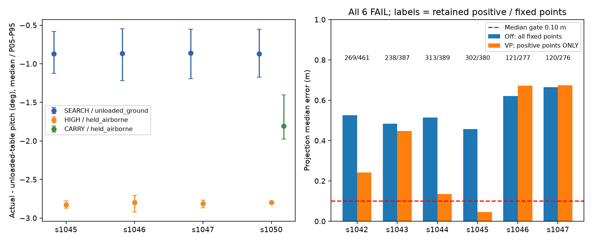
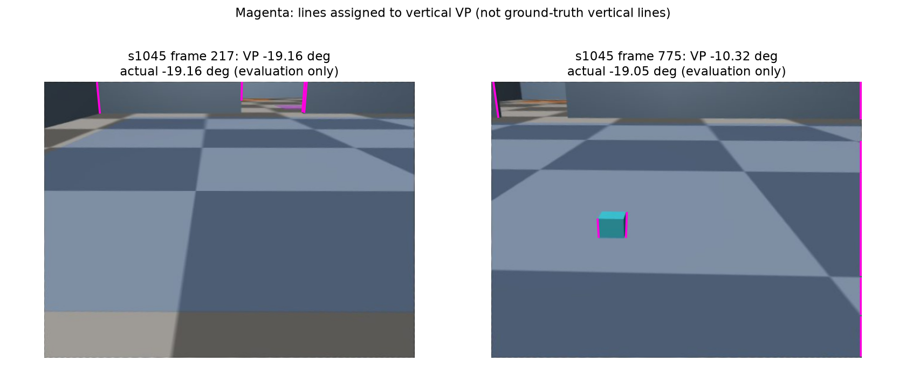

# egomap13 결과 — 자기 지도 트랙 중단

기존 투영 관문 **0/6 통과**. 개발2 → `10eb7add` 동결 → 확인4를 각1회 수행했다.
설정 재튜닝0, 지도/RBPF/graph 재생0, 지도 그림 갱신0, MuJoCo/렌더/모델 호출0.
새 옵션은 연구용 기본-off로 보존하며 실행 번들에 승격하지 않는다.

## 조건 분해 (actual − 고정 unloaded 표, 도)

모든30,512프레임 join, 누락0. 표는 팔 명령 변경 후0.5s 이상만; 전체/정착 중/각 PWM/교차표는
[CSV](results/conditions.csv)와 [JSON](results/conditions.json)에 모두 남겼다.
held=양쪽 손가락 접촉+공중, unloaded=무접촉+바닥, 애매한 표본은 제외하지 않고 별도 그룹이다.

| 녹화 | 팔·적재 | n | pitch P05 / 중앙 / P95 | 실제 pitch 중앙 | 차체 tilt 중앙 / P95 | #406 loaded 표 차 중앙(반사실) |
|---|---|---:|---|---:|---|---:|
| s1045 | SEARCH / unloaded_ground | 828 | -1.124 / -0.872 / -0.581 | -19.053 | 0.061 / 0.201 | 0.682 |
| s1045 | HIGH / held_airborne | 11843 | -2.874 / -2.826 / -2.776 | -32.728 | 0.109 / 0.221 | -1.272 |
| s1045 | PICK_transition / unloaded_ground | 220 | -1.654 / -1.258 / -0.568 | -49.630 | 0.053 / 0.118 | 0.295 |
| s1045 | PICK_transition / held_airborne | 282 | -2.643 / -2.587 / -2.257 | -47.480 | 0.066 / 0.069 | -1.034 |
| s1046 | SEARCH / unloaded_ground | 425 | -1.219 / -0.865 / -0.546 | -19.046 | 0.043 / 0.119 | 0.688 |
| s1046 | HIGH / held_airborne | 4958 | -2.923 / -2.796 / -2.708 | -32.699 | 0.103 / 0.190 | -1.243 |
| s1046 | PICK_transition / unloaded_ground | 217 | -1.671 / -1.252 / -0.561 | -49.630 | 0.058 / 0.135 | 0.301 |
| s1046 | PICK_transition / held_airborne | 282 | -2.690 / -2.617 / -2.270 | -47.510 | 0.127 / 0.144 | -1.064 |
| s1047 | SEARCH / unloaded_ground | 453 | -1.196 / -0.863 / -0.553 | -19.044 | 0.044 / 0.116 | 0.690 |
| s1047 | HIGH / held_airborne | 3507 | -2.866 / -2.815 / -2.768 | -32.717 | 0.099 / 0.167 | -1.261 |
| s1047 | PICK_transition / unloaded_ground | 242 | -1.803 / -1.245 / -0.565 | -49.745 | 0.065 / 0.130 | 0.308 |
| s1047 | PICK_transition / held_airborne | 282 | -2.674 / -2.617 / -2.285 | -47.509 | 0.099 / 0.115 | -1.064 |
| s1050 | SEARCH / unloaded_ground | 405 | -1.173 / -0.869 / -0.554 | -19.050 | 0.053 / 0.103 | 0.684 |
| s1050 | HIGH / held_airborne | 151 | -2.799 / -2.798 / -2.797 | -32.701 | 0.103 / 0.103 | -1.245 |
| s1050 | CARRY / held_airborne | 3310 | -1.974 / -1.809 / -1.401 | -28.918 | 0.068 / 0.163 | -0.256 |
| s1050 | PICK_transition / unloaded_ground | 269 | -1.669 / -0.857 / -0.563 | -49.751 | 0.055 / 0.113 | 0.697 |
| s1050 | PICK_transition / held_airborne | 282 | -2.657 / -2.592 / -2.252 | -47.484 | 0.096 / 0.111 | -1.039 |

PICK/transition은 여러 명령 자세의 혼합이며 단일 정적 보정 오차로 해석하지 않는다.
같은 HIGH에서 무하중·적재가 충분히 겹치는 비교군이 없어 **순수 하중 효과는 식별 불가**.
s1050도 SEARCH −0.869°, HIGH 적재 −2.798°로 이전과 같다. 잘 맞았던 구간은
real CARRY(600/2200/1400/1500) + #406 loaded 표이며 HIGH(896/2035/1894/1500)와 다르다.
s1050 전체 정착 CARRY의 loaded 차 −0.256°는 기존1Hz 감사 +0.237°와 부호·표본수가 다르다.
기존접점1.53cm는5171개 visible 검출 열; 이번 수동 고정 관문과 합산하지 않는다.

### 이동/정지·가감속 교차 분포

| 녹화 | 팔·적재 | 이동 | 가감속 | n | pitch P05 / 중앙 / P95 (°) | tilt 중앙 (°) |
|---|---|---|---|---:|---|---:|
| s1045 | SEARCH/unloaded_ground | stopped | accelerating | 1 | -0.834 / -0.834 / -0.834 | 0.043 |
| s1045 | SEARCH/unloaded_ground | moving | accelerating | 313 | -1.008 / -0.861 / -0.548 | 0.061 |
| s1045 | SEARCH/unloaded_ground | moving | steady | 243 | -1.086 / -0.883 / -0.658 | 0.054 |
| s1045 | SEARCH/unloaded_ground | moving | decelerating | 267 | -1.219 / -0.889 / -0.719 | 0.072 |
| s1045 | SEARCH/unloaded_ground | stopped | decelerating | 2 | -0.804 / -0.801 / -0.797 | 0.098 |
| s1045 | HIGH/held_airborne | stopped | steady | 486 | -2.846 / -2.818 / -2.785 | 0.105 |
| s1045 | HIGH/held_airborne | stopped | accelerating | 3 | -2.843 / -2.817 / -2.788 | 0.105 |
| s1045 | HIGH/held_airborne | moving | accelerating | 4050 | -2.878 / -2.830 / -2.780 | 0.116 |
| s1045 | HIGH/held_airborne | moving | steady | 4186 | -2.871 / -2.822 / -2.774 | 0.101 |
| s1045 | HIGH/held_airborne | moving | decelerating | 3079 | -2.873 / -2.827 / -2.774 | 0.119 |
| s1045 | HIGH/held_airborne | stopped | decelerating | 39 | -2.870 / -2.841 / -2.803 | 0.130 |
| s1045 | SEARCH/unloaded_ground | stopped | steady | 2 | -0.837 / -0.837 / -0.837 | 0.030 |
| s1046 | SEARCH/unloaded_ground | stopped | accelerating | 43 | -0.894 / -0.869 / -0.845 | 0.034 |
| s1046 | SEARCH/unloaded_ground | moving | accelerating | 144 | -0.997 / -0.854 / -0.534 | 0.040 |
| s1046 | SEARCH/unloaded_ground | moving | decelerating | 158 | -1.241 / -0.882 / -0.772 | 0.057 |
| s1046 | SEARCH/unloaded_ground | stopped | decelerating | 59 | -0.932 / -0.859 / -0.802 | 0.050 |
| s1046 | SEARCH/unloaded_ground | stopped | steady | 17 | -0.904 / -0.836 / -0.824 | 0.027 |
| s1046 | SEARCH/unloaded_ground | moving | steady | 4 | -0.918 / -0.871 / -0.839 | 0.062 |
| s1046 | HIGH/held_airborne | stopped | steady | 1016 | -2.958 / -2.800 / -2.743 | 0.104 |
| s1046 | HIGH/held_airborne | stopped | accelerating | 330 | -2.839 / -2.785 / -2.297 | 0.097 |
| s1046 | HIGH/held_airborne | moving | accelerating | 1193 | -3.003 / -2.786 / -2.382 | 0.090 |
| s1046 | HIGH/held_airborne | moving | steady | 563 | -2.909 / -2.798 / -2.744 | 0.100 |
| s1046 | HIGH/held_airborne | moving | decelerating | 1685 | -2.860 / -2.797 / -2.462 | 0.107 |
| s1046 | HIGH/held_airborne | stopped | decelerating | 171 | -2.850 / -2.794 / -2.719 | 0.099 |
| s1047 | SEARCH/unloaded_ground | stopped | accelerating | 45 | -0.895 / -0.868 / -0.838 | 0.035 |
| s1047 | SEARCH/unloaded_ground | moving | accelerating | 150 | -0.995 / -0.852 / -0.537 | 0.041 |
| s1047 | SEARCH/unloaded_ground | moving | decelerating | 173 | -1.232 / -0.877 / -0.765 | 0.059 |
| s1047 | SEARCH/unloaded_ground | stopped | decelerating | 60 | -0.932 / -0.857 / -0.808 | 0.047 |
| s1047 | SEARCH/unloaded_ground | stopped | steady | 19 | -0.901 / -0.846 / -0.836 | 0.035 |
| s1047 | SEARCH/unloaded_ground | moving | steady | 6 | -0.906 / -0.885 / -0.833 | 0.040 |
| s1047 | HIGH/held_airborne | stopped | steady | 654 | -2.858 / -2.813 / -2.781 | 0.106 |
| s1047 | HIGH/held_airborne | stopped | accelerating | 308 | -2.855 / -2.806 / -2.769 | 0.091 |
| s1047 | HIGH/held_airborne | moving | accelerating | 833 | -2.853 / -2.802 / -2.761 | 0.066 |
| s1047 | HIGH/held_airborne | moving | steady | 331 | -2.860 / -2.818 / -2.774 | 0.100 |
| s1047 | HIGH/held_airborne | moving | decelerating | 1206 | -2.876 / -2.827 / -2.767 | 0.113 |
| s1047 | HIGH/held_airborne | stopped | decelerating | 175 | -2.864 / -2.831 / -2.787 | 0.101 |
| s1050 | SEARCH/unloaded_ground | stopped | accelerating | 34 | -0.892 / -0.875 / -0.851 | 0.038 |
| s1050 | SEARCH/unloaded_ground | moving | accelerating | 148 | -0.931 / -0.860 / -0.541 | 0.043 |
| s1050 | SEARCH/unloaded_ground | moving | decelerating | 157 | -1.231 / -0.876 / -0.775 | 0.085 |
| s1050 | SEARCH/unloaded_ground | stopped | decelerating | 49 | -0.930 / -0.869 / -0.807 | 0.052 |
| s1050 | SEARCH/unloaded_ground | stopped | steady | 11 | -0.875 / -0.862 / -0.831 | 0.043 |
| s1050 | SEARCH/unloaded_ground | moving | steady | 6 | -0.893 / -0.880 / -0.864 | 0.061 |
| s1050 | HIGH/held_airborne | stopped | steady | 151 | -2.799 / -2.798 / -2.797 | 0.103 |
| s1050 | CARRY/held_airborne | stopped | steady | 811 | -1.929 / -1.814 / -1.646 | 0.069 |
| s1050 | CARRY/held_airborne | stopped | accelerating | 213 | -1.873 / -1.798 / -1.673 | 0.066 |
| s1050 | CARRY/held_airborne | moving | accelerating | 832 | -1.989 / -1.766 / -1.479 | 0.062 |
| s1050 | CARRY/held_airborne | moving | steady | 296 | -1.942 / -1.810 / -1.481 | 0.074 |
| s1050 | CARRY/held_airborne | moving | decelerating | 1042 | -2.065 / -1.821 / -1.304 | 0.069 |
| s1050 | CARRY/held_airborne | stopped | decelerating | 116 | -1.923 / -1.830 / -1.563 | 0.072 |

s1045–47 HIGH의 이동 가속/정속/감속 중앙 차이는 각0.008/0.012/0.025°에 그친다.
정지 정속에서도 HIGH 불일치가 −2.80~−2.82°로 남는다. 현재 차체 tilt 중앙0.04–0.11°만으로
SEARCH 약0.87°/HIGH 약2.8°를 설명하기 어렵다. 이는 기록에서 얻은 추론이며 인과 확정이 아니다.
차체 signed pitch/roll 및 실측 관절이 없어 고정 보정 기준·서보 처짐·팔 유격을 분리할 수 없다.
CSV의 `non_body_residual_lower_bound_deg`는 **보정 기준 차체가 수평이었다고 가정할 때만**
현재 tilt를 뺀 잔차 하한이다. 보정 당시 차체 tilt는 없어 무조건적인 팔 처짐 하한으로 해석하지 않는다.

## 고정 접점 투영 관문

| 녹화 | split | 고정 점 | off 중앙/P90 m | VP 중앙/P90 m (양의 점만) | 양의·4m 점 | oracle 중앙 m | 판정 |
|---|---|---:|---|---|---|---:|---|
| s1042 | development | 461 | 0.525/0.692 | 0.243/0.536 | 269/461 (58.4%) | NA | FAIL |
| s1043 | development | 387 | 0.484/0.676 | 0.447/0.484 | 238/387 (61.5%) | NA | FAIL |
| s1044 | confirmation_replay | 389 | 0.515/0.716 | 0.135/0.489 | 313/389 (80.5%) | NA | FAIL |
| s1045 | confirmation_replay | 380 | 0.457/0.562 | 0.046/0.194 | 302/380 (79.5%) | 0.015 | FAIL |
| s1046 | confirmation_replay | 277 | 0.620/0.742 | 0.672/0.760 | 121/277 (43.7%) | 0.026 | FAIL |
| s1047 | confirmation_replay | 276 | 0.665/0.739 | 0.674/0.756 | 120/276 (43.5%) | 0.020 | FAIL |

VP 수락27/36, 수직 지지 부족7, 축 모호2.
**고정2170점 중807점이 양의 투영을 잃었다.** 위 VP 오차는 남은1363점만의 값이며 전체 성능 개선으로 해석하면 안 된다.
분모 유지 및 양의100%/4m≥95% 검사로 모두 실패. 특히 s1045의0.046m도302/380점만 남아 실패다.
s1046/47은 절반 이상 무효이므로 무효=무한 오차로 계산한 전체 중앙값도 무한이다.
기존 positive_depth 가드는 이 점들을 삽입하지 않겠지만, 그것이 투영 관문 성공은 아니다.
수직축으로 분류된 약한 선분이 잘못된 VP를 지지한다. s1045 frame775에서는 실제−19.05°를
−10.32°로 추정했다. 원문1° 구면 격자, 좁은 FOV/짧은 수직선, 물체·자기 차체 선 혼입의 한계를
이번 설정에서 분리 추정할 수 없으며 추후 임계값 조정·선분 마스킹으로 결과를 덮지 않았다.

그림의 좋은/나쁜 예는 **결과 확인 후 설명용으로 선택**했으며 평가 표본/설정에는 영향이 없다.

## 중단과 필요한 실물 측정

자기 지도 트랙을 여기서 중단한다. 고정 보정 각도를 +/−0.87° 옮기거나 실패 검출기를 재튜닝하지 않는다.
다음 측정이 확보되기 전 지도 재생/성공 주장은 하지 않는다:

1. 실제 장착 카메라의 높이·전후 위치·pitch/roll/yaw 및 장착 유격: 수평 기준판/독립 측량과 체커보드 외부 보정.
2. SEARCH/HIGH/real CARRY 각각의 무하중·실제 블록 적재에서 서보 명령과 **실측 관절각**·정착 시간 동기 기록.
3. 정지·가속·정속·감속에서 **부호 있는 차체 pitch/roll**과 카메라 자세를 따로 측정. 현재 unsigned tilt만으로는 원인 배분 불가.
4. 현재 camera v3 intrinsic/왜곡/영상 시각 동기 검증과 거리별 바닥 기준점 재투영. 모델/시뮬레이터 정답을 제어에 넣지 않는다.

## 검증·보존

원문/라이선스 byte hash, 고정 source/parameter hash, own 예측 봉인 뒤 GT 채점을 확인했다.
off는 `d857d79b`의21자세×기존3경로 geometry/투영 bytes와 비교한다. 빈 영상/평행선은 안전하게 abstain한다.
OpenCV5 API 배열 형식 오류1회와 수정은 [EXECUTION.md](EXECUTION.md)에 보존한다. venv 변경/추가 설치0.
raw는 로컬 primary outputs의 `online-camera-pitch-v1`(조건/원문/실패 흔적) 및
`online-camera-pitch-v1-complete`(개발/확인 봉인 결과). [provenance.json](results/provenance.json)에
파일별 SHA/크기를 기록한다. GitHub에는 코드·표·그림을 보존하며 raw 원격 백업으로 표현하지 않는다.
출처: [REFERENCES.md](REFERENCES.md). §17·§19, 기존 detector/FK/graph 결과 불변.
PR #406 파일 수정0, PR #405 DRAFT 유지·병합 없음. TensorBoard 변환은 기존 사용자 결정대로 생략.
