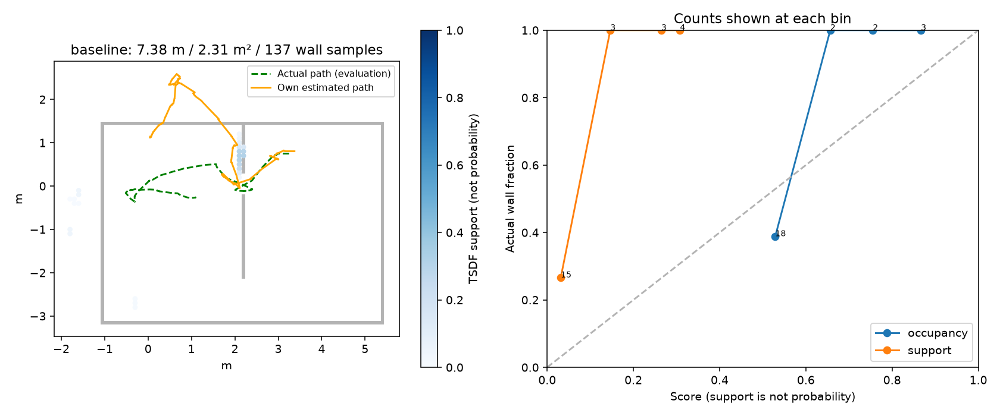

# egomap23 — RBPF 갱신 관문 / tape·SEARCH 폐루프 1회 (사전 등록)

2026-10-07 사용자 요청: 범위를 줄인다. egomap22 자료 진단 후 기본 off 옵션 하나,
tape_v1 + 기존 SEARCH + frontier_rbpf_v1 물리 DEV **1회만**. 재질/자세 비교 없음.
기존 사용자 파일4개·PR406·egomap22 원본은 수정하지 않는다. DRAFT, TensorBoard 생략 유지.

## 오프라인 원인 (구 자료, 평가·튜닝 자료로만)

|egomap22|정합/재표본|정지 정합/재표본|초기 조상100→|마지막 서로 다른 XY(1mm)|σXY 처음→끝 m|
|---|---:|---:|---:|---:|---:|
|photo|24/14|0/0|1 (t17.1)|85|.10169→.00644|
|speckle|137/32|128/28|1 (t134.7)|13|.10238→.00150|

[진단과 입력 해시](results/egomap22-audit.json), `code/audit.py`.
Neff<100/2 조건은 이미 정확히 적용됐다. 마지막 Neff71.63/68.11은 재표본 후
균등화 때문에 계보 다양성을 보증하지 않는다. 조상1개도 현재 pose가 모두 동일하다는 뜻은 아니다.
photo는 이동 중에도 붕괴했으므로 정지 중복만으로 모든 오차를 설명하지 않는다.
모션은 v122 고정 표(2245bb9f…)이며 Q가 0인 정지는 올바른 동작이다. 누적 명령 Q 대각합은
photo [.000168,.000679,.005537], speckle [.000033,.000124,.001000] (m²,m²,rad²).
이를 반복 관측 likelihood가 줄이고 재표본화가 계보를 제거했다. 모델 평균 편향·오정합은
이 Q가 표현하지 못할 수 있다. GT로 잡음을 맞추거나 임의 noise floor를 넣지 않는다.
첫 감사 JSON에 numpy 정수 직렬화 오류1회, Python scalar 변환으로 저장만 수정했다.

## 표준 적용 / 옵션 (구현 전에 고정)

`rbpf_update=gmapping_motion_v1`, 기본 `off`.
[Grisetti et al. TRO2007](https://people.eecs.berkeley.edu/~pabbeel/cs287-fa13/optreadings/GrisettiStachnissBurgard_gMapping_T-RO2006.pdf)
§III-C의 Neff<N/2 선택적 재표본화·기존 improved proposal은 유지한다.
[OpenSLAM processScan](https://github.com/ros-perception/openslam_gmapping/blob/c716f0192131029b31a49554f8c11353d29819a5/gridfastslam/gridslamprocessor.cpp#L338-L366)의
누적 병진/절대 회전 및 first-scan 조건을 적용한다.
[ROS slam_gmapping 기본값](https://github.com/ros-perception/slam_gmapping/blob/eec86068ceb92ebc433b435fe482db14c562f268/gmapping/src/slam_gmapping.cpp#L213-L220)
그대로 **linearUpdate=1.0m, angularUpdate=.5rad, temporalUpdate=-1, resampleThreshold=.5**.
이동 정보만 자기 명령 DR로 대체한다. 표준식 재구현, 원본 코드 복사/새 의존성 없음
(OpenSLAM BSD 계열, ROS wrapper BSD-3). 원문은 이번에 열어 확인했다.

첫 유효 scan 또는 누적 DR 거리≥1m 또는 |회전| 합≥.5rad일 때만 RBPF 관측·정합·지도 삽입.
나머지는 명령 예측/공분산 전파만 하며 RNG·입자 가중·지도는 갱신하지 않는다.
frontier의 현재 RGB free/장애물 안전 관측은 계속 사용한다. 범용 lidar 전체를 대체했다고 주장하지 않는다.
GT로 gate를 판단하지 않고 기존 settle/range/peer/중복 검사도 유지한다.
확인: off bytes 동일, 정지 반복으로 covariance/RNG/지도 불변, 회전·병진 관문,
Neff 선택적 재표본화 기존 시험. egomap22 same-input on frontend 오프라인 재생만 추가.
그 결과로 문턱을 바꾸지 않는다. graph/모션/검출기/active-loop 조건은 egomap22 그대로.

## 물리 1회 / 판정

- 소스 커밋·push 및 오프라인 시험 후 lock null일 때만 ugrp_session/표준 workflow.
- seed22001, setup 시작[3.25,.75,π], r3 단독 자기 RGB/명령. 경로 지정/GT 제어 없음.
- real_v1 강성 + tape_v1 + SEARCH(PWM3=740) + v122 + RBPF100 + graph + switchable +
  inverse_sensor/TSDF + frontier_rbpf_v1 + information_gain_v1 + gmapping_motion_v1.
- 180 SIM s, wall 최대30분. 실제 접촉/기울기/실행 오류는 종료, dev_light. freeze/모델0.
  중단 때 새 재실행 없이 partial을 보존. 결과 저장은 finally에서 무조건 재정합하지 않고,
  이미 완료한 최종 graph가 있으면 재사용, 없으면 frontend를 별도 표시한다.
- egomap22 기준 유지: P≥.70/R≥.50(실제 경로 FOV 영역), 벽RMSE≤.15/경로RMSE≤.25m,
  거리≥3m/footprint union≥.75m²/가시 벽표본≥50, 접촉·잘못된 문0, 예산 완료 또는 B도착.
  B 확인/GT 도착, 전체 P/R, 노출 분모를 함께 기록. 작은 범위로 성공을 주장하지 않는다.
- raw `/Users/changmin/projects/ugrp/outputs/rbpf-motion-gate-v1/`, 예상≤300MiB;
  ENOSPC=HOST_ERROR. 디스크/잠금 확인, S2 동시 실행 금지. 실패 후 튜닝·두 번째 물리 없음.

## 구현 후 same-input 재생 (물리 전 동결, 개선으로 해석하지 않음)

|egomap22 입력|재표본 off→on|초기 조상 off→on|종료 σXY off→on m|frontend 경로 RMSE off→on m|3σ 초과 off→on|
|---|---:|---:|---:|---:|---:|
|photo|14→2|1→17|.00644→.18066|.5533→.5953|406→234 /459|
|speckle|32→2|1→1|.00150→.00210|.1440→.2314|599→656 /740|

on 처리 scan7/4, 보류115/681. 기존 speckle 마지막 저장 scan1개는 원 own-contact trace가
중단 전에 기록되지 않아 on 입력에 포함하지 않았다(원 입력 한계). 전체 matched4/4.
**재표본 횟수 감소가 올바른 posterior/위치 회복을 뜻하지 않는다.** speckle은 초기2회의
재표본화로도 계보가 붕괴했다. 오정합·너무 집중된 likelihood/제안분포·보정 모델의 체계 오차는
이번 motion gate가 해결하지 않는다. 관문/잡음/입자수 재튜닝 없이 사용자 지정 기준선1회 진행.
`code/replay.py`는 own 예측을 저장·SHA 봉인한 뒤 GT 경로 평가를 한다. graph 재생/새 물리 아님.

구현은 `harness/rbpf_motion_gate.py`의 opt-in 메서드 어댑터다. off는 원 객체/메서드를
그대로 반환한다. ego-map/PR409 기존94파일·기존29파일 수정0. 원 GMapping과 달리
입력 간격은 벽 접점이 존재하는 카메라 프레임이며, 누적량은 그 간격의 명령 DR 차이다.
물리 어댑터는 egomap22 `scripts/run_active_wall_map.py`를 별도 파일로 재사용했다.
새 옵션 연결·SEARCH/tape 고정 외에는 명령/추정 루프 그대로다. 30분 타이머가 graph 중에도
작동하고 종료 저장은 재정합을 중복 실행하지 않는다. 이 저장/예산 보완은 정책 변경이 아니다.

물리 전 검증: 기존 probability/active 23시험, 새 gate 포함28시험,
최종 gate/active/workflow **31시험 통과**(중복 합산 아님). 정지 반복 불변·off bytes·
active forecast 복사본 격리를 확인했다. 여유34.22GiB, 잠금 null/S2 물리 프로세스 없음 확인.
기존 TensorBoard viewer는 건드리지 않는다. 디스크 보고의 잘못된 section 이름1회는 `fs`로 수정했다.

## 결과 — 한 번의 기준선 완료, 관문0/1

사전 등록 `29ae790f`, 구현/물리 소스 `85554a9605ad8b89cab36b1e40d06fcef136d33d`.
180 SIM s/901 RGB, 최종 graph 저장 완료. wall454.18s는 취득 기록이며 속도 비교가 아니다.
초기 CLI 파일 직접 실행은 `sim` import 오류로 **잠금·물리 생성 전** 종료됐다.
모듈 실행으로 고친 뒤 실제 물리1회. 모델/freeze0, 자기 세션 종료·잠금 null 확인.

|tape·SEARCH·motion gate on|결과 / 분모|
|---|---|
|실제 이동 / footprint union|7.379m / 2.313m²|
|가시 벽 범위|137/329표본=41.64%, 길이 근사13.7m|
|영역 P / R|14/17=82.35% / 20/137=14.60%|
|전체 지도 P / R|14/25=56.00% / 20/329=6.08%|
|벽 / 경로 RMSE, 종료 XY|.3909m / 1.6669m (891자세), 1.7415m|
|자기 B 첫 확인 / 실제 도착|시작 후40.4s / 없음|
|벽 접촉 / 기존 오통로 계획 지표|0 / 10건 (문 후보727프레임, feasible163행, 경로 근접44행)|
|RBPF 처리 / 보류 / 삽입|55 / 836 / 7프레임|
|재표본 / 남은 초기 조상 / 종료 σXY|21 / 1 / .00815m|
|능동 재방문 발동 / 수락 loop|0 / 0|

**영역 precision 통과만으로 성공이 아니다.** 17개 평가 셀·삽입7프레임뿐이고 recall,
벽/경로RMSE와 오통로 계획 기준이 미달이다. 오통로10건은 GT 벽과 겹친 후보 경로를 세는
기존 대리지표이며 실제 충돌10건을 뜻하지 않는다. 가시 분모는 egomap22와 같은 FOV/거리/
벽-only 가림(물체·자기 가림 미반영). 전체 지표도 함께 보존했다.
이 한 번은 요청한 고정 조건의 DEV 기준선이며 egomap22 대비 개선의 인과 비교가 아니다.

잔여 핵심: **21회 재표본 모두 low_overlap으로 정합을 거부한 관측에서 발생**했다.
기존 motion fallback도 sensor likelihood로 가중하는 경로를 유지했기 때문에 이동 gate만으로
오측정/모델 불일치를 해결하지 못했다. t38.5에 초기 조상1개, 종료 오차1.74m에 σ .008m.
Neff 문턱·모션 분산을 임의로 늘리지 않았고 추가 물리/후속 튜닝을 하지 않는다.

모션만 별도 평가한 egomap22 photo는 DR RMSE .6403m/종료1.0062m,
종료 σ .1926m·3σ 초과263/459였다. speckle은 .0968m/.1019m,
σ .1064m·3σ 초과0/740이다. 즉 photo에는 명령 모션 모델의 불일치도 있고,
speckle은 관측 갱신 후 과소 불확실성이 더 두드러진다. GT 평가만, 잡음 fitting0.
[재현 진단](results/egomap22-audit.json), [기준선 진단](results/baseline-diagnostics.json).

시험 최종31개 통과. off byte/RNG/정지 gate/peer/복사 격리·원본 workflow 계획 검사.
예전 PR405 전체 CI의 VIS3/역사적 pin 실패와 로컬 관련 시험 통과는 별개이며 DRAFT 유지.
[확인한 원본 commit](results/source-references.json), [raw 해시](results/raw-manifest.json):
943파일122,535,647bytes, `outputs/rbpf-motion-gate-v1/` 로컬 보존(원격 raw 백업 아님).
코드·작은 결과·그림만 커밋한다. 새 라이브러리/venv/Drive/TensorBoard 변환 없음.
