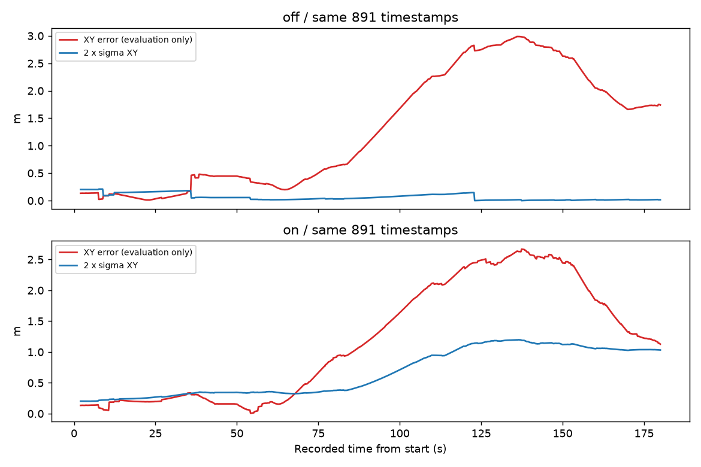

# egomap24 — 거부 정합 가중치 / 선택적 재표본 (사전 등록)

2026-10-07 사용자 요청. egomap23 tape·SEARCH 기록 하나만 오프라인 off/on.
무늬·자세·모션 평균·검출기·입자100·graph·switchable·confidence·motion gate는 고정.
기본 off 새 옵션 `rbpf_rejection=gmapping_selective_v1`. 튜닝/GT fitting 없음.

## 원문 확인 및 적용 범위

- [Grisetti et al., T-RO 2007 §III-C](https://people.eecs.berkeley.edu/~pabbeel/cs287-fa13/optreadings/GrisettiStachnissBurgard_gMapping_T-RO2006.pdf): Neff 기반 선택적 재표본.
- [OpenSLAM gridslamprocessor.hxx L60–85](https://github.com/ros-perception/openslam_gmapping/blob/c716f0192131029b31a49554f8c11353d29819a5/include/gmapping/gridfastslam/gridslamprocessor.hxx#L60-L85): Neff=1/Σw², 엄격한 `<N/2`. 기존 코드에도 이미 있으므로 문턱 변경 없음.
- 같은 파일 [L16–31](https://github.com/ros-perception/openslam_gmapping/blob/c716f0192131029b31a49554f8c11353d29819a5/include/gmapping/gridfastslam/gridslamprocessor.hxx#L16-L31)은 **정합 실패 후에도 likelihood/weight 갱신**. 따라서 이번 거부 시 생략은 원본 그대로인 기능으로 인용하지 않는다. 사용자 지정 관측 거부 규칙이다.
- [ROS 기본값 L224–239](https://github.com/ros-perception/slam_gmapping/blob/eec86068ceb92ebc433b435fe482db14c562f268/gmapping/src/slam_gmapping.cpp#L224-L239): srr=.1, srt=.2, str=.1, stt=.2; resampleThreshold=.5. egomap23의 기본값 행 번호213–220은 이 고정 SHA 기준으로 부정확했으며 여기서 바로잡는다.
- [OpenSLAM motionmodel.cpp L25–35](https://github.com/ros-perception/openslam_gmapping/blob/c716f0192131029b31a49554f8c11353d29819a5/gridfastslam/motionmodel.cpp#L25-L35): body Δ=(dx,dy,dθ), sxy=.3*srr, σx=srr|dx|+str|dθ|+sxy|dy|, σy=srr|dy|+str|dθ|+sxy|dx|, σθ=stt|dθ|+srt*hypot(dx,dy). Q=diag(σ²).

원본 raw를 직접 읽어 확인했다. 표준식 재구현(BSD 계열), 새 라이브러리 없음.
모션 입력만 wheel odom 대신 **v122 자기 명령 평균**. 원본 processScan 입력 주기에 대응하여
각 own RGB 시각 사이 Δ에 위 잡음을 1회 적용한다(내부 .05s 적분마다 제곱해 작아지는 오류 방지).
기존 Gaussian proposal을 위해 Q는 pending covariance에 선형 전파하고 관측 때 표본화한다.
이는 원본의 매 scan 표본화와 수치적으로 동일하다는 주장이 아니다. 계수·비율은 그대로,
v122 기존 prediction_variance를 대체하며 중복 합산/GT 보정/추가 noise floor 없음.

## 거부 의미와 off 보존 (구현 전 고정)

기존 정합 문턱 그대로. 한 프레임의 대표는 **갱신 전 선택 입자**다. 대표 정합이 거부되면
그 프레임은 motion-only: 모든 입자의 센서 가중치·지도 삽입·재표본을 생략한다.
대표가 수락되면 기존 입자별 제안을 평가하되, 거부 입자의 likelihood 증분은 0,
그 입자는 motion proposal·지도 삽입 없음. 가중치 후보의 최댓값 입자까지 거부 상태면
프레임 전체를 motion-only로 처리해 거부 프레임에서 재표본하는 역전을 막는다.
이 관측 유효성 규칙은 사용자가 요구한 lidar→벽 접점 제약 대응이며 GMapping 원본 규칙이 아니다.
수락 프레임에서만 Neff<N/2일 때 기존 systematic resampling. bootstrap/deferred에는 센서 가중 없음.
거부에서도 명령 예측·모션 불확실성은 보존하고 실제 운동을 멈추지 않는다.
off는 객체/메서드/출력 그대로, 기존 골든 bytes·RNG 검사로 고정. 혼합 수락/거부도 시험한다.

## 재생 및 물리 관문 (결과 후 변경 금지)

입력 `/Users/changmin/projects/ugrp/outputs/rbpf-motion-gate-v1/baseline/` (egomap23, 180s/901RGB).
같은 own contacts/commands를 사용한다. 원본 SHA 봉인 검사 후 예측을 저장·해시 봉인하고
GT를 평가에서만 읽는다. off 전체 재생은 기존 frontend 출력과 일치 확인.
비교는 동일 frontend 시각의 종료 오차 e, σXY=sqrt(최대 XY 공분산 고윳값), e/σ, e/(2σ),
경로 RMSE·2σ 초과 수, 재표본/거부 재표본/초기 조상, 영역 P/R·분자/분모,
실제 이동·footprint union·가시 벽 표본·삽입 scan 수. graph 결과와 frontend를 혼용하지 않는다.
공유 입력 취득 범위는 같으며 반사실적 새 경로/물리 개선으로 해석하지 않는다.

**물리 진입: on 종료 e≤2σ이고 e/σ가 off보다 낮고, 거부 프레임 재표본0.**
2σ는 운영 관문이며 2D Gaussian 95% 영역이라고 주장하지 않는다. 영역/경로 성능 악화도 그대로 보고한다.
미달이면 원인만 기록하고 물리0회 종료. 통과 때만 egomap23 동일 tape·SEARCH·seed22001·
180SIMs·dev_light 조건으로 옵션 on 물리 **1회**. S2 잠금 null일 때 agent_lock/ugrp_session,
freeze/모델0. 기존 지도 성공 기준은 egomap23 그대로, 소스 commit/push 후 실행한다.
raw `outputs/rbpf-rejection-v1/` (기본 checkout 절대 경로), ENOSPC=HOST_ERROR.
TensorBoard 생략 유지, PR405 DRAFT, 다른 worktree/PR406 수정·다른 프로세스 조작 없음.

## 결과 — 물리 관문 미달, 추가 실행0

평가·기록 완료: 2026-10-08 KST.

사전 등록 `c0ae679f`, 구현 `4ffb1e5b`, JSON 검증기 수정 `6cc1dc42`.
입력은 egomap23 그대로이며 on/off 각각 한 번 재생. 추정기/계수/문턱 재튜닝 없음.
예측 저장·SHA 봉인 뒤 GT 평가. graph를 재최적화하지 않은 **frontend 동일 시각 비교**다.

|지표|off (egomap23 그대로)|on|
|---|---:|---:|
|종료 XY 오차 / σXY m|1.74149 / .008149|1.12721 / .516201|
|과신 e/σ / e/(2σ)|213.703 / 106.851|2.184 / 1.092|
|경로 RMSE m / 2σ 초과|1.66688 / 729/891|1.50424 / 567/891|
|재표본 / 거부 프레임 재표본|21 / 21|1 / 0|
|남은 초기 조상100개 중|1|62|
|영역 precision (정답 셀/평가 셀)|82.35% (14/17)|0% (0/14)|
|영역 recall (덮은/가시 벽 표본)|14.60% (20/137)|0% (0/137)|
|전체 지도 precision / recall|56.00% (14/25) / 6.08% (20/329)|13.04% (3/23) / 1.52% (5/329)|
|벽 RMSE m / 삽입 프레임|.39095 / 7|.25997 / 7|
|실제 취득 거리 / footprint union|7.379m / 2.313m²|동일 녹화|
|가시 벽 범위 / 입력 표본|137/329=41.64%, 13.7m 근사 / 901RGB·891자세|동일 녹화|

**e≤2σ 관문 실패**(1.12721>1.03240m). 비율 감소/거부 재표본0은 충족하지만
물리 진입은 AND 조건이므로 **새 물리0회**, agent_lock acquire0, 모델0.
오프라인 재생의 B/접촉은 새로운 제어 성능이 아니다. 원 녹화 B 실제 도착 없음,
자기 확인 시작 후40.4s, 벽 접촉0은 그대로 참고만 한다.

남은 원인: 관측 갱신으로 인한 입자 붕괴는 크게 줄었으나 모션 평균 편향은 남는다.
명령만 적분한 종료 오차1.75637m, yaw 오차−113.40°(평가만).
on 정합 수락은 t8.9/12.1/13.7 세 번뿐이며 t13.7의 Neff49.464 때만 재표본했다.
그 뒤 거부48회=search_boundary37 + low_overlap10 + high_residual1.
끝 부근 yaw 오차도 약−105.56°이고 기존 국소 탐색 범위는 ±.5m/±8°다.
이는 누적 편향을 국소 정합이 회복하지 못하는 양상과 일치한다. 잡음 계수로 편향을 fitting하지 않았다.
남은 초기 조상62개는 정확한 posterior/지도라는 보장이 아니다. 지도 삽입은
두 조건 모두 동일한 초반7프레임(t3.3–36.1)에 머물고, 선택 입자/지도는 달라졌다.
on은 전체 정답 셀3개도 평가 가시 영역 밖이라 영역 P/R=0이며 이를 숨기지 않는다.
거부 생략과 공식 잡음의 개별 효과는 이번 묶음 비교로 분리할 수 없다.

## 코드·검증·재현

- `harness/rbpf_rejection.py:20` 공식 잡음식, `:50` RGB 간 Δ의 Q, `:71` 두 단계 거부 처리,
  `:190` 수락 관측에서만 재표본 호출. 실제 `<N/2`는 기존 `harness/self_map_rbpf.py:209–213`.
- `harness/rbpf_motion_gate.py:63`에는 optional observer 위임만 추가. 기본 경로는 그대로다.
- **관련 시험29개 통과**: rejection7 + motion gate6 + probability16. off 골든/RNG,
  낮은 Neff라도 거부 시 불변, 혼합 거부, 정확히 N/2 경계, 공식 잡음식, 중복 시각,
  forecast 복사본 격리. pytest에선 빈 peer 관측이 먼저 형식 검사에 걸리는 시험 입력1건만 고쳤다.
- off 실제 녹화 재생도 `frontend-poses/grid/decisions/ledger` **4종 JSON bytes 모두 동일**.
  첫 검증은 내부 tuple과 JSON list의 Python 비교가 달라 grid=False였으나 저장 byte는 처음부터 동일했다.
  검증기를 출력 byte 비교로 수정했고 예측 재실행/덮어쓰기 없이 `verify-off`로 확인했다.
- `code/replay.py off`, `on`, `score`; `code/diagnose.py`. 기존 출력 디렉터리가 있으면 재생 덮어쓰기 거부.
  on/off 예측 raw 8.31MB, 소스·입력·예측 해시는 [raw manifest](results/raw-manifest.json),
  [비교 수치](results/comparison.json), [수락/거부 진단](results/diagnosis.json), [원문 SHA](results/sources.json).
- raw `/Users/changmin/projects/ugrp/outputs/rbpf-rejection-v1/` 로컬 보존. 작은 표/그림/코드만 Git에 보존.
  PR405 DRAFT 유지. 전체 CI/물리 성공 주장 없음. 조건 미달로 이 단계 종료, 후속 튜닝 없음.
