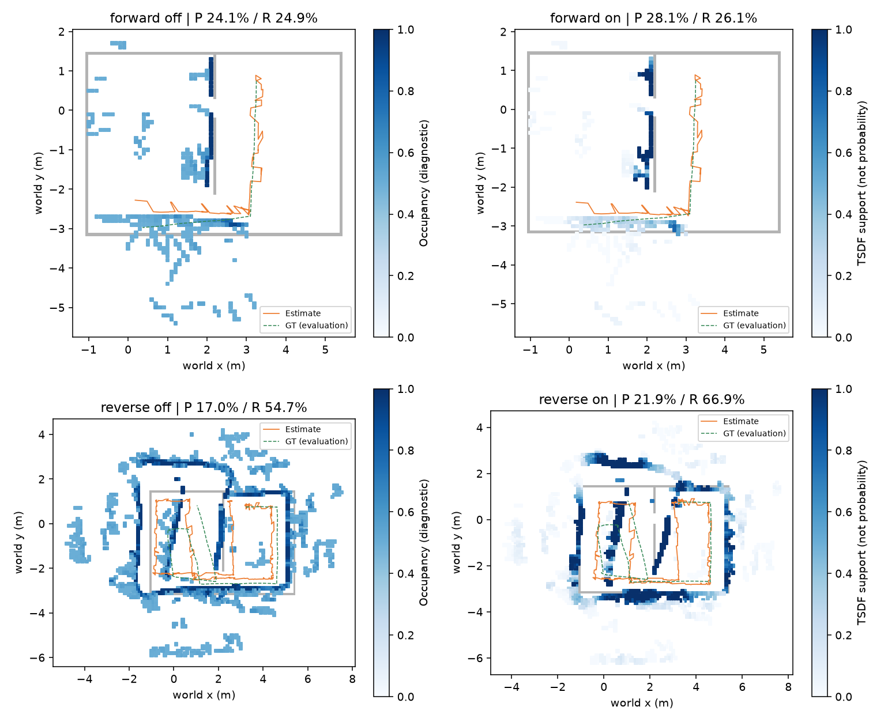
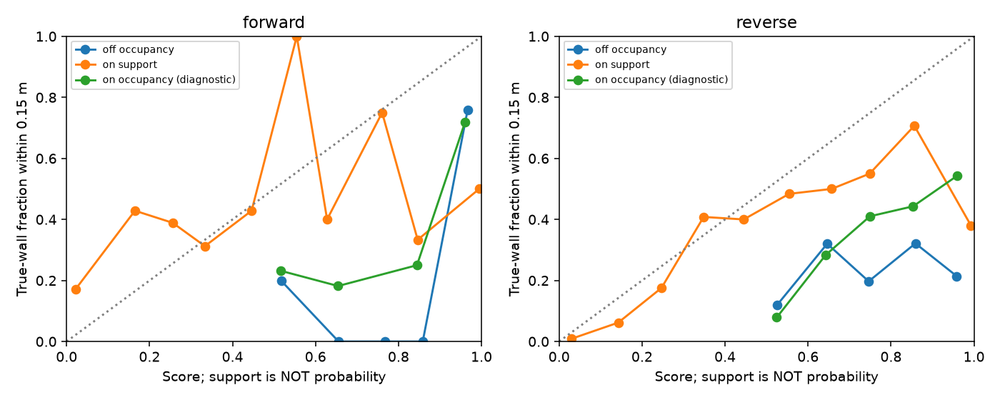

# egomap21 — Switchable Constraints와 관측 증거량 (구현 전 사전 등록)

2026-10-07 사용자 요청. 시작 `2ff5fe9c`의 egomap20 정/역방향 **기존 녹화만** 쓴다.
새 물리/렌더/모델/agent_lock/유료·원격 계산0. S2 프로세스·PR406·다른 worktree 변경0.
동일 거짓 정합 재발로 기존 문턱 조정을 중단하고 아래 공개 방법을 한 번 적용한다.
이미 열람한 DEV 자료이며 새 확증 자료가 아니다. 결과 후 문턱/모션 재적합0.

## 방법 선택과 고정 옵션

|옵션|기본|on 의미|
|---|---|---|
|`loop_rejection`|`off`|`switchable_v1`: Sünderhauf–Protzel IROS2012 식(1)의 선형 switch, 초기값/사전 평균1, 사전 분산1, 범위[0,1]|
|`wall_evidence`|`off`|`tsdf_weight_v1`: Cartographer TSDF의 누적 fusion weight와 관측 횟수/시선 각도 분산을 별도 지도 필드로 기록|

Switchable Constraints는 기존 submap/scan 그래프에 루프별 변수만 추가하므로 PCM의
상관 경로 공분산 추정이나 새 라이브러리가 필요 없다. 기존 Huber만으로 실패한 자료에
같은 min_score를 올리는 튜닝을 하지 않는다. 목적함수는 intra 제약 제곱합 +
`s² × loop Mahalanobis 잔차² + (1−s)²`. 첫 submap 고정, 기존 제약/공분산 유지,
SciPy sparse least_squares 기존200회 한도. on에서 loop Huber를 switch 항으로 대체한다.
연속 switch를 최적화하며 hard 삭제/두 번째 재최적화는 하지 않는다. **s≥.5 유지, s<.5 억제**는
이번 진단 집계 기준으로만 사전 고정한다(원 논문이 요구한 이진 문턱이라는 주장은 하지 않음).
수렴 실패 시 frontend로 되돌리고 실패를 기록한다. GT는 switch/후보 선택에 쓰지 않는다.

TSDF 공개 구현의 Gaussian incidence kernel σ=.5rad, distance-to-hit kernel σ=.5m,
truncation=.3m, 최대weight10, range exponent0, 한 scan의 셀 중복 갱신 금지를 따른다.
전체 signed-distance/weight를 보조 필드로 적분하고 기존 log-odds 격자/자유 공간 지우기는
그대로 둔다. 제한된 벽 선분의 법선을 쓰는 부분만 LiDAR의 이웃점 법선 추정과 다르다.
동일 cell의 관측 수, 시선 방향의 원형 분산 `1−|Σ exp(iθ)|/N`도 함께 기록한다.
**각도 다양성은 별도 진단값**이며 임의의 보너스로 weight를 부풀리지 않는다.
보고 score=`min(weight/10,1)`은 관측 지원량, **실제 벽일 확률이 아니다**.
기존 점유 log-odds는 셀 점유 판정/정합에만 유지하며 on의 벽 신뢰도로 노출하지 않는다.
TSDF가 점유 지도 자체를 대체하거나 자세 오류를 해결한다는 주장은 하지 않는다.

## 재생 봉인·GT 경계

입력: `outputs/arena-wall-map-v1/predictions/{forward,reverse}`의 egomap20 봉인된
자기 접점, RBPF100 frontend ledger/path, graph 후보·공분산. 이전 prediction 두 receipt와
파일 hash를 검증한다. RGB/명령→frontend가 동일하므로 76,648회 후보 정합을 다시 하지 않고
동일 후보를 재사용한다. 새 optimizer 및 지도 적분만 재생하는 **back-end 비교**다.
예측 단계에서 eval_only/static_map/GT를 읽지 않고 두 건을 먼저 저장·해시 봉인한다.
off는 기존 graph ledger/path/grid/문구 bytes를 그대로 복제해 SHA 일치 검사한다.
on은 원 frontend에서 시작하며 기존 graph 최적화 결과를 초기값으로 쓰지 않는다.
기존 detector/positive_depth/servo_stiffness/tape/v122/RBPF100/inverse_sensor 모두 동결.
새 wall_evidence는 inverse_sensor_v1 삽입 weight와 다른 이름/의미로 공존한다.

채점은 그 뒤 출발 GT SE(2) 한 번으로 정렬한다. 정답 벽·실제 pose는 평가 전용.
두 조건 각각 P(.15m), 전체 R=덮임(329표본), 벽/경로 RMSE, 종료XY, median/P95,
loop 유지/억제/기존 거부 이유, yaw RMSE/P95/종료를 보고한다. DR→frontend→graph off/on의
yaw를 나란히 놓아 기존 yaw 정합의 회전오차 흡수 여부만 확인한다. v122 변경0.
ECE는 같은10개 bin/벽 .15m 라벨을 유지한다. off의 기존 점유 ECE와 on의 증거 score-ECE를
함께 보고하되 **on 값은 확률 calibration이 아닌 score와 정답률의 간극**으로 명시한다.
두 수치 차이만으로 calibration 개선을 주장하지 않는다. 원 점유 ECE도 보조열로 남긴다.

## 결과 전 고정 관문

- 기존 §17/§19의7개 상대 기준을 동일 관측 DR 대비 그대로 재사용한다. 추가로 off→on
  P 비감소, R 하락≤2%p, 벽/경로 RMSE 비증가를 요구한다.
- 유지(s≥.5) 루프의 GT 상대제약 XY 오차>.30m인 거짓 유지 **0개**(평가에만 사용).
- on score≥.9 셀 실제벽 비율≥.90, score-ECE≤.10. 해당 셀0개면 고신뢰 검증 불가로 실패.
- F 내보내기는 egomap20 그대로 각 녹화의 P≥.90, R≥.70, 벽RMSE≤.15m,
  경로RMSE≤.25m와 위 기준을 모두 만족할 때만 구현한다. 기존 실제 완주0/2는 바뀌지 않으므로
  전체 경기장 지도 완주 주장은 금지한다. 완주 조건도 egomap20의 별도 미충족 항목으로 남긴다.
- 어떤 관문이든 미달이면 `wall_export=segments_confidence_v1`은 보류하고 원인만 기록·종료.
  같은 두 건으로 재튜닝/재채점하지 않는다. 입력 누락/비유한 값/ENOSPC는 HOST_ERROR.

관련 시험1–3파일 통과 후 사전 등록 commit/push → 구현·골든 시험 → 소스 commit/push →
두 건 예측·봉인 → 평가1회 → 결과 commit/push. 새 venv/의존성0, 잠금·속도 비교0.
새 raw: `/Users/changmin/projects/ugrp/outputs/robust-wall-map-v1/`, 기존 자료 덮어쓰기/삭제0.
PR405 DRAFT, 병합/force/reset0. TensorBoard 생략 지시 유지, Drive0.
원시 결과는 로컬 보관이며 Git 원격 백업은 코드·작은 결과·그림에 한정한다.

출처와 원본 대조: [REFERENCES.md](REFERENCES.md).

### 구현 경계 (자료 재생 전)

기존 동결 파일은 수정하지 않았다. `harness.self_wall_memory_robust.SelfWallMemory`가
기존 motion memory를 상속하여 새 옵션을 노출한다. 두 옵션 off는 기존 메서드로 그대로
위임하고 snapshot/격자/graph 결과의 직렬화 bytes를 검사한다. on의 결과는
`pose_graph_result` 및 `evidence_view`에만 저장하고 frontend/RNG/명령 모델에 되먹이지 않는다.
command/관측을 받으면 최종 view를 무효화한다. 기존 LLM 문구는 좌표만 유지하며
게이트 전 F 선분+신뢰도 export API는 만들지 않는다.

`code/backend_replay.py`는 동일 후보 cache의 hash와 기존29개 동결 파일을 확인한 뒤
두 조건을 봉인한다. `code/offline_score.py`는 두 봉인이 모두 있어야 GT를 읽는다.
TSDF의 ray-cell 순회는 기존 0.1m Amanatides–Woo를 재사용(원본 superscaled ray mask와
격자 경계 tie 차이 가능). 표면 법선은 기존 선분으로 계산하고 원본 kernel/weight 식은 유지한다.
새 라이브러리/C++ 소스 복사0. 최초 합성 시험에서 bounded solver의 s≈1 끝자리 오차를
과하게 요구한 검사1개가 실패하여, 해석해 대비 목적함수 차이<1e−6 검사로 고쳤다.
optimizer/사전 문턱은 바꾸지 않았다. 실제 녹화 결과로 단위 시험을 맞춘 것이 아니다.

### GT 채점 전 저장 오류

소스 `0618438f`의 정방향 graph 계산 뒤 TSDF cell index의 NumPy int64를 JSON에
저장하지 못했다(HOST_ERROR). GT 읽기0. 기존9개 파일을 `forward/host-error.json`에
hash 보존했다. cell index를 Python int로 직렬화하는 수정과 JSON roundtrip 시험을 추가했다.
`--resume-evidence`는 이 봉인을 검사하고 **graph를 재실행/덮어쓰기하지 않고** 증거량
저장부터 이어간다. 추정 수식/관문/후보/문턱/모션 변경0, 최초 실패도 보존한다.

## 결과 — 관문0/2, F 보류·추가 튜닝 없이 종료

사전 등록 `20409ff7` → 구현 `0618438f` → 정수 직렬화/저장 재개 `f15c1cbb`.
정방향 graph는 `0618438f`에서1회 계산한 것을 보존했고, 역방향은 `f15c1cbb`에서1회 계산했다.
추정 코드는 두 SHA 사이 동일하다. 두 예측 receipt 봉인 후 `offline_score.py`로 GT 평가1회.
물리/렌더/모델 호출/agent_lock0, 모션 재적합0, 새 의존성/venv0. **새 완주 성공은 없다.**

### off / on 같은 지표·같은 분모

off는 egomap20의 RBPF100+graph+inverse_sensor_v1. on은 동일 frontend/후보에
switchable_v1 및 tsdf_weight_v1만 추가했다. 전체 R=덮임의 분모는 모두329벽 표본.
두 녹화는 별도 행으로 유지하고 기존 s1042 등 다른 코호트와 합산하지 않는다.

|녹화|옵션|점유 P %|R/덮임 %|벽 RMSE m|경로 RMSE m|종료 XY m|점유 ECE (기존 진단)|지원량 score-ECE (비확률)|
|---|---|---:|---:|---:|---:|---:|---:|---:|
|정방향|off|24.14|24.92|.7650|.2464|.7184|.3259|—|
|정방향|on|28.10|26.14|.7928|.1974|.6125|.2909|.1926|
|역방향|off|17.01|54.71|1.3227|.9489|1.4501|.4702|—|
|역방향|on|21.93|66.87|1.2783|1.1184|1.9741|.4245|.2023|

P 분모는 정방향319→306셀, 역방향1,376→1,336셀. 공통 GT .15m 거리 판정이다.
원 점유 ECE는 비교 진단으로만 남기며 on의 벽 신뢰도에 점유 확률을 사용하지 않는다.
지원량 score-ECE는 확률 예측 평가가 아니므로 .4702→.2023을 확률 calibration 개선으로
해석할 수 없다. 모든 occupied cell을 평가하고 낮은 지원량 셀도 제거하지 않았다.
시간별 덮임/경로 분포/10-bin 표/관문 개별값은 [정방향](results/forward.json),
[역방향](results/reverse.json), [전체 비교](results/comparison.json)에 보존했다.

### 루프 억제와 남은 거짓 정합

|녹화|기존 loop 수락|s<.5 억제|s≥.5 유지|유지 중 GT XY>.30m|최적화 평가 횟수|
|---|---:|---:|---:|---:|---:|
|정방향|1|1|0|0|12|
|역방향|17|16|1|1|109|

정방향 s=.01743으로 정보량은 s²배가 됐다. 역방향 s=.01166–.97466.
두 최적화는 수렴했으며 목표함수는28.205→.491 / 397.588→7.719로 감소했다.
기존 후보 거부 이유/수는 **그대로**이고 새 억제 사유는 switch_suppressed다.
억제는 연속 가중 감소이며 그래프에서 hard 삭제했다고 표현하지 않는다.

역방향 남은 submap60–scan215: s=.974659, GT 상대 XY오차 **1.11376m**,
yaw9.317°. 이 제약은 이미 편향된 frontend 상대 pose와는 **.15654m/2.139°**만 달라
초기 Mahalanobis χ²2.4707, 최적화 뒤 .02444가 된다. 따라서 switch가 유지된다.
이는 **그래프 내부 일관성이 GT 정확성을 보장하지 못하는 한계**다. 해당 constraint의
표준편차는 x .12083m/y .16205m/yaw .18230rad이며 그대로 보존했다.
[사후 원인 계산](results/retained-loop-diagnosis.json). 이 값을 보고 covariance/prior/문턱을 바꾸지 않았다.

### 기존 yaw 정합이 반복 회전 오차를 흡수하는가

|녹화|DR yaw RMSE °|frontend yaw RMSE °|graph off yaw RMSE °|graph on yaw RMSE °|on 종료 signed yaw °|
|---|---:|---:|---:|---:|---:|
|정방향|3.874|5.381|5.737|5.382|−10.183|
|역방향|10.406|9.506|8.983|10.012|−11.802|

frontend 정합 시도32/177회, improved_proposal23/149회. 역방향은 DR 대비 일부 줄지만
P95는 DR16.811°→frontend19.088°→on19.400°다. 정방향은 DR보다 악화한다.
따라서 이 자료에서 기존 자기 지도 정합만으로 반복 회전 오차를 충분히 흡수하지 못했다.
frontend에는 입자 선택도 포함되어 있으므로 이 차이를 yaw 보정만의 인과 효과로 단정하지 않는다.
모션 모델/v122 표/회전 부호/잡음은 변경하지 않았다.

### 관측 지원량과 각도 다양성

on score≥.9 셀 실제벽: 정방향 **18/36=50.0%**, 역방향 **134/353=38.0%**.
등록 기준90%와 score-ECE≤.10 모두 미달이다. 역방향 시선 원형 분산별 실제벽 비율은
<.01의736셀8.56%, .01–.1의492셀37.20%, ≥.1의108셀43.52%다.
더 다양한 관측 방향이 있어도 틀린 자세로 반복 삽입하면 정확한 벽이 된다는 보장은 없다.
TSDF weight/관측수/각도 다양성은 **측정 지원량**으로만 노출한다. 통계적 독립 시행이나
벽 정답 확률로 취급하지 않으며, 이 DEV에서 probability calibration을 fitting하지 않았다.

모든 점유 칸을 표시했다. on의 진하기는 TSDF 지원량이고 off의 점유 믿음과 의미가 다르다.
눈에 옅게 보이는 거짓 셀도 위 P/R 계산에 모두 포함한다.

### 판정·보존

§17/§19의 DR 대비 상대7항목은 정방향 **1/7**, 역방향 **3/7** 통과에 그쳤다.
off→on 지도 P/R은 개선했지만 정방향 벽RMSE 악화, 역방향 경로RMSE 악화와 거짓 loop1개가
남았다. absolute 지도 관문도 미달, 원 취득 완주0/2도 그대로여서 **F export 미구현**으로 종료한다.
추가 후보/공분산/문턱/경로 튜닝 및 새 물리 실행 없이 실패를 기록한다.

관련3파일 **45시험 통과**: 합성 true/false loop·실패시 fallback·peer 거부·off byte golden·
TSDF 중복 scan/포화/각도 다양성/JSON 직렬화·기존 free carving·frontend 불변·비확률 표기.
정/역 off의 ledger/path/diagnostic/grid/text **10파일 SHA 동일**, 원 metric도 정확히 재현했다.
기존29개 동결 파일 및 미추적4파일을 보존했다. 두 그림 직접 확인, 각1MiB/실험5MiB 이하.
원시 결과25파일 **47,581,450bytes**, [manifest](results/raw-manifest.json).
경로 `/Users/changmin/projects/ugrp/outputs/robust-wall-map-v1/`; 로컬 raw는 원격 백업이 아니다.
PR405 DRAFT 유지, 병합/force/reset/삭제0, 다른 프로세스/잠금에 대한 조작0.
