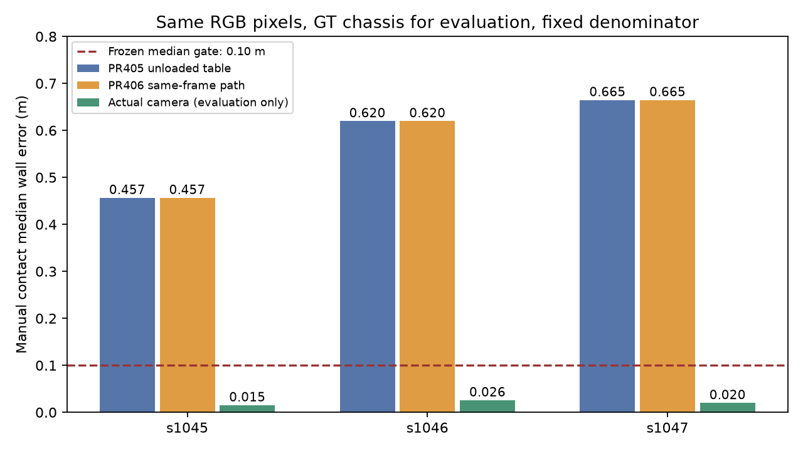

# egomap12 결과 — #406 경로도 동일 프레임에서는 개선 없음

[사전 등록 README](README.md)는 동결 hash 보존을 위해 수정하지 않는다.
사전 등록 `2ccb8a23` → 평가기 `0de0afed` → 빈 주석 진단 수정 `26105759` →
개발0/2·무튜닝 동결 `2f2280e4` → 확인0/4. 이미 본 녹화의 원인 비교이며 새 확증이 아니다.

**PR #406의 고정 투영 경로를 그대로 적용해도 egomap11의 무하중 접점 오차는 그대로다.**
공통21개 카메라 표 entry가 같고, 같은 프레임의 원점/회전 최대 차이0이다.
경로별 줄 번호·표·pitch 출처는 [REFERENCES](REFERENCES.md), 원문/hash는 [sources.json](sources.json).

## 동일 프레임·동일 픽셀·고정 분모

각 수치는 GT 차체 자세에서 투영한 수동 접점의 최근접 GT 벽 오차 **중앙/P90/RMSE(m)**다.
GT는 예측 저장·해시 뒤에만 평가기가 읽었다. 카메라 oracle는 상한이며 제어 입력/후보 통과로 세지 않는다.

| 녹화 | 점 수 | #405 PnP 경로 | #406 원본 경로 | 실제 camera oracle | 관문 |
|---|---:|---:|---:|---:|---|
| s1042 개발 | 461 | .5249/.6920/.4711 | .5249/.6920/.4711 | NA | FAIL |
| s1043 개발 | 387 | .4845/.6758/.5264 | .4845/.6758/.5264 | NA | FAIL |
| s1044 확인 재생 | 389 | .5146/.7165/.5580 | .5146/.7165/.5580 | NA | FAIL |
| s1045 확인 재생 | 380 | .4565/.5615/.4643 | .4565/.5615/.4643 | .0152/.0566/.0326 | FAIL |
| s1046 확인 재생 | 277 | .6199/.7416/.6093 | .6199/.7416/.6093 | .0258/.0682/.0366 | FAIL |
| s1047 확인 재생 | 276 | .6648/.7395/.6359 | .6648/.7395/.6359 | .0200/.0550/.0318 | FAIL |

6건 모두 양의 깊이/4m 유효율100%, baseline 비악화는 통과하지만 중앙≤.10m·P90≤.25m를
실패했다. 후보 선택/임계값/거리 분모를 바꾸지 않았다. 원래 점이 없는 주석 프레임도 NA로 보존했다.
동일 camera에서 #406 `floor_point(t_of_row)`와 직접 ray/plane 투영 최대 차이는
**1.97e−14m**로 부동소수점 수준이다. 투영 공식을 교체해 고칠 차이가 아니다.

## 왜 s1050의 1.53cm를 그대로 승계할 수 없는가

[원 s1050 감사 재확인](results/s1050-reference.json)은 저장166프레임/7195검출 중 GT로 실제
벽 하단이 보이는5171열의 자동 검출 접점 평가다. 저장 columns 재집계로 중앙.015293m,
RMSE.021103m를 재현하고 raw 입력5개 및 columns SHA256을 확인했다. 새 재생/성공 표본이 아니다.
반면 이번 관문은 SEARCH 무하중 자세의 수동 벽 접점이고, #406 원본과 같은 표 entry를 이미 쓴다.

| 명령 자세 (servo3/4/5/6) | 표 상태 | 고정 pitch ° | 높이 m | 용도 |
|---|---|---:|---:|---|
| SEARCH 740/2320/1320/1500 | unloaded | −18.1810 | .230685 | #405/#406 이번 관문, 값 동일 |
| HIGH 896/2035/1894/1500 | unloaded | −29.9024 | .193148 | egomap11 고정 표 |
| 같은 HIGH | loaded 근사 | −31.4557 | .193148 | #406 원문 고정 처짐 적용의 평가용 비교 |
| real carry 600/2200/1400/1500 | loaded 근사 | −28.6620 | .226890 | s1050 감사, 별도 추가 보정 자세 |

실제 카메라와의 차이는 아래와 같다. 부호는 **고정 표−실제**, egomap11의 실제−표와 반대다.
HIGH 그룹은 같은 명령 자세에 대한 고정 표의 counterfactual 비교이며 실제 하중 분류가 아니다.

| 녹화 | 무하중 유효 프레임 | SEARCH pitch 차이 ° | SEARCH 높이 차이 mm | HIGH 프레임 | HIGH unloaded / loaded pitch 차이 ° |
|---|---:|---:|---:|---:|---:|
| s1045 | 558 | +.8588 | +1.736 | 11853 | +2.8256 / +1.2723 |
| s1046 | 351 | +.8781 | +1.830 | 4968 | +2.7965 / +1.2432 |
| s1047 | 375 | +.8720 | +1.823 | 3517 | +2.8145 / +1.2612 |

s1050 real carry의 별도 저장 감사는 +.23721°/+2.990mm였다. 같은 고정 sag라도 s1045–1047 HIGH의
pitch 차이는 여전히1.24–1.27°다. 새 carry 한 자세의 정확도를 다른 자세/하중 조건에 일반화할 수 없다.
SEARCH 접점의 명목 거리 중앙은 s1045–1047 각각3.239/3.410/3.411m이다. 기존 egomap11의
pitch-only 평가용 치환이 편향을 제거한 사실과 일치하나, 이번 비교로 팔 처짐과 차체 기울기의
물리적 원인까지 분리한 것은 아니다. 허용 관측만으로 실제 상태를 아는 새 보정은 확보되지 않았다.

## 판정·보존·검증

- 변경 없는 §17·§19 및 egomap11 투영 관문: **개발0/2, 확인0/4**. #406 경로가 같은 자료에서
  정확하다는 조건을 충족하지 않아 `camera_pose=s2_projection_v1`은 런타임에 등록하지 않았다.
  **RBPF100+pose_graph+wall_confidence 재생0, 누적 지도 그림 갱신0.** 위 그림은 투영 진단이다.
- runtime harness/검출기/지도/기존 옵션 소스 변경0. `floor_boundary_v1`/`servo_fk_v1` 실패와 기본 off 유지.
  관련3파일 **13 passed**, 원문 table/함수 parity·미지원 자세 거부·GT 경계·기존 off 골든을 검사했다.
  사전 등록 전 기존16시험(비어 있지 않은 검출 scan/segment 골든 포함)도 통과했고 그 런타임 파일은 불변이다.
- 최초 평가에서 고정 분모0인 주석 프레임의 진단 max가 오류1회를 냈다. 오류/partial 예측을
  `outputs/s2-projection-comparison-v1/`에 보존하고, 빈 max를 NA로 처리한 뒤 시험 통과·커밋했다.
  완료 재생은 별도 `outputs/s2-projection-comparison-v1-complete/`이며 분모/계수/관문은 바꾸지 않았다.
- [verification](results/verification.json), [raw manifest](results/raw-manifest.json):39파일32,091,485bytes.
  primary outputs 로컬 보존이며 Git 원격 raw 백업이 아니다. PR #406/다른 worktree 수정0,
  물리/렌더/모델/잠금0, 새 의존성/venv0. 같은 편향의 추가 튜닝을 중단한다.

재현은 `compare.py --split development --output <새 raw 경로>` → 고정 `freeze.json`을 지정한
`--split confirmation --freeze experiments/2026-10-07-s2-projection-comparison/freeze.json --output <같은 새 raw 경로>`.
수치 소스·README hash가 동결값과 달라지면 확인 재생을 거부하며 기존 출력은 덮어쓰지 않는다.
`report.py`는 완료 원본을 재검증·요약하고 기존 matplotlib 환경으로 진단 그림을 만든다.
