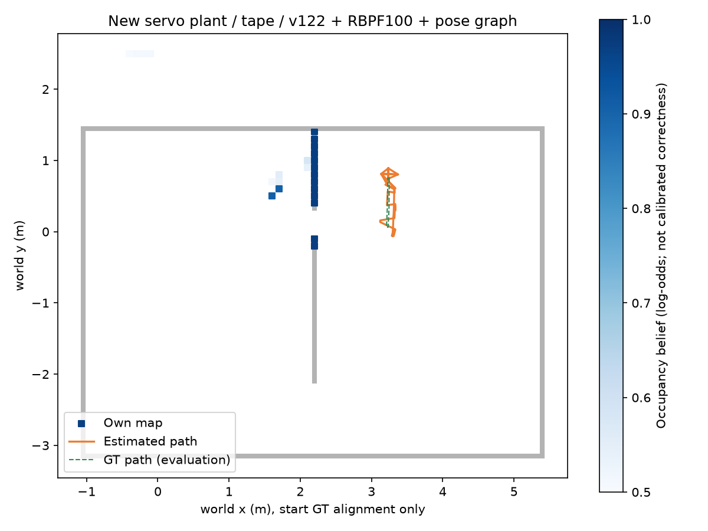

# egomap19 — 시뮬 서보 강성과 v122 이동 모델

2026-10-07 사용자 변경 지시: 명령각에서 처짐을 보정하는 `servo_sag_v1` 작업을 취소한다.
취소 시 source 변경/새 미커밋 파일0, 기존 사용자 미추적4파일 보존. 사용자 판단은
“실물 MasterPi 팔은 무게로 거의 처지지 않는다”이다. 이를 시뮬 후보의 근거로 쓰되
실측 강성/카메라 정확도를 확인한 것으로 표시하지 않는다. 시작 SHA `410b056a`.

## 고정 후보와 출처 경계

- A `servo_stiffness=real_v1`, 기본 off. 전용 Scene wrapper에서 r3의 회전 서보4개만 변경.
  off는 XML 동일 객체 반환. S2 공용 소스·#406 파일·집게 slide·중력·질량·접촉·카메라 mount는 보존.
- 제조사 MasterPi 표: LD-1501MG와 LFD-01M. 레포 v3 도면 분류를 따라 yaw/어깨는 LD,
  팔꿈치/손목은 LFD로 모델링한다. 실물 개체의 라벨·전압은 미측정이며 LDX-218 변형도 존재한다.
- LD 공식 파라미터 이미지: 위치 정밀도0.3°, 정지 토크13kgf·cm@6V /17@7.4V.
  LFD 공식 표:1.8kgf·cm@6V. **LFD의 수치 데드밴드는 공식 자료에서 확인하지 못했다.**
  아래0.3°는 LD 정밀도를 공통 설계 목표로 사용한 가정이며 LFD datasheet 값/실제 deadband로 부르지 않는다.
- 6V 후보, 회전 torque cap=각 공식 정지토크×0.0980665 N·m. 선형 PD `kp=cap/radians(.3)`:
  LD243.480 N·m/rad, LFD33.713 N·m/rad. 이는 토크/위치 사양을 연결한 **보수적 시뮬 설계**이며
  실제 torque-angle 곡선의 식별 결과가 아니다. 포화 유지, 무한 토크/position weld/중력상쇄 없음.
  MuJoCo `position dampratio=1`(reference inertia 기반 임계 감쇠)을 그대로 사용,
  기존 joint damping과 implicitfast 적분·timestep 유지. 파라미터 재튜닝 없음.
- B `motion_model=s2_pulse_v122`, 기본 off. #406 `45b0c173`의 고정 finite-pulse mean curve와
  prediction variance를 복사한다(원본 JSON bytes/hash 유지). source의 initial-body-frame 곡선 보간과
  정지 tail을 그대로 사용. 누락/복합/조기 중단 명령은 오류로 기록하고 M1으로 묵시 fallback 금지.
  명령 시간당 독립 증분 잡음과 Jacobian으로 covariance 전파; 정답은 입력이 아니다.
  s1052 1.015배는 #406의 별도 무하중 평가이며 새 강성 조건에 승계하지 않는다.

## 실행 순서·고정 관문

1. 이 README/REFERENCES를 관련 기존 시험 통과 후 먼저 commit/push. 구현도 시험 후 commit/push.
2. 정적/집기 진단 off/on 각각1회, seed19101, north와 같은 시작. SEARCH→HIGH→hover를
  각6초 관측(마지막2초 통계), 그 다음 기존 `grasp_postures` 7단계(각1초), close2초,
  hover4초→`raise_path` 각4/4/8초→좌우.65/.65s 운반 펄스 각각1회, 총≤56 SIM초(+reset5초).
  블록은 시작 시 고정 CAD의 floor-grasp pad 중심 아래 바닥에 놓는 **설정용 fixture**다.
  이후 위치 수정·weld·GT 행동 피드백0. 이것은 기계 진단이며 자율 집기/운반 성공으로 부르지 않는다.
  GT qpos/카메라/블록은 평가 로그와 안전 abort만. 집기 실패도 그대로 기록한다.
3. 정적 관문: SEARCH/HIGH/hover의 마지막2초에서 body-relative optical pitch 오차
  절댓값 P95≤0.3°, 각 관절 오차 P95≤0.3°, 관절 peak-to-peak≤0.3°.
  비유한/차체기울기>10°/지속 진동/블록 낙하 실패0. 집기 성공은 block z>.06m 후
  운반 내내 유지로 평가. off도 집기에 실패하면 fixture/집기 안정성 **미검증**이며 성공으로 대체하지 않는다.
  정적 관문 미달이면 횡이동 취득 중단. 하중 진단 실패는 분리 보고하며 빈손 관문과 합산하지 않는다.
4. 정적 관문 통과 시 **강성 on+tape_v1** 북/남2개를 기존 egomap16과 동일
  seed15101/15102·spawn·18초·8펄스·SEARCH·RGB10Hz로 다시 취득. 다른 로봇 freeze0.
5. 같은 주석 선정 규칙: eligible frame의 중앙6분위, 예측 전 RGB 수동 주석·봉인.
  old egomap16 데이터는 기존 결과 그대로. 새 녹화는 M1/원 보정표, M1/명령FK,
  v122/원 보정표, v122/명령FK 네 조건을 나란히 재생한다. 명령 FK는 기존 `servo_fk_v1`,
  새 처짐 보정/바닥 검출/시차 설정 변경0. 기존 보정표는 무른 서보의 평형을 포함하므로 분리 비교한다.
6. 바닥 투영 관문은 egomap11 그대로: 고정 주석≥50, 양의 깊이 전부,4m 내≥95%,
  GT body 투영 중앙≤.10m·P90≤.25m·기준 중앙 비증가. 시차는 egomap14 그대로:
  전체P≥.90, 주석P≥.90/R≥.70, 중앙≤.10m/P90≤.25m, 주석≥50/TP≥30,
  같은-frame 바닥P 비감소, off bytes·자기 입력·양의 깊이. 공분산/특징/threshold 튜닝 없음.
7. 둘 중 한 방법이 **북/남2/2** 관문 통과하고 하중 안정성 실패가 없을 때만
  별도 tape+강성 on 짧은 탐색1개(seed19103,30초, egomap16 사전 경로의 전진은 기존
  RealPrimitivePort 허용어휘 forward±.35/.10s로 명시). 통과한 쪽(둘 다면 중앙오차 작은 쪽)으로
  v122+RBPF100+pose_graph 및 GT 회색/지도 신뢰도/경로 그림 생성. 실패 시 추가 취득/지도0.

관문은 수정하지 않는다. 새 자료는 플랫폼 변경 DEV이며 기존 녹화와 합산/확증 승계하지 않는다.
agent_lock status null→자신 PID acquire→ugrp_session/관리 workflow→release, 한 번에 하나.
총≤190 SIM초·raw≤350MiB, 여유10GiB 필요. ENOSPC=HOST_ERROR/부분raw 보존,
같은 원인 두 번이면 중단. 모델 호출0·freeze0. 실행 소스/명령/환경/원본 hash 저장.
raw `/Users/changmin/projects/ugrp/outputs/servo-stiffness-v1/`, TensorBoard 생략 지시/Drive 예외 유지.
시험 후 commit/push·Codex trailer, PR405 DRAFT·병합/force/reset0·#406 수정0.

## S2에서 선택할 때 필요한 재보정 (이번에는 #406 변경 없음)

21자세 무하중 camera extrinsic, HIGH/집기/운반 자세별 하중 extrinsic, servo 이동·정착시간,
그리퍼 접근/집기/들기·낙하/진동, v7 finite-pulse 평균/공분산(하중·팔높이별), RGB 위치추정
관문을 새 plant hash에서 다시 확인해야 한다. 종전 table/RMS·s1052 pulse 비율을 그대로 승계하지 않는다.
intrinsic/FOV/mount는 바꾸지 않지만 camera-body transform은 새 실제 평형에서 확인해야 한다.
초음파는 제안만 유지, 판독 활성화/제어 연결0.

## 정적 진단 결과 (다음 취득 전 봉인)

사전 등록 `c83d15ce`, 구현/실행 `00c30a0b`. 관련3파일14시험 통과, 마지막 변경2파일6시험 통과.
off/on 각55초(+reset1.3초),551RGB, 모델0·freeze0. 두 실행 모두 들기와 좌우 운반 펄스에서
블록 높이>.06m 유지. 이는 고정 fixture1개 기계 진단이며 S2 전체 운반 재검증이 아니다.

|정착 자세|off pitch 중앙 °|real_v1 pitch 중앙 °|on 정적 관문|
|---|---:|---:|---|
|SEARCH|−.932141|−.118867|통과|
|HIGH|−1.498378|−.140957|통과|
|hover|−1.481522|−.124709|통과|
|하중 HIGH(별도)|−2.555106|−.249495|통과|

[각 관절 오차/P95/peak-to-peak·블록 높이](results/static-summary.json).
운반 중 최소 블록 높이 off .14031m/on .14169m. 새 강성에서 camera pitch가 명령FK에 가까워졌지만
아직0이 아니며 바닥/시차 관문 결과를 대신하지 않는다. 파라미터는 고정하고 북/남 취득으로 진행한다.

운영 기록: 첫 `launchctl submit`은 종료 뒤 재시작하는 legacy 동작이었다. off 정상 녹화 후
4번의 재호출은 관리자의 `output already exists`에서 모두 거부(추가 physics0/raw 덮어쓰기0).
해당 job 제거, on job 재시작 비활성화·종료 후 제거. 이후 `RunAtLoad=true/KeepAlive=false`
일회성 plist로만 실행한다. 원 stdout/stderr 보존. nice0·각 own lock release/null 확인.
원본 실행은 각각1회이며 재호출을 새 물리 표본으로 세지 않는다.

## 새 강성 녹화의 관문 (탐색 취득 전 봉인)

취득 `cacb6d88`: 북/남 각18초,181RGB,89 eligible, 정상 종료·일회성 job 제거·lock null.
RGB12장 주석은 `0f13be18`에서 예측 전에 봉인. off 입력/DR/covariance182행 bytes 일치.
동결17소스/시차 설정 불변. 네 조건8개 예측 receipt를 모두 저장한 뒤 GT로 채점했다.

**아래 모든 행의 물리 plant는 real_v1이다.** `off`는 재생의 원 보정표+M1이며
무른 plant의 이전 egomap16 off 녹화와 혼동하지 않는다. 각 행 북/남 순서, 합산 없음.

|재생|시차점 수|시차 전체P|시차 오차 중앙 / P90 (m)|주석 recall|시차 관문|
|---|---|---|---|---|---|
|off: 원표+M1|4 /4|25% /0%|.4596/.5455 ; .4198/.4792|0% /0%|0/2|
|FK+M1|4 /4|25% /0%|.4605/.5466 ; .4205/.4803|0% /0%|0/2|
|원표+v122|16 /10|100% /100%|.02188/.06589 ; .01449/.05122|0% /0%|0/2|
|FK+v122|16 /10|100% /100%|.02191/.06633 ; .01449/.05168|0% /0%|0/2|

전체 precision의 분모는16/10점으로 작다. 고정 주석6프레임에서 수락점0이므로 주석P=NA,
주석TP0·recall0이다(양성461/446열). 이를 전체 프레임 recall 또는100% 검출 성공으로 바꾸지 않는다.
특징42/43(원표)·42/39(FK). B는 반대 yaw/깊이 척도 문제를 크게 줄였으나 희소성과 시간적
가시 범위 관문은 실패 그대로다. 설정/주석/분모 재튜닝0.

|바닥 투영: 같은 주석·GT body, 명령/고정 보정만 입력|북 중앙/P90 m|남 중앙/P90 m|양의/4m 내|관문|
|---|---|---|---|---|
|원표 (M1/v122 동일)|.006408/.010404|.006523/.010413|461/461 ;446/446|2/2|
|명령 FK (M1/v122 동일)|.013791/.018012|.013955/.017985|461/461 ;446/446|0/2|

FK도 절대 오차 한계는 만족하나 **기준 중앙 비증가** 조건을 어겨 실패다. 기준은 완화하지 않았다.
평가용 GT body 투영에서는 B가 영향을 주지 않아 두 모션 조건의 바닥 수치가 정확히 같다.
가까운 벽·SEARCH2경로의 통과이며 s1045–47/모든거리/하중의 통과로 확장하지 않는다.

사전 단계7에 따라 바닥(원표)+v122 선택, 새30초 `stiff-explore` 한 건만 허용한다.
source의 명시적 forward±.35/.10s·left±.65/.65s 명령표, seed19103, freeze0.
RBPF100+positive_depth+pose_graph+기존 inverse_sensor_v1, source 사전 commit/push 뒤 실행.
기존 `SelfWallMemory`는 그대로 두고 additive `self_wall_memory_motion.SelfWallMemory`에서
`motion_model=s2_pulse_v122`만 선택 연결한다. off snapshot/pose/covariance bytes 동일,
100입자 전파 평균/공분산 시험 통과. 외부 서보 보정 소프트웨어 추가0.

## 옵션과 적용 범위

|옵션|기본|적용 위치·범위|
|---|---|---|
|`servo_stiffness=real_v1`|off|`sim/servo_stiffness.py` XML 변환, 전용 `wall_servo_stiffness` Scene의 r3 회전 서보4개. off XML/장면 bytes 동일|
|`motion_model=s2_pulse_v122`|off|`harness/self_pulse_odom.py` 명령 적분, additive `self_wall_memory_motion.SelfWallMemory`. 메모리에서 on은 RBPF와 조합; off는 기존 메모리/DR bytes 동일|
|`camera_pose=servo_fk_v1`|off|기존 옵션 보존. 이번 비교에서는 기준 비증가 관문 실패로 지도에 선택하지 않음|
|`wall_texture=tape_v1`|off|기존 무늬 고정, 새 북/남/탐색 녹화에서만 on|
|지도 조합|기존 기본 off 유지|`odom_grid_v1` + `own_map_rbpf_v1`(100) + `positive_depth_v1` + `inverse_sensor_v1` + `own_submap_v1`|

공용 S2 builder나 기존 `SelfWallMemory`를 교체하지 않는다. B는 지원하지 않는 명령을
오류로 드러내는 제한된 finite-pulse 모델이며 임의 연속 구동의 일반 모션 모델이 아니다.
설치/venv 변경0. [제조사·MuJoCo·v122 출처](REFERENCES.md), [복사 모델 SHA](copied-source.json).

## v122 이동량 평가 (예측 봉인 뒤, 재적합 없음)

동일89 eligible 프레임의 자기 횡축 범위와 경로 오차. GT는 채점에만 사용한다.
왕복이라 종료 오차만 보면 중간의 큰 오차가 가려져 전체 경로 P90도 함께 기록한다.

|새 강성 녹화|M1 폭 / 실제 폭 m (비율)|v122 폭 / 실제 폭 m (비율)|경로 P90 M1 → v122 m|
|---|---|---|---|
|북|1.53857 / .68889 (2.233배)|.67387 / .68889 (.978배)|.90452 → .01305|
|남|1.57103 / .68875 (2.281배)|.67374 / .68875 (.978배)|.87566 → .01342|

[분포·종료/yaw 오차](results/motion-diagnostic.json). #406의 s1052 수치와 별도 표본이다.
v122는 이동량과 수락 시차점 오차를 개선했지만 주석 프레임에서 검출0이라는 시차 실패를 해결하지 못했다.

## 조건부 짧은 지도 결과

실행·추정 소스 `d3066419`, `stiff-explore` seed19103,30초(+reset1.3초),301RGB.
정적·하중 관문과 바닥 투영2/2 통과 뒤 사전 등록한 경로1개만 취득했다.
원 v3 무하중 보정표+바닥 검출+v122 및 위 지도 조합, 다른 로봇 지도/GT 추정 입력0.
예측 원장·지도·자세의 해시를 봉인한 뒤 GT를 읽어 평가했다.

|지표|결과|
|---|---:|
|삽입 scan / 점유 셀|147 /24|
|지도 precision (벽 .15m 이내)|62.5% (15/24)|
|정확한 벽 셀 precision|50.0%|
|전체 벽 덮임|8.21%|
|벽 거리 RMSE|.48171m|
|경로 위치 오차 중앙 /P90 /RMSE|.13412 /.16653 /.13071m|
|종료 위치 /yaw 오차|.13671m /.89324°|
|루프 폐쇄 수락|0|

루프 후보 제외: member_scan284·temporal_separation597. 나머지 거부1,324건은
ambiguous_modes887·unobservable414·insufficient_points16·refinement_failed6·search_boundary1.
좁은 관측과 잘못된 벽 셀이 남았으며 graph의 정확도 개선을 주장하지 않는다.
RBPF의 경로 오차와 위 순수 v122 왕복 진단은 **서로 다른 경로/추정기**이므로 합산하지 않는다.
이는 사전 작성한 짧은 경로의 DEV 지도이며 자율 탐색·전체 경기장 지도·S2 운반·실물 성공이 아니다.
기존 §17/§19 지도 성공을 새로 선언하지 않고, 여기서 추가 튜닝을 멈춘다.

출발 자세의 GT 변환은 그림/채점 정렬에만 사용했다. 파란 진하기는 신뢰도 가중 log-odds의
점유 믿음이며 통계적으로 보정된 정답 확률이 아니다. [원 지표·거부 사유](results/short-map.json).

## 검증·보존·남은 한계

- 최종 관련3파일 **16 passed (2.15s)**: 강성 off XML/scene 동일, 기존 질량/접촉/타 로봇 불변,
  명령 일정에 평가값 비사용, v122 평균/공분산·지원 명령·off 메모리 골든·100입자 전파·FK 규약.
  전체 CI/실물 검증을 대신하지 않는다. 검증 명령:
  `python -m pytest -q tests/test_servo_stiffness.py tests/test_self_pulse_odom.py tests/test_camera_frame_conventions.py`.
- 최종 무결성 검사는 `code/closeout.py`. off 재생182행 bytes·동결17파일·8예측 receipt·지도 원장
  해시·5녹화 artifact hashes·관리 manifest 소스/입력 불변·사용자 미추적4파일 보존 확인.
  #406 `d4fee717`의 모델 JSON도 복사 원본과 같은 SHA이며 #406 파일 수정0.
- 정적2+횡이동2+짧은 탐색1, 총 **182.5 SIM초**, 모델0·freeze0·자기 세션 종료·잠금 해제.
  [실행 SHA/환경/부하/관리 기록](results/execution.json). wall 시간은 운영 기록이며 속도 비교가 아니다.
- raw **1,968파일/55,684,094bytes**, [전체 해시 manifest](results/raw-manifest.json).
  raw는 위 로컬 outputs에 보존하며 원격 백업이 아니다. Git에는 작은 결과·그림·소스만 보존한다.
  TensorBoard는 사용자 생략 지시 유지. PR405 DRAFT·병합하지 않음.
- LD의 0.3°는 위치 정밀도이며 **LFD deadband는 미확인**이다. `real_v1` 이름은 선택자일 뿐
  실물 강성 일치 보증이 아니다. 실물 라벨/전압과 하중별 각도 오차 측정이 남았다.
  S2에서 켜기 전 위 재보정 항목을 수행해야 하며 기존 S2 결과를 승계하지 않는다.
