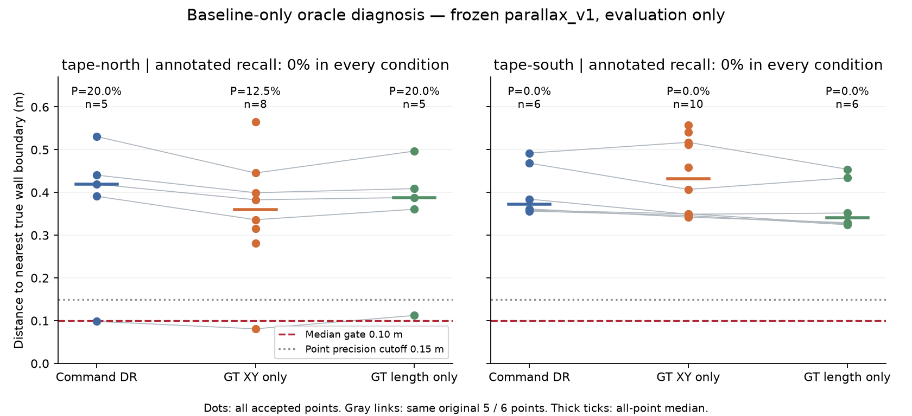
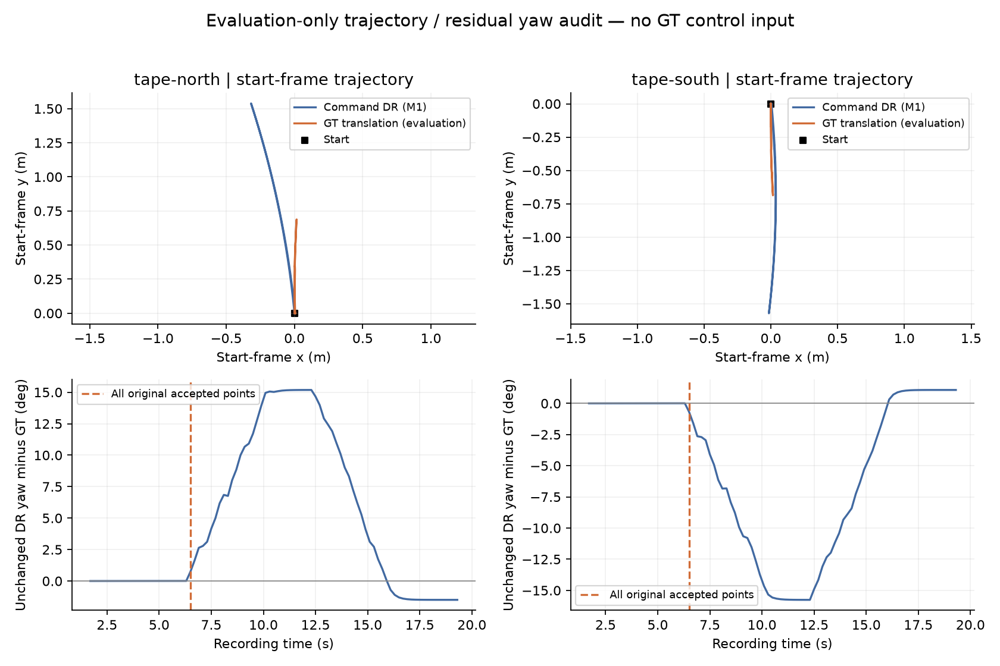

# egomap17 결과 — 전체 DR 폭 과대가 수락점의 깊이 오차를 설명하지 못함

**이동량만 GT로 바꿔도 회복되지 않았다(사전 분기 기준0/2).** 같은 원본 수락11점에서는
오차가 일부 줄지만 북/남 중앙.383/.350m가 남는다. 따라서 v122 교체·새 계수 적합·추가
녹화·RBPF100+pose_graph 지도 재생은 하지 않고 중단한다. 검출/추적만의 문제로 확정하지 않는다.
이번 진단은 yaw와 카메라 자세를 고정했으며, 회전 모형의 부호 불일치도 확인됐다.

## 같은 녹화·같은 검출기, GT는 평가 전용

egomap16 `tape-north`, `tape-south`를 그대로 사용했다. 각181 RGB 중89 eligible,
동결 `parallax_v1` 17파일·카메라 보정·LK/ROI·관문·주석 그대로다. own RGB/명령으로
다시 만든 prediction/eligibility는 **두 녹화 모두 기존 파일과 바이트 동일**하다.
추적 history430/256개를 먼저 봉인한 뒤 GT를 읽었다. 수락 여부가 track 유지/seed에 영향을
주지 않는 원 코드에서 같은 history를 재사용했다. 두 GT 조건 모두 **own_only=false,
adopted=false, operational_gate_passed=false**이며 제어/메모리로 전달하지 않았다.

P는 모든 수락 벽점 중 실제 벽 경계에서≤.15m 비율이다. R은 기존 수동 주석6프레임의
양성 열458/447개를 분모로 유지한다. 주석 프레임에는 모든 조건에서 수락점이 없어
주석 P=NA, R=0이다. 누락을 정답/오차0으로 계산하지 않았으며 북/남 결과를 합산하지 않는다.

| 녹화 | 조건 | 수락점 | 전체 P | 주석 R | 중앙(m) | P90(m) | RMSE(m) |
|---|---|---:|---:|---:|---:|---:|---:|
| north | 명령 DR(M1, 기존) | 5 | 20.0% | 0.0% | .4193 | .4948 | .4036 |
| north | GT XY만(평가) | 8 | 12.5% | 0.0% | .3595 | .4814 | .3746 |
| north | GT 길이만(평가) | 5 | 20.0% | 0.0% | .3882 | .4617 | .3762 |
| south | 명령 DR(M1, 기존) | 6 | 0.0% | 0.0% | .3729 | .4803 | .4073 |
| south | GT XY만(평가) | 10 | 0.0% | 0.0% | .4326 | .5428 | .4461 |
| south | GT 길이만(평가) | 6 | 0.0% | 0.0% | .3406 | .4441 | .3739 |

GT XY는 각 프레임의 실제 상대 평행이동만 사용하며 yaw/외부 보정은 그대로다.
GT 길이는 각 history 끝점 간 거리 비율만 camera-centre offset에 곱해 현재 카메라 원점과
회전·궤적 방향을 보존한다. 같은 동결 covariance propagation에 원래 DR 공동 공분산 전체를
공급했다(아래 평가 어댑터 오류 기록). 어떤 조건도 기존 P≥90%, 중앙≤.10m에 이르지 못한다.
기존8개 수치 검사 중 각조건1/8(주석 양성 수)만 충족한다. GT 조건에는 own-only 운영 자격이 없다.

회색 선은 동일 track/frame을 연결한다. 새로 수락된 점도 전체 지표에서 빼지 않았다.
GT XY 북/남의 추가3/4점은 모두 거짓 벽점이며 남쪽 전체 중앙 오차가 커진 이유다.

## 직접 원인 가설 점검: 전체 이동 폭과 실제 삼각측량 구간은 다르다

기존 수락5/6점은 **모두 frame35→53(4.7→6.5s)**의 동일 구간이다. 첫 이동 명령은6.3s,
즉 수락 시점은 시작0.2s 후다. 전체 왕복 경로의2.2배 과대를 이 구간에 일괄 적용할 수 없다.

| 녹화 | 전체 횡이동 폭 DR/GT(m), egomap16 | 해당11점 baseline DR/GT(m) | 해당 비율 | 해당 구간 Δyaw DR/GT | 불일치 |
|---|---|---|---:|---|---:|
| north | 1.5386/.6883 | .039872/.038968 | 1.0232 | +.3137°/−.4233° | +.7370° |
| south | 1.5710/약.6890 | .039872/.038899 | 1.0250 | −.3137°/+.3638° | −.6775° |

| 동일 원 수락점만 | 원 DR 중앙/P | GT XY 중앙/P | GT 길이 중앙/P | 원 점 유지/거부 |
|---|---|---|---|---|
| north5점 | .4193m / 20% | .3829m / 20% | .3882m / 20% | 5/0 |
| south6점 | .3729m / 0% | .3496m / 0% | .3406m / 0% | 6/0 |

길이만 조정한 깊이 척도 변화는 약−2.3/−2.4%이고, 거리 중앙 개선은.0311/.0322m에 그친다.
GT XY로 궤적 모양까지 바꿔도 동일 점 중앙은.0365/.0233m만 개선된다.
회전의 방향 불일치는 직접 관측된 모델 불일치이며 **오차 기여율/단독 원인으로는 미확정**이다.
전체89 eligible 프레임의 절대 yaw 오차 중앙1.639/1.805°, P90 15.063/15.592°가 그대로 남는다.
GT yaw·실제 카메라 회전 추가 개입이나 검출기 재튜닝으로 관문 실패를 덮지 않았다.

## 수락·거부 사유(모든 history, 기존 문턱 유지)

| 녹화/조건 | history | view부족 | baseline0 | 시차부족 | 재투영불일치 | 수락 |
|---|---:|---:|---:|---:|---:|---:|
| north DR | 430 | 23 | 266 | 75 | 61 | 5 |
| north GT XY | 430 | 23 | 0 | 341 | 58 | 8 |
| north GT 길이 | 430 | 23 | 266 | 75 | 61 | 5 |
| south DR | 256 | 20 | 119 | 84 | 27 | 6 |
| south GT XY | 256 | 20 | 0 | 203 | 23 | 10 |
| south GT 길이 | 256 | 20 | 119 | 84 | 27 | 6 |

GT XY에서 정지 중 미세 이동도 반영돼 baseline0이 시차부족으로 이동한다. 영상 추적 단계의
북/남 LK 실패22/20·ROI 이탈13/13·seed41/39는 완전히 동일하다. 검출/추적을 새로 바꾸지 않았다.

## #406 v122 읽기 전용 대조: 같은 모션 모델이 아님

#406의 고정 ref `45b0c173d34f53c2016e2560cdc70c9a908a8325`에서 v122 계약·모델·구현·fit script를
`git show`로 읽었다. 다른 worktree/파일 수정0. [파일 URL·해시·계수](results/model-source-comparison.json).

| 구분 | #405 현재 동결 경로 | #406 v122 경로(읽기 전용) |
|---|---|---|
| 선택 진입점 | `wall-parallax/code/common.py:28`, V7CommandOdometry | `zone_s2_realism_contract_v122.py:12,32–34`, pulse option이 legacy DR 대체 |
| 평균 모델 | `self_map_prob.py:38–45`: M1 평균 그대로, v7은 구조적 **잡음 가정** | `zone_solo_cyan_pulse_cal.py:25–27,53–67`: 명령별 실측 finite-pulse 누적응답 보간 |
| 계수 파일 | `self_odom_grid.py:18–28`, M1 calibration SHA126cadaa… | `configs/s2_motion_v7_pulse_cal_v1.json`, SHA2245bb9f… |
| 옆이동 평균 | gain의 left 열[-.0904,.9271,.1279], τ=.3s | u=±.65, duration=.65s와 정지 후.10s 포함 |
| yaw 방향 | left+에서 yaw+ | left+에서 yaw− |
| 경계 | 자기 명령만; 측정 상태 미사용 | profile key 불일치 시 거부, 정상 종료는 coast 보존(94–105행) |

원문: [v122 계약](https://github.com/cmkang131/UGRP-Multi-Robot-Collaboration-Project/blob/45b0c173d34f53c2016e2560cdc70c9a908a8325/harness/zone_s2_realism_contract_v122.py#L12),
[finite-pulse 원 구현](https://github.com/cmkang131/UGRP-Multi-Robot-Collaboration-Project/blob/45b0c173d34f53c2016e2560cdc70c9a908a8325/harness/zone_solo_cyan_pulse_cal.py#L25),
[적합 원 구현](https://github.com/cmkang131/UGRP-Multi-Robot-Collaboration-Project/blob/45b0c173d34f53c2016e2560cdc70c9a908a8325/scripts/fit_s2_pulse_calibration.py).

| v122 무하중 프로필 | 표본수 | 응답 Δx/Δy(m) | Δyaw(rad) | 출처 |
|---|---:|---|---:|---|
| left+.65/.65s | 79 | +.000583/+.168504 | −.009734 | s1042/1043/1045, transfer 없음 |
| left−.65/.65s | 79 | +.000426/−.167856 | +.011138 | 같은 자료, transfer 없음 |

이 표는 저장된 보정 계수 비교이며 이번 녹화에 대한 v122 재생/성공 증거가 아니다.
GT 이동량만의 회복 분기가 실패했으므로 **v122 옵션 연결·재적합·own-model 재평가는 미실행**이다.
GT 개선 수치로 자기 명령 모델을 채택하지 않았다. 별도 보정 자료 취득도 하지 않았다.

## 평가 어댑터 오류·검증·보존

사전 등록 `f4887ad3` → capture 소스 `206269b1` → 공분산 정정 사전 기록 `34d55300`
→ 정정 평가 소스 `0f65ed58`. 첫 평가가 원래 DR의 주변 공분산과 GT 평균에서 재생성한
cross covariance를 섞어 PSD 오류1회로 중단됐다. 결과를 생성하기 전에 정정 기록을 커밋했다.
원 DR 평균에서 계산한 **전체 공동 공분산**을 고정하고 GT 평균에서 Jacobian만 평가한다.
입력 상관을 유지하는 표준 JΣJᵀ 전파는
[JCGM 100:2008 §5.2.2](https://www.iso.org/sites/JCGM/GUM/JCGM100/C045315e-html/C045315e_FILES/MAIN_C045315e/05_e.html) 참고.
검출기 함수/파일 수정0, 공분산0 처리/새 noise/floor0, 문턱 변경0. 정정 후 재발0.
실패 원본 `evaluation/`도 보존했다. covariance 상관을 가진 해석적 깊이 복원 및 무개입
출력 동일 시험으로 정정을 확인했다.

- 관련 시험16개 통과(기본-off identity, 동결17파일, 분석적 baseline 깊이, 상관 공분산 보존,
  oracle 옵션의 production 거부, 미검출 recall 분모). RGB/eligibility 2건 golden byte 동일.
- 원본 예측/GT·주석 해시를 receipt에 연결했다. 수치표 [summary.json](results/summary.json),
  녹화별6조건 JSON 및 [raw manifest](results/raw-manifest.json) 보존.
- 새 raw35파일 **16,153,701bytes**, `/Users/changmin/projects/ugrp/outputs/wall-parallax-baseline-v1`.
  raw는 로컬이며 원격 백업으로 주장하지 않는다. Git에는 코드·표·해시·작은 PNG2장만 둔다.
- 물리/렌더/모델 호출/새 dependency 설치0, wall-time 성능 비교0(잠금 불필요), 자기 세션 모두 종료.
  다른 worktree·#406 수정0, 기존 미추적4파일 보존. PR #405 DRAFT 유지, 병합/force/reset0.
- TensorBoard는 앞서 요청한 생략을 유지한다. 실패 판정 그대로 트랙 중단.

재현(새 빈 raw 경로를 명시적으로 사전 등록해야 하며 기존 raw는 덮어쓰지 않음):
`diagnose_baseline.py capture` → 두 capture receipt 확인 → `diagnose_baseline.py diagnose`.
`code/report.py`는 봉인된 결과만 읽어 표·그림을 만든다. GT 입력은 실험 폴더 내 평가 어댑터에만 있다.
