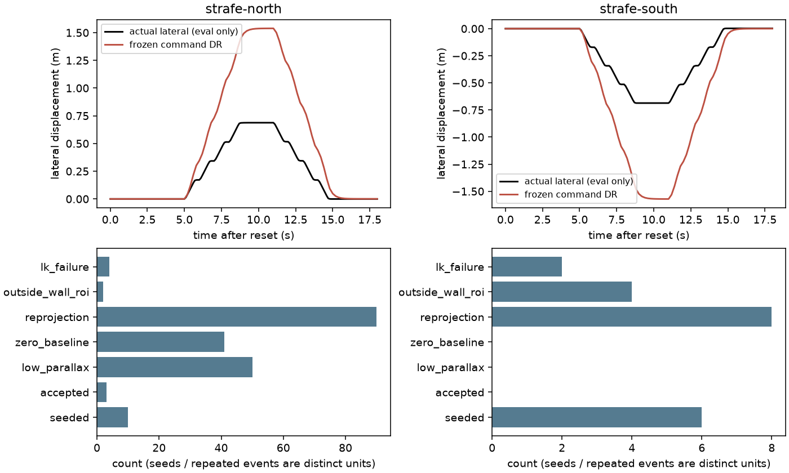
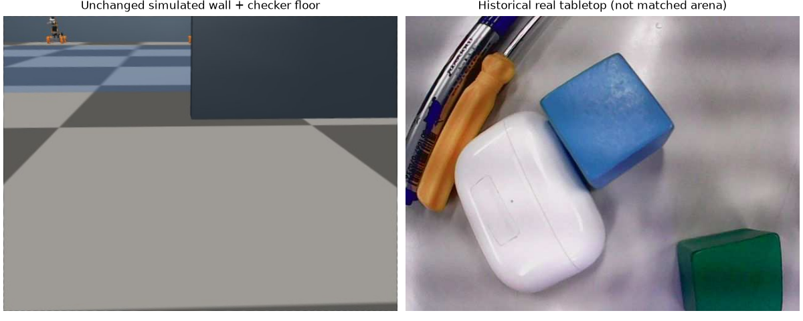

# egomap15 결과 — 마지막 자료 변경 후 자기 지도 트랙 중단

**새 전용 횡이동 2건 모두 관문 실패(0/2)**. `parallax_v1`의 17개 동결 파일/설정/성공 기준은
변경하지 않았다. 기존 운반 0/8과 합산하지 않는다. 추가 튜닝·녹화·지도 재생은 여기서 중단한다.

## 취득·방법·입력 경계

- 사전 등록 `6e2f4fab` → 취득 어댑터 `90c21ed3` → 필수 인자 연결 `92eadc20` →
  RGB-only 주석/경로 어댑터 봉인 `d06881df` → 동결 예측2건 → 별도 GT 채점 순서.
- [등록 계획](README.md)의 north/south 각18 SIM s, reset 포함 각19.3 s, 각181 RGB,
  매2frame 중 calibrated89/unsettled2. 총362 원본/178 eligible. 같은 날 v7 mesh/카메라v3,
  floor_light_v1/nearclip, 무하중, 8개의 원본 S2 횡이동 펄스(±.65, .65s).
- 등록 문구의 자세 별칭 `HIGH`는 잘못 적혔다. **숫자740/2320/1320/1500은 S2의 SEARCH**다.
  사전 등록한 숫자·실제 명령·보정 선택은 바꾸지 않았다. 실제 HIGH896/2035/1894와 혼동하지 않는다.
- #406 지정 SHA의 소스/자산을 [읽기 전용으로 복사](copied-sources.json)했다.
  `RealPrimitivePort`와 reset 후 카메라v3 binding을 재사용한다. 그 모듈의 다른 S2 backend
  factory는 이 workflow에서 호출하지 않는다. 원본 #406 파일 수정/새 venv·의존성 설치 없음.
- 두 관리 session은 순차 실행·정상 종료, agent_lock acquire/release 영수증 저장, 종료 후 null.
  **freeze 적용0·모델 호출0**. v7 기본 mesh와 idle contacts off를 명시했고 다른 로봇 물리는 유지했다.
  wall23.620/23.571s는 운영 로그이며 성능 비교가 아니다.
- 첫 north 시도는 필수 `drive_profile` 인자 누락으로 **세계 생성 전 HOST_ERROR**였다.
  physics/RGB0, 원본 보존 후 signature 회귀시험을 거쳐 별도 `-host-retry1`에 취득했다.
  물리 자료가 있는 run은 재시도하지 않았다. 실제 기록2건에 물리 abort0.

## 변경 없는 관문과 같은 프레임 비교

P는 전체 검출점의 GT 벽 경계≤.15m 비율, R은 사전 고정 6frame/96열 수동 접점의 metric recall.
오차는 현재 GT 차체로 옮긴 점의 최근접 실제 벽 거리(m)다. GT는 예측 봉인 뒤 평가만 사용한다.

|새 녹화|방법|점 수|전체 P %|주석 P / R %|오차 중앙 / P90 / RMSE m|parallax 관문|
|---|---|---:|---:|---|---|---|
|north|같은-frame 바닥 투영|6,848|99.80|100 / 99.13|.0178 / .0255 / .0475|기준값|
|north|동결 parallax_v1|3|66.67|NA / 0|.0742 / .3267 / .2315|FAIL|
|south|같은-frame 바닥 투영|6,712|98.42|99.33 / 99.11|.0187 / .0280 / .0809|기준값|
|south|동결 parallax_v1|0|NA|NA / 0|NA / NA / NA|FAIL|

가시 주석 분모는 north462/south447열, parallax 주석 TP0/0이다.
north 출력3개는 서로 다른 track이지만 **동일 frame53(t=6.5s)**에만 나왔고 주석6frame에는 없다.
따라서 recall0은 고정 주석 표본 기준이며 모든 시각의 검출이0이라는 뜻은 아니다.
3점 중2개만 벽 허용 거리 안이다. 작은 분모의66.7%를 일반화하지 않는다.
북쪽은 중앙 오차만 통과하고 P/P90/주석R/TP/기준값 비악화는 실패한다.
전체 검사 bool·거리0–2/2–3/3–4m·동일 candidate pixel 비교·DR 출발 정렬 오차는
[north](results/strafe-north.json), [south](results/strafe-south.json)에 각각 보존했다.

이번 바닥 투영은 주로 **약1m 근거리·무하중 SEARCH**다. 과거3m대 운반 녹화의 투영 실패가
해결됐다는 근거가 아니다. 실제−표 pitch 중앙은 두 건 모두−.831°로 남아 있다.
동일 camera 오차도 가까운 벽에서 거리 오차가 작을 수 있다. 원래 투영식을 다시 튜닝하지 않았다.

## 무엇이 달라졌고 무엇이 남았는가

[평가 전용 경로/재질 진단](results/diagnosis.json). 아래 실제 자세는 제어/추정에 공급하지 않았다.

|자료|eligible frame|seed|accepted|시차 부족 event|재투영 거부 event|
|---|---:|---:|---:|---|---|
|기존 운반8건(기존 결과)|4,361|530|0|4,530/7,279 (62.23%)|1,074/7,279 (14.75%)|
|새 north|89|10|3|50/198 (25.25%)|90/198 (45.45%)|
|새 south|89|6|0|0/17 (0%)|8/17 (47.06%)|

분모는 track의 반복 판정 event이며 독립 frame/seed 성공률이 아니다. 새 분모에는 accepted3도
포함한다. north 정지 구간의 baseline0은41/198, LK실패4/198, ROI이탈2/198, 3시점미만8/198.
south는 ROI이탈4/17, LK실패2/17, 3시점미만3/17. 특징 빈도가 충분히 늘지 않았다
(기존100frame당12.15 seed, north11.24/south6.74). 남쪽 시차 부족0은 풍부한 유효 추적을 뜻하지 않는다.

|평가 전용 실제 이동 vs 동결 추정|north|south|
|---|---:|---:|
|실제 횡방향 왕복의 최대 폭 m|.6883|.6890|
|실제 총 경로 m|1.3804|1.3795|
|동결 M1 DR 횡방향 최대 폭 m|1.5386|1.5710|
|실제 yaw 변동 폭 °|4.797|4.461|
|경로 위치 오차 중앙 / P90 / 최대 m|.0939 / .9014 / .9139|.0952 / .8728 / .8853|
|종료 위치 오차 m|.0022|.0055|
|10-view 가능한 실제 baseline 중앙 / P90 m|.1710 / .3167|.1712 / .3171|
|같은 window 명령 DR baseline 중앙 / P90 m|.3471 / .6993|.3471 / .6993|

왕복 후 종료 오차가 작아도 중간 상대 이동은 틀렸다. 동결 M1 평균은 v7 횡이동으로 식별된 모델이
아니며 이번 .65 명령에서도 과대 추정했다. **새 자료로 실제 횡이동을 확보했지만, 특징 부족과
명령 기반 상대 자세 불일치가 함께 남았다.** 재투영 거부의 원인 비중을 두 요인으로 확정 분리한
실험은 아니며, GT 이동으로 다시 삼각측량하거나 계수를 맞춰 관문을 바꾸지 않았다.
north accepted 시차1.34–1.66°, 깊이σ2.02–2.67m, confidence .000244–.000432로 불확실성도 크다.
accepted3개 xyz의 z≈−.092m도 저장돼 있다. 양의 **광학 깊이** 조건은 만족하지만 정확한 3D 벽점
이라는 뜻은 아니다. 신뢰도/높이 조건을 사후 조정하지 않았다.

## 텍스처 감사 (변경 없음)

두 실행 XML의 벽6개는 모두 `rgba=".23 .28 .33 1"`, `material` 지정0개다.
바닥은 기존 `ground` checker/groundmat이며 텍스처가 없는 벽과 다르다. 접점 주변 단색 면/긴 직선은
corner 추적의 관측성을 제한할 수 있다. 이는 [Forster et al. RSS2014](https://www.roboticsproceedings.org/rss10/p29.pdf)
§I-B의 균일 표면 설명과 부합하지만 **이번 실패 전체가 시뮬 텍스처 때문이라는 증명은 아니다**.

실물 비교는 보존된2026-09-02 tabletop own RGB1장을 직접 확인했다(경로·sha는 diagnosis.json).
블록 표면 얼룩/반사·주변 물체는 보이지만 해당 경기장 벽이 없다. 따라서 **실제 경기장 벽과의
텍스처 차이 크기는 미확인**이다. 이 사진을 일치하는 실물 벽 자료로 대체하지 않는다.
벽/바닥/조명/텍스처 변경0. 향후 변경을 검토한다면 실제 벽·바닥을 같은 해상도/노출/거리에서
촬영해 무늬의 물리 크기·대비를 먼저 측정하고, 그 근거로 별도 재질 버전을 제안해야 한다.
편의를 위한 임의 특징/모서리 추가는 제안하지 않는다.

## 전체 시도와 실물에서 필요한 측정 — 이 트랙 종료

수치는 각 실험의 다른 관문/분모이며 합산·순위 비교하지 않는다. 기존 실패를 성공으로 바꾸지 않는다.

|시도|관측된 결과·한계|실물에서 먼저 필요한 측정|
|---|---|---|
|기존 바닥 경계→평면 투영 ([egomap10](../2026-10-07-wall-floor-boundary/README.md))|pixel P94.3–98.8%지만 수동 접점 투영 중앙 .457–.665m. floor_boundary_v1 개발0/2·확인0/4, 주석 metric R0|K/D·영상 크기/크롭, 벽 하단 기준점과 실제 거리, 같은 프레임 카메라 높이·pitch/roll/yaw|
|명령 servo FK ([egomap11](../2026-10-07-camera-pose-projection/README.md))|0/6, 중앙 .531–.740m; 실제 camera 평가 oracle .015–.026m|실제 servo 각도–PWM·백래시·링크/마운트6DoF, 팔 자세/하중/정착별 변형; 측정값 제어 허용 여부는 별도|
|S2 원본 투영 ([egomap12](../2026-10-07-s2-projection-comparison/RESULTS.md))|0/6; 동일21표 원점/회전 차0, 오차 개선0. s1050의1.53cm는 별도 loaded carry 조건|SEARCH/HIGH/CARRY 각각 무하중·하중 보정과 독립 확인, signed 차체 기울기/가속 동기 기록|
|온라인 소실점 ([egomap13](../2026-10-07-online-camera-pitch/RESULTS.md))|0/6; 중앙 .046–.674m, 2,170점 중807 무효. 유효점만 좋아진 건 전체 관문 성공 아님|선 방향/소실점 관측성, 반복 시점에서 마운트 자세 참조, 노출·저해상도 선 검출 안정성|
|시차 parallax_v1 기존 운반 ([egomap14](../2026-10-07-wall-parallax/RESULTS.md))|0/8; 4,361frame/530seed에서 accepted0, 시차 부족62.23% event|영상–명령 timestamp, 실제 횡방향 이동/회전·펄스 응답·공분산, 벽 텍스처/특징 지속성|
|시차 parallax_v1 새 횡이동 (이번)|0/2; 실제 .689m 이동, north3점 P66.7%, south0점, 주석R0. DR 폭1.54–1.57m, 경로 P90 .87–.90m|v7 대응 실물 횡이동 척도·yaw drift·상대 pose 공분산의 독립 측정, 실제 벽 근/원거리 횡이동 영상과 시계 동기|

시차 삼각측량 원리 자체의 불가능성 판정은 아니다. 동결 후보·현재 허용 명령 모델·이 자료 조합이
관문을 넘지 못한 것이다. **전체 자기 지도 트랙 STOP**, 추가 구현/취득/튜닝 계획을 실행하지 않는다.
기본 off·정적 지도 경로·v1/v2/prob/RBPF/graph 및 실패 옵션은 그대로 보존한다.

## 검증·보존

- 관련 시험23개 통과: 동결17파일/원본 복사 해시, default/explicit-off bytes, 합성 삼각측량,
  GT 평가 반환값을 무시하는 고정 취득, 소스 admission·필수 인자·주석/경로 연결 검사.
  [검증](results/verification.json), [raw SHA256](results/raw-manifest.json).
- raw441파일14,071,517bytes(약13.42MiB), 자체 lock/명령/GT/장면/영상·prediction 모두 로컬 보존.
  raw 원격 백업은 아니다. Git에는 소스·표·그림·해시만. 그림119,857/307,602bytes, 각각1MiB 미만.
- 타 worktree 변경0, 사용자 미추적4파일 해시 동일. PR #405 DRAFT 유지, force/reset/merge0.
  TensorBoard는 이전 사용자 요청대로 생략, 프로젝트 Drive 예외 유지.
