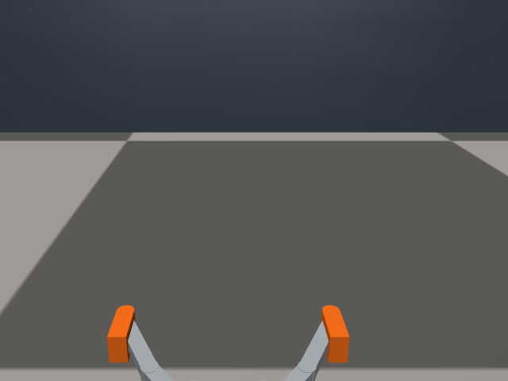
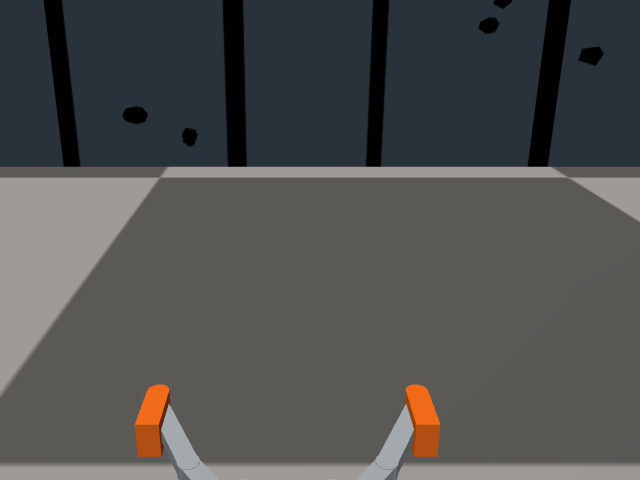
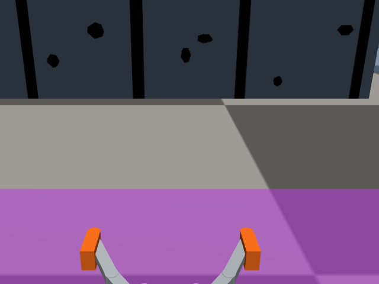

# egomap16 — 사용자 결정에 따른 벽 테이프 무늬 자료 비교

## 구현·취득 전 사전 등록 (2026-10-07)

시작 PR #405 `c70dbce4`, PR #409 `648bc227` 결과 보고·push 뒤 같은 worktree에서 복귀.
사용자가 **시뮬 벽에 실물 재현 가능한 무늬를 추가**하도록 결정해 종료했던 자기 지도 트랙을
자료 변경에 한해 재개한다. **실물 사진 미확인 가정**: 현재 경기장 벽의 실물 사진/색/조도는
확인되지 않았다. 아래는 사용자 지정 테이프를 향후 실물에 붙일 수 있도록 만든 설계이지
실물 경기장의 현재 표면을 복제한 자산이 아니다. 성공해도 실물 검증으로 주장하지 않는다.

### 표면 사양·경계

새 `wall_texture=tape_v1`, 기본 `off`. 전용 scene wrapper에만 연결한다.
off는 입력 XML 문자열을 parse/재직렬화/자산 접근 없이 그대로 반환한다. 기존 S2 빌더·#406 파일·
카메라·조명·벽 충돌 기하·물리·명령 모델은 변경하지 않는다.

- 현행 6개 box 벽의 수직4면에 서로 다른 결정론적 배치(seed `16001` + 면 ID의 SHA256)를 생성.
  바탕은 기존 벽 RGB(.23,.28,.33), 무광 진한 테이프 RGB(.008,.009,.010).
  실물에서는 같은 바탕 대비의 무광 테이프/절단 조각을 가정한다. 조도와 색상은 실측 아님.
- 세로 테이프 폭20–30mm, 중심 간격200–300mm를 불규칙하게 독립 추출하고 전 높이(0–400mm)에
  부착. 끝 여백은 남기며 50mm 끝면에는 중앙 테이프1개. 길이를 맞추려고 주기를 반복하지 않는다.
- 테이프 사이에 bounding width/height20–40mm인 불규칙 볼록 다각형 조각을 불규칙 위치에 배치.
  각 면의 무늬를 별도로 생성하고 타일 반복/좌우 복사/문자·숫자·fiducial 부호를 사용하지 않는다.
- MuJoCo 공식2D texture/finite-plane mapping을 사용한다. 각 면의 PNG를 단1회 매핑하고
  원 벽에서0.1mm 떨어진 **시각 전용 plane(contype=conaffinity=0, mass=0)** 에 부착한다.
  충돌 wall은 원본 그대로다. 추가 평면은 제어에 좌표/ID를 전달하지 않는다.
- 벽/면별 원점·u방향·수직z, 테이프 위치/폭 및 조각 다각형을 JSON/CSV와 실물용 SVG 배치도로
  저장한다. 1mm/pixel 생성 이미지와 벡터 배치의 위치 오차≤1mm, 물리적 폭/간격은 표가 기준이다.
  on 렌더에서 대비/면 방향/하단 연결 확인 후 취득하며, detector 결과에 따른 무늬 재설계는 하지 않는다.

## 고정 순서와 예산

1. 이 계획/출처를 기존 parallax 관련 시험 통과 후 먼저 commit한다.
2. texture 구현·off XML bytes·물리 필드 불변·배치 규격·동결17파일 시험 후 commit/push.
3. 다른 실행의 lock이 null일 때만 짧게 `agent_lock` acquire→전용 관리 workflow/ugrp_session에서
   동일 기존 scene XML의 정적 렌더 preview(physics step0)→release. own camera/보정/FOV 유지.
4. 렌더 확인 뒤 egomap15와 **동일 경로·seed·수치 팔 자세·8펄스·18초** 2건을 순차 취득한다.
   `tape-north`: seed15101, r3=(3.25,.75,pi), 처음left+.65.
   `tape-south`: seed15102, r3=(3.25,-.70,pi), 처음left−.65.
   숫자 팔명령 {1:2000,3:740,4:2320,5:1320,6:1500}은 SEARCH, HIGH로 부르지 않는다.
   정착5초, t=5/6/7/8초 동일 방향·t=11/12/13/14초 반대 방향, 각.65초.
   RGB/eval10Hz, reset cap5초. 다른 로봇 물리 유지, **freeze0·모델 호출0**.
5. 기존 replay의17파일/설정은 바이트 불변. 각 새 녹화 eligible frame의 중앙6분위 RGB를
   예측 보기 전에96열 접점 수동 주석·해시·commit. 두 녹화의 own RGB/명령 예측을 먼저 봉인한 뒤
   GT pose/벽을 평가에서만 읽는다. 구 운반·무늬 off 횡이동·이번 on을 각각 분리한다.
6. 기존 관문을 새2건 각각 그대로 적용: 전체 P≥90%, 주석P≥90%/R≥70%, 오차 중앙≤.10m/P90≤.25m,
   동일-frame 바닥 투영P 비감소, 양성주석≥50열·주석TP≥30열, off bytes/own-only/양의 깊이.
   빈 출력 P/오차NA·R0. 특징 seed·accepted 수, track 반복 판정 거부율, depth σ도 기록한다.
7. **2/2 모두 통과했을 때만** 별도 짧은 texture-on 탐색 녹화1개: 같은 north 시작/SEARCH,
   seed16103, 30초, 명령시간표만 사용. 5/6/7/8초 left+.65, 11/12초 forward+.65,
   15/16/17/18초 left−.65, 21/22초 forward−.65, 각.65초 후 정착.
   GT·정적B를 목표/회전/종료에 사용하지 않는 빈손 조사 경로이며 자율 frontier 성공으로 부르지 않는다.
   이 새 자료에서만 동결 parallax + RBPF100 + pose_graph의 자기 지도/2D 그림을 만든다.
   기존 운반 녹화로 대체하지 않는다. 관문 실패 시 3번째 취득/지도 재생0, 튜닝 없이 중단.

각 실제 실행은 status null→자신 PID로 acquire→ugrp_session·공통 workflow→close/release,
한 번에 하나. v7 mesh/camera v3/floor_light_v1/nearclip/idle contacts off는 egomap15와 같다.
벽 접촉/차체기울기>10°/비유한 상태/weld는 외부 안전 abort만, GT 기반 행동 수정0.
운영 예산: preview≤2분, 취득2×18 SIM초(+reset 각≤5초), 조건부1×30초. raw≤200MiB.
ENOSPC/기술 오류=HOST_ERROR로 보존, 같은 원인 두 번이면 중단. 물리 자료 있는 run 재취득 금지.

### DR 별도 표와 보존

기존 off 횡이동: 실제 최대폭north.6883/south.6890m vs 명령DR1.5386/1.5710m.
이번에도 최대폭·비율·경로 오차·종료 오차를 GT 평가 전용 표로 분리한다. 질감으로 운동 모델
척도 오류가 해결된 것으로 간주하지 않는다. #406 참고용이며 해당 브랜치/파일 수정0·계수 재튜닝0.

원본 raw는 `/Users/changmin/projects/ugrp/outputs/wall-parallax-texture-v1/`에 새로 저장.
기존 raw/사용자 미추적4파일 보존, 다른 worktree 수정0. 시험 후 commit/push·Codex trailer,
PR #405 DRAFT·merge/force/reset 금지. 기존 venv 재사용. TensorBoard 기존 면제·Drive 예외 유지.

## 구현·검증 상태

사전 등록 commit `52aff865`(기존 관련15시험 통과 후 push). 새 scene wrapper
[`sim/wall_parallax_texture.py`](../../sim/wall_parallax_texture.py)는 egomap15의 scene/물리 backend를
재사용하며 transform에만 [`sim/wall_texture.py`](../../sim/wall_texture.py)를 연결한다.
기존 S2 builder·카메라/DR·동결17파일·#406 복사본은 수정하지 않았다.

|옵션/경로|기본값|선택 시 동작|
|---|---|---|
|`wall_texture=off`|off|입력 XML을 동일 객체로 반환. parse·자산 접근 없음|
|`wall_texture=tape_v1`|명시 선택만|6개 기존 벽과 배치표 기하 일치 검사 후 시각 면24개 추가|
|전용 CLI `--wall-texture tape_v1`|off|이번 코호트 실행은 명시 on만 허용하며, 다른 S2 workflow에 옵션을 주입하지 않음|
|`wall_detector=parallax_v1`|기존 off 보존|이번 replay에서만 선택. 17파일·설정·관문 그대로|

[벽별 실물 배치도/위치표](assets/README.md): 세로 테이프215개, 불규칙 조각570개,
24면 PNG와 1:1 SVG, 약0.70MiB. `layout.json`에 각 면 원점·방향 및 모든 조각 꼭짓점을 저장했다.
50mm 끝면은 중앙 테이프1개라서 서로 다른 폭이 1mm 래스터에서 우연히 일치할 수 있다.
넓은12면은 모두 다른 무주기 배치이며, 테이프 실제 폭215개도 모두 다르다.
첫 로컬 시험은 끝면 PNG까지 모두 달라야 한다는 과한 assertion1개가 실패했고,
**물리 배치/seed/PNG는 바꾸지 않고** 위 규격으로 검사를 정정했다.

관련 시험 `test_wall_texture.py`, `test_wall_parallax.py`, `test_wall_parallax_strafe.py`:
**22 passed**. off 바이트, 기존 scene wrapper 출력, 원 충돌 기하, 배치 규격,
이전과 같은8펄스/181frame, GT 평가 반환값 미사용, 동결/복사 소스 해시를 검사했다.
새7시험을 원격 CI 목록에 연결했다(물리 import가 필요한 scene wrapper1개만 의존성 없는 CI에서 skip).
MuJoCo 모델의 실제 dynamics 배열 대조는 잠금 후 preview에서 별도로 실행한다.

관리 workflow `wall-parallax-texture` plan은 실행 없이 정상 구성됐다.
렌더는 별도 preview용으로 egomap15 평가 카메라 pose를 재사용하되 **scene 시각 점검에만** 쓰고,
새 취득/추정에 전달하지 않는다. `mj_forward` 정기구학만, `mj_step`0이며 K·해상도는 기존 카메라와 같다.
preview를 직접 확인하고 manifest SHA를 `render-review.json`에 봉인·commit한 뒤에만
새2건 취득기가 admission을 허용한다. [재생 어댑터](code/replay_texture.py)는 기존 평가의 경로만 바꾼다.

실행 순서(소스 push·잠금 null 확인 필요):

```sh
TAPE_SOURCE_SHA="$(git rev-parse HEAD)"
/Users/changmin/projects/ugrp/.venv-sim-worker-mac/bin/python scripts/ugrp_session.py run egomap16-preview -- \
  /Users/changmin/projects/ugrp/.venv-sim-worker-mac/bin/python -m scripts.sim_cli workflow run wall-parallax-texture -- \
  --case preview --wall-texture tape_v1 --expected-source-sha "$TAPE_SOURCE_SHA" \
  --output /Users/changmin/projects/ugrp/outputs/wall-parallax-texture-v1/preview --execute
```

렌더 봉인 뒤 위 명령의 case/output을 `tape-north`, 그 다음 `tape-south`로 바꿔 순차 실행한다.
다른 작업의 live 잠금을 해제하거나 인수하지 않는다. 취득 자료가 있는 디렉터리는 덮어쓰지 않는다.

## DR 척도 — PR #406 참고용 별도 표

아래는 **기존 무늬 off egomap15** 평가이며 이번 on 결과로 재표기하지 않는다.
[원본 결과/GT 평가 출처](../2026-10-07-wall-parallax-strafe/RESULTS.md).

|녹화|실제 횡이동 최대 폭 m|명령 DR 폭 m|DR/실제|경로 오차 P90 m|종료 오차 m|
|---|---:|---:|---:|---:|---:|
|off north|.6883|1.5386|2.235|.9014|.0022|
|off south|.6890|1.5710|2.280|.8728|.0055|
|tape on north|미취득|미취득|—|—|—|
|tape on south|미취득|미취득|—|—|—|

왕복 종료 오차가 작아도 상대 이동량은2배 넘게 과대다. 무늬가 생겨도 이 오차는 별도이며,
이번에는 M1 평균/v7 잡음 계수 재적합0·GT odometry 대체0·#406 파일 수정0이다.

## 취득 전 렌더 확인

구현 `1d981162`를 잠금+ugrp_session+관리 workflow에서 정적 렌더했다.
북/남 양쪽에서 세로 방향·하단 연결·무주기 무늬·대비를 직접 확인했다.
physics step0·모델0, 원 geom 위치/회전/크기/접촉/friction 및 body mass/inertia·dof·actuator 배열 동일.
[렌더 확인 봉인](render-review.json), raw preview manifest로 추적하며 정상 종료 뒤 lock null 확인.






