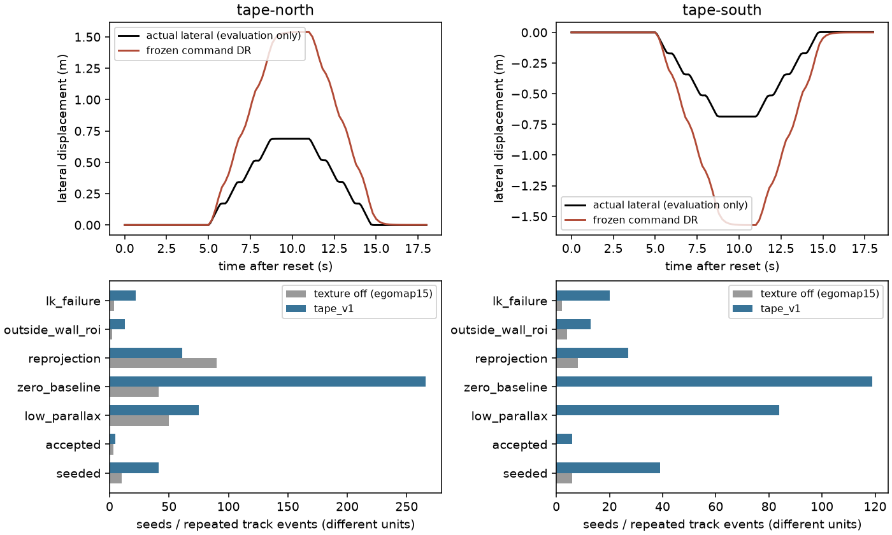

# egomap16 — 무늬로 특징은 늘었지만 동결 시차 관문0/2

**북/남 모두 실패.** 사용자 결정에 따라 표면만 바꾸고 같은2건을 취득했다.
기본 off·parallax_v1·M1 DR/v7 잡음·카메라 보정·관문은 그대로다.
재튜닝·추가 탐색 녹화·RBPF100/pose_graph 지도 재생0. 원래 운반0/8, 무늬 off 횡이동0/2와 합산하지 않는다.

## 실행과 재현

- 사전 등록 `52aff865` → 구현 `1d981162` → 정적 렌더 확인/봉인 `956283d1` →
  새2건 취득 → own RGB12frame 수동 주석/봉인 `0778f60c` → 동결 예측2개 봉인 → GT 채점.
- 물리 취득 소스 `956283d1476794b21729a6d0a487215e630dff9f`,
  예측/채점 소스 `0778f60c391795736defcb3c68d2b60d4fa32300`.
- **실물 사진 미확인 가정**: 무늬는 사용자가 실물에 붙일 수 있도록 지정한 설계이며,
  실물 경기장 표면/조도/색 재현 또는 실물 성공 근거가 아니다.
  [24면 배치도·테이프215개·조각570개](assets/README.md), [표준 매핑 출처](REFERENCES.md).
- MuJoCo2D texture를 시각 plane24개에 한 번씩 매핑. 기존 box벽의 충돌·질량/관성·구동 배열은
  정적 on/off 모델 감사에서 동일. off XML bytes 및 scene wrapper 출력도 동일.
- 정적 preview는 `mj_step`0이며 보존된 예전 평가 camera pose로 **보기만** 했다.
  새 녹화는 기존 v7·camera3·SEARCH·8펄스 그대로이며 GT pose를 제어/검출/DR에 전달하지 않는다.
- 북/남 각18 SIM s(+reset1.3 s),181 RGB, eligible89/unsettled2. 같은 seed15101/15102.
  `ugrp_session`/등록 workflow/agent_lock으로 순차 실행했고 3session 모두 stopped·종료 후 lock null.
  물리 abort0·HOST_ERROR0·로봇 freeze0·모델 호출0. wall23.674/23.774s는 운영 기록이며 속도 비교가 아니다.
- 기존 off 녹화와 **자기 명령 파일 bytes 동일, 전체 실제 XY 궤적 최대 차0m**.
  배치·동역학·경로 변화가 아닌 표면 관측 변화의 비교다. #406 파일/다른 worktree 수정0.

## 동결 관문과 같은 프레임 기준값

P=검출점의 GT 벽 경계 거리≤.15m 비율. R=고정6frame/96열 own RGB 접점의 metric recall.
GT 차체 pose는 예측 봉인 뒤 채점에서만 쓴다. 각 녹화의 전체 P≥90%, 주석P≥90%/R≥70%,
중앙≤.10m/P90≤.25m, 같은-frame 바닥 투영P 비감소, 양성주석≥50/TP≥30 기준은 바꾸지 않았다.

|녹화/무늬|방법|seed|점 수|전체 P %|주석 P / R %|오차 중앙 / P90 / RMSE m|관문|
|---|---|---:|---:|---:|---|---|---|
|egomap15 north off|동결 parallax|10|3|66.67|NA / 0|.0742 / .3267 / .2315|FAIL(기존)|
|egomap15 south off|동결 parallax|6|0|NA|NA / 0|NA|FAIL(기존)|
|이번 north on|같은-frame 바닥 투영|—|6,475|90.04|88.91 / 84.06|.0198 / .1015 / .1820|기준값|
|이번 north on|동결 parallax|41|5|20.00|NA / 0|.4193 / .4948 / .4036|FAIL|
|이번 south on|같은-frame 바닥 투영|—|6,049|84.91|86.72 / 77.40|.0209 / .5819 / .3207|기준값|
|이번 south on|동결 parallax|39|6|0.00|NA / 0|.3729 / .4803 / .4073|FAIL|

이번 주석 양성 분모 north458/south447열, 시차 TP0/0. **수락된5/6점은 각각 모두
frame53(t=6.5s)** 에만 있고 고정 주석6frame에는 없다. 따라서 주석 recall0을 모든 frame의
출력0으로 해석하면 안 된다. 전체 P도 각각1/5·0/6이라는 작은 분모다.
수동 주석은 단일 Codex의 자기 RGB 육안/좌표 검사이며 독립 전문가 라벨이 아니다.

거리별 판정 및 동일 candidate 픽셀 비교: [north](results/tape-north.json), [south](results/tape-south.json).
시차 수락점은 전부0–2m 구간이고2–4m에는0점이다. 같은5/6픽셀의 바닥 투영 오차 중앙은
.0385/.0378m, 시차는.4193/.3729m다. 깊이σ 중앙2.098/1.990m,
신뢰도 중앙.000399/.000443으로 추정 자체도 불확실성이 매우 크다고 보고한다.
양의 optical depth는11/11 통과하지만 정확한 벽점이라는 뜻은 아니다.

무늬로 seed는4.1배/6.5배 늘었다. 동시에 기존 바닥 투영 전체 P도 off99.80/98.42%에서
on90.04/84.91%로 낮아졌다. 시차의 접점 ROI가 의존하는 기존 경계 경로도 표면 변화에
영향받았다는 결과이며, 그 경로를 사후 수정하지 않았다. **텍스처만 보완하면 충분하다는 가설은
이 동결 구성에서 지지되지 않는다.** DR·접점/추적의 기여율을 분리한 인과 실험은 아니다.
seed는 접점 ROI에서 시작한 새 track 수이며 전체 이미지의 모든 corner 수가 아니다.

## 반복 track 판정 event — 독립 feature 성공률과 구분

|조건|전체 event(수락 포함)|baseline0|작은 시차|재투영|LK실패|ROI이탈|3시점 미만|수락|
|---|---:|---:|---:|---:|---:|---:|---:|---:|
|north off(기존)|198|41|50|90|4|2|8|3|
|north tape_v1|465|266 (57.20%)|75 (16.13%)|61 (13.12%)|22|13|23|5|
|south off(기존)|17|0|0|8|2|4|3|0|
|south tape_v1|289|119 (41.18%)|84 (29.07%)|27 (9.34%)|20|13|20|6|

동결18초 경로의 정지 구간도 그대로 포함하므로 baseline0 반복 event가 많다.
이번 수락 시차 중앙1.628°/1.649°. 특징·반복 판정·프레임 분모를 섞어 성공률로 제시하지 않는다.

## 명령 DR 과대 추정 — PR #406 참고용

|녹화|실제 횡방향 최대 폭 m|동결 DR 폭 m|DR/실제|경로 오차 중앙 / P90 / 최대 m|종료 오차 m|
|---|---:|---:|---:|---|---:|
|egomap15 north off|.6883|1.5386|2.235|.0939 / .9014 / .9139|.0022|
|이번 north tape_v1|.6883|1.5386|2.235|.0939 / .9014 / .9139|.0022|
|egomap15 south off|.6890|1.5710|2.280|.0952 / .8728 / .8853|.0055|
|이번 south tape_v1|.6890|1.5710|2.280|.0952 / .8728 / .8853|.0055|

실제 총 경로1.3804/1.3795m, yaw 변동4.797°/4.461°. 가능한10-view 실제 baseline
중앙.1710/.1712m vs 명령 DR .3471m. 왕복 종료 오차가 작아도 상대 운동 척도는 틀렸다.
M1 평균을 v7 횡이동 실측 모델이라고 부르지 않는다. **GT로 DR 교체·계수 재적합0**,
#406에는 이 표를 참고할 수 있다는 기록만 남겼으며 해당 파일은 수정하지 않았다.

## 검증·보존·종료

- 관련22시험 통과(3파일, [README](README.md) 명령). 동결17파일/원본 복사11파일 및
  사용자 미추적4파일 hash 불변. 새 texture7시험은 CI 목록에 추가했다.
- 두 예측의 source/settings/manifest hash, 저장된 채점 JSON 일치, accepted optical depth11/11,
  24개 시각면 collision mask0 및 기존 명령/실제 궤적 대조 확인.
  [검증 영수증](results/verification.json), [상세 진단](results/diagnosis.json).
- raw436파일12,257,609bytes(약11.69MiB)는
  `/Users/changmin/projects/ugrp/outputs/wall-parallax-texture-v1/` 로컬에 보존.
  [전체 SHA256/크기](results/raw-manifest.json) 검증. 원격 raw 백업으로 주장하지 않는다.
  Git에는 코드·PNG/SVG 배치도·주석·요약·그림·해시를 보존했다. 각 미디어1MiB 미만.
- 초기 실행 잠금은 #406 live 작업 중이라 기다렸고 null 뒤 취득했다. 다른 실행 종료/잠금 인수0.
  렌더 전 CSV CRLF의 diff-check 오류는 LF로 정규화했다(배치/이미지 변경0).
  끝면 PNG 중복의 과한 시험 assertion 수정도 [README](README.md)에 기록했다.
- **관문0/2 → 추가30초 탐색 녹화0, RBPF100+pose_graph 지도 재생/누적 지도 그림0**.
  이번 기록은 무늬 가설의 실패 진단이다. 자료/threshold/무늬 재설계로 덮지 않고 중단한다.
  이전 시도의 결과와 실물 측정 필요 표는 [egomap15](../2026-10-07-wall-parallax-strafe/RESULTS.md#전체-시도와-실물에서-필요한-측정--이-트랙-종료)에 보존한다.
  실제 경기장 표면 사진·카메라 마운트/하중별 자세·영상 시계·실제 횡이동/yaw 척도와 공분산의
  독립 측정이 여전히 필요하다. 실물 성공·추가 구현을 주장하지 않는다.

PR #405 DRAFT 유지. force/reset/merge0, 다른 worktree 수정0, TensorBoard 기존 면제·Drive 예외 유지.
