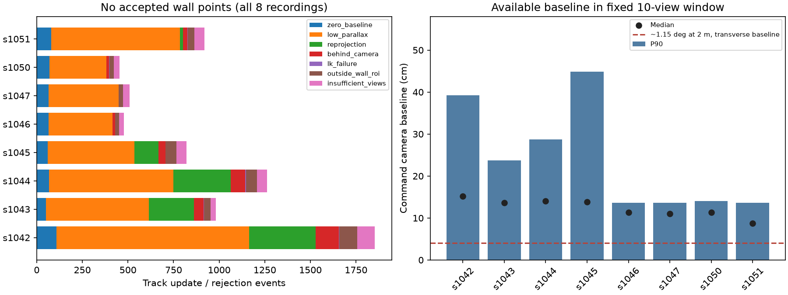

# egomap14 결과: 시차 벽점 0, 관문 0/8, 지도 재생 중단

사전 등록24f2f6f7 → 구현/주석346db610 → 기록/평가 직렬화 수정e86ca9a0/e94f25eb →
개발0/2 → 설정 동결6a417edf → 확인0/6. **검출기와 임계값 재튜닝0**, 각 녹화 RGB 계산1회다.
기록 단계 HOST_ERROR2건과 원본·복구 근거는 [EXECUTION](EXECUTION.md)에 보존했다.
예측 함수 AST와 다른 runtime source가 그대로임을 확인한 metadata/score-only 복구다.

## 같은 프레임의 바닥 투영 대비 시차 결과

전체8건4,361 eligible frame, 수동 주석48 frame이다. s1042–1047의 baseline 전체 점수와 point 수가
egomap10 원본과 정확히 일치한다. 아래 P는 전체 eligible metric point precision, R은 각6개 주석
frame의 가시 접점 recall이다. 서로 다른 분모를 합산하지 않는다.

| 녹화 | eligible | 바닥 P | 바닥 R | 바닥 중앙 / P90 / RMSE m | 시차 점 | 시차 P / R | 시차 거리오차 |
|---|---:|---:|---:|---|---:|---|---|
| s1042 개발 | 863 | 10.34% | 8.89% | .489 / .661 / .487 | 0 | NA / 0% | NA |
| s1043 개발 | 586 | 0% | 0% | .568 / .713 / .586 | 0 | NA / 0% | NA |
| s1044 확인 재생 | 736 | 0% | 0% | .556 / .717 / .580 | 0 | NA / 0% | NA |
| s1045 확인 재생 | 558 | 6.97% | 1.58% | .506 / .691 / .520 | 0 | NA / 0% | NA |
| s1046 확인 재생 | 351 | 2.17% | 0% | .581 / .743 / .606 | 0 | NA / 0% | NA |
| s1047 확인 재생 | 375 | 1.50% | 0% | .574 / .735 / .601 | 0 | NA / 0% | NA |
| s1050 확인 재생 | 365 | 2.23% | 0% | .600 / .756 / .623 | 0 | NA / 0% | NA |
| s1051 확인 재생 | 527 | 1.18% | 0% | .576 / .711 / .596 | 0 | NA / 0% | NA |

[분모 포함 표](results/table.md), [8건 개별 JSON](results/s1051.json)에 거리0–2/2–3/3–4m의 P/R,
주석 frame precision과 각 관문 bool을 보존한다(나머지 case JSON도 같은 디렉터리).
바닥 표의 오차는 실제 검출점 전체이며 앞선 수동 접점36frame 오차와 다르다.
시차 accepted0이므로 같은 candidate pixel 비교·DR 출발 정렬 점 오차·깊이σ의 실제 분포·
confidence calibration도 **NA**다. 오차0/precision100% 또는 지도 개선이라고 표현하지 않는다.

## 실패 원인과 판정 범위

530개 seed가 시작됐지만 출력 가능한 벽점은 없었다. 아래는 같은 track의 여러 시각 갱신을
세는 **7,279 event 분모**이며 독립 특징530개나 frame4,361개에 대한 확률이 아니다.

| 보류·거부 사유 | event 수 | event 비율 |
|---|---:|---:|
| 보상된 ray 시차 부족 (약1.15° 미만 또는 유효 방향 아님) | 4,530 | 62.23% |
| baseline 0 | 564 | 7.75% |
| 보존 시점 재투영 불일치 | 1,074 | 14.75% |
| 카메라 뒤 교점 | 351 | 4.82% |
| 벽 픽셀 ROI 이탈 | 360 | 4.95% |
| LK status/왕복 검사 실패 | 16 | 0.22% |
| 아직3시점 미만 | 384 | 5.28% |

가장 큰 직접 원인은 충분한 **각도 시차를 가진, 여러 frame에서 기하적으로 일치하는 벽 특징을
확보하지 못한 것**이다. 실제 accepted 뒤 교점0은 모두 거부했기 때문이며 성공 관문 통과가 아니다.
긴 직선 경계의 aperture/반복 무늬, 개루프 상대 pose 및 팔 카메라 불일치는 남은 원인 후보다.
저장한 거부 사유만으로 이 세 원인의 비율을 더 나눌 수 없으므로 확정하지 않는다.

움직임 자체가0인 녹화라고 해석하면 안 된다. 고정10-view 내 사용 가능한 명령 기반 camera
baseline 중앙은 녹화별 **0.087–0.152 m**, P90은0.136–0.448m였다.
이는 실제 추적된 점 쌍의 baseline 분포가 아니라 모든 연속 eligible window의 가능 이동량이다.
같은 이동 거리라도 광선 방향과 나란한 이동은 횡이동보다 각도 시차가 작다.
그림의4cm 선은 거리2m·횡방향·이상적 대응일 때 약1.15°의 참고선이며 통과 예측식이 아니다.
baseline norm만으로 대응/깊이 관문이 통과한다고 주장하지 않는다.

자료 제한도 크다. 매2frame 후보 중3,066개는 미정착,13,944개는 적재/미보정으로 제외됐다.
기존21자세 무하중 보정의 동일 비교라는 사전 조건을 유지했기 때문에 **s1050–1051 운반 전체의
시차 성능을 측정한 것이 아니다**. s1050/1051에서 주석12개 중3개는 벽이 화면에 없다.
새 주석은 단일 Codex 시각 주석이며 독립 전문가 검증은 없고, nominal 깊이로 정한 기존
가시 열 분모/거리 bin의 pitch 한계도 남는다.

## 실제 추가한 것과 그대로 남은 것

| 옵션 | 기본·범위 | 동작 |
|---|---|---|
| `wall_detector=off` | 기본, 기존 출력 | 새 상태·LK 실행 없이 전달받은 legacy 출력 객체/bytes 그대로 반환 |
| `wall_detector=parallax_v1` | 새 오프라인 detector 및 replay CLI | 자신의 RGB/명령 DR/covariance와 고정 보정으로 3D DLT, 3시점 이상 검사, 깊이σ·역깊이σ·confidence 출력 |

`harness/wall_parallax.py`와 새 평가 CLI가 옵션 경계다. 기존 `height_free_wall.detect`/실행 번들
기본 경로를 교체하지 않았다. RGB 의미 후보는 기존 접점 ROI이므로 그 range/horizon 제한은 남고,
**깊이 계산만 바닥 평면 교점 대신 시차**를 쓴다. 벽 수직 모서리/LSD 선 추적·SVO depth filter·
ORB/PL 전체 SLAM을 구현했다고 부르지 않는다. 저텍스처에서 corner만 쓰는 선택과 공개 LK
예제의10-view cap은 이 후보의 한계다. Bailey의 무기한 지연 초기화와 같지 않다.

두 DR pose의 공통 이력을 `P_ab=P_aa F_ab^T`로 유지하고 pixel1px·공통 pitch3°를 포함해
JΣJᵀ를 계산한다. confidence는0.1m cell 양자화 분산에 대한 역분산 가중치이며 확률적으로
보정된 wall posterior라고 부르지 않는다. 작은 시차의 비Gaussian 불확실성을 완전히 표현하는
필터도 아니다. 합성 분석에서 높이가0이 아닌 점, 잡음 증가 시 깊이σ 증가/가중치 감소,
공통 위치 오차의 상대좌표 상쇄, pure rotation·뒤 교점 거부를 검증했다.
**실제 녹화 accepted0이어서 이 confidence의 지도 효과는 검증하지 못했다.**

관문 **0/8**이므로 RBPF100+pose_graph 재생0, 누적 지도/위에서 본 지도 그림 갱신0.
이번 실패는 이 고정 detector/추적/명령 pose 조합의 결과이며 시차 삼각측량 일반의 불가능성
판정은 아니다. 요청대로 추가 설정 탐색·새 녹화·재튜닝 없이 중단한다.

## 검증·출처·보존

- [방법 비교·원문](REFERENCES.md), [정확 revision/license/hash](SOURCES.json).
  OpenCV LK/DLT API와 ORB-SLAM2 geometric gate를 참조한 독립 구현, 새 라이브러리/venv 설치0.
  기존 M1 평균·V7 구조 사전 잡음을 재사용하며 실측 encoder/IMU 또는 s1050 실측 RMSE로 가장하지 않는다.
- 관련 시험17개 통과, off bytes·legacy 회귀, 예측8개 hash·17 frozen 파일·4,361 frame 분모 확인.
  [검증 기록](results/verification.json). 소스 동결 후 threshold/검출기 변경 없음.
- MuJoCo·물리·렌더·모델 호출0, 지도 재생0. 자신이 시작한 관리 session 모두 종료.
  기록 HOST_ERROR2건은 원본을 보존하고 반복 RGB 계산 없이 metadata/score만 복구했다.
- raw59파일79,073,161bytes를 `/Users/changmin/projects/ugrp/outputs/wall-parallax-v1/`에 보존,
  [전체 SHA256](results/raw-manifest.json). 원격에는 소스/표/그림/해시만 보존하며 raw 원격 백업은 아니다.
  실행 중 filesystem 가용 약46GiB, 실험 그림1개는1MiB 미만이다.
- 다른 worktree·PR #406 수정0, 사용자 미추적4파일 그대로, PR #405 DRAFT·병합 없음.
  TensorBoard는 이전 사용자 면제, Drive는 프로젝트 예외대로 생략.
