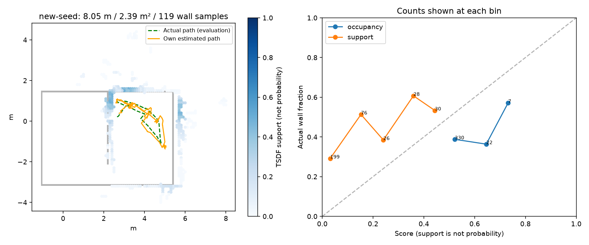

# egomap31 — frontier 소진 / 삽입 관문 감사와 PR409 costmap 재사용

2026-10-08 사전 등록. 사용자가 egomap30이라고 부른 자료는 seed29001,
실행00e4cebd/결과d3462063, `outputs/active-recovery-v1/new-seed`다.
과거 egomap29 기록/901프레임을 같은 자료로 식별하며 별도 독립 표본으로 합산하지 않는다.
먼저 d3462063 push 재시도 성공. TensorBoard 생략 유지, 모델/유료/원격 실행0.

## 오프라인 확인 / 고정 후보

기존 삽입 수정 `insert_selective_v1`은 on이다. 901 RGB 중 시작 대기10개,
891 검출 모두 geometry 있음. settling/range 거부0, 이동 관문 보류871,
관문 통과20개 전부 삽입(bootstrap1/정합수락7/명시거부10/점부족 미시도2).
90.5초 전436개 중 보류416/삽입20, 이후455개는 정지하며 전부 이동 관문 보류.
기존 GMapping 기준1m/0.5rad/시간관문off와 noise/weight/resampling은 이번에 바꾸지 않는다.

PR409 `ed2fa0e90f89ce759bc65c53a4ad36cbedcd48c8`의 public_ros_v5~v8
소스와 현재 raytrace/unknown/monitor/resolution 파일 diff0.
현재 ActiveMapper는 이미 receive_rays→clear_current_footprint, allow_unknown=true core를 쓴다.
**빠진 정책으로 단정하지 않는다.** 현재 navigation grid는 .1m, PR409 ResolutionActor는
Nav2 bringup 고정 **.05m**다. 기존 자기 SLAM .1m와 별개 navigation layer로
이 해상도와 기존 함수들을 그대로 재사용하는 `navigation_map=public_ros_v8`를 추가한다(기본off).
NavFn/회복/blacklist/footprint·inflation 수치·RGB/명령/목표 검출/추정은 불변.

원본: Nav2 235fc5ce55bdf94d9be360fdbca39d89dc0e4f74
`nav2_bringup/params/nav2_params.yaml:252,306` resolution .05,
`:405` allow_unknown true; `obstacle_layer.cpp:90–91,585–621` current footprint clear.
PR409 `public_navigation_resolution.py:12,58–65`, `public_navigation_raytrace.py:23–59`,
`public_navigation_unknown.py:54–80,103–165`, `public_navigation_monitor.py:101–117` 재사용.
출처/라이선스/원문 해시는 기존 third_party/mapfree_navigation* 보존, 새 라이브러리0.
https://github.com/ros-navigation/navigation2/blob/235fc5ce55bdf94d9be360fdbca39d89dc0e4f74/nav2_bringup/params/nav2_params.yaml

## 결과 전 기준·순서

1. 원본891개 trace bytes 동일 재현. 소진 시 원시 점유/연결 free/unknown 경계/frontier/목표/
   footprint·inflation·경로 단계를 계수. GT는 봉인 뒤 거짓 점유 분류에만.
2. 동일한 자기 RGB 관측/기록 자세로 .05m navigation layer를 처음부터 재구축한다.
   .1m 셀 보간/GT 벽 지우기/미래 footprint clearing 금지. 비교 결과가 나빠도 값 변경0.
   off bytes 골든, clear·graph rebuild에서도 .05 유지, 장기 SLAM .1 유지 시험.
3. 위 두 원인 감사와 옵션 연결이 확인되면 **seed31001/180초/물리1회**.
   egomap30(29001)과 같은 tape/SEARCH/강성/wide/recovery, 이 navigation 옵션만 추가.
   agent_lock null까지 대기, ugrp_session 단독/dev_light, S2 동시 금지. freeze0.
4. 기존 회복 기준(egomap28 대비 거리>1.090028m/면적>.485m²/hold<695/891/접촉0/180초)
   및 지도/2σ 기준 그대로. seed29001 대비 방향도 모두 보고하되 새 관문으로 바꾸지 않는다.
   이동·면적·hold·소진시각·삽입·종료오차/σ·영역P/R·덮임/표본·B/접촉·4배속 영상.
   확인 후 문턱/옵션 변경·재튜닝·추가 물리0. 고정 자세 replay를 새 이동 성공으로 해석하지 않는다.

raw `outputs/active-frontier-audit-v1`, 물리500MiB+진단200MiB, wall상한30분,
ENOSPC=HOST_ERROR. 사전 등록/시험/소스 commit 후 실행. push500은 로컬SHA 진행 예외,
종료 때 재시도. PR405 DRAFT/병합금지. supervisor 단계마다 확인.

## 오프라인 판정 (새 물리 전)

사전 등록 `a5b50425`. 원본891 trace 전체bytes 재현, GT는 봉인 후 분류만.
90.5초 당시 현재 footprint는 free, free 연결영역924칸/전체free937칸, unknown2968칸,
frontier2개가 남았다. 즉 미탐색 경계 자체가 모두 사라진 것이 아니라 **후보 목표/경로가 탈락**했다.

|후보(자기 좌표 m)|raw/cost|탈락 단계|inflation만 제거한 평가 경로|
|---|---|---|---:|
|[4.6795,1.8466]|free/253|목표 inflation|36점|
|[5.4505,4.0348]|free/0|NavFn 경로 없음|59점|

점유48칸 중 GT벽과0.15m 초과38칸(위치/검출오차 합친 평가 정의)이었다.
이 거짓 칸만 제거하는 **GT 평가 전용** ablation에서 도달 가능 frontier0→1로 바뀌었다.
거짓 점유/inflation이 차단에 기여하지만, GT로 지우는 동작은 제어에 연결하지 않았다.

|동일 자기 관측 재구축|기존 .10m|PR409 기본 .05m|
|---|---:|---:|
|free / unknown / 점유 칸|937 / 2968 / 48|3313 / 12269 / 96|
|시작 free 연결 영역|924칸|3265칸|
|frontier / 도달 가능|2 / 0|5 / **5**|
|도달 경로 점 개수|0|151,166,9,115,196|

위 칸 수는 해상도가 다르므로 면적 증가로 해석하지 않는다. 원시 자기 관측을 각 해상도에서
raytrace/mark하고 현재 footprint clear한 결과며 coarse grid 업샘플 아님.
실제 거리/지도품질 증거는 새 물리에서 따로 평가한다. [그림](figures/costmaps.png),
[전체 진단](results/costmap-audit.json), [삽입 단계별 계수](results/insertion-audit.json).

|삽입 단계|프레임 수|
|---|---:|
|촬영|901|
|초기 팔/영상 대기(제어 미입력)|10|
|벽 geometry 검출 있음 / 없음|891 / 0|
|중복·정착·거리로 탈락|각0 (range segment0)|
|GMapping 이동량 보류|871|
|통과 후 bootstrap / 정합 수락 / 명시거부 / 점부족 미시도 삽입|1 / 7 / 10 / 2|
|최종 삽입|**20**|
|90.5초 이전 보류 / 이후 정지 중 보류|416 / 455|

명시거부10개=low_overlap4/high_residual5/search_boundary1. 점부족2개는 정합 미시도(deferred)다.
`insert_selective_v1`→`gmapping_range_v1` 삽입은 정상 적용되어 **통과20/20 삽입**.
많은 hold로 실제 새 관측 위치가 늘지 않았고, 원본 motion gate1m/0.5rad가 계속 적용된 결과다.
이번에는 프레임 수를 늘리려고 motion gate나 시간 갱신값을 바꾸지 않는다.

## 옵션 연결

`navigation_map=off`(기존 .1m) / `public_ros_v8`(PR409 .05m), 기본off.
변경은 ActiveMapper navigation grid 생성/graph 재생/clear와 frontier 좌표 단위 전달뿐이다.
receive_rays·clear_current_footprint·UnknownCostmap·MonitorCore/NavFn/blacklist는 기존 함수를
그대로 호출한다. SLAM/RBPF .1m는 불변. PR409 파일4개 diff0와 원본 라이선스 유지.
실행기는 `active-nav2` workflow, seed31001 사전 고정.

실행 전 관련 시험 **17개 통과**, off 전체891 trace bytes 골든 동일.
[preflight](results/preflight.json), [오프라인 원본 hash](results/offline-manifest.json).
고정된 두 원인 감사/옵션 연결 완료 후 seed31001 물리1회로 진행한다.

## 새 seed 물리 결과 — 설정 변경 없이 종료

실행 소스 **462473cbc2730add0db5e8ab3e0965f1d9987d5e**를 push한 뒤
seed31001 단독 1회, 180 SIM초/901 RGB/891 제어프레임을 완료했다.
`agent_lock` 획득 PID49531, `ugrp_session egomap31-seed31001` 종료 및 잠금 해제 확인.
모델0/freeze0/S2 동시 실행0. wall735.069초는 실행 기록이며 속도 비교 실험이 아니다.
기존 seed29001과 새 seed31001은 paired 반복이 아니므로 옵션의 일반적 개선을 확증하지 않는다.

|지표|기존 egomap30(기록상 egomap29), seed29001|새 egomap31, seed31001|
|---|---:|---:|
|이동 거리 / footprint union|4.225m / 1.5225m²|**8.053m / 2.3900m²**|
|hold / 제어프레임|468/891 (52.53%)|**40/891 (4.49%)**|
|frontier 소진|절대90.5초 (경과89.2초)|**180초 동안 없음**|
|지도 삽입 / RGB|20/901|**47/901**|
|종료 오차 / σXY / 오차÷σ|0.572m / 0.098m / 5.84|**0.261m / 0.069m / 3.79**|
|경로 RMSE / 2σ 초과 프레임|0.470m / 815/891|0.231m / 112/891|
|yaw 종료 오차 / RMSE|3.18° / 10.61°|−6.32° / 6.99°|
|영역 precision (정확/평가 칸)|32.22% (29/90)|**56.76% (42/74)**|
|영역 recall (덮은/가시 벽 표본)|21.62% (16/74)|**52.10% (62/119)**|
|잠재 가시 범위 / 전체 벽 표본|74/329 (22.49%)|119/329 (36.17%)|
|전체 지도 precision / 점유 칸|27.01% / 174|39.00% / 359|
|전체 벽 덮임 / 전체 벽 표본|46/329 (13.98%)|**124/329 (37.69%)**|
|전체 벽 RMSE|0.392m|**0.760m (악화)**|
|B 자기 확인 / GT 도착|없음 / 미도착|절대73.3초 / **미도착**|
|벽 접촉 / 거짓 문 경로 시도 proxy|0 / 2|0 / **7**|
|loop 수락|0|0|

영역은 실제 카메라 자세/FOV/거리/벽 가림으로 정의한 **잠재 가시 영역**이다.
물체·자기 차체 가림은 반영하지 않아 실제 가시성/실제로 탐색한 전체 면적과 같지 않다.
이동·footprint 면적 및 GT는 평가 전용이다. 지도는 completed graph, σ는 online RBPF 값이며
loop 수락0으로 이 실행의 graph와 frontend 지표는 같다. 접촉은 저장된901프레임과 실행 중
abort-only 안전 점검의 평가 결과다. 거짓 문은 경로 계획 proxy이며 실제 통과 횟수가 아니다.

|새 실행 삽입 단계|개수|
|---|---:|
|RGB / 초기 팔·영상 대기|901 / 10|
|geometry 있음 / 없음|891 / 0|
|중복 / 정착 / 거리 segment 탈락|0 / 0 / 0|
|`gmapping_motion_gate` 보류|**844**|
|통과 / 삽입|**47 / 47**|
|bootstrap / 정합 수락|1 / 22|
|정합 거부 후 삽입|**24** = low_overlap8 + high_residual14 + search_boundary2|
|점 부족으로 정합 미시도|0|
|재표본 총횟수 / 거부 후 재표본 / 거부 후 CSM 가중치 갱신|15 / **0 / 0**|

egomap26 삽입 수정은 전후 모두 on이며 거부 때문에 삽입이 막히지 않는다.
이동 관문1m/0.5rad/시간off를 유지했다. 거부24개는 odometry proposal로 삽입되므로
삽입 증가 자체가 정확도 보장을 뜻하지 않는다. [재현 집계](code/summarize_insertion.py),
[단계별 원본 집계](results/physical-insertion.json).

복구 시작18회(context clear10/clear3/spin3/backup1/wait1), 완료16회.
spin2회는 목표 변경으로 끝났으며 성공으로 합산하지 않는다. navigation reset13회,
`ABORTED_unreachable` blacklist2회 모두 같은 시각 다음 frontier 선택, frontier 선택35회.
6회 retry 소진 분기는 발생0, 영구 실패 hold0. [복구 집계](results/physical-recovery.json).

기존 회복 관문 **5/5** 통과, egomap27 2σ+영역P 개선 관문 **1/2**(2σ 미달),
기존 품질 관문 **7/10**(거짓 문/precision/벽 RMSE 미달)이다. 결과 후 문턱 변경0.
frontier 정지 문제는 이번 새 seed에서 재발하지 않았으나 과신과 잘못된 벽/문이 남는다.
특히 전체 그림에 경기장 밖으로 뻗는 거짓 벽이 있어 RMSE가 악화됐다.
작은 영역의 P/R 개선을 전체 지도 성공으로 보지 않으며 여기서 추가 튜닝·물리 실행 없이 종료한다.

[손목 RGB | 당시 지도 4배속 미리보기](figures/wrist-map-4x-preview.mp4)
(960×360, 901프레임, 45.05초, 542716 bytes).
원본1280×480은 `outputs/active-frontier-audit-v1/wrist-map-4x.mp4` (1934844 bytes).
각 시각 이전47개 snapshot만 사용하며 최종 지도 역채움0. 동영상은 경기장 고정 화면 범위라
바깥 거짓 벽 일부가 잘릴 수 있으며 위 전체 지도에는 표시한다.
시작/중간/끝 화면 및 원본·미리보기 전체 ffmpeg 디코딩/프레임 수를 확인했다.

실행 전 **17시험 통과** 및 off891프레임 전체 bytes 동일, 실행 후 봉인934파일·고정20소스·
기존 미추적4파일 hash 재확인. managed 실행의 dirty 표시는 이 기존 미추적4개 때문이며
tracked 실행 소스는 clean, 실행 중 소스 변경0이다. raw937파일/131477457 bytes는 로컬 보존,
원격 raw 백업을 뜻하지 않는다. [결과](results/comparison.json),
[검증](results/physical-validation.json), [raw/영상 hash](results/physical-manifest.json).
