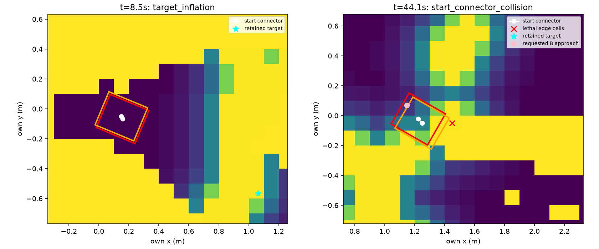

# egomap29 — 자기 지도 탐색 recovery 연결 (구현 전 사전 등록)

2026-10-08 사용자 요청. egomap28 seed28001 녹화로 원인을 재현한 뒤,
`active_recovery=nav2_frontier_v1`(기본off)만 추가한다. 기존 wide/추정/무늬/SEARCH/모션은 동결.
새 물리는 **seed29001, 180초, 1회**; agent_lock null일 때만 단독 실행, S2와 동시 금지.
모델/freeze/새 모션 적합0. 단계 사이 supervisor 확인. TensorBoard 생략 유지.

## 수정 전 오프라인 근거

기존 ActiveMapper + egomap28 명령/RGB/자기 접점으로 **891프레임의 전체 trace(명령/상태/경로 포함)가
원본과 정확히 동일**했다. GT 입력 없이 재현하고 봉인한 뒤, GT는 막힌 칸 분류에만 사용했다.
원본 no_path10회(8.5–9.1초4회,44.1–49.9초6회) + 최초 영구 실패50.1초를 저장했다.

- 8.5초: 목표 raw=free지만 inflation253. inflation 제거 진단 시25점 경로가 생김.
  다른 frontier1개가 이미 도달 가능. footprint 자체는 free.
- 44.1초: 목표 raw/cost=0, footprint 점유0. NavFn 경로는 있으나 연속 자세→첫 격자 중심
  연결에서 사각 footprint 변이 lethal 셀1개를 침범. GT 벽과0.375m 떨어진 **거짓 벽 셀**.
  inflation 제거로 해결되지 않음. frontier8개 모두 같은 시작 연결 검사에서 탈락(소진 아님).
- nav costmap만 reset→현재 자기 RGB ray/현재 footprint 재삽입 진단 시 기존 목표 경로34점,
  frontier1개 도달 가능. 장기 RBPF/graph 지도는 reset하지 않는다.
- B 접근 요청 `[1.1473,.0693]`와 이전부터 유지된 목표 `[-.1231,-.0534]`는 달랐고,
  B 요청 때문에 `static_mode=True`가 되어 복구 끝에 `failed=True`를 영구 유지했다.
  goal 좌표 추정·검출·모션 재튜닝은 이번 범위가 아니다. 실패한 요청/실행 목표를 모두
  동일한 blacklist 규칙으로 제외해 재선택을 막고 탐색을 다시 선택한다.
- clear 요청은 원래 positive hit를 그대로 재적용했다. 그래프 재작성도 오래된 obstacle
  관측을 전부 재생하고 action retry 상태를 초기화하므로, 새 옵션에서는 reset 이후
  관측만 navigation layer에 넣고 동일 action의 복구 상태를 TF 변환과 함께 보존한다.

[수치/입력](results/offline-cause.json), [costmap 그림](figures/stop-costmap.png).
진단 원본 `outputs/active-recovery-v1/diagnostic-off/` (봉인 SHA 포함).

## 옵션의 고정 동작 / 표준과 차이

[REFERENCES.md](REFERENCES.md)의 PR409 public_ros_v3~v8와 고정 원본을 재사용한다.
PR409 파일을 수정하지 않고 별도 mapper/navigator 옵션으로 연결한다. off는 원래 객체/bytes 그대로.
NavFn·footprint·inflation·frontier 비용/크기·.1m 자기 지도 해상도·v122 펄스·collision monitor는 변경0.

1. Nav2 ClearEntireCostmap/ObstacleLayer.reset처럼 **재설정 가능한 navigation layer**를 unknown으로
   초기화하고 현재 scan을 다시 raytrace/mark, 현재 footprint clear. 축적 RBPF 입자 지도·SLAM 원장은
   별도이므로 보존. 정적 지도 layer는 이 map-free 경로에 없다. reset 이전 관측을 graph update가
   obstacle layer에 되살리지 않도록 reset 시각을 보존한다(장기 SLAM 재작성에는 모든 관측 유지).
2. RecoveryNode contextual clear1회, 총 성공 recovery 재시도6회 한도. Spin1.57rad,
   BackUp0.30m/0.15m/s, Wait5초, 기존 충돌 검사/10초 행동 제한 유지.
   **원본 XML 순서는 clear→spin→wait→backup**이다. 사용자 요청에 따라 이 옵션만
   **clear→spin→backup→wait**로 순서를 바꾸며, 이를 원본 기본값이라고 부르지 않는다.
   Nav2가 제공하는 `RoundRobin wrap_around=true` 분기 그대로 반복, 전 자식 실패 또는
   recovery6회 소진이면 해당 목표 action을 ABORTED로 끝낸다(무한 재시도 없음).
3. explore_lite reachedGoal(ABORTED): 현재 frontier/실행 목표 및 실패한 임시 B 요청을
   blacklist(원본5셀 축별 허용차), action만 reset하고 다음 frontier를 즉시 요청한다.
   `failed=True`로 임무 전체를 영구 hold하지 않는다. 남은 frontier가 없으면 정상 탐색 소진은 가능.
   B 임시 요청도 같은 탐색 action으로 처리하는 부분이 자기 RGB 제약용 연결이다.
4. 주기적 graph 갱신은 좌표 TF/경로만 갱신하며, 동일 action의 retry·phase·progress 상태를
   시간 주기만으로 리셋하지 않는다. 기본off의 기존 graph 동작은 보존한다.

## 실행 전 판정 고정

오프라인 관문: (a) 위891 trace 재현, (b) 기본off bytes 동일, (c)44.1초 reset 후
경로가 생김, (d)반복 recovery가 정해진 한도에서 blacklist/다음 도달 가능한 frontier로 전이,
(e)과거 navigation hit가 graph에 되살아나지 않음, RBPF 원장/지도 reset0.
녹화의 관측·자세를 고정한 정책 재생은 대안 명령이 실제 이동했다는 증거로 쓰지 않는다.

위 관문/관련 시험 통과 후 새 seed 물리1회. egomap28 대비 **이동>1.090028m,
footprint union>0.485m², hold비율<695/891, 벽 접촉0,180초 완료**를 탐색 회복 기준으로 고정.
기존 지도/종료2σ 관문은 변경하지 않고 별도 보고. 성공·실패 모두 결과 후 추가 설정 변경/재실행0.
기준선과 이동/면적/hold, 종료오차/σ/eσ, 영역P/R 분자분모, 전체 벽 덮임,
잠재 가시표본/점유셀/삽입/RGB, B 자기 확인과GT도착/접촉/잘못된 문 계획 proxy를 함께 기록한다.

raw `/Users/changmin/projects/ugrp/outputs/active-recovery-v1/`, 물리≤500MiB+오프라인≤100MiB,
wall상한30분. ENOSPC=HOST_ERROR, 시작 이후 실패도1회로 계수하고 보존(재시도0).
사전 등록→구현/시험→소스 커밋/push→단일 물리→봉인 후 GT 평가→결과 커밋/push.
서버500은 로컬SHA로 진행 가능한 기존 사용자 예외, 작업 끝 정상push 재시도. DRAFT/병합금지 유지.

## 구현·검증 결과 — 물리 전 중단 (설정/문턱 변경0)

사전 등록 **b29ac530**. 새 옵션은 `harness/active_wall_recovery.py`에 분리했다.
공개 navigator/기존 ActiveMapper/추정·모션·카메라 파일 수정0. 현재 조건의 다른 차이는
사전 등록한 새 seed29001뿐임을 bundle 비교 시험으로 고정했다.

- 변경: resettable navigation layer의 실제 reset/현재scan 재삽입, Nav2 wrap=true
  RoundRobin/성공retry6, action 실패→blacklist/새 frontier 요청, graph 갱신에서 action 상태/TF 보존.
- 최종 관련 **단위시험9개 통과**(recovery6 + wide2 + workflow1).
  앞선 기존 mapping7개도 통과했으나 같은 시험을 합산해 횟수를 부풀리지 않는다.
  전체 egomap28 off891 trace bytes 재현, 기본off factory/출력 동일성, 고정 bundle 비교,
  합성6회 소진/다른 frontier 전이, navigation-only reset/graph epoch 보존을 확인했다.
- 새 물리 **0회**, agent_lock acquire0. 모델0. S2 프로세스에 조작0.

### 조건부 정책 재생 (새 물리 결과 아님)

egomap28의44.1–181.3초 **687개 자기 추정 자세·관측을 고정**하고 새 navigation 정책만 적용했다.
원래 입력의 처음 실패 goal을 고정한 분기 진단이다. 대안 명령을 실제로 실행하거나 물리/자세에
반영하지 않는다. RBPF/정보이득 후보 전체를 새 궤적으로 재생한 실험이 아니다.

|조건부 재생 지표|egomap28 해당 구간 원래 제어|복구 옵션|
|---|---:|---:|
|hold 요청|687/687 = 100%|57/687 = 8.30%|
|이동 요청|0|630|
|최초 이동 요청(절대 SIM초)|없음|44.3|
|영구 failed 상태|657|0|
|navigation layer reset|플래그만 해제|7|
|소진 후 blacklist / 새 frontier 선택|0 / 0|**0 / 0 (미확인)**|

clear 후 시작 연결 경로 복구는 확인됐지만, **녹화 기반 소진→blacklist 전이 관문은 확인하지 못했다**.
검사 실행이 두 번 같은 blacklist/frontier assertion에서 실패했다. 첫 실행에는 0.2초 주기의
active-clock 보완0.1초를 빠뜨린 평가기 오류도 있었고 이를 원래 ActiveMapper와 일치시켰다.
그러나 재실행에서도 blacklist 전이는 없었다. 기록된 자세가 대안 명령대로 움직이지 않아
spin/backup이 각각10초 timeout되고, 180초 종료까지 성공 recovery는 **4회**, 한도는 **6회**다.
이 조건부 검사로 해당 전이를 요구한 검증 설계 자체의 한계다. 이를 제어기의 영구 정지 재발로
단정하지 않고, 합성 단위시험 성공을 녹화 관문 통과로 대신하지 않는다.

사용자의 같은 원인 두 번 중단 규칙에 따라 **문턱/한도/재생 길이 변경 없이 중단**했다.
새 seed 물리1회는 아직 실행하지 않았다. 다음 행들의 신규 물리 지표는 모두 N/A이며,
기록 자세를 고정한 조건부 재생의 위치/지도 품질을 새 성능으로 산출하지 않는다.

|물리 지표|egomap28 기준선|새 seed29001|
|---|---:|---|
|이동 m / 면적 m²|1.090 / 0.485|미실행|
|전체 hold 비율|695/891 = 78.00%|미실행|
|종료 m / σ m / eσ|0.64739 / 0.12040 / 5.377|미실행|
|영역 P / R|15/86 = 17.44% / 31/101 = 30.69%|미실행|
|전체 벽 덮임 / 가시표본|62/329 = 18.84% / 101/329|미실행|
|RGB / 삽입 / 점유셀|901 / 22 / 154|미실행|
|B GT 도착 / 접촉|아니오 / 0|미실행|

[조건부 집계](results/conditional-navigation.json), [판정/기준선](results/status.json),
[해시](results/raw-manifest.json). raw `outputs/active-recovery-v1/`는 로컬 보존(원격 raw 백업 아님).
새 소스·실험은 DRAFT 후보이며 물리 채택·확증 성공으로 보고하지 않는다.

