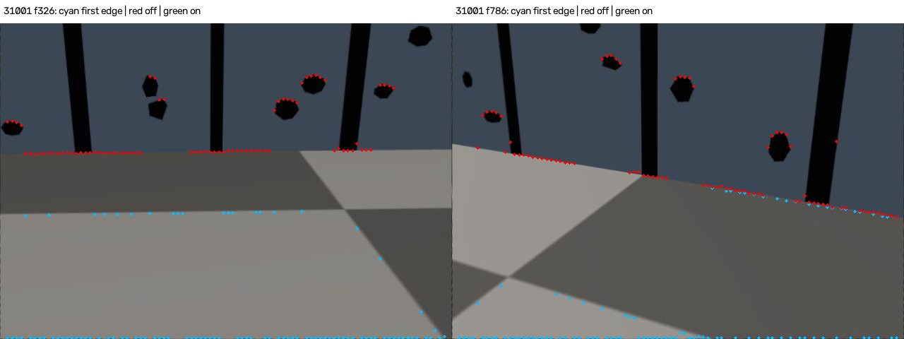
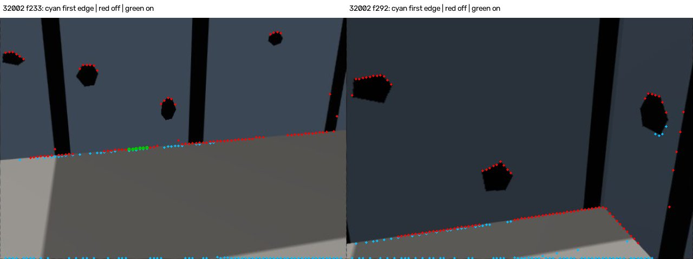
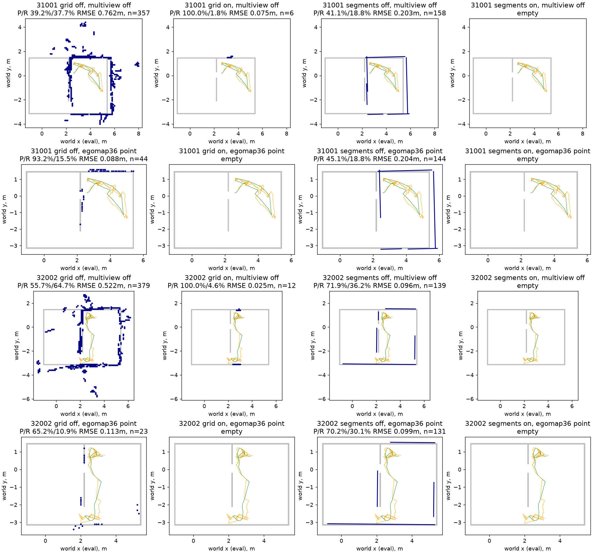

# egomap38 — 하단 연결 접점만 허용

2026-10-08, egomap37 후속. 오프라인만: 물리/렌더/MuJoCo/모델/잠금0.
PR405 DRAFT, TensorBoard 생략 유지. GT는 점/지도 평가에만 사용한다.

## 실행 전 사전 등록

- 옵션 `contact_rule=bottom_up_connected_v1`, 기본 `off`. egomap37의
  `appearance_contact_v1`은 끈다. 새로운 바닥 외형 분포/색상 문턱을 학습하지 않는다.
- 기존 검출기는 이미 아래부터 후보를 훑지만, 낮은 경계가 uniform band/vertical 조건을
  통과하지 않으면 더 높은 경계를 고른다. 새 규칙은 **판정 전** 기존 luminance/chroma
  surface-run 경계(기존 tol10, 양쪽3행 평균)에서 하단 연결을 끊는다.
  열별 유효 영상 하단에서 처음 만나는 경계 응답의 연속 행 구간만 후보로 허용한다.
  경계가 벽 조건을 통과하지 못해도 더 위를 찾지 않는다. 하단 self-mask 가림은 열을
  무효화하고, remap의 무효 바깥 테두리만 제외한다. 내부 무효 틈을 뛰어넘지 않는다.
  이는 semantic floor 분류기가 없는 기존 경계 검출기에 연결성 규칙만 적용한 것이다.
  체크/색 구역의 경계도 연결을 끊을 수 있다. 이를 새로운 외형 필터로 보완하지 않는다.
- Ulrich & Nourbakhsh 2000 §3의 열별 최하단 obstacle만 사용하는 거리 추정 규칙을
  재사용한다. 원 논문의 HSI 외형 분류 전체를 구현했다고 주장하지 않는다.
  Lorigo 1997의 하단 참조 설명은 Ulrich §2에서 확인; 원문 직접 확인은 미완료.
- seed31001 개발 → 코드/설정/결과 해시 동결 커밋 → seed32002 on 1회 평가.
  두 녹화는 과거에 이미 열람했으므로 독립 미개봉 확증 자료가 아니다. 사후 튜닝0.
- own RGB891프레임씩, 원본 추정 pose/삽입시간47/64 고정. RBPF 재추정0.
  egomap37 paired off/on처럼 양쪽에 동일한 저장된 정합 후 공분산으로 inverse sensor
  가중치를 재계산한다. 원본 정합 전 공분산 지도와 차이는 별도 표기한다.
- 조건은 contact off/on × 다중시점 off/egomap36 고정 운영점.
  칸 N1/30°, 선분 N2/0°를 그대로 적용하며 재선정하지 않는다.
- 점 P: GT 차체 pose로 놓은 실제 검출 열 접점이 실제 벽에서 .15m 이내인 비율.
  점 R: 각 프레임·96열의 실제 카메라 floor trace에 대해 4m 이내 첫 벽 접점 중
  영상/support/기존 self-mask 안에 있고 벽·상자·peer envelope에 가리지 않은 접점 분모.
  같은 열의 검출이 GT 차체 변환 후 해당 접점 .15m 이내면 회수한다. 실제 카메라는
  저장된 평가 로그에서만 읽는다. peer 세부 링크 가림은 없으므로 잠재가시 R로 표기한다.
- 지도는 기존 .1m 격자/.15m 허용거리/329 GT 벽 표본 전체 R=덮음, 잠재가시 영역
  P/R, 벽 RMSE·표본 수를 모두 기록. 선분 연속 .05m 보조 지표도 보존한다.
  점 P≥.90 및 off 대비 비감소, 지도 P≥.90/R≥.70/RMSE≤.15m 기준 유지.
  점 R의 tradeoff를 숨기지 않는다. 빈 출력 P/RMSE=NA, 관문 실패.
- raw: `/Users/changmin/projects/ugrp/outputs/bottom-connected-contact-v1`, 새 출력만.
  관련1–3시험 통과 후 커밋·push. 감독 파일은 단계마다 cat. 실패도 그대로 기록.
  디스크 오류는 HOST_ERROR, raw 삭제/외부 자원/다른 worktree 수정0.

출처: [Ulrich & Nourbakhsh 2000 원문 §2–3](https://www.cs.cmu.edu/~illah/PAPERS/abod.pdf).
기존 코드 `height_free_wall.py:307–368`, `surface_run_top:159–193`.

## 개발 실행기 수정 (판정 전)

사전 등록 `ce4f920b`, 구현 `0a77c5c1`. 첫 개발 예측은891프레임까지 끝났지만,
기존 `validate_rows`가 빈 segments 원장을 거부하여 다중 시점 표 생성 전에 중단됐다.
`comparison/` 부분 출력을 보존한다. 빈 프레임은 원장/삽입 시각 기록에 유지하고
지지 계산에만 비어 있지 않은 원장을 전달한다(빈 관측은 증거0). 검출/문턱 변경0.
빈 관측 회귀시험 추가 후 `comparison-complete/`에서 개발 재생을 완료한다.

## 31001 개발 결과·설정 동결

실행 SHA `565bf428`. GT 평가 전 own-only 예측 봉인. 검출점 P94.25→100%,
점53,232→256, 잠재가시 열 접점 R47,299/81,898=57.75%→254/81,898=0.31%.
비어 있지 않은 검출 프레임891→28, 기존47삽입 시각 중 nonempty47→5.
삽입 시각 실제점3,054→43. 높은 P는 극소 표본에 한정된다.

|31001 표현·다중시점|contact off P/R/RMSE|contact on P/R/RMSE|칸 표본수 off→on|
|---|---:|---:|---:|
|칸·off|39.22/37.69%/.7621m|100/1.82%/.0750m|357→6|
|칸·N1/30°|93.18/15.50%/.0881m|NA/0%/NA|44→0|
|선분·off|41.14/18.84%/.2032m|NA/0%/NA|158→0|
|선분·N2/0°|45.14/18.84%/.2038m|NA/0%/NA|144→0|

검출 P 관문은 통과하나 R 급락, 지도 절대관문은 전부 미달. 방법/문턱 변경0.
`freeze.json`의 구현·개발 결과 해시와 운영점을 커밋한 뒤32002 비교를1회 진행한다.
이는 개발 성공을 근거로 한 독립 확증이 아니라 사용자 요청의 고정 비교다.

## 32002 1회 평가·최종 비교

동결 `16f7e790` push 후 on 예측/평가1회. 재튜닝0.

|seed·contact|점 P|잠재가시 접점 R (회수/분모)|점 수|점 RMSE m|검출/삽입 nonempty|
|---|---:|---:|---:|---:|---:|
|31001 off|94.25%|57.75% (47299/81898)|53,232|0.1859|891/891 · 47/47|
|31001 on|100.00%|0.31% (254/81898)|256|0.0053|28/891 · 5/47|
|32002 off|91.00%|59.70% (44359/74309)|56,162|0.2263|878/891 · 64/64|
|32002 on|99.10%|1.09% (808/74309)|893|0.1851|108/891 · 9/64|

|seed·표현·다중시점|off P / R=덮음 / RMSE m|on P / R=덮음 / RMSE m|표본수 off→on|
|---|---:|---:|---:|
|31001 grid off|39.22% / 37.69% / 0.7621|100.00% / 1.82% / 0.0750|357→6|
|31001 segments off|41.14% / 18.84% / 0.2032|NA / 0.00% / NA|158→0|
|31001 grid N1/30°|93.18% / 15.50% / 0.0881|NA / 0.00% / NA|44→0|
|31001 segments N2/0°|45.14% / 18.84% / 0.2038|NA / 0.00% / NA|144→0|
|32002 grid off|55.67% / 64.74% / 0.5217|100.00% / 4.56% / 0.0250|379→12|
|32002 segments off|71.94% / 36.17% / 0.0962|NA / 0.00% / NA|139→0|
|32002 grid N1/30°|65.22% / 10.94% / 0.1131|NA / 0.00% / NA|23→0|
|32002 segments N2/0°|70.23% / 30.09% / 0.0989|NA / 0.00% / NA|131→0|

|seed·표현·다중시점|off 영역 P/R|on 영역 P/R|on 영역 칸/잠재가시 벽표본|
|---|---:|---:|---:|
|31001 grid off|57.53%/52.10%|NA/0.00%|0/119|
|31001 segments off|4.65%/25.21%|NA/0.00%|0/119|
|31001 grid egomap36|76.92%/10.92%|NA/0.00%|0/119|
|31001 segments egomap36|6.90%/25.21%|NA/0.00%|0/119|
|32002 grid off|63.58%/76.03%|100.00%/6.16%|11/146|
|32002 segments off|65.49%/52.05%|NA/0.00%|0/146|
|32002 grid egomap36|63.16%/17.12%|NA/0.00%|0/146|
|32002 segments egomap36|62.86%/45.21%|NA/0.00%|0/146|

원본 과거 grid는31001 P39.00/R37.69%/RMSE.7599m(359칸),
32002 P55.64/R64.74%/.5204m(381칸)으로 따로 보존한다. 위 paired off는
정합 후 covariance 재가중 값이라 egomap36 원본 운영점의43/24칸과도 다르다.
운영점 자체 N1/30°·N2/0°는 동일하다. 전체 R 분모329, 영역 분모119/146 고정.
이동/관측 범위도 기존8.053/7.449m, footprint2.390/2.2675m² 그대로다.
연속 선분 보조 P/R/RMSE와 길이는 각 결과 JSON의 `continuous`/`size`에 남겼다.
on 선분은 두 조건 모두0개라 보조 지표도 P/RMSE=NA·R0이다.

### 판정·남은 원인

- 검출 **P 기준2/2**를 통과했지만, 점 recall은57.75→0.31%·59.70→1.09%로 붕괴했다.
  지도 절대관문은 seed별 칸/선분×다중시점 off/운영점 **모두 미달**이다.
  on 칸은6/12개에서 P100%이고 덮음1.82/4.56%뿐이다. 높은 P를 지도 성공으로 보고하지 않는다.
- 기존 tape FP2,201개는0개, 3,180개는7개만 남았다. 그러나 동일 후단 선분 연결에서
  새로 포함된2/9열 중32002의1점도 tape FP라 최종 tape FP는 **0/8개**다.
  raw 후보를 더 높이 탐색한 것이 아니다. 원래 `link_segments`는 range 불연속을 만난 열을
  버리고 다음 열부터 재시작하므로, 앞선 점을 제거하면 예전 제외 열이 포함될 수 있다.
  공통 열의 실제 접점 좌표는 완전히 같았다. `results/*-retention.json`에 모두 기록했다.
- RGB에서 첫 경계가 체크 무늬 및 영상 하단 테두리에도 잡힌다(아래 청록 점).
  그 위 진짜 벽 접점도 버린다. 기존 edge-run 연결은 **의미상 바닥 영역**과 같지 않다.
  remap 무효 화소를 제외했어도 경계 연산의 주변 화소/하단 테두리 응답까지 사라진다는
  보장은 없다. 외형/기하 없이 연결성만 제한한 이 후보의 한계로 남긴다.
  실패 뒤 support 여유/색 분포/경계 문턱/다중시점 운영점을 변경하지 않았다.
- 32002의 남은8점은 영상 경계/색만으로 실제 벽 접점과 내부 무늬를 완전히 나눌 수
  없음을 보여준다. 기본off, 채택·물리·내보내기0. 이 결과로 전체 연결성 기반 방법이
  실패한다고 일반화하지 않는다. 다음 구현/재평가는 이번 범위에서 하지 않는다.





### 원본 관문 보존·실행 기록

|원본 단계|31001|32002|
|---|---:|---:|
|RGB / 초기 대기|901 / 10|901 / 10|
|geometry / empty|891 / 0|878 / 13|
|GMapping 이동 보류|844|814|
|원장 삽입 시각|47|64|
|bootstrap / improved|1 / 22|1 / 30|
|low_overlap / high_residual / search_boundary|8 / 14 / 2|7 / 19 / 2|
|insufficient_match_points|0|5|
|이번 on의 nonempty 삽입|5|9|

egomap26 `gmapping_range_v1`·`insert_selective_v1` on, 이동1m/.5rad·temporal off 그대로.
원본 관문 거부 후 삽입24/28·거부 시 재표본0도 그대로다. 이번 새 감소는 contact 규칙이며
이동 관문을 다시 실행하거나 이전 egomap30의20삽입을 이번 수치로 바꾸지 않는다.

```python
observe(own_rgb, commanded_servo, contact_rule="bottom_up_connected_v1")
contact_points(own_rgb, commanded_servo, contact_rule="bottom_up_connected_v1")
# 기본/명시 off는 이전 출력과 같음. appearance_contact_v1과의 조합은 거부.
```

예측→평가→동결→보류 예측→평가 순서, `compare.py predict|score 31001|32002`.
`report.py`/`audit.py`는 봉인 예측의 그림·보조 유형 감사만 하며 후보를 고르지 않는다.
첫 개발 실행기의 빈 scan 오류와, 보조 감사의 '후단 점도 단순 부분집합'이라는 잘못된
assertion은 별도 기록했다. 후자는 재연결2/9열을 명시하는 보고 코드만 고쳤다.
알고리즘·점 예측·평가 결과 변경0, 두 오류는 서로 다른 원인이다.

관련3파일 **12시험 통과**: 첫 경계 뒤 상위 fallback 금지, self/invalid gap,
빈 지지 입력, 기존 실제 RGB off 골든, 기존 외형 옵션·선분 회귀.
111개 원본 삽입 관측 off 동일, paired off 지도 bytes도 egomap37과 동일,
원본 grid/pose/카메라·RGB·미추적4파일 불변. [검증](results/verification.json).
[출처/적용 차이](REFERENCES.md), [raw manifest](results/raw-manifest.json).
원본·부분 실패 출력은 로컬 outputs에 보존(원격 백업 아님). 그림 각1MiB 미만,
실험5MiB 미만. PR405 DRAFT·병합0·다른 작업/환경 변경0.
