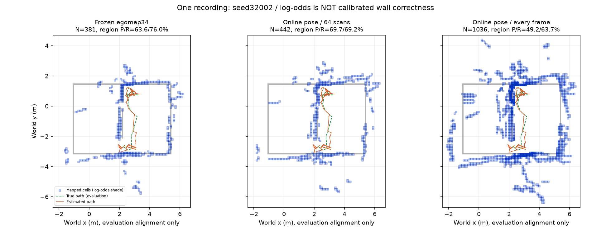
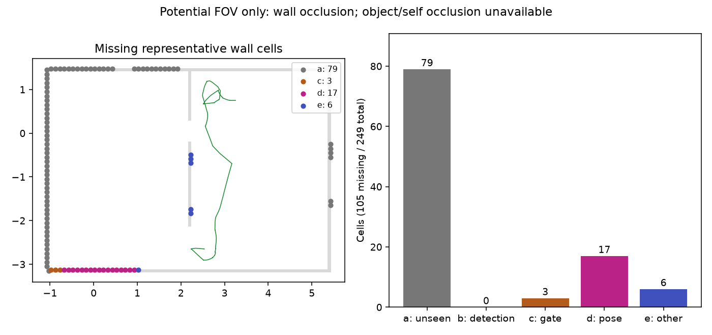

# egomap44 — 카메라 지도 갱신과 RBPF 이동 관문 분리

## 실행 전 등록 (2026-10-08)

사용자 요청에 따른 **오프라인 개발 진단**, 물리·모델 호출·잠금 0.
자료는 egomap34 seed32002 `outputs/wall-segment-dev-v1/new-seed` 하나만 사용한다.
다른 seed·새 녹화·새 검출기·모션 재적합·사후 문턱 선택은 하지 않는다.
원본은 보존하고 새 출력은 `outputs/camera-map-integration-v1`에 쓴다.
ENOSPC는 HOST_ERROR이며 실패를 성능 결과로 대체하지 않는다.

원장 확인: RGB 901, 제어/검출 입력 891, 선분 있음 878, 빈 검출 13,
삽입 64. 보류 `gmapping_motion_gate` 814, 수락 30, bootstrap 1,
거부 high_residual/low_overlap/search_boundary 19/7/2,
insufficient_match_points 5. egomap26의 거부 후 삽입은 이미 켜져 있다.
실제 RBPF 관문은 **1.0 m / 0.5 rad**다. 0.25 m / 0.2 rad는
재위치 AMCL의 관문이며 이번에 어느 쪽도 바꾸지 않는다.

### 방법과 출처

- [Hornung et al., Autonomous Robots 2013](https://www.arminhornung.de/Research/pub/hornung13auro.pdf)
  §3.2 식(4), §5.1 식(7): 각 센서 관측의 ray free/endpoint hit,
  log-odds 합산과 상하한 clamping. PDF 원문을 읽음.
- [OctoMap v1.10.0 OccupancyOcTreeBase.hxx](https://github.com/OctoMap/octomap/blob/v1.10.0/octomap/include/octomap/OccupancyOcTreeBase.hxx)
  `insertPointCloud`, `computeUpdate`, `updateNodeLogOdds`: 한 관측 안에서 칸을 중복
  갱신하지 않고 hit가 free보다 우선한다. 센서 자세는 외부 입력이며 이 통합 함수에
  이동량 관문이 없다. 모든 카메라 SLAM이 매 프레임을 쓰는다는 주장은 하지 않는다.
- [기본값](https://github.com/OctoMap/octomap/blob/v1.10.0/octomap/src/AbstractOccupancyOcTree.cpp)
  생성자: prior/점유 판단 0.5, hit 0.7, miss 0.4, clamp 0.1192–0.971.
  기존 `OdomGrid`/`weighted_insert`가 이미 같은 값과 2D Amanatides–Woo ray traversal을
  구현하므로 이를 재사용한다. OctoMap은 New BSD, 새 라이브러리·venv 변경 없음.
- Thrun et al., *Probabilistic Robotics* (2005), ch.9의 역센서 log-odds 모델은
  기존 구현 출처다. 이번에 새로 원문 확인한 자료는 위 Hornung 논문과 공개 코드다.

**제약 때문에 유지하는 부분:** 3D octree 대신 기존 0.1 m 2D 격자, 벽 선분을
반 칸 이하 간격으로 표본화, 기존 positive-depth/4 m/정착 검사,
기존 `inverse_sensor_v1` 가중치. 4 m 밖 광선의 free 연장은 추가하지 않는다.
이번 옵션은 지도 소비자만 추가하며 입자별 정합 지도·RBPF RNG·이동 관문·graph를
수정하지 않는다. 각 시각에 로봇이 알던 자세와 공분산만 쓴다.

주의: 기본 점유 판단은 p>0.5이므로 **처음 양의 hit도 점유**다. 표준 clamping을
다중 시점 확인 문턱으로 바꾸지 않는다. 반복된 동일 오검출은 강화될 수도 있고,
상관된 프레임 수를 독립 증거의 정확도나 보정된 벽 확률로 해석하지 않는다.

### 옵션 (기본 off)

| 옵션 | 의미 |
|---|---|
| `map_update=off` | 기존 지도/출력 그대로, 새 소비자 없음 |
| `map_update=camera_every_frame_v1` | 모든 유효 자기 관측을 당시 최선 자기 자세로 별도 지도에 통합; 자세 추정에는 역입력 없음 |

기존 pose graph 최종 지도와 새로운 **online** 지도는 이력 자세 선택이 다를 수 있다.
이를 숨기지 않도록 동일한 online 자세에서 기존 64 삽입 ID만 사용하는 대조 지도도
추가한다. 이 대조는 빈도 효과 분리용이며 별도 성능 표본으로 합산하지 않는다.

### 누락 진단의 사전 정의

정답 벽 경계의 기존 0.1 m 표본을 자기 격자 칸별로 중복 제거하여 대표 벽 칸을 만든다.
기존 평가의 0.15 m 대응 허용 안에 점유 칸 중심이 없으면 누락이다.
정확한 같은 칸 점유 여부도 보조 집계하되 셀 경계 효과와 섞지 않는다.
분모는 전체 대표 벽 칸 및 그중 누락 칸 두 가지를 명시한다.

누락 칸별 원장은 (a) RGB 범위·4 m·벽 가림을 고려한 가시 기회 없음,
(b) 기회는 있으나 GT 차체 자세로 옮긴 검출 면이 0.15 m 내에 없음,
(c) 그런 검출은 있으나 삽입 ID에 없음,
(d) 삽입 ID에는 있으나 추정 자세에서는 다른 곳에 놓임으로 순차 분류한다.
(b)는 픽셀 검출 누락과 투영 오차를 포함한 **투영 검출 실패**다.
정확히 삽입 후 free 증거로 사라지거나 양자화로 빠진 잔여는 별도 (e)로 보고하며
억지로 자세 오차에 넣지 않는다. 가시성은 저장된 평가 카메라/기하만 사용한다.
동적 물체의 정확한 실루엣을 재구성할 수 없으면 '잠재 가시'로 표시하고 한계를 적는다.
GT는 이 진단/채점 프로세스에만 있고 지도 생성/재위치에는 주지 않는다.

### 실행 전 고정 판정

지도 갱신 개선: (1) 삽입 >64, (2) **영역 P≥103/162**, (3) 영역 R≥111/146,
(4) 전체 덮음 >213/329, (5) 벽 RMSE≤0.5204 m, (6) 자세 추정 원장/출력 불변.
여섯 항목을 개별 보고하며 모두 만족할 때만 이 개발 자료에서 개선으로 판정한다.
egomap41 사용자 목표 변경으로 폐기된 P≥.90/R≥.70/RMSE≤.15 품질 관문을 부활시키지 않는다.
지도 표에는 전체/영역 P/R, 전체 덮음, 점유/관측 칸 수, 가시 표본 수, 삽입 수를 함께 쓴다.

재위치: egomap42 **LM on 6조건**(자기/정적 × 잃은 시각 60/90/120초)을 1회씩.
자기 지도는 매 cut **직전** 입력까지만, suffix는 cut **이후**만 사용한다.
자기 랜드마크/기억한 B/명령 delta/seed 41001–41003은 egomap42 캐시 그대로 사용한다.
60초의 B 미관측을 유지한다. 정적은 같은 개체의 정적 B, 자기 조건에 GT 정렬 없음.
egomap43 tempering은 추가하지 않는다(egomap42 기본 off 유지).
egomap41/42의 5프레임·0.25 m·10° 수렴, 공통 수렴 오차/시간 비≤2,
참조≥2/3·자기 수렴 수 열세 없음, 거짓 수렴 0 및 목표/경로 판정 10항목을
**기존 score 함수를 그대로 재사용**한다. 표본은 녹화 1개에서 나온 의존적인 3쌍이다.
오프라인 고정 명령은 새 경로를 따르지 않으므로 실제 폐루프 B 도달은 미측정이다.
어떤 결과도 물리 실행으로 이어가지 않는다. 결과 후 재튜닝 없음.

## 결과 (설정 동결, 재튜닝 0)

녹화 **1개**, RGB 901/제어 입력 891/비어 있지 않은 검출 878. 가시 벽 표본 146/329.
새 물리·모델 호출 0. 이동 거리 7.449 m, 실제 footprint 합집합 2.268 m²는 원본과 같다.

### 누락 벽 칸

GT 벽 표본 329개를 자기 0.1 m 칸별 대표점으로 묶으면 249칸이다. 0.15 m 대응 허용에서 144칸 덮임/105칸 누락이다. 정확한 같은 칸만 비교하면 185칸 누락으로, 이를 자세 오차로 합산하지 않는다. 대표점의 잠재 가시 칸은 92/249이다.

| 누락 이유 | 칸 | 누락 105칸 중 | 전체 249칸 중 |
|---|---:|---:|---:|
| a: 대표점 시야·4 m·벽 가림 밖 | 79 | 75.2% | 31.7% |
| b: 가시 기회 있으나 투영 검출 없음 | 0 | 0.0% | 0.0% |
| c: 검출됐으나 삽입 안 됨 | 3 | 2.9% | 1.2% |
| d: 삽입 시 자세로 다른 곳에 놓임 | 17 | 16.2% | 6.8% |
| e: 맞게 삽입 후 free/칸 경계 잔여 | 6 | 5.7% | 2.4% |

**c의 3칸은 모두 이동 관문**: 각각 6/7/9개 검출 프레임이 보류됐다. 가시 누락 26칸 중 이동 관문 3칸(11.5%), 자세 배치 17칸(65.4%), 잔여 6칸(23.1%)다. 814개 보류 프레임이 곧 서로 다른 814개 벽의 손실이라는 뜻은 아니다.
가시성은 실제 카메라와 벽 가림만 계산한 **잠재 가시성**이다. 자기 몸/물체 가림은 복원하지 못했다. 같은 칸의 첫 GT 표본을 대표로 쓰므로 그 칸 모든 면의 가시성은 보장하지 않는다. (b)는 픽셀 누락과 투영 오차를 구별하지 않는 운영 정의다.

### 지도 (영역과 전체를 혼합하지 않음)

| 구성 | 삽입 | 영역 P / R | 전체 P / R(덮음) | 점유 칸 | 관측 칸 | 벽 RMSE(m) |
|---|---:|---:|---:|---:|---:|---:|
| egomap34 최종 입자/graph | 64 | 63.6% / 76.0% | 55.6% / 64.7% | 381 | 2068 | 0.520 |
| 동일 online 자세 64프레임 대조 | 64 | 69.7% / 69.2% | 45.2% / 58.1% | 442 | 2315 | 0.572 |
| 매 프레임 online 지도 | 878 | 49.2% / 63.7% | 25.2% / 57.1% | 1036 | 4011 | 0.852 |

지도 관문 **2/6, 실패**. 삽입 증가·자세 원장 불변만 통과.
같은 online 자세 대조에서도 점유 442→1036칸, 참 칸 200→261, 거짓 칸 242→775이다. 통합 증가가 반복된 거짓 접점/부정확한 당시 자세의 흔적을 제거하지 못했다. free ray와 clamping은 작동하지만 hit의 의미 자체가 벽임을 검증하지 않는다.
영역 P 분모 254칸(참 125), 영역 R 분모 146표본(덮임 93), 전체 덮임 188/329. 관측 격자 면적 40.11 m²는 추정 ray의 합집합이며 실제 탐색 면적이 아니다.

### 누설 없는 snapshot 재위치 — egomap42 LM on 6조건

AMCL/KLD·랜드마크·seed·suffix·기억 B·판정은 그대로, tempering off. 원본 3쌍과 새 지도 3쌍을 비교하며 독립 표본 6개로 합산하지 않는다.

| 조건/잃은 시각 | 삽입 off→on | 수렴 off→on | 최초 수렴 s off→on | 거짓 수렴 프레임 off→on | 종료 XY m off→on |
|---|---:|---|---:|---:|---:|
| own / 60s | 27→287 | 1→1 | 5.2→5.2 | 253→240 | 3.727→3.941 |
| own / 90s | 34→437 | 1→1 | 0.8→0.8 | 108→79 | 0.208→0.216 |
| own / 120s | 38→587 | 1→1 | 54.2→54.2 | 116→107 | 0.140→0.122 |
| static / 60s | 정적 고정 | 1→1 | 9.2→9.2 | 22→22 | 0.111→0.111 |
| static / 90s | 정적 고정 | 1→1 | 1.2→1.2 | 16→16 | 0.098→0.098 |
| static / 120s | 정적 고정 | 0→0 | —→— | 39→39 | 1.085→1.085 |

재위치 쓸모 관문 **7/10**, 통과 여부 `False`. 동일 scorer의 상세 항목은 `results/utility-on.json`에 보존. 거짓 수렴이 남으면 정확히 수렴한 적이 있어도 안정적인 위치 복구로 보고하지 않는다.
60초 B는 여전히 미관측이다. 90/120초 B는 이전 자기 RGB 관측 ID `r3-obs-000355`에서만 온다. 기존 녹화 명령이 B를 향하지 않으므로 실제 폐루프 목표 도달은 **미측정**이며 물리 실행은 하지 않았다.

| cut | 이전 점유 칸 / 덮음 | 새 점유 칸 / 덮음 | 새 관측 칸 |
|---|---:|---:|---:|
| 60s | 170 / 38.6% | 479 / 37.1% | 1745 |
| 90s | 228 / 47.7% | 643 / 48.3% | 2314 |
| 120s | 296 / 50.5% | 766 / 58.1% | 2675 |

후속 해석: 이동 관문은 실제로 대부분의 프레임을 버리지만, 이 녹화에서 매 프레임 지도 통합만으로 유용성이 좋아진다는 증거는 얻지 못했다. 이번에는 추가 문턱·검출기·자세 보정·물리를 시도하지 않는다.

## 구현·검증·보관

- 사전등록 `60decda7`, 재생 소스 `3bca130f44e4ef54bb8d022dbfa82785f6ff09e9`.
- `harness/self_camera_grid.py`는 기존 `weighted_insert`를 재사용한다.
  `SelfWallMemory(map_update='camera_every_frame_v1')`에서 자기 기억용 지도를 선택한다.
  이미 만들어진 RBPF에는 `install(grid, map_update=...)` 후 `grid.camera_map.export()`로 읽는다.
  원래 `grid.export()`·입자별 정합 지도·경로 계획기의 입력은 그대로다.
  `wall_export`를 함께 켜면 새 지도/관측 원장에서 자기 기억을 만든다.
  peer 지도 입력·배열 전송·정적 지도 입력·LLM 호출을 추가하지 않았다.
- 정합 수락 프레임은 기존 prior-predictive confidence 값을 재사용하고,
  이동 관문 보류 프레임은 그 시각 추정 공분산으로 같은 식을 계산한다.
  빈 검출 13개에는 벽을 만들지 않는다. 정착/거리 거부는 이 자료에서 0이다.
- 관련 시험 **18개 통과**: `test_self_camera_grid.py`, `test_self_wall_export.py`,
  `test_self_map_causal.py`. off 기존 snapshot bytes, on에서도 RBPF export/결정/원장/RNG
  불변, ray free·hit 우선·clamp·중복·거리/정착·자기 입력 경계·인과적 snapshot을 확인했다.
  실제 정적 3조건의 전체 예측 rows·plan·goal도 egomap42와 바이트 동등하다.
- 전체 품질 기준 실패를 소프트웨어 시험 실패와 혼동하지 않는다.
  지도 **2/6**, 쓸모 **7/10** 미달을 그대로 보존하고 추가 튜닝/물리를 하지 않았다.
- 상세 원장·새 snapshot·6개 재위치 결과·논문 원문·로그:
  `/Users/changmin/projects/ugrp/outputs/camera-map-integration-v1`.
  파일별 SHA-256은 `results/raw-manifest.json`; 입력 불변·세 cut 검사는
  `results/verification.json`. raw는 로컬 보관이며 원격 백업으로 보고하지 않는다.
- `code/replay.py prepare`, `predict --condition own|static --trial 0|1|2`,
  `code/evaluate.py diagnose|maps|utility`, `code/report.py`가 실행 경로다.
  봉인된 준비/재위치 결과는 덮어쓰지 않는다. 재현은 소스 SHA와 별도 빈 출력 경로에서 한다.
- 물리·모델·Drive 업로드·TensorBoard 변환 0. PR #405 DRAFT 유지, 병합하지 않음.
  이전 [egomap43 결과](../2026-10-08-own-map-closed-loop/README.md)는 별도로 보존한다.
