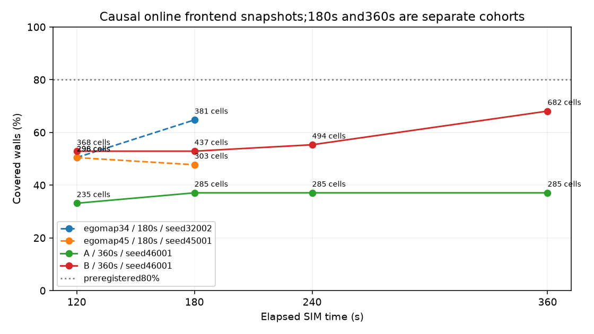
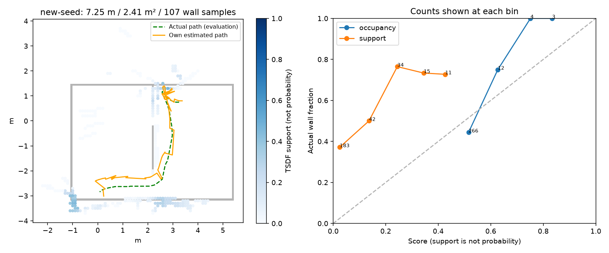
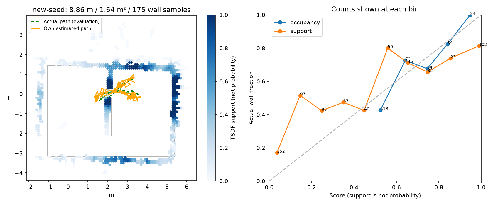
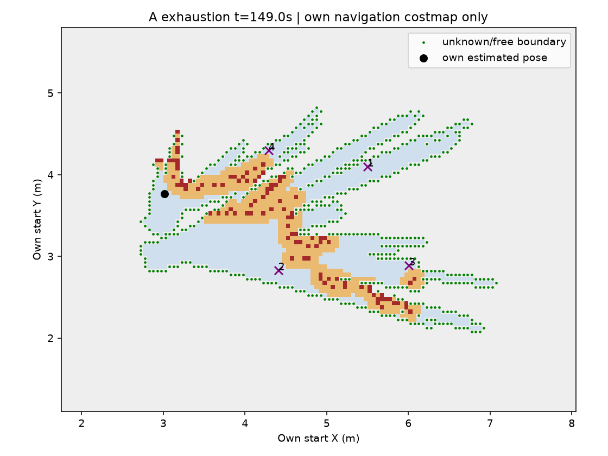

# egomap46 — 별도 360초 탐색 예산 조건 (실행 전 사전등록)

2026-10-08 사용자 결정: 예산을 늘린 조건을 비교한다. **180초 결과와 합산하지 않는다.**
동일한 새 seed46001에서 **A 다음 B, 각각 MuJoCo DEV 1회**. 알고리즘·문턱 재튜닝0.
등록 이전 기준 소스5d5e36be, PR405 DRAFT. 모델 호출0·freeze0·GT는 평가만.

## 조건과 기준

|조건|탐색기|SIM 예산|seed|구분|
|---|---|---:|---:|---|
|egomap34|기존 frontier_rbpf_v1|180초|32002|기존 개발 결과, 합산 금지|
|egomap45|yamauchi_cycle_v1|180초|45001|기존 개발 결과, 합산 금지|
|A|egomap34 기존 탐색기 그대로|**360초**|**46001**|새 조건·1회|
|B|egomap45 frontier 목표 유지+360° 관측 주기 그대로|**360초**|**46001**|새 조건·1회|

A/B 차이는 `frontier_observation=off` / `yamauchi_cycle_v1`뿐이다.
벽 tape_v1, SEARCH, servo_stiffness=real_v1, s2_pulse_v122_rotL_v1,
RBPF100·pose_graph·switchable·wall_confidence·TSDF support,
selective resampling·insertion 수정·Manhattan·20° 검색, public_ros_v8·Nav2 recovery는 불변.
검출기 개선 중단 유지, egomap44 매 프레임 SLAM 삽입 off.
기존의 초기 대기2초도 cap에 포함하며 촬영1801개·제어1791프레임이 정상 완주 수다.

**사전 성공 기준(각 조건 개별 판정)**:
1. 전체 벽 덮음 **≥80%**(기존0.1m 벽 표본329개에 대한0.15m 이내 비율).
2. 실제 관측 영역 점유칸 정밀도 **≥0.636**(사용자 지정63.6% 그대로; 결과 후 반올림 조정 없음).
둘 다 만족해야 기준 통과. 정상360초 완주 여부는 별도로 표시하며 조기 실패를 성공으로 승계하지 않는다.
문 통과·hold·벽 RMSE·영역 R·B 도달·접촉·삽입 수/거부 사유도 숨기지 않는다.
서로 다른180초 seed 대비는 기술적 비교이며 시간 증가의 인과효과 확증이 아니다.
A/B 같은 seed도 표본1쌍으로 통계적 일반화하지 않는다.

## 시점별 평가·영상

- 120/180/240/360초는 reset 완료 시각을0으로 한 경과 SIM 시간이다.
- 그 시각 이하 `online-maps.jsonl`의 가장 최신 **당시 frontend snapshot**만 사용한다.
  최종 pose graph를 과거 지도에 소급 적용하거나 미래 관측을 섞지 않는다.
- 곡선은 online frontend 전체 벽 덮음, 점유칸 수, 사용 snapshot 시각·스캔 수를 함께 저장한다.
  최종 표는 기존 egomap34/45와 같은 completed graph 지도 평가를 사용하며, 마지막 online
  frontend와 다르면 두 값을 별도 표시한다. 과거180초 자료의240/360초 값은 **해당 없음**.
- 조기 물리/호스트 실패 이후 시점은 censored/결측; 마지막 지도를 미래 값으로 반복하지 않는다.
- 전체 P/덮음/RMSE, 영역 P/R 및 각각의 칸·표본 분모, 실제 시야 표본/329를 같이 보고한다.
  영역은 기존 GT카메라 FOV·4m·벽 가림의 잠재 시야(물체/자기 가림 미모델링) 정의 그대로.
- 문 통과는 egomap45 평가기를 재사용: 실제 중앙/아래 개구부에서 오른쪽→왼쪽 중심 횡단 및
  이후 x<2.175 확인. 제어기는 이 좌표를 받지 않는다.
- B 목표는 자기 RGB로 관측·기억한 후보만. 세계 좌표로 목표를 주지 않으며 미관측은 별도 기록.
- A/B 각각 `wrist-map-4x.mp4`: 자기 손목 RGB | 당시 자기 지도·추정/실제 경로(실제는 평가 표식).
  20fps, 정상 완주1801프레임이면90.05초. 영상/원본은 로컬 outputs, 해시·표·작은 그림은Git.

## 실행 관리

README 사전등록 커밋 → 바뀐 실행 어댑터/평가 시간선 시험과 off bytes 검사 → 소스 동결 커밋/push
→ agent_lock null에서 드라이버PID로 원자 acquire → A → release → supervisor/잠금 확인
→ B acquire·실행 → release. S2 잠금이 있으면 대기하며 다른 프로세스에는 손대지 않는다.
관리 진입점은 sim_cli workflow + ugrp_session. 기존 제어기/지도 파일은 수정하지 않는다.
A 결과에 따라 B 설정을 바꾸거나 취소하지 않으며, 정상 실험 실패는 그대로 남긴다.
실행마다 호스트 상한30분(기존 그대로), 총 물리 최대60분, raw 예산2GiB.
여유10GiB 미만이면 실행하지 않음, ENOSPC=HOST_ERROR. 실제 물리 실패·실행 오류는 종료·보존.
실패 후 재튜닝·추가 물리0. push 서버 장애는 로컬SHA로 진행 후 다시 시도.

실행 명세: 사용자 지시의 **A/B 구성 그대로**를 우선해 기존 Nav2/costmap/pulse 충돌예측 hold를
유지한다(egomap45의 실제 hold259프레임 포함). 이 부분을 로그 전용으로 완화하지 않는다.
모든 보수적 가드를 기록 전용으로 바꾸는 strict dev_light와는 다르며, 그 차이를 숨기지 않는다.
실험 전체는 품질/σ 미달로 조기 종료하지 않고360초까지 기록한다. 가드를 바꾸면 시간 외 변인이
추가되므로 이번 ‘시간만 변경’ 비교에는 넣지 않는 기본 가정이다. 관련 확인 질문은 사용자에게 전달했다.
사전등록 후 알고리즘 source/hash 및 두 조건의 적용값을 freeze.json에 고정한다.

원문/코드는 [egomap45 출처](../2026-10-08-frontier-visibility/REFERENCES.md)와
[egomap34 고정 구성](../2026-10-08-wall-segment-dev/README.md)을 그대로 재사용한다.
새 방법 조사·튜닝·라이브러리 설치 없음. TensorBoard 생략 유지, PR405 DRAFT/병합 금지.
raw: `/Users/changmin/projects/ugrp/outputs/frontier-duration-v1/{A,B}/new-seed`.

## 결과 — 조건별 n=1, 합산 없음

사전등록 `12915e74`, 실행 소스 **`2473b998212da8b6d869942750dc40f0222c7588`**.
A→B 순서, seed46001에서 각각360 SIM초·RGB1801개·제어1791개를 완료했다.
S2 잠금 해제 뒤 각각 원자 acquire/release했고 관리 세션도 정상 종료했다.
A/B의 scene.xml·정적 평가 지도·실행 SHA 동일 검사를 통과했다. 평가 지도는 제어 입력이 아니다.
동결42파일/기존 알고리즘 불변, 모델 호출0·freeze0·추가 물리0·결과 후 재튜닝0.
기존 hold를 유지하는 실행 명세도 그대로이며 strict log-only dev_light로 표현하지 않는다.

|조건(분리)|전체 벽 덮음 /329|영역 P(정답/칸)|영역 R(덮인/시야 표본)|전체 점유칸|벽 RMSE m|실제 시야 표본 /329|
|---|---:|---:|---:|---:|---:|---:|
|egomap34·180s·seed32002|64.7% (213)|63.6% (103/162)|76.0% (111/146)|381|0.520|146 (44.4%)|
|egomap45·180s·seed45001|47.7% (157)|92.9% (91/98)|60.2% (68/113)|303|0.662|113 (34.3%)|
|A·**360s**·seed46001|**37.1% (122)**|**78.8% (67/85)**|66.4% (71/107)|285|0.503|107 (32.5%)|
|B·**360s**·seed46001|**72.3% (238)**|**71.6% (192/268)**|74.3% (130/175)|683|0.447|175 (53.2%)|

A/B 각각 정밀도 기준만1/2, **동시 관문 통과 조건0/2**. B도 덮음80%에 미달이다.
egomap34의63.6%는 기존 결과 반올림 표기이며, 새 기준0.636을 사후 변경하지 않았다.
전체 지도 정밀도는 차례로55.6/52.1/47.0/51.1%다. 관측 영역의 높은P를 전체P로 표현하지 않는다.
벽 덮음은 점유칸 근접도로 계산하므로 직접 시야에 든 벽 비율과 다른 지표다.
시야는 기존 평가기의 GT카메라·4m·벽 가림만 반영하며 물체/자기 가림은 반영하지 않는다.

|조건|이동 m / footprint 면적 m²|hold/제어|오른쪽→왼쪽 문 통과|frontier 소진(경과초)|B 도달|벽/로봇 접촉 사건|
|---|---:|---:|---:|---:|---:|---:|
|egomap34·180s|7.449 / 2.268|21/891 (2.4%)|0|없음|아니오|0/0|
|egomap45·180s|2.887 / 1.068|410/891 (46.0%)|0|153.2|아니오|0/0|
|A·360s|7.248 / 2.410|1067/1791 (59.6%)|1, 아래 문|149.0|아니오|0/0|
|B·360s|8.861 / 1.640|153/1791 (8.5%)|2, 가운데 문|없음|아니오|0/0|

문 판정은 차체 중심 횡단 후 왼쪽으로 더 이동한 기록이다. B 두 번째 횡단의 보수적
footprint 여유는−0.033m여서 안전한 폭 확보의 증거로 승계하지 않는다(실제 접촉 로그는0).
잘못된 문 시도 평가 로그는 A8/B38건. B는 관측 회전12회 중11완료·1불완전,
관측 회전 충돌예측 hold120프레임, no-progress에 따른 목표 abort11회/blacklist13항목이었다.
자기 B 확인은 A40.1/B112.1 SIM초(경과38.8/110.8초), 목표 도달은 둘 다 없었다.
후처리 graph 종료 위치 오차 A0.226/B0.157m, 경로 RMSE0.258/0.211m.
공분산이 있는 frontend는 종료 오차0.226/0.188m, σXY0.064/0.080m, 과신3.54/2.37σ다.
graph 위치오차와 frontend σ를 섞지 않았다.

### 120/180/240/360초 당시 지도

|조건|120s 덮음(칸)|180s 덮음(칸)|240s 덮음(칸)|360s 덮음(칸)|사용 스캔 수 순서|
|---|---:|---:|---:|---:|---|
|egomap34·180s|50.5% (296)|64.7% (381)|해당 없음|해당 없음|38/64|
|egomap45·180s|50.5% (298)|47.7% (303)|해당 없음|해당 없음|52/56|
|A·360s|33.1% (235)|37.1% (285)|37.1% (285)|37.1% (285)|28/38/38/38|
|B·360s|52.9% (368)|52.9% (437)|55.3% (494)|68.1% (682)|58/107/141/203|

A의180/240/360초 snapshot은 모두 마지막 삽입 경과149.0초 상태다.
B의360초 frontend snapshot은349.2초이며, 마지막 graph 재정렬 결과72.3%/683칸과 구분한다.
따라서 곡선의68.1%를72.3%로 소급 교체하지 않았다. [전체 수치](results/comparison.json).

### 지도 삽입 관문 감사

egomap26 `insert_selective_v1` 수정은 **두 조건 모두 on**. 아래 단계는 중복 없이
검출 유무→RBPF 결정으로 나뉜다. 거부/정합점 부족도 삽입하는 동결 경로를 유지했다.

|조건|RGB / 제어|검출 있음 / 없음|이동 관문 보류|bootstrap|정합 수락|거부 residual / overlap / boundary|정합점 부족|실제 삽입|
|---|---:|---:|---:|---:|---:|---:|---:|---:|
|egomap34·180s|901/891|878/13|814|1|30|19/7/2|5|64|
|egomap45·180s|901/891|886/5|830|1|29|10/12/1|3|56|
|A·360s|1801/1791|1760/31|1722|1|14|11/9/0|3|38 (2.1%)|
|B·360s|1801/1791|1788/3|1585|1|140|35/18/2|7|203 (11.3%)|

삽입 수=bootstrap+수락+거부+정합점 부족. A는149초 이후 hold 때문에 새로운 이동 관문
통과가 없었던 기록과 일치한다. 이를 검출기 누락이나 삽입 수정 off로 설명하지 않는다.

### 산출물

영상 각각1801프레임·20fps·90.05초(4배속), 첫/중간/끝 프레임 시각 및 실제 디코딩 확인.
원본은 로컬 보관이며 GitHub 원격 raw 백업으로 표현하지 않는다.

|조건|영상(공용 outputs 기준)|SHA-256|크기|
|---|---|---|---:|
|A|`frontier-duration-v1/A/wrist-map-4x.mp4`|`b5c78c4c4182abecaf235d17cb6457f4f47fbd9d67756fead02d7f07ecae3023`|1,798,390 B|
|B|`frontier-duration-v1/B/wrist-map-4x.mp4`|`1e4943f55dd68daf928fffc57d6d9e8bd24cd6f7773a14aa78b4f810b30a12e2`|4,753,030 B|

[A 원본 manifest 연결](conditions/A/results/raw.json), [B 연결](conditions/B/results/raw.json),
[A 영상 검증](conditions/A/results/video.json), [B 영상 검증](conditions/B/results/video.json).
`workflow-A/manifest.json`, `workflow-B/manifest.json`에 표준 실행 기록이 있다.
실행기가 기록한 단조시간은 A679.1/B1754.5초로 기존30분 상한 이내였다.
동시 후처리·호스트 중단 여부를 통제한 속도 벤치마크가 아니므로 성능 비교에 사용하지 않는다.

### 감독 추가 진단 — A의149초 소진은 경계가 없어서가 아님

2026-10-08 15:17 감독 지시 이후 **오프라인 진단만** 추가했다. 자기 RGB/명령/검출 입력으로
소진 시점까지736프레임을 재생했고, 모든 controller trace가 원본과 JSON 바이트 단위로 같았다.
진단 제어기에는 GT를 읽히지 않았다. 소진은 별도0.33Hz frontier 타이머에서 발생한다
(`harness/public_navigation_monitor.py:103–116`). 처음에는1Hz update만 기록해 snapshot을
놓쳤으므로, 원본 결과는 보존하고 진단 hook만 select_frontier로 옮겨 다시 캡처했다.
`outputs/frontier-duration-v1/exhaustion-audit/`는 첫736일치 기록,
`exhaustion-audit-v2/`는 최종 snapshot·원본 코드 기반 집계·해시다. 물리 재실행0.

|소진 시점 단계(경과149.0s)|칸/군집/경로 수|판독|
|---|---:|---|
|navigation raw free / unknown / occupied|1,601 / 10,142 / 101|unknown이 대량으로 남음|
|free와 인접한 unknown 경계 / 대응 free 경계|561 / 538칸|frontier 경계 자체는 존재|
|원본 BFS가 생성한 전체 군집|11군집·547칸|free 성분23개; 전체 경계 중14칸은 이 검색 군집에 없음|
|원본 최소 크기0.75m에서 탈락|7군집·21칸|새 문턱 선택 아님, 원본 필터 전후 감사|
|크기 통과|4군집·526칸|175/169/110/72칸|
|기존 blacklist에 걸림|0/4|이 단계가 원인은 아님|
|원본 NavFn 경로 존재|4/4|각122/87/178/61점|
|목표 cost|0 / 100 / 172 / 172|목표의253/254 거부가 아님|
|현재 pose footprint 통과|4/4|시작 자세 자체는 clear|
|현재 pose→첫 격자 중심1.784cm sweep|**4/4 거부**|모두 같은 점유칸(local28,55)에 첫 footprint가 겹침|
|새 ABORTED_unreachable / 최종 후보|4 / 0|네 목표 blacklist 후 finished=true|
|4m 넘는 입력 바닥/벽 ray 끝점|0 / 0|중복 제거 전1,477,402/11,709표본, 최대3.990/3.995m|

최소 크기 전 군집은 **vendored explore_lite 원본 FrontierSearch를 min_size=0으로 진단 호출**해
얻었고,0.75m 필터 후 배열은 실제 제어기의 원본 C++ 결과와 완전히 같았다. 이 진단 값은 제어에
사용하지 않았다. 원문 `third_party/mapfree_navigation/m-explore/explore/src/frontier_search.cpp:61–92,172–195`;
고정 라이선스·출처는 [egomap45 REFERENCES](../2026-10-08-frontier-visibility/REFERENCES.md).

free 갱신 소스 대조: `active_wall_vision.py:38–39,64–69`가4m/양의 깊이를 제한하며,
`public_navigation_raytrace.py:42–54`는 입력 끝점까지 Bresenham clearing 후 벽 끝점을 표시한다.
검출이 없다고4m까지 늘려 지우는 max-range ray는 없다. `public_navigation_unknown.py:102–111`와
`own_map_navigation.py:141–152`는 관측 범위+1m의 unknown padding을 만든다. GT 경기장 경계를
알지 못하므로 경기장 밖을 일괄 free로 초기화하는 분기는 없다. **이 검사로 바닥 픽셀/자세 오차에
따른 잘못된 free 자체가 없다고 결론내리지는 않는다.**

[단계별 원자료](results/exhaustion.json). 회색 unknown/파랑 free/황색 inflation/빨강 hit,
녹색 경계·보라색 후보 중심이며 GT 지도는 그림에 넣지 않았다.

**원인:** A는 실제 경계 소진이 아니라 어댑터의 공통 시작 연결 sweep 실패를 모든 frontier의
도달 불가로 처리해 종료했고, B는 계속 탐색했으나360초에도 덮음80%에 못 미쳤다.
**다음 추천(구현·실행 안 함):** `public_navigation_unknown.py:119–131`의 연속 시작 자세→격자
중심 연결 및 공통 시작 실패의 blacklist 전파를 Nav2 원본과 대조하고, 지역 회복 뒤 후보를
재평가하는 경로를 먼저 검증한다. 시간 추가·검출기 재튜닝은 이번 근거로 채택하지 않는다.

최종 검증: 바뀐 실행/시간선/진단과 기존 관측 주기3개 시험 파일 **14 passed**,
off trace bytes 동일·42 동결파일 불변·사용자 미추적4파일 해시 보존. 결과 후 문턱 변경0.
README/작은 그림/수치·해시는 Git, 두 원본 녹화·영상은 공용 로컬 outputs. PR405 DRAFT 유지.
