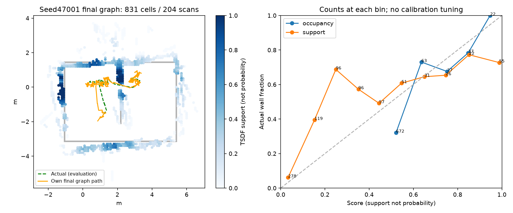

# egomap48 — 최종 graph 오프라인 성능 (실행 전 등록)

2026-10-08 사용자 지시. 기준21582623, PR405 DRAFT. 물리·렌더·모델 호출0.
egomap47 seed47001의 봉인된 own frontend-ledger/poses로 마지막 graph를 계산한다.
원본 `/Users/changmin/projects/ugrp/outputs/navfn-start-recovery-v1/new-seed`는 수정하지 않는다.
새 raw `/Users/changmin/projects/ugrp/outputs/graph-runtime-v1`; GT는 최종 계산 봉인 후 채점만.

순서: 문서/드라이버 커밋→배타 timing 잠금→기존 최종 graph cProfile1회(30분 상한 제거,
유한한204스캔 입력1회만)→상위 병목과 표준 원문 확인→기본off 옵션 구현·시험→고정 on/off 시간/동일성.
프로파일에는 후보수/정합/field 생성/최적화·LSMR/중복 계산과 노드·엣지·nfev를 기록한다.
이미 Jacobian sparsity+LSMR를 쓰므로 단순히 새 희소 solver를 추가했다고 주장하지 않는다.
결과 동일성 우선: 출력 전체 JSON 직렬화 SHA 비교, 지도·pose·constraint 최대차도 기록.
byte 동일 실패 시 pose≤1e-12·map log-odds≤1e-12/셀집합 완전 동일을 보조 수치 기준으로 보고하고
byte 동일이라 부르지 않는다. 이를 넘으면 가속 미채택. 정합/판정 문턱 변경0.

최종 graph는 egomap46 B와 별도 표: **덮음≥80% AND 영역P≥63.6%** 그대로,
R/RMSE·전체칸·관측영역 칸/벽표본 분모 포함. 새 실행/확증 아님, 동일 녹화 사후 계산.
egomap47 HOST_ERROR를 소급 완료로 바꾸지 않는다. 누락된 마지막 GT1개는 평가 제외를 명시.
360초 예상 wall/SIM은 측정 구간·외삽 가정과 graph/frame 중복 계산 차감을 명시한다.
프레임1.52배를 실제 물리 전체에 무조건 곱하지 않는다. raw 예산512MiB, ENOSPC=HOST_ERROR.
기존 가속도 포함하는 조건은 별도 표기. 새 의존성/venv0. 바뀐 모듈 시험만, 초록 후 커밋/push.
단계 사이 supervisor 확인, 잠금 점유 시 대기, 다른 프로세스/브랜치 수정0. TensorBoard 생략 유지.

## 프로파일·선택 (구현 후 동일성/시간 측정 전)

기준 cProfile1회 완료36.756초, 204 scans+21 submaps=225 pose 노드, 402제약(내부398+loop4).
정합3751회28.559초(77.7%, field 생성 포함), probability field3623회6.550초,
distance field64회0.150초. make_submaps1.811초, legacy/robust rebuild각0.893/0.906초.
legacy optimize0.084초/nfev6, switchable optimize0.169초/nfev12;
LSMR16호출 누적0.143초. 최종 graph 한 번이30분인 것이 아니라 전체실행30분 상한이 마지막 계산을 잘랐다.

선택 `graph_acceleration=match_cache_v1` 기본off:
- [Cartographer ConstraintBuilder2D](https://github.com/cartographer-project/cartographer/blob/master/cartographer/mapping/internal/constraints/constraint_builder_2d.cc)
  151–171 `DispatchScanMatcherConstruction`은 submap matcher를 재사용한다.
- [PoseGraph2D](https://github.com/cartographer-project/cartographer/blob/master/cartographer/mapping/internal/2d/pose_graph_2d.cc)
  292–378은 새 node/완성 submap에 제약을 추가하고 기존 제약을 유지한다.
- [SciPy least_squares](https://docs.scipy.org/doc/scipy/reference/generated/scipy.optimize.least_squares.html)의
  jac_sparsity/LSMR는 이미 사용 중. solver·수렴 허용오차·초깃값은 변경하지 않는다.

우리 RBPF의 과거 lineage는 바뀔 수 있으므로 ID만 캐시하지 않는다: **submap grid/resolution/선분**,
**scan 선분/initial relative pose/모든 GraphOptions**의 정확한 내용이 같을 때만 정합 결과를 재사용한다.
해시/키 불일치는 재계산; 후보 필터·검색 범위·수락 기준 불변. submap별 occupied/확률/거리 field 재사용,
성공과 거부 모두 캐시, 반환 deep-copy, 로봇별 별도 인스턴스. LRU8192쌍/64fields는 메모리 상한이며
eviction은 재계산만 유발하고 결과는 바꾸지 않는다. 최적화 자체/field 외 그래프 재구축은 그대로.
원문 전략의 독립 Python 구현; 외부 코드 복사/새 solver/venv0. 기본off는 기존 분기로 동작.

동일성 검증은 최종 graph off/cold-on/repeat-warm-on 모두, warm은 같은 입력 재계산의 상한 이득으로만 표기.
기록된35회 graph 호출에서 반복 입력 수를 별도 감사해 warm 최선값을360초 전체 속도라고 주장하지 않는다.

## 결과 — 가속과 동일성

사전등록 `a72a1cc2`, 가속 설정 고정·실행 `a715e81f`.
`SelfWallMemory(..., graph_acceleration='match_cache_v1')` 또는 로봇별 `self_graph_cache.install`로 켠다.
기본off, 기존 `scalar_rays_v1`과 조합 가능; 지도/정합/제어 문턱 변경0.
잠금 하 순차 1회씩 측정(통계적 속도 확증 아님), 물리·렌더·모델 호출0.

| 최종 graph 조건 | wall초 | off 대비 | 정합 재계산 | probability/distance field 생성 | graph/grid 파일 |
|---|---:|---:|---:|---:|---|
| off (프로파일 없음) | 42.354 | 1.000× | 3,751 | 3,623 / 64 | 기준 |
| match_cache 최초 | 33.663 | 1.258× | 3,751 | 21 / 17 | byte 동일 |
| 같은 입력 cache 재사용 | 2.838 | 14.923× | 0 | 0 / 0 | byte 동일 |
| scalar_rays + match_cache 최초 | 31.641 | 1.339× | 3,751 | 21 / 17 | byte 동일 |

프로파일의36.756초와 별도 off시간42.354초는 다른 단일 측정이다. cProfile 시간을 속도 분모로 섞지 않았다.
cache warm은 동일 입력 재요청일 때만 해당. 35회 실제 online graph 입력을 복원해 **47,584쌍 중31,621쌍(66.45%)**이
동일 입력이었음을 확인했다(모든 submap cells 원기록과 byte 동일). 마지막 offline graph까지 포함하면
51,335쌍 중34,342쌍(66.90%), field요청427개 중299개 재사용. 변경된 RBPF lineage는 실제로 캐시 미스로 처리된다.
`results/reuse-audit.json`에 시각별 수를 보존했다. 후보 생성 수/순서, 수락4건·switch억제3/유지1건은 변하지 않는다.

| 동일성 범위 | 결과 |
|---|---|
| 최종 graph.json / grid.json 전체 파일 | profile-off, timing-off, cold, warm, combined 모두 byte 동일 |
| pose / log-odds / constraint 최대 차 | 각각 0 / 0 / 0 (허용오차 경로 불필요) |
| 첫30초 141개 제어 출력·지도·경로 누적 | off/on SHA 동일, 실제 원기록 trace141/141 동일 |
| canonical graph SHA256 | `dd2c4b878b05038513fa82994879c1b0ab268c2ca06b118bbdf7ab1244f04145` |
| canonical grid SHA256 | `86dfddfbcd18e65c8403d619c71a6932d15ecf6b581afb242120b5265f577625` |
| 첫30초 누적 SHA256 | `af0969c41610a963723a99f281efd032a48b5e7018d0613bba84d158333a4b69` |

## 원래 기준 채점 — 조건 합산 없음

egomap47 녹화의 마지막 graph만 오프라인으로 완성했다. 취득 상태 **HOST_ERROR / HOST_BUDGET_30_MINUTES**는 그대로다.
마지막 pose1개는 GT가 저장되지 않아 경로 오차에서 제외(1,790/1,791개); GT는 시작 프레임 정렬·채점에만 사용했다.
아래 off/on 최종 graph 수치는 동일하다. egomap46 B는 다른 seed의 DEV1이므로 인과 비교·확증으로 합산하지 않는다.

| 조건 | seed / SIM초 | 영역 P / R | 덮음(전체329벽표본) | 점유칸 / 스캔 | 시야 벽표본 | 벽 RMSE | 경로 RMSE / 종료오차 | occupancy ECE 진단 |
|---|---|---|---|---|---|---|---|---|
| egomap46 B 완료 | 46001 / 360 | 71.6%(192/268) / 74.3%(130/175) | 72.3%(238/329) | 683 / 203 | 175/329 | 0.447m | 0.211 / 0.157m | 0.0891 |
| egomap47 당시 frontend | 47001 / 360 | 73.3%(178/243) / 67.2%(117/174) | 69.6%(229/329) | 843 / 204 | 174/329 | 0.639m | 0.230 / 0.490m | 원기록 보존 |
| egomap48 최종 graph off = on | 같은47001 녹화 | 72.4%(176/243) / 66.7%(116/174) | **69.9%(230/329)** | **831 / 204** | **174/329** | **0.626m** | **0.218 / 0.464m** | 0.1766 |

egomap46 B와 최종 graph 모두 **덮음≥80% 실패, 영역P≥63.6% 통과 → 1/2, 전체 미달**.
전체 점유칸 precision은40.7%(영역 precision과 분모 다름), support score gap0.1495.
log-odds/TSDF support를 검증된 벽 확률로 표현하지 않는다. 현재 가속은 품질 개선이 아니라 동일 결과의 계산 단축이다.
이동9.429m·지나간 footprint면적2.540m²·문 통과1·hold111/1790(6.20%)·접촉0·B미도달은 원실행과 동일.
검출기/경로 재튜닝0. 남은 실패: 관측하지 못한 벽과 거짓 점유가 남아 덮음 기준 미달.

## 360초 예상 wall/SIM — 측정과 외삽 구분

egomap47의 프레임 가속1.524×(29.222→19.179초/30SIM초)에 이번 캐시를 함께 켠 새 단일 비교는
**31.548→19.474초, 1.620×**였다. 전체141프레임 출력동일. 두 배수를 곱하지 않는다.
이 중 graph inclusive5.171→3.222초를 제외한 나머지는26.377→16.252초(비율0.61615).

360초 모델은 실제35회+최종1회 입력 규모를 쓴다. 최종 graph의 정합 시간/쌍을 전체쌍(off51,335/on미캐시16,993)에,
비정합 시간은 scan수에 선형 외삽해 graph합계 **619.09→159.84초(추정)**를 얻었다.
기존 총wall1802.37초에서 graph를 뺀 잔여 중 물리·렌더처럼 가속되지 않는 몫을 H로 분리했다.
`T_on = H + (T_off - G_off - H) * 0.61615 + G_on`.
중단된 마지막 graph가 이미 쓴 시간은 불명이라 완료 baseline을1802.37–1844.72초로 두었다.

| 360SIM초 조건 | 예상 wall초 | wall/SIM | 성격 |
|---|---:|---:|---|
| 기존 off 취득 | 1802.37 | 5.01 | 실제 기록, 마지막 graph 중단 |
| off 최종 계산까지 | 1802–1845 | 5.01–5.12 | 마지막 계산 중복 포함 여부 범위 |
| 결합 가속, 잔여 고정 몫0% | 889–915 | 2.47–2.54 | 낙관적 비용모델 |
| 결합 가속, 잔여 고정 몫25% | 1002–1033 | 2.78–2.87 | 민감도 시나리오 |
| 결합 가속, 잔여 고정 몫50% | 1116–1150 | 3.10–3.20 | 민감도 시나리오 |
| 결합 가속, 잔여 전부 고정 | 1343–1385 | 3.73–3.85 | graph만 가속되는 비용모델 |

이는 **물리 전체 재실행 검증도 신뢰구간도 아니다**. 정합점 수·field 크기·CPU 부하 변화, 렌더/물리 비중이 미측정이며
선형 비용 가정이 맞지 않으면 이 폭 밖일 수 있다. warm14.923배를 모든 graph에 적용하지 않았다.
요청대로 물리0, 추가 검출 개선0. 다음 작업은 감독의 별도 쓸모 시험 지시를 따른다.

## 재현·검증·보존

- 소스: `code/profile_graph.py`(cProfile1회), `benchmark.py`(잠금·순차 off/cold/warm/combined +30초),
  `audit.py`(기록35회+마지막 입력중복), `report.py`(봉인 후 GT채점), `performance.py`(동일성·외삽).
- 시험: `test_self_graph_cache.py`, `test_self_pose_graph.py`, `test_self_wall_robust.py` **36 passed**.
  동일 입력 재사용/입력 변경 무효화/다른 로봇 차단/LRU퇴출/return 복사/기본off/메모리 연결 검사 포함.
- raw: `/Users/changmin/projects/ugrp/outputs/graph-runtime-v1`.
  `off-profile/cpu.prof`, `top.txt`, 각 조건 graph/grid/stats, `benchmark.json`, `reuse-audit.json`, `performance.json`.
  SHA·환경·입력 manifest는 `results/validation.json`. 원 녹화/4개 사용자 미추적 파일/다른 worktree 수정0.
- 그림1장<1MiB. 기존 egomap47 영상은 원위치 유지(새물리/새영상 아님).
  잠금은 측정 때만 acquire→release, 프로세스 종료 확인. PR405 DRAFT·병합0, TensorBoard 생략.
