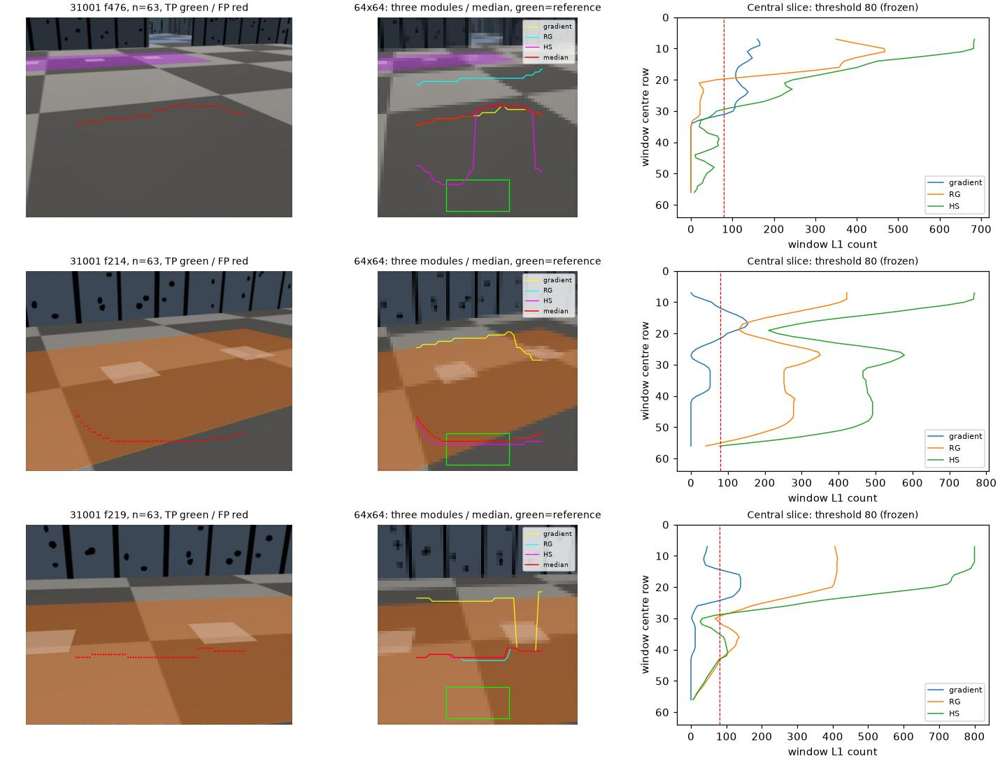

# egomap40 — Lorigo 창 히스토그램 경계

2026-10-08, PR405 DRAFT. 오프라인만, 물리/렌더/모델/잠금0. 기본off, 과거 결과 보존.
조사 시작 06:54 KST, 아래 비교·선택은 코드 변경과31001 재생 전에 기록했다(30분 이내).
TensorBoard 생략 유지. raw `outputs/lorigo-window-contact-v1`(기본 checkout 절대경로).

## 원문 비교와 선택

|방법·원문|원문 핵심/검증|우리 장면 적합성·한계|이번 결정|
|---|---|---|---|
|[Lorigo/Brooks/Grimson, IROS1997 §2.2–2.3,3.5](https://people.csail.mit.edu/brooks/papers/final-iros.pdf)|64×64,20×10창의 gradient/RG/HS histogram을 각 slice 하단창과 L1 비교. 세 경계 median. 실제 로봇200시간 이상 기록.|학습·정답·DR 불필요. 창 통계는 얇은 선 영향이 작고 normalized 색은 회색 밝기 변화에 불변. 넓은 바닥 패턴·그림자 오검출은 원문 자체의 한계; 무채색 기둥과 바닥을 색만으로 구별 못함.|**선택**, 세 모듈+median까지 구현. 색 모듈만 골라 쓰지 않음.|
|[Delage/Lee/Ng, CVPR2006 §3–4](https://ai.stanford.edu/~ang/papers/cvpr06-3dreconstructionindoor.pdf)|바닥 chroma/열별 경계/소실점 방향 DBN. 약50특징 logistic regression+EM,48사진8건물 교차검증.|연결된 경계를 전체적으로 추론해 얇은 선에 유리. 우리 평면/직교 가정은 맞지만 학습 라벨·학습된 파라미터가 없고 다색 바닥도 논문의 실패 사례.|이번에는 미구현. pretrained 값 없이 임의 DBN을 원문 재현이라 하지 않음.|
|[Lee/Hebert/Kanade, CVPR2009 §3–6](https://publications.ri.cmu.edu/storage/publications/pub_files/2009/6/CVPR.2009.pdf)|Manhattan+단일 바닥/천장, 선분 orientation map과 유효 실내구조 가설 탐색.54사진 평가.|평평한 합성 색에도 선분은 존재. 그러나 경기장 낮은 벽과 천장 없는 장면, 테이프/체크 선이 구조선을 압도해 Indoor World 가정이 약함.|이번에는 미구현.|
|[Pears/Liang/Chen, EURASIP2005 §1–4](https://link.springer.com/content/pdf/10.1155/ASP.2005.2250.pdf)|near-pure translation에서 reciprocal-polar 정류·상관·정현파 적합으로 바닥 homography, virtual parallax로 높이 분리. 색/모서리/텍스처 사용.|바닥 무늬 자체가 아니라 평면 운동을 검증할 수 있고 카메라 보정 있음. 제자리 회전·DR 오차·균일색/반복 체크 대응점 모호성·약한 시차는 별도 해결 필요.|다음 후보로만 보존. 이번에 추가 구현하지 않음.|

Lorigo 선택 이유는 현재의 픽셀 bin 밖1–2px 선 문제를 **공간 창 분포 비교**로
직접 검증할 수 있고, 다른 후보와 달리 새 학습/다중시점 자세 추정 없이 적용 가능하기
때문이다. 창 기반이라고 체크의 색 비율 변화/영역 전환까지 해결된다고 전제하지 않는다.
논문 저자의 PDF 원문·수식·그림을 확인했다. PDF는 outputs에만 보존하고 해시를 남긴다.
Pears2001 링크는404여서 대신 같은 저자의2005 원문을 읽었다. 공개 원본 코드는
확보하지 못했으므로 논문 재구현이며 원본 실행파일과의 동등성을 주장하지 않는다.

## 실행 전 사전등록

- `contact_rule=lorigo_window_v1`, 기본off. egomap38/39 값과 기본 검출 경로 변경0.
- **검출 P≥.90 AND R≥.50**. 31001 개발1회 → 설정/코드/결과 해시 동결 커밋
  →32002 예측1회·채점1회. 두 자료는 이미 본 자료라 독립 확증으로 부르지 않는다.
- 문턱 사후변경0. 실패하면 원인1줄과 추천 다음 방법만 기록하고 종료.
- 기존96열 평가·GT차체 .15m precision 및 잠재가시 같은열 recall 유지.
  지도 원본47/64삽입 시각·추정pose 고정, RBPF재추정0, multiview/segments off.
  off/on 모두 저장된 정합후 공분산에서 confidence 재계산(egomap39와 동일).
- 지도 영역P/R·전체P/coverage·RMSE·점유칸을 egomap34/38/39와 나란히.
  coverage는 전체329벽 표본, 영역은119/146표본. 칸수와 검출점수 함께 기록.

### 고정 수치 및 원문 미명시 부분

|항목|이번 고정값/출처|
|---|---|
|영상/창/이동|64×64,20×10,가로·세로1px,중심x=11번째 화소,45slice: 원문§2.2|
|특징|blur gradient magnitude / normalized R,G / HSV H,S, S<3.3% 무시: 원문§2.2|
|histogram/거리/결합|32bin(Fig3/[0,31]),count L1,두 색채널은합,세 경계 median: 원문|
|참조 갱신|**현재 프레임·각 slice의 하단창**. 이전 시간 큐/픽셀 bin 판정 사용0: 원문|
|L1 문턱|각 모듈80 count, strict >. 원문 수치 미명시, 레포에 기존 창 L1 기본값 없음. 기존 외형검출 count80 수치를 변경하지 않고 신규 L1 의미에 고정; 원문 최적값/동등 파라미터라 주장하지 않음.|
|미명시 전처리|기존 Gaussian5×5(sigma0)·INTER_AREA resize·보정/유효영역. RG=R/(R+G+B),G/(R+G+B);0합은0. HSV는OpenCV. gradient는중앙차분,이론상8bit 최대255√2로[0,31] 고정.|
|미명시 경계 대표점|첫 변화창 중심행(top+5). 픽셀별 edge 재탐색·사후 위치 보정 없음. 원문은 수직 대표점 위치를 명시하지 않아 중심 규약으로 사전 고정.|
|우리 카메라 어댑터|원래 undistort/FOV/FK 유지. 각 slice 하단의 완전한 유효20×10창; 자기 차체와 겹치면기권. 위로가다무효창이면중단. 검은 RGB 자체는 invalid가아님.|
|출력|45slice를기존96열에nearest 대응;좌우 미지원은기권. 미검출모듈은상단한계(0행),median0이면기권. 기존positive depth/4m/면 연결 유지.|

gradient blur 외에 색 영상을 추가 smoothing하거나 morph/새 외형모델을 넣지 않는다.
얇은1행이 완전히 다른 색이어도20×10창에서 두채널 L1 변화의 상한은80count라
strict>80 규칙만으로 장애물이 되지 않는다(단, 창 전체 분포나 주변행이 바뀌면 다르다).
이는 단일픽셀 veto를 제거하는 구조 확인이며 실제P/R 보장이 아니다.

예상 위험: 낮은64행 해상도와 창중심 대표점의 투영 편향, 큰 체크 타일의 혼합비 변화,
같은색 벽/검은 기둥 미검출, 하단에 이미 장애물이 있으면 잘못된 참조, 창45slice의
측면coverage 손실. 보정값/문턱을 결과 후 움직이지 않는다. 로봇 known RGB/보정만
예측에 사용, GT는 예측 봉인 후 평가에만. ENOSPC=HOST_ERROR;원본 삭제0.

## 31001 개발 결과 → 설정 동결

사전등록 `b5459a2d`(06:58:42 KST, 조사시작부터5분 미만), 구현 `1266adda`.
바뀐 모듈+기존adapter/Ulrich의3시험 파일 **15 passed**. RGB예측891프레임1회,
GT평가1회, 개발 후 설정 변경0. 이 결과와 `freeze.json`을 커밋한 뒤32002를1회 실행한다.

|31001 조건|검출 P/R|검출점|영역 칸 P/R|전체 칸 P/coverage|점유칸|벽RMSE m|
|---|---:|---:|---:|---:|---:|---:|
|paired off|94.3/57.8%|53,232|57.5/52.1%|39.2/37.7%|357|.762|
|Lorigo on|16.2/9.3%|55,492|미정/0%|미정/0%|0|미정|

검출 관문 **P/R 모두 실패**, 문턱변경0. 55,492점 중8,992점 정확,
잠재가시81,898열 접점 중7,588을 회수했다. 검출은891프레임 모두 있어 초기학습
대기 문제가 아니다. 47삽입시각에서53면이 나왔으나 **53/53의기존confidence=0**:
창중심은실제픽셀경계와일치하지않아대비·선명도인자가0이된다. 같은confidence
어댑터를사전에고정했으므로결과후새신뢰도로교체하지않는다. 지도P/R실패와별개로
검출점P/R자체도미달이다. 빈지도precision은0이나100%가아닌미정으로표기한다.

거짓점46,500개는기존평가용분류에서체크바닥37,864(81.4%),색구역8,631(18.6%),
기타5,테이프0. 이규칙의'체크바닥'은회색바닥면을포함하므로모두실제체크경계
픽셀이라는뜻은아니다. egomap39와**같은**f476/214/219에서RGB·모듈경계·L1곡선을
저장했다. f476은gradient+HS가실제벽보다먼저바닥변화에응답하고, f214는색구역
변화를RG+HS가동시에잡는다. 얇은선synthetic시험은통과해도넓은바닥분포변화는남는다.

원본 관문(이번에재추정하지않음):901RGB→초기대기10→891검출→844이동보류→47삽입.
bootstrap1/improved22/low_overlap8/high_residual14/search_boundary2,
거부후삽입24·거부재표본0. `gmapping_range_v1`·`insert_selective_v1`은on이다.
이번47시각·카메라·추정pose는그대로이며새감소는신뢰도가중치이지이동관문이아니다.
