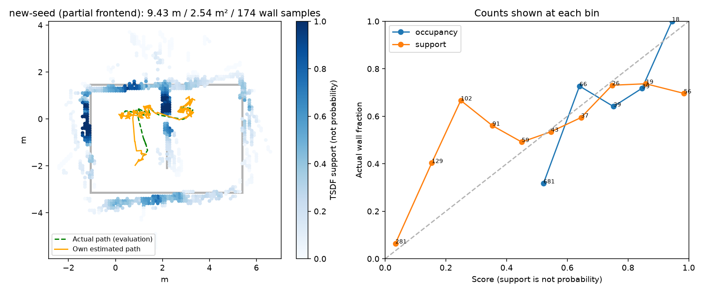
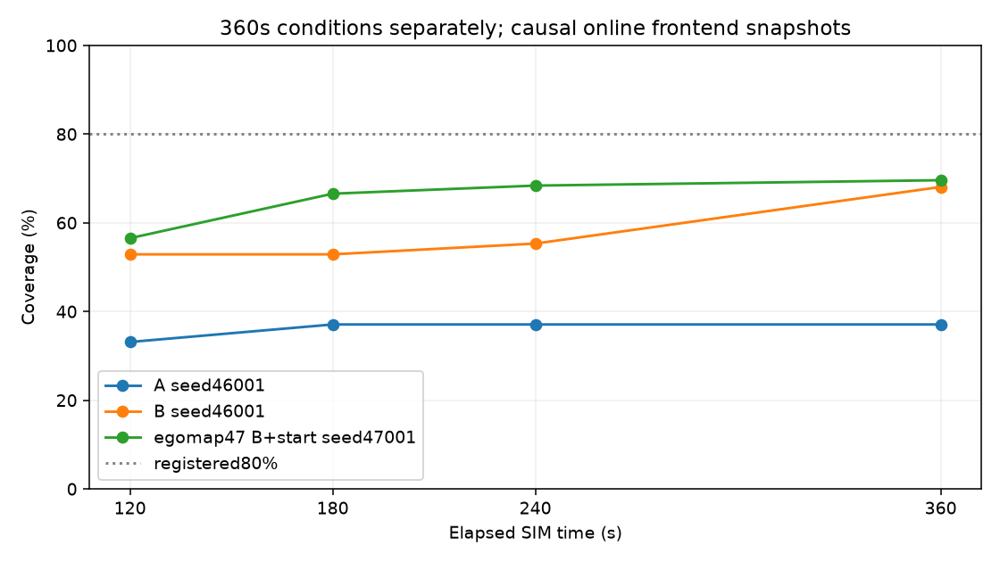

# egomap47 — NavFn 시작 셀·지역 회복 (실행 전 사전등록)

사용자 지시2026-10-08: egomap46 A의 경계561칸/후보4개가 원본 NavFn에서는 도달 가능하나,
현재 pose→첫 격자 중심1.784cm 연결의 별도 footprint 검사로 전부 거부된 이식 차이를 고친다.
기준 소스818c611d, PR405 DRAFT. 결과 후 문턱 변경·추가 물리·검출기 튜닝0.

## 원문 대조와 변경 범위

|항목|원문|기존 어댑터|새 옵션 `navigation_start=navfn_recovery_v1`|
|---|---|---|---|
|시작 셀 비용|clearRobotCell→FREE_SPACE 후 setCostmap|clearRobotCell 누락|계획용 cost 배열의 **현재 셀1개만** free; 자기 지도/센서 증거는 불변|
|시작 inflated/lethal|시작 좌표 범위 검사 후 clear; footprint 기반 전역 시작 거부 없음|현재 pose→첫 중심 sweep 실패 시 전체 경로 없음|추가 전역 sweep 거부 제거; 목표/경로/unknown·inflation 기준 불변|
|실제 움직임|로컬 controller/behavior collision 검사|로컬 projection·pulse 검사 있음|그대로 유지; 미래 footprint를 free로 지우지 않음|
|계획 실패|BT contextual clear→재계획; general clear→spin→wait→backup, retries6|frontier 사전 plan 실패 즉시 blacklist·소진|목표를 navigation action으로 먼저 넘겨 기존 회복기 재사용; 회복 소진 뒤 blacklist|

원문 확인:
- [Nav2 NavFn, pinned235fc5ce](https://github.com/ros-navigation/navigation2/blob/235fc5ce55bdf94d9be360fdbca39d89dc0e4f74/nav2_navfn_planner/src/navfn_planner.cpp):
  로컬 `third_party/mapfree_navigation_unknown/navigation2/nav2_navfn_planner/src/navfn_planner.cpp`
  221–252,381–439,523–528. 시작 셀만 clear하며 이 단계에서 사각 footprint를 적용하지 않는다.
- [ROS NavfnROS](https://github.com/ros-planning/navigation/blob/noetic-devel/navfn/src/navfn_ros.cpp):
  로컬 `third_party/mapfree_navigation/navigation/navfn/src/navfn_ros.cpp:169–176,228–243,370–429`도 동일.
- [Nav2 Jazzy 기본 BT](https://github.com/ros-navigation/navigation2/blob/jazzy/nav2_bt_navigator/behavior_trees/navigate_to_pose_w_replanning_and_recovery.xml):
  12–25 contextual clear·retry1,35–43 clear→spin1.57rad→wait5s→backup0.30m/0.15m/s, 전체retry6.
  저장된 원문은 `third_party/mapfree_navigation_recovery/navigation2/nav2_bt_navigator/behavior_trees/`
  `navigate_to_pose_w_replanning_and_recovery.xml`; 기존 SOURCES.json의 SHA/Apache-2.0 보존.
- [explore_lite](https://github.com/hrnr/m-explore/blob/26d4183a4fe119a0f83685ce3e06370c0c4d21d9/explore/src/explore.cpp):
  목표 전송 후 navigation action의 ABORTED에서 blacklist. 전역 경로의 시작 raster 연결 실패를
  모든 frontier의 즉각적인 실패로 처리하는 분기는 원문에 없다.

새 옵션만 원문 회복 순서(clear/spin/wait/backup)를 쓰며 기존 egomap29 순서(clear/spin/backup/wait)는
off에서 보존한다. 거리·속도·spin·재시도·시간 수치는 이미 존재하는 값이다.
ROS 서비스 대신 자기 navigation layer clear/rebuild, twist 대신 기존 보정 pulse 어댑터를 사용한다.
기존 Costmap2D 변환/격자 해상도, NavFn native kernel, frontier 비용·최소 크기, 센서/지도/RBPF 설정은 바꾸지 않는다.
주어진 목표의 정확한 셀 사용을 유지하며 Nav2 tolerance0.5m의 추가 목표 탐색은 이식하지 않는다.
새 venv/외부 라이브러리 없음. 기본off는 기존 factory로 즉시 위임하고 trace bytes 검사로 고정한다.

## 순서와 고정 기준

1. 이 README 커밋 → 새 옵션·바뀐 모듈 시험 → egomap46 A의 저장된 소진 snapshot과4개 후보를
   같은 pose/costmap에서 off/on 비교. 원본736프레임 byte 일치로 얻은 snapshot이며 GT 불사용.
   **off0/4·on4/4 계획 반환**, 입력 costmap 불변, 실제 충돌검사 유지가 물리 진행 관문.
   움직이지 않는 오프라인 자료에서 회복의 물리 성공을 주장하지 않는다.
2. 소스·설정 동결 커밋/push → 잠금 null 확인/원자 acquire → 새 seed**47001**,
   **egomap46 B + 새 옵션**,360 SIM초 DEV **1회**. 기존180초/egomap46 A/B와 합산하지 않는다.
3. **덮음≥0.80 AND 영역P≥0.636** 그대로. 각 분모·칸 수·실제 시야 표본 수/329,
   벽 RMSE·영역R·이동/면적·hold·문 통과·B/접촉·삽입/거부 이유도 기록한다.
   120/180/240/360초 덮음은 각 시점 이전 snapshot만, 최종 graph 지도와 구분.
   조기 실패 뒤 시점은 결측. 실패해도 재튜닝/추가 실행0.

조건: tape_v1·SEARCH·servo_stiffness real_v1·rotL_v1·RBPF100·egomap27 wide·switchable·
wall_confidence·TSDF support·public_ros_v8·yamauchi_cycle_v1 불변.
egomap46와 동일하게 기존 local hold는 유지하며, 품질/σ는 실행 전체를 중단하지 않는다.
따라서 strict log-only dev_light로 오인하지 않는다. GT는 기록 봉인 후 평가에만.
물리 한 번에 하나, agent_lock/ugrp_session/sim_cli workflow. S2 잠금 중에는 대기.
기존 호스트 상한30분, raw예산1GiB, 여유10GiB 미만 시작 금지, ENOSPC=HOST_ERROR.
freeze·모델 호출0. push 장애 시 로컬SHA로 진행하되 마지막 재시도. Co-Authored-By Codex, 병합 금지.
원본·4배속 영상: `/Users/changmin/projects/ugrp/outputs/navfn-start-recovery-v1/`.
단계 사이 지정 supervisor 파일 확인. 과거 egomap46의 “다음 실행 없음”은 해당 단계 지시이며,
이번 사용자 egomap47의 새1회 실행 승인을 따른다. TensorBoard 생략 유지.

## 실행 전 오프라인 결과

사전등록 `0ff2b9cc`. egomap46 A의 경과149.0초 자기 snapshot(원본736프레임 일치)은
SHA256 `ca244d2332d3b040bfee2fd6cf392144faab0eb5f492afaf95984c811a50a2af`.
작은 테스트 fixture `tests/fixtures/navfn_start_costmap.npz`도 같은 바이트다.

|후보 크기(칸)|기존 경로 점 수|새 옵션 경로 점 수|입력 costmap 변경|
|---:|---:|---:|---|
|175|0|124|없음|
|169|0|95|없음|
|110|0|180|없음|
|72|0|63|없음|

**계획 수락0/4→4/4**, GT/물리0. 추가한 전역 시작-sweep 거부만 제거했으며 그 sweep의 충돌 결과는
4개 모두 여전히 false다. 지역 충돌 검사를 무시한 물리 통과로 해석하지 않는다.
시험: 시작 inflated/lethal 비용1셀만 계획 복사본에서 clear, off A/B trace bytes 동일,
지역 충돌 시0속도·context clear, 계획 실패 시 회복 후 blacklist, frozen B 번들 차이 검사.
`tests/test_active_navfn_start.py tests/test_active_frontier_cycle.py`: **17 passed**.
기존 소스 수정0, 새 모듈 factory 옵션off는 기존 클래스로 직접 위임한다.
구현 연결은 `harness/active_navfn_start.py`; 네이티브 NavFn/비용/클러스터와 v8 파라미터는 재사용.
원본 대비 변경은 위 표의 adapter 경계이며 목표유지·도착관측·B의 progress-failure 관측 주기는 그대로다.
clear/spin/wait/backup은 기존 `.30m/.15m/s`, `1.57rad`, `5s`, `retry6`를 사용한다.
[재생 수치와 입력 해시](results/replay.json). 설정·소스 해시는 `freeze.json`에 실행 전 고정한다.

## DEV 결과 — 새 seed47001, 1회 (재실행 없음)

실행 소스 **c37f2b23b74d044163b43e139599207f248ae3c1**, 기록360.0 SIM초/1801 RGB.
마지막 프레임의 graph 정합 중 **HOST_BUDGET_30_MINUTES**: HOST_ERROR, 최종 graph 미완료.
1802.37 host초(정리 포함), 물리 새 실행1·모델0·freeze0, 잠금 해제 확인.
1790개 완성 제어 기록/1800개 GT 평가 기록; 마지막 pose의 대응 GT1개는 채점 제외.
아래 egomap47 값은 **partial frontend**이며 egomap46의 completed graph와 동급 완료 결과가 아니다.

|조건 (각 n=1)|seed/예산|지도 view|덮음 (전체329표본)|영역 P/R|영역 P 분자/칸·R 분자/시야표본|전체 점유칸|벽 RMSE(m)|문 통과|hold|
|---|---|---|---|---|---|---:|---:|---:|---:|
|egomap46 A|46001/360s|completed graph|122/329=37.1%|78.8/66.4%|67/85·71/107|285|0.503|1|59.6%|
|egomap46 B|46001/360s|completed graph|238/329=72.3%|71.6/74.3%|192/268·130/175|683|0.447|2|8.5%|
|egomap47 B+start|47001/360s|partial frontend|229/329=69.6%|73.3/67.2%|178/243·117/174|843|0.639|1|6.2% (111/1790)|

관문: 덮음≥80% **실패**, 영역P≥63.6% **통과**, 완료 조건도 실패 → **미통과**, 재튜닝0.
시야 표본174/329=52.9%, 전체 P39.7%; 영역 P만으로 전체 지도가 정확하다고 해석하지 않는다.
이동9.429m·footprint 합집합2.540m², 종료 위치오차0.490m/σXY0.102m=4.79σ,
경로 RMSE0.230m. B 자기 확인 경과65.8초, 실제 B 도달없음. 벽/로봇 접촉0/0.
문은 중앙 문을 경과103.6초에 오른쪽→왼쪽1회(팽창 footprint 여유0.0568m).
거짓 문 경로 시도31회는 남아 있다. 새 seed와 미완료 view 차이가 있어 개선의 확증 비교는 아니다.

소진 이벤트0. planner_failed27→context_clear22, 일반clear2/spin1/wait1/backup1;
회복 성공27, progress-no-progress11→blacklist11·다음 관측 주기, sensor sweep12/12 완료.
따라서 오프라인4/4 계획 복구와 실제 회복 분기는 작동했지만, 전체 덮음 목표 달성은 아니다.
삽입 수정on: 마지막 미완성 프레임 포함 검출·정합 결정1784개 중 motion_gate1580,
bootstrap1·정합수락118·low_overlap20·high_residual57·search_boundary1·insufficient_points7.
삽입204=1784−1580; 완성 제어1790개 중 검출선분 있음1783개. 원본 원장/실패 모두 보존.

|경과초|egomap46 A 덮음|egomap46 B 덮음|egomap47 덮음|egomap47 점유칸/삽입스캔|
|---:|---:|---:|---:|---:|
|120|33.1%|52.9%|56.5%|427/67|
|180|37.1%|52.9%|66.6%|662/114|
|240|37.1%|55.3%|68.4%|721/151|
|360|37.1%|68.1%|69.6%|843/204|

모든 곡선은 해당 시점 **이전 online frontend**만 사용; egomap47 360초 값은356.0초 snapshot.
360초 RGB는 존재하나 마지막 제어/graph 완료로 간주하지 않는다.
원인: 시작 연결 버그는 제거됐지만 시야가 전체 벽의52.9%에 머물고 자세/검출 잔차가 남았으며,
마지막 graph 재계산은 호스트 상한에 도달했다. 물리/문턱 변경 없이 계산 병목부터 확인한다.

[수치](results/comparison.json), [원본/소스 해시](results/raw.json), [영상 해시](results/video.json).
4배속90.05초·1801프레임·20fps, ffprobe와 전체 ffmpeg decode 통과:
`/Users/changmin/projects/ugrp/outputs/navfn-start-recovery-v1/wrist-map-4x.mp4`.

## 감독 추가 지시 — 오프라인 성능 진단 사전등록

17:2x/17:3x supervisor 지시: 물리 추가0. 봉인된 egomap47 **첫30 SIM초**를 같은
RGB·발행 명령/설정으로 재생하여 cProfile1회. 초기화/151 RGB 중141 제어 프레임이며 GT 입력0.
렌더링은 저장 JPEG 읽기만 하므로 렌더 시간은 **측정 불가**로 표시하고 실제 물리 wall/SIM과
재생 wall/SIM을 구분한다. 프레임별 검출/RBPF/삽입/graph/NavFn/관측회전 계산 및 칸/입자 수를 기록.
짧은 초기 구간만으로 후반 graph 비용을 단정하지 않으며 필요하면 저장 ledger의 크기별
동일 graph 호출을 별도 마이크로벤치로 기록한다. 속도 측정은 agent_lock null일 때만 잠금 하 수행.
측정된 상위1–2개 병목만 표준 캐시/벡터화 등으로 옵션화(기본off); 새 임계/해상도/관측주기 변경0.
채택 조건은 같은 재생의 지도·pose·행동 출력 **bytes 동일**, 아니면 수치 최대차를 공개하고 미채택.
물리 결과를 가속 결과로 바꾸거나 완료로 재분류하지 않는다.
