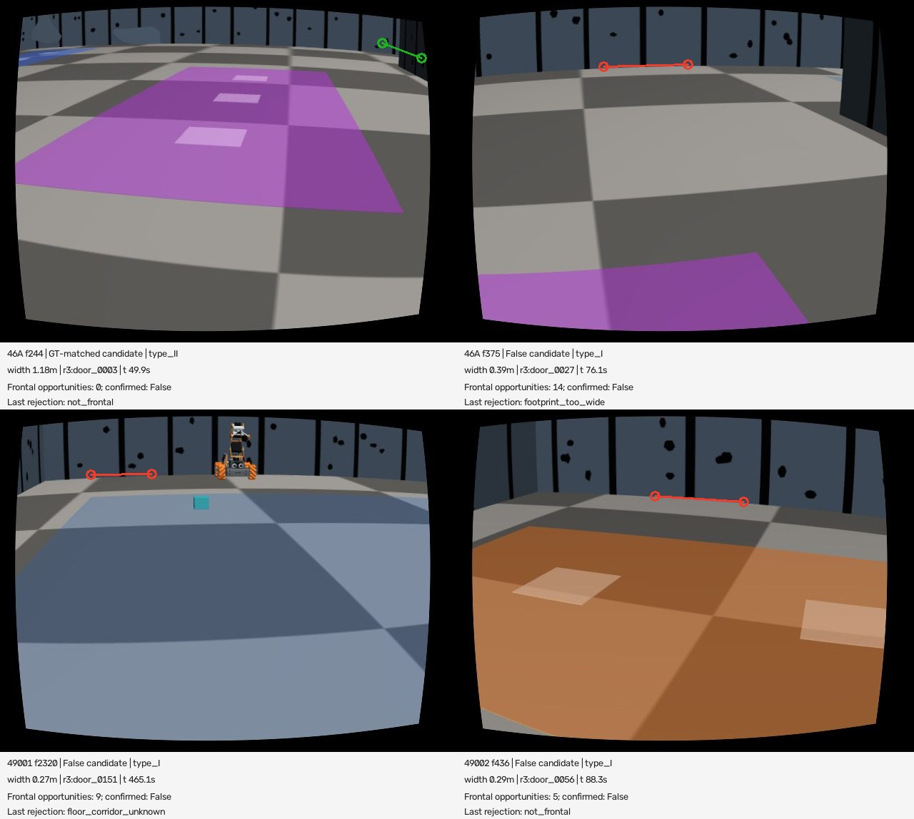
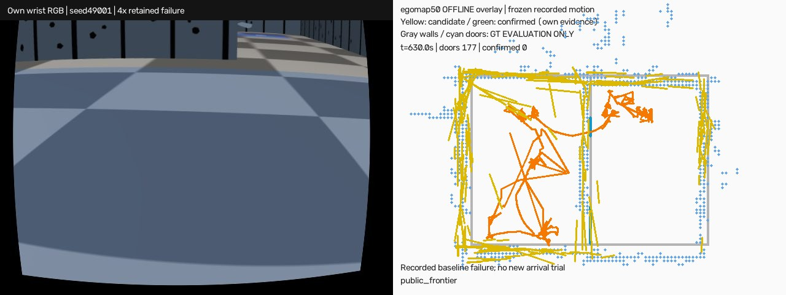

# egomap50 — 자기 문 후보·확인·문 경유 이동

2026-10-08 사용자 요청. egomap49 보고/소스 a7d41435를 먼저 완료했다.
검출기 egomap34·SEARCH·tape·rotL·RBPF/graph·360s 탐색·귀환 판정은 동결한다.
이번 결과는 기존 녹화의 오프라인 개발 진단이며 새 확증 자료가 아니다.

## 실행 전 등록

- 순서: egomap46 A/B(seed46001), egomap47(seed47001)을 개발 진단 → 설정 동결 커밋 →
  egomap49 seed49001–49006 각각 오프라인1회. 조기 중단2건도 제외하지 않는다.
  저장 자기 RGB 유래 선분·바닥 표본·자기 추정 자세만 입력. GT 문/카메라/경로는 출력 봉인 후 채점만.
- 검출 옵션 `door_detector=complete_points_v1`, 이동 옵션 `door_navigation=room_doors_v1`, 둘 다 기본off.
  원문 CP(Type I/II) + 폭/방향 검사, 중복 공간 연관, 다른 프레임의 정면 관측과 바닥 연결로 확인.
  문 이름·GT 좌표/방 구획을 제어에 전달하지 않는다. 자기 시작 좌표계·관측ID/시각을 보존한다.
- 원문 미명시 임계는 기존 own_gap_v1의 폭 .25–1.5m, 방향10°, 선거리 .15m,
  중복 중심거리 .25m를 사용한다. CP 접합 허용 .05m(기존 navigation 셀), 확인 정면10°,
  재관측 .05m 또는5°(기존), 문앞/뒤 .4m(기존 corridor), 로봇폭+.04m(기존 margin).
  확인 시점은 Xiang §4 Eq2의 문중심 법선1m 앞, 가까운 쪽·경로 가능한 곳을 선택.
  ray 자유 증거만으로 RGB 바닥을 봤다고 하지 않으며 **직접 floor 표본**이 양쪽에 있고,
  그 표본까지의 광선이 문 폭 안에서 연결됨을 요구한다. 현재 벽점이 통로를 막으면 확인 금지.
- 위상: 확인된 문을 cut한 관측 free 연결영역=지역 노드, 문=간선(Thrun).
  unknown은 방/간선 증거가 아니다. 미확인 문은 접근/정면관측 목표, 통과 간선으로 사용 금지.
  최종 B 목표는 보존하고 실패한 지역 waypoint만 blacklist한다. B→일반 frontier 전환은 별도 집계.
  360° sweep은 위치불확실(기존σ .15m)과 새 unknown 기대가 함께 있을 때만;
  그 외 목표방향 회전1회, 진행시간30s/충돌보호는 기존 그대로. 지도/운동 임계 변경0.
- 채점: raw 후보 발생 수, 공간 중복 병합 후 entity 수, 정면 확인 시점 기회 수,
  실제 확인 수; 후보/확인 P와 문 R. 거리 .25m·축10°·폭오차 .25m 이내 일대일 GT문 연관.
  중복 예측은 FP, 같은 문을 반복 보아 recall을 중복 계산하지 않는다.
  전체 GT문 분모와 관측 가능한 GT문 분모(양쪽 jamb가 같은 프레임 카메라FOV·4m·가림 안)를 모두 보고.
  평가 변환은 고정 출발 GT 변환만, 프레임별 GT 자세로 후보 위치를 고치지 않는다.
- **오프라인 관문(실행 전 고정):** egomap49 합계 후보P≥.50, 관측가능문R≥.50,
  확인문P≥.90·거짓확인0, 확인 TP≥1. 분모0은 미측정/실패. 6건 전부 표에 남긴다.
  개발에서도 같은 지표를 보고하되 설정 재튜닝0. fixed-pose replay는 새 시점 획득/실제 귀환 성공을 증명하지 못한다.
  옵션off 동일 bytes, topology/관측확인/mission보존 시험 통과도 필요.
- 관문 통과 때만 egomap49와 **동일 seed49001–49006 각1회** DEV, 탐색360s+귀환270s,
  B선언 resolved5프레임·추정거리≤.20m, GT차체중심 B안·거짓선언0을 egomap43 그대로.
  접촉·도착/6·귀환시간·회전시간비율·확인문P·B blacklist→frontier 횟수 보고.
  agent_lock/ugrp_session/dev_light, 한 번에 하나. 6회 예상3–6시간+잠금대기, 필요시 감독파일에 갱신.
  물리 이전엔 lock 불필요. ENOSPC=HOST_ERROR, 제외/재실행 없음. 실패 시 물리0·재튜닝0.
- 결과 raw `/Users/changmin/projects/ugrp/outputs/own-door-navigation-v1/`; 성공/실패4배속영상은
  실제 해당 결과가 있을 때만 만든다. offline overlay는 물리 성공 영상으로 표현하지 않는다.

## 참고 자료·원본 대비

1. [Xiang, Santos, Liu 2004, §2.1–2.2, §4.1 Eq2–4](https://www.scitepress.org/papers/2004/11358/11358.pdf),
   DOI 10.5220/0001135803700374. 원문 PDF를 내려받아 확인했다(web fetch403, 직접 다운로드 성공).
   연결 선분의 교점/가림 단절의 가까운 끝점(CP), Type I 두 CP와 Type II CP+수직선,
   폭·선방향·연장선 조건, 문중심 법선의 가까운 접근점을 채택한다.
   원문 레이저를 **동결 RGB 바닥투영 선분**으로 바꾸므로 CP는 가설이며 프레임 경계/먼 거리 끝점은 배제.
   원문의 open-loop 원호 접근 대신 기존 NavFn/RPP 충돌검사를 유지한다(메카넘·불확실 지도).
   후속 RGB 바닥 확인·시간 중복 병합은 좁은FOV/노이즈 제약의 명시적 추가, 원문에 있는 수치라고 주장하지 않는다.
2. [Thrun & Bücken 1996, Topological Maps §1–5](https://www.ri.cmu.edu/pub_files/pub1/thrun_sebastian_1996_8/thrun_sebastian_1996_8.pdf):
   free영역을 critical line으로 나눠 각 영역=노드/통로=간선으로 매핑한다.
   본 작업은 GVD 전체를 이식하지 않고 확인된 endpoint gap을 cut line으로 사용한다.
   아직 미관측 방을 임의 완성하거나 자기 지도 틈을 GT 문으로 대체하지 않는다.
3. [Bormann et al. 2016 공개 구현](https://github.com/ipa320/ipa_coverage_planning/blob/noetic_dev/ipa_room_segmentation/common/src/voronoi_segmentation.cpp),
   `segmentMap` L21–51: GVD→가지치기→거리극소→critical line→영역성장.
   완성 floor plan을 전제한 region segmentation이라 미관측이 많은 온라인 카메라 지도에 그대로 전체 적용하지 않는다.
   비교·구조 참고만, 코드를 복사하지 않음. package.xml은 LGPL academic/non-commercial, 상용은 IPA 문의로 명시한다. 새 의존성/venv 변경0.
4. 기존 탐색/회복·경로 원본은 egomap47 README 및 PR409에 pin된 NavFn/explore_lite/Nav2를 그대로 재사용.
   새 문 API는 자기 관측만, 다른 로봇 지도/배열 전송/모델호출0. 문 confidence는 확인 근거 점수이며 calibration된 확률 아님.

## 구현·오프라인 재생 경계 (개발 결과 열람 전)

`harness/own_door_memory.py`: `candidates`는 원문 §2 CP와 Type I/II, `floor_connection`은
직접 바닥 표본+광선/현재 벽의 확인 검증, `DoorMemory.observe`는 관측ID/시각·첫 기하 보존/중복 연관.
`harness/own_door_navigation.py`: `topology`/`door_route`는 cut→연결성→BFS,
`DoorNavigator.choose`는 Eq2 정면1m 접근/확인문 반대편 .4m 경유, `action_failed`는 최종 mission 보존.
`attach`/`attach_return` 두 옵션off는 받은 객체 자체 반환. 기존 receive에 명시적 opt-in hook만 추가했다.
GT/static 파일 import0, 로봇ID/프레임 중복 검사, loss 이전 own door snapshot 보존.
명시적 변경: range4m·FOV종단 CP배제·.05m 이하 선분 배제는 기존 카메라/격자 유효 범위;
CP 연결점은 .05m 격자 허용내 관측 끝점, 원문의 정확한 무잡음 교점 가정에 대한 수치 허용이다.

`code/offline.py predict`는 GT를 읽지 않고 저장 자기 자세/관측만 재생한 뒤 해시 봉인한다.
`score`는 별도 호출에서 출발 GT변환·실제 카메라·문으로만 평가한다. ray 가림은 벽만 모델링하므로
가시문 분모는 **잠재 가시성**이며 로봇/블록 가림 미모델링 한계를 함께 기록한다.
원래 graph 좌표 문 후보는 자기 map→odom 역변환만 적용한다. GT로 후보를 맞추지 않는다.
고정 경로에 없는 새로운 능동 확인 시점은 생성하지 않으며, 실제 회전 감소·귀환 도착은 미측정이다.
시험15개 통과(새 문10 + 기존 귀환5). NumPy 버전의 2D cross 제거는 스칼라 determinant로 대응,
수학/임계값 변경0. 기본off trace/입자/RNG 골든 byte 동일.

## 개발3건 완료 → 설정 동결 (egomap49 개봉 전)

|기록|프레임|off raw/병합|on raw/병합|on 후보TP·P|잠재 가시문R|정면 재관측 기회/개체|확인문|
|---|---:|---:|---:|---:|---:|---:|---:|
|46A|1791|9999/271|220/56|1 · 1.79%|1/1|49/11|0|
|46B|1791|27468/790|494/131|1 · 0.76%|1/2|38/12|0|
|47|1790|23767/815|625/166|1 · 0.60%|1/2|44/22|0|

세 개발 기록 모두 확인문0, 후보 정밀도 미달. 문턱/검출/연관 규칙은 변경하지 않는다.
개발 중 정책 단위검사에서 미확인 gap을 지나는 직접 B 경로가 확인을 건너뛰는 분기를 찾아,
그 gap의 정면 확인 시점을 우선하도록 수정했다. **검출·재생 결과에 영향0**, 추가 시험1개 포함16개 통과.
관문은 사전등록대로 egomap49 6건 합계에서 판정한다. 이6건도 과거에 관측한 DEV 자료이며 새 물리 확증이 아니다.
원본 후보와 비교 시 ID 재사용/pose drift로 멀어진 후보도 공간/축/폭 규칙으로 다시 병합했다.
동일 GT문을 가리키는 미병합 복제는 FP로 세므로 raw 검출 정밀도와 entity 정밀도를 혼동하지 않는다.

## egomap49 6기록 오프라인 결과 — 관문 미달, 물리0

사전등록 **4a03c66a**, 구현 **62dc3aaf**, 개발 후 동결 **e05c1b15**.
원본 RGB 유래 관측/자기 추정 자세 **11,966프레임**, 각1회 재생. 6건 모두 포함·제외0.
검출/확인/관문 임계 변경0. 잠금 획득·새 물리·모델 호출0. RBPF/지도 재추정 없이 저장 자세를 재사용했다.
기존 egomap49 삽입/거부 원장과 지도 품질 수치는 원본 그대로이며 이번 결과에 새로운 SLAM 개선을 주장하지 않는다.

|seed|프레임|기존 raw / ID / 공간병합|새 raw / 공간병합|새 후보 TP/N · P|잠재 가시문 R|정면 재관측 기회/개체|확인|
|---|---:|---:|---:|---:|---:|---:|---:|
|49001|3140|25836 / 334 / 826|810 / 177|0/177 · 0.00%|0/2|76/41|0|
|49002|3140|31715 / 368 / 938|859 / 182|0/182 · 0.00%|0/2|57/33|0|
|49003|169|754 / 45 / 72|23 / 10|0/10 · 0.00%|0/1|2/2|0|
|49004|389|1467 / 60 / 120|118 / 14|0/14 · 0.00%|0/1|9/2|0|
|49005|2656|27639 / 393 / 1036|679 / 164|1/164 · 0.61%|1/2|44/26|0|
|49006|2472|22270 / 327 / 765|667 / 175|2/175 · 1.14%|2/2|50/21|0|

합계: 새 raw **3,156→병합722**, 정면 재관측 기회 **238회/125개체**, 확인 **0**.
후보 TP3/722 → **P0.42%**, 잠재 가시문 **R3/10=30.0%**, 전체 문 **R3/12=25.0%**.
같은 경기장의 문을 기록별로 세는 10/12 문-시행 분모이며 서로 다른 문10개를 뜻하지 않는다.
같은 문을 가리키는 미병합 복제는 FP로 취급한다. 확인P는 **분모0/미측정**이지100%가 아니다.
사전 관문5항목 중 거짓확인0만 만족(**1/5, 전체 실패**); 확인이 없으므로 보수적인 무검출의 안전성을 성공으로 바꾸지 않는다.
물리6회 조건은 충족하지 못해 **실행하지 않았다**. 이 설정 미채택·재튜닝0.

### 비교 노출량 주의 / 동일 탐색 구간의 보조 비교

기존 `doors` 출력은 탐색에만 있고 재위치/귀환에는 없다. 새 detector는 전체 기록을 처리했다.
따라서 위 전체 길이 수치를 같은 노출량의 off/on 개선으로 해석하면 안 된다.
아래는 **loss 이전7,718프레임만** 추가 집계한 동등 노출 비교이며 사전 관문은 위 전체 기록 그대로다.
같은 예측의 첫 관측 시각으로 잘랐고 detector 재실행/재튜닝은 없다.

|같은6기록의 loss 이전|병합 후보|후보 P|잠재 가시문R|전체문R|확인문|
|---|---:|---:|---:|---:|---:|
|기존 gap|3,757|9/3,757=0.24%|9/10=90.0%|9/12=75.0%|0 (코드상 항상False)|
|Complete Points on|582|2/582=0.34%|2/10=20.0%|2/12=16.7%|0|

기존 ID는 중심근접만으로 재사용되고 좌표 drift/graph TF도 바뀌므로, ID1,527개를 그대로 물리 문 수로 세지 않는다.
전체109,681행을 동일한 중심/축/폭 규칙으로 공간 재병합하면3,757개의 서로 다른 가설이 남는다.
seed49001의 기존 ID334는 감독 집계와 일치한다. 새 개체와 모두 자기 odom에서 비교하며 GT 정렬로 고치지 않았다.

### 확인이 없는 이유 / 실제 RGB 확인

|후보 갱신 시 마지막 검사|건수|비율 (2,757 갱신 분모)|
|---|---:|---:|
|정면 관측 아님|2370|86.0%|
|필요 폭의 바닥 광선 연결 미관측|163|5.9%|
|문 앞/뒤 직접 바닥 표본 부족|136|4.9%|
|폭 하한이 footprint보다 좁음|88|3.2%|

이 표는 raw 가설3,156개 중 같은 프레임 중복 연관을 제외한 갱신2,757개 분모다.
238개의 정면 **시점 기회**는 접근각/독립 시점 조건만 충족한 것이며, 바닥/폭까지 확인 가능한 문238개가 아니다.
확인가능(모든 바닥·폭 증거 충족)0. fixed-pose 녹화라 새 정면 접근을 실제로 수행한 결과도 아니다.

그림은 대표 예시이며 전체 오검출 유형의 비율 표본이 아니다. 적색 후보는 연속된 벽의 투영 선분 단절을
문 jamb로 해석한 예다. 녹화 RGB 선분을 레이저 scan CP로 대체한 가정이 충분하지 않았다.
GT 프레임 자세로 **평가 전용** 재배치해도 기하상 GT문에 맞는 가설은722개 중12개(중복 허용)에 불과했다.
저장 자세로는3개였다. 따라서 자세만 고치면 문이 해결된다는 결론은 성립하지 않는다.
재배치 값은 제어/옵션 선택에 사용하지 않았다([진단](results/diagnosis.json)).

원인: **RGB의 같은 벽 단절을 실제 모서리로 오인하고, 현재 경로에는 문 너머 바닥을 확인할 시점/증거가 부족하다.**
다음 추천은 벽 검출기 재튜닝 대신, 문 가설 입력에서 동일 벽 분절과 실제 깊이 단절을 구분하는
원문 선분 전처리/가림 조건의 적합성 검증이다. 이번에는 추가 방법/문턱을 시도하지 않았다.

## 귀환 B blacklist의 직접 원인과 수정 분기 재생

|seed|B blacklist 시각(절대SIM초)|직접 원인|선행 상황|기존 B→frontier / 전체 next-frontier 요청|
|---|---:|---|---|---:|
|49001|388.9|controller_no_progress → progress_timeout_sensor_sweep|initial sweep 뒤 다른 frontier 선택|1 / 7|
|49002|424.1|동일|planner_failed·costmap clear·spin 후 다른 frontier 진행 정지|1 / 6|
|49005|455.3|동일|initial sweep 뒤 다른 frontier 선택|1 / 2|
|49006|435.9|동일|recovery_exhausted·sweep 뒤 다른 frontier 선택|1 / 3|
|49003/49004|해당없음|벽접촉으로 탐색 조기 종료|귀환 단계 진입 없음|0 / 0|

`ExplorationRecoveryNavigator.action_failed`는 frontier/target/**requested_goal(B)** 모두를 blacklist했고,
`update`는 blacklist된 B를 None으로 바꿨다. 문 미확인/위치σ를 직접 검사해 B를 포기한 분기가 아니다.
상위 planner/위치 문제와 이 **잘못된 mission 폐기**는 구별한다. 원문 explore_lite blacklist 대상은
실패한 navigation action의 탐색 목표이지 전체 기억 목적지를 무조건 삭제하는 명령이 아니다.
새 옵션은 local action만 blacklist하고 mission을 유지한다.
저장된 동일 abort 이벤트4개 분기 재생: B blacklist **4→0**, 실패 local waypoint **4→4**.
이는 분기 검증이며 실제 B 도착/문 통과 개선이 아니다([원본 이벤트·분기 결과](results/blacklist-branch-replay.json)).

|조건|실제 시행·도착|거짓 선언|벽접촉|sensor_sweep 상태 비율|문 확인|귀환 소요|B blacklist→frontier|
|---|---|---:|---:|---|---|---|---|
|egomap49 기존|6회·0/6|0|4에피소드|아래 seed별 표|0|예산/물리 실패, 도착시간 없음|4/4 귀환 진입, 전체 next-frontier 요청18|
|egomap50 옵션on|**물리0·도착 미측정**|미측정|미측정|미측정|오프라인0|미측정|분기 재생0/4; 폐루프 미측정|

|seed|sensor_sweep 프레임/전체|비율|회전 명령 프레임/전체|비율|
|---|---:|---:|---:|---:|
|49001|1306/3141|41.6%|1895/3141|60.3%|
|49002|1085/3141|34.5%|1455/3141|46.3%|
|49003|60/169|35.5%|71/169|42.0%|
|49004|210/389|54.0%|117/389|30.1%|
|49005|1072/2657|40.3%|1303/2657|49.0%|
|49006|918/2473|37.1%|1079/2473|43.6%|

0.2s 제어 주기의 상태 비율이다. sensor_sweep에는 collision hold도 포함하며 회전 명령 비율도
실제 연속 yaw 이동시간과 같지 않다. 문 navigation의 회전 감소량을 고정 녹화로 측정했다고 주장하지 않는다.

## 산출물·검증

- [관문/분모](results/gate.json), [동등 탐색 노출 비교](results/exposure-matched-prefix.json),
  [시험16개](results/tests.json), [동결 소스 해시](freeze.json), [원문 출처 해시](results/sources.json).
- 옵션 둘 기본off; off 객체/trace·기존 입자/RNG 바이트 동일. 바뀐 모듈 시험2파일만 실행했다.
  6조건 detector/어댑터 hash는 실행 전 freeze와 전부 일치. 관문 실패 후 코드·수치 변경0.
- [문 후보4배속 영상 검증](results/video.json): 3,151프레임·20fps·157.55초,
  ffprobe/전체 decode·처음/중간/끝 이미지 확인. **기존49001 실패를 오프라인 표시**한 영상이다.
  `/Users/changmin/projects/ugrp/outputs/own-door-navigation-v1/49001/wrist-map-doors-4x.mp4`
- 성공/실패 새 물리 영상은 관문 미달로 없음. 성공 영상을 만들거나 기존 실패를 새 정책 결과로 바꾸지 않는다.
  raw는 로컬 보관이며 GitHub에는 코드·요약·작은 그림만 저장, 원격 raw 백업 아님.

