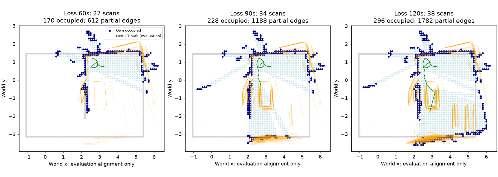
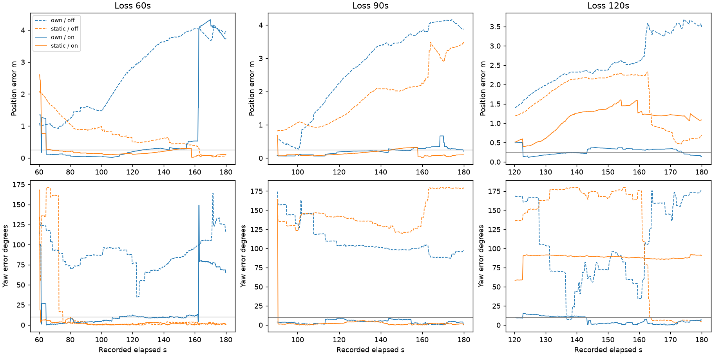

# egomap42 — 인과적 지도 snapshot + S2 색 구역·문 랜드마크

## 누설 정정 및 실행 전 조건 등록

2026-10-08 감독 요청. egomap41 최종179.8초/64스캔 지도에는 재위치 구간의 미래
관측이 들어갔다. 60초 조건의 B 목표도 미래72.1초 관측이었다. 기존 비교는 **누설로
무효**이며 그대로 보존·병기한다. 종료 yaw 우위를 자기 지도의 장점으로 해석하지 않는다.
이번 수정은 판정 완화가 아니라 입력의 인과성 수정이다. 검출기·지도 구성은 egomap34 고정.

- 녹화: `/Users/changmin/projects/ugrp/outputs/wall-segment-dev-v1/new-seed`, seed32002.
  잃는 시점 경과60/90/120초(절대61.3/91.3/121.3), RNG41001/41002/41003 그대로.
- **자기 지도:** `online-maps.jsonl` 중 t보다 엄격히 이른 마지막 행의 grid와 ledger.
  당시 저장된 상태를 그대로 사용한다. 최종 grid/graph를 잘라 재구성하지 않는다.
  선택 시점59.5/84.1/119.1초, 각각27/34/38스캔·747/1227/1763관측칸이다.
- 자기 랜드마크: t 이전 자기 RGB의 S2 검출만 당시 자기 추정 pose로 변환해 기억한다.
  관측 ID/시각/당시 pose를 보존하며 미래 최적화·GT 정렬·정적 영역/문 위치는 사용하지 않는다.
  부분 색 경계만 기억하며 보지 않은 전체 사각형·구역 중심으로 확장하지 않는다.
  동일 색 관측은 모두 가능한 대응이며 원본 최대우도 대응을 사용한다(새 지도 병합/튜닝0).
- 정적 조건: 기존 authored static grid, 정적 region 경계·passage 중심/폭 사용.
  두 조건의 검출 색 vocabulary는 원본 S2 지도의 고정 색상 명세만 공유한다.
  색 signature는 사전 지식이며 자기 조건에는 지도 좌표·구역 식별 정답을 주지 않는다.
- 재위치 입력은 **t보다 엄격히 뒤**의 실제 own RGB/명령만. 경계1e-8초 이내 행은
  양쪽에서 제외한다. 초기 위치/방향은 각 고정 지도 free 전체 균등, GT·저장현재pose prior0.
- 목표 정의도 egomap41 그대로: t 이전 floor_color_v3에서 처음 locally_confirmed_region인
  B 후보와 관측 ID. 60초 조건은 목표 미관측으로 별도 집계(미래 관측으로 채우지 않음).
  정적 기준선은 같은 B의 정적 중심. 카운트 분모3은 유지하며 미관측을 빼 유리하게 만들지 않는다.

### 조건 및 고정 판정

새 조건은 causal own/static × `sensor_landmarks=off|floor_zones_doors_v1` ×3시점,
**총12회**를 각각1회만 예측·봉인 후 별도 GT 채점한다. causal off는 누설 수정 효과와
랜드마크 효과를 분리하는 대조군이다. 기존 egomap41 no-landmark6회는 누설 표시로 병기한다.
모션·KLD·관문·seed·벽 접점은 이전 그대로이며 floor/door 독립 관측은 벽0점이어도
원본 S2처럼 측정 패킷이 된다. 랜드마크 옵션 기본off, off bytes/RNG 동일을 시험한다.

**[egomap41 판정](../2026-10-08-own-map-utility/README.md#판정결과-전-고정)을 변경 없이 재사용:**
내부 resolved 연속5 RGB + 평가 XY≤.25m/yaw≤10°; 정적 수렴≥2/3;
자기 수렴 수 열세 없음·공통 수렴 존재·공통 중앙 XY오차/시간 각각 정적≤2배·거짓수렴0.
목표≤.20m 내부 선언, 실제 B 내부 여부는 평가만; 정적 올바른 선언≥1/3,
자기 올바른 선언 열세 없음/거짓0, 자기 최초수렴 경로의 정답기하 충돌0.
물리 제안 관문은 위 모두 만족. 고정 녹화에서는 새 경로 실제 도달률은 **미검증**이다.
결과 후 문턱·옵션·seed 변경0. offline12회는 한 녹화의 중첩 구간이며 독립 확증 아님.

지도별 점유/free칸·면적·스캔/랜드마크 관측 수, 후속RGB·벽/랜드마크 표본 수,
수렴/오차/시간/σ/거짓선언·미관측 목표를 기록한다. 기존 egomap34 전체지도 품질을
부분 snapshot의 품질로 승계하지 않는다. snapshot 벽 coverage는 GT 평가에서 별도 산출한다.

### 원본 재사용 및 경계

PR406 `codex/s2-realism` **6a9e93f1a463ed2e356b044487c6b025ad018b63**의
`harness/zone_solo_cyan_landmarks.py`: HSV/연결성/Hough/양면지지 바닥경계,
양쪽 jamb·거리 discontinuity 문, Gaussian 거리/방위/폭·색상별 최대우도 대응,
5% random component를 수치/함수 그대로 복사한다. 벽우도×랜드마크우도 결합도 동일.
원본 S2가 인용하는 Probabilistic Robotics §6.6/Table6.4, §7.5를 계승한다.
`zone_solo_cyan_visibility.py`의 명령기구학 자기그림자·RGB cyan 마스크를 재사용한다.
새 의존성/venv0, #406 파일 변경0. 정확한 복사 행·해시는 구현 provenance에 남긴다.

필수 어댑터 차이: S2 Runtime 대신 egomap34의 명령 SEARCH FK(강성on) 카메라와
동결 벽 접점/녹화 ABI를 공급한다. 자기 지도에는 관측한 부분선분/문만 제공한다.
정적 전체 영역과 자기 부분 관측의 정보량 차이를 보존한다. 원본 landmark 검출·우도
문턱을 바꾸지 않으며, S2 전체 능동 관측/운반 Runtime을 이식했다고 주장하지 않는다.

## 보존·실행 경계

출력 `/Users/changmin/projects/ugrp/outputs/own-map-causal-landmarks-v1`.
물리·렌더·모델·잠금0. 예측은 GT 파일/실시간 상태 읽기0, 평가만 출발 GT 변환 사용.
F 구현은 유지, 상대 배열 전송/merge0. 새 출력만 추가, 원본/과거실패 보존.
ENOSPC=HOST_ERROR. 바뀐 모듈 시험만, 초록 후 커밋·push, PR405 DRAFT/병합0.
단계 사이 SUPERVISOR 확인. TensorBoard 생략 유지. push 오류는 로컬 진행 후 재시도.

## 구현·재생 전 고정

`Relocalizer(..., sensor_landmarks='floor_zones_doors_v1', landmark_map=...)`에만
측정 우도 곱을 추가한다. 기본off는 기존 함수의 출력·입자·logw·RNG bytes 동일.
랜드마크가 있고 벽이 없어도 S2 원본처럼 측정하며 이동/새시야 관문은 유지한다.
S2 함수·상수의 원본 행/해시는
[provenance.json](../../harness/own_map_amcl_vendor/provenance.json)에 있다.

자기 landmark map은 모든 prefix 관측을 부분 선분/문 후보로 보존한다. 중복 관측을
추가 우도항으로 세지 않고 원본 최대우도 대응의 대안으로만 쓴다. 평균/병합/새 문턱0.
관측 pose 공분산은 출처에 보존하고 S2 원본 고정 센서 σ는 바꾸지 않는다.
카메라·검출 벽열 어댑터 외의 원본 floor_features/door_features/landmark_likelihood는 동일.

명령 기반 자기 가림의 원본 `fixed_robot()`은 고정 XML 문자열을 만드는 과정에서
MuJoCo 패키지를 import한다. 모델/data 생성·렌더·step/forward/kinematics는 하지 않는다.
재생 준비에서 해당 진입점을 예외로 차단하고 시험에서도 native 호출0을 검증했다.
초기 시험의 import 자체 금지 assertion 1개를 실행 금지 검증으로 정확히 바꿨다
(실제 물리/렌더 실행은0). 모델/검출기·통계 문턱 변경은 없다.


## 결과 — 누설 제거 후 고정 기준 판정

사전등록 **9c5ee9c3** → 구현/재생 **b68b94b7**. causal off/on×자기/정적×3,
12예측을 각1회 봉인 후 별도2조건 채점. 결과 후 설정/문턱 변경0, 물리/렌더/모델/잠금0.
과거 egomap41 자기 최종지도는 **미래 관측 누설로 비교 무효**이며 진척 기준으로 쓰지 않는다. 과거 정적 조건 자체는 미래 입력 누설이 없지만 누설 자기 조건과의 비교는 무효다.

|조건|잃은 시점 s|지도|RGB / 벽점 / 랜드마크 표본|정답 수렴·첫 시간 s|종료 XY m / yaw°|σXY m / σyaw°|올바른 목표 / 거짓 목표|
|---|---:|---|---:|---|---:|---:|---|
|과거 no-LM (자기 누설)|60|own|601 / 35,372 / 0|없음 / —|0.211 / 1.47|0.248 / 7.57|0 / 0|
|과거 no-LM (자기 누설)|90|own|451 / 28,187 / 0|없음 / —|0.241 / 0.56|0.137 / 5.43|0 / 0|
|과거 no-LM (자기 누설)|120|own|301 / 18,779 / 0|없음 / —|0.159 / 1.77|0.353 / 9.98|0 / 0|
|과거 no-LM (정적)|60|static|601 / 35,372 / 0|없음 / —|0.053 / 0.81|0.129 / 5.36|0 / 0|
|과거 no-LM (정적)|90|static|451 / 28,187 / 0|없음 / —|2.169 / 175.52|1.760 / 105.13|0 / 0|
|과거 no-LM (정적)|120|static|301 / 18,779 / 0|없음 / —|2.012 / 166.57|1.826 / 120.76|0 / 0|
|causal no-LM|60|own|600 / 35,328 / 0|없음 / —|3.971 / 114.89|0.994 / 49.96|0 / 0|
|causal no-LM|90|own|450 / 28,137 / 0|없음 / —|3.875 / 97.43|0.188 / 6.78|0 / 0|
|causal no-LM|120|own|300 / 18,714 / 0|없음 / —|3.489 / 176.97|1.820 / 63.38|0 / 0|
|causal no-LM|60|static|600 / 35,328 / 0|없음 / —|0.070 / 0.28|0.116 / 4.92|0 / 0|
|causal no-LM|90|static|450 / 28,137 / 0|없음 / —|3.487 / 179.46|0.777 / 26.22|0 / 0|
|causal no-LM|120|static|300 / 18,714 / 0|없음 / —|0.690 / 3.30|1.441 / 55.53|0 / 0|
|causal + S2 LM|60|own|600 / 35,328 / 1,900|예 / 5.2|3.727 / 65.83|0.045 / 2.34|0 / 0|
|causal + S2 LM|90|own|450 / 28,137 / 1,320|예 / 0.8|0.208 / 0.77|0.063 / 2.13|0 / 0|
|causal + S2 LM|120|own|300 / 18,714 / 726|예 / 54.2|0.140 / 6.65|0.045 / 1.92|0 / 0|
|causal + S2 LM|60|static|600 / 35,328 / 1,900|예 / 9.2|0.111 / 0.63|0.056 / 2.39|0 / 0|
|causal + S2 LM|90|static|450 / 28,137 / 1,320|예 / 1.2|0.098 / 0.21|0.060 / 2.44|0 / 0|
|causal + S2 LM|120|static|300 / 18,714 / 726|없음 / —|1.085 / 91.16|0.101 / 4.18|0 / 0|

LM 수는 관측 선분 표본이며 서로 다른 물리 랜드마크 수가 아니다. 중첩 구간을
독립 프레임/독립 실행으로 합산하지 않는다. 새 재생은 경계시각 프레임을 제외해
600/450/300 RGB이며, 과거601/451/301과 1개씩 다르다. 상세 갱신/재표본/거짓수렴은
[comparison.json](results/comparison.json), 원 판정은 [off](results/utility-off.json)·[on](results/utility-on.json).

|잃은 시점 s|실제 snapshot t / 스캔|점유/free칸|관측 면적 m²|색 경계 / 문 / 출처 RGB 수|전체 벽 덮임 (표본)|벽 P / RMSE m|기억한 B|
|---|---:|---:|---:|---:|---:|---:|---|
|60|59.5 / 27|170 / 577|7.47|612 / 0 / 284|38.6% (127/329)|65.9% / 0.359|미관측|
|90|84.1 / 34|228 / 999|12.27|1188 / 0 / 433|47.7% (157/329)|63.2% / 0.333|관측|
|120|119.1 / 38|296 / 1467|17.63|1782 / 0 / 583|50.5% (166/329)|59.5% / 0.332|관측|

이 표의 P/덮임은 전체 벽 기준이며 egomap34 최종 영역P/R63.6/76.0%와 분모가 다르다.
정적 지도는 매 시점 286점유/2769free칸, 제공면적30.55m²이다. 자기의 관측 면적 차이는 유지했다.

- **off:** 정답수렴 자기0/3·정적0/3; 자기 거짓 내부수렴 프레임0, 정적0. 오차비None, 시간비None. 등록조건 전체 통과=False. 올바른 녹화상 도달 자기0/3·정적0/3. 자기 계획 어댑터 호출0회(목표 미관측 반환 포함).

- **on:** 정답수렴 자기3/3·정적2/3; 자기 거짓 내부수렴 프레임477, 정적77. 오차비0.5826199497329883, 시간비0.5769230769230766. 등록조건 전체 통과=False. 올바른 녹화상 도달 자기0/3·정적0/3. 자기 계획 어댑터 호출3회(목표 미관측 반환 포함).

자기60초는 B 관측 전이라 목표 미관측1/3(90/120초는72.1초 관측 기억).
정적 목표는 같은 개체B의 authored 중심으로 유지한다. 자기 지도/랜드마크/목표 준비에
GT 변환0, 평가 그림과 오차 계산에서만 출발 GT 정렬을 사용했다. 문 검출0도 그대로 보존한다.
고정 녹화는 새 목표 경로를 실행하지 않아 실제 폐루프 도달 성공은 계속 **미검증**이다.




### 검증·보존

바뀐 모듈3시험 파일 **16 passed**. default/off 반환값·입자/logw·RNG bytes 동일,
미래 스캔/타로봇 차단, future append 불변, B 목표 prefix 제한, 원본 S2 함수/상수
정의 해시, 바닥 단독 관측, 원래 egomap41 판정 블록 동일을 검사했다.
원본 해시·관측 prefix/suffix 비중첩·GT 평가 분리·예측 봉인은
[verification.json](results/verification.json), raw 목록은 [raw-manifest.json](results/raw-manifest.json).
Raw는 등록한 절대 outputs 경로에 로컬 보존하며 원격 백업으로 표현하지 않는다.
원래 미추적4파일/다른 worktree/#406 파일 변경0. PR405 DRAFT/병합0.

### 판정 해석·남은 문제(튜닝 없음)

랜드마크on의 자기/정적 정답 수렴3/3·2/3은 **어느 시점에라도 등록된5프레임 조건을
만족했다**는 뜻이지 끝까지 위치를 유지했다는 뜻이 아니다. 공통 수렴60/90초의
중앙 XY오차비.583·시간비.577은 통과하지만, 자기 거짓수렴0 조건은 실패다.
거짓수렴은 자기60/90/120초 **253/108/116프레임**, 정적 **22/16/39프레임**이다.
합계477/77은 겹치는 재생 시도별 합계이며 서로 다른 RGB 수/독립 사건 수가 아니다.

- 자기60초: 종료3.727m 오차인데 σXY .045m. 평가상 실제 차체 중심이 snapshot
  unknown에 놓인 프레임523/600, 거짓수렴253개 모두 그 영역이다. 이는 부분 지도
  지원 범위 밖에서 좁은 posterior가 잘못된 대응을 유지할 수 있음을 보여준다.
- 자기90/120초: 종료.208/.140m이나 거짓수렴108/116도 있다. 실제 차체가 unknown인
  때의 거짓수렴은0/23개뿐이다. 따라서 전체 실패를 '지도 밖 이동' 하나로 단정할 수 없다.
  [지원 범위 진단](results/support-diagnosis.json)은 평가 전용이며 GT로 지도/free/입자를 채우지 않았다.
- 정적120초: 종료 yaw91.16°로 여전히 방향 모호성/잘못된 대응이 남았다. 색 경계는
  구역ID 정답이 아니며, 문 관측0인 이 녹화에서 S2 효과가 모든 시작에 재현되지는 않았다.
- 목표 경로: 자기90/120초는 각각 경로가 있고 정답기하 검사clear이다. 자기60초는
  목표미관측 반환으로 실제 NavFn 호출이 없다(계획 어댑터3호출 중 실제계획2).
  정적60초 경로는 기하검사불통과,90초clear,120초no_path이다. summary의
  `static_geometry_path_clear=False`는 빈 경로/목표미관측도 포함하므로 전부 충돌로 세지 않는다.
- 모든 녹화 구간에서 실제 B 내부 프레임0. 따라서 올바른 도달≥1/3도 미달이며,
  '자기0/3=정적0/3'을 도달률 통과로 해석하지 않는다. 폐루프 도달률은 미검증이다.

**다음 추천:** 실제 새 경로로 기억한 B에 도달하는지 검증하려면 물리1회가 필요하다.
다만 이번 고정 관문은 거짓수렴·녹화상도달·경로 조건 미달이므로 **지금 실행은 보류**하고,
먼저 부분 지도 밖/동일색 잘못된 대응에서 수렴 선언이 왜 유지되는지 오프라인으로
점검하는 것을 추천한다. 이번에는 후속 보정·물리를 구현/실행하지 않았다.

재현(각 예측은 봉인 파일이 있으면 재실행을 거부):
```sh
python experiments/2026-10-08-own-map-causal-landmarks/code/replay.py prepare
python experiments/2026-10-08-own-map-causal-landmarks/code/replay.py predict --condition own --mode on --trial 0
python experiments/2026-10-08-own-map-causal-landmarks/code/score.py --mode on
```
실행은 기존 `.venv-sim-worker-mac/bin/python`을 사용했다. 전체12조건 명령과 봉인 순서는
raw `cohort.log`·각 조건log에 있으며 같은 결과를 덮어쓰지 않는다.
원본 S2 [검출/우도 파일](https://github.com/cmkang131/UGRP-Multi-Robot-Collaboration-Project/blob/6a9e93f1a463ed2e356b044487c6b025ad018b63/harness/zone_solo_cyan_landmarks.py#L72),
[자기 가림](https://github.com/cmkang131/UGRP-Multi-Robot-Collaboration-Project/blob/6a9e93f1a463ed2e356b044487c6b025ad018b63/harness/zone_solo_cyan_visibility.py#L67).
