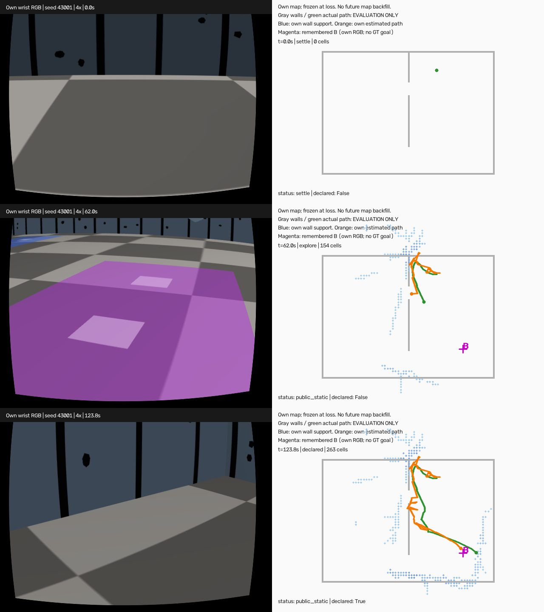

# egomap43 — S2 우도 감쇠 재생 + 기억한 B 복귀 DEV 1회

2026-10-08 실행 전 사전등록. egomap42 landmark on의 자기3/3·정적2/3은 **한 녹화의
중첩된3쌍** 결과이며 독립 확증/지속 위치 유지 성공이 아니다. 과거 누설 비교는 무효 유지.
이번 물리는 이전 쓸모 관문 통과 여부와 무관한 **사용자 승인 DEV 1회**다.

## 원본·고정 설정

PR406 `2fa4bf9a0e8097bcd4d1e1933b7d04e4d54dd965`의
`harness/zone_solo_cyan_bias_tempering.py:16–17,65–75`와
`experiments/2026-10-06-s2-realism/README.md` s2v45를 읽기 전용으로 확인했다.
`likelihood_tempering=pr_likelihood_half_v1`, 기본off, **벽우도×랜드마크우도 전체의
0.5승**을 그대로 쓴다. α=.5는 S2의 사전 고정 비교값이며 책의 기본값/새 적합값이 아니다.
전진 scale·모션/검출/지도/재표본/수렴 문턱 수정0. #406 파일 수정0.
출처는 Thrun/Burgard/Fox *Probabilistic Robotics* §6.3.4 p167·§6.7 p183의
상관 관측에 대한 p(z|x)^α, α<1. 원본 코드 행·해시를 기록한다.

## 오프라인6조건

- egomap42 causal LM on 자기/정적×60/90/120초, RNG41001/41002/41003 그대로.
  기존 prepared/지도/랜드마크/목표/자기 명령/RGB 입력 bytes를 재사용한다.
- strict t이전 snapshot·랜드마크·B 기억, strict t이후 RGB. 60초 자기 B 미관측 유지.
  기존 LM on6조건에 감쇠만 켜 각1회 예측 봉인 후 GT 평가한다. off는 봉인된 egomap42.
- 거짓수렴 프레임(시도별·중첩 합산 주의), 정답수렴/시간, 종료XY/yaw/σ를 같은 표로.
  egomap41/42의5연속resolved·XY≤.25m/yaw≤10° 및 전체 쓸모 판정은 변경0.
- 센서 전후 ESS·공분산·재표본 직후 고유자세 수를 원본 S2 방식으로 진단한다.
  60초 자기 색 경계의 최적 대응을 평가에서만 검사: B의 구역ID 정답은 입력이 아니며,
  미관측B와 같은 색의 기존 경계에 잘못 대응하는지, 입자 집중과 함께 기록한다.
- 결과와 무관하게 아래 사용자 승인 물리1회를 진행한다. 새 문턱 선택/재튜닝0.

## 새 폐루프 DEV 1회

- 새 seed **43001**, tape_v1·SEARCH·servo_stiffness=real_v1, egomap34의
  rotL_v1/RBPF100/graph/switchable/Manhattan/±20°/selective/insertion/
  public_ros_v8·nav2_frontier_v1 탐색 구성 고정. 새 옵션
  `map_utility=remembered_goal_v1`(기본off)에만 탐색→재위치→복귀 연결.
- 최대 **360 SIM초**, RGB/명령5Hz, wall예산 **60분**, raw예산1GiB.
  ENOSPC·시작 여유<10GiB는 HOST_ERROR. 실행 중 소스/설정 변경0·추가시도0.
- 탐색90초 이후 B가 floor_color_v3에서 처음 확인되어 기억돼 있으면 다음 RGB 시점에
  위치를 잃음 처리한다. B 미관측이면 탐색을 최대180초까지 계속한 뒤 같은 처리를 한다.
  당시 이전의 online grid·색/문 부분 관측과 당시 자기 추정 pose만 고정한다.
  loss 프레임은 기억과 재위치 양쪽에서 제외, 이후프레임만 재위치 입력이다.
- 물리 로봇을 순간이동하지 않는다. PF를 자기 snapshot free 전체·yaw균등(KLD100000)으로
  새로 만들며 실제/이전 pose·좁은 초기분포를 주지 않는다. 명령 DR은 후속 상대delta만.
  기존 `floor_zones_doors_v1`+감쇠α.5. 지도 위치/목표에 GT 정렬0.
- 재위치 중 기존 탐색 bootstrap의 .5rad/s 회전 요청을 v122 rotL 유한 펄스로 실행해
  자기 카메라 새 시야를 얻는다. 내부resolved5연속이면 복귀단계로 전환한다.
  최대60초에 못 수렴하면 dev_light로 `would_stop_unresolved`를 기록하고 현재 추정으로
  복귀를 시도한다. 미수렴을 수렴 성공으로 보고하지 않는다.
- 복귀는 기존 public_ros_v8 NavFn/RPP·복구·raytrace/footprint clearing을 재사용한다.
  localization snapshot은 고정; navigation obstacle layer만 이후 자기 관측으로 갱신한다.
  B는 loss 이전 첫 확인 후보의 자기 중심·관측ID만. 미관측이면 '목표 미관측'으로 세고
  새 정답 목표를 공급하지 않으며 남은 예산은 frontier 관측에 쓴다.
- 현재 내부resolved5연속이고 추정 중심이 기억한B≤.20m이면 **도달 선언 후 정지**.
  이 선언은 추정 출력이며 정답 성공판정을 제어에 돌려주지 않는다.
  선언 시 **GT 차체 중심이 실제 B 안**이어야 평가 성공, **거짓 선언0**.
  수렴/시도/도달 시간, 로봇·벽 접촉(저장 평가 표본 기준), 종료오차/σ,
  지도 스캔/칸 수·덮음과 실제 이동/hold를 함께 보고한다.
- 벽접촉/기울기/비정상 수치 등 기존 backend 실제 물리실패 중단은 유지한다.
  σ/일관성 보수 경고는 log-only, 모델/상대지도/배열공유/GT제어/freeze0.
- agent_lock status=null에서 드라이버PID로 acquire, ugrp_session 아래 한 번에 하나.
  S2 잠금 중이면 대기하며 타 프로세스 종료/잠금 탈취0. 끝나면 자기 잠금 release.
  새 workflow는 기존 sim_cli 관리 진입점에 등록하고 소스·번들·입출력을 연결한다.

## 기록·검증

raw `/Users/changmin/projects/ugrp/outputs/own-map-closed-loop-v1`.
손목 RGB | 해당시각 자기지도·추정경로·기억한B의 **4배속 wrist-map-4x.mp4**를 outputs에
보존한다. 최종 지도를 과거 영상에 채우지 않는다. 평가 GT 오버레이는 명시한다.
바뀐 모듈1–3시험 파일만 실행, 기본off pose/입자/RNG/명령 bytes 동일. 초록 후 커밋·push,
push 장애는 로컬SHA 진행 후 재시도. PR405 DRAFT·병합0, 원본/미추적4파일 보존.
단계마다 SUPERVISOR 확인. TensorBoard 생략 유지, Drive0. 실물 검증이 아닌 MuJoCo DEV1회.

## 구현 연결(실행 전 고정)

`harness/self_map_closed_loop.py`는 off에서 기존 explorer 객체를 그대로 반환한다.
탐색은 egomap34 클래스/설정 그대로, 재위치 이후에만 새 상태기계를 쓴다.
`contact_points`의 원래 열/픽셀을 S2 `Sensor`에 전달하며 egomap42 캐시와 실제 RGB
일치 시험을 했다. 구역 색 vocabulary만 고정 공유하고 위치·범위는 전달하지 않는다.
0.1m 자기 snapshot을 v8의0.05m navigation cell로2×2 복제한다. AMCL snapshot은
고정하고 navigation clear는 기존 recovery처럼 obstacle layer만 초기화한다.
입자 생성/우도/재표본은 기존 AMCL/KLD 그대로이며 최종 지도로 snapshot을 교체하지 않는다.
`sim.own_map_closed_loop`는 기존 물리 backend에 평가 파일용 접촉 표본만 추가한다.
평가값 반환·행동 피드백0; 현재 wall contact 실제 실패 중단은 유지한다.

## LM on6조건 결과(물리와 별개)

|지도/잃은 시각|거짓수렴 off→감쇠|정답수렴 off→감쇠|종료XY m off→감쇠|감쇠 종료σXY m|
|---|---:|---|---:|---:|
|own/60s|253→93|1→1|3.727→0.195|0.069|
|own/90s|108→117|1→1|0.208→0.239|0.067|
|own/120s|116→101|1→1|0.140→0.161|0.058|
|static/60s|22→12|1→1|0.111→0.093|0.070|
|static/90s|16→12|1→1|0.098→0.088|0.072|
|static/120s|39→0|0→0|1.085→1.078|0.180|

자기3/3·정적2/3 유지, **거짓수렴0 관문 미달**. 중첩3쌍이며 독립6녹화가 아니다.
60초 자기 B 기억 없음 유지. 단순 프레임 합산으로 표본 수를 부풀리지 않는다.
오프라인 source `56ad5051`; 입력·예측 해시는 results/utility-tempered.json.
6예측을 봉인한 뒤 평가기 static map cache 경로1곳을 수정했으며 예측 재실행0·문턱 변경0.

물리 전 source preflight에서 egomap34 이후 추가된 검출기 off dispatcher2파일의
whole-file 해시 차이를 발견했다(물리 시작0). `9ff00833`과 줄 단위 비교 결과는
off 옵션 인자/dispatch만 추가됐으며 원 검출은 동일했다. 옛 전체파일을 보존한 fixture의
해시=egomap34 freeze를 확인하고 실제 RGB의 비어 있지 않은 검출 bytes 동일 시험 후
`detector-off-admission.json`에 두 해시만 명시적으로 연결했다. 다른 freeze는 그대로다.

## 거짓 수렴 진단(평가 전용)

원인 요약: **관측 우도의 과집중 증거가 있고, 부정확한 색 경계 기억도 많다. B를 다른
진짜 색 구역으로 연관해서 이탈했다는 단독 원인은 이번 자료로 확인되지 않았다.**
60초 자기의 최저 posterior ESS는3.109→69.752, 재표본32→28회. 감쇠 후 재표본 직후
고유 자세 최솟값327, 고유 비율 중앙44.5%로, 재표본 직후 ESS=N을 다양성 회복으로
해석하지 않는다. posterior와 resampled를 별도로 저장했다.

'B 미관측'은 **floor_color_v3의 B 후보가 미확인**이라는 뜻이다. 60초 이전 색 선612개를
원 취득 GT 자세로 평가하니 B 경계0.15m 이내인 부분선4개는 이미 있었고,517/612개는
어떤 실제 바닥 색 경계에도0.15m 안으로 대응되지 않았다(벽/물체의 바닥 투영 등 포함할 수
있으므로 이 숫자만으로 의미 객체 오검출로 확정하지 않는다). 미래 센서 업데이트237개
중 실제 B 경계에 가까운13개에서12개는 B 취득 경계로,1개는 실제 바닥 경계가 아닌 기억으로
대응했다. 서로 다른 **정답 구역** 사이 오연관0개(off/on 동일). 거짓수렴 시의 대응84→50개
역시 정답 구역 간 오연관0개. 따라서 입자 집중과 부정확한 부분 특징을 함께 원인 후보로
남기고, B 경계 오연관 하나로 단정하지 않는다. 이 분류는 GT로 만든 **사후 평가**이며
수정/문턱/제어에는 쓰지 않았다. 상세: results/association-diagnosis.json 및 raw의
`offline/correspondence-evaluation.json`.

### 소스 대조

- [PR406 고정 구현 2fa4bf9a](https://github.com/cmkang131/UGRP-Multi-Robot-Collaboration-Project/blob/2fa4bf9a0e8097bcd4d1e1933b7d04e4d54dd965/harness/zone_solo_cyan_bias_tempering.py#L65):
  원 joint score의 `np.power(score,.5)`만 이식. `moments` 원문·상수는 vendor에 복사하고
  정의별 hash/원본 행은 `harness/own_map_amcl_vendor/provenance.json`에 보존.
- S2 s2v45의 근거: Thrun/Burgard/Fox, *Probabilistic Robotics* (2005),
  §6.3.4 p167·§6.7 p183, 상관 관측의 우도 감쇠. α=.5는 S2 사전등록값.
- 기존 KLD/augmented injection/랜드마크 ML 연관과 문턱은 변경0.
  새 전역 초기화는 자기 관측 free에 uniform, yaw[-π,π); 이전 자세/GT prior0.

## DEV 물리1회 결과 — B 도착과 정답 재위치 성공을 분리

소스 `e068a70fe978ffa9218916e4c4ae4fb292e69064`, seed43001, 실행 번들
`egomap43-own-B-dev-v1`. **실제 MuJoCo 실행1회**; S2와 동시 실행0, 모델0·freeze0.
관리 wrapper는 `python -m scripts.sim_cli workflow run own-map-goal-dev`로 실행했다.
최초 직접 파일 실행의 import 오류는 물리 시작 이전이며 재녹화가 아니다.
agent_lock(pid19495)·ugrp_session 종료 및 잠금null 확인. 60분/1GiB 예산 내 완료.

|측정|결과|
|---|---:|
|전체 시간 / loss 이후 도달 선언 / wall 시간|123.8 SIM초 / 33.8초 / 273.07초|
|B 도달 선언의 GT 차체 중심이 B 안 / 거짓 선언|**1/1 / 0**|
|정답 재위치 수렴(XY≤.25m·yaw≤10°,5프레임)|**0/1**|
|내부 수렴 / 거짓 수렴|157/169 suffix프레임 / 157프레임|
|종료XY / σXY / 오차÷σ|0.6032m / 0.0691m / 8.73σ|
|종료yaw / 전 경로XY RMSE|−5.86° / 0.4551m|
|이동 / 실제 footprint union / hold|5.778m / 2.0425m² / 26/610=4.26%|
|벽 / 다른 로봇 접촉|0 / 0 (620개5Hz 평가 표본)|
|삽입 스캔 / 점유칸 / 관측칸|27 / 263 / 1306(13.06m²)|
|snapshot 영역P/R|31.45%(39/124칸) / 38.32%(41/107벽표본)|
|잠재가시 벽 / 전체덮음|107/329 / 65/329=19.76%|
|snapshot 전체P / 벽RMSE|32.32%(85/263칸) / 0.4689m|

B 기억은 자기 `r3-obs-000228`,경과45.4초(RGB hash는 result에 보존)에서 처음 확인했다.
경과90초에 **시작 위치 모름 uniform100000입자**로 재초기화; 이전 pose prior0.
벽 snapshot은 마지막 삽입t87.9의27스캔, 랜드마크는 loss t91.3 직전까지의1227부분선·문0.
loss프레임 배제, snapshot/랜드마크/목표 이후 관측누설0. 지도 셀/ledger는 실행 끝까지 동일.
마지막 삽입~loss 사이의 명령 DR/입자/관문 계수는 달라지므로 metadata 전체가 아닌
AMCL이 읽는 셀·해상도·로봇ID와 ledger를 hash/내용으로 확인했다.

B 기억 중심의 평가 오차는0.3521m이며 실제B 바깥이다. 내부 수렴 후에도 GT 위치 오차가
남았다. 따라서 **B 도착1회는 관측된 사실이나, 정확한 자기 지도/재위치의 확증은 아니다.**
실제 첫 B 진입은 경과115.6초이고 loss 이전 B 진입0프레임이다. 정답을 주입하거나
도착 판정으로 제어를 돌린 것이 아니라 자기 추정 거리≤.20m에서 정지한 뒤 채점했다.
다음 후보를 이번 결과에 맞춰 수정하지 않았으며 추가 물리 실행0.

탐색 RGB440프레임 중 유효 벽 판정434, 빈6. egomap26 삽입 수정은 on 유지.
관문보류407, bootstrap1, 정합수락12, 명시거부12(high_residual7/low_overlap4/search_boundary1),
점부족2; 삽입27=bootstrap1+수락12+거부12+점부족2. 문턱/옵션 사후변경0.

## 결과물·검증·한계

- 영상: `/Users/changmin/projects/ugrp/outputs/own-map-closed-loop-v1/wrist-map-4x.mp4`
  (620프레임,1280×480,20fps,31.00초,4배속). ffprobe+전체decode 및 시작/중간/끝 그림 확인.
  회색 실제벽·녹색 실제경로는 평가 오버레이; 파란 자기지도·주황 추정·자홍 기억한B.
  각 시각 이전 snapshot만 사용하고 최종지도 역주입0.
- raw: `outputs/own-map-closed-loop-v1`; 물리 raw79,070,678bytes,
  결과/원본/video 전체hash `results/raw-manifest.json`. **로컬 보관이며 원격 raw백업 아님.**
- 바뀐3시험 파일 **15passed**; off pose/particles/logweights/RNG bytes golden,
  원본 S2 정의hash, 손실프레임배제·uniform초기화·미관측목표·5프레임선언·DEVtimeout,
  기존RGB 측정일치·egomap34 검출off동일·관리workflow 확인.
- 오프라인6조건 hash/인과분할·물리1회 causal snapshot·목표관측ID·영상검증:
  `code/verify.py` 통과. 검사기 초기 metadata/관리상태 키 가정은 실제 스키마에 맞춰 정정;
  예측·물리 원본 변경0. 단위시험과 실제 도착/실패는 별도 판정.
- 한 이전 녹화의 중첩3쌍과 새DEV1회뿐이며 일반화/실물/연구 코호트 성공률로 쓰지 않는다.
  바닥 선의0.15m GT 대응은 기하 사후 분류이며 의미 객체 확정이 아니다.
  접촉0은 저장5Hz 표본(별도 native wall-contact abort 유지), 연속 전접촉 무발생 증명 아님.
- PR405 DRAFT 유지·병합0. PR406 수정0, 추가 패키지/유료자원0, TensorBoard생략 유지.
