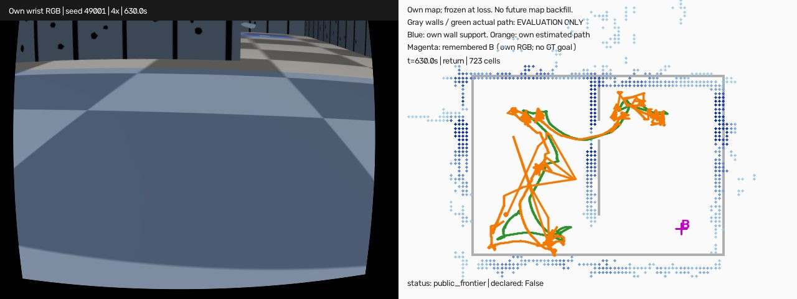

# egomap49 — 전에 자기 카메라로 본 B로 돌아가기 6회

2026-10-08 사용자 승인, **실행 전 사전등록**. 기준 `78084cf1` / PR405 DRAFT.
벽 검출기 egomap34 설정 동결, 개선/재튜닝0. 과제의 성공은 지도 품질 관문과 별개다.
설정: egomap47의 tape_v1·SEARCH·real_v1 강성·v122_rotL·RBPF100·graph·switchable·
TSDF support·inverse sensor·Manhattan·±20°·선택재표본·삽입수정·public_ros_v8·
Nav2 recovery·frontier 목표유지/360°관측·navfn_recovery_v1 그대로.
egomap48의 byte 동일성 입증 `scalar_rays_v1` + `match_cache_v1`만 추가 on.

## 실행 수·시간·목표

- 새 seed **49001,49002,49003,49004,49005,49006** 순서, 각1회 **총6회**.
  다른 seed의 이전 DEV와 합산하지 않는다. seed-audit.json에 원격 ref 검색 기록.
  시작 자세/장면은 egomap47 그대로라 다른 시작/장면 일반화 시험은 아니다.
- **360 SIM초 탐색**을 완료한 다음 위치 잃음 처리. 몸 순간이동0.
  egomap43와 같이 자기 snapshot의 free 전체·yaw균등100000입자로 초기화한다.
  loss 이전 pose를 초기 prior로 주지 않는다. AMCL/KLD·floor_zones_doors_v1·우도α=.5 불변.
- 탐색 중 floor_color_v3에서 **처음 확인한 자기 B 후보**만 기억한다.
  첫 색 검출 시각, 확인 시각, RGB/관측ID를 보존하며 목표 지정은 loss 때(반드시 그 뒤).
  미관측이면 GT 목표를 주지 않고 목표 미관측 실패로 센다. 상대 지도/배열 공유/모델0.
- snapshot은 strict t<loss의 online 지도·랜드마크·자기 목표만. loss프레임은 양쪽 입력에서 제외,
  재위치는 strict t>loss RGB만. 최종/미래 지도 역주입과 GT 정렬0.
- 최대 **630 SIM초=360 탐색+270 재위치/귀환**. 270은 egomap43에서 B가 이미 확인되어90초에
  전환할 경우 기존 전체360초까지 허용되던 잔여예산이다. 이번 사용자 변경은 탐색 예산이며
  도착/종료 문턱은 바꾸지 않는다. 재위치60초 미수렴 시 기존 dev_light 로그 후 귀환 시도 유지.
- 매회 60분 HOST 상한, raw합계6GiB 예산. 여유<10GiB/ENOSPC=HOST_ERROR.
  예상20–40분/회, 합계2–4시간+잠금대기(가속 비용모델 참고값, 보장 아님)를 감독 파일에 기록했다.
  한 번에 한 물리, agent_lock status=null에서 acquire·ugrp_session·종료 후 release.
  S2 점유 시 기다리고 다른 프로세스/잠금에 손대지 않는다. 우선순위 조정/freeze/유료자원0.

## egomap43 도착·종료 판정 그대로

- 내부 `resolved` **5프레임 연속**이고 자기 추정 중심과 기억한 B 중심 거리가 **≤0.20m**이면
  도달 선언·hold·종료. GT는 이 선언을 바꾸거나 제어에 돌려주지 않는다.
- 선언 시 **GT 차체 중심이 실제 B 영역 안**이면 도착 성공. **거짓 선언0**.
  시간만 지나거나 실제로 B를 스쳤으나 선언하지 않은 경우 성공으로 세지 않는다.
- 기존 물리 실패(wall contact/tilt/nonfinite 등) 중단, 예산 종료, HOST 오류를 모두 보존.
  정답 재위치(XY≤.25m, yaw≤10°,5프레임)도 egomap43 그대로 별도 보고하며 도착과 혼동하지 않는다.
- 실패/목표 미관측/중단도 사전등록6회 분모에 포함. 숨긴 제외·다른 seed 대체·조건 변경0.
  물리 시작 전 환경 오류는 시도0으로 따로 공개하고, 실행이 시작된 슬롯은 재실행하지 않는다.

## 결과 전에 고정한 보고·분류

시도수/실제 선언 도착수/거짓 선언수, 종료XY 오차 중앙·최대, **오차÷로봇 보고σ >3** 횟수,
XY NEES `e_local.T @ inv(CovXY) @ e_local`(평가 GT만 자기 시작 프레임으로 변환),
벽/로봇 접촉 표본·연속 표본 episode 수, SIM/wall시간을 보고한다.
PF의 σ는 원 `global_std_xy_m=sqrt(trace(CovXY))`, 탐색 종료의 보고σ와 정의를 구분한다.
공분산 특이/마지막 GT 누락은 숨기지 않고 NA/마지막 공통 시각·차이를 기록한다.
전체 후속 프레임의 >3σ 비율도 보조 지표이고 6개 독립 시도로 합산하지 않는다.
지도 snapshot의 덮음·점유칸/스캔·시야벽 표본 수를 함께 기록한다.

실패 대표 원인 우선순위(사후 문턱 변경0):
1. HOST/실제 물리 중단 → 기타(원 예외/접촉 별도).
2. loss 이전 자기 B 미확인 → 탐색 미커버.
3. 거짓 선언 또는 종료XY>.25m 또는 정답 재위치 한 번도 없음 → 위치 오차.
4. 위에 해당하지 않는 미도착 → 경로/예산(원 no_path/recovery/hold 기록 첨부).
성공이라도 위치 과신·거짓수렴은 그대로 공개한다.

## 산출·검증

raw `/Users/changmin/projects/ugrp/outputs/own-map-return-repeat-v1/seed<seed>`.
실행 결과 봉인 후 별도 평가기만 eval_only/GT를 읽는다.
성공이 있으면 등록 순서의 첫 성공, 실패가 있으면 첫 실패를 골라 각각4배속
손목RGB | 당시 자기 지도·추정 경로·기억한B 영상을 만든다(최소1개).
그룹에 성공이 없으면 성공 영상 없음으로 명시하며 성공을 만들기 위한 추가 실행은 하지 않는다.
원본/명령/판정/해시 전부 보존. 로컬 raw 보관이며 원격 백업으로 표현하지 않는다.
초록 시험 후 source/설정/드라이버를 커밋해 코호트 동안 고정. 기본off byte 동일·바뀐 모듈1–3시험만.
단계마다 supervisor 확인, push 실패는 로컬SHA 진행 후 재시도. TensorBoard 생략 유지.
PR405 DRAFT·병합0, #406 및 다른 worktree 수정0. 실물/다른 장면 확증 아님.

기존 방법/출처: [egomap43](../2026-10-08-own-map-closed-loop/README.md),
[NavFn 시작·회복 egomap47](../2026-10-08-navfn-start-recovery/README.md),
[결과 불변 가속 egomap48](../2026-10-08-graph-runtime/README.md).

## 실행 소스 연결(첫 물리 전)

`remembered_goal_360_v1` 기본off는 기존 객체를 그대로 반환한다. 탐색은 egomap47 actor,
귀환도 같은 StartCycleNavigator를 사용한다. egomap43의 선언/60초 DEV 전환·PF는 변경0.
부모 상태기의 loss 시각/네비게이터 생성만 hook으로 분리했고, 기존egomap43 trace·입자·RNG
byte 동일 시험을 원본78084cf1 fixture와 수행했다. 바뀐3시험 파일16passed.
기존 egomap47 freeze 이후 추가된 active_navfn_start의 map_acceleration dispatcher1곳은
줄 대조와 egomap48 trace141/141 동일 근거로 두 SHA를 명시적으로 허용(freeze.json).
그 외 egomap47 고정 소스는 모두 같은 SHA다. 이 검사는 물리 시작 전에 완료했다.

## 결과 — 사전등록 6회 완료, 귀환 도착 0/6

사전등록 `8a2fb7c8`, 실행 소스 **`b3cc09dce60e8b93ec2bea7f8e81afe4c3c94b61`**.
6개 seed를 각1회 물리 시작했다. **도착0/6·거짓 선언0·제외0·재튜닝0**.
이는 새 seed의 같은 장면/시작 위치 DEV 반복이며 실물·다른 장면 확증이 아니다.
벽 검출기 동결과 egomap43 도착/종료 판정은 유지했다. 품질 관문을 새로 적용하지 않았다.

| seed | 마지막 단계 / SIM초 | 도착 | 종료XY(m) | 보고σ(m) | 오차/σ | XY NEES | 벽/로봇 접촉 episode | wall분 | 등록된 실패 분류 |
|---|---|---:|---:|---:|---:|---:|---:|---:|---|
| 49001 | 귀환 / 630.0 | 0 | 0.357 | 0.134 | 2.66 | 51.39 | 0/0 | 57.72 | 위치 오차 |
| 49002 | 귀환 / 630.0 | 0 | 0.223 | 0.077 | 2.92 | 18.90 | 0/0 | 43.73 | 경로/예산 |
| 49003 | 탐색 / 35.6 | 0 | 0.044 | 0.174 | 0.25 | 0.08 | 1/0 | 1.14 | 기타: 벽 접촉 |
| 49004 | 탐색 / 79.6 | 0 | 0.208 | 0.127 | 1.64 | 3.93 | 1/0 | 2.38 | 기타: 벽 접촉 |
| 49005 | 귀환 / 533.2 | 0 | 0.412 | 0.087 | 4.76 | 31.96 | 1/0 | 38.11 | 기타: 벽 접촉 |
| 49006 | 귀환 / 496.4 | 0 | 0.882 | 0.659 | 1.34 | 11.65 | 1/4 | 41.89 | 기타: 벽 접촉 |

종료XY **중앙0.290m·최대0.882m(n=6)**, 종료 오차>3σ **1/6**. 이 중앙값에는 탐색 중
조기 접촉한49003/49004도 포함된다. 귀환까지 진입한4회만의 종료XY는 중앙0.385m·최대0.882m다.
49003/49004의 σ는 기존 frontend 최대 고유축 표준편차, 나머지는 AMCL `sqrt(trace(CovXY))`다.
NEES는 전체 XY 공분산의 방향별 크기를 사용하므로 오차/σ의 제곱과 같지 않다.
모든 종료 오차는 마지막 명령 trace와 GT 시각이 일치하며 누락/특이 공분산 NA는0이다.

벽 접촉 **4 episode/4표본**, 다른 로봇 접촉 **4 episode/147표본**(모두49006)이다.
5Hz 표본의 연속 구간을 episode로 세므로 물리 접촉 전체 이벤트 수를 보장하지 않는다.
네 벽 접촉은 native `WALL_CONTACT` 중단과도 일치한다. 49003/49004는 탐색 중,
49005/49006은 귀환 중 중단. 49001/49002는630초 예산을 다 썼다. HOST_ERROR0.
실행 wall 합계184.98분(잠금 대기·채점·영상 제외), raw 약2.23GiB. 실제 기록 기준이며 가속 벤치마크가 아니다.

### 목표 관측과 인과적 지도

아래 t는 기록의 절대 SIM시각이다(실행 시작1.3초, 위치 잃음361.3초=탐색360초).
목표는 자기 RGB에서 확인한 B만 사용했다. 실제 B 중심과의 차이는 **봉인 후 GT 평가 전용**이며,
부분 관측 중심/좌표 오차/오검출을 이 값 하나로 구분하지 않는다.

| seed | 첫 검출t / 확인t | 자기 관측ID | 목표 지정t | snapshot t / 스캔 | 기억 중심↔GT B 중심(m) | 기억 중심이 실제 B 안 |
|---|---|---|---:|---|---:|---|
| 49001 | 21.5 / 23.5 | r3-obs-000112 | 361.3 | 360.5 / 220 | 0.464 | 예 |
| 49002 | 20.5 / 22.5 | r3-obs-000107 | 361.3 | 360.9 / 155 | 0.408 | 아니오 |
| 49003 | 미확인 | — | — | 탐색 중단 / 15 | — | — |
| 49004 | 미확인 | — | — | 탐색 중단 / 24 | — | — |
| 49005 | 142.3 / 145.7 | r3-obs-000723 | 361.3 | 355.3 / 199 | 0.295 | 예 |
| 49006 | 43.7 / 45.9 | r3-obs-000224 | 361.3 | 360.9 / 157 | 4.874 | 아니오 |

4개 snapshot 모두 strict t<loss이며 미래 랜드마크0, 재위치는 strict t>loss만 사용한다.
49003/49004는 B를 확인하기 전에 벽 접촉으로 끝났으며, 등록한 우선순위에 따라 대표 실패는
'기타: 물리 중단'으로 분류했다. 따라서 대표 분류는 탐색 미커버0·위치1·경로/예산1·기타4이고,
보조 분류의 목표 미확인은2/6이다. GT 목표 제공·GT 초기 자세 prior·지도 공유·모델 호출0.

### 지도 표본과 삽입 내역

귀환 진입 실행은 고정 prefix 지도, 조기 종료 실행은 마지막 online 지도다.
egomap43 경로 그대로 snapshot은 RBPF의 `online_frontend`/`self_map.export()`다.
탐색 중 graph는 navigation 지도와 map→odom 변환을 갱신하지만 RBPF snapshot을 최종 graph
격자로 교체하지 않는다(`active_wall_mapping.py:125–138`, `self_map_closed_loop.py:127–131`).
따라서 아래 표를 egomap47의 최종 graph 지도 수치와 동일한 산출물로 해석하지 않는다.
P는 기존 전체 점유칸의 실제 벽까지0.15m 이내 비율이다. 덮음은 전체 벽 표본329개 중
지도와 가까운 비율이며 실제 방문 면적과 같지 않다(오배치 셀도 덮음에 기여할 수 있음).
시야 표본은 평가용 카메라 가시 벽 표본으로, 서로 다른 실행을 합산하지 않는다.

| seed | 점유칸 | 삽입스캔 | 전체 P(%) | 전체 덮음(표본/329, %) | 시야벽 표본 | 벽RMSE(m) | 정합 결정 수 | 이동 관문 보류 | overlap / residual / boundary 거부 / 점 부족 보류 |
|---|---:|---:|---:|---|---:|---:|---:|---:|---|
| 49001 | 723 | 220 | 37.3 | 234/329, 71.1% | 175 | 0.490 | 1780 | 1560 | 16 / 36 / 1 / 5 |
| 49002 | 702 | 155 | 33.2 | 185/329, 56.2% | 175 | 0.571 | 1781 | 1626 | 17 / 41 / 0 / 1 |
| 49003 | 173 | 15 | 55.5 | 133/329, 40.4% | 108 | 0.382 | 169 | 154 | 6 / 7 / 0 / 0 |
| 49004 | 193 | 24 | 59.6 | 153/329, 46.5% | 102 | 0.554 | 387 | 363 | 11 / 3 / 1 / 2 |
| 49005 | 687 | 199 | 52.4 | 276/329, 83.9% | 172 | 0.540 | 1782 | 1583 | 24 / 55 / 1 / 7 |
| 49006 | 728 | 157 | 61.1 | 268/329, 81.5% | 175 | 0.543 | 1781 | 1624 | 20 / 35 / 1 / 5 |

삽입 수정은 켜져 있다. 삽입스캔은 accepted 정합 수와 같지 않다(거부 시 오도메트리 삽입 포함).
상세 사유는 각 `conditions/seed*/results/report.json`의 `insertion_gate_counts`에 보존했다.

### 실패 근거 — 수정 없이 기록

| seed | 정답 수렴을 한 번 이상 달성 | 거짓 수렴 프레임/후속프레임 | 후속 >3σ 프레임 | B blacklist t | 전체 목표 blacklist 수 | public_static / public_frontier 프레임 |
|---|---|---:|---:|---:|---:|---:|
| 49001 | 예 | 1071/1350 | 1165 | 388.9 | 8 | 50 / 696 |
| 49002 | 예 | 351/1350 | 387 | 424.1 | 7 | 55 / 603 |
| 49005 | 예 | 362/866 | 355 | 455.3 | 3 | 390 / 185 |
| 49006 | 예 | 255/682 | 275 | 435.9 | 4 | 55 / 95 |

귀환4회 모두 정답 수렴을 잠깐 거쳤지만 유지하지 못했다. 종료 시의 >3σ 1/6만으로
전체 경로의 과신이 해결됐다고 해석할 수 없다. 특히49006은 기억한 B 중심 자체가4.874m 어긋났다.
기존 회복기의 `active_wall_recovery.py:87–92`는 blacklist된 고정 목표를 `None`으로 바꾸어
frontier 탐색으로 넘긴다. 이번에도 B 목표가 네 번 모두 그 경로에 들어갔고,
후속 `public_frontier` 프레임이 발생했다. 이는 성공적인 B 귀환의 증거가 아니다.
B blacklist 이후 일반 frontier로 전환된 실행은 **4/4**(각 실행에서 B 제외1회)다.
전체 목표의 `next_frontier_requested` 이벤트는49001/49002/49005/49006에서 각각
**7/6/2/3회, 합계18회**다. B 자체의 전환4회와 후속 frontier 재선택18회를 합산하지 않는다.
22:10 감독의 egomap50용 지시(회차별 blacklist 원인·문 기반 이동 대체 효과)는 후속 과제로 보존한다.
**결론: 이 고정 구성의 자기 지도 귀환 쓸모는 입증되지 않았다.** 검출기를 고치기 전에,
후속 과제로 기억 목표의 좌표·연관 검증과 B 귀환 목표의 지속/실패 처리를 분리하는 검토가 필요하다.
이번 코호트에서 코드/문턱 수정·추가 물리0.

### 보존·검증·영상

- 49003의20:15/20:23 시작 요청은 S2 잠금 경합으로 **물리 시작 전에** 차단됐다.
  raw가 만들어지지 않았음을 확인하고 기다린 뒤20:39에 같은 등록 seed를1회 실행했다.
  물리 미시작2건은 제외한 물리 실행이 아니며 모두 `results/provenance.json`에 관리 manifest와 함께 공개했다.
- 6회 실행 소스 SHA와 관리 계층 execution-tree SHA가 동일하고, `source_changed_during_run=false`다.
  일반 manifest의 `source_dirty=true`는 시작 전부터 보존한 미추적 사용자 스크립트4개 때문이다.
  tracked source는 깨끗했고, 해당4개 hash 불변·미사용과 freeze23개를 매회 preflight로 확인했다.
- 바뀐3시험 파일 **16passed**, 기본off 기존 trace·입자·RNG byte 동일.
  결과 정리에서는 제어 소스를 변경하지 않았다. 원장 hash6회·인과적 snapshot4회·종료GT 시각6회를 검증했다.
- `results/summary.json`, `results/descriptive-audit.json`, `results/provenance.json`에 수치·출처·해시.
  raw는 `/Users/changmin/projects/ugrp/outputs/own-map-return-repeat-v1/seed49001`…`seed49006`에 로컬 보존.
- 성공0회라 성공 영상은 없다. 등록 순서 첫 실패49001의
  **`/Users/changmin/projects/ugrp/outputs/own-map-return-repeat-v1/seed49001/wrist-map-4x.mp4`**:
  3151프레임/20fps/157.55초/4배속, ffprobe·전체 decode·시작/중간/끝 화면 확인.
  sha256 `73225c6d274c8b0cde8f626234847edb04e93c7cac06416a1354177d6942da78`.
  GT 벽·경로는 영상의 평가 전용 겹쳐 그리기이며 제어 입력이 아니다.

