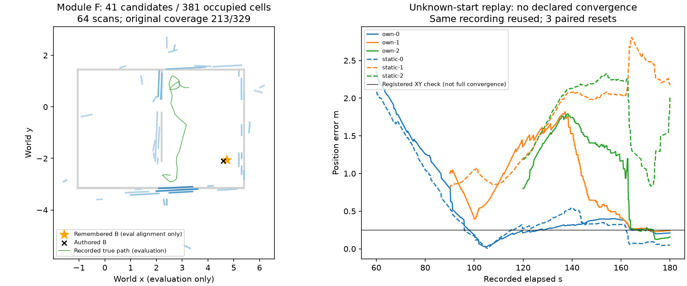

# egomap41 — 자기 지도 기억 내보내기와 쓸모 진단

> **egomap42 감독 감사 정정(새 결과 해석 전):** 이 시험의 자기 지도는 전체179.8초·64스캔의 최종 지도여서, 60/90/120초 이후 재위치 입력을 미리 포함했다. 또한 60초 조건에 미래72.1초 B 관측을 목표로 제공했다. 이는 단순한 비독립 표본 한계를 넘어 **미래 관측 누설**이며 자기/정적 비교의 유효한 증거로 사용할 수 없다. 원본 결과는 보존하고, [egomap42](../2026-10-08-own-map-causal-landmarks/README.md)에서 잃기 전 online snapshot·랜드마크·목표 기억과 잃은 후 영상만으로 다시 평가한다.

2026-10-08 사용자 결정: **검출기 개선 중단**, egomap34 seed32002 구성 고정.
목표를 지도 품질(P≥.90/R≥.70/RMSE≤.15m)에서 **재위치 추정·목표 도달에 쓸 수
있는가**로 변경한다. 이는 결과를 보고 문턱을 낮추는 조치가 아니라 사용자의 목표
변경이다. 과거 품질 관문의 실패는 그대로 남고, 그 관문 없이 모듈 F를 구현한다.

## 실행 전 사전등록

- 원본: `outputs/wall-segment-dev-v1/new-seed`, 소스 `9ff00833`, seed32002.
  tape_v1/SEARCH/real_v1/rotL_v1/RBPF100/±20°/Manhattan/selective/insertion/
  switchable 구성과 원본 `grid.json`·64스캔을 바꾸지 않는다. 검출기 옵션은off.
  영역 P/R63.58/76.03%, 전체 덮임64.74%,381점유칸은 기존 값으로 별도 보존한다.
- 물리·렌더·모델·다른 로봇 지도·지도 합치기·잠금0. TensorBoard 생략 유지.
  raw는 `/Users/changmin/projects/ugrp/outputs/own-map-utility-v1`에 보존한다.
  ENOSPC=HOST_ERROR, 원본 삭제/덮어쓰기0. 결과 후 설정·문턱 변경0.

### A. F 인터페이스

`wall_export=segments_confidence_v1`, 기본off. 기존 격자를 **읽기만** 하며,
이미 있는 `OdomGrid.lines()`의 Hough/TLS·gap split로 자기 LLM용 상위 선분을
표현한다(지도·추정·navigation 변경0). 기존 segments_v1의 별도 지도 재적합은
이번에 켜지 않는다. 전체 내보내기와 상위K=6/ASCII UTF-8≤1024byte 요약을 분리한다.

- `source: own`, robot_id, 관측 ID/시각/원 RGB SHA256, 근거 스캔 수,
  관측자 추정 pose·위치 std, 자기 출발 프레임(x전방/y좌측/CCW+,m/rad).
- 선분 끝점, 근거 셀 수, 기존 TSDF support score와 관측 다양성.
  **support는 보정된 벽 정답 확률이 아니다.** 점유 log-odds를 confidence로 쓰지 않는다.
- 근거가 없는 선분은 confidence/source를 만들어내지 않고 명시한다.
  마지막/최대 관측 위치 std를 함께 표시해 부정확한 지도를 확정 사실로 쓰지 않는다.
- 자기 LLM snapshot 요약만 추가한다. 상대 메시지·배열 전송·merge API 추가0.
  off snapshot/기존 격자·RNG 상태 bytes 동일, 타 로봇 입력 거부 시험.
- 설계: [관측 기억 §4(b)](../../docs/design/2026-09-26-markerless-localization-and-memory.md),
  [arena-wall-map F](../2026-10-07-arena-wall-map/README.md#평가와-조건부-f-내보내기).
  과거 F의 품질 선행조건만 이번 사용자 결정으로 해제한다.

### B. 오프라인 쓸모 시험: 3쌍, 한 녹화의 회고적 재사용

탐색을 마친 **최종 지도**를 기억한 로봇이 위치를 잃은 상황을 모사해,
같은 녹화의 경과60/90/120초부터 끝180초까지 각각 재생한다.
PF RNG seed41001/41002/41003을 두 지도 조건에 동일하게 쓴다.
이미 지도에 쓰인 영상의 재사용이므로 **새 방문/독립 확증이 아니다**.
초기 pose·yaw는 각 지도 free 전체의 균등분포이며 저장된 현재 추정/GT pose,
출발 dock prior를 초기 입자에 넣지 않는다. 입력은 기존 자기 RGB에서 구한 실제
열 접점과 자기 명령뿐이다. 지도는 고정하고 재삽입/정합/새 검출을 하지 않는다.

1. **자기 지도:** 원본381점유칸/관측 free, 자기 시작 좌표.
2. **정답 정적 지도 기준선:** 녹화에 연결된 고정 벽/장애물 기하, 정적지도 좌표.
   사용자가 요청한 기준선 지도 입력만 허용한다. 실시간 GT pose/접촉은 평가 전용이다.
   두 조건은 같은 .1m 격자 표현이며 likelihood raster는 기존1cm 규약을 쓴다.
   자기 지도의 unknown은 초기 free 입자로 만들지 않는다. 지도 면적 차이를 보고한다.

기존 PR406 `2fa4bf9a0e8097bcd4d1e1933b7d04e4d54dd965`의 AMCL/KLD 핵심 함수를
읽기 전용으로 복사해 재사용한다(#406 파일 수정0): likelihood_field의 거리/우도,
augmented_start의 belief_report·Policy, kld_start의 sample_limit/assign/resample/Policy.
출처 파일·행·해시를 기록한다. S2 전체 Runtime을 이식했다고 주장하지 않는다.

- 원본 수치: KLD2000–100000입자, ε=.05/confidence=.99, bin .5m/.5m/10°;
  recovery αslow=.001/αfast=.1, ESS≤N/2; hit/random=.5/.5, σhit=.2m,
  max거리100m·거리장2m·60beam 정수 stride; 이동 관문 .25m/.2rad.
- 카메라 접점은 egomap34의 positive-depth/4m 검출 그대로. 명령 평균은rotL_v1,
  잡음은 기존 `rbpf_rejection.motion_variance`의 RGB 간격값. 모션 재적합0.
- 필요한 어댑터 차이: 벽 사각형 대신 자기 격자도 거리장 입력으로 받고,
  실제RGB열/명령을 녹화로 공급한다. 글로벌 재위치 진단 동안 KLD 정책을 유지한다
  (S2 운반 Runtime의 첫 base motion→고정2000 handoff/active pan 제어는 실행하지 않음).

#### 판정(결과 전 고정)

- 내부 수렴: 기존 `belief_report.resolved`가 연속5개 RGB(1초)에서 true.
  정답 수렴: 그5개가 모두 평가 XY≤.25m, |yaw|≤10°. 첫 시간/오차,
  거짓 내부 수렴, 종료·경로 오차와 σ를 모두 기록한다. GT로 필터를 멈추거나 수정하지 않는다.
- 재위치 쓸모: 정적 기준선 정답 수렴≥2/3이어야 비교가 유효하다. 자기 지도는
  수렴 건수 열세 없음, 공통 수렴 건의 XY 중앙오차≤정적의2배, 수렴시간 중앙값≤2배,
  거짓 수렴0. 공통 수렴0이면 비율은 미정이며 통과가 아니다.
- **감독11:2x 지시 반영(평가 전): 목표는 '탐색 중 본 B 바닥 구역으로 돌아가라'.**
  이전 커밋의 종료 칸 목표를 폐기한다. 자기 지도 목표는 기존 floor_color_v3의
  `own-controller.jsonl.goal`에서 **처음 locally_confirmed_region이 된 후보**의
  그 시각 중심을 사용하고 관측ID·시각·RGB해시를 연결한다(동률은후보ID순).
  기존 자기 카메라 검출을 재사용하며 GT 정렬로 자기 목표를 만드는 행위는 금지한다.
  정적 기준선 목표는 같은 개체 B의 정적지도 region 중심이다. 미관측이면
  '목표 미관측'으로 별도 집계하며 GT 위치로 채우지 않는다.
- 기존 public_ros_v8 NavFn/costmap으로 각 내부 수렴시 처음 목표 경로를 요청한다.
  허용 unknown을 유지하고, 경로의 실제 벽/footprint 충돌은 평가에서만 별도 센다.
  목표 선언은 자기 추정이 자기 조건의 목표≤.20m이고 내부 수렴할 때; 같은 시각
  GT 차체 중심이 정적 B region 안이면 '녹화상 올바른 도달 선언', 아니면 거짓 선언이다.
  부분 관측 중심과 정적 영역 중심 차이도 보고한다. 올바른 도달률 열세 없음·거짓0을 고정한다.
- **한계:** 녹화 명령은 두 조건 모두 같고 새 경로를 따라 움직이지 않는다.
  따라서 경로 있음/녹화상 선언은 반사실적 폐루프 목표 도달 성공이 아니다.
  실제 목표 도달률은 오프라인만으로 검증 불가로 남긴다. 둘 다0인 선언률을
  '열세 없음'만으로 쓸모 통과라 하지 않고 기준선 올바른 선언≥1/3을 요구한다.
  물리 제안은 재위치·녹화상 도달·경로 충돌0 조건이 모두 맞을 때만1회 추천,
  아니면 실패 원인에 맞는 다음 오프라인 점검만 제안한다. 이번 물리는 무조건0.

관측·입자 수,지도 free/occupied칸·면적, 기존 전체/영역 coverage 분모를 함께 보고한다.
각 예측을 먼저 봉인한 뒤 GT 궤적을 채점한다. 예측 API에는 GT 키/파일 인자 없음.

## 출처

- [Fox2001 KLD-Sampling 원문](https://papers.nips.cc/paper_files/paper/2001/hash/c5b2cebf15b205503560c4e8e6d1ea78-Abstract.html).
- Nav2 AMCL 원본 `235fc5ce55bdf94d9be360fdbca39d89dc0e4f74`의 pf.c 및
  likelihood_field_model.cpp, PR406의 기존 이식/라이선스/변경점 명시를 계승.
  웹 blob 열람은 cache miss였고 실제 재사용 코드는 위 고정 Git 객체에서 확인했다.
- 신뢰도: 기존 `harness/self_wall_evidence.py`의 Cartographer TSDF 관측 support(확률 아님).
- 경로: 기존 `harness/public_navigation_monitor.py`, `UnknownNavigator.plan_to`,
  NavFn C++와 ROS inflation. 새로운 제어기/경로 추종은 만들지 않는다.

## 구현 연결 (결과 전)

`harness.self_wall_memory_robust.SelfWallMemory(..., wall_export="segments_confidence_v1")`의
`export_wall_memory()`가 전체 로컬 JSON을 반환하고 `snapshot()`에는
`self_wall_export_text` 요약만 추가한다. 기존 자기 지도 옵션들은 그대로 필요하다.
`observe_wall(..., observation_id=..., frame_sha256=...)`로 실제 RGB 출처를 연결한다.
제공하지 않은 해시/std는 null이며 만들어내지 않는다. 선분 ID는 지도 revision별 ID라
관측이 바뀌었는데 같은 의미인 척하지 않는다. 원본 관측 ID는 유지된다.

저장 녹화에서는 `export_walls(grid, ledger, robot_id=..., wall_export=...,
observations=..., pose_covariance=..., now=...)`를 직접 사용한다. 기존 Hough 요약의
지지 셀과 현재 양의 점유칸 주변 반대각선 거리 안의 과거 ray endpoint를 출처로
연결한다. 이 근접 연결 자체가 참 벽 검증은 아니며 전부 명시적 후보이다.

PR406 원본 함수·행별 해시: [provenance.json](../../harness/own_map_amcl_vendor/provenance.json),
[이식 경계](../../harness/own_map_amcl_vendor/NOTICE.md). 새 외부 의존성/venv0.
기존14 기억 시험과 새8 시험(실제 비어 있지 않은 off snapshot/RNG·출처·peer 격리,
KLD 원본 정의/상수·이동 관문·균등 prior·B 관측 목표)만 실행한다.

### 채점 전 어댑터 오류 기록

실행 소스 `33534bd0`의 첫 own-0 시도는 두 번째 센서 갱신에서
`AttributeError: augmented.ALPHA_SLOW`로 중단했다. AST 복사에서 원본의 tuple 대입
`ALPHA_SLOW, ALPHA_FAST = .001, .1`을 누락한 이식 오류다. 완성 예측/GT채점0.
원본 대입을 바이트 그대로 복원하고 두 번째 센서 갱신·두 상수 검사로 회귀 고정한다.
사전등록 수치/자료/판정은 변경0, 실패 로그 `own-0.log`는 보존하고 재시도 로그를
분리한다. 유효 코호트는 수정 소스에서 동일3쌍1회씩이며 물리0이다.

## 결과 — F 구현 완료, 쓸모 통과는 확인하지 못함

사전등록 `4df2e085` → 감독 목표 정의 반영 `3c3b72cb` → 구현 `33534bd0` →
상수 복사 오류 수정 **`82b8aa9d`**. 수정 후 6조건을 각각 한 번 예측·봉인하고,
별도 프로세스에서 GT를 읽어 한 번 채점했다. 이후 문턱/옵션 변경0.

### F 산출물

- 원본 **381점유칸·2,068관측칸·64삽입스캔 → 41개 벽 후보 선분**.
  전체 JSON [wall-memory.json](results/wall-memory.json), 자기 LLM 상위6개
  요약 [wall-memory.txt](results/wall-memory.txt)는 **903 UTF-8 bytes**다.
  현재 위치 std=.10165m; 모든41선분에 실제 자기 관측 출처가 연결됐다.
  격자 bytes는 원본과 동일하다. 선분 추출은 기억 표현이며 새 지도 품질 향상을 뜻하지 않는다.
- 관측 ID/시각/RGB해시/추정pose·std/스캔수/좌표계/후보 상태/나이 보존.
  `support`는 기존 TSDF 관측 지지도이고 **실제 벽일 확률이 아니다**.
  자기 LLM용 snapshot에 요약만 추가했고 상대 배열 전송·merge·모델 호출은0이다.
- 예시(전체 문구 중 한 항목):

```text
r3/wall/252f0d88a527/0004 (-0.15,3.85)->(1.15,3.91) support=0.48 scans=24 last=r3-obs-000899@180.9 age=0.4000000000000057s source=own
```

좌표는 `r3/own_start`, x전방/y좌측/CCW+,m/rad다. 위에서 본 그림의 세계 좌표
정렬은 평가용일 뿐 JSON에는 world alignment가 없다.

### unknown-start 재생 결과

|잃은 시점(경과)·RNG seed|지도|RGB/실제 열 접점 수|정답 수렴/시간|종료 XY m / yaw°|종료 σXY m / σyaw°|경로 XY RMSE m|측정 갱신/재표본|
|---|---|---:|---|---:|---:|---:|---:|
|60s·41001|자기|601 / 35,372|없음 / 미정|.211 / 1.467|.248 / 7.573|.825|83 / 11|
|60s·41001|정적|601 / 35,372|없음 / 미정|.053 / .807|.129 / 5.359|.746|83 / 14|
|90s·41002|자기|451 / 28,187|없음 / 미정|.241 / .562|.137 / 5.427|.996|68 / 9|
|90s·41002|정적|451 / 28,187|없음 / 미정|2.169 / 175.517|1.760 / 105.133|1.775|68 / 10|
|120s·41003|자기|301 / 18,779|없음 / 미정|.159 / 1.773|.353 / 9.978|1.205|55 / 7|
|120s·41003|정적|301 / 18,779|없음 / 미정|2.012 / 166.567|1.826 / 120.756|1.827|55 / 9|

모든 조건의 입자 수는100,000으로 시작해 최소2,001까지 변했다(원본 KLD의 strict `>`
stop 규칙 때문에 최소2,000보다 하나 많음). 표본은 **한 녹화의 겹치는 재생 구간**이므로
1,353 RGB를 독립 새 프레임/3개 독립 물리 실행으로 합산하지 않는다.

|지도 범위·기존 품질|자기 지도|정답 정적 기준선|
|---|---:|---:|
|점유 / free칸|381 / 1,687|286 / 2,769|
|관측/제공 칸 면적|20.68m²|30.55m²|
|균등 prior free면적|16.87m²|27.69m²|
|기존 영역 P/R|103/162=63.58% / 111/146=76.03%|정답 기하 입력; 검출 품질 지표 아님|
|기존 전체 벽 덮임|213/329=64.74%|전체 정적지도 제공|
|기존 잠재 가시 벽 / 전체|146/329=44.38%|해당 없음|
|원본 삽입스캔 / 벽RMSE|64 / .5204m|새 측정 지도 아님|

서로 다른 지도 범위가 초기 prior의 범위도 바꾼다. 자기 지도의 종료 오차가 작다는
사실을 순수한 지도 품질 효과로 단정하지 않는다. 같은 관측을 기억 구축과 재방문
진단에 쓴 이 결과는 독립 확증이 아니다.

### 수렴·목표 판정과 남은 원인

- 내부 수렴도 정답 수렴도 **자기0/3, 정적0/3**. 정적≥2/3 선행조건 미달로
  오차·수렴시간의 2배 이내 비교는 **미정**이다. 종료 오차를 수렴 오차로 대신하지 않는다.
  각 조건에서 yaw posterior std≤5°인 RGB가 **0개**였다. 자기 지도 종료 yaw 오차는
  작지만 posterior σyaw5.43–9.98°라 원본 수렴 선언에 이르지 못했다.
  정적90/120초 조건은 종료 yaw166.6–175.5° 오차·σyaw105–121°로 전역 방향 모호성이 남았다.
  한계 원인을 지지하는 진단이지 문턱 완화나 새 검출기 튜닝 근거로 쓰지 않는다.
- 자기90초 초기 실제 위치 칸은 map에서 **unknown**이어서 free 균등 prior에 포함되지
  않았다. 다른5조건은free였다. GT로 그 칸을 채우거나 입자를 옮기지 않았다.
  [세부 진단](results/diagnosis.json)에 실제 XY≤.25m/yaw≤10° 구간 수와 별도 기록했다.
- B는 탐색 중 관측했다: **r3-obs-000355,72.1초**, floor_color_v3 후보6,
  11관측, 자기 중심(−1.48375,2.80625)m. GT 좌표로 목표를 생성하지 않았다.
  정적 기준선은 `zone_B` 중심(4.6,−2.1)m. 사후 평가한 두 중심 차이는.1407m이다.
  자기 목표는 부분 관측 범위이며 B 전체 경계를 안다는 뜻이 아니다.
- 목표 미관측0/3, 올바른/거짓 녹화상 도달 선언 **두 조건 모두0/3·0/3**.
  내부 수렴이 없어 NavFn 목표 경로 요청은0회이며, 이를 경로 없음/통과불가로 세지 않는다.
  원 녹화의 세 구간 모두 실제 B 안에 들어간 RGB도0이다. 따라서 도달률 선행조건도
  미달이고, **실제 새 경로 목표 도달은 미검증**이다. 공통0을 쓸모 통과로 보고하지 않는다.

**다음 추천:** 지금 물리1회는 보류한다. 정확한 정적지도에서도 벽만으로 전역 수렴이
확인되지 않았으므로, 이미 관측한 B 색 구역/문 개체를 기존 S2 랜드마크 우도·능동 관측
경로에서 어떻게 대칭 해소에 쓸지 먼저 오프라인 확인하는 것이 다음 후보다(검출기 개선 아님).
지금은 제안만 남기며 구현하지 않는다. 실제 '그곳으로 돌아가기' 검증에는 궁극적으로
새 경로를 수행하는 물리1회가 필요하지만, 이번 녹화 재생으로 대체했다고 주장하지 않는다.



### 검증·보존

관련3파일 **22 passed**, default/off 비어 있지 않은 snapshot bytes와 RNG·원본 map
불변, peer 입력 거부, 원본 AMCL/KLD 정의 해시·두 번째 갱신 시험 통과.
원본 삽입 관문은 변경하지 않았다:901RGB−초기10=891, 이동보류814·통과64,
bootstrap1/정합수락30/거부후삽입28/점부족미시도삽입5. egomap26 삽입 수정on.
새 내보내기 때문에 스캔을 늘리거나 줄인 것이 아니다.

[정확한 지표·판정](results/utility.json), [검증](results/verification.json),
[raw 해시](results/raw-manifest.json). 완성예측6·채점1, 채점 전 어댑터 오류1회 로그도 보존.
raw 절대경로는 위와 같으며 원격 백업이 아니라 로컬 보존이다.
다른 worktree·#406 파일·원래 미추적4파일 불변, 물리/모델/agent_lock0, PR405 DRAFT 유지.
