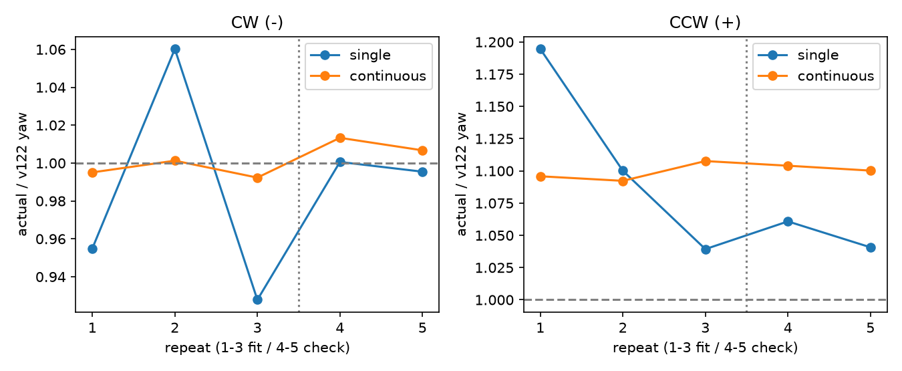

# egomap32 — v122 양방향 회전 모델 진단

2026-10-08 결과 전 사전 등록. egomap31 실행/결과462473cb/e7b28ee4,
seed31001 고정 녹화를 개발 재생으로 사용한다. 기본 off, PR405 DRAFT,
PR406 파일 변경0. TensorBoard 생략 유지. 모델 호출/원격 자원0.

## 표준과 변경 범위

Borenstein & Feng, UMBmark (1994 기술보고서; 확인한 공개 원문은 1995 SPIE판)
§3.2–3.4/p5–8: 양방향 각5회 평균과 반복 산포를 분리한다.
[원문](https://www.cs.columbia.edu/~allen/F17/NOTES/borenstein.pdf).
원본은 차동구동 4×4m 사각 주행이다. 이번에는 사용자 지정 메카넘 회전 펄스만의
**축소 진단**이며 완전 UMBmark/바퀴 간격 추정으로 부르지 않는다.
두 방향의 편향을 합쳐 상쇄하지 않는다. 물리/마찰/롤러 파라미터를 바꾸지 않는다.

v122는 PR406 45b0c173에서 복사한 finite-pulse response,
`harness/data/s2_motion_v7_pulse_cal_v122.json` SHA256
`2245bb9fdcb69d872893dd6ffafb57151750dd42916394a287b6d10bab11d69d`.
PR406 `scripts/fit_s2_pulse_calibration.py`의 펄스 응답 평균/잔차 분리와 같은 배치 추정이다.
현재 모델은 무하중 turn±0.35/0.10초, 꼬리 포함0.20초,
−5.9348°/+5.3691°를 예측한다. egomap27의112.75°/124.98°는 가설 출처일 뿐
새 계수 적합에 쓰지 않는다. SEARCH·강성 on의 새 전용 측정만 적합 자료다.

## 고정 측정 계획·판정

- seed32001, 기존 egomap31 scene/spawn/tape/SEARCH/강성/v7/port, 무하중.
  시작2초 정착 후 좌/우 × 단발1펄스/연속10펄스 × 각5반복 =20블록/110펄스.
  명령±0.35, on0.10초, cycle0.20초, 블록 뒤1.8초 정착.
  반복 홀짝에서 방향/블록 순서를 반대로 하여 순서 효과를 줄인다.
  모두 미리 정한 clock 명령이며 GT에 따른 자세/명령 재설정0.
  20Hz 평가 yaw/차체/휠 상태, 1Hz RGB를 저장한다. 각 블록 시작·0.20/2.00초·
  추가1초에서 평가하여 모델 horizon 이후 회전 잔류도 분리한다.
- 반복1–3 적합, 반복4–5 확인(방향×모드마다2개, 작은 DEV 자료).
  각 방향에서 `실측 yaw/펄스 수 = gain × 기존 예측 yaw/펄스 수` 원점 통과 최소제곱.
  평균·표준편차·방향별 gain 및 단발/연속 차이를 모두 기록한다.
  두 모드의 평균 gain 차이가5% 초과하거나 두 방향 중 하나라도 gain의95% 신뢰구간
  하한이1 이하이면 **일관된 회전 이득 과소 가설 미확인**. 속도 의존/접촉/롤러 영향은
  진단만 기록하며 gain으로 덮지 않는다. 시뮬 결함 자체는 실물 비교 없이 확정하지 않는다.
- 위 가설 확인 + 확인 세트 두 방향 각각 yaw RMSE 감소일 때만
  `motion_model=s2_pulse_v122_rot_v1` 후보를 연결한다(기본off).
  기존 두 turn profile의 yaw mean만 각 방향 gain으로 조정. XY·다른 profile·잡음·
  RBPF/CSM/graph/탐색 문턱은 불변. 실행 입력은 자기 명령만, 평가 GT는 런타임 금지.
- egomap31 전체891 제어프레임 off/on 재생. off full trace bytes 동일 검사.
  회전/yaw RMSE, 종료오차/σ 비율, 영역P/R·덮임·전체벽 RMSE/표본 수 보고.
  새 seed 물리 조건: yaw RMSE·종료오차·과신 비율 모두 감소,
  영역P/R·덮임 비감소 및 벽RMSE 비증가. 하나라도 미달하면 추가 물리0.
  통과 시에만 seed32002/180초 물리1회, egomap31 조건+새 모션 옵션, 결과 후 변경0.

agent_lock null에서만 단독 측정/물리, ugrp_session/표준 workflow, freeze0.
측정60 SIM초 이내/호스트15분, 탐색180초/30분. raw 예산700MiB,
`outputs/pulse-rotation-audit-v1`, 여유10GiB 미만/ENOSPC=HOST_ERROR.
원본/raw 삭제0, 초록 관련 시험 후 커밋·push. supervisor 단계별 확인.
결과는 PR406 코멘트로 공유하되 그 소스/보정표 수정0.

## 측정 전 검증

사전 등록 `6fcde9b4`. 관련 시험8개(측정3/기존 odometry4/workflow plan1) 통과.
off byte golden/기존 profile means·공분산 검사 포함, 물리와 평가 입력 분리 fake backend 확인.
PR406 최신 읽기 전용 `da3d2eb8`의 v122 JSON은 복사본과 SHA256까지 동일하다.
`self_pulse_odom.py:44–48,73–98`에서 .05초씩 response curve를 누적하며,
원본 `fit_s2_pulse_calibration.py:32–43,95–102`는 profile 평균·산포를 별도로 산출한다.
계수·드라이버·평가 코드 hash는 [freeze](freeze.json), PR406 근거는 [source audit](source-audit.json).
물리 실행 전 여유46.66GiB, agent_lock null 확인. 실제 획득 직전에 재확인한다.

## 측정 결과와 고정 기준 판정

실행 **60d4e83368f70cc0ce553d432e032d7cc25f4341**, seed32001,
60 SIM초/20블록/110펄스/1201 평가표본/61 RGB 완료. wall92.65초는 실행 기록으로
속도 벤치마크가 아니다. 잠금 PID55994 단독 실행 후 해제/null, session 종료 확인.
벽 접촉0, 모델0, freeze0. 첫 호출은 축약 SHA가 전체 SHA 검사에서 거부되어
물리/잠금 전에 종료된 HOST_ERROR이며 그 기록도 보존했다. 전체 SHA 재호출만 실제 측정이다.

|방향·모드 (각5블록)|v122 예측 °/펄스|실측 평균±표준편차 °/펄스|실측/예측|
|---|---:|---:|---:|
|CW(−), 단발|−5.9348|−5.8623 ± 0.2989|0.9878|
|CW(−), 연속10|−5.9348|−5.9451 ± 0.0507|1.0017|
|CCW(+), 단발|+5.3691|+5.8368 ± 0.3484|1.0871|
|CCW(+), 연속10|+5.3691|+5.9060 ± 0.0330|1.1000|

연속의 표준편차는 **10펄스 총 yaw/10의 블록 간 산포**이며 개별 펄스 산포와 같지 않다.
5회는 한 seed의 연속 clock 측정으로, 독립적인5개 scene seed가 아니다.
정지 후0.2초 모델 horizon을 넘은 추가1초 yaw는 −0.9163~+0.5063°/블록이었다.
기준을 바꿔 긴 정착 후 yaw로 다시 적합하지 않았다.

|방향|적합 gain (반복1–3)|95% CI (반복 cluster n=3)|단발/연속 gain 차이|확인 RMSE off→fit (°/펄스)|기준|
|---|---:|---|---:|---:|---|
|CW(−)|0.98860|[0.89607,1.08113]|1.54%|0.04631→**0.09977 악화**|이득 과소·개선 미확인|
|CCW(+)|1.10495|[1.01389,1.19600]|1.16%|0.43467→**0.20962**|방향별3조건 통과|

사전 등록한 전체 채택 기준은 **4/6, 두 방향 동시 통과 실패**다.
양쪽을 같은 비율로 늘려야 하는 문제가 아니다. **CCW 방향의 v122 모델 과소 예측**은
이번 자료에서 확인됐지만 CW는 거의 맞는다. 양쪽 이득 재적합은 CW 확인 오차를 악화한다.
결과를 보고 `CCW만 바꾸고 CW는 유지`로 채택 규칙을 바꾸지 않았다.
따라서 `s2_pulse_v122_rot_v1` 런타임 옵션은 **미구현/미채택**, egomap31 on 지도 재생과
seed32002 탐색은 **미실행**이다. 새 물리는 위60초 진단1회뿐이다.
CCW만 재적합·CW 원본 유지·독립 양방향 확인은 다음 후보로만 남긴다.

### 모델 원인과 시뮬 원인의 경계

- 현재 v122 무하중 turn profile은 CW `n=1, s1045`, CCW `n=1, s1042`이다.
  각 방향의 residual variance가0이며 yaw prediction variance는 floor `1e−6 rad²`
  (σ0.0573°)다. 새 단발 표본 산포0.2989/0.3484°와 비교하면5.22/6.08배다.
  이는 원본 pulse model의 표본 부족 근거이며, GMapping noise를 함께 쓰는 RBPF의
  전체 σ가 이 값이라는 뜻은 아니다. 이번에 잡음 크기를 바꾸지 않았다.
- v122의 좌우 절대 회전 차이는0.5656°/펄스지만 새 연속 측정은0.0391°/펄스다.
  egomap27의 양회전 DR112.75° vs 실제124.98°와 CCW 약10% 부족이 같은 방향이다.
  그 수치를 새 적합에 쓰지는 않았다.
- `eval_only/wheels.jsonl`에 휠 각·각속도·모터 torque·접촉 수를 저장했다.
  바퀴/롤러 형상 또는 마찰을 바꾼 대조실험은 없으므로 **시뮬 결함의 원인 부품은 미식별**이다.
  실제 MasterPi 자료도 없어 이 결과를 실물 회전 이득으로 이식하지 않는다.
  물리 모델/마찰/롤러·카메라·강성 파라미터 변경0, GT는 사후 계측/적합에만 사용했다.

### egomap31 비교 상태 (on 미실행을 개선으로 해석하지 않음)

|지표|기존 off seed31001 (봉인된 egomap31)|on|
|---|---:|---|
|yaw RMSE / 종료 yaw|6.995° / −6.324°|미실행|
|종료 XY / σXY / 과신 비율|0.2611m / 0.06894m / 3.787|미실행|
|영역 P / R|42/74=56.76% / 62/119=52.10%|미실행|
|전체 벽 덮임 / 벽 RMSE|124/329=37.69% / 0.75995m|미실행|
|이동 / footprint / RGB / 삽입|8.053m / 2.390m² / 901 / 47|미실행|

off 칸은 종전 봉인 결과를 읽은 것으로 새 재생을 했다고 세지 않는다.
실행 코드/default 모션 모델 변경0, 시험8개 통과(off byte golden 포함),
고정9소스/봉인83파일/기존 미추적4파일 해시 재확인. raw86파일/6297142 bytes 로컬 보존.
[20블록 전수 결과](results/measurement.json), [미채택·미실행 판정/원본 hash](results/decision.json).
raw 경로 `outputs/pulse-rotation-audit-v1/measurement`, PR406에는 위 방향별 결과와 n=1을 공유한다.

[대표 손목 영상4배속](figures/wrist-4x.mp4): 사전 지정 단일 진단 전체,
1Hz 원본61프레임→4fps/15.25초,123691 bytes. 시작/중간/끝 RGB와 전체 decode 확인.
지도/탐색 성공 영상이 아니다. [영상 hash](results/video.json).
