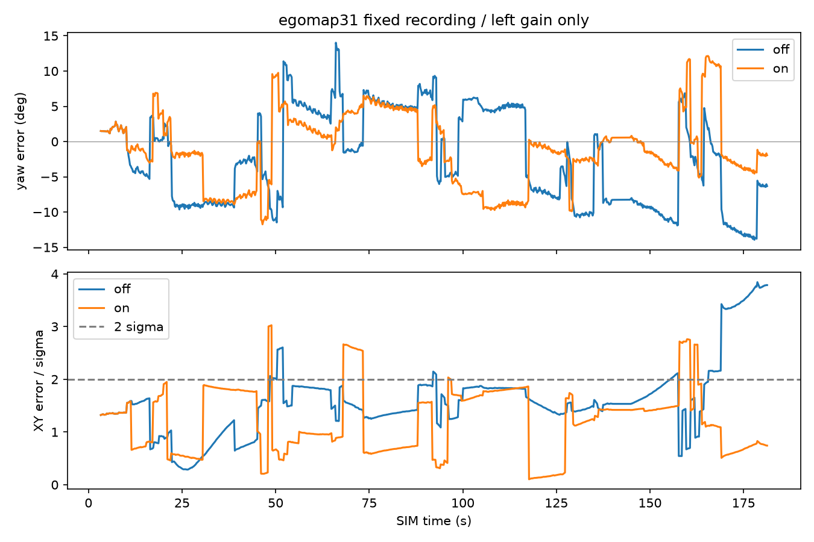

# egomap33 — 사용자 결정: 좌회전만 v122 재적합

2026-10-08 구현·지도 on 재생 전 등록. 사용자가 egomap32 결과를 보고 명시한 새 후보다.
egomap32의 양방향 후보 미달 기록은 보존하며 성공으로 바꾸지 않는다.
새 물리 측정0. 기존 seed32001/110펄스의 반복1–3 적합/4–5 확인을 그대로 쓴다.
이미 본 확인 자료이므로 독립 확증으로 재명명하지 않는다.

## 방법·기준 고정

UMBmark 양방향 평균/산포 분리(§3.2–3.4, [확인한1995 공개판](https://www.cs.columbia.edu/~allen/F17/NOTES/borenstein.pdf))와
egomap32의 원점 통과 최소제곱을 재사용한다. 메카넘 단발·연속 회전만의 축소 진단이며
완전 사각 UMBmark의 바퀴 간격 보정 공식을 이식하는 것이 아니다.

- `motion_model=s2_pulse_v122_rotL_v1`, 기본off(기존 동작).
  무하중 `0:turn:0.35:0.10` profile의 yaw mean curve/endpoint만
  반복1–3 적합 gain으로 변경한다. CW·하중·XY·시간곡선 표본시각·분산·다른 명령 profile은
  v122 bytes 동일. v122 원본 JSON/#406 파일 수정0. 모델 추정·펄스 경로 예측에 같은 profile 적용.
- 적합 관문은 egomap32 그대로: CCW gain95% CI 하한>1, 단발/연속 gain 차이≤5%,
  반복4–5 확인 yaw RMSE 감소. CW는 **사용자 결정대로 원본 동일이면 통과**.
  분할/종료 horizon .20초/가중치/문턱/모션 잡음/RBPF/graph/탐색 설정 변경0.
- 통과 시 egomap31 seed31001 전체891 제어프레임, 자기 RGB/저장된 자기 검출/자기 명령만으로
  off/on을 각각1회 재생한다. off 전체 trace bytes 골든, GT는 두 예측을 봉인한 뒤 평가만.
  on에서도 새 제안 명령을 실행하지 않고 실제 녹화 명령을 넣는다(폐루프 물리 성공 아님).
- egomap32의 후속 물리 관문 그대로: **yaw RMSE·종료 XY오차·과신 비율 감소,
  영역P/R·전체 덮임 비감소, 벽RMSE 비증가** 모두 만족해야 한다.
  graph 결과와 frontend σ를 섞지 않으며 frontend 관문/graph 지표를 나란히 기록한다.
  미달이면 추가 물리0, 결과 후 문턱/옵션 변경0.
- 통과 시에만 아직 실행하지 않은 **seed32002/180초 물리1회**. egomap31의 tape/SEARCH/
  강성/v122/RBPF100/±20°/insertion/selective/Manhattan/switchable/recovery/Nav2 .05m
  구성에 이 motion 옵션만 추가. agent_lock null 대기→단독/dev_light/ugrp_session,
  S2 물리 동시 금지, freeze0/모델0. 소스는 실행 전 커밋·push.

오프라인 raw `outputs/pulse-rotation-left-v1`, 조건부 물리 예산500MiB/30분,
디스크 여유10GiB 미만 및 ENOSPC=HOST_ERROR. 원본 보존/삭제0.
기존 TensorBoard 생략 유지, PR405 DRAFT/병합0. 시험 후 커밋·push,
PR406에 결과 코멘트만 공유. 단계마다 supervisor 재확인.

## 결과 — 새 물리 관문 5/7, 물리0

사전 등록 `3a2c3139`, 구현·재생 소스 `762a952f0786cb56e9ab88c8a2bf34ca2f346b87`.
동일 녹화 off/on 각1회 완료 후 예측을 봉인하고 GT 평가했다. 결과 후 설정 변경0.
좌회전 적합 관문은 통과했지만 영역P/R 비감소 기준2개가 미달이다.
**seed32002는 실행하지 않았다.** S2 잠금 획득/해제·다른 프로세스 변경0.

|110펄스 자료의 사전 분할 평가|값|
|---|---:|
|CCW gain (반복1–3)|1.1049453391322106|
|반복 단위95% CI (독립 반복3)|[1.013892, 1.195999]|
|단발/연속 gain 상대 차이|1.155% (기준≤5%)|
|CCW 확인 RMSE, 반복4–5|0.434668→0.209624°/펄스|
|CW gain / 확인 RMSE|1.0 / 0.046314→0.046314°/펄스|

적합은 [egomap32 원본](../2026-10-08-pulse-rotation-audit/code/fit.py)의
23–44행 원점 통과 최소제곱/반복 단위CI를 그대로 호출한다.
`harness/self_pulse_rotation.py:15–29`는 원본 모델을 복사해 무하중 좌회전 yaw 평균만 곱한다.
모델 출처·입력 해시는 [calibration asset](../../harness/data/s2_pulse_v122_rotL_v1.json),
분할 결과는 [calibration.json](results/calibration.json)에 보존했다.
기존 확인 자료 재사용이며 새 독립 보정 확증은 아니다. 실물/하중/다른 펄스 조건으로 일반화하지 않는다.

|egomap31 seed31001 고정 녹화, online frontend|off: v122|on: rotL_v1|
|---|---:|---:|
|yaw 종료 오차 / RMSE|−6.324° / 6.995°|−1.943° / 5.212°|
|yaw 절대오차 중앙 / 95%|5.740° / 11.916°|3.069° / 9.601°|
|종료XY / σXY / 오차÷σ|0.2611m / 0.0689m / 3.787|0.1265m / 0.1704m / 0.742|
|경로XY RMSE / 2σ 초과 프레임|0.2313m / 112/891|0.2438m / 56/891|
|영역 precision (정확/평가 칸)|56.76% (42/74)|52.86% (37/70)|
|영역 recall (덮은/가시 벽 표본)|52.10% (62/119)|51.26% (61/119)|
|잠재 가시 표본 / 전체 벽 표본|119/329 (36.17%)|동일|
|전체 벽 덮임 / 전체 벽 표본|124/329 (37.69%)|143/329 (43.47%)|
|전체 지도 precision / 점유 칸|39.00% / 359|32.83% / 399|
|전체 벽 RMSE|0.7599m|0.6584m|
|지도 삽입 / 901 RGB|47/901|50/901|
|재표본화 / loop 수락|15 / 0|9 / 0|

graph와 frontend는 **각 조건에서 모든 평가값이 동일**하다(loop 수락0).
[replay.json](results/replay.json)에 각각 보존하며 graph에 frontend 공분산을 붙이지 않았다.
sigma는 XY 공분산 최대 고유값의 제곱근이다. 영역은 기존 카메라 FOV·사거리·벽 가림으로 정한
잠재 가시 영역이며 물체/자기 차체 가림은 반영하지 않는다.
공통 녹화의 실제 이동8.053m·footprint union2.390m²·901 RGB/891 제어프레임은 동일하다.
on이 제안한 행동을 실행한 것이 아니므로 새 탐색 거리·B 도착·접촉 성공으로 해석하지 않는다.

|삽입 단계·정합 사유|off|on|
|---|---:|---:|
|초기 영상 대기 / geometry 있는 제어프레임|10 / 891|10 / 891|
|정착 / 거리 segment 거부|0 / 0|0 / 0|
|GMapping 이동 관문 보류|844|841|
|관문 통과 / 실제 삽입|47 / 47|50 / 50|
|bootstrap / 정합 수락|1 / 22|1 / 15|
|정합 거부 후 삽입|24|34|
|그중 low_overlap / high_residual / search_boundary|8 / 14 / 2|11 / 22 / 1|
|거부 프레임 가중치 갱신 / 재표본화|0 / 0|0 / 0|

`insert_selective_v1`은 양쪽 모두 켜져 있고 이동 관문 통과 후 삽입 누락은 없다.
정합 수락 감소22→15, 거부 증가24→34, 선택 입자/삽입 시점도 달라졌다.
이는 평균 회전 이득 개선이 동일한 지도로 이어지지 않았다는 관찰이며 각 원인의 기여를 분리한
인과 판정은 아니다. 종료 yaw·XY 개선에도 경로XY RMSE는 증가했고, 영역 정확 셀은42→37,
가시 벽 표본 덮임은62→61로 줄었다. 종료 자세 하나만으로 지도 개선을 판정할 수 없다.

|사전 고정 후속 물리 기준|판정|
|---|---|
|yaw RMSE / 종료XY / 과신 비율 감소|3/3 통과|
|영역P / 영역R 비감소|0/2 미달|
|전체 덮임 비감소 / 벽RMSE 비증가|2/2 통과|

관련 시험 **11개 통과** (`test_self_pulse_rotation.py` 3,
`test_self_pulse_odom.py` 4, `test_active_wall_nav2.py` 4).
off의 전체891 trace bytes 및 frontend/graph 지도는 원본과 동일하다.
CW 연속10펄스의 자세·공분산 bytes와 CW/하중/XY/분산/다른 profile 불변도 시험했다.
원본·예측·그림 해시는 [검증 기록](results/verification.json)에 보존한다.
raw는 `/Users/changmin/projects/ugrp/outputs/pulse-rotation-left-v1`에 로컬 보존,
PR405 DRAFT 유지. 결과는 PR406에 코멘트로만 공유하며 #406 코드/모델 수정0.
