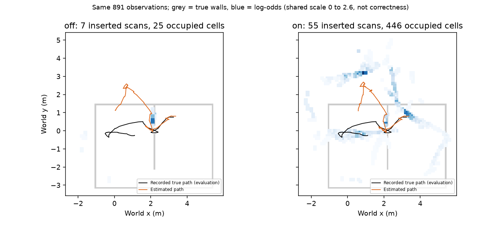

# egomap26 — 먼 벽 누락 / GMapping 삽입 생명주기 (사전 등록)

2026-10-08 사용자 요청. **오프라인만, 물리·모델·agent_lock acquire0**.
egomap25 on 재생/실패 판정 완료 후 시작한다. egomap23의 이미 본 DEV 녹화
`outputs/rbpf-motion-gate-v1/baseline`을 그대로 재생하며 새 확증 자료로 부르지 않는다.
코드/관문 커밋 후 한 번씩 off/on, 결과 후 문턱 변경 없음. GitHub500은 감독 지시에 따라
로컬 SHA로 계속 진행하고 작업 끝에 정상 push 재시도한다. PR405 DRAFT, TensorBoard 생략 유지.

## 수정 전 진단 / 표준 원문 대조

901 RGB 중 초기 준비10개를 제외한891개 모두 검출 선분이 있다. 이동 관문836개,
low_overlap47개, search_boundary1개, bootstrap1개, improved_proposal3개,
insufficient_match_points3개. 지도 삽입7개는 t3.3–36.1s뿐이다.
36.1s 뒤726개는 이동 관문679 + low_overlap46 + search_boundary1 = 삽입0.
120s 주변119.7/119.9/120.1/120.3s도 각각5/6/5/5선분이 있으나 전부 이동 관문이다.
정착/지도 range/중복 거부는0. 검출기 내부에도4m 필터가 있으므로 지도 range0을
검출기 거리 탈락0으로 오해하지 않는다. JPEG 재검출 감사는 별도 표로 기록한다.
경사각 자체를 거르는 분기는 없고 연결 열의 거리/방위 연속성과 최소4열을 검사한다.
다른 로봇 가림은 instance 정답 마스크가 없어 **미계수**; 소프트웨어 거부 사유와 구분한다.

원본 OpenSLAM GMapping 고정 SHA `c716f0192131029b31a49554f8c11353d29819a5`를 직접 읽었다.
원문 파일 URL/sha256은 [sources.json](results/sources.json), 다운로드는 raw의 `sources/`.

|항목|원본 코드|현재 어댑터|수정|
|---|---|---|---|
|누적 이동 관문|[cpp L355–385](https://github.com/ros-perception/openslam_gmapping/blob/c716f0192131029b31a49554f8c11353d29819a5/gridfastslam/gridslamprocessor.cpp#L355-L385)|`rbpf_motion_gate.py` 첫 scan/1m/.5rad|변경0|
|정합 실패 자세/likelihood|[hxx L16–31](https://github.com/ros-perception/openslam_gmapping/blob/c716f0192131029b31a49554f8c11353d29819a5/include/gmapping/gridfastslam/gridslamprocessor.hxx#L16-L31)|`improved_proposal`: 모션 proposal로 fallback, likelihood 가중|변경0|
|실패 뒤 삽입|[hxx L141–167](https://github.com/ros-perception/openslam_gmapping/blob/c716f0192131029b31a49554f8c11353d29819a5/include/gmapping/gridfastslam/gridslamprocessor.hxx#L141-L167): 재표본 유무 모두 registerScan|`self_map_rbpf.py:287` 정합 성공 입자만 삽입|새 옵션에서만 실패 입자도 현재 모션 표본 자세로 삽입|
|실패 뒤 이동량 리셋|[cpp L470–473](https://github.com/ros-perception/openslam_gmapping/blob/c716f0192131029b31a49554f8c11353d29819a5/gridfastslam/gridslamprocessor.cpp#L470-L473)|관문 통과 scan 후 리셋|이미 일치, 변경0|
|선택적 재표본|[hxx L79](https://github.com/ros-perception/openslam_gmapping/blob/c716f0192131029b31a49554f8c11353d29819a5/include/gmapping/gridfastslam/gridslamprocessor.hxx#L79)|Neff<N/2|변경0|

기존 Gaussian improved proposal·모션 잡음·정합 점수는 유지한다. OpenSLAM lidar 전체를
바이트 단위 이식했다는 주장이 아니라 **실패 scan 삽입 생명주기**를 원본과 일치시킨다.
egomap24의 사용자 지정 reject-skip은 원본과 다른 실험 옵션으로 보존하고 이번에는 끈다.
egomap25 yaw도 off. 여러 수정의 효과를 합산하지 않는다.

## 구현 전 고정 옵션 / 관문

|옵션|기본|on 의미|
|---|---|---|
|`rbpf_insertion=gmapping_range_v1`|off|motion gate를 통과한 유효 scan은 정합 실패해도 각 입자의 현재 모션 proposal 자세에서 삽입|
|`rbpf_update=gmapping_motion_v1`|기존 off|이번 off/on 비교 양쪽 on, 1m/.5rad 그대로|
|`wall_confidence=inverse_sensor_v1`|기존 off|이번 양쪽 on. 거리 의존 분산으로 hit/miss 증분을 낮추고 raytrace free carving|
|`rbpf_rejection` / `yaw_prior`|off|이번 모두 off, 새 삽입 정책과 reject-skip/yaw 정책의 암묵적 덮어쓰기는 금지|

`gmapping_range_v1`은 RBPF + motion gate + inverse_sensor_v1을 요구한다.
4m/정착/양의 깊이/자기 로봇/중복 필터는 유지한다. 4m 밖을 강제로 넣지 않는다.
기존 confidence는 `σr=(r²+h²)/(h fy)` (접점1px 전파),
`w_range=res²/(res²+σr²)`이고 입사각·경계 대비/선명도·예측 자세 공분산·정착 factor를 곱한다.
원거리 log-odds 가중은 이미 존재하지만 삽입이 막혀 적용할 기회가 없었다.
이를 재사용하고 새로운 센서 계수/거리 문턱은 도입하지 않는다.
[Thrun ch9 Table9.2 정정](https://robots.stanford.edu/probabilistic-robotics/corrections1/pg288.pdf)과
[Elfes 1989](https://doi.org/10.1109/2.30720)의 hit/free 역센서 누적 원리를 따르며,
상기 가중 식은 기존 구현의 분산 기반 tempering이지 책이 정한 수치나 보정된 벽 정답 확률이 아니다.

**소프트웨어 관문(구현 전 고정)**:
off의 기존 grid/poses/decisions/ledger JSON bytes 동일;
동일 명령의 관문 통과55개/보류836개 유지;
on의 유효 통과 scan55개 모두 삽입(36.1s 이후47개 포함);
단위 시험에서 거부 scan 뒤 누적 이동 리셋·정지 scan 보류·원거리 낮은 증분/free carving 확인.
지도 성능은 같은 영역의 P/R 분자·분모/전체 P/R/벽·경로RMSE/삽입수/거리별 표로 모두 공개한다.
P/R 향상을 통과 조건으로 사후 추가하지 않으며, 소프트웨어 관문 통과를 위치/지도 품질 통과로 부르지 않는다.
이번은 결과에 관계없이 물리0. GT·정적 지도는 봉인된 예측의 평가에만 읽는다.

## 투영 이론과 비교 정의

높이 h=.23m, pitch 편차 .13°,640×480,fy=622.1655px.
바닥 거리 r=h cot(α), `|dr/dα|=(r²+h²)/h`.
pitch 항은 이 Jacobian×.13°(rad),1px 항은 Jacobian/fy.
1px RSS는 독립 잡음이라고 가정한 민감도 비교값이며, 고정 bias를 확률오차로 보정했다는 뜻이 아니다.
양자화만의 표준편차는1px/√12. 표의 구간 중앙 거리 이론과 실제 구간 분포는 같지 않다.
평가용 실제 카메라와 명령 FK로 **동일 픽셀**을 바닥에 투영한 차이를 projection 오차로,
GT 차체 자세로 옮긴 검출점의 최근접 실제 벽 거리를 total_wall 오차로 각각 보고한다.
후자는 검출/대응 오류도 포함한다. 카메라 GT는 진단 스크립트에만 존재한다.

raw `/Users/changmin/projects/ugrp/outputs/rbpf-insertion-v1/`; ENOSPC=HOST_ERROR.
출력/입력 sha256 보존, 다른 worktree·PR406·사용자 미추적 파일 변경0.

구현은 `harness.rbpf_insertion.install(grid, rbpf_insertion='gmapping_range_v1')`.
motion gate 설치 뒤 호출한다. off는 원 객체/메서드 그대로 반환한다.
별도 observer는 기존 RBPF observer를 유지하면서 실패 삽입 조건 한 곳과 판정 메타데이터만 바꾼다.
egomap24 reject-skip과는 어느 설치 순서에서도 충돌 오류로 막는다.
온라인 실행기/기존 기본값은 변경하지 않으며 이번 offline adapter에서만 명시적으로 연결했다.

재생: 기존 venv Python으로 `code/replay.py off`, `code/replay.py on`,
예측 봉인 후 `code/replay.py score`. 구현 전 motion gate6시험,
구현 후 insertion7 + motion gate6 + rejection7 = **20시험 통과**.

## 고정 재생 결과 — 삽입 구현 관문 통과, 지도 품질 악화

사전 등록 `31e99503`, 추정 실행 소스 **`96b3ef3f`**. off/on 각1회, 예측 SHA 봉인 뒤 GT 평가.
후속 변경은 진단의 중복/지도 rejection 명시, 평가 sensor-update 집계, 결과/그림뿐이며 추정 코드·예측은 바꾸지 않았다.
소프트웨어 관문 **5/5 통과**. 이는 지도 품질 성공이 아니다. 입력은 동일891관측·4,565선분이다.
graph를 새로 최적화하지 않은 **frontend 비교**이며 egomap23의 frontend 원본과 bytes를 비교했다.

### 어디서 빠졌는가

|단계|전체|36.1s 이후|단위/해석|
|---|---:|---:|---|
|자기 관측 입력|891|726|프레임|
|검출0열 / 연결 선분0|0 / 0|0 / 0|저장 JPEG 재검출 프레임|
|검출 접점 열|67,669/85,536|55,593/69,696|96열/프레임, JPEG 진단|
|연결 선분|4,930|4,232|JPEG 진단 선분|
|검출 후4m 필터|365|140|선분 거부, 지도 range 카운터보다 앞|
|positive depth 거부|0|0|JPEG 진단 선분|
|정착 / 지도 range / 중복|0 / 0 / 0|0 / 0 / 0|관측/선분/관측|
|GMapping 이동 관문|836|679|프레임, on에서도 동일|
|관문 통과 뒤 low_overlap|47|46|off 프레임|
|관문 통과 뒤 search_boundary|1|1|off 프레임|
|실제 삽입 off → on|7 → 55|0 → 47|프레임|

검출기4m 미만 JPEG 선분 수는 저장 own contacts와 전체·거리별로 일치했다. 그래도 JPEG는 별도 재검출 진단이며
모든 픽셀/특징의 동일성을 주장하지 않는다. 경사 벽 전용 탈락 카운터는 없고 연결 조건에 포함된다.
다른 로봇/차체 가림은 별도 instance annotation이 없어 계수 불가. 가림0이라고 해석하지 않는다.

### 거리별 단계 — 선분 단위, 한 프레임이 여러 구간에 기여

|카메라 거리 m|검출 연결|4m 탈락|이동 관문 보류|off 정합 거부|삽입 off→on|36.1s 이후 입력/보류/거부|
|---|---:|---:|---:|---:|---:|---:|
|0–1|449|0|413|31|5→36|248/218/30|
|1–2|1736|0|1619|114|3→117|1627/1515/112|
|2–3|1409|0|1319|90|0→90|1408/1318/90|
|3–4|971|0|928|39|4→43|809/770/39|
|>4|365|365|0|0|0→0|0/0/0|

구간은 선분 양 끝 중 최대 거리, 마지막은 ≥4m(정확히4m 표본 없음). ≥4m의 후기140개도 검출기에서 제외된다.
**2–3m는 검출1,409개인데 삽입0→90개**, 3–4m는971개인데4→43개다.
즉 먼 벽을 못 검출해서가 아니라 대부분 갱신 주기 보류, 나머지는 정합 실패 시 삽입 누락이었다.

### 거리별 투영 민감도 / 실측 (cm)

|구간 / 대표 r m|pitch .13° 이론|1px 이론|두 항 RSS|동일 픽셀 투영차 중앙 / P95|GT 자세 총 벽 오차 중앙|끝점 n|
|---|---:|---:|---:|---:|---:|---:|
|0–1 / 0.5|0.30|0.21|0.37|1.08 / 1.70|1.04|1087|
|1–2 / 1.5|2.27|1.61|2.78|3.42 / 5.91|1.62|3490|
|2–3 / 2.5|6.22|4.40|7.62|8.38 / 12.69|4.25|2725|
|3–4 / 3.5|12.14|8.60|14.87|15.34 / 20.59|12.94|1828|
|>4 / 5.0|24.71|17.51|30.29|미관측|미관측|0|

3–4m는 중앙15.34cm, 이론 대표3.5m RSS14.87cm 수준이다. 실제 분포와 대표점/독립 잡음 가정이 달라
일치 보정을 뜻하지 않는다. 이 거리에선 .1m 셀보다 투영 민감도가 크다.
5m RSS30.29cm는 **외삽 이론**으로 관측/성능 근거가 아니다. 기존4m 한도는 유지했다.
기존 거리 factor만 보면 r=.5/1.5/2.5/3.5m에서 약1.000/.975/.838/.575이다.
전체 weight에는 입사각·contrast·sharpness·예측 covariance·정착도 곱해져 더 낮아진다.

### 동일 취득 영역의 지도 / 자세

|지표|off|on|
|---|---:|---:|
|삽입 프레임 / 삽입 선분|7 / 12|55 / 286|
|영역 precision|14/17 = 82.35%|35/241 = 14.52%|
|영역 recall|20/137 = 14.60%|38/137 = 27.74%|
|전체 precision (≤.15m)|14/25 = 56.00%|48/446 = 10.76%|
|전체 벽 덮임|20/329 = 6.08%|64/329 = 19.45%|
|벽 RMSE m|.39095|1.25420|
|경로 RMSE m|1.66688|1.75322|
|종료 위치 오차 / σXY m|1.74149 / .008149|1.45059 / .023827|
|종료 e/σ|213.70|60.88|
|재표본 / 거부 정합에서 재표본|21 / 21|29 / 19|
|최종 초기 조상 수 / 입자 수|1 / 100|1 / 100|

취득 범위는 양쪽 **7.379m 이동 / footprint union2.313m² / 잠재 가시137/329벽 표본 / 901RGB·891자세**로 같다.
가시 분모는 카메라 FOV·4m·벽-only 가림이며 물체/차체 가림 미반영. 공간 범위를 새로 넓힌 실행이 아니다.
B 도착false·당시 벽 접촉0도 기존 취득의 기록일 뿐 이번 제어 성능이 아니다.
on 선택 입자 정합 수락은3→25개이나 참 정합이라는 의미는 아니다. 현재 불확실성/누적 방향 오차 속에서
오도메트리 fallback 벽까지 삽입하면 잘못된 벽도 확장된다. 따라서 **삽입 차단 버그는 해결, 위치/지도 신뢰성은 미해결**.
기존 저가중 역센서 모델로 이 자세 오류를 해결했다고 주장하지 않으며 추가 튜닝·물리 제안 없이 종료한다.

검증: 관련20시험 통과, off4종 JSON bytes 동일, 입력/예측 sha256 및 자체 출력 봉인 확인.
관문은 [comparison.json](results/comparison.json), 원본 감사는 [stages-projection.json](results/stages-projection.json),
JPEG 카운트는 [jpeg-detector-audit.json](results/jpeg-detector-audit.json).
원본/새 예측은 로컬 raw에 보존. 커밋 시점 push 대기이며 최종 push/원격 SHA 검증 영수증은
`outputs/rbpf-insertion-v1/push-receipt.json`에 남긴다.
