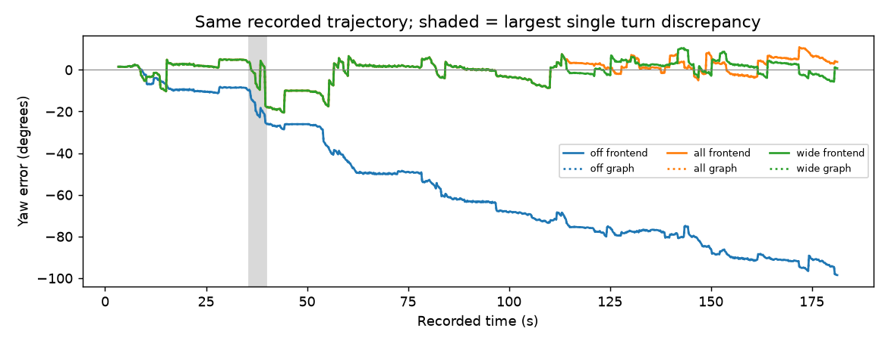
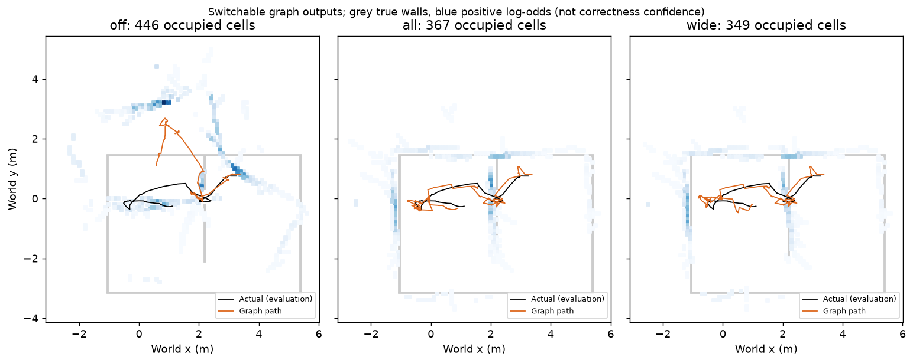

# egomap27 — 회전 오차 감사 / 기존 옵션 결합 (구현 전 사전 등록)

2026-10-08 사용자 요청. egomap23 동일 녹화 DEV 오프라인만, 물리·모델·잠금0.
기본 옵션/기존 결과 보존, 결과 후 문턱·모션 모델 변경0. TensorBoard 생략 유지.
raw `/Users/changmin/projects/ugrp/outputs/rbpf-turn-audit-v1/`, ENOSPC=HOST_ERROR.
단계 사이 supervisor 확인. GitHub500이면 로컬 커밋으로 진행하고 종료 시 정상 push 재시도.

## 수정 전 발견 / 대조

회전 구간은 같은 부호의 회전 명령이 연속된 묶음(중간 다른 명령이면 종료),
마지막 명령 이후 다음 명령 시각까지 tail 포함. 306회전 명령,96묶음.
모든 구간 DR/GT/추정 yaw 변화는 [turns.csv](results/turns.csv),
선택 입자의 **정합 전** yaw는 명령 DR 증분·저장 부모 인덱스로 복원했다.
GT는 이 평가와 이후 봉인 예측 채점에서만 사용한다.

- 35.7–39.9s: DR112.75° / GT124.98° / egomap26 추정108.77°.
  yaw 오차 −9.51→−25.72°. 37.3s에는 GT 방향까지 +19.71°가 필요했으나 low_overlap(.316),
  38.5s에는 +18.33°가 필요한데 overlap1/residual.079m로 잘못 수락했다.
  39.7s에는 +25.60° 필요, low_overlap(.333)/residual7.239m.
- 온라인 RBPF는 `self_map_rbpf.improved_proposal`의 **±8° coarse**, 최대3° fine 추가이나
  최적 오프셋이±8° 경계 이상이면 거부. 사용자 관찰의±15°는 `GraphOptions`의 후처리 loop 검색창이다.
  egomap26 그림은 frontend이므로 graph가 온라인 회전을 수정한 결과가 아니다.
- 전체52 정합 시도 중47개는 GT 방향이 명목±8° 밖. 그래도 이미 틀어진 자기 지도에 대한
  정합과 세계 GT 정렬은 같지 않다. 검색창 제외는 확인됐으나 확대만으로 해결되는지는 미확인이다.

## 결합의 명시적 의미 (새 옵션 기본 off)

기존 `gmapping_range_v1`과 `gmapping_selective_v1`은 map 삽입 의미가 상충하여 설치를 막았다.
전체 on 재생 기록은 없다. 사용자 요청에 따라 `rbpf_composition=insert_selective_v1`을 추가한다.
기존 standalone 옵션은 보존한다. 결합은 다음으로 고정한다.

1. motion gate1m/.5rad·4m·정착·positive depth·v122 명령 평균 그대로.
2. egomap24 공식 비율 모션 잡음, CSM 거부 시 **CSM 가중 갱신/재표본은 생략**.
   수락 시에만 기존 Neff<N/2 선택적 재표본. Manhattan likelihood는 기존처럼 별도 갱신.
3. 유효 scan은 거부돼도 각 입자의 sampled motion pose에서 삽입(egomap26 변경).
   즉 거부 시 map은 갱신하지만 CSM likelihood는 추가하지 않는다.
4. manhattan_v1의 초기 자기 축/분산/모드 처리 그대로. graph own_submap_v1 + switchable_v1을
   **실제로 finalize**한다. frontend 공분산과 graph 최적화 뒤 공분산을 혼동하지 않는다.

이 결합은 사용자 요청 정책이며 GMapping 원본의 거부 likelihood 갱신까지 동일하다는 뜻은 아니다.
표준 원문 확인과 차이는 [egomap26](../2026-10-08-rbpf-insertion/README.md),
[egomap24](../2026-10-07-rbpf-rejection/README.md),
[Manhattan](../2026-10-08-rbpf-manhattan/README.md),
[switchable](../2026-10-07-robust-wall-map/README.md) 그대로다.

## 검색창 비교 / 고정 판정

37.3s의 +19.71° 등 창 밖 증거가 있어 전체 on을 한 번 실행한 뒤, **같은 결합에서 검색창만**
`rbpf_search=correlative_20deg_v1`(기본off)로 한 번 비교한다. 추가 결과 기반 확대는 하지 않는다.
[Cartographer trajectory_builder_2d.lua L35–40](https://github.com/cartographer-project/cartographer/blob/877157a0d91788a7700221d87232d412cb3c1ef4/configuration_files/trajectory_builder_2d.lua#L35-L40)의
real-time correlative 기본 각도 **±20°**를 그대로 택한다. 원본의
[후보 전체 탐색/평가 L77–137](https://github.com/cartographer-project/cartographer/blob/877157a0d91788a7700221d87232d412cb3c1ef4/cartographer/mapping/internal/2d/scan_matching/real_time_correlative_scan_matcher_2d.cc#L77-L137)을 확인했다.
고정 SHA/파일 해시는 [sources.json](results/sources.json). Apache2.0, C++ 복사/새 의존성0.

기존 Olson식 coarse→fine 후보 검색·RBPF Gaussian proposal/importance 계산을 재사용하고
coarse각도 범위와 boundary 판정만8→20°로 확장한다(간격2° coarse/최대1° fine 그대로).
RBPF의 확률적 proposal을 보존하기 위해 Cartographer의 occupancy 점수·Ceres로 교체하지 않는다.
따라서 Cartographer 전체 구현 이식이 아니라 원본의 각도창/후보 열거 규칙을 적용하는 비교다.
XY창±.5m, 모든 정합 수락 문턱, graph±15°, seed 고정. GT로 후보/입자/설정을 선택하지 않는다.

먼저 기존 egomap26 on의 off bytes 회귀. 전체 on1회 → 각도창 확장1회, 모두 예측 봉인 후 GT 평가.
결합 software 관문: 유효55scan 삽입, 거부 CSM weight/resample0, Neff 조건 유지, 옵션off bytes 동일.
성능 관문은 기존 **종료 e≤2σXY AND 영역 P가 egomap26 on보다 개선**을 그대로 사용한다.
graph covariance가 없으므로 이 관문은 frontend에서 판정; graph P/R/경로/종료오차는 별도 행,
graph e/σ는 N/A. 물리는 관문과 관계없이0. 실패 시 추가 튜닝 없이 기록한다.

반드시 같이 보고: 종료오차/σ/eσ, yaw 추이, 영역 P/R 분자분모, 전체 덮임, 점유셀/삽입수,
취득7.379m·2.313m²·가시137/329벽 표본·891자세. 결과가 작은 표본인지도 그대로 보인다.

구현 시험: composition6 + rejection7 + Manhattan6 = **19개 통과**.
새 off 경로는 기존 egomap26 on 전체 prediction JSON bytes와 비교하며, 이때 graph는 별도 산출물이다.

## 결과 — 전체 on 개선, 고정±20° 종료 관문 통과 (물리0)

사전 등록 **5ee4e580**, 실행 소스 **cc6fd198**. off/all/wide 각각1회, 전부 예측·graph 봉인 후 GT 채점.
그 뒤 추가된 것은 평가 prior yaw분산·지표의 미기록 값 표시·표/그림뿐이다. 추정 코드/설정/예측 변경0.
off는 egomap26 on 전체 prediction JSON과 **bytes 동일**, graph는 이번에 별도 finalize했다.

### 회전 명령 구간 (DR 오차 절댓값 상위8, 전체96개는 CSV)

|구간 s|명령 수|DR 회전 °|GT 회전 °|egomap26 추정 회전 °|yaw 오차 시작→끝 °|
|---|---:|---:|---:|---:|---:|
|35.7–39.9|21|112.75|124.98|108.77|-9.51→-25.72|
|59.3–62.1|14|75.17|83.09|76.22|-42.03→-48.90|
|80.3–82.7|12|64.43|71.50|67.94|-52.86→-56.42|
|112.3–114.7|12|64.43|70.99|64.76|-68.52→-74.74|
|54.3–56.3|10|53.69|59.29|53.60|-34.81→-40.50|
|7.9–9.7|9|48.32|53.77|49.17|2.21→-2.40|
|146.5–147.9|7|37.58|41.70|37.65|-80.54→-84.59|
|57.1–58.3|6|32.21|35.97|34.51|-38.89→-40.35|

회전 구간 합산 DR−GT **−99.79°**: 양의 회전−95.67°, 음의 회전−4.12°.
35.7–39.9s는 단일 최대12.22° 부족이나 합산 부족분의12.25%다. 한 번의 회전에서 경기장이
고정25–45° 돌아간 것만으로 설명되지 않고 같은 방향 편향이 누적돼 종료 yaw−98.52°가 된다.
모션 모델을 재적합/보정하지 않았다. 명령별 실제 응답 차이를 평가로만 기록한다.

### 35–45s 정합이 못 고친 이유 (egomap26 frontend)

|시각 s|필요 GT yaw 보정 °|prior yaw σ °|CSM 판정|overlap|잔차 m|
|---|---:|---:|---|---:|---:|
|36.1|10.78|1.246|insufficient_match_points|—|—|
|37.3|19.71|0.140|low_overlap|0.316|0.594|
|38.5|18.33|0.140|improved_proposal|1.000|0.079|
|39.7|25.60|0.140|low_overlap|0.333|7.239|
|44.5|24.68|0.925|low_overlap|0.455|0.536|

37.3s의 필요 보정은140.42σ,38.5s는130.62σ 수준. 원본 RBPF는
`log(sensor likelihood)+log(motion prior)`를 최적화하므로, 매우 작은 모션 분산이 큰 회전을
강하게 불리하게 만든다. 정합 선택점은 창 가장자리도 아니어서 `search_boundary=false`이고
low_overlap으로 거부되거나 이미 틀어진 자기 지도에 잘 맞는 것처럼 수락된다.
필요한 GT 절대 보정과 자기 지도 상대 정합은 구분해야 한다. 정합창만 키우면 해결된다는 근거는 아니다.

### 동일891관측 재생

`off`=egomap26 insertion on, `all`=삽입+selective+Manhattan+switchable,
`wide`=all에서 온라인 각도창만±8→±20°. graph창±15°는 모든 조건 동일.

|지표 (frontend)|off|all|wide|
|---|---:|---:|---:|
|종료 위치 오차 m|1.45059|0.22283|0.13059
|σXY m|0.02383|0.07774|0.09595
|e/σ|60.880|2.866|1.361
|yaw 종료 / RMSE °|-98.52 / 62.67|3.78 / 5.64|0.76 / 5.46
|영역 P|35/241=14.52%|89/127=70.08%|83/110=75.45%
|영역 R|38/137=27.74%|69/137=50.36%|74/137=54.01%
|전체 P|48/446=10.76%|191/367=52.04%|183/349=52.44%
|전체 벽 덮임|64/329=19.45%|194/329=58.97%|194/329=58.97%
|벽 / 경로 RMSE m|1.2542 / 1.7532|0.4227 / 0.2024|0.4019 / 0.2440
|2σ 초과 시각|729/891|286/891|525/891
|삽입 / 재표본|55 / 29|55 / 12|55 / 13
|거부 CSM에서 재표본|19|0|0

범위는 세 조건 동일 **7.379m·footprint union2.313m²·잠재 가시137/329벽 표본·901RGB/891추정시각**.
점유셀446/367/349, 영역 precision 분모241/127/110. 같은 녹화 재생으로 관측 영역을 넓힌 것이 아니다.
가시성은 FOV·4m·벽-only 가림이며 물체/자기 차체 가림 미반영. 전체/영역 수치를 합산하지 않는다.

### graph/switchable 실행을 별도로 확인

|조건|수락 loop|후처리|종료 m|영역 P/R|
|---|---:|---|---:|---|
|off|0|no_loop_constraints|1.45059|14.52% / 27.74%|
|all|0|no_loop_constraints|0.22283|70.08% / 50.36%|
|wide|0|no_loop_constraints|0.13059|75.45% / 54.01%|

switchable 옵션을 실제 호출했으나 수락 loop가 없어 최적화할 switch가0개다.
graph 지도·경로는 각 frontend와 같으며 **graph의 효과가 있었다고 합산하지 않는다**.
graph covariance/eσ는 N/A, frontend covariance를 graph posterior로 대신 쓰지 않는다.

### 판정과 한계

- 결합 software 관문(all/wide 각각): 삽입55, 거부 CSM weight0·재표본0 — 3/3 통과.
- 성능 관문 all: P개선 통과, 종료2σ 실패(eσ2.866) → 실패.
- 성능 관문 wide: P개선·종료2σ 모두 통과(eσ1.361) → **사전 종료 관문 통과**.
- 하지만 wide 경로의525/891시각은2σ 밖이다(all286/891보다 많음). 초기 조상도 둘 다1개로
  재표본 후 Neff100이 장기 다양성 회복을 의미하지 않는다. 전체 경로 uncertainty calibration 통과가 아니다.
- wide의 경로 RMSE .244m는 all .202m보다 나쁘다. 종료 한 점/영역P만으로 전반적 우월성을 주장하지 않는다.
- 각도창 확대 전후 최초 추정경로 차이는114.3s(수치1e−9 초과)다. 따라서35–40s 개선은
  **옵션 결합 효과**이며 창 확장만의 효과가 아니다. all의 boundary5→wide0이나, 확장된
  −14°(61.5s)/−12°(83.3s) 최적 후보도 low_overlap으로 거부된다.
추가 문턱·잡음·seed 변경/재튜닝 없이 종료. 물리0, 물리 성능/독립 확인 자료로 해석하지 않는다.

검증: **19시험 통과**, py_compile/diff 검사, off 전체 prediction SHA/bytes 동일.
입력/예측 해시는 [verification.json](results/verification.json), [raw-manifest.json](results/raw-manifest.json). 최종 push/remote SHA/DRAFT는 outputs/rbpf-turn-audit-v1/push-receipt.json에 기록한다.