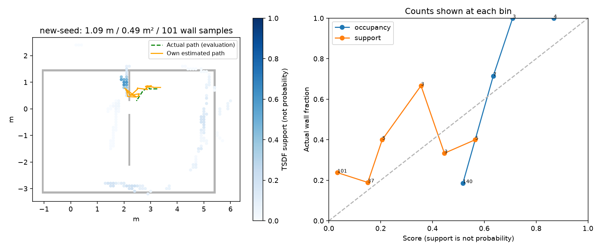

# egomap28 — egomap27 wide 새 seed 단일 물리 확인 (실행 전 사전 등록)

2026-10-08 사용자 요청. egomap27은 egomap23 녹화로 개발한 결과이며 확증이 아니다.
이번에는 **seed 28001, 물리 취득 1회, 180 SIM초**를 결과 전에 고정한다.
실행/추정 설정·문턱은 결과 후 변경하지 않는다. 하드웨어 실험이 아닌 로컬 MuJoCo DEV 확인이다.
모델 호출/유료 자원/freeze 0. S2와 동시 물리 금지, agent_lock이 null일 때만 취득한다.
TensorBoard 생략 유지. 단계 사이와 커밋 직후 supervisor 파일을 확인한다.

## 고정 조건 / 원본

- egomap23과 같은 map `zone_wide_two_doors_final_v3`, r3 시작 `[3.25, .75, pi]`,
  tape_v1, SEARCH `{1:2000,3:740,4:2320,5:1320,6:1500}`, servo_stiffness=real_v1.
- 카메라 v3/640×480, drive v7, min_wheel_cmd=real_v1, s2_pulse_v122,
  cargo_noslip_v1, mesh roller, idle_robot_contacts=off. 캡처 0.2초, 처음2초 관측만.
- 탐색 `frontier_rbpf_v1` + `information_gain_v1` / public_ros_v8 원본 그대로.
  취득/탐색 seed만 22001→28001. RBPF 내부 seed 20261006은 wide 그대로 보존한다.
- `odom_grid_v1`, RBPF100, positive_depth_v1, own_submap_v1, inverse_sensor_v1,
  switchable_v1, tsdf_weight_v1. motion gate→selective→composition→Manhattan 순서:
  `gmapping_motion_v1`, `gmapping_selective_v1`, `insert_selective_v1`,
  `correlative_20deg_v1`, `manhattan_v1`.
- [egomap27 wide](../2026-10-08-rbpf-turn-audit/README.md)의 설정/코드 그대로 연결한다.
  새 추정 알고리즘·모션 재적합 없음. 활성 탐색의 기존 가상 관측 정보이득 계산도 변경하지 않는다.
  가상 후보의 정합은 기존 근사 모델이며, 실제 온라인 필터만 wide 결합을 사용한다.
- graph는 egomap23처럼 온라인 10초 주기. egomap27의 끝시점 오프라인 graph만 실행한 재생과
  취득 경로가 달라질 수 있다. graph posterior 공분산은 없으므로 frontend σ를 대체 사용하지 않는다.
- 기존 기본 옵션/옛 runner는 변경하지 않는다. 새 실험 runner에서만 명시적으로 wide를 켠다.
  새 관측 기록(공분산·온라인 지도 스냅샷)은 제어에 되먹이지 않는다.

## 사전 판정 / 지표 (변경 없음)

egomap23의 실용 관문을 그대로 보고한다: 180초 완료(또는 B 도착), 벽 접촉0,
잘못된 문 시도0, 이동≥3m, footprint union≥0.75m², 잠재 가시 벽 표본≥50,
영역 precision≥0.70, recall≥0.50, 벽 RMSE≤0.15m, 경로 RMSE≤0.25m.
추가로 egomap27의 **frontend 종료 e≤2σXY, 영역 P>egomap26 on의35/241**을 별도로 판정한다.
두 관문과 frontend/graph 결과를 합산하지 않는다. 새 자료 1건이며 일반적 성공률로 확대하지 않는다.

기준선은 **원래 egomap23 물리 결과**(개발 wide 재생으로 바꾸지 않음): 종료1.74149m,
σXY0.008149m, e/σ213.703, 영역P14/17=82.35%, R20/137=14.60%,
전체 덮임20/329=6.08%, 이동7.379m, footprint2.313m², 901RGB/891자세/7삽입,
B 확인40.4초·GT도착false, 벽 접촉0. egomap27 개발 wide 결과는 참고 행으로만 분리한다.

평가는 봉인된 prediction 뒤에만 GT를 읽는다. 시작 GT 변환은 평가 정렬 전용,
실제 좌표·관절·접촉은 제어/지도/목표 선택에 전달하지 않는다(기존 abort-only 물리 안전은 유지).
벽0.1m 표본/0.15m 허용오차, 실제 카메라 FOV·4m·벽 가림의 잠재 가시 영역으로 P/R을 산출한다.
물체/자기 가림은 분모에 미반영이라는 기존 한계를 명시한다. 전체 덮임과 분자/분모도 항상 보고한다.
B 자체 확인과 GT 도착을 구분하고, 잘못된 문 지표는 실제 통과가 아닌 기존 경로 계획 proxy이다.

## 실행·산출물·중단

raw `/Users/changmin/projects/ugrp/outputs/rbpf-wide-confirm-v1/new-seed/` (예상≤500MiB),
평가/4배속 MP4는 그 상위 디렉터리, 작은 지도 PNG/표/해시는 이 실험에 보존한다.
901프레임이면 소스5Hz→20fps 영상 약45초: 왼쪽 자기 손목 RGB, 오른쪽 그 시각까지의
**실제 온라인 frontend 지도 스냅샷**과 경로(회색 GT 벽/실제 경로는 평가 표시만).
끝 지도는 graph와 frontend를 구분하고 TSDF support는 확률로 부르지 않는다.

소스 사전 커밋→관련 오프라인 시험→소스 커밋/push→잠금 확인→물리1회→봉인→판정 순서.
서버500이면 로컬 SHA/추적파일 clean/입력 해시 확인으로 진행하고 push 대기를 기록한 뒤 종료 때 재시도.
시작 후 실패·HOST_ERROR·ENOSPC도 단일 취득 결과로 보존하고 재실행하지 않는다.
wall 상한30분; 물리 낙하/기울기/접촉/비유한값은 기존 abort, 보수적 판단은 dev_light 기록.
잠금은 실제 실행 드라이버 PID가 보유·종료 후 release. 다른 작업 프로세스/파일은 건드리지 않는다.

다음 후보만 기록: egomap27의35.7–39.9초 DR112.75° vs GT124.98°(12.22° 부족).
이번에는 v122 계수·회전 응답·잡음·검색창·모든 판정값을 수정하지 않는다.

실행 준비: 사전 등록 `2f4a55c8` 전 composition6 통과. 연결 후 runner2 + composition6 +
workflow plan1 = **9시험 통과**. wide 설치가 egomap27 재생 설치와 bytes 동일하고,
정보이득 가상 탐색이 실제 필터/RNG를 바꾸지 않음을 확인했다. 기본 off bytes 검사도 통과.
추정·탐색·물리 조건의 고정 해시는 [freeze.json](freeze.json); 기존 제어 모듈 수정0.

## 결과 — 새 물리 확인 실패, 추가 실행·튜닝 없음

사전 등록 **2f4a55c8**, 실행 소스 **cff655e4d02bf11917b2ebe146de1265f80146a0**.
소스 push/해시 확인 후 agent_lock PID37985로 단일 실행했다. 180초/901RGB 완료,
실행 소요569.68초(경쟁 성능 비교 아님), 모델0·freeze0, 세션 종료·잠금 release 확인.
예측을 봉인한 뒤 GT 채점. 새 seed1건에서 **종료2σ 관문 실패(5.377σ), 실용 관문 실패**다.
개발 녹화의 성공을 새 녹화 성공으로 승계하지 않는다.

### 원래 물리 기준선과 나란히 (분모·관측 범위 포함)

|지표|egomap23 원래 baseline, seed22001|egomap28 새 wide, seed28001|
|---|---:|---:|
|완료 SIM초 / RGB / 추정 시각|180 / 901 / 891|180 / 901 / 891|
|종료 위치 오차 m|1.74149|0.64739|
|frontend σXY m / eσ|0.008149 / 213.703|0.120402 / **5.377**|
|경로 2σ 초과 시각|729/891|706/891|
|영역 precision|14/17 = 82.35%|15/86 = **17.44%**|
|영역 recall|20/137 = 14.60%|31/101 = **30.69%**|
|전체 점유 precision|14/25 = 56.00%|38/154 = 24.68%|
|전체 벽 덮임|20/329 = 6.08%|62/329 = **18.84%**|
|잠재 가시 벽 표본 / 전체|137/329|101/329|
|이동 거리 m / footprint union m²|7.379 / 2.313|**1.090 / 0.485**|
|지도 삽입 scan / 점유셀|7 / 25|22 / 154|
|벽 / 경로 RMSE m|0.39095 / 1.66688|0.41253 / 0.57845|
|B 자기 확인(시작 후 s) / GT 도착|40.4 / 아니오|35.8 / **아니오**|
|벽 접촉 / 잘못된 문 계획 proxy|0 / 10|**0 / 5**|
|재표본 / 거부 CSM 재표본|21 / 21|5 / **0**|
|거부 CSM 가중 갱신|옛 기록 미기재|0|
|점유 ECE(진단) / TSDF support gap|0.1639 / 0.4425|0.3142 / 0.1635|

graph는 완료됐으나 최종 loop 수락0, `no_loop_constraints`, switch0이다.
frontend와 graph의 지도·위치 지표가 동일하다. e/σ는 **frontend에만** 붙이며 graph σ는 N/A.
TSDF support gap은 확률 calibration이 아니다. 가시 영역은 기존처럼 벽-only 가림 기준이므로
물체/자기 가림을 제외한 참 가시 마스크라는 주장은 하지 않는다. B 자기 확인은 GT 도착/정확한 B 위치 판정이 아니다.

개발 참고(동일 egomap23 재생): egomap27 wide 종료0.13059m, eσ1.361, P83/110=75.45%,
R74/137=54.01%, 덮임194/329=58.97%. 이번 새 취득과 표본·경로가 달라 합산하지 않는다.

### 사전 관문 그대로 판정

- egomap27 종료 관문: 영역P>35/241 통과, e≤2σ 실패 → **전체 실패(새 녹화0/1)**.
- egomap23 실용10항목: 완료·접촉0·가시표본≥50만 통과(**3/10**, 전체 실패).
  잘못된 문0/이동3m/면적0.75m²/P0.70/R0.50/벽RMSE0.15m/경로RMSE0.25m는 미달.
- 작은 범위에서의 성공으로 해석하지 않는다. 새 실행은 이동1.09m/면적0.485m²이며,
  영역 P/R 분모86셀/101벽 표본이다. 180초 완료는 경기장 탐색 완주가 아니다.

### 종료 전 정지 구간 (수정 없이 기록)

마지막 이동 명령은 절대43.9초(시작 후42.6초), 마지막 지도 삽입은44.1초다.
이후 **137.4초/687프레임 모두 hold**, 상태는 no_path6 / recover_wait24 /
recovery_exhausted657이며 실제 잔류 이동은0.000986m였다.
전체 motion gate 보류866, improved_proposal9, insufficient_match_points4,
high_residual3, low_overlap3, search_boundary2, bootstrap1이다.
이전의 '이동하면서 삽입만 멎음'과 달리 이번 후반부는 발행 명령부터 hold였다.
현재 자료로 회복 소진의 근본 원인을 새로 확정하거나 탐색기를 수정하지 않는다.
종료 yaw 오차−3.35°, yaw RMSE6.49°여도 XY 오차0.647m가 남는다.
DR112.75° vs 실제124.98° 회전 부족은 **다음 후보로만 유지**, 이번 재적합/계수 변경0.

### 증거와 확인

- [전체 비교 JSON](results/comparison.json), [정지/정합 집계](results/diagnosis.json), [raw 해시](results/raw-manifest.json).
- [지도·신뢰도 그림](figures/new-seed.png), [영상 확인 이미지](figures/video-check.jpg).
- [4배속 영상](figures/wrist-map-4x.mp4): 1280×480, 20fps, 901프레임, **45.05초**.
  22개의 실제 온라인 지도 스냅샷을 해당 시각 이후에만 표시한다. 최종 지도 소급 채우기0.
  raw 원본 영상은 `outputs/rbpf-wide-confirm-v1/wrist-map-4x.mp4`에도 보존.
- raw 로컬942파일118,940,587bytes(추후 push 확인 파일 제외), 원격 raw 백업 아님.
  영상은890,953bytes여서 1MiB 이하 대표 사본을 실험에 함께 보존한다.
- 최종 확인: 관련9시험 통과, 기본off bytes/실행 연결 동일성/forecast 격리/워크플로 계획,
  py_compile/diff 및 봉인 SHA 검사 통과. 영상 ffprobe/시작·중간·끝 실제 디코딩 확인.
  [검증 기록](results/verification.json)에 시험 범위·사용자 미추적 파일 해시를 보존했다.

