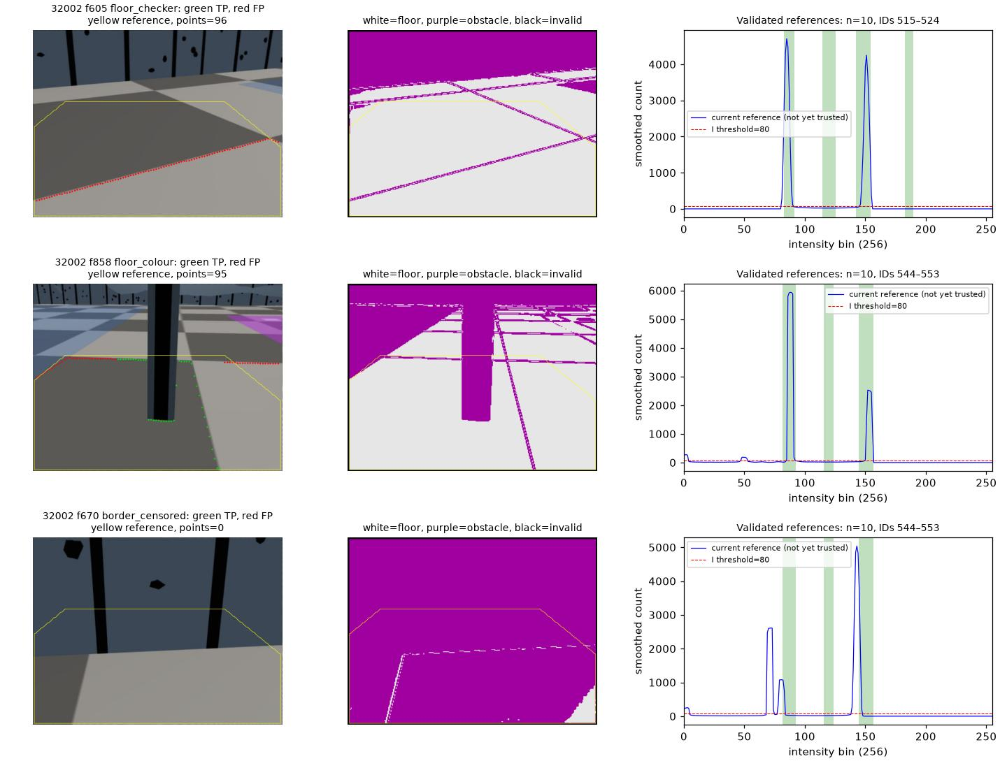
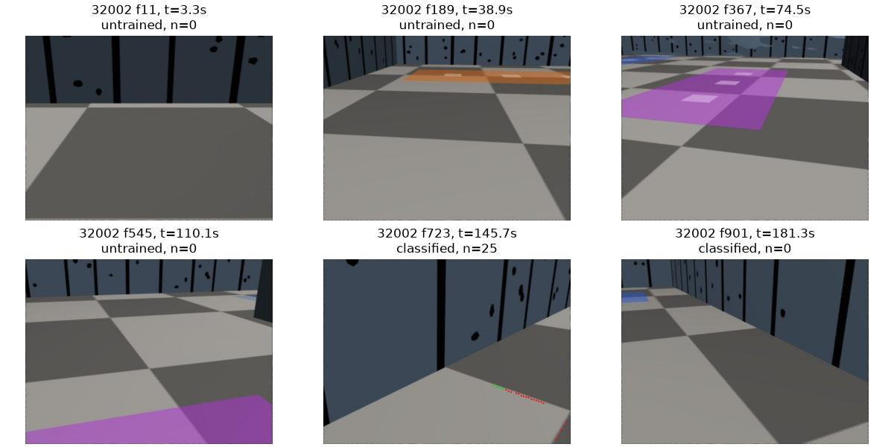
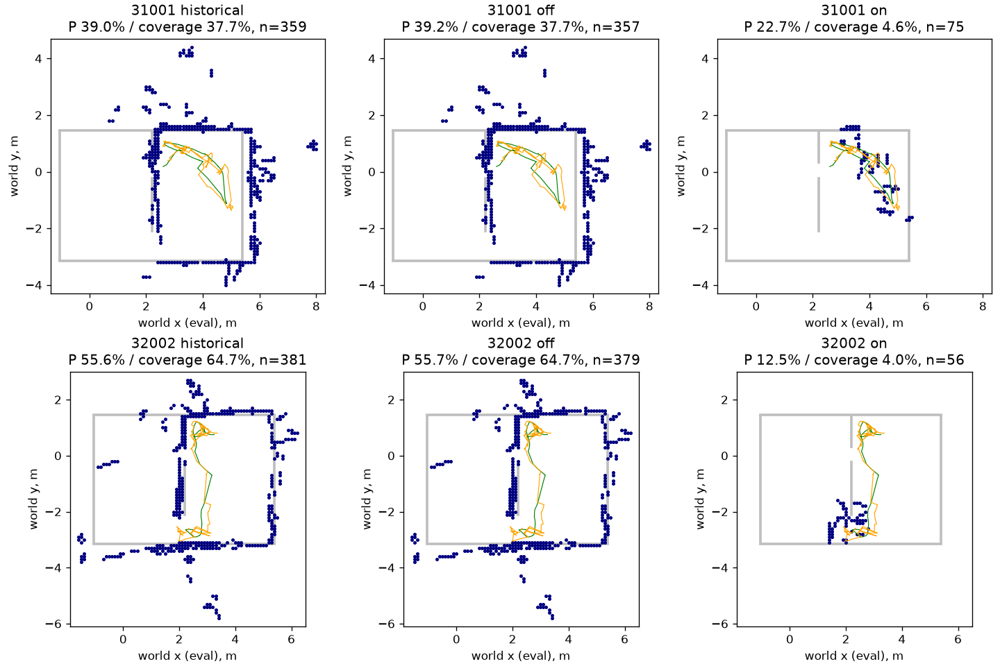

# egomap39 — Ulrich 바닥 외형 분류와 시간 참조 큐

2026-10-08. 오프라인 only, physics/render/MuJoCo/model/lock0. PR405 DRAFT.
TensorBoard 생략 유지, 다른 worktree/PR406 수정0. 기본off·기존 출력 bytes 보존.

## 실행 전 사전 등록

- `contact_rule=floor_appearance_ulrich_v1`, 기본off. egomap37의 단일 프레임 방식과
  egomap38의 edge 연결은 그대로 보존한다. 이번에는 RGB HSI 외형으로 분류한다.
- **관문: 검출점 P≥.90 AND R≥.50.** seed31001에서만 개발 → 소스/설정/결과 해시
  동결 커밋 → seed32002 on1회 평가. 실패해도 재튜닝0. 두 녹화는 과거에 본 자료이며
  독립 미개봉 확증으로 부르지 않는다. 지도 절대기준 P≥.90/R≥.70/RMSE≤.15m도 기록.
- 원문 [Ulrich & Nourbakhsh, AAAI 2000 §3–7](https://www.cs.cmu.edu/~illah/PAPERS/abod.pdf)
  직접 확인. 이미지5×5 Gaussian → HSI → 전방 사다리꼴 H/I histogram → 평균필터.
  hue<60 또는 intensity<80 count이면 obstacle. 열별 최하단 obstacle 접점 사용.
- §5: 각 프레임 histogram+odometry를 candidate queue에 추가; 현재와 방향 차이
  >18° 항목 먼저 폐기, 위치 차이 >1m인 나머지를 reference queue로 이동.
  reference histogram의 허용 bin을 OR 결합. §6 assistive 모드(동적 참조만), 최근10개 유지.
  시작 학습 자료가 없으므로 queue가 차기 전은 미학습/검출 없음으로 기록한다.
  같은 프레임의 점/면 API는 공유 상태 캐시를 사용해 큐를 두 번 갱신하지 않는다.
- **원문에 형태학/작은 blob 제거는 없다.** §7은 추가 blob filtering을 하지 않았다고
  명시한다. noise 처리는 원문 Gaussian과 histogram 평균만; 새로운 opening/closing0.
  bin 수, histogram 평균 폭, HSI 유효 수치, 참조 폭은 원문 미명시다. 아래 값을
  논문값으로 주장하지 않고 기존 코드값/기하로 실행 전에 고정한다.

|항목|고정값·근거|
|---|---|
|처리 이미지|320×260(원문); native640×480 보정 후 resize, 분류mask는 nearest로 원 해상도 복원|
|HSI bins / 평균 폭|256 / 5bin, 기존 `wall_floor_boundary.py`의 수치; 원문 미명시|
|H 유효값|I>10/255, S>.1, 기존 수치; 원문 미명시. I=(R+G+B)/3|
|참조영역|차체 전방 x0–1m, 좌우±.30m; 깊이1m 원문, 폭은 기존 구현 고정|
|histogram 문턱|H60/I80 count, 원문. 정규화/사후 문턱 변경 없음|
|갱신|방향>18° 폐기 우선, 거리>1m 승격, 최근10개 OR; 원문 그대로|
|odometry 입력|own-controller의 발행 펄스 `predicted_delta`를 SE(2) 누적. GT/정합 pose 미사용|
|출력|기존96열/면 연결/positive_depth/4m 그대로. border/self 가림이면 해당 열 abstain|
|영상 유효영역|undistort support와 Gaussian5×5 support만; semantic morphology 아님|

변경 이유: 로봇의 카메라·FOV·높이가 논문 플랫폼과 달라 참조 사다리꼴은 명령 FK로
투영한다. RGB 크기 변환은 FOV를 바꾸지 않고 분류용 격자만 바꾼다. 논문의 encoder 대신
로봇이 아는 명령 DR을 쓴다. 메카넘 횡/후진에서도 원문의 두 수치 규칙은 바꾸지 않는다.
따라서 '지나간 곳은 안전' 가정과 DR 오차가 깨질 수 있으며 이를 평가에 기록한다.
참조에 체크 두 색이 실제로 들어가는지 histogram/RGB로 확인하되 색을 강제로 추가하지 않는다.

## 고정 평가

891 own-contact 프레임/seed. 원본 추정 자세와47/64 삽입 시각은 고정, RBPF 재추정0.
참조 갱신용 DR은 별도로 누적하며 지도 자세를 교체하지 않는다. off/on 공통으로 저장된
정합 후 공분산에서 기존 inverse_sensor confidence를 재계산(egomap37/38과 동일).
다중시점/segments 필터 off. 사용자가 요청한 칸 지도 평가를 주 비교로 한다.

점 P/R는 egomap38의 GT-body .15m 허용/프레임별96열 잠재가시 첫 벽 접점 분모 그대로.
GT는 예측 봉인 후 평가에만. 전체891프레임(미학습 포함) 관문, 학습 후 보조값은 따로.
지도 전체 P/R=coverage, 영역 P/R, 벽RMSE, 칸수 모두 보고. 전체 벽329표본·영역119/146.
과거 egomap34의32002 **영역P/R63.6/76.0%, 전체 coverage64.7%,381칸**과 분모를
맞춰 나란히 기록하며 영역 recall과 전체 coverage를 혼동하지 않는다.
테이프 FP와 체크/테두리 실패 예시는 평가용 RGB/기하 분류로 기록. 상위 예시와 고정
시간6분위 예시를 구분하고, 예시를 보고 옵션·문턱·참조영역을 바꾸지 않는다.

raw `/Users/changmin/projects/ugrp/outputs/ulrich-floor-contact-v1`.
소스/설정 커밋 후 실행, 관련1–3시험 통과 후에만 커밋·push. 감독 파일 단계마다 cat.
ENOSPC=HOST_ERROR, 원본/raw 삭제0, 다른 프로세스 변경0, 유료/원격 계산0.

## 31001 개발 결과와 동결

사전 등록 `9d7a8662`, 구현/예측 `e001b029`. 관련3시험 파일 **17 passed**.
검출 설정을 조정하지 않고 `freeze.json`의 코드·설정·개발 결과 해시를 커밋한다.
32002는 이 동결 커밋 이후 예측1회/평가1회만 수행한다.

|31001 조건|검출 P / R|검출점 수|영역 칸 P / R|전체 칸 P / coverage|점유 칸|벽 RMSE m|
|---|---:|---:|---:|---:|---:|---:|
|원본 지도(egomap34 계열)|—|—|56.8 / 52.1%|39.0 / 37.7%|359|.760|
|paired off|94.3 / 57.8%|53,232|57.5 / 52.1%|39.2 / 37.7%|357|.762|
|Ulrich on|7.9 / 2.4%|24,504|6.5 / 2.5%|22.7 / 4.6%|75|.783|

**검출 관문 실패(0/2 항목), 재튜닝0.** GT는 봉인 후 평가에만 읽었다.
원본 지도와 paired off의2칸 차이는 저장된 정합 후 공분산으로 confidence를 재계산한
동일 비교 절차 때문이며 off 검출기 변화가 아니다. off 면 출력은 원본 삽입47프레임
전부와 동일함을 assert했다. 검출점 P는 GT 차체 자세에서 측정하므로 지도 P와 다르다.

- 첫 학습39.5s, 미학습181/891프레임, 분류710, reference 승격57, 회전 폐기819.
  학습 후에도 P7.9/R3.0%라 초기 학습 지연만의 실패가 아니다.
- 거짓점22,571개: 체크19,756(87.5%), 색 구역2,815(12.5%), 테이프0.
  기존 off 테이프2,201→0이지만 바닥 경계가 대신 선택되어 recall은 회복되지 않았다.
- 승격57프레임의 참조영역 GT 희소 감사67,488표본은 전부 바닥이었다.
  이는 전체 픽셀의 완전한 의미분할 보증이 아니다. `31001-examples.jpg`의 f476은
  두 체크 색 근처 intensity bin을 배웠어도 중간 밝기 경계가 비바닥이 되는 예,
  f214는 과거 참조에 없는 색 구역, f219는 하단 자체가 비바닥으로 분류되어 기권한 예다.
  검출 edge 연산은0이며, 학습한 bin의 범위 밖을 막는 외형 분류의 실패다.
  논문 count 문턱을 우리 영상에 재적합하지 않았고 숫자를 바꾸지 않는다.
- 검출 있는 프레임891→395, 원본47 삽입 시각 중 비어 있지 않은 면47→22.
  원본의 `gmapping_range_v1`·`insert_selective_v1`은 on이며 이번에 RBPF/이동 관문은
  다시 실행하지 않았다: raw901→초기대기10→검출891→이동관문844→삽입47;
  bootstrap1/improved22/low_overlap8/high_residual14/search_boundary2.
  거부 후 삽입24, 거부 후 재표본0. 예전 egomap30의20프레임과 혼동하지 않는다.


원문·코드 대응과 미공개 수치의 한계는 [REFERENCES.md](REFERENCES.md), 상세 분모는
`results/31001-comparison.json`, 유형은 `results/31001-diagnosis.json`에 기록했다.

## 동결 후 32002 단일 평가 — 실패, 채택하지 않음

동결 `9202b897`을 push한 뒤 on 예측1회·채점1회. 설정·문턱·참조 크기 변경0.
검출 관문 P≥90%/R≥50%는 **두 seed 모두 실패(통과0/2)**.

|32002 조건|검출 P / R|검출점 수|영역 칸 P / R|전체 칸 P / coverage|점유 칸|벽 RMSE m|
|---|---:|---:|---:|---:|---:|---:|
|egomap34 원본|—|—|63.6 / 76.0%|55.6 / 64.7%|381|.520|
|paired off|91.0 / 59.7%|56,162|63.6 / 76.0%|55.7 / 64.7%|379|.522|
|Ulrich on|7.8 / 0.7%|15,587|12.5 / 8.2%|12.5 / 4.0%|56|.368|

영역/전체 분모는 각각146/329벽 표본. on 영역7/56칸이 정확하고12/146벽 표본을
덮는다. 전체13/329표본 coverage3.951%. RMSE 감소를 개선으로 채택하지 않는다.
바닥만 좁게 남은56칸이므로 작은 표본·범위에 의한 수치다. 원본 이동7.449m,
footprint 면적2.2675m²는 고정이며 새 이동/지도 범위 확대가 아니다.

|외형 실패 진단|31001 개발|32002 동결 후|
|---|---:|---:|
|검출 거짓점|22,571|14,371|
|체크 바닥|19,756 (87.5%)|14,275 (99.3%)|
|색 구역|2,815 (12.5%)|92 (.6%)|
|기타|0|4|
|테이프 off → on|2,201 → 0|3,180 → 0|
|첫 학습 / 미학습 프레임|39.5s / 181|119.1s / 579|
|학습 후 검출 P / R|7.9 / 3.0%|7.8 / 2.2%|
|승격 / 방향 폐기|57 / 819|44 / 832|
|학습 후 하단 기권 열 / 전체 열|42,291 / 68,160|13,855 / 29,952|
|기권96열인 학습 후 프레임|202|31|
|nonempty 검출 / 원본 삽입 중 nonempty|395 / 22 of47|207 / 14 of64|

32002의 승격44참조에서 희소52,096표본도 모두 바닥이었다. 하단 기권은
`border_censored_columns`라는 진단 키지만 **하단 비바닥 분류 또는 자기 가림**을
포함하므로 전부 렌즈/검은 테두리 원인으로 단정하지 않는다. 그림 f605에서 두
체크 색 사이의 Gaussian 혼합 밝기 선이 비바닥으로 남아 첫 접점이 된다.
f670은 바닥 조명/외형이 학습 bin 밖으로 바뀌어 하단에서 기권한다.
이는 egomap38의 edge 연산 재사용 문제가 아니라, 명시된 두 개의1D histogram과
고정 count 문턱이 해당 영상의 바닥 외형 전체를 허용하지 못하는 실패다.
119.1s 학습 지연도 recall을 낮추지만 학습 후R2.2%이므로 그것만으로 설명되지 않는다.
유형은 기존 GT 기하·RGB 보조 규칙(egomap37)을 재사용한 평가용 분류이며 완전한
사람 라벨/semantic rendering이 아니다. 논문 방법 전체의 보편적 실패로 일반화하지 않는다.





32002 원본901→초기대기10→geometry878/empty13, 이동보류814, 삽입64;
bootstrap1/improved30/low_overlap7/high_residual19/search_boundary2/
insufficient_match_points5. 거부 후 삽입28·거부 시 재표본0. 이번에는 그 시각과 자세를
그대로 사용하며, on 삽입 감소64→14는 새 외형 접점이 빈 관측이 되기 때문이다.

## 재현·검증 범위

```python
state = UlrichFloorState("r3")  # 로봇·episode마다 독립 상태
observe(own_rgb, commanded_servo,
        contact_rule="floor_appearance_ulrich_v1", contact_state=state,
        frame_id=frame_id, odometry_pose=command_dr_pose)
# 같은 프레임 contact_points 호출은 같은 state/pose로: 큐 중복 갱신 방지.
# wall_detector=appearance_contact_v1과의 중복 적용은 오류. 기본 contact_rule="off".
```

`code/compare.py predict|score SEED`, `code/report.py audit|figures SEED`와 `maps`,
`code/verify.py`를 사용했다. 예측은 봉인까지 GT 파싱0, score/audit만 GT 사용.
held score 재실행0; 그림은 저장된 예측으로만 만들었다.
관련3시험 **17 passed**: 명령 DR 큐/OR/두 색 연결/가림/캐시와 기존 off 골든.
원본111개 삽입 시각의 off 관측 동일, paired off grid bytes는 egomap37과 동일,
원본 grid/pose/카메라·RGB sha·미추적4파일 불변. 모델/물리/렌더/잠금0.
[검증·분모](results/verification.json), [원본 목록·해시](results/raw-manifest.json).
raw는 `/Users/changmin/projects/ugrp/outputs/ulrich-floor-contact-v1`에 로컬 보존한다.
원격 raw 백업이 아니며 그림은 각1MiB/실험5MiB 미만. PR405 DRAFT, 병합0.
기본off 유지, 실패 뒤 다른 후보 추가·문턱 재선택·물리 적용은 하지 않았다.
