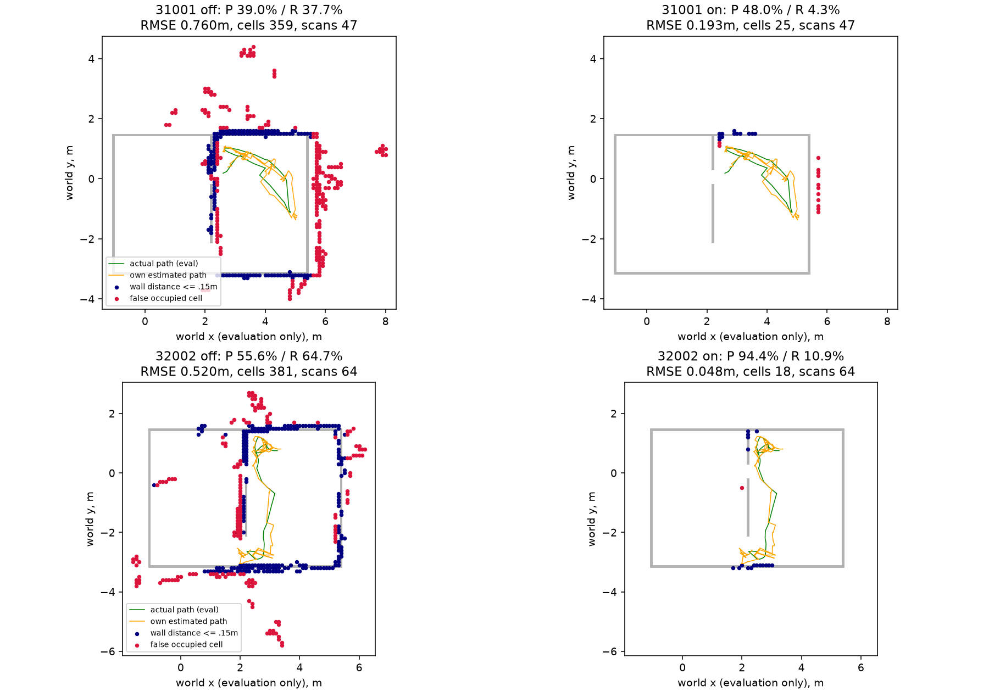
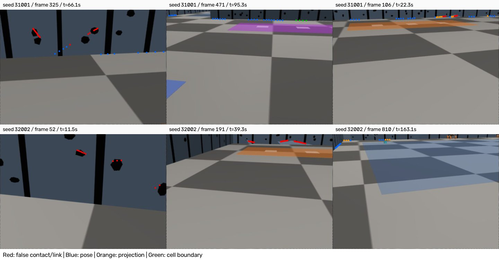

# egomap35 — 거짓 점유 셀 원인 분해 (오프라인)

2026-10-08, egomap34 후속. 새 물리/렌더/모델/잠금 **0**. S2 잠금은 건드리지 않는다.
seed31001 (`outputs/active-frontier-audit-v1/new-seed`)과 seed32002
(`outputs/wall-segment-dev-v1/new-seed`)의 봉인된 지도·삽입 원장·RGB만 재생한다.
47/64 삽입 프레임, 기존 pose/weight/graph를 고정한다. 두 seed 결과를 합산하지 않는다.

## 진단 규칙 — 구현·결과 전

- 기존 전체 벽거리 .15m 밖의 양수 log-odds 셀이 분모. weighted_insert의
  프레임당 최대 hit/free, hit 우선, clamp를 그대로 재생하고 기존 모든 셀 값과 대조.
  free가 양의 증거를 지우면 출처 질량도 비례 감소한다. 마지막에 남은 양의 증거로
  셀별 원인 분율을 기록하고, 가장 큰 원인을 그 셀의 대표 분류로 쓴다(혼합도 별도 기록).
- (b) 같은 접점을 GT 차체 SE(2)에 놓으면 .15m 안으로 복구.
  (c) GT 실제 카메라로 같은 픽셀을 재투영하면 복구하거나, 실제 벽-바닥 접점과
  2px 이내인데 투영 거리만 벗어남. 거리 구간도 기록한다.
  (d) RGB 및 평가용 기하로 물체/로봇임을 확인한 검출.
  (a) 위 세 경우가 아니며 바닥/벽 내부의 잘못된 경계를 검출한 경우.
  GT 자세에서도 벽이 아니라는 사실 **하나만으로** (a)/(c)/(d)를 구별하지 않는다.
- 양자화만으로 허용거리 밖에 나온 셀은 별도 `cell_boundary`, 물체의 정확한
  가림 등 저장 자료로 판별 불가능하면 `unresolved`로 남긴다. 억지로 4개에 배분하지 않는다.
  보간된 선분 내부의 역투영 픽셀은 실제 독립 검출 열이 아님도 명시한다.
- 카메라 GT, 차체 GT, 정적 벽·물체는 **평가 코드에서만** 읽는다. MuJoCo import/실행0.
  기존 잠재 가시 영역(실제 카메라 FOV+벽 가림, 물체 가림 미포함), 전체329표본,
  .15m 허용거리, 모든 지표 정의는 그대로 유지한다.

진단 후 지배 원인에 맞는 표준 방법 하나를 조사하고 옵션/상수/관문을 여기 추가 커밋한 뒤
off/on 결과를 개봉한다. 구현 기본off bytes 동일, 기존 옵션·pose·추정기는 보존한다.
raw는 `/Users/changmin/projects/ugrp/outputs/wall-cell-attribution-v1`.
관련 시험만 초록 후 커밋·push, PR405 DRAFT, TensorBoard 생략 유지.

## 진단 결과와 다음 비교 사전 등록

진단 소스 `70195c95`, 관련2시험 통과. 모든 free/occupied 셀의 재생 값이 원본과 정확히 같다.
분모는 최종 거짓 셀219/169개. 대표 원인(최대 잔존 증거)의 비율:

|원인|seed31001|seed32002|
|---|---:|---:|
|(a) 검출/선분 연결 오류|95 / 43.38%|87 / 51.48%|
|(b) 자세 오차|111 / 50.68%|58 / 34.32%|
|(c) 거리·카메라 투영|7 / 3.20%|7 / 4.14%|
|(d) 물체 확인|0 / 0%|0 / 0%|
|셀 경계 양자화|6 / 2.74%|17 / 10.06%|
|미판별|0|0|

이는 순서를 고정한 **조작적 원인 분해**이며 유일한 인과 분해가 아니다. 혼합 셀의 분율도
JSON에 별도로 보존한다. (a)의 예: 벽 무늬 윗경계, 서로 떨어진 무늬를 연결한 선분이
바닥 접점으로 취급됨. RGB에 접점 역투영을 겹친42/49프레임 전체 contact sheet를 확인했다.
(d)=0은 이 잔존 거짓 셀에서 확인된 물체가 없다는 뜻이며 완전한 semantic GT가 아니다.
움직인 cyan은 기록된 OBB, 고정 peer는 보수적 envelope로 후보를 검사했다. peer의 실제
관절 상태는 저장되지 않아 정확한 가림 판정은 불가하다. 그 후보에 걸린 잔존 증거는0이었다.
바닥/벽 무늬는 RGB와 벽-바닥 접점 선 대조로 확인했다. (a)는 순수 픽셀 검출과 선분 연결을
분리하지 않는다. 거리별 분율 표는 `results/*-diagnosis.json`에 보존한다.

### 선택: 다중 관측 support-weight 문턱 (구현·on 결과 전 고정)

새 seed에서는(a)가 가장 크며 기존 seed에서도43.4%다. 따라서 한 번의 잘못된 접점을
벽으로 확정하지 않는 **Open3D TSDF의 support-weight 추출 문턱**을 이식한다.
3D TSDF 전체를 새로 만들거나 기존 RGB 검출기를 재튜닝하지 않는다.

- `wall_validation=multiview_weight_v1`, 기본 `off`.
- Open3D v0.19.0: 관측별 `weight += 1`, 추출 기본 `weight_threshold=3.0`,
  실제 코드의 비교는 **weight > 3**(즉 단위 증거4회). 문턱3을 결과 후 바꾸지 않는다.
- 우리 sparse 2D 벽 관측에 필요한 이식 차이: TSDF의 zero-crossing 후보 대신 기존
  양수 occupancy 셀을 후보로 하고, 동일 프레임/셀은1회만 센다. 서로 다른 위치·방향의
  지지를 위해 이전 채택 시점 모두와 카메라 이동≥격자1칸(.1m) **또는** 셀에 대한
  방위차≥atan2(.1m, 두 거리 중 작은 값)를 요구한다. 이는 우리 격자에서1칸 시차라는
  기하 기준이며 Open3D의 기본값이라고 주장하지 않는다. 제자리 동일 RGB 중복은 가산0.
- 기존 hit/miss·clamp·가중치는 바꾸지 않는다. raytrace로 log-odds≤0이 되면 지지 이력도
  초기화한다(재등장 물체에 오래된 지지를 재사용하지 않는 2D occupancy 적응).
  지지 미달 양수 셀은 **unknown**으로 내보내며 free로 바꾸지 않는다.
- RBPF/prob/graph와 조합 가능한 **지도 출력 검증 옵션**. off는 입력 객체/bytes 그대로.
  on은 own ledger의 추정 pose만 사용하고 frontend/RNG/탐색/정합에 피드백하지 않는다.
  따라서 이번은 고정 자세의 지도 표현 비교이며 폐루프 재검증으로 확대하지 않는다.
- 두 녹화 off/on 1회. 기존 영역/전체P/R·329표본·벽RMSE·거리별 결과·남은 셀·프레임을
  함께 보고한다. **기존 egomap20 절대관문 P≥.90, R≥.70, 벽RMSE≤.15m 그대로**.
  각 녹화별3항목, 결과 후 문턱 변경/재튜닝0. 미달이면 한계 기록 후 종료한다.

출처: [Open3D Model.h v0.19.0](https://github.com/isl-org/Open3D/blob/v0.19.0/cpp/open3d/t/pipelines/slam/Model.h#L97)
97–106행(기본 추출 문턱), [VoxelBlockGridImpl.h](https://github.com/isl-org/Open3D/blob/v0.19.0/cpp/open3d/t/geometry/kernel/VoxelBlockGridImpl.h#L265)
265–266행(단위 지지), 1029–1039·1101–1120행(strict support 문턱+TSDF 영교차).
[공식 API](https://www.open3d.org/docs/release/cpp_api/classopen3d_1_1t_1_1pipelines_1_1slam_1_1_model.html)는
작은 weight의 표면 잡음 제거 목적을 명시한다. MIT 원본·해시는 `third_party/wall_support/`.
추가 설치/venv 변경0. 논문의 수치나 전체 TSDF와 동등 성능은 주장하지 않는다.

구현 소스 `ff716a23`의 첫 predict는 NumPy cell 정수의 JSON 직렬화 오류로 봉인 전에 실패했다.
해당 미봉인 `outputs/wall-cell-attribution-v1/31001`은 그대로 보존하고 평가에 사용하지 않는다.
뒤따른 score도 seal 부재에서 중단했으며 GT 평가는 시작되지 않았다. 정수 직렬화만 수정하고
on snapshot JSON 검사를 추가했다. 알고리즘/문턱은 변경0; 재생은 새 `predictions/`에 저장한다.

## off/on 결과 — 두 녹화 모두 관문 미달

방법·문턱 사전 등록 **`1ce46372`**, 봉인 재생 소스 **`a8d11d91`**.
`compare.py predict`는 own ledger/지도/공분산 해시만 읽고 두 출력을 봉인했다.
그 뒤 `score`에서만 GT를 읽었다. 기존 추정 pose·공분산·그래프·입력 이미지 변경0,
off 지도 JSON은 원본과 **바이트 동일**, on의 남은 셀 값과 모든 free 셀도 그대로다.
원본 pose 재추정이나 물리 재생이 아니라 **동일 추정 자세에서 지도 출력 검증의 효과**다.

|녹화·조건|전체 P (맞는/점유 셀)|전체 R=덮임 (표본/329)|벽 RMSE|영역 P (셀)|영역 R (표본)|
|---|---:|---:|---:|---:|---:|
|31001 off|39.00% (140/359)|37.69% (124/329)|0.7599m|56.76% (42/74)|52.10% (62/119)|
|31001 on|48.00% (12/25)|**4.26% (14/329)**|0.1929m|60.00% (3/5)|**0% (0/119)**|
|32002 off|55.64% (212/381)|64.74% (213/329)|0.5204m|63.58% (103/162)|76.03% (111/146)|
|32002 on|94.44% (17/18)|**10.94% (36/329)**|0.0479m|92.86% (13/14)|**16.44% (24/146)**|

각901 RGB / 891 제어프레임, 삽입47/64프레임. 실제 이동8.053/7.449m,
footprint 덮은 면적2.390/2.2675m²도 변경0이다. 영역 분모는 기존 잠재 가시119/146개,
전체329개 중36.17/44.38%에 해당한다. 영역P는 벽 가림/FOV 조건에 든 **지도 점**,
영역R은 가시 **GT 벽 표본**을 분모로 해서 31001 on의 P60%와 R0%는 모순이 아니다.
GT 벽의 반대 면 부근이나 기존 관측 영역 밖의 점은 전체P/R에만 포함될 수 있다.

**기존 절대관문:** 31001 **0/3**, 32002 **2/3**(P·RMSE만); 세 기준 동시 통과 **0/2**.
새 seed on의 P94.4%는 전체18칸·덮임10.9%뿐이며 전체 지도 품질 성공으로 보고하지 않는다.
결과 후 문턱 변경0, 추가 방법/재튜닝0, 새 물리0. 기본off 유지, 채택·F 내보내기 착수 없음.

### 무엇을 지웠고 무엇이 남았나

|지표|31001|32002|
|---|---:|---:|
|거짓 셀 off→on|219→13|169→1|
|남은 거짓 원인|자세13|셀 경계1|
|검출 원인 셀 off→on|95→0|87→0|
|지지1 / 2 / 3 / 4 / 5 / 6회 셀|224 / 71 / 39 / 16 / 7 / 2|255 / 79 / 29 / 12 / 3 / 3|
|같은 시점 계열로 지지 중복 제외|136|192|
|free 증거로 지지 초기화|31|63|

3회 이하가334/359=93.0%, 363/381=95.3%다. 오검출 제거는 되지만 맞는 벽도 충분히
다른 시점에서 같은 칸에 재관측되지 않는다. 잔존13개 자세 원인 셀처럼 **지속되는 자세
편향은 여러 번 관측해도 지지될 수 있다**. 위치를 고치지 않는 다중 관측 필터의 한계다.
이것이 이번 실패 원인이며 support 문턱을 낮추어 결과를 덮지 않는다.

### 거리별 거짓 증거 (셀 분율; 단순 프레임 수 아님)

|녹화 / 거리|검출|자세|거리·투영|물체|셀 경계|
|---|---:|---:|---:|---:|---:|
|31001 / 0–1m|2.92|16.32|0|0|0.50|
|31001 / 1–2m|43.20|48.47|2.45|0|2.99|
|31001 / 2–3m|15.00|36.27|0.14|0|4.18|
|31001 / 3–4m|33.95|6.63|5.98|0|0|
|32002 / 0–1m|19.80|12.09|0|0|5.57|
|32002 / 1–2m|30.06|12.54|0|0|3.04|
|32002 / 2–3m|15.67|20.07|0|0|9.17|
|32002 / 3–4m|21.33|10.74|7.83|0|1.08|

멀리서 투영 오차가 커지지만 이 분해에서는 검출·자세의 비중이 더 크다.
대표 원인의 정수 셀 비율과 위 혼합 증거 분율은 다른 집계이므로 서로 합산하지 않는다.

### 삽입 관문 확인 (감독 지시 유지)

두 실행 모두 egomap26의 `gmapping_range_v1` + `insert_selective_v1`이 켜져 있다.

|단계·사유|31001|32002|
|---|---:|---:|
|RGB / 초기 대기|901 / 10|901 / 10|
|검출 geometry / empty|891 / 0|878 / 13|
|GMapping 이동 보류|844|814|
|admitted=inserted|47|64|
|bootstrap / improved proposal|1 / 22|1 / 30|
|low_overlap / high_residual / search_boundary|8 / 14 / 2|7 / 19 / 2|
|insufficient_match_points 보류 후 삽입|0|5|
|거부 상태이지만 삽입됨|24|28|
|거부 시 재표본·센서 가중 갱신|0 / 0|0 / 0|

이번 옵션은 삽입 수를 줄이는 옵션이 아니라 **출력 벽의 관측 지지 검사**다.
공통 이동 관문1.0m/0.5rad/temporal off와 각도 창 등은 변경하지 않았다.

## 그림·사용·검증





```python
from harness.self_wall_memory_validation import SelfWallMemory
memory = SelfWallMemory('r3', self_map='odom_grid_v1',
    pose_correction='own_map_rbpf_v1', wall_validation='multiview_weight_v1')
# 기존 command/observe_wall 경로. GT/타 로봇 지도는 받지 않는다.
grid, support = memory.validated_map()  # snapshot도 검증된 벽 텍스트/구조를 포함
```

기존 robust memory의 motion_model/loop_rejection/wall_evidence/pose_graph와 조합 가능.
기본off는 이전 메모리에 그대로 위임한다. 기존 frozen 물리 실행기나 다른 트랙 기본값은
수정하지 않았다. 재생 CLI는 `code/compare.py predict` → `score`, predict 결과가 존재하면
재덮어쓰기 대신 거부한다. 완성 출력은 이미 봉인돼 있어 다시 predict하지 않는다.

- 관련 **10시험 통과**: 새 지지 문턱·중복 시점·free clearing·peer 거부·입력 불변·off bytes·
  on JSON, 출처 질량 보존/격자 동일, 기존 선분 지도 회귀. 전체 CI는 별도다.
- `code/record.py`는 양수/음수 칸과 pose 메타데이터·셀 원인 합계·raw SHA를 검증했다.
  그림에서 경기장 밖 거짓 셀이 잘리지 않도록 축만 확대했고, 확대 전후 결과 JSON bytes는 같다.
- raw 셀마다 모든 출처/분율은 `outputs/wall-cell-attribution-v1/*-false-cells.json`.
  두 지도의 봉인은 `predictions/<seed>/seal.json`. 원본 녹화/미봉인 첫 실패 모두 보존.
  raw 비로그 파일 SHA는 `artifacts.sha256.json`, 요약은 `results/verification.json`.
  42/49프레임 전체 시각 감사는 raw `audit-<seed>-*.jpg`. raw는 로컬 보관이며 원격 백업 아님.
- 물리/렌더/모델0, agent_lock 획득0, 다른 작업 프로세스 변경0. PR405 DRAFT/병합0.
