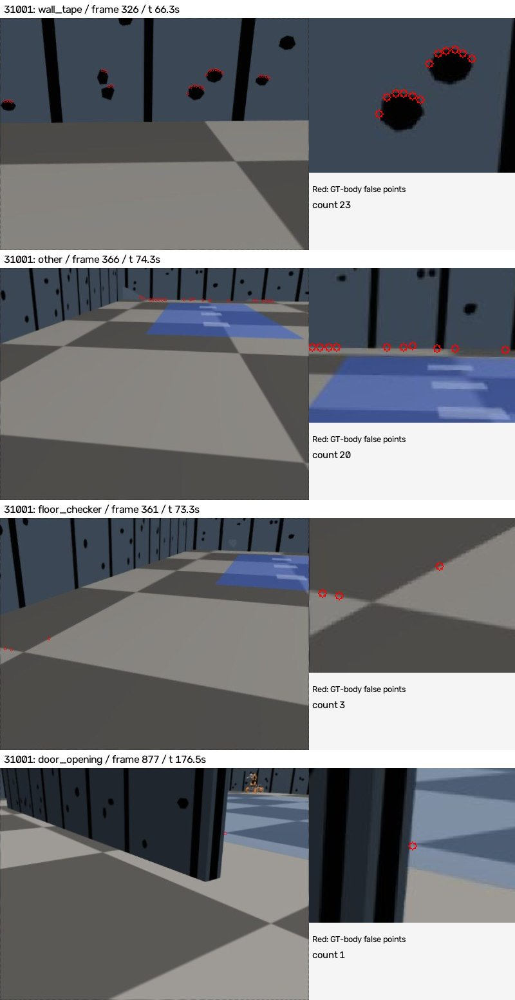
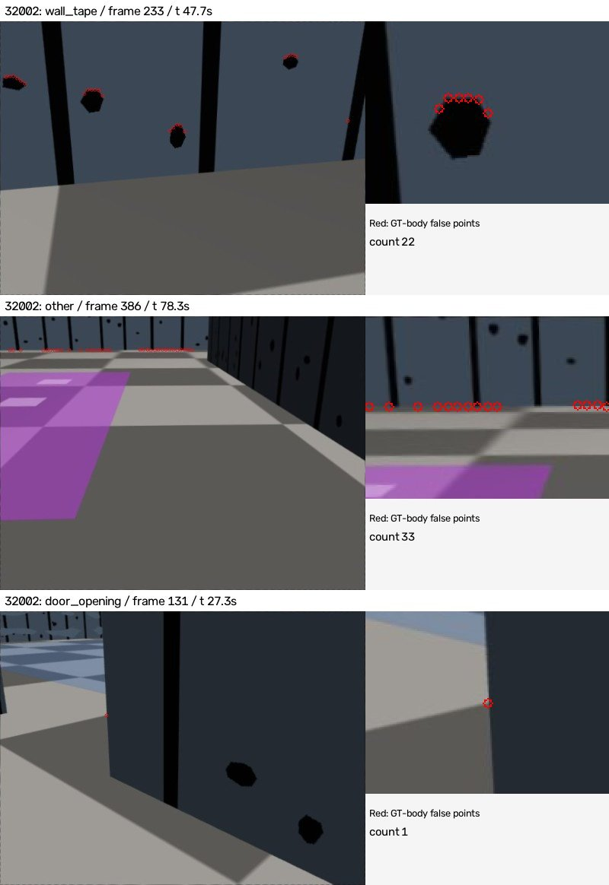
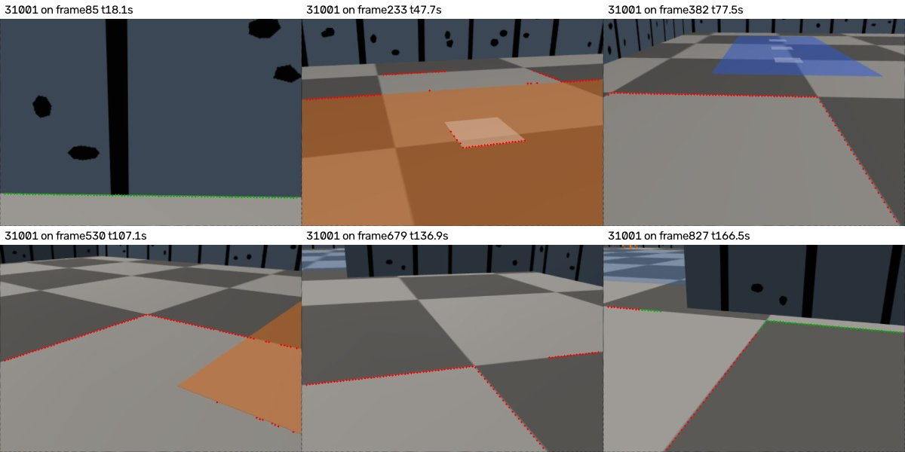
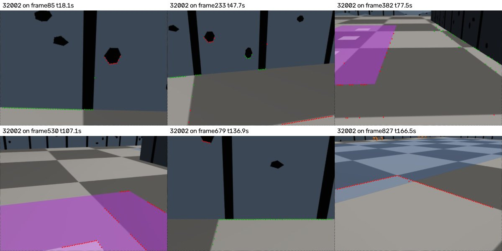
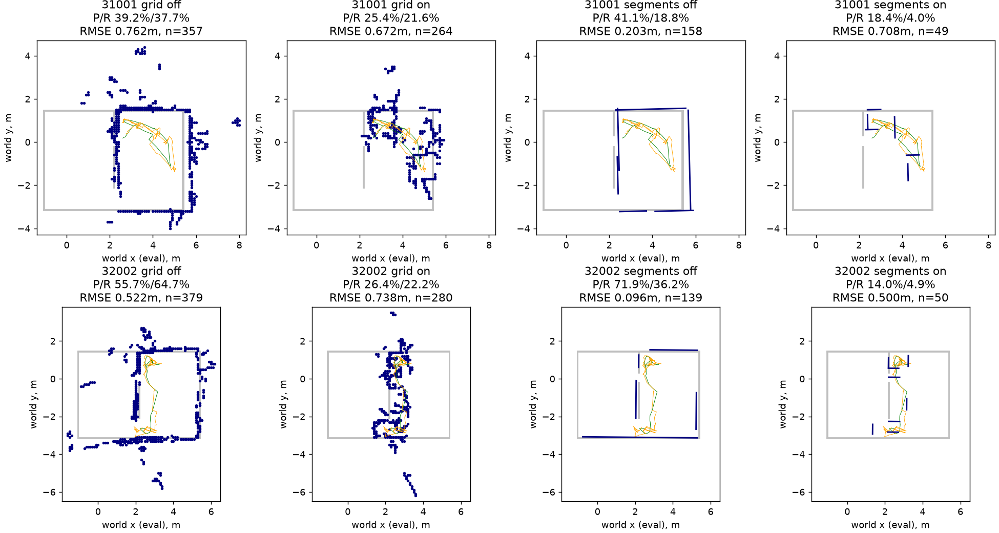

# egomap37 — 실제 검출 접점의 오검출 유형과 검출 단계 비교

2026-10-08, egomap36 후속. 오프라인 RGB/원장 재생만, 물리·렌더·모델·잠금0.
PR405 DRAFT 유지. 다른 worktree/PR406 파일 수정0. TensorBoard 생략 유지.

## 진단·비교 사전 등록

- seed31001 개발, seed32002는 이번 방법/설정 선정에서 보류한다. 둘 다 과거에 본 녹화라
  독립 확증 자료가 아니다. 사용자 요청대로 두 seed의 **기존 off 오검출 분류**는 먼저
  확인할 수 있으나 on 결과를 보고 방법·문턱을 다시 고르지 않는다.
- 원 자료: `outputs/active-frontier-audit-v1/new-seed`,
  `outputs/wall-segment-dev-v1/new-seed`. RGB901씩 중 기존 초기대기10을 제외한891프레임.
  기존 detector→면 연결→양의 깊이/4m를 통과한 **실제 열 접점**을 센다.
  선분 사이 보간점이나 최종 거짓 셀 비율(egomap35의43–52%)을 이 분모에 합치지 않는다.
- GT 차체 SE(2)에 놓아도 벽거리>.15m인 점을 분류 대상으로 한다. GT는 평가에만.
  저장된 실제 카메라/벽·상자/벽 무늬 배치와 RGB를 대조한다. 새 렌더/MuJoCo0.
  바닥 체크 / 색 구역 / 다른 로봇 / 상자 / 문 개구부 / 벽 테이프 / 화면 가장자리 /
  기타(투영 잔차·미판별 포함)의8종을 모두 보고한다. 이미지 가장자리라는 사실만으로
  렌즈 오차라고 단정하지 않으며 실제 카메라 재투영으로 복구된 것은 기타/투영 잔차다.
  상위 유형은 예시 RGB와 확대 그림을 남기고 기하 자동 분류의 한계를 명시한다.
- 새 표준법은 개발 진단의 지배 유형에 맞춰 **기존 구현 하나를 재사용**한다.
  조사/이식 차이/상수/옵션을 먼저 추가 커밋한 뒤 on 재생. 기본off bytes 동일.
  이미 실패한 `floor_boundary_v1`/기존 다중시점·선분 옵션을 재튜닝하지 않는다.
- 자세와 삽입 시간은 기존 실제 원장47/64프레임으로 고정한다. RGB 검출을 다시 하고
  동일 프레임·동일 추정 자세/공분산에서 grid/`segments_v1`을 만든다.
  `multiview_weight_v1`/PR 운영점 필터는 끈다. 순수 검출 변화 효과만 비교하며
  RBPF 재추정/폐루프 개선으로 주장하지 않는다. 센서 가중식은 기존 그대로 재계산한다.
- 검출 점 P/RMSE는 GT 차체 자세에서 평가, 지도 P/R/RMSE는 출발 GT 변환만 쓴다.
  .1m 칸·.15m 허용거리·329 GT벽 표본 R·기존 잠재가시 분모 그대로.
  선분 연속 .05m 표본도 별도로 기록한다. 점 수·검출/삽입 프레임 수·범위를 함께 보고한다.
- 개발 on 확인 → 코드/상수/설정 동결 커밋 → 32002 on1회 평가. 미달도 끝까지 표에
  기록하되 사후 수정0. 서술용 개선 기준은 검출 P≥.90 및 off 대비 비감소,
  지도 절대기준은 egomap20의 P≥.90/R≥.70/RMSE≤.15m 그대로다.
  빈 출력은 P=NA이며 통과하지 않는다. raw는 새 경로에만 쓰고 기존 파일 삭제/덮어쓰기0.

raw `/Users/changmin/projects/ugrp/outputs/wall-contact-types-v1`.
관련1–3시험파일 통과 후 커밋·push(Codex trailer), 단계마다 감독 파일 확인.
Google Drive0·유료/원격 계산0·force/reset0·원격 백업 주장0.

## off 진단과 방법 고정 (on 결과 전)

사전 등록 `56860d86`, off 접점 봉인/분류 소스 `73427fbf`.
GT 차체에서 틀린 실제 접점은 31001 **3,059/53,232 (P94.25%)**,
32002 **5,056/56,162 (P91.00%)**다. 최종 거짓 셀의43–52%와 다른 분모다.

|오검출 유형|31001 개수 / 거짓점 비율|32002 개수 / 거짓점 비율|
|---|---:|---:|
|바닥 체크 경계|30 / .98%|0|
|색 구역 경계|0|0|
|다른 로봇|0|0|
|상자|0|0|
|문 개구부|1 / .03%|2 / .04%|
|벽 테이프 무늬 가장자리|**2,201 / 71.95%**|**3,180 / 62.90%**|
|화면 가장자리/support|0|0|
|기타|827 / 27.03%|1,874 / 37.06%|

기타 중738/1,754점은 실제 카메라로 재투영하면 복구되는 투영 잔차이며,
나머지는 벽/배경 미판별76/102·벽 접점 혼합경계13/18이다.
지도 삽입 원장47/64프레임만 보면 실제점3,054/4,313, GT 차체 오검출267/437이며
그 중 테이프239/339(89.51/77.57%)다. RGB 예시에서 검은 patch **윗변**을
벽–바닥 접점으로 잡는 것을 확인했다. 바닥 체크/색 구역이 지배 원인이라는 가설은 기각한다.
자동 분류 규칙·한계는 [REFERENCES](REFERENCES.md), 전체 분모/예시는 `results/`에 보존.

### 선택한 방법·동결 상수

`wall_detector=appearance_contact_v1`, 기본off. Ulrich–Nourbakhsh §3–4의
바닥 외형 분할→**열별 최하단 장애물 접점** 기존 구현 `floor_boundary_v1`을
현행 SEARCH 명령 FK/강성 on 녹화 경로에 그대로 연결한다. 내부 무늬의 윗변이 아닌
분할된 벽 영역의 바닥 쪽 끝을 사용한다. 새로 검출기를 만들거나 기존 v1을 튜닝하지 않는다.
원본은 장애물 분할이며 다른 색 바닥·물체를 벽으로 오인할 수 있다. 그 실패도 그대로 센다.

|설정|고정값·출처|
|---|---|
|Gaussian / histogram smoothing|5×5 / 5 bin, 기존 CONFIG 그대로|
|H/I count 문턱|60 / 80, 논문·기존 구현 그대로|
|HSI bin / hue 유효성|256 / I>10/255·S>.1, 기존 공학상 선택|
|RGB 바닥 참조|명령 카메라 기준 전방.30–1.00m·좌우±.30m, 최소1024px|
|투영/연결|positive depth·4m·기존 최소4열·범위/방위 연결 그대로|
|기존 실패/기존 옵션|egomap10 `floor_boundary_v1` 실패·상수 보존, off 기존 scan/출력 bytes 동일|

**가중치 비교의 제한:** 원본 confidence는 scan 정합 **전** 예측 입자 공분산을 썼지만
녹화에는 scan **후** frontend 공분산만 저장됐다. 새 검출에는 원본의 segment별 가중치를
정확히 대응시킬 수 없다. 따라서 paired off/on은 둘 다 저장된 같은 frontend 공분산·yaw로
기존 inverse sensor 식을 재계산한다(새 공식/계수0). 원본 grid도 별도 역사 기준선으로
표에 남기고 bytes 보존한다. 이 재계산 차이를 검출기 효과로 합치지 않는다.
선분도 같은 공분산·같은 시간·같은 추정 pose로 비교한다. 지도 P/R/RMSE는 원본 loop0
추정 경로에 조건화된 검출 표현 비교이며 새 RBPF/탐색 성공이 아니다.

## 31001 개발 결과·32002 설정 동결

실행 소스 **`26a007d7`**. 관련16시험 통과 후 own-only 예측 봉인, 그 뒤 GT 평가.
on 검출점 P가 **94.25→17.44%**, 점53,232→77,109개, RMSE.1859→.7276m로
악화되어 검출 관문 미달이다. 빈 출력으로 생긴 실패가 아니라 잘못된 접점이 증가했다.

|31001 표현|paired off P / R / 벽 RMSE|on P / R / 벽 RMSE|평가 표본수 off→on|
|---|---:|---:|---:|
|칸|39.22% / 37.69% / .7621m|25.38% / 21.58% / .6722m|357→264칸|
|선분→칸|41.14% / 18.84% / .2032m|18.37% / 3.95% / .7081m|158→49칸|

원본 칸은 P39.00%/R37.69%/RMSE.7599m/359칸으로 별도 보존했다.
정합 후 공분산을 공통 사용한 paired off와 숫자가 다름을 숨기지 않는다.
검출 nonempty891/891, 삽입 시각47/47은 off/on 동일.
실패 후 방법/문턱 변경0. [freeze.json](freeze.json)에 기존 CONFIG와 코드 해시,
개발 결과 해시를 먼저 커밋한 뒤 **32002 on1회**를 한다.
이것은 개발 통과로 진행하는 확증이 아니라 사용자 요청의 고정 비교이며 재튜닝하지 않는다.

## 32002 1회 평가와 최종 판정

동결 커밋 **`c015f76d`**를 push한 뒤 같은 SHA의 on 예측을 봉인하고 평가1회.
예측에는 own RGB/명령/기존 추정 원장만, 아래 점 판정에만 GT 차체 자세를 사용했다.

|seed·조건|검출점 P (정확/전체)|검출점 RMSE|nonempty / 891|삽입시각 점 P (정확/전체)|
|---|---:|---:|---:|---:|
|31001 off|94.25% (50,173/53,232)|.1859m|891|91.26% (2,787/3,054)|
|31001 on|**17.44% (13,451/77,109)**|.7276m|891|29.00% (1,085/3,741)|
|32002 off|91.00% (51,106/56,162)|.2263m|878|89.87% (3,876/4,313)|
|32002 on|**36.07% (26,862/74,479)**|.4882m|889|46.86% (2,475/5,282)|

|seed·표현|paired off 전체 P / R=덮임 / RMSE|on 전체 P / R=덮임 / RMSE|표본수 off→on|
|---|---:|---:|---:|
|31001 칸|39.22% / 37.69% / .7621m|25.38% / 21.58% / .6722m|357→264칸|
|31001 선분→칸|41.14% / 18.84% / .2032m|18.37% / 3.95% / .7081m|158→49칸|
|32002 칸|55.67% / 64.74% / .5217m|**26.43% / 22.19% / .7382m**|379→280칸|
|32002 선분→칸|71.94% / 36.17% / .0962m|**14.00% / 4.86% / .5003m**|139→50칸|

원본32002 칸은 P55.64%/R64.74%/RMSE.5204m/381칸(바이트 보존), 위 paired off는
같은 후공분산으로 재계산한 비교다. 원본 값·paired 값을 합치지 않는다.
선분 개수/총길이는31001 6개/15.454m→6개/4.165m,
32002 5개/13.176m→8개/4.489m다. 전체 R 분모는 모두329개다.

|seed·표현|영역 P off→on (on 정확/칸)|영역 R off→on (on 덮은/가시)|
|---|---:|---:|
|31001 칸|57.53→17.42% (31/178)|52.10→21.01% (25/119)|
|31001 선분→칸|4.65→4.76% (2/42)|25.21→2.52% (3/119)|
|32002 칸|63.58→27.93% (62/222)|76.03→30.14% (44/146)|
|32002 선분→칸|65.49→14.00% (7/50)|52.05→5.48% (8/146)|

영역P는 가시 지도 점, 영역R은 잠재가시 GT 벽 표본 분모(물체/차체 가림 제외)다.
실제 이동8.053/7.449m·footprint 면적2.390/2.2675m²·잠재가시119/146개 그대로이며
새 탐색/위치 성능 결과가 아니다. seed를 합산하지 않는다.
선분의 .05m 연속 표본 보조 지표(P/R/RMSE)는31001
41.51/20.67%/.1992m→17.39/3.65%/.7168m(318→92점),
32002 99.63/46.50%/.0795m→17.82/6.08%/.4787m(272→101점).
유리한 표현을 골라 판정을 바꾸지 않는다.

**검출 관문0/2, on 지도 절대관문 칸0/2·선분0/2(각 항목0/3).**
기존 알고리즘의 직접 이식은 이 조건에서 실패했다. 기본off 유지, 채택/물리 재검증0,
새 문턱/학습/필터 조합/모듈F 내보내기0. 실패 결과를 더 튜닝해서 덮지 않고 종료한다.

### RGB로 확인한 실패 유형

off의 지배 유형은 벽 테이프 윗변이다. on에서는 바닥 참조의 외형 분포가 전체 체크/색
구역을 대표하지 못해 **바닥 경계를 최하단 obstacle로 선택**했다. 고정 시간6분위
예시에서31001 거짓422점은 체크335/색87, 32002 거짓232점은 체크95/색114/벽무늬23이었다.
이는6프레임 보조 감사이며 전체891프레임의 유형 비율로 확대하지 않는다.
벽과 바닥의 외형이 비슷한 일부 장면에서는 검은 patch의 아랫변도 남는다.
바닥 히스토그램 방식이 본질적으로 semantic wall 분류는 아니라는 원문의 제한과 일치한다.







### 삽입 관문·기존 출력 보존

|원본 단계|31001|32002|
|---|---:|---:|
|RGB / 초기 대기|901 / 10|901 / 10|
|검출 geometry / empty|891 / 0|878 / 13|
|GMapping 이동 보류|844|814|
|원장 삽입|47|64|
|bootstrap / improved|1 / 22|1 / 30|
|low_overlap / high_residual / search_boundary|8 / 14 / 2|7 / 19 / 2|
|점 부족 정합 미시도 후 삽입|0|5|
|명시 거부 후 삽입 / 거부 시 재표본|24 / 0|28 / 0|

egomap26 `gmapping_range_v1`와 `insert_selective_v1` 모두on, 이동1m/.5rad·temporal off.
이번에는 그47/64삽입 시각을 고정했고 on에서도 모두 nonempty였다. 다른 프레임의 새 검출을
지도에 추가하지 않았다. off `observe` 출력은 실제47/64개 입력 모두 원본과 같고,
원본 grid JSON bytes·원장 pose·입력 RGB는 불변이다.

## 사용·검증·보존

```python
from harness.active_wall_vision import observe
from harness.self_wall_segment_points import contact_points
observation = observe(own_rgb, commanded_servo, wall_detector="appearance_contact_v1")
points = contact_points(own_rgb, commanded_servo, wall_detector="appearance_contact_v1")
# 인자 생략 또는 "off": 기존 경로·출력 그대로. 새 물리 CLI/번들 변경 없음.
```

실행 순서: `baseline.py <seed>` → `diagnose.py <seed>` →
`compare.py predict 31001` → `score 31001` → freeze 커밋 → `predict 32002` → `score 32002`.
예측/평가 출력은 기존 경로가 있으면 덮어쓰기 거부. 참조 구현/CONFIG는 변경0.
관련3파일 **16시험 통과**: 실제 RGB nonempty off 골든, 기존 알고리즘과 scan bytes 동일,
GT 평가 기하, 기존 선분 회귀. 초기에 fixture의 `__file__` 메타데이터 누락1건을
시험에서 발견해 수정했으며 예측/문턱/알고리즘 수정은 아니고 on 실행 전에 해결했다.
[검증](results/verification.json) / [raw 해시](results/raw-manifest.json).
그림 각1MiB 이하·실험5MiB 이하, 원본 JPEG/점·covariance·로그는 로컬 outputs 보존.
미추적 사용자4파일 불변, 새 의존성/venv 변경0, PR405 DRAFT·병합0.
